## 课程介绍 《探花交友》

- 项目介绍
- 前后端分离开发思想
- 开发工具与环境搭建
- 短信验证码
- 实现用户登录功能

## 1、项目介绍

### 1.1、项目背景

在线社交是互联网时代的产物，已成为互联网用户的基础需求之一。移动互联网自2003年起快速发展，促使在线社交逐渐从PC端转移至移动端。移动社交最初以熟人社交为主，以维系熟人关系、共享资源信息的形式存在。随着人们交友需求的延伸，移动社交开始向陌生人社交、兴趣社交等垂直方向发展，形式丰富多样。

### 1.2、市场分析

探花交友项目定位于 **陌生人交友市场**。

- 根据《2018社交领域投融资报告》中指出：虽然相比2017年，投融资事件减少29.5%，但是融资的总额却大幅增长，达到68%。
- 这些迹象说明：社交领域的发展规模正在扩大，而很多没有特色的产品也会被淘汰。而随着那些尾部产品的倒下，对我们来说就是机会，及时抓住不同社交需求的机会。以社交为核心向不同的细分领域衍生正在逐渐走向成熟化。
- 而我们按照娱乐形式和内容为主两个维度，将社交行业公司分类为：即时通信、内容社群、陌生人社交、泛娱乐社交以及兴趣社交几个领域。
- 而在2018年社交的各个细分领域下，均有备受资本所关注的项目，根据烯牛数据2018年的报告中，也同样指出：内容社交及陌生人社交为资本重要关注领域，合计融资占比达73%。

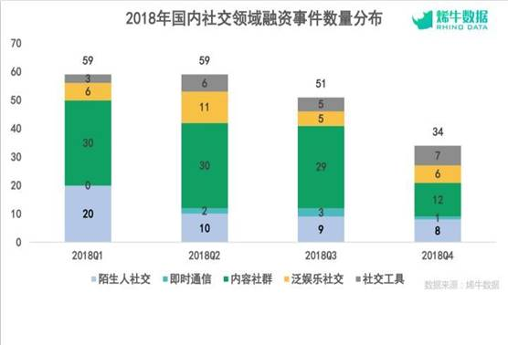

根据市场现状以及融资事件来看：陌生人社交、内容社群、兴趣社交在2019年仍然保持强劲的动力，占到近70%的比例，它们仍然是资本市场主要关注领域。从增长率来看陌生人社交的增长速度远远大于其他几类，因此我们要从这个方向入手。

### 1.3、目标用户群体

从整体年龄段来看：目前目标用户群体主要以30岁以下为主，其中以18-25岁年龄群体为主要受众人群。

- **上班群体：**热衷于通过分享内容或表达“个人情绪”在陌生人面前建立特殊的人设，并借此提升自我价值扩大自己的交际圈；
- **学生群体：**追求个性选择，更倾向找到有共同话题的陌生人对象并建立长期的关系，乐于展现自我；
- **文艺群体：**拥有自己独特的爱好且拥有特别的个人追求，追求文艺圈子内的交流，希望通过分享结交更多好友；
- **沟通弱势群体：**对现有长期保持线上对社交模式表现无力且无效，渴望有更加有效且安全的社交方式出现，解决目前单调乏味的沟通方式；

### 1.4、使用场景

**用户场景一：**

关键词：内向、社交障碍、不主动

大学二年级的陈烨是一位品学兼优且容貌昳丽的小女生，但从小到大的朋友特别少。在聚会时大家都觉得她很高冷，但是陈烨只是不会找时机插不上话，偶尔说上几句也是如细雨飘过。在各类群体社交场合也难以融入人群。

后来，看到室友小白在玩一款陌生人社交软件并引起了她的兴趣，她可以在软件中建立一个内向真实的自己，尝试学会更主动更热情地去了解他人。

但是，玩了一段时间后发现很多陌生人都不愿意与她长聊，或者说聊久了无话可说缺乏话题逐渐变成了好友列表里的一个摆设。

在某乎的某个回答中她看到探花交友App，抱着试一试的心态也尝试着体验了一番，从一开始的每天匹配随心聊天到后来认识到几个有共同爱好的朋友。这同时也让她在社交中慢慢提升自己变得更好。

**用户场景二：**

关键词：分享、互动、娱乐

陈莹是一位初入职场的新人，喜欢看书、听音乐、创作、拍照….几乎对什么都感兴趣，在毕业后她发现认识新朋友，和新朋友一起出去玩的机会越来越少了。朋友圈里的大家都是二点一线的生活，陈莹喜欢晒生活，说趣闻，发心情。但是，对于朋友圈这个“大杂烩”来说，她不想暴露太多的自我。

在一个偶然的机会，她看到微信公众号有一篇关于社交产品的推文，一向对此嗤之以鼻的她突然来了点兴趣。在用了一段时间后，她发现：她每天可以将自己不愿意分享到朋友圈里的内容，分享到社交产品里。而且发几条，发的内容是什么，她也可以经常将自己所想，所写，所拍都上传到“圈子”里。

对于懂这些东西的人，他们会主动的聚集过来讨论。因此，她也加入到某个兴趣小组，时不时与他们在线上探讨一些问题。陈莹不但找到了属于她自己的社交圈子，同时也找到一个可以随时随地分享点滴的平台。

**用户场景三：**

关键词：脱单、脱单、脱单

作为一个直男，宋沌堪称直男教学书一般的案例，他的行为类似下图：

曾谈过几次恋爱，都以迅速失败告终。作为一个长相一般，身家一般，谈吐一般的综合表现男来说，他基本把自己定义成街上一抓一大把的类型。但是，作为一个直男的他也是有个异性梦，每天都梦想着有一个女友，所以他也不断在尝试。

他几乎下载了市面上所有的社交产品，摆上了经过“特殊处理”的自拍照，时不时更新自己的动态。但即便如此，宋沌依然没有几个异性聊友，宋沌也反省过自己，主要是自己每次图一时新鲜，聊一段时间就不感兴趣了，而且由于自己比较害羞所以聊天也容易尬聊。

在朋友的介绍下，他下载了探花APP，由于属于陌生人社交，宋沌可以不用有太多的思想压力，经过几天的好友配对，找到了合适的朋友，每天发一些日常生活的消息，也能获得更多的关注，自信心逐渐增长，聊天技巧也有所提升。

### 1.5、竞争对手分析

#### 1.5.1、竞品选择

根据我们的市场调研以及分析：从产品细分领域以及对应的产品定位来选择，我们选择了社交范围内的兴趣社交App作为竞品分析的案例。

其中，我们发现：市面上的兴趣社交产品还是较多的，例如花田、soul、探探、陌陌等等，最终我们选择了**花田**、**SOUL和陌陌**。

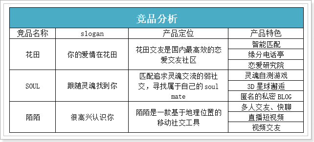

#### 1.5.2、竞品分析

- **花田：**更偏向打造兴趣匹配，并配合线下活动俩者结合提升产品服务。給每一个热爱青年文化的用户营造出归属感，并促使用户自主的生产内容，形成一个良性的娱乐社交平台。

- **SOUL：**更注重用户灵魂（内涵）的产品，一定程度上，SOUL摒弃了传统社交的以颜值优先，内容其次的特点。将自身的个性以及特点先展现出去，然后再以内部算法为匹配手段，通过图文内容进行用户交流。
- **陌陌：**陌陌是一款基于地理位置的移动社交工具。使用者可以通过陌陌认识附近的人，免费发送文字消息、语音、照片以及精准的地理位置和身边的人更好的交流；可以使用陌陌创建和加入附近的兴趣小组、留言及附近活动和陌陌吧。

三款产品各具风格，各有特点，但有一点是三款产品都有一个核心观点，就是：弱化肤浅的目的，利用人类自带的自我认识的本能来结识陌生人。总结而言，就是：希望满足用户『探索自我』的娱乐性。

### 1.6、项目简介

探花交友是一个陌生人的在线交友平台，在该平台中可以搜索附近的人，查看好友动态，平台还会通过大数据计算进行智能推荐，通过智能推荐可以找到更加匹配的好友，这样才能增进用户对产品的喜爱度。探花平台还提供了在线即时通讯功能，可以实时的与好友进行沟通，让沟通随时随地的进行。


### 1.7、技术方案

前端：

- flutter + android + 环信SDK + redux + shared_preferences + connectivity + iconfont + webview + sqflite

后端：

- Spring Boot + SpringMVC + Mybatis + MybatisPlus + Dubbo
- MongoDB geo 实现地理位置查询
- MongoDB 实现海量数据的存储
- Redis 数据的缓存
- Spark + MLlib 实现智能推荐
- 第三方服务 环信即时通讯
- 第三方服务 阿里云 OSS 、 短信服务

### 1.8、技术架构

前端：

- flutter + android + 环信SDK + redux + shared_preferences + connectivity + iconfont + webview + sqflite

后端：

* 采用Dubbo作为微服务架构技术
* 采用RabbitMQ 作为消息服务中间件
* 采用Redis实现缓存的高可用
* 采用Mysql,MongoDB进行海量数据的存储
* 集成第三方应用组件（阿里云，短信，即时通信）
* 基于Spark Mllib推荐系统

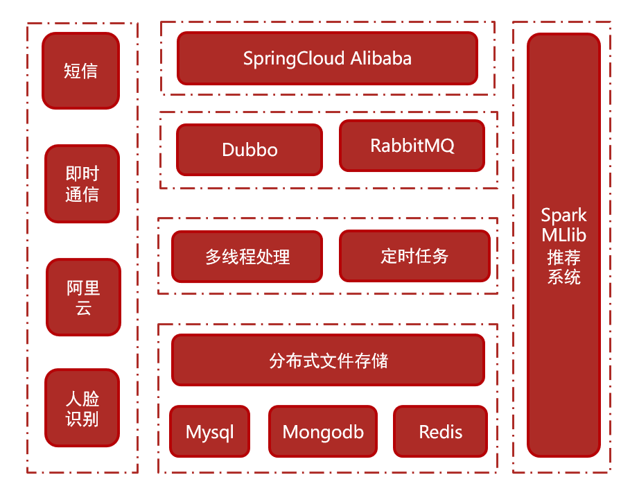 

### 1.9、技术解决方案

- 使用MongoDBgeo实现附近的人的解决方案
- 使用Spark + Mllib实现智能推荐的解决方案
- 使用MongoDB进行海量数据的存储的解决方案
- 使用采用分布式文件系统存储小视频数据的解决方案
- 使用百度人脸识别的解决方案
- 使用阿里云进行短信验证码发送的解决方案

### 1.10、技术亮点

- 采用MongoDB geo实现地理位置查询
- 采用RabbitMQ作为消息服务中间件
- 采用MongoDB进行海量数据的存储
- 采用Spark + Mllib实现智能推荐
- 采用环信服务实现即时通讯
- 采用分布式文件系统存储小视频数据
- 采用SpringCloud Alibaba Dubbo作为微服务架构技术
- 采用SpringBoot + Mybatis实现系统主架构
- 采用Redis集群实现缓存的高可用

## 2、前后端分离开发思想

项目基于前后端分离的架构进行开发，总体包括前端（客户端）和后端（服务端），通常由多人协作开发

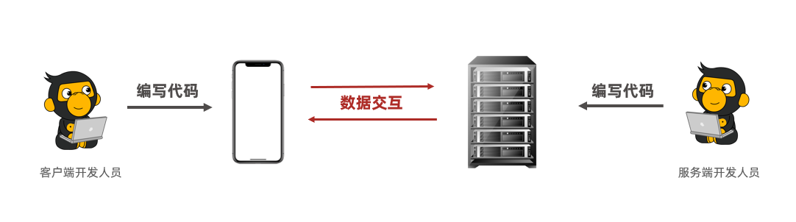

## 3、开发工具与环境搭建

### 3.1、开发工具

#### 3.1.1Linux虚拟机

提供了已经安装好服务的centos7镜像，直接导入到VMware中即可，root用户的密码为root123。

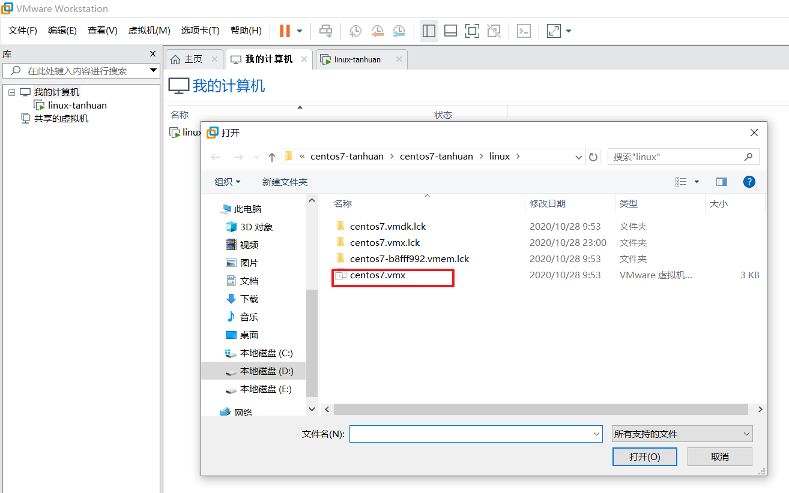

#### 3.1.2 Android模拟器

客户端由前端团队开发，使用APK进行对接，因此需安装安卓模拟器进行测试

–推荐使用网易模拟器，兼容性好

–下载地址：https://mumu.163.com/

#### 3.1.3 postman

Postman是一款Chrome插件，为用户提供功能强大的 Web API & HTTP 请求调试，被500万开发者和超100,000家公司用于每月访问1.3亿个API

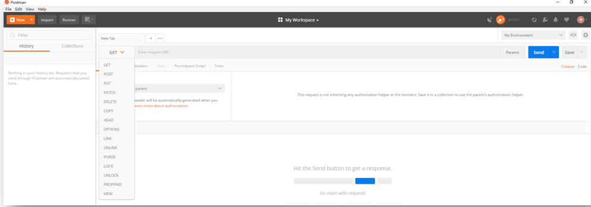

### 3.2、环境搭建

整体项目使用Maven架构搭建

采用聚合工程形式管理模块

为了便于调用，Dubbo需要拆分为接口模块和服务模块

#### 3.2.1 maven工程结构

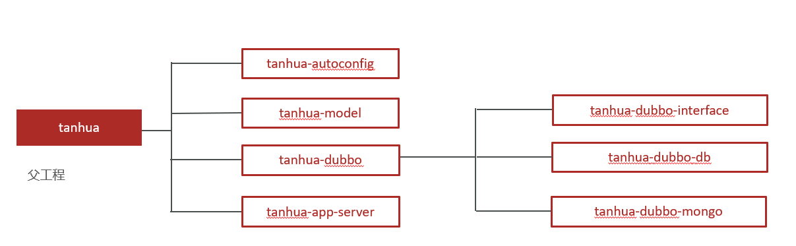

#### 3.2.2 创建模块

| **父工程**      | **工程名称**               | **说明**                       |
|--------------|------------------------|------------------------------|
| tanhua       | tanhua-autoconfig      | 自动装配组件（短信等）                  |
| tanhua       | tanhua-model           | 实体类模块                        |
| tanhua       | tanhua-dubbo           | Dubbo子模块（可以理解为文件夹，管理Dubbo模块） |
| tanhua       | tanhua-commons         | 工具类                          |
| tanhua       | tanhua-app-server      | 与手机端交互的入口模块                  |
| tanhua-dubbo | tanhua-dubbo-interface | Dubbo接口模块                    |
| tanhua-dubbo | tanhua-dubbo-db        | Dubbo服务模块（数据库部分）             |
| tanhua-dubbo | tanhua-dubbo-mongo     | Dubbo服务模块（MongoDB部分）         |

#### 3.2.3 配置依赖

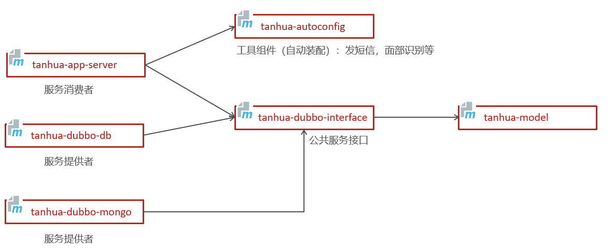

#### 3.2.4 各工程依赖

##### tanhua

```xml

<parent>
    <groupId>org.springframework.boot</groupId>
    <artifactId>spring-boot-starter-parent</artifactId>
    <version>2.3.4.RELEASE</version>
</parent>

<properties>
<maven.compiler.source>8</maven.compiler.source>
<maven.compiler.target>8</maven.compiler.target>
<mysql.version>5.1.47</mysql.version>
<jackson.version>2.11.0</jackson.version>
<druid.version>1.0.9</druid.version>
<servlet-api.version>2.5</servlet-api.version>
<jsp-api.version>2.0</jsp-api.version>
<joda-time.version>2.5</joda-time.version>
<commons-lang3.version>3.3.2</commons-lang3.version>
<commons-io.version>1.3.2</commons-io.version>
<mybatis.version>3.5.6</mybatis.version>
<mybatis.mybatis-plus>3.4.1</mybatis.mybatis-plus>
<lombok.version>1.18.8</lombok.version>
<mongo.version>4.0.5</mongo.version>
<spring-cloud.version>Hoxton.SR10</spring-cloud.version>
<spring-cloud-alibaba.version>2.2.5.RELEASE</spring-cloud-alibaba.version>
</properties>

        <!--通用依赖-->
<dependencies>
<dependency>
    <groupId>org.springframework.boot</groupId>
    <artifactId>spring-boot-starter-test</artifactId>
    <scope>test</scope>
</dependency>
<dependency>
    <groupId>junit</groupId>
    <artifactId>junit</artifactId>
    <version>4.12</version>
    <scope>test</scope>
</dependency>
<dependency>
    <groupId>org.projectlombok</groupId>
    <artifactId>lombok</artifactId>
</dependency>
<dependency>
    <groupId>cn.hutool</groupId>
    <artifactId>hutool-all</artifactId>
    <version>5.4.3</version>
</dependency>
<dependency>
    <groupId>com.alibaba</groupId>
    <artifactId>fastjson</artifactId>
    <version>1.2.8</version>
</dependency>
</dependencies>

<dependencyManagement>
<dependencies>
    <dependency>
        <groupId>io.netty</groupId>
        <artifactId>netty-bom</artifactId>
        <version>4.1.59.Final</version>
        <type>pom</type>
        <scope>import</scope>
    </dependency>

    <dependency>
        <groupId>io.projectreactor</groupId>
        <artifactId>reactor-bom</artifactId>
        <version>2020.0.4</version>
        <type>pom</type>
        <scope>import</scope>
    </dependency>

    <dependency>
        <groupId>io.projectreactor.netty</groupId>
        <artifactId>reactor-netty</artifactId>
        <version>0.9.8.RELEASE</version>
    </dependency>

    <dependency>
        <groupId>org.springframework.cloud</groupId>
        <artifactId>spring-cloud-dependencies</artifactId>
        <version>${spring-cloud.version}</version>
        <type>pom</type>
        <scope>import</scope>
    </dependency>

    <dependency>
        <groupId>com.alibaba.cloud</groupId>
        <artifactId>spring-cloud-alibaba-dependencies</artifactId>
        <version>${spring-cloud-alibaba.version}</version>
        <type>pom</type>
        <scope>import</scope>
    </dependency>

    <dependency>
        <groupId>joda-time</groupId>
        <artifactId>joda-time</artifactId>
        <version>${joda-time.version}</version>
    </dependency>

    <!-- mybatis-plus插件依赖 -->
    <dependency>
        <groupId>com.baomidou</groupId>
        <artifactId>mybatis-plus</artifactId>
        <version>${mybatis.mybatis-plus}</version>
    </dependency>

    <!-- MySql -->
    <dependency>
        <groupId>mysql</groupId>
        <artifactId>mysql-connector-java</artifactId>
        <version>${mysql.version}</version>
    </dependency>

    <dependency>
        <groupId>org.mongodb</groupId>
        <artifactId>mongodb-driver-sync</artifactId>
        <version>${mongodb.version}</version>
    </dependency>

    <dependency>
        <groupId>org.projectlombok</groupId>
        <artifactId>lombok</artifactId>
        <optional>true</optional>
        <version>${lombok.version}</version>
    </dependency>

    <dependency>
        <groupId>org.apache.commons</groupId>
        <artifactId>commons-lang3</artifactId>
        <version>${commons-lang3.version}</version>
    </dependency>

    <dependency>
        <groupId>org.apache.commons</groupId>
        <artifactId>commons-lang3</artifactId>
        <version>3.7</version>
    </dependency>
    <!-- Jackson Json处理工具包 -->
    <dependency>
        <groupId>com.fasterxml.jackson.core</groupId>
        <artifactId>jackson-databind</artifactId>
        <version>${jackson.version}</version>
    </dependency>
    <dependency>
        <groupId>com.alibaba</groupId>
        <artifactId>druid</artifactId>
        <version>${druid.version}</version>
    </dependency>
    <dependency>
        <groupId>commons-codec</groupId>
        <artifactId>commons-codec</artifactId>
        <version>1.11</version>
    </dependency>
</dependencies>
</dependencyManagement>

<build>
<plugins>
    <!-- java编译插件 -->
    <plugin>
        <groupId>org.apache.maven.plugins</groupId>
        <artifactId>maven-compiler-plugin</artifactId>
        <version>3.2</version>
        <configuration>
            <source>1.8</source>
            <target>1.8</target>
            <encoding>UTF-8</encoding>
        </configuration>
    </plugin>
</plugins>
</build>
```

##### tanhua-model

```xml

<dependencies>
    <!--MybatisPlus起步依赖-->
    <dependency>
        <groupId>com.baomidou</groupId>
        <artifactId>mybatis-plus</artifactId>
    </dependency>
</dependencies>

<build>
<finalName>tanhua-model</finalName>
<plugins>
    <plugin>
        <groupId>org.springframework.boot</groupId>
        <artifactId>spring-boot-maven-plugin</artifactId>
        <version>2.3.9.RELEASE</version>
    </plugin>
</plugins>
</build>
```

##### tanhua-autoconfig

```xml

<dependencies>
    <!--阿里云核心API-->
    <dependency>
        <groupId>com.aliyun</groupId>
        <artifactId>aliyun-java-sdk-core</artifactId>
        <version>4.5.3</version>
    </dependency>
    <dependency>
        <groupId>com.aliyun</groupId>
        <artifactId>dysmsapi20170525</artifactId>
        <version>2.0.1</version>
    </dependency>
    <!--阿里云oss存储API-->
    <dependency>
        <groupId>com.aliyun.oss</groupId>
        <artifactId>aliyun-sdk-oss</artifactId>
        <version>3.10.2</version>
    </dependency>
    <!--阿里云人识别-->
    <dependency>
        <groupId>com.aliyun</groupId>
        <artifactId>facebody20191230</artifactId>
        <version>1.0.10</version>
    </dependency>
    <!--百度人脸识别API-->
    <dependency>
        <groupId>com.baidu.aip</groupId>
        <artifactId>java-sdk</artifactId>
        <version>4.8.0</version>
    </dependency>
    <!--springboot基础起步依赖-->
    <dependency>
        <groupId>org.springframework.boot</groupId>
        <artifactId>spring-boot-starter-web</artifactId>
    </dependency>
    <dependency>
        <groupId>com.easemob.im</groupId>
        <artifactId>im-sdk-core</artifactId>
        <version>0.2.5</version>
    </dependency>
    <dependency>
        <groupId>com.aliyun</groupId>
        <artifactId>aliyun-java-sdk-green</artifactId>
        <version>3.6.1</version>
    </dependency>
</dependencies>
```

##### tanhua-commons

```xml

<dependencies>
    <!--工具包-->
    <dependency>
        <groupId>org.apache.commons</groupId>
        <artifactId>commons-lang3</artifactId>
    </dependency>
    <dependency>
        <groupId>commons-codec</groupId>
        <artifactId>commons-codec</artifactId>
    </dependency>
    <dependency>
        <groupId>joda-time</groupId>
        <artifactId>joda-time</artifactId>
    </dependency>
    <!--jwt依赖-->
    <dependency>
        <groupId>io.jsonwebtoken</groupId>
        <artifactId>jjwt</artifactId>
        <version>0.9.1</version>
    </dependency>
</dependencies>
```

##### tanhua-dubbo-interface

```xml

<dependencies>
    <dependency>
        <groupId>com.heima</groupId>
        <artifactId>tanhua-model</artifactId>
        <version>1.0-SNAPSHOT</version>
    </dependency>
</dependencies>
```

##### tanhua-dubbo-db

```xml

<dependencies>
    <dependency>
        <groupId>org.springframework.boot</groupId>
        <artifactId>spring-boot-starter-web</artifactId>
    </dependency>

    <dependency>
        <groupId>com.baomidou</groupId>
        <artifactId>mybatis-plus</artifactId>
    </dependency>

    <dependency>
        <groupId>com.baomidou</groupId>
        <artifactId>mybatis-plus-boot-starter</artifactId>
        <version>${mybatis.mybatis-plus}</version>
    </dependency>

    <dependency>
        <groupId>mysql</groupId>
        <artifactId>mysql-connector-java</artifactId>
    </dependency>

    <dependency>
        <groupId>com.alibaba</groupId>
        <artifactId>druid</artifactId>
    </dependency>

    <dependency>
        <groupId>org.projectlombok</groupId>
        <artifactId>lombok</artifactId>
    </dependency>

    <dependency>
        <groupId>org.apache.commons</groupId>
        <artifactId>commons-lang3</artifactId>
    </dependency>

    <dependency>
        <groupId>com.fasterxml.jackson.core</groupId>
        <artifactId>jackson-databind</artifactId>
    </dependency>

    <dependency>
        <groupId>commons-codec</groupId>
        <artifactId>commons-codec</artifactId>
    </dependency>

    <dependency>
        <groupId>joda-time</groupId>
        <artifactId>joda-time</artifactId>
    </dependency>

    <!-- Dubbo Spring Cloud Starter -->
    <dependency>
        <groupId>com.alibaba.cloud</groupId>
        <artifactId>spring-cloud-starter-dubbo</artifactId>
    </dependency>

    <!-- Spring Cloud Nacos Service Discovery -->
    <dependency>
        <groupId>com.alibaba.cloud</groupId>
        <artifactId>spring-cloud-starter-alibaba-nacos-discovery</artifactId>
    </dependency>

    <dependency>
        <groupId>com.heima</groupId>
        <artifactId>tanhua-dubbo-interface</artifactId>
        <version>1.0-SNAPSHOT</version>
    </dependency>

</dependencies>

<build>
<finalName>tanhua-dubbo-db</finalName>
<plugins>
    <plugin>
        <groupId>org.springframework.boot</groupId>
        <artifactId>spring-boot-maven-plugin</artifactId>
        <version>2.3.9.RELEASE</version>
    </plugin>
</plugins>
</build>
```

##### tanhua-dubbo-mongo

```xml

<dependencies>

    <dependency>
        <groupId>org.springframework.boot</groupId>
        <artifactId>spring-boot-starter-web</artifactId>
    </dependency>

    <dependency>
        <groupId>org.projectlombok</groupId>
        <artifactId>lombok</artifactId>
    </dependency>

    <dependency>
        <groupId>org.apache.commons</groupId>
        <artifactId>commons-lang3</artifactId>
    </dependency>

    <dependency>
        <groupId>com.fasterxml.jackson.core</groupId>
        <artifactId>jackson-databind</artifactId>
    </dependency>

    <dependency>
        <groupId>commons-codec</groupId>
        <artifactId>commons-codec</artifactId>
    </dependency>

    <dependency>
        <groupId>joda-time</groupId>
        <artifactId>joda-time</artifactId>
    </dependency>

    <!-- Dubbo Spring Cloud Starter -->
    <dependency>
        <groupId>com.alibaba.cloud</groupId>
        <artifactId>spring-cloud-starter-dubbo</artifactId>
    </dependency>

    <!-- Spring Cloud Nacos Service Discovery -->
    <dependency>
        <groupId>com.alibaba.cloud</groupId>
        <artifactId>spring-cloud-starter-alibaba-nacos-discovery</artifactId>
    </dependency>

    <dependency>
        <groupId>com.heima</groupId>
        <artifactId>tanhua-commons</artifactId>
        <version>1.0-SNAPSHOT</version>
    </dependency>

    <dependency>
        <groupId>com.heima</groupId>
        <artifactId>tanhua-dubbo-interface</artifactId>
        <version>1.0-SNAPSHOT</version>
    </dependency>
</dependencies>

<build>
<finalName>tanhua-dubbo-mongo</finalName>
<plugins>
    <plugin>
        <groupId>org.springframework.boot</groupId>
        <artifactId>spring-boot-maven-plugin</artifactId>
        <version>2.3.9.RELEASE</version>
    </plugin>
</plugins>
</build>
```

##### tanhua-app-server

```xml

<dependencies>
    <dependency>
        <groupId>org.springframework.boot</groupId>
        <artifactId>spring-boot-starter-web</artifactId>
    </dependency>

    <!--SpringDataRedis依赖-->
    <dependency>
        <groupId>org.springframework.boot</groupId>
        <artifactId>spring-boot-starter-data-redis</artifactId>
    </dependency>

    <!--lombok依赖-->
    <dependency>
        <groupId>org.projectlombok</groupId>
        <artifactId>lombok</artifactId>
    </dependency>

    <!--工具包-->
    <dependency>
        <groupId>org.apache.commons</groupId>
        <artifactId>commons-lang3</artifactId>
    </dependency>
    <dependency>
        <groupId>com.fasterxml.jackson.core</groupId>
        <artifactId>jackson-databind</artifactId>
    </dependency>
    <dependency>
        <groupId>commons-codec</groupId>
        <artifactId>commons-codec</artifactId>
    </dependency>
    <dependency>
        <groupId>joda-time</groupId>
        <artifactId>joda-time</artifactId>
    </dependency>

    <!--jwt依赖-->
    <dependency>
        <groupId>io.jsonwebtoken</groupId>
        <artifactId>jjwt</artifactId>
        <version>0.9.1</version>
    </dependency>

    <!--fastdfs文件存储-->
    <dependency>
        <groupId>com.github.tobato</groupId>
        <artifactId>fastdfs-client</artifactId>
        <version>1.26.7</version>
        <exclusions>
            <exclusion>
                <groupId>ch.qos.logback</groupId>
                <artifactId>logback-classic</artifactId>
            </exclusion>
        </exclusions>
    </dependency>

    <!-- Dubbo Spring Cloud Starter-->
    <dependency>
        <groupId>com.alibaba.cloud</groupId>
        <artifactId>spring-cloud-starter-dubbo</artifactId>
    </dependency>

    <!-- Spring Cloud Nacos Service Discovery-->
    <dependency>
        <groupId>com.alibaba.cloud</groupId>
        <artifactId>spring-cloud-starter-alibaba-nacos-discovery</artifactId>
    </dependency>

    <dependency>
        <groupId>com.heima</groupId>
        <artifactId>tanhua-dubbo-interface</artifactId>
        <version>1.0-SNAPSHOT</version>
    </dependency>
    <dependency>
        <groupId>com.heima</groupId>
        <artifactId>tanhua-commons</artifactId>
        <version>1.0-SNAPSHOT</version>
    </dependency>
    <dependency>
        <groupId>com.heima</groupId>
        <artifactId>tanhua-autoconfig</artifactId>
        <version>1.0-SNAPSHOT</version>
    </dependency>
</dependencies>

<build>
<finalName>tanhua-app-server</finalName>
<plugins>
    <plugin>
        <groupId>org.springframework.boot</groupId>
        <artifactId>spring-boot-maven-plugin</artifactId>
        <version>2.3.9.RELEASE</version>
    </plugin>
</plugins>
</build>
```

## 4、短信验证码

### 4.1 阿里云短信

#### 4.1.1 介绍

短信服务（Short Message Service）由阿里云提供短信平台，调用API即可发送验证码、通知类和营销类短信；国内验证短信秒级触达，到达率最高可达99%。

官方网站：https://www.aliyun.com/product/sms?spm=5176.19720258.J_8058803260.611.48192c4abPvXEp

#### 4.1.2 代码实现

```java

    public static void main(String[] args_) throws Exception {

        String accessKeyId = "LTAI4GKgob9vZ53k2SZdyAC7";
        String accessKeySecret= "LHLBvXmILRoyw0niRSBuXBZewQ30la";

        //配置阿里云
        Config config = new Config()
                // 您的AccessKey ID
                .setAccessKeyId(accessKeyId)
                // 您的AccessKey Secret
                .setAccessKeySecret(accessKeySecret);
        // 访问的域名
        config.endpoint = "dysmsapi.aliyuncs.com";

        com.aliyun.dysmsapi20170525.Client client =  new com.aliyun.dysmsapi20170525.Client(config);

        SendSmsRequest sendSmsRequest = new SendSmsRequest()
                .setPhoneNumbers("")
                .setSignName("物流云商")
                .setTemplateCode("SMS_205134115")
                .setTemplateParam("{\"code\":\"1234\"}");
        // 复制代码运行请自行打印 API 的返回值
        SendSmsResponse response = client.sendSms(sendSmsRequest);

        SendSmsResponseBody body = response.getBody();

    }
```

### 4.2 自动装配

#### 4.2.1 自动装配配置

根据自动装配原则，在<font color=red><b>`tanhua-autoconfig`</b></font>模块创建`/META-INF/spring.factories`文件

```markdown
org.springframework.boot.autoconfigure.EnableAutoConfiguration=\
com.tanhua.autoconfig.TanhuaAutoConfiguration
```

#### 4.2.2 自动装配类

<font color=red><b>`tanhua-autoconfig`</b></font>模块创建自动装配的配置类

```java
package com.tanhua.autoconfig;

import com.tanhua.autoconfig.properties.SmsProperties;
import com.tanhua.autoconfig.templates.SmsTemplate;
import org.springframework.boot.context.properties.EnableConfigurationProperties;
import org.springframework.context.annotation.Bean;

@EnableConfigurationProperties({
        SmsProperties.class
})
public class TanhuaAutoConfiguration {

    @Bean
    public SmsTemplate smsTemplate(SmsProperties smsProperties) {
        return new SmsTemplate(smsProperties);
    }
}

```

#### 4.2.3 属性配置类

<font color=red><b>`tanhua-autoconfig`</b></font>模块创建配置信息类SmsProperties

```java
package com.tanhua.autoconfig.properties;

import lombok.Data;
import org.springframework.boot.context.properties.ConfigurationProperties;

@Data
@ConfigurationProperties(prefix = "tanhua.sms")
public class SmsProperties {

    private String signName;
    private String templateCode;
    private String accessKey;
    private String secret;

}
```

#### 4.2.4 短信模板对象

<font color=red><b>`tanhua-autoconfig`</b></font>模块创建模板对象发送信息

```java
public class SmsTemplate {

    private SmsProperties properties;

    public SmsTemplate(SmsProperties properties) {
        this.properties = properties;
    }

    public void sendSms(String mobile,String code)  {
        Config config = new Config()
                .setAccessKeyId(properties.getAccessKey())
                .setAccessKeySecret(properties.getSecret())
                .setEndpoint("dysmsapi.aliyuncs.com");

        try {
            Client client = new Client(config);
            SendSmsRequest sendSmsRequest = new SendSmsRequest()
                    .setPhoneNumbers(mobile)
                    .setSignName(properties.getSignName())
                    .setTemplateCode(properties.getTemplateCode())
                    .setTemplateParam("{\"code\":\"" + code + "\"}");

            SendSmsResponse response = client.sendSms(sendSmsRequest);
            System.out.println(response.getBody().toString());
            System.out.println(response.getBody().message);
        } catch (Exception e) {
            e.printStackTrace();
        }
    }
}

```

#### 4.2.6 测试

##### 引导类

<font color=red><b>`tanhua-app-server`</b></font> 端添加引导类`com.tanhua.server.AppServerApplication`

```java
package com.tanhua.server;

import org.springframework.boot.SpringApplication;
import org.springframework.boot.autoconfigure.SpringBootApplication;

//启动类
@SpringBootApplication
public class AppServerApplication {

    public static void main(String[] args) {
        SpringApplication.run(AppServerApplication.class,args);
    }
}
```

##### yml文件添加配置

<font color=red><b>`tanhua-app-server`</b></font>工程加入短信配置

```yml
tanhua:
  sms:
    signName: 物流云商
    templateCode: SMS_106590012
    accessKey: LTAI4GKgob9vZ53k2SZdyAC7
    secret: LHLBvXmILRoyw0niRSBuXBZewQ30la
```

##### 测试类

<font color=red><b>`tanhua-app-server`</b></font>工程编写单元测试类

```java
@RunWith(SpringRunner.class)
@SpringBootTest(classes = AppServerApplication.class)
public class SmsTemplateTest {

    //注入
    @Autowired
    private SmsTemplate smsTemplate;

    //测试
    @Test
    public void testSendSms() {
        smsTemplate.sendSms("xxxxxxxxxxx","4567");
    }
}
```

### 4.3 需求分析

#### 4.3.1 接口

地址：http://192.168.136.160:3000/project/19/interface/api/94

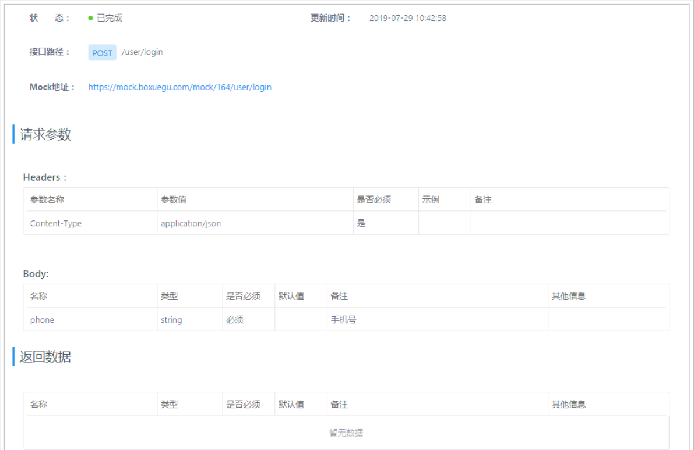

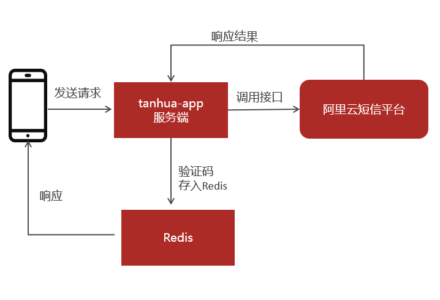

### 4.4 登录短信验证码

#### 配置文件

<font color=red><b>`tanhua-app-server`</b></font> 端添加配置文件application.yml

```yml
#服务端口
server:
  port: 18080
spring:
  application:
    name: tanhua-app-server
  redis: #redis配置
    port: 6379
    host: 192.168.136.160
  cloud: #nacos配置
    nacos:
      discovery:
        server-addr: 192.168.136.160:8848
dubbo: #dubbo配置
  registry:
    address: spring-cloud://localhost
  consumer:
    check: false
tanhua:
  sms:
    signName: 物流云商
    templateCode: SMS_106590012
    accessKey: LTAI4GKgob9vZ53k2SZdyAC7
    secret: LHLBvXmILRoyw0niRSBuXBZewQ30la
```

#### LoginController

<font color=red><b>`tanhua-app-server`</b></font> 工程编写`com.tanhua.server.controller.LoginController#login`

在LoginController中编写用户登录，发送验证码方法

~~~java
package com.tanhua.server.controller;


import com.tanhua.server.service.UserService;
import org.springframework.beans.factory.annotation.Autowired;
import org.springframework.http.ResponseEntity;
import org.springframework.web.bind.annotation.*;

import java.util.Map;

@RestController
@RequestMapping("/user")
public class LoginController {

    @Autowired
    private UserService userService;

    /**
     * 用户登录-发送验证码
     */
    @PostMapping("/login")
    public ResponseEntity login(@RequestBody Map map) {
        //1、获取手机号码
        String mobile = (String) map.get("phone");
        //2、调用service发送短信
        return userService.sendMsg(mobile);
    }
}

~~~

#### UserService

**<font color=red><b>`tanhua-app-server`</b></font> **工程编写 `com.tanhua.server.service.UserService`

UserService中编写生成验证码，并发送短信方法

~~~java
package com.tanhua.server.service;

import com.tanhua.autoconfig.templates.SmsTemplate;
import com.tanhua.domain.db.User;
import com.tanhua.dubbo.api.UserApi;
import org.apache.commons.lang3.RandomStringUtils;
import org.apache.dubbo.config.annotation.Reference;
import org.springframework.beans.factory.annotation.Autowired;
import org.springframework.data.redis.core.RedisTemplate;
import org.springframework.http.ResponseEntity;
import org.springframework.stereotype.Service;

import java.time.Duration;
import java.util.Date;

@Service
public class UserService {

    @Reference
    private UserApi userApi;

    @Autowired
    private SmsTemplate smsTemplate;

    @Autowired
    private RedisTemplate<String,String> redisTemplate;


    //对手机号码，发送验证码
    public ResponseEntity sendMsg(String mobile) {
        //1、生成验证码（6位数字）
        String code = RandomStringUtils.randomNumeric(6);
        //2、调用template发送短信
        smsTemplate.sendSms(mobile,code);
        //3、存入redis
        redisTemplate.opsForValue().set("CHECK_CODE_"+mobile,code, Duration.ofMinutes(5));//验证码失效时间
        //4、构建返回值
        return ResponseEntity.ok(null);
    }
}

~~~

#### 手机端配置

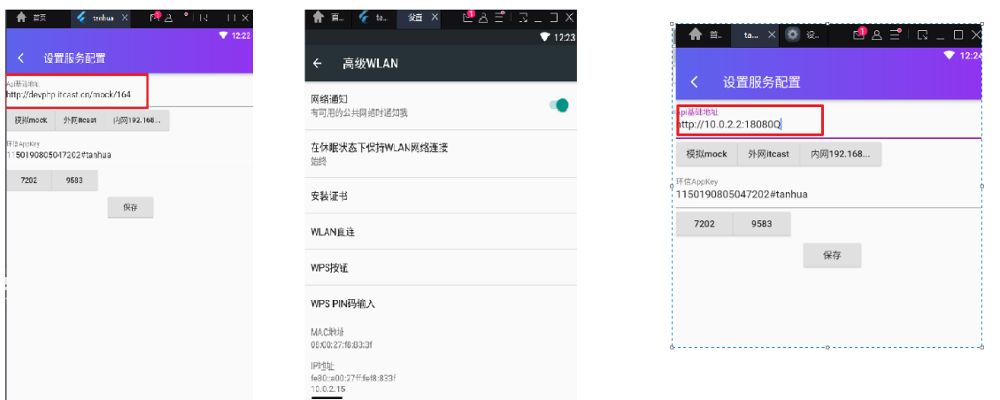

## 5、用户登录

### 5.1 JWT

JSON Web Token简称JWT，用于对应用程序上用户进行身份验证的标记。使用 JWTS 之后不需要保存用户的 cookie
或其他session数据，同时可保证应用程序的安全。

JWT是经过加密处理与校验处理的字符串，形式为：A.B.C

1. –A由JWT头部信息header加密得到
2. –B由JWT用到的身份验证信息JSON数据加密得到
3. –C由A和B加密得到，是校验部分
4. –官方测试网站： https://jwt.io/

```java
    @Test
    public void testCreateToken() {
        //生成token
        //1、准备数据
        Map map = new HashMap();
        map.put("id",1);
        map.put("mobile","13800138000");
        //2、使用JWT工具类生成token
        long now = System.currentTimeMillis();
        String token = Jwts.builder()
                .signWith(SignatureAlgorithm.HS512, "itcast") //指定加密算法
                .setClaims(map)//指定写入的数据
                .setExpiration(new Date(now + 5000))  //设置失效时间
                .compact();
        System.out.println(token);
    }

    @Test
    public void testParseToken() {
        String token = "eyJhbGciOiJIUzUxMiJ9.e1yJtb2JpbGUiOiIxMzgwMDEzODAwMCIsImlkIjoxLCJleHAiOjE2MTgzOTA4NzB9.WhZfFSJNEZJGeZAHqMaVIslvzvkFzQ1FCLCULSaR-yZYprbzgmuxNaSr3oW__zRFkBCnNRGllzaKb0ZJujs1GA";
        //解析token
        try {
            Claims claims = Jwts.parser()
                    .setSigningKey("itcast")
                    .parseClaimsJws(token)
                    .getBody();
            Object id = claims.get("id");
            Object mobile = claims.get("mobile");
            System.out.println(id + "--" + mobile);
        }catch (ExpiredJwtException e) {
            System.out.println("token已过期");
        }catch (SignatureException e) {
            System.out.println("token不合法");
        }
    }

```

### 5.2 需求分析

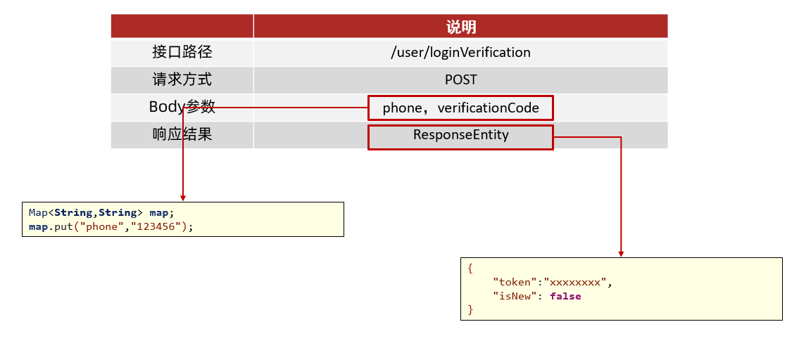

接口地址：http://192.168.136.160:3000/project/19/interface/api/97

### 5.3 代码实现

#### 5.3.1 dubbo基础环境

##### 实体类

在<font color=red><b>`tanhua-model`</b></font>模块定义实体类User

```java
import lombok.AllArgsConstructor;
import lombok.Data;
import lombok.NoArgsConstructor;

import java.io.Serializable;
import java.util.Date;

@Data
@AllArgsConstructor  //满参构造方法
@NoArgsConstructor   //无参构造方法
public class User implements Serializable {

    private Long id;
    private String mobile;
    private String password;
    private Date created;
    private Date updated;
}
```

##### mapper

在<font color=red><b>`tanhua-dubbo-db`</b></font>项目中定义UserMapper , 如下所示

```java
package com.tanhua.dubbo.mapper;

import com.baomidou.mybatisplus.core.mapper.BaseMapper;
import com.tanhua.domain.db.User;

public interface UserMapper extends BaseMapper<User> {
}

```

##### UserApi

<font color=red><b>`tanhua-dubbo-interface`</b></font>模块定义UserApi接口

```java

/**
 * 公共接口
 */
public interface UserApi {

    //根据手机号码查询用户
    User findByMobile(String mobile);
}

```

##### UserApiImpl实现类

在<font color=red><b>`tanhua-dubbo-db`</b></font>`项目中提供`UserApiImpl的实现 , 如下所示

```java
/**
 * dubbo服务
 */
@Service
public class UserApiImpl implements UserApi {

    @Autowired
    private UserMapper userMapper;

    //根据手机号码查询用户
    public User findByMobile(String mobile) {
        QueryWrapper<User> qw = new QueryWrapper<>();
        qw.eq("mobile",mobile);
        return userMapper.selectOne(qw);
    }
}
```

##### 引导类

在<font color=red><b>`tanhua-dubbo-db`</b></font>`项目中提供`引导类

```java
@SpringBootApplication
//mapper扫描
@MapperScan("com.tanhua.dubbo.mapper")
public class DubboServerApplication {

    public static void main(String[] args) {
        SpringApplication.run(DubboServerApplication.class,args);
    }
}

```

##### 配置文

在<font color=red><b>`tanhua-dubbo-db`</b></font>`项目中提供`配置文件application.yml

```yml
server:
  port: 18081
spring:
  application:
    name: tanhua-dubbo-db
  datasource:
    driver-class-name: com.mysql.jdbc.Driver
    url: jdbc:mysql://127.0.0.1:3306/tanhua?useUnicode=true&characterEncoding=utf8&autoReconnect=true&allowMultiQueries=true&useSSL=false
    username: root
    password: root
  cloud:
    nacos:
      discovery:
        server-addr: 192.168.136.160:8848
dubbo:
  protocol:
    name: dubbo
    port: 20881
  registry:
    address: spring-cloud://localhost
  scan:
    base-packages: com.tanhua.dubbo.api  #dubbo中包扫描

mybatis-plus:
  global-config:
    db-config:
      table-prefix: tb_   # 表名前缀
      id-type: auto   # id策略为自增长
```

#### 5.3.2 代码实现

##### ErrorResult

ErrorResult：统一返回的错误信息对象

~~~java
@Data
@NoArgsConstructor
@AllArgsConstructor
@Builder
public class ErrorResult {

    private String errCode = "999999";
    private String errMessage;

    public static ErrorResult error() {
        return ErrorResult.builder().errCode("999999").errMessage("系统异常稍后再试").build();
    }

    public static ErrorResult fail() {
        return ErrorResult.builder().errCode("000001").errMessage("发送验证码失败").build();
    }

    public static ErrorResult loginError() {
        return ErrorResult.builder().errCode("000002").errMessage("验证码失效").build();
    }

    public static ErrorResult faceError() {
        return ErrorResult.builder().errCode("000003").errMessage("图片非人像，请重新上传!").build();
    }

    public static ErrorResult mobileError() {
        return ErrorResult.builder().errCode("000004").errMessage("手机号码已注册").build();
    }

    public static ErrorResult contentError() {
        return ErrorResult.builder().errCode("000005").errMessage("动态内容为空").build();
    }

    public static ErrorResult likeError() {
        return ErrorResult.builder().errCode("000006").errMessage("用户已点赞").build();
    }

    public static ErrorResult disLikeError() {
        return ErrorResult.builder().errCode("000007").errMessage("用户未点赞").build();
    }

    public static ErrorResult loveError() {
        return ErrorResult.builder().errCode("000008").errMessage("用户已喜欢").build();
    }

    public static ErrorResult disloveError() {
        return ErrorResult.builder().errCode("000009").errMessage("用户未喜欢").build();
    }
}
~~~

##### LoginController

在<font color=red><b>`tanhua-app-server`</b></font>项目中接收APP请求, 调用Dubbo服务完成业务功能

~~~java
    /**
     * 验证码校验登录
     */
    @PostMapping("/loginVerification")
    public ResponseEntity loginVerification(@RequestBody Map map) {
        String mobile = (String) map.get("phone");
        String code = (String) map.get("verificationCode");
        return userSerivce.login(mobile,code);
    }
~~~

##### UserService

~~~java
    /**
     * 验证码校验登录
     */
    public ResponseEntity login(String mobile, String code) {
        //1、获取redis中存入的验证码
        String value = redisTemplate.opsForValue().get(redisKey+mobile);
        //2、判断redis中的验证码是否存在并比较验证码是否一致
        if(value == null || !value.equals(code)) {
            return ResponseEntity.status(500).body(ErrorResult.loginError());
        }
        redisTemplate.delete(redisKey+mobile) ;// 清楚redis中的验证码数据
        //3、根据手机号码查询用户
        User user = userApi.findByMobile(mobile);
        //3、1 如果用户不存在，创建用户对象存入数据库
        boolean isNew = false;
        if(user == null) {
            user = new User();
            user.setMobile(mobile);
            user.setPassword(DigestUtils.md5Hex("123456"));
            Long userId = userApi.save(user);
            user.setId(userId);
            isNew = true;
        }
        String token = JwtUtils.createToken(mobile,user.getId());
        //4、将用户数据存入redis中
        String jsonString = JSON.toJSONString(user);//将对象转化为json字符串
        //存入redis，设置失效时间
        redisTemplate.opsForValue().set("TOKEN_"+token,jsonString,Duration.ofHours(1));
        //5、构造返回值
        Map map = new HashMap();
        map.put("token", token);
        map.put("isNew",isNew);
        return ResponseEntity.ok(map);
    }
~~~

##### JWT工具类

```java
public class JwtUtils {

    // TOKEN的有效期1小时（S）
    private static final int TOKEN_TIME_OUT = 3_600;

    // 加密KEY
    private static final String TOKEN_SECRET = "itcast";


    // 生成Token
    public static String getToken(Map params){
        long currentTime = System.currentTimeMillis();
        return Jwts.builder()
                .signWith(SignatureAlgorithm.HS512, TOKEN_SECRET) //加密方式
                .setExpiration(new Date(currentTime + TOKEN_TIME_OUT * 1000)) //过期时间戳
                .addClaims(params)
                .compact();
    }


    /**
     * 获取Token中的claims信息
     */
    private static Claims getClaims(String token) {
        return Jwts.parser()
                .setSigningKey(TOKEN_SECRET)
                .parseClaimsJws(token).getBody();
    }


    /**
     * 是否有效 true-有效，false-失效
     */
    public static boolean verifyToken(String token) {
      
        if(StringUtils.isEmpty(token)) {
            return false;
        }
        
        try {
            Claims claims = Jwts.parser()
                    .setSigningKey("itcast")
                    .parseClaimsJws(token)
                    .getBody();
        }catch (Exception e) {
            return false;
        }

		return true;
    }
}
```

### 5.4 代码优化

#### 抽取BasePojo

为了简化实体类中created和updated字段，抽取BasePojo

```java
@Data
public abstract class BasePojo implements Serializable {

    @TableField(fill = FieldFill.INSERT) //自动填充
    private Date created;
    @TableField(fill = FieldFill.INSERT_UPDATE)
    private Date updated;

}
```

#### 自动填充

对于created和updated字段，每次操作都需要手动设置。为了解决这个问题，mybatis-plus支持自定义处理器的形式实现保存更新的自动填充

```java
package com.tanhua.dubbo.server.handler;

import com.baomidou.mybatisplus.core.handlers.MetaObjectHandler;
import org.apache.ibatis.reflection.MetaObject;
import org.springframework.stereotype.Component;

import java.util.Date;

@Component
public class MyMetaObjectHandler implements MetaObjectHandler {

    @Override
    public void insertFill(MetaObject metaObject) {
        Object created = getFieldValByName("created", metaObject);
        if (null == created) {
            //字段为空，可以进行填充
            setFieldValByName("created", new Date(), metaObject);
        }

        Object updated = getFieldValByName("updated", metaObject);
        if (null == updated) {
            //字段为空，可以进行填充
            setFieldValByName("updated", new Date(), metaObject);
        }
    }

    @Override
    public void updateFill(MetaObject metaObject) {
        //更新数据时，直接更新字段
        setFieldValByName("updated", new Date(), metaObject);
    }
}
```

