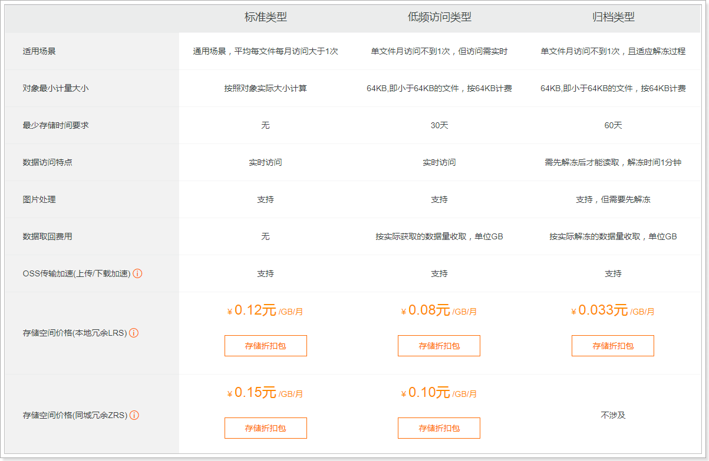
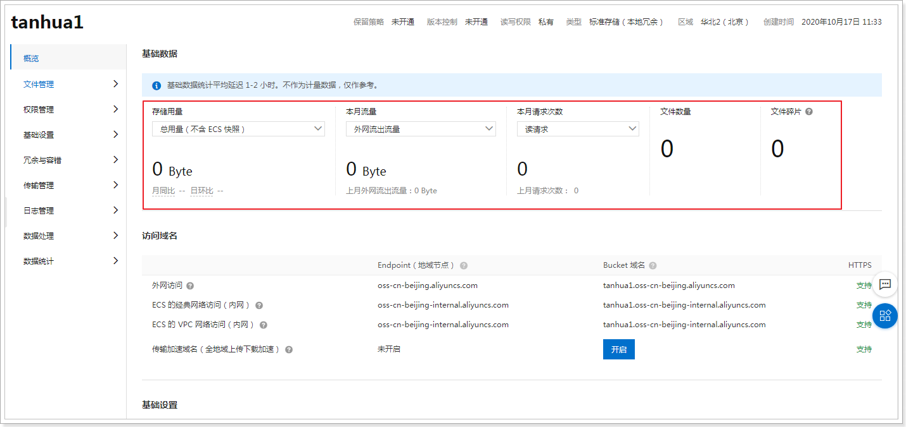
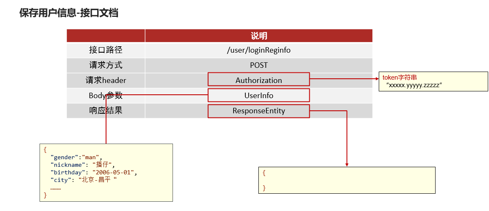

# 课程介绍

- 完善用户信息
- 用户信息管理
- 统一token处理
- 统一异常处理

# 1. 完善用户信息

用户在首次登录时需要完善个人信息，包括性别昵称生日城市头像等。其中，头像数据需要做图片上传，这里采用阿里云的OSS服务作为我们的图片服务器，并且对头像要做人脸识别，非人脸照片不得上传。


* 首次登录时（手机号码不存在），需要创建用户存入数据库中

* 客户端检测首次登录需要完善用户信息
    * 填写用户基本信息
    * 上传用户头像（需要人脸认证）

## 1.1 阿里云OSS

实现图片上传服务，需要有存储的支持，那么我们的解决方案将以下几种：

1. 直接将图片保存到服务的硬盘（springmvc中的文件上传）
    1. 优点：开发便捷，成本低
    2. 缺点：扩容困难
2. 使用分布式文件系统进行存储
    1. 优点：容易实现扩容
    2. 缺点：开发复杂度稍大（有成熟的产品可以使用，比如：FastDFS,MinIO）
3. 使用第三方的存储服务
    1. 优点：开发简单，拥有强大功能，免维护
    2. 缺点：付费

在本套课程中选用阿里云的OSS服务进行图片存储。


### 1.1.1 概述

对象存储服务（Object Storage Service，OSS）是一种海量安全低成本高可靠的云存储服务，适合存放任意类型的文件。容量和处理能力弹性扩展，多种存储类型供选择，全面优化存储成本。

地址：https://www.aliyun.com/product/oss


### 1.1.2 账号申请

#### 购买服务

使用第三方服务最大的缺点就是需要付费，下面，我们看下如何购买开通服务。




购买下行流量包： （不购买也可以使用，按照流量付费）


> 说明：OSS的上行流量是免费的，但是下行流量是需要购买的。

#### 创建Bucket

使用OSS，首先需要创建Bucket，Bucket翻译成中文是水桶的意思，把存储的图片资源看做是水，想要盛水必须得有桶，就是这个意思了。

进入控制台，https://oss.console.aliyun.com/overview


选择Bucket后，即可看到对应的信息，如：url消耗流量等 :



文件管理：

```java
package com.tanhua.test;

import com.aliyun.oss.OSS;
import com.aliyun.oss.OSSClientBuilder;
import com.baomidou.mybatisplus.annotation.TableId;
import org.junit.Test;

import java.io.ByteArrayInputStream;
import java.io.File;
import java.io.FileInputStream;
import java.io.FileNotFoundException;
import java.text.SimpleDateFormat;
import java.util.Date;
import java.util.UUID;

public class OssTest {

    /**
     * 案例：
     *     将资料中的1.jpg上传到阿里云OSS
     *       存放的位置   /yyyy/MM/dd/xxxx.jpg
     */
    @Test
    public void testOss() throws FileNotFoundException {

        //1、配置图片路径
        String path = "C:\\Users\\lemon\\Desktop\\课程资源\\02-完善用户信息\\03-资料\\1.jpg";
        //2、构造FileInputStream
        FileInputStream inputStream = new FileInputStream(new File(path));
        //3、拼写图片路径
        String filename = new SimpleDateFormat("yyyy/MM/dd").format(new Date())
                +"/"+ UUID.randomUUID().toString() + path.substring(path.lastIndexOf("."));


        // yourEndpoint填写Bucket所在地域对应的Endpoint。以华东1（杭州）为例，Endpoint填写为https://oss-cn-hangzhou.aliyuncs.com。
        String endpoint = "oss-cn-beijing.aliyuncs.com";
        String accessKeyId = "LTAI4GKgob9vZ53k2SZdyAC7";
        String accessKeySecret = "LHLBvXmILRoyw0niRSBuXBZewQ30la";

        // 创建OSSClient实例。
        OSS ossClient = new OSSClientBuilder().build(endpoint, accessKeyId,accessKeySecret);

        // 填写Byte数组。
        // 填写Bucket名称和Object完整路径。Object完整路径中不能包含Bucket名称。
        ossClient.putObject("tanhua001", filename, inputStream);

        // 关闭OSSClient。
        ossClient.shutdown();

        String url = "https://tanhua001.oss-cn-beijing.aliyuncs.com/" + filename;
        System.out.println(url);
    }
}
```


查看文件：


### 1.1.3 抽取模板工具

和发送短信类似，阿里云OSS也是采用自定义工具的形式进行封装

#### OssProperties

<font color=red><b>`tanhua-autoconfig`</b></font>创建配置类

```java
@Data
@ConfigurationProperties(prefix = "tanhua.oss")
public class OssProperties {

    private String accessKey; 
    private String secret;
    private String bucketName;
    private String url; //域名
    private String endpoint;
}
```

#### OssTemplate

<font color=red><b>`tanhua-autoconfig`</b></font>创建模板对象

```java
package com.tanhua.autoconfig.template;

import com.aliyun.oss.OSS;
import com.aliyun.oss.OSSClientBuilder;
import com.tanhua.autoconfig.properties.OssProperties;

import java.io.InputStream;
import java.text.SimpleDateFormat;
import java.util.Date;
import java.util.UUID;

public class OssTemplate {

    private OssProperties ossProperties;

    public OssTemplate(OssProperties ossProperties) {
        this.ossProperties = ossProperties;
    }

    public String upload(String filename, InputStream is) {
        // yourEndpoint填写Bucket所在地域对应的Endpoint。以华东1（杭州）为例，Endpoint填写为https://oss-cn-hangzhou.aliyuncs.com。
        String endpoint = ossProperties.getEndpoint();
        // 阿里云主账号AccessKey拥有所有API的访问权限，风险很高。强烈建议您创建并使用RAM账号进行API访问或日常运维，请登录 https://ram.console.aliyun.com 创建RAM账号。
        String accessKeyId = ossProperties.getAccessKey();
        String accessKeySecret = ossProperties.getSecret();

        // 创建OSSClient实例。
        OSS ossClient = new OSSClientBuilder().build(endpoint, accessKeyId, accessKeySecret);

        String storePath = new SimpleDateFormat("yyyy/MM/dd").format(new Date()) + "/" + UUID.randomUUID() + filename.substring(filename.lastIndexOf("."));

        System.out.println(storePath);
        // 依次填写Bucket名称（例如examplebucket）和Object完整路径（例如exampledir/exampleobject.txt）。Object完整路径中不能包含Bucket名称。
        ossClient.putObject(ossProperties.getBucketName(), storePath, is);

        String url = ossProperties.getUrl() + storePath;

        // 关闭OSSClient。
        ossClient.shutdown();

        return url;
    }
}
```

#### TanhuaAutoConfiguration

<font color=red><b>`tanhua-autoconfig`</b></font>的`TanhuaAutoConfiguration`加入配置

```java
@EnableConfigurationProperties({
        SmsProperties.class,
        OssProperties.class
})
public class TanhuaAutoConfiguration {

    @Bean
    public SmsTemplate smsTemplate(SmsProperties properties) {
        return new SmsTemplate(properties);
    }

    @Bean
    public OssTemplate ossTemplate(OssProperties properties) {
        return new OssTemplate(properties);
    }
}
```

### 1.1.4 测试

tanhua-app-server加入配置内容，并测试

```yaml
tanhua:
  oss:
    accessKey: LTAI4GKgob9vZ53k2SZdyAC7
    secret: LHLBvXmILRoyw0niRSBuXBZewQ30la
    endpoint: oss-cn-beijing.aliyuncs.com
    bucketName: tanhua001
    url: https://tanhua001.oss-cn-beijing.aliyuncs.com/
```

编写测试类

```java
@RunWith(SpringRunner.class)
@SpringBootTest(classes = AppServerApplication.class)
public class OssTest {

    @Autowired
    private OssTemplate template;

    @Test
    public void testTemplateUpload() throws FileNotFoundException {
        String path = "C:\\Users\\lemon\\Desktop\\课程资源\\02-完善用户信息\\03-资料\\2.jpg";
        FileInputStream inputStream = new FileInputStream(new File(path));
        String imageUrl = template.upload(path, inputStream);
        System.out.println(imageUrl);
    }
}
```

## 1.2 百度人脸识别

​ 人脸识别（Face
Recognition）基于图像或视频中的人脸检测分析和比对技术，提供对您已获授权前提下的私有数据的人脸检测与属性分析人脸对比人脸搜索活体检测等能力。灵活应用于金融泛安防零售等行业场景，满足身份核验人脸考勤闸机通行等业务需求

### 1.2.1 概述

地址：https://ai.baidu.com/tech/face


### 1.2.2 账号申请

#### 账号登录注册

百度云AI支持百度账号登录，也可以支持云账号。按需注册即可


#### 创建应用

按需创建应用


### 1.2.3 人脸识别测试

```java
package com.tanhua.test;

import com.baidu.aip.face.AipFace;
import org.json.JSONObject;

import java.util.HashMap;

public class AipFaceTest {

    //设置APPID/AK/SK
    public static final String APP_ID = "24021388";
    public static final String API_KEY = "ZnMTwoETXnu4OPIGwGAO2H4G";
    public static final String SECRET_KEY = "D4jXShyinv5q26bUS78xRKgNLnB9IfZh";

    public static void main(String[] args) {
        // 初始化一个AipFace
        AipFace client = new AipFace(APP_ID, API_KEY, SECRET_KEY);

        // 可选：设置网络连接参数
        client.setConnectionTimeoutInMillis(2000);
        client.setSocketTimeoutInMillis(60000);


        // 调用接口
        String image = "https://tanhua001.oss-cn-beijing.aliyuncs.com/2021/04/19/a3824a45-70e3-4655-8106-a1e1be009a5e.jpg";
        String imageType = "URL";

        HashMap<String, String> options = new HashMap<String, String>();
        options.put("face_field", "age");
        options.put("max_face_num", "2");
        options.put("face_type", "LIVE");
        options.put("liveness_control", "LOW");

        // 人脸检测
        JSONObject res = client.detect(image, imageType, options);
        System.out.println(res.toString(2));

    }
}

```

### 1.2.4 抽取模板工具

#### AipFaceProperties

<font color=red><b>`tanhua-autoconfig`</b></font>中添加配置对象

```java
package com.tanhua.autoconfig.properties;

import com.baidu.aip.face.AipFace;
import lombok.Data;
import org.springframework.boot.context.properties.ConfigurationProperties;
import org.springframework.context.annotation.Bean;

@Data
@ConfigurationProperties("tanhua.aip")
public class AipFaceProperties {
    private String appId;
    private String apiKey;
    private String secretKey;

    @Bean
    public AipFace aipFace() {
        AipFace client = new AipFace(appId, apiKey, secretKey);
        // 可选：设置网络连接参数
        client.setConnectionTimeoutInMillis(2000);
        client.setSocketTimeoutInMillis(60000);
        return client;
    }
}
```

#### AipFaceTemplate

<font color=red><b>`tanhua-autoconfig`</b></font>中创建AipFaceTemplate

```java
package com.tanhua.autoconfig.template;

import com.baidu.aip.face.AipFace;
import org.json.JSONObject;
import org.springframework.beans.factory.annotation.Autowired;

import java.util.HashMap;

public class AipFaceTemplate {

    @Autowired
    private AipFace client;

    /**
     * 检测图片中是否包含人脸
     *  true：包含
     *  false：不包含
     */
    public boolean detect(String imageUrl) {
        // 调用接口
        String imageType = "URL";

        HashMap<String, String> options = new HashMap<String, String>();
        options.put("face_field", "age");
        options.put("max_face_num", "2");
        options.put("face_type", "LIVE");
        options.put("liveness_control", "LOW");

        // 人脸检测
        JSONObject res = client.detect(imageUrl, imageType, options);
        System.out.println(res.toString(2));

        Integer error_code = (Integer) res.get("error_code");

        return error_code == 0;
    }
}

```

#### TanhuaAutoConfiguration

```java
@EnableConfigurationProperties({
		//其他略
        AipFaceProperties.class
})
public class TanhuaAutoConfiguration {

	//其他略

    @Bean
    public AipFaceTemplate aipFaceTemplate() {
        return new AipFaceTemplate();
    }
}
```

### 1.2.5 模板类测试

tanhua-app-server加入百度AI的配置信息

```yml
tanhua:
  aip:
    appId: 24021388
    apiKey: ZnMTwoETXnu4OPIGwGAO2H4G
    secretKey: D4jXShyinv5q26bUS78xRKgNLnB9IfZh
```

编写单元测试类

```java
@SpringBootTest(classes = AppServerApplication.class)
@RunWith(SpringRunner.class)
public class AipFaceTemplateTest {

    @Autowired
    private AipFaceTemplate aipFaceTemplate ;

    @Autowired
    private AipFaceTemplate template;

    @Test
    public void detectFace() {
        String image = "https://tanhua001.oss-cn-beijing.aliyuncs.com/2021/04/19/a3824a45-70e3-4655-8106-a1e1be009a5e.jpg";
        boolean detect = template.detect(image);
        System.out.println(detect);
    }
}

```

## 1.3 保存用户信息

### 1.3.1 接口文档



YAPI接口地址：http://192.168.136.160:3000/project/19/interface/api/88

### 1.3.2 需求分析

#### 数据库表

tb_user_info（用户基本资料表）


* 用户表和用户信息表是<font color=red>一对一的关系，两者采用主键关联的形式配置</font>

* 主键关联：用户表主键和用户资料表主键要保持一致（如：用户表id=1，此用户的资料表id=1）

#### 执行流程

1. 手机端发送请求到消费者
2. 消费者构造数据，调用提供者
3. 消费者完成业务处理，操作数据库


### 1.3.3 代码实现

#### UserInfo实体类

在<font color=red><b>`tanhua-model`</b></font>模块创建实体类UserInfo

```java
package com.tanhua.model.domain;

import com.baomidou.mybatisplus.annotation.IdType;
import com.baomidou.mybatisplus.annotation.TableField;
import com.baomidou.mybatisplus.annotation.TableId;
import lombok.AllArgsConstructor;
import lombok.Data;
import lombok.NoArgsConstructor;

import java.io.Serializable;

@Data
@NoArgsConstructor
@AllArgsConstructor
public class UserInfo extends BasePojo {

    /**
     * 由于userinfo表和user表之间是一对一关系
     * userInfo的id来源于user表的id
     */
    @TableId(type = IdType.INPUT)
    private Long id; //用户id
    private String nickname; //昵称
    private String avatar; //用户头像
    private String birthday; //生日
    private String gender; //性别
    private Integer age; //年龄
    private String city; //城市
    private String income; //收入
    private String education; //学历
    private String profession; //行业
    private Integer marriage; //婚姻状态
    private String tags; //用户标签：多个用逗号分隔
    private String coverPic; // 封面图片

    //用户状态,1为正常，2为冻结
    @TableField(exist = false)
    private String userStatus = "1";
}
```

#### tanhua-app-server

在<font color=red><b>`tanhua-app-server`</b></font>中定义控制器接收客户端请求 , 调用dubbo服务完成业务代码编写

##### UserController

在`UserController`中定义方法接收客户端请求

```java
@RestController
@RequestMapping("/user")
public class UserController {

    @Autowired
    private UserInfoService userInfoService;

    /**
     * 保存用户信息
     *   UserInfo
     *   请求头中携带token
     */
    @PostMapping("/loginReginfo")
    public ResponseEntity loginReginfo(@RequestBody UserInfo userInfo,
                                       @RequestHeader("Authorization") String token) {
        //1、判断token是否合法
        boolean verifyToken = JwtUtils.verifyToken(token);
        if(!verifyToken) {
            return ResponseEntity.status(401).body(null);
        }
        //2、向userinfo中设置用户id
        Claims claims = JwtUtils.getClaims(token);
        Integer id = (Integer) claims.get("id");
        userInfo.setId(Long.valueOf(id));
        //3、调用service
        userInfoService.save(userInfo);
        return ResponseEntity.ok(null);
    }
}
```

##### UserInfoService

创建`UserInfoService`类, 定义保存用户基础信息的方法

```java
package com.tanhua.server.service;

import com.tanhua.autoconfig.template.AipFaceTemplate;
import com.tanhua.autoconfig.template.OssTemplate;
import com.tanhua.dubbo.api.UserInfoApi;
import com.tanhua.model.domain.UserInfo;
import com.tanhua.model.vo.ErrorResult;
import com.tanhua.model.vo.UserInfoVo;
import com.tanhua.server.exception.BusinessException;
import org.apache.dubbo.config.annotation.DubboReference;
import org.springframework.beans.BeanUtils;
import org.springframework.beans.factory.annotation.Autowired;
import org.springframework.stereotype.Service;
import org.springframework.web.multipart.MultipartFile;

import java.io.IOException;

@Service
public class UserInfoService {

    @DubboReference
    private UserInfoApi userInfoApi;

    @Autowired
    private OssTemplate ossTemplate;

    @Autowired
    private AipFaceTemplate aipFaceTemplate;

    //保存用户信息
    public void save(UserInfo userInfo) {
        userInfoApi.save(userInfo);
    }
}
```

#### tanhua-dubbo-interface

在<font color=red><b>`tanhua-dubbo-interface`</b></font>项目中定义需要对数据库操作的API接口

```java
package com.tanhua.dubbo.api;

import com.tanhua.model.domain.UserInfo;

/**
 * 用户基础信息公共接口
 */
public interface UserInfoApi {

    /**
     * 根据用户ID查询用户信息
     */
    public UserInfo findById(Long id);

    /**
     * 更新用户信息
     */
    public void update(UserInfo userInfo);

    /**
     * 保存用户信息
     */
    public void save(UserInfo userInfo);
}
```

#### tanhua-dubbo-db

在<font color=red><b>`tanhua-dubbo-db`</b></font>项目中定义对数据库的操作以及Dubbo接口实现类

##### UserInfoMapper

```java
package com.tanhua.dubbo.mapper;

import com.baomidou.mybatisplus.core.mapper.BaseMapper;
import com.tanhua.model.domain.UserInfo;

/**
 * 用户基础信息Mapper接口
 */
public interface UserInfoMapper extends BaseMapper<UserInfo> {
}
```

##### UserInfoApiImpl

创建UserInfoApiImpl实现类并暴露服务

```java
package com.tanhua.dubbo.api;

import com.tanhua.dubbo.mapper.UserInfoMapper;
import com.tanhua.model.domain.UserInfo;
import org.apache.dubbo.config.annotation.DubboService;
import org.springframework.beans.factory.annotation.Autowired;

/**
 * 用户基础信息的dubbo实现类
 */
@DubboService
public class UserInfoApiImpl implements UserInfoApi {

    @Autowired
    private UserInfoMapper userInfoMapper;

    //根据id查询
    @Override
    public UserInfo findById(Long id) {
        return userInfoMapper.selectById(id);
    }

    //更新
    @Override
    public void update(UserInfo userInfo) {
        userInfoMapper.updateById(userInfo);
    }

    //保存
    @Override
    public void save(UserInfo userInfo) {
        userInfoMapper.insert(userInfo);
    }
}
```

## 1.4 上传用户头像

### 1.4.1 需求分析

#### 接口文档


YAPI地址：http://192.168.136.160:3000/project/19/interface/api/91

文件上传采用POST传递，mvc中经过文件解析器转化为MultipartFile对象处理

后续请求中，请求headr中都有Authorization参数。

#### 执行流程


### 1.4.2 代码实现

> 对数据库的更新接口在保存用户信息的功能中已经完成 , 这里只需要接收请求调用Dubbo服务完成数据更新即可

在<font color=red><b>`tanhua-app-server`</b></font>中的UsersController和UserInfoService编写方法

#### **UserController**

```java
/**
 *上传用户头像
 */
@PostMapping("/loginReginfo/head")
public ResponseEntity head(MultipartFile headPhoto,@RequestHeader("Authorization") String token) {
    //1、判断token是否合法
    boolean verifyToken = JwtUtils.verifyToken(token);
    if(!verifyToken) {
        return ResponseEntity.status(401).body(null);
    }
    //2、向userinfo中设置用户id
    Claims claims = JwtUtils.getClaims(token);
    Integer id = (Integer) claims.get("id");
    //3、调用service
    userInfoService.updateHead(headPhoto,id);
}
```

#### **UserInfoService**

```java
//更新用户头像
public void updateHead(MultipartFile headPhoto, Long id) throws IOException {
    //1、将图片上传到阿里云oss
    String imageUrl = ossTemplate.upload(headPhoto.getOriginalFilename(), headPhoto.getInputStream());
    //2、调用百度云判断是否包含人脸
    boolean detect = aipFaceTemplate.detect(imageUrl);
    //2.1 如果不包含人脸，抛出异常
    if(!detect) {
        throw new RuntimeException("不包含人脸");
    }else{
        //2.2 包含人脸，调用API更新
        UserInfo userInfo = new UserInfo();
        userInfo.setId(id);
        userInfo.setAvatar(imageUrl);
        userInfoApi.update(userInfo);
    }
}
```

# 2. 用户信息管理

## 2.1 查询用户资料

### 2.1.1 接口文档


YAPI地址：http://192.168.136.160:3000/project/19/interface/api/265

参数userID： 用户id，当不传递时，查询当前用户的资料信息

### 2.1.2 代码实现

> 对数据库的更新接口在保存用户信息的功能中已经完成 , 这里只需要接收请求调用Dubbo服务完成数据更新即可

在<font color=red><b>`tanhua-app-server`</b></font>中的UsersController和UserInfoService编写方法

#### **UsersController**

```java
package com.tanhua.server.controller;

import com.tanhua.model.domain.UserInfo;
import com.tanhua.server.service.UserInfoService;
import com.tanhua.utils.JwtUtils;
import io.jsonwebtoken.Claims;
import org.springframework.beans.factory.annotation.Autowired;
import org.springframework.http.HttpStatus;
import org.springframework.http.ResponseEntity;
import org.springframework.web.bind.annotation.RequestHeader;
import org.springframework.web.bind.annotation.RequestMapping;
import org.springframework.web.bind.annotation.RequestParam;
import org.springframework.web.bind.annotation.RestController;

import java.io.UnsupportedEncodingException;

/**
 * @author Administrator
 */
@RestController
@RequestMapping(path = "/users")
public class UserInfoController {

    @Autowired
    private UserInfoService userInfoService;

    /**
     * 查询用户基础信息
     *
     * @param userID
     * @param token
     * @return
     */
    public ResponseEntity userInfo(Long userID, @RequestHeader("Authorization") String token) {
        //1. 校验token
        boolean verifyToken = JwtUtils.verifyToken(token);
        if(!verifyToken) {
            return ResponseEntity.status(401).body(null);
        }
        //2. 获取token中的用户信息
        Claims claims = JwtUtils.getClaims(token);
        String id = claims.get("id").toString();

        if (userID == null) {
            userID = Long.valueOf(id);
        }

        UserInfoVo userInfo = userInfoService.findById(userID);

        return ResponseEntity.ok(userInfo);
    }
}
```

#### **UserInfoService**

```java
//根据id查寻
public UserInfoVo findById(Long id) {
    UserInfo userInfo = userInfoApi.findById(id);

    UserInfoVo vo = new UserInfoVo();

    BeanUtils.copyProperties(userInfo,vo); //copy同名同类型的属性

    if(userInfo.getAge() != null) {
        vo.setAge(userInfo.getAge().toString());
    }

    return vo;
}
```

#### VO对象

> 在实际开发过程中经常可能会有实体类字段和客户端要求的返回数据字段 数量/类型/名称 不一致的情况
>
> 这种情况我们可以定义Vo对象 , 通过Vo对象封装数据返回给客户端

**UserInfoVo**

在`tanhua-model`模块创建VO对象，用户响应数据

```java
@Data
@NoArgsConstructor
@AllArgsConstructor
public class UserInfoVo implements Serializable {

    private Long id; //用户id
    private String nickname; //昵称
    private String avatar; //用户头像
    private String birthday; //生日
    private String gender; //性别
    private String age; //年龄
    private String city; //城市
    private String income; //收入
    private String education; //学历
    private String profession; //行业
    private Integer marriage; //婚姻状态
}
```

> vo字段的字段名称和类型完全与接口文档保持一直 , 返回数据时, 我们需要把POJO对象中的数据, 复制到Vo中

## 2.2 更新用户资料

### 2.2.1 接口文档


YAPI地址：http://192.168.136.160:3000/project/19/interface/api/259

### 2.2.2 代码实现

> 对数据库的更新接口在保存用户信息的功能中已经完成 , 这里只需要接收请求调用Dubbo服务完成数据更新即可

在<font color=red><b>`tanhua-app-server`</b></font>中的UsersController和UserInfoService完成更新用户资料功能

#### UsersController

```java
    /**
     * 更新用户资料
     */
    @PutMapping
    public ResponseEntity updateUserInfo(@RequestBody UserInfo userInfo,@RequestHeader("Authorization") String token) {
        //1、判断token是否合法
        boolean verifyToken = JwtUtils.verifyToken(token);
        if(!verifyToken) {
            return ResponseEntity.status(401).body(null);
        }
        //2、获取id
        Claims claims = JwtUtils.getClaims(token);
        Integer id = (Integer) claims.get("id");

        //设置id
        userInfo.setId(Long.valueOf(id));
        userInfoService.update(userInfo);
        return ResponseEntity.ok(null);
    }
```

#### UserInfoService

```java
//更新
public void update(UserInfo userInfo) {
    userInfoApi.update(userInfo);
}
```

# 3. 统一token处理

## 3.1.需求分析

代码存在如下问题：

* 重复性的登录验证

  ​ 通过SpringMVC拦截器进行登录校验

* 繁琐的token获取及解析

  ​ 通过SpringMVC拦截器解析token

  ​ 将解析对象存入ThreadLocal

## 3.2 解决方案

基于ThreadLocal + 拦截器的形式统一处理


### 拦截器（Interceptor）

* 是一种动态拦截方法调用的机制；

* 类似于Servlet 开发中的过滤器Filter，用于对处理器进行前置处理和后置处理。


### ThreadLocal

* 线程内部的存储类，赋予了线程存储数据的能力。

* 线程内调用的方法都可以从ThreadLocal中获取同一个对象。

* 多个线程中ThreadLocal数据相互隔离

## 3.3 代码实现

### 3.3.1 ThreadLocal工具类

定义ThreadLocal工具类，仅需要调用set方法即可将数据存入ThreadLocal中

```java
package com.tanhua.server.interceptor;

import com.tanhua.model.domain.User;

/**
 * @author Administrator
 */
public class UserHolder {

    private static ThreadLocal<User> tl = new ThreadLocal<User>();

    /**
     * 保存数据到线程
     */
    public static void set(User user) {
        tl.set(user);
    }

    /**
     * 获取线程中的用户信息
     */
    public static User get() {
        return tl.get();
    }


    /**
     * 从当前线程，获取用户对象的id
     */
    public static Long getUserId() {
        if (tl.get() == null) {
            return null;
        }
        return tl.get().getId();
    }

    /**
     * 从当前线程，获取用户对象的手机号码
     */
    public static String getMobile() {
        if (tl.get() == null) {
            return null;
        }
        return tl.get().getMobile();
    }

     /**
     * 移除线程中数据
     */
    public static void remove() {
        tl.remove();
    }
}
```

### 3.3.2 定义拦截器

定义拦截器，在前置拦截方法preHandle中解析token并验证有效性，如果失效返回状态码401。如果有效，解析User对象，存入ThreadLocal中

```java
package com.tanhua.server.interceptor;

import com.tanhua.model.domain.User;
import com.tanhua.utils.JwtUtils;
import io.jsonwebtoken.Claims;
import io.jsonwebtoken.Jwt;
import org.apache.commons.lang3.StringUtils;
import org.springframework.http.HttpStatus;
import org.springframework.web.servlet.handler.HandlerInterceptorAdapter;

import javax.servlet.http.HttpServletRequest;
import javax.servlet.http.HttpServletResponse;

/**
 * @author Administrator
 */
public class TokenInterceptor extends HandlerInterceptorAdapter {

    @Override
    public boolean preHandle(HttpServletRequest request, HttpServletResponse response, Object handler) throws Exception {

        //1、获取请求头
        String token = request.getHeader("Authorization");

        //2、使用工具类，判断token是否有效
        boolean verifyToken = JwtUtils.verifyToken(token);
        //3、如果token失效，返回状态码401，拦截
        if(!verifyToken) {
            response.setStatus(401);
            return false;
        }
        //4、如果token正常可用，放行
        //解析token，获取id和手机号码，
        Claims claims = JwtUtils.getClaims(token);
        String mobile = (String) claims.get("mobile");
        Integer id = (Integer) claims.get("id");
        
        //构造User对象，存入Threadlocal
        User user = new User();
        user.setId(Long.valueOf(id));
        user.setMobile(mobile);

        UserHolder.set(user);

        return true;
    }
    
    //清空
    @Override
    public void afterCompletion(HttpServletRequest request, HttpServletResponse response, Object handler, Exception ex) throws Exception {
        UserHolder.remove();
    }
}
```

### 3.3.3 注册拦截器

拦截器需要注册到MVC容器中

```java
/**
 * @author Administrator
 */
@Configuration
public class WebConfig implements WebMvcConfigurer {

    @Override
    public void addInterceptors(InterceptorRegistry registry) {
        registry.addInterceptor(new TokenInterceptor())
                .addPathPatterns("/**")
                .excludePathPatterns("/user/login", "/user/loginVerification");
    }
}
```

### 3.3.4 修改控制器方法

> 修改控制器方法, 所有需要用到`userId`都可以直接从线程中获取`Long userId = UserHolder.getUserId();`

```java
@PostMapping(path = "/loginReginfo")
public ResponseEntity loginReginfo(@RequestBody UserInfo userInfo) {
    //1. 校验token
    Long userId = UserHolder.getUserId();
    //2. 保存用户信息
    userInfo.setId(userId);
    userInfoService.save(userInfo);
    //3. 返回数据
    return ResponseEntity.ok(null);
}
```

# 4. 统一异常处理

软件开发过程中，不可避免的是需要处理各种异常，常见的形式就是逐层向上抛出，web层进行处理。使用try {...} catch
{...}很方便就能对异常做到业务处理

1. 冗余代码多，影响代码可读性
2. 异常处理和业务代码耦合

## 4.1 概述

前后两端数据响应的定义：

* 状态码：200
    * 正常执行，解析响应数据

* 状态码：500
    * 抛出异常或业务错误，解析响应数据中的errCode和errMessage

* 状态码：401
    * 权限不足，手机端会自动跳转登录

SpringMVC提供了一套解决全局异常的处理方案，可以在代码无侵入的前提下完成异常处理。遵循逐层抛出，异常处理器统一处理的思路


## 4.2 基础代码

项目中可能存在不可预知的各种异常，如：空指针，数组越界等。针对这类异常，可以直接在异常处理器中统一处理；

还有一类是可预知的错误，如图片不合法，验证码错误等等。这类错误也可以理解为业务异常，可以通过自定义异常类来处理；

### 4.2.1业务异常对象

为了方便操作，将一些常见的业务错误封装到ErrorResult对象中

```java
@Data
@NoArgsConstructor
@AllArgsConstructor
@Builder
public class ErrorResult {

    private String errCode = "999999";
    private String errMessage;

    public static ErrorResult error() {
        return ErrorResult.builder().errCode("999999").errMessage("系统异常稍后再试").build();
    }

    public static ErrorResult fail() {
        return ErrorResult.builder().errCode("000001").errMessage("发送验证码失败").build();
    }

    public static ErrorResult loginError() {
        return ErrorResult.builder().errCode("000002").errMessage("验证码失效").build();
    }

    public static ErrorResult faceError() {
        return ErrorResult.builder().errCode("000003").errMessage("图片非人像，请重新上传!").build();
    }

    public static ErrorResult mobileError() {
        return ErrorResult.builder().errCode("000004").errMessage("手机号码已注册").build();
    }

    public static ErrorResult contentError() {
        return ErrorResult.builder().errCode("000005").errMessage("动态内容为空").build();
    }

    public static ErrorResult likeError() {
        return ErrorResult.builder().errCode("000006").errMessage("用户已点赞").build();
    }

    public static ErrorResult disLikeError() {
        return ErrorResult.builder().errCode("000007").errMessage("用户未点赞").build();
    }

    public static ErrorResult loveError() {
        return ErrorResult.builder().errCode("000008").errMessage("用户已喜欢").build();
    }

    public static ErrorResult disloveError() {
        return ErrorResult.builder().errCode("000009").errMessage("用户未喜欢").build();
    }
}
```

### 4.2.2 业务异常类

自定义业务异常类，针对业务错误之间抛出业务异常即可

```java
/**
 * 自定义异常类
 */
@Data
public class BusinessException extends RuntimeException {

    private ErrorResult errorResult;

    public BusinessException(ErrorResult errorResult) {
        super(errorResult.getErrMessage());
        this.errorResult = errorResult;
    }
}
```

## 4.3.统一异常处理

软件开发过程中，不可避免的是需要处理各种异常，对程序员来说，至少有一半以上的时间都是在处理各种异常情况，所以代码中就会出现大量的
`try {...} catch {...} finally {...}` 代码块，不仅有大量的冗余代码，而且还影响代码的可读性。`Spring`在3.2版本增加了一个注解
`@ControllerAdvice`，可以与`@ExceptionHandler`注解配套使用，已异常处理器的形式简化异常配置

在tanhua-server工程定义统一异常处理类ExceptionAdvice

* 定义java类
* 定义方法（和controller中方法一样）
* 类上配置注解@ControllerAdvice
* 方法上配置注解@ExceptionAdvice（处理的异常类型）

```java
/**
 * 自定义统一异常处理
 *  1、通过注解，声明异常处理类
 *  2、编写方法，在方法内部处理异常，构造响应数据
 *  3、方法上编写注解，指定此方法可以处理的异常类型
 */
@ControllerAdvice
public class ExceptionAdvice {

    //处理业务异常
    @ExceptionHandler(BusinessException.class)
    public ResponseEntity handlerException(BusinessException be) {
        be.printStackTrace();
        ErrorResult errorResult = be.getErrorResult();
        return ResponseEntity.status(HttpStatus.INTERNAL_SERVER_ERROR).body(errorResult);
    }

    //处理不可预知的异常
    @ExceptionHandler(Exception.class)
    public ResponseEntity handlerException1(Exception be) {
        be.printStackTrace();
        return ResponseEntity.status(HttpStatus.INTERNAL_SERVER_ERROR).body(ErrorResult.error());
    }
}
```

