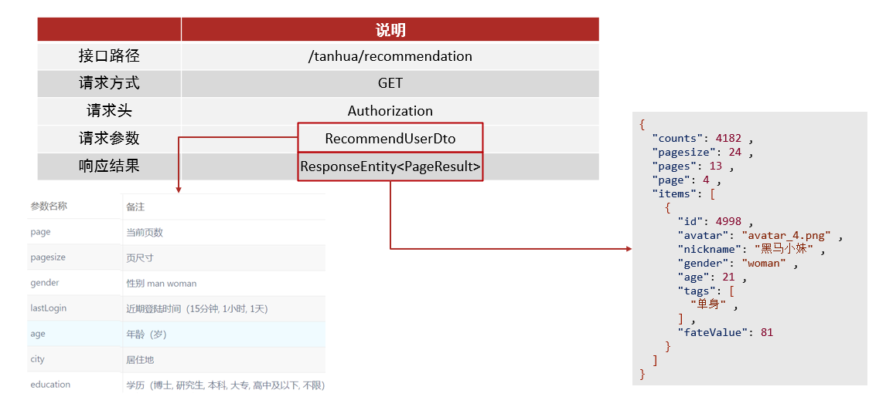
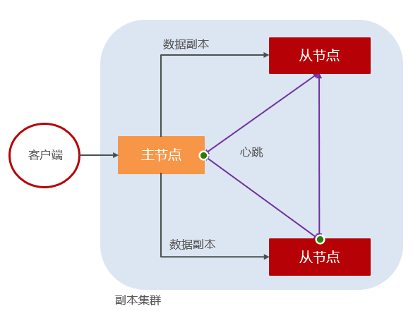
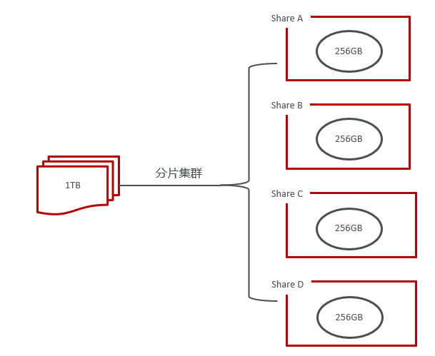
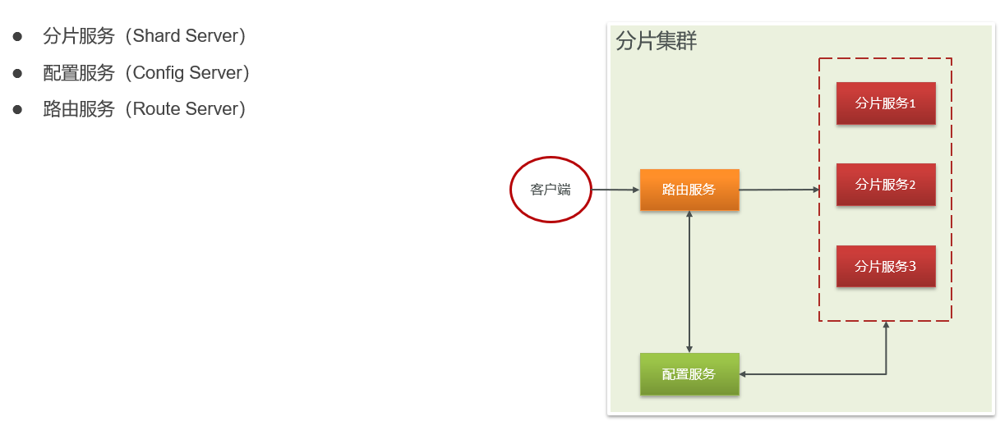
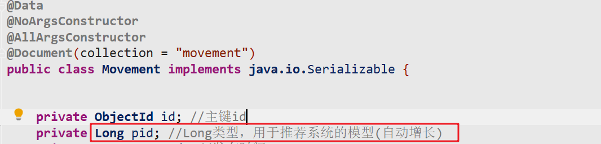
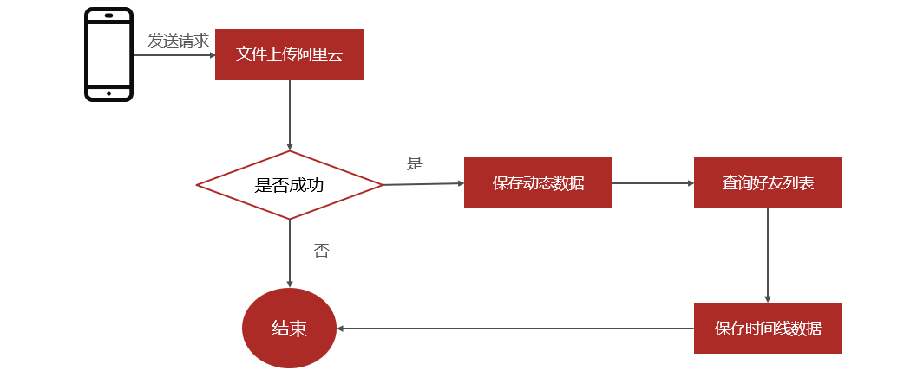
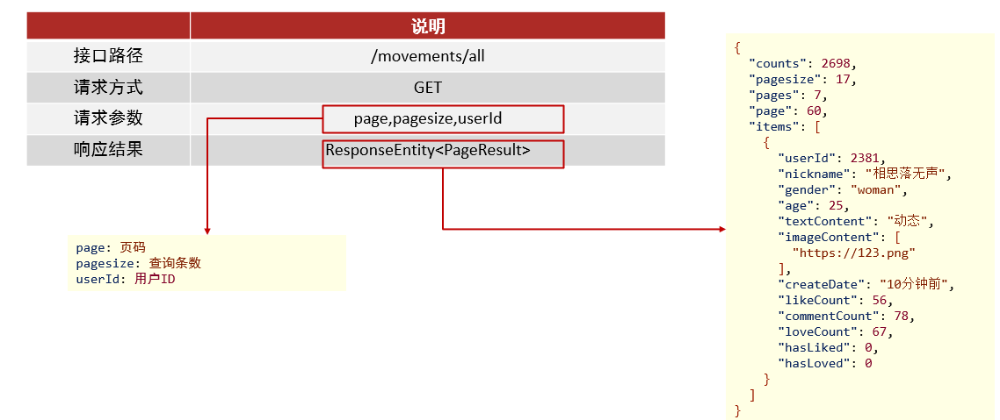

# 1. 首页推荐

首页中会展示出推荐的相关用户数据

 

## 1.1 接口分析

地址：http://192.168.136.160:3000/project/19/interface/api/118

 

## 1.2 功能实现

### 请求dto对象

在<font color=red><b>`tanhua-model`</b></font>模块创建请求DTO对象`RecommendUserDto`

```java
import lombok.AllArgsConstructor;
import lombok.Data;
import lombok.NoArgsConstructor;

@Data
@NoArgsConstructor
@AllArgsConstructor
public class RecommendUserDto {

    private Integer page = 1; //当前页数
    private Integer pagesize = 10; //页尺寸
    private String gender; //性别 man woman
    private String lastLogin; //近期登陆时间
    private Integer age; //年龄
    private String city; //居住地
    private String education; //学历
}

```

### tanhua-app-server

在<font color=red><b>`tanhua-app-server`</b></font>的`TanhuaController`和`TanhuaService`中添加方法

#### TanhuaController

```java
/**
 * 分页查询推荐好友列表
 */
@GetMapping("/recommendation")
public ResponseEntity recommendation(RecommendUserDto dto) {
    PageResult pr = tanhuaService.recommendation(dto);
    return ResponseEntity.ok(pr);
}
```

#### TanhuaService

```java
//查询分页推荐好友列表
public PageResult recommendation(RecommendUserDto dto) {
    //1、获取用户id
    Long userId = UserHolder.getUserId();
    //2、调用recommendUserApi分页查询数据列表（PageResult -- RecommendUser）
    PageResult pr = recommendUserApi.queryRecommendUserList(dto.getPage(),dto.getPagesize(),userId);
    //3、获取分页中的RecommendUser数据列表
    List<RecommendUser> items = (List<RecommendUser>) pr.getItems();
    //4、判断列表是否为空
    if(items == null || items.size() <=0) {
        return pr;
    }
    //5、提取所有推荐的用户id列表
    List<Long> ids = CollUtil.getFieldValues(items, "userId", Long.class);
    UserInfo userInfo = new UserInfo();
    userInfo.setAge(dto.getAge());
    userInfo.setGender(dto.getGender());
    //6、构建查询条件，批量查询所有的用户详情
    Map<Long, UserInfo> map = userInfoApi.findByIds(ids, userInfo);
    //7、循环推荐的数据列表，构建vo对象
    List<TodayBest> list = new ArrayList<>();
    for (RecommendUser item : items) {
        UserInfo info = map.get(item.getUserId());
        if(info!=null) {
            TodayBest vo = TodayBest.init(info, item);
            list.add(vo);
        }
    }
    //8、构造返回值
    pr.setItems(list);
    return pr;
}
```

### tanhua-dubbo-interface

修改<font color=red><b>`tanhua-dubbo-interface`</b></font>模块的`RecommendUserApi`定义查询推荐用户列表方法

```java
//分页查询
PageResult queryRecommendUserList(Integer page, Integer pagesize, Long toUserId);
```

在<font color=red><b>`tanhua-dubbo-interface`</b></font>模块的`UserInfoApi`中定义根据推荐用户id集合和条件查询用户信息的方法

```java
/**
 * 批量查询用户详情
 *    返回值：Map<id,UserInfo>
 */
Map<Long,UserInfo> findByIds(List<Long> userIds,UserInfo info);
```

### tanhua-dubbo-mongo

在<font color=red><b>`tanhua-dubbo-mongo`</b></font>模块的`RecommendUserApiImpl`中实现查询推荐用户列表方法

```java
//分页查询
public PageResult queryRecommendUserList(Integer page, Integer pagesize, Long toUserId) {
    //构建Query对象
    Query query = new Query(Criteria.where("toUserId").is(toUserId));
    //总记录数
    Long count = mongoTemplate.count(query, RecommendUser.class);
    //配置分页参数
    query.skip((page-1) * pagesize)
        .limit(pagesize)
        .with(Sort.by(Sort.Order.desc("score")));
    //查询数据列表
    List<RecommendUser> recommendUsers = mongoTemplate.find(query, RecommendUser.class);
    return new PageResult(page, pagesize, count, recommendUsers);
}
```

### tanhua-dubbo-db

在<font color=red><b>`tanhua-dubbo-db`</b></font>模块的`UserInfoApiImpl`中实现根据推荐用户id集合和条件查询用户信息的方法

```java
@Override
public Map<Long, UserInfo> findByIds(List<Long> userIds, UserInfo info) {
    QueryWrapper qw = new QueryWrapper();
    //1、用户id列表
    qw.in("id",userIds);
    //2、添加筛选条件
    if(info != null) {
        if(info.getAge() != null) {
            qw.lt("age",info.getAge());
        }
        if(!StringUtils.isEmpty(info.getGender())) {
            qw.eq("gender",info.getGender());
        }
        if(!StringUtils.isEmpty(info.getNickname())) {
            qw.like("nickname",info.getNickname());
        }
    }
    List<UserInfo> list = userInfoMapper.selectList(qw);
    Map<Long, UserInfo> map = CollUtil.fieldValueMap(list, "id");
    return map;
}
```

# 2. MongoDB集群

## 2.1 单机问题分析

单机Mongodb并不适用于企业场景，存在两个问题亟需解决

1. 单点故障

   单一MongoDB提供服务，在服务器宕机时造成整体应用崩溃

2. 海量数据存储

   单一MongoDB，并不能支持海量数据存储

## 2.2 集群概述

为了解决单点故障和海量数据存储问题，MongoDB提供了三种集群形式来支持

1. Master-Slaver（主从集群）： 是一种主从副本的模式，目前已经不推荐使用
2. Replica Set （副本集群）：模式取代了 Master-Slaver 模式，是一种互为主从的关系。可以解决单点故障问题
3. Sharding （分片集群）：可以解决单点故障和海量数据存储问题

> 企业中一般由专业人员部署构建集群，故MongoDB集群不需要自行搭建，
>
> 学习集群需要理解各个集群的特点以及适用场景即可

## 2.3 副本集群

1. 包括主节点和副本节点/从节点
2. 主节点只能有一个，可以完成数据读写操作
3. 副本节点可以有多个，只能完成读操作
4. 多节点间有心跳检测，并进行数据同步
5. 主节点宕机后，副本节点选举新的主节点



## 2.4 分片集群

Sharding （分片集群）该模式适合处理大量数据，它将数据分开存储，不同服务器保存不同的数据，所有服务器数据的总和即为整个数据集。



**分片集群-内部结构**



# 3. 圈子功能分析

## 3.1 功能说明

探花交友项目中的圈子功能，类似微信的朋友圈，基本的功能为：发布动态, 浏览好友动态, 浏览推荐动态, 点赞 评论 喜欢等功能。

                

## 3.2 实现方案分析

对于圈子功能的实现，我们需要对它的功能特点做分析：

- 数据量会随着用户数增大而增大
- 读多写少
- 非好友看不到其动态内容
- ……

针对以上特点，我们来分析一下：

- 对于数据量大而言，显然不能够使用关系型数据库进行存储，我们需要通过MongoDB进行存储

**所以对于存储而言，主要是核心的3张表：**

- 动态表（movement）：记录了用户发布的动态详情内容。
- 时间线（movement_timeline）：记录动态数据与可见人（好友）的关系。
- 好友表（friend）：记录双向好友关系

## 3.3 表结构设计

> **发布表：动态总记录表（记录动态详情）**

~~~json
#表名：movement
{
"_id": ObjectId("5e82dc416401952928c211d8"),
"pid": NumberLong("10064"),
"userId": NumberLong("6"),
"textContent": "最悲伤却又是最痛苦的谎言，就是我还好，没有关系。",
"medias": [
"https://tanhua-dev.oss-cn-zhangjiakou.aliyuncs.com/photo/7/1.jpg",
"https://tanhua-dev.oss-cn-zhangjiakou.aliyuncs.com/photo/7/1564567349498.jpg",
"https://tanhua-dev.oss-cn-zhangjiakou.aliyuncs.com/photo/7/1564567352977.jpg",
"https://tanhua-dev.oss-cn-zhangjiakou.aliyuncs.com/photo/7/1564567360406.jpg"
],
"longitude": "121.588627",
"latitude": "30.935781",
"state": NumberInt("0"),
"locationName": "中国上海市奉贤区人民路445弄",
"created": NumberLong("1585634369493"),
"_class": "com.tanhua.dubbo.server.pojo.Publish"
}
~~~

> **好友时间线表：记录动态与可见人间的关系**

~~~json
#表名：movement_timeline
{
"_id": ObjectId("609cf6538743d448c02c61f0"),
"movementId": ObjectId("609cf6538743d448c02c61ef"),
"userId": NumberLong("106"),
"friendId": NumberLong("1"),
"created": NumberLong("1620899411043"),
"_class": "com.tanhua.model.mongo.MovementTimeLine"
}

~~~

> **好友关系表：记录好友的双向关系**

~~~json
#表名：friend
{
"_id": ObjectId("6018bc055098b2230031e2da"),
"created": NumberLong("1612233733056"),
"userId": NumberLong("1"),
"friendId": NumberLong("106"),
"_class": "com.itheima.domain.mongo.Friend"
}
~~~

# 4. 圈子实现

## 4.1 环境搭建

### 4.1.1 定义实体类

在`tanhua-model`中定义相关的实体类

**Movement：发布信息表（总记录表数据）**

~~~java
@Data
@NoArgsConstructor
@AllArgsConstructor
@Document(collection = "movement")
public class Movement implements java.io.Serializable {


    private ObjectId id; //主键id
    private Long pid; //Long类型，用于推荐系统的模型(自动增长)
    private Long created; //发布时间
    private Long userId;
    private String textContent; //文字
    private List<String> medias; //媒体数据，图片或小视频 url
    private String longitude; //经度
    private String latitude; //纬度
    private String locationName; //位置名称
    //状态 0：未审（默认），1：通过，2：驳回
    private Integer state = 0;

    private Integer likeCount = 0; //点赞数
    private Integer commentCount = 0; //评论数
    private Integer loveCount = 0; //喜欢数

    //根据评论类型，获取对应的互动数量
    public Integer statisCount(Integer commentType) {
        if (commentType == CommentType.LIKE.getType()) {
            return this.likeCount;
        } else if (commentType == CommentType.COMMENT.getType()) {
            return this.commentCount;
        } else {
            return loveCount;
        }
    }
}
~~~

**MovementTimeLine：好友时间线表**

~~~java
package com.tanhua.model.mongo;

import lombok.AllArgsConstructor;
import lombok.Data;
import lombok.NoArgsConstructor;
import org.bson.types.ObjectId;
import org.springframework.data.mongodb.core.mapping.Document;

/**
 * 好友时间线表
 */
@Data
@NoArgsConstructor
@AllArgsConstructor
@Document(collection = "movement_timeline")
public class MovementTimeLine implements java.io.Serializable {

    private static final long serialVersionUID = 9096178416317502524L;
    private ObjectId id;
    private ObjectId movementId;//动态id
    private Long userId;   //发布动态用户id
    private Long friendId; // 可见好友id
    private Long created; //发布的时间
}

~~~

**Friend 好友关系表**

~~~java
package com.tanhua.model.mongo;

import lombok.AllArgsConstructor;
import lombok.Data;
import lombok.NoArgsConstructor;
import org.bson.types.ObjectId;
import org.springframework.data.mongodb.core.mapping.Document;

/**
 * 好友表:好友关系表
 */
@Data
@NoArgsConstructor
@AllArgsConstructor
@Document(collection = "friend")
public class Friend implements java.io.Serializable{

    private static final long serialVersionUID = 6003135946820874230L;
    private ObjectId id;
    private Long userId; //用户id
    private Long friendId; //好友id
    private Long created; //时间
}
~~~

### 4.1.2 mongo主键自增

在保存动态的时候需要有一个`pid`字段 , 该字段是一个唯一自增的值, 用于后期的动态推荐

 

实现自增的方式有两种：Redis或者==MongoDB==

#### Sequence

在<font color=red><b>`tanhua-model`</b></font>中配置实体类Sequence

```java
package com.tanhua.domain.mongo;

import lombok.AllArgsConstructor;
import lombok.Data;
import lombok.NoArgsConstructor;
import org.bson.types.ObjectId;
import org.springframework.data.annotation.Id;
import org.springframework.data.mongodb.core.mapping.Document;
import org.springframework.data.mongodb.core.mapping.Field;

@Document(collection = "sequence")
@Data
@AllArgsConstructor
@NoArgsConstructor
public class Sequence {

    private ObjectId id;

    private long seqId; //自增序列

    private String collName;  //集合名称
}
```

#### IdWorker工具类

在<font color=red><b>`tanhua-dubbo-mongo`</b></font>中配置工具类IdWorker

```java
package com.tanhua.dubbo.utils;

import com.tanhua.domain.mongo.Sequence;
import org.springframework.beans.factory.annotation.Autowired;
import org.springframework.data.mongodb.core.FindAndModifyOptions;
import org.springframework.data.mongodb.core.MongoTemplate;
import org.springframework.data.mongodb.core.query.Criteria;
import org.springframework.data.mongodb.core.query.Query;
import org.springframework.data.mongodb.core.query.Update;
import org.springframework.stereotype.Component;

@Component
public class IdWorker {

    @Autowired
    private MongoTemplate mongoTemplate;

    public Long getNextId(String collName) {
        Query query = new Query(Criteria.where("collName").is(collName));

        Update update = new Update();
        update.inc("seqId", 1);

        FindAndModifyOptions options = new FindAndModifyOptions();
        options.upsert(true);
        options.returnNew(true);

        Sequence sequence = mongoTemplate.findAndModify(query, update, options, Sequence.class);
        return sequence.getSeqId();
    }
}

```

> 注入IdWorker，调用内部的getNextId即可获取唯一的数字ID

## 4.2 发布动态

后续的测试：使用106（13800138000）和1号用户（13500000000）

### 4.2.1 思路步骤



### 4.2.2 代码实现

#### tanhua-app-server

在<font color=red><b>`tanhua-app-server`</b></font>模块中创建`MovementController`和`MovementService`并配置方法

##### **MovementController**

```java
package com.tanhua.server.controller;

import com.tanhua.model.mongo.Movement;
import com.tanhua.model.vo.MovementsVo;
import com.tanhua.model.vo.PageResult;
import com.tanhua.model.vo.VisitorsVo;
import com.tanhua.server.service.CommentsService;
import com.tanhua.server.service.MovementService;
import org.springframework.beans.factory.annotation.Autowired;
import org.springframework.http.ResponseEntity;
import org.springframework.web.bind.annotation.*;
import org.springframework.web.multipart.MultipartFile;
import java.io.IOException;
import java.util.List;

@RestController
@RequestMapping("/movements")
public class MovementController {

    @Autowired
    private MovementService movementService;

    /**
     * 发布动态
     */
    @PostMapping
    public ResponseEntity movements(Movement movement,
                                    MultipartFile imageContent[]) throws IOException {
        movementService.publishMovement(movement,imageContent);
        return ResponseEntity.ok(null);
    }
}
```

##### **MovementService**

```java
package com.tanhua.server.service;

import cn.hutool.core.collection.CollUtil;
import com.tanhua.autoconfig.template.OssTemplate;
import com.tanhua.commons.utils.Constants;
import com.tanhua.dubbo.api.MovementApi;
import com.tanhua.dubbo.api.UserInfoApi;
import com.tanhua.dubbo.api.VisitorsApi;
import com.tanhua.model.domain.UserInfo;
import com.tanhua.model.mongo.Movement;
import com.tanhua.model.mongo.Visitors;
import com.tanhua.model.vo.ErrorResult;
import com.tanhua.model.vo.MovementsVo;
import com.tanhua.model.vo.PageResult;
import com.tanhua.model.vo.VisitorsVo;
import com.tanhua.server.exception.BusinessException;
import com.tanhua.server.interceptor.UserHolder;
import org.apache.dubbo.config.annotation.DubboReference;
import org.springframework.beans.factory.annotation.Autowired;
import org.springframework.data.redis.core.RedisTemplate;
import org.springframework.stereotype.Service;
import org.springframework.util.StringUtils;
import org.springframework.web.multipart.MultipartFile;

import java.io.IOException;
import java.util.*;
import java.util.stream.Collectors;

@Service
public class MovementService {

    @Autowired
    private OssTemplate ossTemplate;

    @DubboReference
    private MovementApi movementApi;

    /**
     * 发布动态
     */
    public void publishMovement(Movement movement, MultipartFile[] imageContent) throws IOException {
        //1、判断发布动态的内容是否存在
        if(StringUtils.isEmpty(movement.getTextContent())) {
            throw  new BusinessException(ErrorResult.contentError());
        }
        //2、获取当前登录的用户id
        Long userId = UserHolder.getUserId();
        //3、将文件内容上传到阿里云OSS，获取请求地址
        List<String> medias = new ArrayList<>();
        for (MultipartFile multipartFile : imageContent) {
            String upload = ossTemplate.upload(multipartFile.getOriginalFilename(), multipartFile.getInputStream());
            medias.add(upload);
        }
        //4、将数据封装到Movement对象
        movement.setUserId(userId);
        movement.setMedias(medias);
        //5、调用API完成发布动态
        movementApi.publish(movement);
    }
}
```

#### tanhua-dubbo-interface

在<font color=red><b>`tanhua-dubbo-interface`</b></font>模块创建`MovementApi` , 定义发布动态的方法

MovementApi

```java
/**
 * @author Administrator
 */
public interface MovementApi {

    /**
     * 发布动态
     */
    public void publish(Movement movement);
}
```

#### tanhua-dubbo-mongo

在<font color=red><b>`tanhua-dubbo-mongo`</b></font>模块创建`MovementApiImpl` , 编写发布动态实现

MovementApiImpl

```java
package com.tanhua.dubbo.api;

import com.tanhua.dubbo.api.mongo.MovementApi;
import com.tanhua.dubbo.util.IdWorker;
import com.tanhua.model.mongo.Friend;
import com.tanhua.model.mongo.Movement;
import com.tanhua.model.mongo.MovementTimeLine;
import org.apache.dubbo.config.annotation.DubboService;
import org.springframework.beans.factory.annotation.Autowired;
import org.springframework.data.mongodb.core.MongoTemplate;
import org.springframework.data.mongodb.core.query.Criteria;
import org.springframework.data.mongodb.core.query.Query;

import java.util.List;

@DubboService
public class MovementApiImpl implements MovementApi {

    @Autowired
    private MongoTemplate mongoTemplate;

    @Autowired
    private IdWorker idWorker;

    @Override
    public String publish(Movement movement) {
        //1、保存动态详情
        try {
            //设置PID
            movement.setPid(idWorker.getNextId("movement"));
            //设置时间
            movement.setCreated(System.currentTimeMillis());
            //保存数据
            mongoTemplate.save(movement);
            //2、查询当前用户的好友数据
            Criteria criteria = Criteria.where("userId").is(movement.getUserId());
            Query query = Query.query(criteria);
            List<Friend> friends = mongoTemplate.find(query, Friend.class);
            //3、循环好友数据，构建时间线数据存入数据库
            for (Friend friend : friends) {
                MovementTimeLine timeLine = new MovementTimeLine();
                timeLine.setMovementId(movement.getId());
                timeLine.setUserId(friend.getUserId());
                timeLine.setFriendId(friend.getFriendId());
                timeLine.setCreated(System.currentTimeMillis());
                mongoTemplate.save(timeLine);
            }
        } catch (Exception e) {
            //忽略事务处理
            e.printStackTrace();
        }
    }
}
```

### 4.2.3 异步处理优化

问题 :

* 在`MovementApiImpl`类中发布动态方法中 , 需要保存好友时间线数据 , 如果用户的好友比较多, 则需要插入的数据比较多, 效率低下

解决 : 可以采用异步线程池, 开启线程来异步保存好友时间线数据 , 提高保存的效率

* 将需要异步执行的代码抽取成独立的方法
* 在方法上使用`   @Async`标注该方法是一个异步调用方法
* 在项目启动引导类上开启异步支持`@EnableAsync`

#### **开启异步支持**

```java
@SpringBootApplication
@EnableAsync //开启异步处理的支持
public class DubboMongoApplication {

    public static void main(String[] args) {
        SpringApplication.run(DubboMongoApplication.class,args);
    }
}
```

#### 异步处理类

在<font color=red><b>`tanhua-dubbo-mongo`</b></font>模块创建异步处理的`TimeLineService`

```java
package com.tanhua.dubbo.service;

import com.tanhua.model.mongo.Friend;
import com.tanhua.model.mongo.MovementTimeLine;
import org.bson.types.ObjectId;
import org.springframework.beans.factory.annotation.Autowired;
import org.springframework.data.mongodb.core.MongoTemplate;
import org.springframework.data.mongodb.core.query.Criteria;
import org.springframework.data.mongodb.core.query.Query;
import org.springframework.scheduling.annotation.Async;
import org.springframework.stereotype.Service;

import java.util.List;

@Component
public class TimeLineService {

    @Autowired
    private MongoTemplate mongoTemplate;

    @Async //底层使用多线程实现
    public void saveTimeLine(Long userId, ObjectId movementId) {
        //1、查询当前用户的好友数据
        Criteria criteria = Criteria.where("userId").is(userId);
        Query query = Query.query(criteria);
        List<Friend> friends = mongoTemplate.find(query, Friend.class);
        //2、循环好友数据，构建时间线数据存入数据库
        for (Friend friend : friends) {
            MovementTimeLine timeLine = new MovementTimeLine();
            timeLine.setMovementId(movementId);
            timeLine.setUserId(friend.getUserId());
            timeLine.setFriendId(friend.getFriendId());
            timeLine.setCreated(System.currentTimeMillis());
            mongoTemplate.save(timeLine);
        }
    }
}
```

#### **调用异步方法**

修改<font color=red><b>`tanhua-dubbo-mongo`</b></font>的publish方法

```java
@DubboService
public class MovementApiImpl implements MovementApi {

    @Autowired
    private MongoTemplate mongoTemplate;

    @Autowired
    private IdWorker idWorker;

    @Autowired
    private TimeLineService timeLineService;

    @Override
    public void publish(Movement movement) {
        //1. 保存动态数据
        movement.setPid(idWorker.getNextId("movement"));
        movement.setCreated(System.currentTimeMillis());
        mongoTemplate.save(movement);
        //2. 保存好友时间线数据
        timeLineService.saveTimeLine(movement.getUserId(), movement.getId());
    }
}
```

## 4.3 查询个人动态

查询好友动态其实就是查询自己的时间线表，好友在发动态时已经将动态信息写入到了自己的时间线表中。

### 4.3.1 需求分析

#### 接口说明

接口地址：http://192.168.136.160:3000/project/19/interface/api/154



#### 思路分析

* 构建vo对象

* API层根据当前用户id查询动态数据

* Service根据API接口封装VO对象

### 4.3.2 代码实现

#### 定义vo对象

<font color=red><b>`tanhua-model`</b></font>模块定义vo对象

~~~java
package com.tanhua.model.vo;

import com.tanhua.model.domain.UserInfo;
import com.tanhua.model.mongo.Movement;
import lombok.AllArgsConstructor;
import lombok.Data;
import lombok.NoArgsConstructor;
import org.springframework.beans.BeanUtils;
import org.springframework.util.StringUtils;

import java.io.Serializable;
import java.text.SimpleDateFormat;
import java.util.Date;

@Data
@NoArgsConstructor
@AllArgsConstructor
public class MovementsVo  implements Serializable {

    private String id; //动态id

    private Long userId; //用户id
    private String avatar; //头像
    private String nickname; //昵称
    private String gender; //性别 man woman
    private Integer age; //年龄
    private String[] tags; //标签


    private String textContent; //文字动态
    private String[] imageContent; //图片动态
    private String distance; //距离
    private String createDate; //发布时间 如: 10分钟前
    private Integer likeCount = 0; //点赞数
    private Integer commentCount = 0; //评论数
    private Integer loveCount = 0; //喜欢数


    private Integer hasLiked; //是否点赞（1是，0否）
    private Integer hasLoved; //是否喜欢（1是，0否）


    public static MovementsVo init(UserInfo userInfo, Movement item) {
        MovementsVo vo = new MovementsVo();
        //设置动态数据
        BeanUtils.copyProperties(item, vo);
        vo.setId(item.getId().toHexString());
        //设置用户数据
        BeanUtils.copyProperties(userInfo, vo);
        if(!StringUtils.isEmpty(userInfo.getTags())) {
            vo.setTags(userInfo.getTags().split(","));
        }
        //图片列表
        vo.setImageContent(item.getMedias().toArray(new String[]{}));
        //距离
        vo.setDistance("500米");
        Date date = new Date(item.getCreated());
        vo.setCreateDate(new SimpleDateFormat("yyyy-MM-dd HH:mm:ss").format(date));
        //设置是否点赞(后续处理)
        vo.setHasLoved(0);
        vo.setHasLiked(0);
        return vo;
    }
}
~~~

#### tanhua-app-server

在<font color=red><b>`tanhua-app-server`</b></font>模块中`MovementController`和`MovementService`实现查询我的动态

##### **MovementController**

```java
/**
* 查询我的动态
*/
@GetMapping("/all")
public ResponseEntity findByUserId(Long userId,
                                   @RequestParam(defaultValue = "1") Integer page,
                                   @RequestParam(defaultValue = "10") Integer pagesize) {
    PageResult pr = movementService.findByUserId(userId,page,pagesize);
    return ResponseEntity.ok(pr);
}

```

##### **MovementService**

```java
//查询个人动态
public PageResult findByUserId(Long userId, Integer page, Integer pagesize) {
    //1、根据用户id，调用API查询个人动态内容（PageResult  -- Movement）
    PageResult pr = movementApi.findByUserId(userId,page,pagesize);
    //2、获取PageResult中的item列表对象
    List<Movement> items = (List<Movement>) pr.getItems();
    //3、非空判断
    if(items == null) {
        return pr;
    }
    //4、循环数据列表
    UserInfo userInfo = userInfoApi.findById(userId);
    List<MovementsVo> vos = new ArrayList<>();
    for (Movement item : items) {
        //5、一个Movement构建一个Vo对象
        MovementsVo vo = MovementsVo.init(userInfo, item);
        vos.add(vo);
    }
    //6、构建返回值
    pr.setItems(vos);
    return pr;
}
```

#### tanhua-dubbo-interface

在<font color=red><b>`tanhua-dubbo-interface`</b></font>模块中`MovementApi`中定义查询用户动态列表的方法

```java
//根据用户id，查询此用户发布的动态数据列表
PageResult findByUserId(Long userId, Integer page, Integer pagesize);
```

#### tanhua-dubbo-mongo

在<font color=red><b>`tanhua-dubbo-mongo`</b></font>模块中`MovementApiImpl`中实现查询用户动态列表的方法

```java
@Override
public PageResult findByUserId(Long userId, Integer page, Integer pagesize) {
    //创建Criteria
    Criteria criteria = Criteria.where("userId").is(userId);
    //创建Query对象
    Query query = Query.query(criteria);
    //查询总记录数
    long count = mongoTemplate.count(query, Movement.class);
    //设置分页查询参数
    query.skip((page -1 ) * pagesize).limit(pagesize)
        .with(Sort.by(Sort.Order.desc("created")));
    //查询分页数据列表
    List<Movement> movements = mongoTemplate.find(query, Movement.class);
    //构造返回值
    return new PageResult(page,pagesize,count,movements);
}
```

### 4.3.3 访问测试

 

