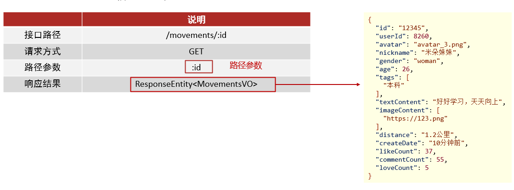

# 课程说明

- 圈子动态查询
- 圈子实现评论
- 圈子实现点赞 喜欢功能
- 圈子实现评论

# 1. 动态查询

我的动态：查询个人发布的动态列表（分页查询），和之前实现的好友动态，推荐动态实现逻辑是一致。

## 1.1 查询好友动态

查询好友动态与查询推荐动态显示的结构是一样的，只是其查询数据源不同

### 1.1.1 接口文档

API接口文档：http://192.168.136.160:3000/project/19/interface/api/142

 

### 1.1.2 代码步骤

* Controller层接受请求参数
* Service数据封装
    * 调用API查询好友动态详情数据
    * 调用API查询动态发布人详情
    * 构造VO对象

* API层根据用户ID查询好友发布动态详情
    * 查询好友时间线表
    * 查询动态详情

### 1.1.3 代码实现

好友动态和推荐动态的展示格式和我的动态相同，使用相同的vo封装数据即可 !

#### tanhua-app-server

在<font color=red><b>`tanhua-app-server`</b></font>模块的MovementController和MovementService中添加查询好友动态功能

##### **MovementController**

```java
/**
* 查询好友动态
*/
@GetMapping
public ResponseEntity movements(@RequestParam(defaultValue = "1") Integer page,
                                @RequestParam(defaultValue = "10") Integer pagesize) {
    PageResult pr = movementService.findFriendMovements(page,pagesize);
    return ResponseEntity.ok(pr);
}
```

##### **MovementService**

```java
//查询好友动态
public PageResult findFriendMovements(Integer page, Integer pagesize) {
    //1、获取当前用户的id
    Long userId = UserHolder.getUserId();
    //2、调用API查询当前用户好友发布的动态列表
    List<Movement> list = movementApi.findFriendMovements(page,pagesize,userId);
    //3、判断列表是否为空
    return getPageResult(page, pagesize, list);
}

//抽取公共方法
private PageResult getPageResult(Integer page, Integer pagesize, List<Movement> list) {
    if(CollUtil.isEmpty(list)) {
        return new PageResult();
    }
    //4、提取动态发布人的id列表
    List<Long> userIds = CollUtil.getFieldValues(list, "userId", Long.class);
    //5、根据用户的id列表获取用户详情
    Map<Long, UserInfo> map = userInfoApi.findByIds(userIds, null);
    //6、一个Movement构造一个vo对象
    List<MovementsVo> vos = new ArrayList<>();
    for (Movement movement : list) {
        UserInfo userInfo = map.get(movement.getUserId());
        if(userInfo != null) {
            MovementsVo vo = MovementsVo.init(userInfo, movement);
            vos.add(vo);
        }
    }
    //7、构造PageResult并返回
    return new PageResult(page, pagesize,0l,vos);
}
```

#### tanhua-dubbo-interface

在<font color=red><b>`tanhua-dubbo-interface`</b></font>模块的`MovementApi`添加方法

MovementApi

```java
/**
 * 查询好友动态
 */
List<Movement> findFriendMovements(Integer page, Integer pagesize, Long userId);
```

#### tanhua-dubbo-mongo

在<font color=red><b>`tanhua-dubbo-mongo`</b></font>模块的`MovementApiImpl`添加方法

MovementApiImpl

```java
/**
* 查询当前用户好友发布的所有动态
* @param friendId:当前操作用户id
*/
public List<Movement> findFriendMovements(Integer page, Integer pagesize, Long friendId) {
    //1、根据friendId查询时间线表
    Query query = Query.query(Criteria.where("friendId").is(friendId))
        .skip((page -1) * pagesize).limit(pagesize).with(Sort.by(Sort.Order.desc("created")));
    List<MovementTimeLine> lineList = mongoTemplate.find(query, MovementTimeLine.class);
    //2、提取动态id列表
    List<ObjectId> list = CollUtil.getFieldValues(lineList, "movementId", ObjectId.class);
    //3、根据动态id查询动态详情
    Query movementQuery = Query.query(Criteria.where("id").in(list));
    return mongoTemplate.find(movementQuery,Movement.class);
}
```

## 1.2 查询推荐动态

推荐动态是通过推荐系统计算出的结果，现在我们只需要实现查询即可，推荐系统在后面的课程中完成。

推荐系统计算完成后，会将结果数据写入到Redis中，数据如下：

~~~shell
192.168.31.81:6379> get MOVEMENTS_RECOMMEND_1
"2562,3639,2063,3448,2128,2597,2893,2333,3330,2642,2541,3002,3561,3649,2384,2504,3397,2843,2341,2249"
~~~

可以看到，在Redis中的数据是有多个发布id组成（pid）由逗号分隔。所以实现中需要自己对这些数据做分页处理。

### 1.2.1 接口文档

API接口文档：http://192.168.136.160:3000/project/19/interface/api/145

 

### 1.2.2 代码步骤

* Controller层接受请求参数
* Service数据封装
    * 从redis获取当前用户的推荐PID列表
    * 如果不存在，调用API随机获取10条动态数据
    * 如果存在，调用API根据PID列表查询动态数据
    * 构造VO对象

* API层编写方法
    * 随机获取
    * 根据pid列表查询

### 1.2.3 代码实现

#### tanhua-app-server

在<font color=red><b>`tanhua-app-server`</b></font>模块的MovementController和MovementService中添加查询推荐动态功能

##### **MovementController**

```java
/**
 * 查询推荐动态列表
 */
@GetMapping("/recommend")
public ResponseEntity recommend(@RequestParam(defaultValue = "1") Integer page,
                                @RequestParam(defaultValue = "10") Integer pagesize) {
    PageResult pr = movementService.findRecommendMovements(page,pagesize);
    return ResponseEntity.ok(pr);
}
```

##### **MovementService**

```java
/**
 * 查询推荐动态
 */
public PageResult findRecommendMovements(Integer page, Integer pagesize) {
    //1、从redis中获取推荐数据
    String redisKey = Constants.MOVEMENTS_RECOMMEND +UserHolder.getUserId();
    String redisValue = redisTemplate.opsForValue().get(redisKey);
    //2、判断推荐数据是否存在
    List<Movement> list = Collections.EMPTY_LIST;
    if(StringUtils.isEmpty(redisValue)) {
        //3、如果不存在，调用API随机构造10条动态数据
        list = movementApi.randomMovements(pagesize);
    }else {
        //4、如果存在，处理pid数据   "16,17,18,19,20,21,10015,10020,10040,10064,10092,10093,10099,10067" 15
        String[] values = redisValue.split(",");
        //判断当前页的起始条数是否小于数组总数
        if( (page -1) * pagesize < values.length) {
            List<Long> pids = Arrays.stream(values).skip((page - 1) * pagesize).limit(pagesize)
                .map(e->Long.valueOf(e))
                .collect(Collectors.toList());
            //5、调用API根据PID数组查询动态数据
            list = movementApi.findMovementsByPids(pids);
        }
    }
    //6、调用公共方法构造返回值
    return getPageResult(page,pagesize,list);
}
```

#### tanhua-dubbo-interface

在<font color=red><b>`tanhua-dubbo-interface`</b></font>模块的`MovementApi`添加方法

MovementApi

```java
//根据pid数组查询动态
List<Movement> findMovementsByPids(List<Long> pids);

//随机获取多条动态数据
List<Movement> randomMovements(Integer counts);
```

#### tanhua-dubbo-mongo

在<font color=red><b>`tanhua-dubbo-mongo`</b></font>模块的`MovementApiImpl`添加方法

MovementApiImpl

```java
//根据pid查询
public List<Movement> findMovementsByPids(List<Long> pids) {
    Query query = Query.query(Criteria.where("pid").in(pids));
    return mongoTemplate.find(query,Movement.class);
}

//随机查询多条数据
public List<Movement> randomMovements(Integer counts) {
    //1、创建统计对象，设置统计参数
    TypedAggregation aggregation = Aggregation.newAggregation(Movement.class,Aggregation.sample(counts));
    //2、调用mongoTemplate方法统计
    AggregationResults<Movement> results = mongoTemplate.aggregate(aggregation, Movement.class);
    //3、获取统计结果
    return results.getMappedResults();
}
```

#### 常量类

在<font color=red><b>`tanhua-commons`</b></font>模块添加常量类**Constants**

**Constants**

```java
package com.tanhua.commons.utils;

//常量定义
public class Constants {

    //手机APP短信验证码CHECK_CODE_
    public static final String SMS_CODE = "CHECK_CODE_";

    //手机APP短信验证码CHECK_CODE_
    public static final String CAP_CODE = "CHECK_CODE_";

    //冻结用户状态KEY
    public static final String USER_FREEZE = "USER_FREEZE_";

    //冻结HashKEY
    public static final String FREEZE_USER = "FREEZE_USER_";

	//推荐动态
	public static final String MOVEMENTS_RECOMMEND = "MOVEMENTS_RECOMMEND_";

    //推荐视频
    public static final String VIDEOS_RECOMMEND = "VIDEOS_RECOMMEND_";

	//圈子互动KEY
	public static final String MOVEMENTS_INTERACT_KEY = "MOVEMENTS_INTERACT_";

    //动态点赞用户HashKey
    public static final String MOVEMENT_LIKE_HASHKEY = "MOVEMENT_LIKE_";

    //动态喜欢用户HashKey
    public static final String MOVEMENT_LOVE_HASHKEY = "MOVEMENT_LOVE_";

    //视频点赞用户HashKey
    public static final String VIDEO_LIKE_HASHKEY = "VIDEO_LIKE";

    //访问用户
    public static final String VISITORS_USER = "VISITOR_USER";

	//初始化密码
    public static final String INIT_PASSWORD = "123456";

    //环信用户前缀
    public static final String HX_USER_PREFIX = "hx";

    //jwt加密盐
    public static final String JWT_SECRET = "itcast";

    //jwt超时时间
    public static final int JWT_TIME_OUT = 3_600;

    //用户喜欢Redis的key
    public static final String USER_LIKE_KEY="USER_LIKE_SET_";

    //用户不喜欢Redis的key
    public static final String USER_NOT_LIKE_KEY="USER_NOT_LIKE_SET_";

    //关注用户的key
    public static final String FOCUS_USER_KEY = "FOCUS_USER_KEY_";
}

```

## 1.3 根据id查询动态

根据id查询动态：当手机端查看评论内容时（需要根据动态id，查询动态详情），后续再去查询评论列表

### 1.3.1 接口文档

API接口文档：http://192.168.136.160:3000/project/19/interface/api/151

 

### 1.3.2 代码实现

#### tanhua-app-server

在<font color=red><b>`tanhua-app-server`</b></font>模块的`MovementController`和`MovementService`中添加方法

**MovementController**

```java
/**
 * 查询单条动态
*/
@GetMapping("/{id}")
public ResponseEntity findById(@PathVariable("id") String movementId) {
    MovementsVo vo = movementService.findById(movementId);
    return ResponseEntity.ok(vo);
}
```

**MovementService**

```java
//根据id查询
public MovementsVo findById(String movementId) {
    //1、调用api根据id查询动态详情
    Movement movement = movementApi.findById(movementId);
    //2、转化vo对象
    if(movement != null) {
        UserInfo userInfo = userInfoApi.findById(movement.getUserId());
        return MovementsVo.init(userInfo,movement);
    }else {
        return null;
    }
}
```

#### tanhua-dubbo-interface

在<font color=red><b>`tanhua-dubbo-interface`</b></font>模块的`MovementApi`添加方法

```java
//根据id查询
Movement findById(String movementId);
```

#### tanhua-dubbo-mongo

在<font color=red><b>`tanhua-dubbo-mongo`</b></font>模块的`MovementApiImpl`添加方法

```java
@Override
public Movement findById(String movementId) {
    return mongoTemplate.findById(movementId,Movement.class);
}
```

# 2. 圈子互动

点赞 喜欢 评论等均可理解为用户对动态的互动。

数据库表：`comment`

```shell
将数据记录到表中：保存到MongoDB中
互动表需要几张：需要一张表即可（quanzi_comment）
里面的数据需要分类：通过字段commentType 1-点赞，2-评论，3-喜欢
{
    "_id" : ObjectId("5fe7f9263c851428107cd4e8"),
    "publishId" : ObjectId("5fae53947e52992e78a3afa5"),
    "commentType" : 1,
    "userId" : NumberLong(1),
    "publishUserId" : NumberLong(1),
    "created" : NumberLong(1609038118275),
    "likeCount" : 0,
    "_class" : "com.tanhua.domain.mongo.Comment"
}
```

数据存储位置：**redis**，**mongodb**

**mongodb中的数据**

* **在动态详情Movement表中，加入喜欢，点赞，评论数量：检查数据库访问压力**
    * 互动操作的时候，不要忘记对上面的字段进行维护
* **圈子互动的表 comment**
* 互动完成（点赞，喜欢）：不仅要将数据保存到mongo中，需要记录到redis中
* 页面查询圈子列表时，可以从redis中判断是否有点赞，和喜欢历史

## 2.1 环境搭建

### 2.1.1 实体类对象

创建实体类对象Comment

```java
package com.tanhua.model.mongo;

import lombok.AllArgsConstructor;
import lombok.Data;
import lombok.NoArgsConstructor;
import org.bson.types.ObjectId;
import org.springframework.data.mongodb.core.mapping.Document;

/**
 * 圈子互动表（点赞，评论，喜欢）
 */
@Data
@NoArgsConstructor
@AllArgsConstructor
@Document(collection = "comment")
public class Comment implements java.io.Serializable{
    
    private ObjectId id;
    private ObjectId publishId;    //动态id
    private Integer commentType;   //评论类型，1-点赞，2-评论，3-喜欢
    private String content;        //评论内容  
    private Long userId;           //评论人   
    private Long publishUserId;    //被评论人ID
    private Long created; 		   //发表时间
    private Integer likeCount = 0; //当前评论的点赞数
    
}
```

**Movement**

对动态进行评论点赞操作 , 需要返回操作之后的数量 , 为了方便操作在`Movement`实体类中提供一个`statisCount`方法, 根据评论类型获取数量

```java
package com.tanhua.model.mongo;

import com.tanhua.model.enums.CommentType;
import lombok.AllArgsConstructor;
import lombok.Data;
import lombok.NoArgsConstructor;
import org.bson.types.ObjectId;
import org.springframework.data.mongodb.core.mapping.Document;

import java.util.List;

//动态详情表
@Data
@NoArgsConstructor
@AllArgsConstructor
@Document(collection = "movement")
public class Movement implements java.io.Serializable {


    private ObjectId id; //主键id
    //redis实现，使用Mongodb实现
    private Long pid; //Long类型，用于推荐系统的模型(自动增长)
    private Long created; //发布时间
    private Long userId;
    private String textContent; //文字
    private List<String> medias; //媒体数据，图片或小视频 url
    private String longitude; //经度
    private String latitude; //纬度
    private String locationName; //位置名称
    //状态 0：未审（默认），1：通过，2：驳回
    private Integer state = 0;

    private Integer likeCount = 0; //点赞数
    private Integer commentCount = 0; //评论数
    private Integer loveCount = 0; //喜欢数

    //根据评论类型，获取对应的互动数量
    public Integer statisCount(Integer commentType) {
        if (commentType == CommentType.LIKE.getType()) {
            return this.likeCount;
        } else if (commentType == CommentType.COMMENT.getType()) {
            return this.commentCount;
        } else {
            return loveCount;
        }
    }
}
```

### 2.1.2 CommentVo对象

```java
package com.tanhua.model.vo;


import com.tanhua.model.domain.UserInfo;
import com.tanhua.model.mongo.Comment;
import lombok.AllArgsConstructor;
import lombok.Data;
import lombok.NoArgsConstructor;
import org.springframework.beans.BeanUtils;

import java.io.Serializable;
import java.text.SimpleDateFormat;
import java.util.Date;

@Data
@NoArgsConstructor
@AllArgsConstructor
public class CommentVo implements Serializable {

    private String id; //评论id
    private String avatar; //头像
    private String nickname; //昵称


    private String content; //评论
    private String createDate; //评论时间

    private Integer likeCount; //点赞数
    private Integer hasLiked; //是否点赞（1是，0否）

    public static CommentVo init(UserInfo userInfo, Comment item) {
        CommentVo vo = new CommentVo();
        BeanUtils.copyProperties(userInfo, vo);
        BeanUtils.copyProperties(item, vo);
        vo.setHasLiked(0);
        Date date = new Date(item.getCreated());
        vo.setCreateDate(new SimpleDateFormat("yyyy-MM-dd HH:mm:ss").format(date));
        vo.setId(item.getId().toHexString());
        return vo;
    }
}
```

### 2.1.3 CommentType枚举

```java
package com.tanhua.model.enums;

/**
 * 评论类型：1-点赞，2-评论，3-喜欢
 */
public enum CommentType {

    LIKE(1), COMMENT(2), LOVE(3);

    int type;

    CommentType(int type) {
        this.type = type;
    }

    public int getType() {
        return type;
    }
}
```

## 2.2 动态评论

功能包括：查询评论列表，发布评论，对评论点赞和取消点赞。

### 2.2.1 评论列表查询

#### 接口文档

接口地址：http://192.168.136.160:3000/project/19/interface/api/178

 

#### tanhua-app-server

在<font color=red><b>`tanhua-app-server`</b></font>模块创建`CommentController`和`CommentService`完成评论列表查询

##### **CommentController**

```java
package com.tanhua.server.controller;

import com.tanhua.model.vo.PageResult;
import com.tanhua.server.service.CommentsService;
import org.springframework.beans.factory.annotation.Autowired;
import org.springframework.http.ResponseEntity;
import org.springframework.web.bind.annotation.*;

import java.util.Map;

@RestController
@RequestMapping("/comments")
public class CommentsController {

    @Autowired
    private CommentsService commentsService;

    //分页查询评理列表
    @GetMapping
    public ResponseEntity findComments(@RequestParam(defaultValue = "1") Integer page,
                                    @RequestParam(defaultValue = "10") Integer pagesize,
                                       String movementId) {
        PageResult pr = commentsService.findComments(movementId,page,pagesize);
        return ResponseEntity.ok(pr);
    }
}
```

**CommentService**

```java
package com.tanhua.server.service;

import cn.hutool.core.collection.CollUtil;
import com.tanhua.commons.utils.Constants;
import com.tanhua.dubbo.api.CommentApi;
import com.tanhua.dubbo.api.UserInfoApi;
import com.tanhua.model.domain.UserInfo;
import com.tanhua.model.enums.CommentType;
import com.tanhua.model.mongo.Comment;
import com.tanhua.model.vo.CommentVo;
import com.tanhua.model.vo.ErrorResult;
import com.tanhua.model.vo.PageResult;
import com.tanhua.server.exception.BusinessException;
import com.tanhua.server.interceptor.UserHolder;
import lombok.extern.slf4j.Slf4j;
import org.apache.dubbo.config.annotation.DubboReference;
import org.bson.types.ObjectId;
import org.springframework.beans.factory.annotation.Autowired;
import org.springframework.data.redis.core.RedisTemplate;
import org.springframework.stereotype.Service;
import java.util.ArrayList;
import java.util.List;
import java.util.Map;

@Service
@Slf4j
public class CommentsService {

    @DubboReference
    private CommentApi commentApi;

    @DubboReference
    private UserInfoApi userInfoApi;

    @Autowired
    private RedisTemplate<String,String> redisTemplate;


    //分页查询评理列表
    public PageResult findComments(String movementId, Integer page, Integer pagesize) {
        //1、调用API查询评论列表
        List<Comment> list = commentApi.findComments(movementId,CommentType.COMMENT,page,pagesize);
        //2、判断list集合是否存在
        if(CollUtil.isEmpty(list)) {
            return new PageResult();
        }
        //3、提取所有的用户id,调用UserInfoAPI查询用户详情
        List<Long> userIds = CollUtil.getFieldValues(list, "userId", Long.class);
        Map<Long, UserInfo> map = userInfoApi.findByIds(userIds, null);
        //4、构造vo对象
        List<CommentVo> vos = new ArrayList<>();
        for (Comment comment : list) {
            UserInfo userInfo = map.get(comment.getUserId());
            if(userInfo != null) {
                CommentVo vo = CommentVo.init(userInfo, comment);
                vos.add(vo);
            }
        }
        //5、构造返回值
        return new PageResult(page,pagesize,0l,vos);
    }
}
```

#### tanhua-dubbo-interface

在<font color=red><b>`tanhua-dubbo-interface`</b></font>模块创建`CommentApi`类, 定义查询评论列表的方法

CommentApi

```java
public interface CommentApi {

    //分页查询
    List<Comment> findComments(String movementId, CommentType comment, Integer page, Integer pagesize);
}
```

#### tanhua-dubbo-mongo

在<font color=red><b>`tanhua-dubbo-mongo`</b></font>模块创建`CommentApiImpl`类, 实现查询评论列表的方法

CommentApiImpl

```java
package com.tanhua.dubbo.api;

import com.tanhua.model.enums.CommentType;
import com.tanhua.model.mongo.Comment;
import com.tanhua.model.mongo.Movement;
import org.apache.dubbo.config.annotation.DubboService;
import org.bson.types.ObjectId;
import org.springframework.beans.factory.annotation.Autowired;
import org.springframework.data.domain.Sort;
import org.springframework.data.mongodb.core.FindAndModifyOptions;
import org.springframework.data.mongodb.core.MongoTemplate;
import org.springframework.data.mongodb.core.query.Criteria;
import org.springframework.data.mongodb.core.query.Query;
import org.springframework.data.mongodb.core.query.Update;

import java.util.List;

@DubboService
public class CommentApiImpl implements  CommentApi {

    @Autowired
    private MongoTemplate mongoTemplate;

    //分页查询
    public List<Comment> findComments(String movementId, CommentType commentType, Integer page, Integer pagesize) {
        //1、构造查询条件
        Query query = Query.query(Criteria.where("publishId").is(new ObjectId(movementId)).and("commentType")
                .is(commentType.getType()))
                .skip((page -1) * pagesize)
                .limit(pagesize)
                .with(Sort.by(Sort.Order.desc("created")));
        //2、查询并返回
        return mongoTemplate.find(query,Comment.class);
    }
}
```

### 2.2.2 发布评论

#### 接口文档

接口地址：http://192.168.136.160:3000/project/19/interface/api/181

 

#### tanhua-app-server

在<font color=red><b>`tanhua-app-server`</b></font>模块的`CommentController`和`CommentService`完成发布评论

##### **CommentController**

```java
@PostMapping
public ResponseEntity saveComments(@RequestBody Map map) {
    String movementId = (String )map.get("movementId");
    String comment = (String)map.get("comment");
    commentsService.saveComments(movementId,comment);
    return ResponseEntity.ok(null);
}
```

##### **CommentService**

```java
//发布评论
public void saveComments(String movementId, String comment) {
    //1、获取操作用户id
    Long userId = UserHolder.getUserId();
    //2、构造Comment
    Comment comment1 = new Comment();
    comment1.setPublishId(new ObjectId(movementId));
    comment1.setCommentType(CommentType.COMMENT.getType());
    comment1.setContent(comment);
    comment1.setUserId(userId);
    comment1.setCreated(System.currentTimeMillis());
    //3、调用API保存评论
    Integer commentCount = commentApi.save(comment1);
    log.info("commentCount = " + commentCount);
}
```

#### tanhua-dubbo-interface

在<font color=red><b>`tanhua-dubbo-interface`</b></font>模块的`CommentApi`中定义发布评论的方法

CommentApi

```java
//发布评论，并获取评论数量
Integer save(Comment comment1);
```

#### tanhua-dubbo-mongo

在<font color=red><b>`tanhua-dubbo-mongo`</b></font>模块的`CommentApiImpl`中实现发布评论的方法 , `文本评论/点赞/喜欢`
通用方法

CommentApiImpl

```java
//发布评论，并获取评论数量
public Integer save(Comment comment) {
    //1、查询动态
    Movement movement = mongoTemplate.findById(comment.getPublishId(), Movement.class);
    //2、向comment对象设置被评论人属性
    if(movement != null) {
        comment.setPublishUserId(movement.getUserId());
    }
    //3、保存到数据库
    mongoTemplate.save(comment);
    //4、更新动态表中的对应字段
    Query query = Query.query(Criteria.where("id").is(comment.getPublishId()));
    Update update = new Update();
    if(comment.getCommentType() == CommentType.LIKE.getType()) {
        update.inc("likeCount",1);
    }else if (comment.getCommentType() == CommentType.COMMENT.getType()){
        update.inc("commentCount",1);
    }else {
        update.inc("loveCount",1);
    }
    //设置更新参数
    FindAndModifyOptions options = new FindAndModifyOptions();
    options.returnNew(true) ;//获取更新后的最新数据
    Movement modify = mongoTemplate.findAndModify(query, update, options, Movement.class);
    //5、获取最新的评论数量，并返回
    return modify.statisCount(comment.getCommentType() );
}
```

## 2.3 动态点赞

### 2.3.1 动态点赞

#### 接口文档

接口地址：http://192.168.136.160:3000/project/19/interface/api/157


#### tanhua-app-server

在<font color=red><b>`tanhua-app-server`</b></font>模块的`MovementController`和`MovementService`完成动态点赞

##### **MovementController**

```java
/**
 * 点赞
 */
@GetMapping("/{id}/like")
public ResponseEntity like(@PathVariable("id") String movementId) {
    Integer likeCount = commentsService.likeComment(movementId);
    return ResponseEntity.ok(likeCount);
}
```

##### **MovementService**

```java
//动态点赞
public Integer likeComment(String movementId) {
    //1、调用API查询用户是否已点赞
    Boolean hasComment = commentApi.hasComment(movementId,UserHolder.getUserId(),CommentType.LIKE);
    //2、如果已经点赞，抛出异常
    if(hasComment) {
        throw new BusinessException(ErrorResult.likeError());
    }
    //3、调用API保存数据到Mongodb
    Comment comment = new Comment();
    comment.setPublishId(new ObjectId(movementId));
    comment.setCommentType(CommentType.LIKE.getType());
    comment.setUserId(UserHolder.getUserId());
    comment.setCreated(System.currentTimeMillis());
    Integer count = commentApi.save(comment);
    //4、拼接redis的key，将用户的点赞状态存入redis
    String key = Constants.MOVEMENTS_INTERACT_KEY + movementId;
    String hashKey = Constants.MOVEMENT_LIKE_HASHKEY + UserHolder.getUserId();
    redisTemplate.opsForHash().put(key,hashKey,"1");
    return count;
}
```

#### tanhua-dubbo-interface

点赞也是一种评论 , 所以动态点赞的保存逻辑和评论发布基本相同 , 只是在保存之前需要判断是否已经点赞

在<font color=red><b>`tanhua-dubbo-interface`</b></font>模块的在`CommentApi`中定义查询用户是否点赞该动态的方法

CommentApi

```java
/**
 * 判断comment数据是否存在
 */
 Boolean hasComment(String movementId, Long userId, CommentType like);
```

#### tanhua-dubbo-mongo

在<font color=red><b>`tanhua-dubbo-mongo`</b></font>模块的`CommentApiImpl`中实现查询用户是否点赞该动态的方法

```java
//判断comment数据是否存在
public Boolean hasComment(String movementId, Long userId, CommentType commentType) {
    Criteria criteria = Criteria.where("userId").is(userId)
        .and("publishId").is(new ObjectId(movementId))
        .and("commentType").is(commentType.getType());
    Query query = Query.query(criteria);
    return mongoTemplate.exists(query,Comment.class); //判断数据是否存在
}
```

### 2.3.2 取消点赞

#### 接口文档

接口地址：http://192.168.136.160:3000/project/19/interface/api/160


#### **tanhua-app-server**

在<font color=red><b>`tanhua-app-server`</b></font>模块的`MovementController`和`MovementService`完成动态取消点赞

**MovementController**

```java
/**
 * 评论取消点赞
 */
@GetMapping("/{id}/dislike")
public ResponseEntity dislike(@PathVariable("id") String movementId) {
    Integer likeCount = commentsService.dislikeComment(movementId);
    return ResponseEntity.ok(likeCount);
}
```

**MovementService**

```java
//取消点赞
public Integer dislikeComment(String movementId) {
    //1、调用API查询用户是否已点赞
    Boolean hasComment = commentApi.hasComment(movementId,UserHolder.getUserId(),CommentType.LIKE);
    //2、如果未点赞，抛出异常
    if(!hasComment) {
        throw new BusinessException(ErrorResult.disLikeError());
    }
    //3、调用API，删除数据，返回点赞数量
    Comment comment = new Comment();
    comment.setPublishId(new ObjectId(movementId));
    comment.setCommentType(CommentType.LIKE.getType());
    comment.setUserId(UserHolder.getUserId());
    Integer count = commentApi.delete(comment);
    //4、拼接redis的key，删除点赞状态
    String key = Constants.MOVEMENTS_INTERACT_KEY + movementId;
    String hashKey = Constants.MOVEMENT_LIKE_HASHKEY + UserHolder.getUserId();
    redisTemplate.opsForHash().delete(key,hashKey);
    return count;
}
```

#### tanhua-dubbo-interface

在<font color=red><b>`tanhua-dubbo-interface`</b></font>模块的`CommentApi`定义取消动态点赞的方法

```java
//删除comment数据
Integer delete(Comment comment);
```

#### tanhua-dubbo-mongo

在<font color=red><b>`tanhua-dubbo-mongo`</b></font>模块的`CommentApi`实现取消动态点赞的方法

```java
//删除
public Integer delete(Comment comment) {
    //1、删除Comment表数据
    Criteria criteria = Criteria.where("userId").is(comment.getUserId())
        .and("publishId").is(comment.getPublishId())
        .and("commentType").is(comment.getCommentType());
    Query query = Query.query(criteria);
    mongoTemplate.remove(query,Comment.class);
    //2、修改动态表中的总数量
    Query movementQuery = Query.query(Criteria.where("id").is(comment.getPublishId()));
    Update update = new Update();
    if(comment.getCommentType() == CommentType.LIKE.getType()) {
        update.inc("likeCount",-1);
    }else if (comment.getCommentType() == CommentType.COMMENT.getType()){
        update.inc("commentCount",-1);
    }else {
        update.inc("loveCount",-1);
    }
    //设置更新参数
    FindAndModifyOptions options = new FindAndModifyOptions();
    options.returnNew(true) ;//获取更新后的最新数据
    Movement modify = mongoTemplate.findAndModify(movementQuery, update, options, Movement.class);
    //5、获取最新的评论数量，并返回
    return modify.statisCount(comment.getCommentType() );
}
```

### 2.3.3 点赞标识

修改之前的查询圈子列表代码，从redis查询是否具有操作记录。


## 2.4 动态喜欢

喜欢和取消喜欢：和刚才的点赞与取消点赞类似！操作的类型comment_type=3,操作的字段loveCount

### 2.4.1 动态喜欢

#### 接口文档

接口地址：http://192.168.136.160:3000/project/19/interface/api/163

 

#### tanhua-app-server

在<font color=red><b>`tanhua-app-server`</b></font>模块的`MovementController`和`MovementService`完成动态喜欢

##### **MovementController**

```java
/**
 * 喜欢动态
 */
@GetMapping("/{id}/love")
public ResponseEntity love(@PathVariable("id") String movementId) {
    Integer likeCount = commentsService.loveComment(movementId);
    return ResponseEntity.ok(likeCount);
}
```

##### **MovementService**

```java
//喜欢
public Integer loveComment(String movementId) {
    //1、调用API查询用户是否已点赞
    Boolean hasComment = commentApi.hasComment(movementId,UserHolder.getUserId(),CommentType.LOVE);
    //2、如果已经喜欢，抛出异常
    if(hasComment) {
        throw  new BusinessException(ErrorResult.loveError());
    }
    //3、调用API保存数据到Mongodb
    Comment comment = new Comment();
    comment.setPublishId(new ObjectId(movementId));
    comment.setCommentType(CommentType.LOVE.getType());
    comment.setUserId(UserHolder.getUserId());
    comment.setCreated(System.currentTimeMillis());
    Integer count = commentApi.save(comment);
    //4、拼接redis的key，将用户的点赞状态存入redis
    String key = Constants.MOVEMENTS_INTERACT_KEY + movementId;
    String hashKey = Constants.MOVEMENT_LOVE_HASHKEY + UserHolder.getUserId();
    redisTemplate.opsForHash().put(key,hashKey,"1");
    return count;
}
```

### 2.4.2 取消喜欢

#### 接口文档

接口地址： http://192.168.136.160:3000/project/19/interface/api/166

 

#### tanhua-app-server

在<font color=red><b>`tanhua-app-server`</b></font>模块的`MovementController`和`MovementService`完成动态取消喜欢

##### **MovementController**

```java
/**
 * 取消动态喜欢
 */
@GetMapping("/{id}/unlove")
public ResponseEntity unlove(@PathVariable("id") String movementId) {
    Integer likeCount = commentsService.disloveComment(movementId);
    return ResponseEntity.ok(likeCount);
}
```

##### **MovementService**

```java
//取消喜欢
public Integer disloveComment(String movementId) {
    //1、调用API查询用户是否已点赞
    Boolean hasComment = commentApi.hasComment(movementId,UserHolder.getUserId(),CommentType.LOVE);
    //2、如果未点赞，抛出异常
    if(!hasComment) {
        throw new BusinessException(ErrorResult.disloveError());
    }
    //3、调用API，删除数据，返回点赞数量
    Comment comment = new Comment();
    comment.setPublishId(new ObjectId(movementId));
    comment.setCommentType(CommentType.LOVE.getType());
    comment.setUserId(UserHolder.getUserId());
    Integer count = commentApi.delete(comment);
    //4、拼接redis的key，删除点赞状态
    String key = Constants.MOVEMENTS_INTERACT_KEY + movementId;
    String hashKey = Constants.MOVEMENT_LOVE_HASHKEY + UserHolder.getUserId();
    redisTemplate.opsForHash().delete(key,hashKey);
    return count;
}
```

### 2.4.3 喜欢标识

修改之前的查询圈子列表代码，从redis查询是否具有喜欢操作记录。同点赞

