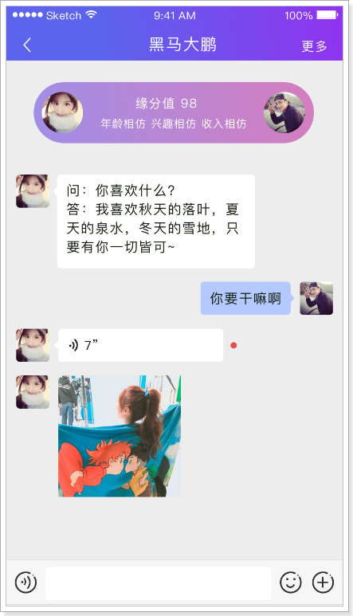
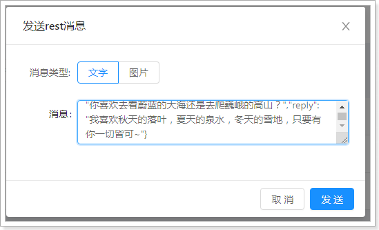

# 1. 即时通信

## 1.1 什么是即时通信

即时通信（Instant Messaging，简称 IM ）是一个实时通信系统，允许两人或多人使用网络实时的传递文字消息、文件、语音与视频交流。

## 1.2 功能说明

在探花交友项目中也提供了类似微信的聊天功能，用户可以和好友或陌生人聊天。

如果是陌生人，通过《聊一下》功能进行打招呼，如果对方同意后，就成为了好友，可以进行聊天了。

陌生人之间如果相互喜欢，那么就会成为好友，也就可以聊天了。

在消息界面中也可以查看：点赞 评论 喜欢 公告等消息信息。

                    

## 1.3 技术方案

对于高并发的即时通讯实现，还是很有挑战的，所需要考虑的点非常多，除了要实现功能，还要考虑并发 流量 负载 服务器
容灾等等。虽然有难度也并不是高不可攀。

对于现实即时通讯往往有两种方案：

- 方案一：自主实现

技术方面可以采用：Netty + WebSocket + RocketMQ + MongoDB + Redis + ZooKeeper + MySQL

 

- 方案二：使用第三方服务实现
    - 对接第三方服务完成。
    - 这种方式简单，只需要按照第三方的api进行对接就可以了。
    - 如：环信 网易 容联云通讯等。

**如何选择？**

* 如果是中大型企业做项目可以选择自主研发。方案一需要有大量的人力 物力的支持，开发周期长，成本高，但可控性强。
* 如果是中小型企业研发中小型的项目，选择第二种方案即可。方案二，成本低，开发周期短，能够快速的集成起来进行功能的开发，只是在可控性方面来说就差了一些。

# 2. 环信

官网：https://www.easemob.com/  稳定健壮，消息必达，亿级并发的即时通讯云。

黑马学员注册地址：https://datayi.cn/w/woVL50vR

 

## 2.1 开发简介

环信和用户体系的集成主要发生在2个地方，服务器端集成和客户端集成。

 

探花集成：

- 探花前端使用AndroidSDK进行集成
    - 文档：http://docs-im.easemob.com/im/android/sdk/import
- 后端集成用户体系
    - 文档：http://docs-im.easemob.com/im/server/ready/user

## 2.2 环信Console

需要使用环信平台，那么必须要进行注册，登录之后即可创建应用。环信100以内的用户免费使用，100以上就要注册企业版了。

创建应用：


创建完成：


## 2.3 环信API介绍

为了方便用户集成, 环信为开发者提供了Server SDK，是对环信IM 服务端API
的封装，这样做是为了节省服务器端开发者对接环信API的时间，只需要配置自己的appkey相关信息即可使用。

文档地址：https://docs-im.easemob.com/im/server/ready/sdk

### 初始化

```java
EMProperties properties = EMProperties.builder()
        .setAppkey("您的AppKey")
        .setClientId("您的ClientId")
        .setClientSecret("您的ClientSecret")
        .build();

EMService service = new EMService(properties);
```

### 基础API

```java
//创建环信用户
service.user().create("user01", "123456").block();
//添加好友
service.contact().add("user01","user02").block();
//删除好友
service.contact().remove("user01","user02").block();
//服务端发送消息
Set<String> set = CollUtil.newHashSet("123");
service.message().send("user01","users",set,new EMTextMessage().text("java"),null).block();
```

# 3. 抽取环信组件

抽取环信组件到<font color=red><b>`tanhua-autoconfig`</b></font>工程中

## 3.1 编写Properties对象

创建HuanXinProperties配置对象

```java
package com.tanhua.autoconfig.properties;

import lombok.Data;
import org.springframework.boot.context.properties.ConfigurationProperties;
import org.springframework.context.annotation.Configuration;

@Configuration
@ConfigurationProperties(prefix = "tanhua.huanxin")
@Data
public class HuanXinProperties {

    private String appkey;
    private String clientId;
    private String clientSecret;
    
}
```

## 3.2 编写HuanXinTemplate

创建HuanXinTemplate对象，用于和环信通信

```java
package com.tanhua.autoconfig.template;

import cn.hutool.core.collection.CollUtil;
import com.easemob.im.server.EMProperties;
import com.easemob.im.server.EMService;
import com.easemob.im.server.model.EMTextMessage;
import com.tanhua.autoconfig.properties.HuanXinProperties;
import java.util.Set;

public class HuanXinTemplate {

    private EMService service;

    public HuanXinTemplate(HuanXinProperties properties) {
        EMProperties emProperties = EMProperties.builder()
                .setAppkey(properties.getAppkey())
                .setClientId(properties.getClientId())
                .setClientSecret(properties.getClientSecret())
                .build();
        service = new EMService(emProperties);
    }

    //创建环信用户
    public Boolean createUser(String username,String password) {
        try {
            //创建环信用户
            service.user().create(username.toLowerCase(), password)
                    .block();
            return true;
        }catch (Exception e) {
            e.printStackTrace();
            log.error("创建环信用户失败~");
        }
        return false;
    }

    //添加联系人
    public Boolean addContact(String username1,String username2) {
        try {
            //创建环信用户
            service.contact().add(username1,username2)
                    .block();
            return true;
        }catch (Exception e) {
            log.error("添加联系人失败~");
        }
        return false;
    }

    //删除联系人
    public Boolean deleteContact(String username1,String username2) {
        try {
            //创建环信用户
            service.contact().remove(username1,username2)
                    .block();
            return true;
        }catch (Exception e) {
            log.error("删除联系人失败~");
        }
        return false;
    }

    //发送消息
    public Boolean sendMsg(String username,String content) {
        try {
            //接收人用户列表
            Set<String> set = CollUtil.newHashSet(username);
            //文本消息
            EMTextMessage message = new EMTextMessage().text(content);
            //发送消息  from：admin是管理员发送
            service.message().send("admin","users",
                    set,message,null).block();
            return true;
        }catch (Exception e) {
            log.error("删除联系人失败~");
        }
        return false;
    }
}
```

## 3.3 编写自动配置类

修改自动装配类TanhuaAutoConfiguration，添加HuanXinTemplate部分内容

```java
package com.tanhua.autoconfig;


import com.tanhua.autoconfig.properties.*;
import com.tanhua.autoconfig.template.*;
import org.springframework.boot.autoconfigure.condition.ConditionalOnProperty;
import org.springframework.boot.context.properties.EnableConfigurationProperties;
import org.springframework.context.annotation.Bean;

@EnableConfigurationProperties({
		//其他省略
        HuanXinProperties.class
})
public class TanhuaAutoConfiguration {
	//其他省略
    @Bean
    public HuanXinTemplate huanXinTemplate(HuanXinProperties properties) {
        return new HuanXinTemplate(properties);
    }
}

```

## 3.4 环信集成测试

在<font color=red><b>`tanhua-app-server`</b></font>工程的`application.yml`文件加入配置如下

```yml
tanhua:
  huanxin:
    appkey: 1110201018107234#tanhua
    clientId: YXA6nxJJ_pdEQ_eYUlqcRicS4w
    clientSecret: YXA6GMUxVEZhAvxlMn4OvHSXbWuEUTE
```

编写测试类进行测试

```java
@RunWith(SpringRunner.class)
@SpringBootTest
public class HuanXinTest {

    @Autowired
    private HuanXinTemplate template;

    @Test
    public void testRegister() {
        template.createUser("user01","123456");
    }
}
```

# 4. 用户体系集成

将用户体系集成的逻辑写入到`tanhua-server`系统中。

* 探花用户注册时需要将用户信息注册到环信系统中
    * 对于老数据：编写单元测试方法批量的注册到环信
    * **对于新用户：改造代码（用户注册的时候，自动注册到环信）**
* APP从服务端获取当前用户的环信用户密码，自动登入环信系统
    * 编写一个接口，获取当前用户在环信的用户名密码
* APP自动获取环信服务器发送的信息数据

## 4.1 注册环信用户

### 4.1.1 注册时注册环信

在用户登录逻辑中，当第一次注册时，将用户信息注册到环信

修改<font color=red><b>`tanhua-app-server`</b></font>中注册登录方法`UserService#loginVerification()`,当新用户注册时，将用户信息推送到环信。

#### **UserService**

```java
public Map loginVerification(String phone, String code) {
    //1、从redis中获取下发的验证码
    String redisCode = redisTemplate.opsForValue().get("CHECK_CODE_" + phone);
    //2、对验证码进行校验（验证码是否存在，是否和输入的验证码一致）
    if(StringUtils.isEmpty(redisCode) || !redisCode.equals(code)) {
        //验证码无效
        throw new BusinessException(ErrorResult.loginError());
    }
    //3、删除redis中的验证码
    redisTemplate.delete("CHECK_CODE_" + phone);
    //4、通过手机号码查询用户
    User user = userApi.findByMobile(phone);
    boolean isNew = false;
    //5、如果用户不存在，创建用户保存到数据库中
    if(user == null) {
        user = new User();
        user.setMobile(phone);
        user.setPassword(DigestUtils.md5Hex("123456"));
        Long userId = userApi.save(user);
        user.setId(userId);
        isNew = true;

        //注册环信用户
        String hxUser = "hx"+user.getId();
        Boolean create = huanXinTemplate.createUser(hxUser, Constants.INIT_PASSWORD);
        if(create) {
            user.setHxUser(hxUser);
            user.setHxPassword(Constants.INIT_PASSWORD);
            userApi.update(user);
        }
    }

    //6、通过JWT生成token(存入id和手机号码)
    Map tokenMap = new HashMap();
    tokenMap.put("id",user.getId());
    tokenMap.put("mobile",phone);
    String token = JwtUtils.getToken(tokenMap);
    //7、构造返回值
    Map retMap = new HashMap();
    retMap.put("token",token);
    retMap.put("isNew",isNew);

    return retMap;
}
```

### 4.1.2 批量注册环信

对于已经存在的老用户而言，也需要注册到环信。我们这里自己编写一个单元测试类来实现。

注意：使用测试账号最多支持100个用户

#### **HuanXinTest**

在<font color=red><b>`tanhua-app-server`</b></font>的`HuanXinTest`中配置批量注册方法

```java
//批量注册
@Test
public void register() {
    List<User> users = userApi.findAll();
    for (User user : users) {
        Boolean create = template.createUser("hx" + user.getId(), "123456");
        if (create){
            user.setHxUser("hx" + user.getId());
            user.setHxPassword(Constants.INIT_PASSWORD);
            userApi.update(user);
        }
    }
}
```

**UserApi**

在<font color=red><b>`tanhua-dubbo-interface`</b></font>的`UserApi`中补充查询所有方法

```java
/**
 * 查询所有用户信息
 *
 * @return
 */
List<User> findAll();
```

**UserApiImpl**

在<font color=red><b>`tanhua-dubbo-db`</b></font>的`UserApiImpl`中补充查询所有方法

```java
@Override
public List<User> findAll() {
    return userMapper.selectList(Wrappers.emptyWrapper());
}
```

## 4.2 查询用户环信账号

探花APP端调用服务端后台接口，获取当前用户在环信的账号/密码，自动与环信服务器登录。

### 4.2.1 API接口

api地址：http://192.168.136.160:3000/project/19/interface/api/85

 

### 4.2.2 vo对象

```java
package com.tanhua.model.vo;

import lombok.AllArgsConstructor;
import lombok.Data;
import lombok.NoArgsConstructor;

@Data
@NoArgsConstructor
@AllArgsConstructor
public class HuanXinUserVo {
    private String username;
    private String password;
}
```

### 4.2.3 代码实现

在<font color=red><b>`tanhua-app-server`</b></font>中配置`HuanXinController`和`HuanXinService`进行代码实现

#### **HuanXinController**

```java
package com.tanhua.server.controller;


import com.tanhua.model.vo.HuanXinUserVo;
import com.tanhua.server.service.HuanXinService;
import org.springframework.beans.factory.annotation.Autowired;
import org.springframework.http.ResponseEntity;
import org.springframework.web.bind.annotation.GetMapping;
import org.springframework.web.bind.annotation.RequestMapping;
import org.springframework.web.bind.annotation.RestController;

@RestController
@RequestMapping("/huanxin")
public class HuanXinController {

    @Autowired
    private HuanXinService huanXinService;

    @GetMapping("/user")
    public ResponseEntity user() {
        HuanXinUserVo vo = huanXinService.findHuanXinUser();
        return ResponseEntity.ok(vo);
    }
}

```

#### **UserService**

```java
package com.tanhua.server.service;

import com.tanhua.dubbo.api.UserApi;
import com.tanhua.model.domain.User;
import com.tanhua.model.vo.HuanXinUserVo;
import com.tanhua.server.interceptor.UserHolder;
import org.apache.dubbo.config.annotation.DubboReference;
import org.springframework.stereotype.Service;

@Service
public class HuanXinService {

    @DubboReference
    private UserApi userApi;

    /**
     * 查询当前用户的环信账号
     *  1、获取用户id，根据账号规则拼接
     *  2、获取用户id，查询用户对象
     */
    public HuanXinUserVo findHuanXinUser() {
        Long userId = UserHolder.getUserId();
        User user = userApi.findById(userId);
        if(user == null) {
            return null;
        }
        return new HuanXinUserVo(user.getHxUser(),user.getHxPassword());
    }
}
```

## 4.3 环信ID查询用户信息

在好友聊天时，完全基于环信服务器实现。为了更好的页面效果，需要展示出用户的基本信息，这是需要通过环信用户id查询用户。

接口说明

   

#### **tanhua-app-server**

在<font color=red><b>`tanhua-app-server`</b></font>中配置`MessagesController`和`MessagesService`完成代码编写

##### MessageController

创建`MessageController`类, 定义方法接收请求

```java
package com.tanhua.server.controller;

import com.tanhua.model.vo.UserInfoVo;
import com.tanhua.server.service.MessagesService;
import org.springframework.beans.factory.annotation.Autowired;
import org.springframework.http.ResponseEntity;
import org.springframework.web.bind.annotation.GetMapping;
import org.springframework.web.bind.annotation.RequestMapping;
import org.springframework.web.bind.annotation.RestController;

@RestController
@RequestMapping("/messages")
public class MessagesController {

    @Autowired
    private MessagesService messagesService;

    /**
     * 根据环信ID查询用户详细信息
     */
    @GetMapping("/userinfo")
    public ResponseEntity userinfo(String huanxinId) {
        UserInfoVo vo = messagesService.findUserInfoByHuanxin(huanxinId);
        return ResponseEntity.ok(vo);
    }
}
```

##### MessagesService

创建`MessagesService`类, 定义方法查询用户信息

```java
package com.tanhua.server.service;

import com.tanhua.dubbo.api.db.UserApi;
import com.tanhua.dubbo.api.db.UserInfoApi;
import com.tanhua.model.domain.User;
import com.tanhua.model.domain.UserInfo;
import com.tanhua.model.vo.UserInfoVo;
import org.apache.dubbo.config.annotation.DubboReference;
import org.springframework.beans.BeanUtils;
import org.springframework.stereotype.Service;

@Service
public class MessagesService {

    @DubboReference
    private UserApi userApi;

    @DubboReference
    private UserInfoApi userInfoApi;

    @DubboReference
    private FriendApi friendApi;

    @Autowired
    private HuanXinTemplate huanXinTemplate;

    /**
     * 根据环信id查询用户详情
     */
    public UserInfoVo findUserInfoByHuanxin(String huanxinId) {
        //1、根据环信id查询用户
        User user = userApi.findByHuanxin(huanxinId);
        //2、根据用户id查询用户详情
        UserInfo userInfo = userInfoApi.findById(user.getId());
        UserInfoVo vo = new UserInfoVo();
        BeanUtils.copyProperties(userInfo,vo); //copy同名同类型的属性
        if(userInfo.getAge() != null) {
            vo.setAge(userInfo.getAge().toString());
        }
        return vo;
    }
}
```

#### **tanhua-dubbo-interface**

在<font color=red><b>`tanhua-dubbo-interface`</b></font>中的`UserApi`中定义根据hxid查询环信用户信息的方法

```java
/**
 * 根据环信用户名查询用户信息
 */
User findByHuanxin(String huanxinId);
```

#### **tanhua-dubbo-db**

在<font color=red><b>`tanhua-dubbo-db`</b></font>中的`UserApiImpl`中实现根据hxid查询环信用户信息的方法

```java
@Override
public User findByHuanxin(String huanxinId) {
    QueryWrapper<User> qw = new QueryWrapper<>();
    qw.eq("hx_user",huanxinId);
    return userMapper.selectOne(qw);
}
```

## 4.4 测试消息

目前已经完成了用户体系的对接，下面我们进行测试发送消息，场景是这样的：

 

我们暂时通过环信的控制台进行发送： 

消息内容：

~~~shell
{"userId":106,"huanXinId":"hx106","nickname":"黑马小妹","strangerQuestion":"你喜欢去看蔚蓝的大海还是去爬巍峨的高山？","reply":"我喜欢秋天的落叶，夏天的泉水，冬天的雪地，只要有你一切皆可~"}
~~~



               


可以看到已经接收到了消息。

# 5. 联系人管理

## 5.1 需求分析

### 5.1.1 好友申请

                         

* 客户端查看感兴趣用户的信息

* 点击“聊一下”，获取对方的陌生人问题，

* 填写答案，服务端调用环信发送消息到对方手机


### 5.1.2 添加好友


## 5.2 查看佳人信息

### 5.2.1 接口说明

在首页可以查看感兴趣人的详细资料。点击“聊一下”，可以查看对方的问题

**接口信息如下 :**

地址：http://192.168.136.160:3000/project/19/interface/api/103

 

### 5.2.2 代码实现

#### tanhua-app-server

在<font color=red><b>`tanhua-app-server`</b></font>中的`TanhuaController`和`TanhuaService`中添加查询佳人信息的方法

##### **TanhuaController**

```java
/**
 * 查询佳人信息
 */
@GetMapping("/{id}/personalInfo")
public ResponseEntity personalInfo(@PathVariable("id") Long userId) {
    TodayBest best = tanhuaService.personalInfo(userId);
    return ResponseEntity.ok(best);
}
```

##### **TanhuaService**

```java
//查看佳人详情
public TodayBest personalInfo(Long userId) {
    //1、根据用户id查询，用户详情
    UserInfo userInfo = userInfoApi.findById(userId);
    //2、根据操作人id和查看的用户id，查询两者的推荐数据
    RecommendUser user = recommendUserApi.queryByUserId(userId,UserHolder.getUserId());
    //3、构造返回值
    return TodayBest.init(userInfo,user);
}
```

#### tanhua-dubbo-interface

在<font color=red><b>`tanhua-dubbo-interface`</b></font>中的`RecommendUserApi`中定义查询登录用户与点击用户的推荐信息方法

```java
/**
 * 查询用户之间的推荐信息
 */
RecommendUser queryByUserId(Long userId, Long toUserId);
```

#### tanhua-dubbo-mongo

在<font color=red><b>`tanhua-dubbo-mongo`</b></font>中的`RecommendUserApiImpl`中实现查询登录用户与点击用户的推荐信息方法

```java
@Override
public RecommendUser queryByUserId(Long userId, Long toUserId) {
    Criteria criteria = Criteria.where("toUserId").is(toUserId).and("userId").is(userId);
    Query query = Query.query(criteria);
    RecommendUser user = mongoTemplate.findOne(query, RecommendUser.class);
    if(user == null) {
        user = new RecommendUser();
        user.setUserId(userId);
        user.setToUserId(toUserId);
        //构建缘分值
        user.setScore(95d);
    }
    return user;
}
```

## 5.3 查看陌生人消息

### 5.3.1 接口说明

点击“聊一下”，可以查看对方的问题

接口地址：http://192.168.136.160:3000/project/19/interface/api/124

 

### 5.3.2 代码实现

#### TanhuaController

在<font color=red><b>`tanhua-app-server`</b></font>中的`TanhuaController`和`TanhuaService`中添加查看陌生人问题方法

```java
/**
 * 查看陌生人问题
*/
@GetMapping("/strangerQuestions")
public ResponseEntity strangerQuestions(Long userId) {
    String questions = tanhuaService.strangerQuestions(userId);
    return ResponseEntity.ok(questions);
}
```

#### TanhuaService

```java
/**
 * 查询用户陌生人问题
 */
public String strangerQuestions(Long userId) {
    Question question = questionApi.findByUserId(userId);
    return question == null ? "你喜欢java编程吗？" : question.getTxt();
}
```

## 5.4 回复陌生人消息

### 5.4.1 接口说明

需求：用户输入答案 , 点击聊一下 , 通过服务器端，给目标用户发送一条陌生人消息

接口地址：http://192.168.136.160:3000/project/19/interface/api/106

  

### 5.4.2 代码实现

在<font color=red><b>`tanhua-app-server`</b></font>中的`TanhuaController`和`TanhuaService`中添加回复陌生人问题方法

#### TanhuaController

```java
/**
 * 回复陌生人问题
*/
@PostMapping("/strangerQuestions")
public ResponseEntity replyQuestions(@RequestBody Map map) {
    //前端传递的userId:是Integer类型的
    String obj = map.get("userId").toString();
    Long userId = Long.valueOf(obj);
    String reply = map.get("reply").toString();
    tanhuaService.replyQuestions(userId,reply);
    return ResponseEntity.ok(null);
}
```

#### TanhuaService

创建`TanhuaService`并编写方法，完成回复陌生人消息功能

```java
//回复陌生人问题
public void replyQuestions(Long userId, String reply) {
    //1、构造消息数据
    Long currentUserId = UserHolder.getUserId();
    UserInfo userInfo = userInfoApi.findById(currentUserId);
    Map map = new HashMap();
    map.put("userId",currentUserId);
    map.put("huanXinId", Constants.HX_USER_PREFIX+currentUserId);
    map.put("nickname",userInfo.getNickname());
    map.put("strangerQuestion",strangerQuestions(userId));
    map.put("reply",reply);
    String message = JSON.toJSONString(map);
    //2、调用template对象，发送消息
    Boolean aBoolean = template.sendMsg(Constants.HX_USER_PREFIX + userId, message);//1、接受方的环信id，2、消息
    if(!aBoolean) {
        throw  new BusinessException(ErrorResult.error());
    }
}
```

**需要注意消息格式**

```json
{
  "userId": 106,
  "huanXinId": "hx106",
  "nickname": "黑马小妹",
  "strangerQuestion": "你喜欢去看蔚蓝的大海还是去爬巍峨的高山？",
  "reply": "我喜欢秋天的落叶，夏天的泉水，冬天的雪地，只要有你一切皆可~"
}
```

## 5.5 添加联系人

### 5.5.1 接口说明

用户获取陌生人消息后，点击“**确认添加**”，就会成为联系人（好友）。

**服务端需要做二件事情 :**

1. 将好友关系写入到MongoDB中

2. 将好友关系注册到环信

**接口说明如下所示 :**

地址： http://192.168.136.160:3000/project/19/interface/api/205

 

### 5.5.2 代码实现

#### tanhua-app-server

在<font color=red><b>`tanhua-app-server`</b></font>中的`MessageController`和`MessagesService`中完成添加联系人方法

##### **MessageController**

```java
/**
 * 添加好友
*/
@PostMapping("/contacts")
public ResponseEntity contacts(@RequestBody Map map) {
    Long friendId = Long.valueOf(map.get("userId").toString());
    messagesService.contacts(friendId);
    return ResponseEntity.ok(null);
}

```

##### **MessagesService**

```java
/**
 * 添加联系人
 *
 * @param friendId
 */
public void contacts(Long friendId) {
    //1、将好友关系注册到环信
    Boolean aBoolean = huanXinTemplate.addContact(Constants.HX_USER_PREFIX + UserHolder.getUserId(), Constants.HX_USER_PREFIX + friendId);
    if(!aBoolean) {
        throw new BusinessException(ErrorResult.error());
    }
    //2、如果注册成功，记录好友关系到mongodb
    friendApi.save(UserHolder.getUserId(),friendId);
}
```

#### tanhua-dubbo-interface

在<font color=red><b>`tanhua-dubbo-interface`</b></font>中的创建`FriendApi`,定义添加好友的方法

```java
public interface FriendApi {
    //添加好友
    void save(Long userId, Long friendId);
}
```

#### tanhua-dubbo-mongo

在<font color=red><b>`tanhua-dubbo-mongo`</b></font>中的创建创建`FriendApiImpl`,实现添加好友的方法

```java
package com.tanhua.dubbo.api;

import com.tanhua.dubbo.api.mongo.FriendApi;
import com.tanhua.model.mongo.Friend;
import org.apache.dubbo.config.annotation.DubboService;
import org.springframework.beans.factory.annotation.Autowired;
import org.springframework.data.mongodb.core.MongoTemplate;
import org.springframework.data.mongodb.core.query.Criteria;
import org.springframework.data.mongodb.core.query.Query;


@DubboService
public class FriendApiImpl implements FriendApi {

    @Autowired
    private MongoTemplate mongoTemplate;

    @Override
    public void save(Long userId, Long friendId) {
        //1、保存自己的好友数据
        Query query1 = Query.query(Criteria.where("userId").is(userId).and("frinedId").is(friendId));
        //1.1 判断好友关系是否存在
        if(!mongoTemplate.exists(query1, Friend.class)) {
            //1.2 如果不存在，保存
            Friend friend1 = new Friend();
            friend1.setUserId(userId);
            friend1.setFriendId(friendId);
            friend1.setCreated(System.currentTimeMillis());
            mongoTemplate.save(friend1);
        }
        //2、保存好友的数据
        Query query2 = Query.query(Criteria.where("userId").is(friendId).and("frinedId").is(userId));
        //2.1 判断好友关系是否存在
        if(!mongoTemplate.exists(query2, Friend.class)) {
            //2.2 如果不存在，保存
            Friend friend1 = new Friend();
            friend1.setUserId(friendId);
            friend1.setFriendId(userId);
            friend1.setCreated(System.currentTimeMillis());
            mongoTemplate.save(friend1);
        }
    }
}
```

## 5.6 联系人列表

### 5.6.1 接口说明

联系人列表：分页查询好友列表数据 （tanhua-users：好友关系表）

**接口说明如下 :**

地址：http://192.168.136.160:3000/project/19/interface/api/202

  

### 5.6.2 代码实现

#### 定义ContactVo

在<font color=red><b>`tanhua-model`</b></font>模块中定义ContactVo对象

~~~java
package com.tanhua.domain.vo;

import lombok.AllArgsConstructor;
import lombok.Data;
import lombok.NoArgsConstructor;

import java.io.Serializable;

@Data
@NoArgsConstructor
@AllArgsConstructor
public class ContactVo implements Serializable {

    private Long id;
    private String userId;
    private String avatar;
    private String nickname;
    private String gender;
    private Integer age;
    private String city;

    public static ContactVo init(UserInfo userInfo) {
        ContactVo vo = new ContactVo();
        if(userInfo != null) {
        	BeanUtils.copyProperties(userInfo,vo);
        	vo.setUserId("hx"+userInfo.getId().toString());
        }
        return vo;
    }
}

~~~

#### tanhua-app-server

在<font color=red><b>`tanhua-app-server`</b></font>中的`MessageController`和`MessagesService`中完成查询联系人列表方法

**MessageController**

```java
/**
 * 分页查询联系人列表
*/
@GetMapping("/contacts")
public ResponseEntity contacts(@RequestParam(defaultValue = "1") Integer page,
                               @RequestParam(defaultValue = "10") Integer pagesize,
                               String keyword) {
    PageResult pr = messagesService.findFriends(page,pagesize,keyword);
    return ResponseEntity.ok(pr);
}
```

**MessagesService**

```java
//分页查询联系人列表
public PageResult findFriends(Integer page, Integer pagesize, String keyword) {
    //1、调用API查询当前用户的好友数据 -- List<Friend>
    List<Friend> list = friendApi.findByUserId(UserHolder.getUserId(),page,pagesize);
    if(CollUtil.isEmpty(list)) {
        return new PageResult();
    }
    //2、提取数据列表中的好友id
    List<Long> userIds = CollUtil.getFieldValues(list, "friendId", Long.class);
    //3、调用UserInfoAPI查询好友的用户详情
    UserInfo info = new UserInfo();
    info.setNickname(keyword);
    Map<Long, UserInfo> map = userInfoApi.findByIds(userIds, info);
    //4、构造VO对象
    List<ContactVo> vos = new ArrayList<>();
    for (Friend friend : list) {
        UserInfo userInfo = map.get(friend.getFriendId());
        if(userInfo != null) {
            ContactVo vo = ContactVo.init(userInfo);
            vos.add(vo);
        }
    }
    return new PageResult(page,pagesize,0l,vos);
}
```

#### tanhua-dubbo-interface

在<font color=red><b>`tanhua-dubbo-interface`</b></font>中的`FriendApi`定义查询用户好友列表方法

```java
//查询好友列表
List<Friend> findByUserId(Long userId, Integer page, Integer pagesize);
```

#### tanhua-dubbo-mongo

在<font color=red><b>`tanhua-dubbo-interface`</b></font>中的`FriendApiImpl`中定义查询用户好友列表方法

```java
@Override
public List<Friend> findByUserId(Long userId, Integer page, Integer pagesize) {
    Criteria criteria = Criteria.where("userId").is(userId);
    Query query = Query.query(criteria).skip((page - 1) * pagesize).limit(pagesize)
        .with(Sort.by(Sort.Order.desc("created")));
    return mongoTemplate.find(query,Friend.class);
}
```
