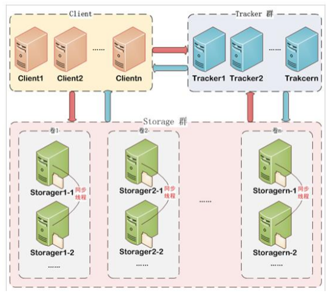
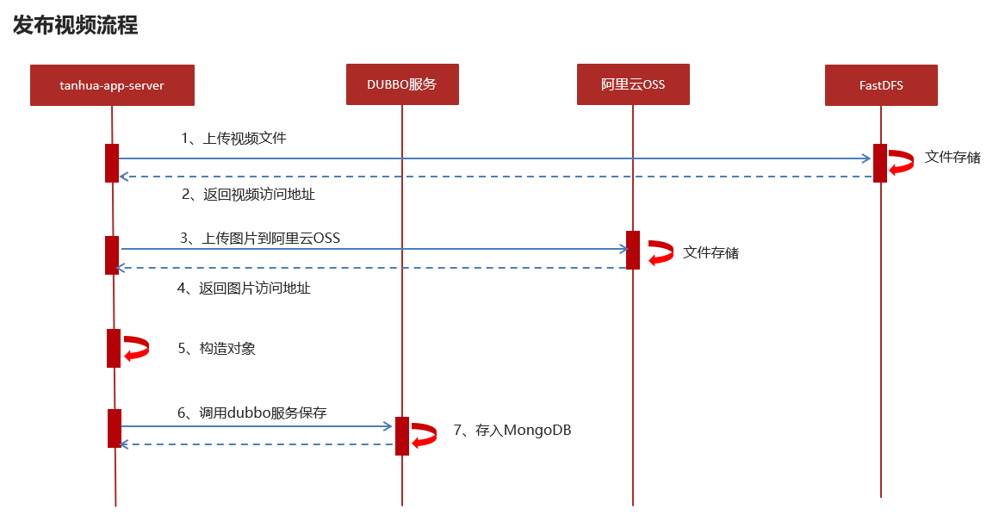

# 课程说明

- 小视频功能说明
- FastDFS环境搭建
- 小视频的功能实现

# 1. 我的访客

## 1.1 需求分析

### 1.1.1 功能说明

 

在`首页`和`我的`功能卡片中，包含我的访客数据

* 其他用户访问我的动态，视频，个人信息时，需要记录访客数据到数据库中
* 首页端展示最新的访客用户，只显示5条。
* `我的`功能中，展示全部历史访客记录

### 1.1.2 数据库表

**visitors集合**

```json
{
  "_id": ObjectId(
  "60176f785098b26d1c3ff043"
  ),
  "date": NumberLong(
  "1612148600271"
  ),
  "userId": NumberLong(
  "99"
  ),
  "visitorUserId": NumberLong(
  "2"
  ),
  "score": 72,
  "from": "首页",
  "visitDate": "20210101"
}
```

**注意 : 记录访客数据, 在查询用户详情的接口中记录即可, 不需要额外的接口提供**

## 1.2 记录访客数据

APP用户点击查看推荐用户详情之后需要记录访客信息 , 数据保存在MongoDB中 , 存储结构如下

### tanhua-model

在`tanhua-model`项目中定义Visitors对象

```java
package com.tanhua.model.mongo;

import lombok.AllArgsConstructor;
import lombok.Data;
import lombok.NoArgsConstructor;
import org.bson.types.ObjectId;
import org.springframework.data.mongodb.core.mapping.Document;

@Data
@NoArgsConstructor
@AllArgsConstructor
@Document(collection = "visitors")
public class Visitors implements java.io.Serializable{

    private static final long serialVersionUID = 2811682148052386573L;

    private ObjectId id;
    private Long userId; //我的id
    private Long visitorUserId; //来访用户id
    private String from; //来源，如首页. 圈子等
    private Long date; //来访时间
    private String visitDate;//来访日期
    private Double score; //得分
}
```

### tanhua-app-server

项目中，用户对用户的所有访问信息都应该记录到数据库中，学习阶段仅以访问今日佳人详情接口为案例添加数据。

修改`tanhua-app-server`中的查看佳人详情功能，保存访客数据


### tanhua-dubbo-interface

在`tanhua-dubbo-interface`模块创建`VisitorsApi`接口, 定义保存访客数据的接口

```java
public interface VisitorsApi {

    /**
     * 保存访客数据
     */
    String save(Visitors visitors);
}
```

### tanhua-dubbo-mongo

在`tanhua-dubbo-mongo`模块创建`VisitorsApiImpl`实现类, 实现保存访客数据的接口

> 注意 : 访客数据一天只记录一次

```java
@DubboService
public class VisitorsApiImpl implements VisitorsApi {

    @Autowired
    private MongoTemplate mongoTemplate;

    @Override
    /**
     * 保存访客数据
     *  对于同一个用户，一天之内只能保存一次访客数据
     */
    public void save(Visitors visitors) {
        //1、查询访客数据
        Query query = Query.query(Criteria.where("userId").is(visitors.getUserId())
                .and("visitorUserId").is(visitors.getVisitorUserId())
                .and("visitDate").is(visitors.getVisitDate()));
        //2、不存在，保存
        if(!mongoTemplate.exists(query,Visitors.class)) {
            mongoTemplate.save(visitors);
        }
    }
}
```

## 1.3 首页谁看过我

### 需求分析

接口文档 : http://118.25.197.221:3000/project/10/interface/api/77


### tanhua-model

在`tanhua-model`项目中定义封装数据的vo对象

```java
package com.tanhua.model.vo;

import com.tanhua.model.domain.UserInfo;
import com.tanhua.model.mongo.Visitors;
import lombok.AllArgsConstructor;
import lombok.Data;
import lombok.NoArgsConstructor;
import org.springframework.beans.BeanUtils;

@Data
@NoArgsConstructor
@AllArgsConstructor
public class VisitorsVo {

    private Long id; //用户id
    private String avatar;
    private String nickname;
    private String gender; //性别 man woman
    private Integer age;
    private String[] tags;
    private Long fateValue; //缘分值

    /**
     * 在vo对象中，补充一个工具方法，封装转化过程
     */
    public static VisitorsVo init(UserInfo userInfo, Visitors visitors) {
        VisitorsVo vo = new VisitorsVo();
        BeanUtils.copyProperties(userInfo,vo);
        if(userInfo.getTags() != null) {
            vo.setTags(userInfo.getTags().split(","));
        }
        vo.setFateValue(visitors.getScore().longValue());
        return vo;
    }
}
```

### tanhua-app-server

修改`tanhua-app-server`模块中`MovementController`和`MovementService`

#### MovementController

~~~java
/**
 * 谁看过我
*/
@GetMapping("visitors")
public ResponseEntity queryVisitorsList(){
    List<VisitorsVo> list = movementService.queryVisitorsList();
    return ResponseEntity.ok(list);
}
~~~

#### MovementService

```java
//首页-访客列表
public List<VisitorsVo> queryVisitorsList() {
    //1、查询访问时间
    String key = Constants.VISITORS_USER;
    String hashKey = String.valueOf(UserHolder.getUserId());
    String value = (String) redisTemplate.opsForHash().get(key, hashKey);
    Long date = StringUtils.isEmpty(value) ? null:Long.valueOf(value);
    //2、调用API查询数据列表 List<Visitors>
    List<Visitors> list =  visitorsApi.queryMyVisitors(date,UserHolder.getUserId());
    if(CollUtil.isEmpty(list)) {
        return new ArrayList<>();
    }
    //3、提取用户的id
    List<Long> userIds = CollUtil.getFieldValues(list, "visitorUserId", Long.class);
    //4、查看用户详情
    Map<Long, UserInfo> map = userInfoApi.findByIds(userIds, null);
    //5、构造返回
    List<VisitorsVo> vos = new ArrayList<>();
    for (Visitors visitors : list) {
        UserInfo userInfo = map.get(visitors.getVisitorUserId());
        if(userInfo != null) {
            VisitorsVo vo = VisitorsVo.init(userInfo, visitors);
            vos.add(vo);
        }
    }
    return vos;
}
```

### tanhua-dubbo-interface

在`tanhua-dubbo-interface`项目在`VisitorsApi`中定义查询访客列表的方法

~~~java
/**
 * 查询我的访客数据，存在2种情况：
 * 1. 我没有看过我的访客数据，返回前5个访客信息
 * 2. 之前看过我的访客，从上一次查看的时间点往后查询5个访客数据
 * @param date 上一次查询时间
 * @return
 */
List<Visitors> queryMyVisitors(Long date, Long userId);
~~~

### tanhua-dubbo-mongo

在`tanhua-dubbo-mongo`项目中`VisitorsApiImpl`中实现查询访客列表的方法

~~~java
//查询首页访客列表
public List<Visitors> queryMyVisitors(Long date, Long userId) {
    Criteria criteria = Criteria.where("userId").is(userId);
    if(date != null) {
        criteria.and("date").gt(date);
    }
    Query query = Query.query(criteria).limit(5).with(Sort.by(Sort.Order.desc("date")));
    return mongoTemplate.find(query,Visitors.class);
}
~~~

# 2. 小视频功能说明

小视频功能类似于抖音. 快手小视频的应用，用户可以上传小视频进行分享，也可以浏览查看别人分享的视频，并且可以对视频评论和点赞操作。

1. 视频发布（视频：容量大，视频存储到什么位置？）

2. 查询视频列表（问题：数据库表）

3. 关注视频作者

4. 视频播放（客户端获取视频的URL地址，自动的播放）

效果：

 

查看详情：

 

评论：

 

点赞：

 

# 3. FastDFS

视频存储

* 阿里云OSS（视频简单，贵！！！）
* 自建存储系统

对于小视频的功能的开发，核心点就是：存储 + 推荐 + 加载速度 。

- 对于存储而言，小视频的存储量以及容量都是非常巨大的
    - 所以我们选择自己搭建分布式存储系统 FastDFS进行存储
- 对于推荐算法，我们将采用多种权重的计算方式进行计算
- 对于加载速度，除了提升服务器带宽外可以通过CDN的方式进行加速，当然了这需要额外购买CDN服务

## 3.1. FastDFS是什么？

FastDFS是分布式文件系统。使用 FastDFS很容易搭建一套高性能的文件服务器集群提供文件上传. 下载等服务。

## 3.2. 工作原理

FastDFS 架构包括 Tracker server 和 Storage server。客户端请求 Tracker server 进行文件上传. 下载，通过 Tracker server 调度最终由
Storage server 完成文件上传和下载。

Tracker server 作用是负载均衡和调度，通过 Tracker server 在文件上传时可以根据一些策略找到 Storage server 提供文件上传服务。可以将
tracker 称为追踪服务器或调度服务器。

Storage server 作用是文件存储，客户端上传的文件最终存储在 Storage 服务器上，Storage server
没有实现自己的文件系统而是利用操作系统的文件系统来管理文件。可以将storage称为存储服务器。



每个 tracker 节点地位平等。收集 Storage 集群的状态。

Storage 分为多个组，每个组之间保存的文件是不同的。每个组内部可以有多个成员，组成员内部保存的内容是一样的，组成员的地位是一致的，没有主从的概念。

### 3.2.1. 文件的上传


客户端上传文件后存储服务器将文件 ID 返回给客户端，此文件 ID 用于以后访问该文件的索引信息。文件索引信息包括：组名，虚拟磁盘路径，数据两级目录，文件名。

### 3.2.2. 文件的下载


客户端下载请求到Tracker服务，Tracker返回给客户端storage的信息，客户端根据这些信息进行请求storage获取到文件。

## 3.3. FastDFS环境搭建

​
企业中搭建FastDFS是一个比较繁琐和复杂的过程（多个服务器之间的配合和配置等，专业的人员搭建），但是在学习阶段。由于所有的组件全部配置到linux虚拟机，已docker运行。所以linux的内存有要求（运行的过程中，可能会出现fastdfs的容器，启动之后自动关闭，表示虚拟机内存不足，适当的扩大内存），学习环境中使用一台调度服务器，一台存储服务器

### 3.3.1. 搭建服务

我们使用docker进行搭建。目前所有的组件全部以docker的形式配置

~~~shell
#进入目录
cd /root/docker-file/fastdfs/
#启动
docker-compose up -d
#查看容器
docker ps -a
#FastDFS占用虚拟机资源较多，如果启动时发现Tracker或者Storage没有正常启动，
#使用如下命令 重启即可
#docker-compose restart
~~~

> FastDFS**调度服务器**地址：192.168.136.160:22122
> FastDFS**存储服务器**地址：http://192.168.136.160:8888/

### 3.3.2. 入门案例

#### 导入依赖

找到`tanhua-app-server`的pom文件，打开fastdfs的依赖如下

~~~xml

<dependency>
    <groupId>com.github.tobato</groupId>
    <artifactId>fastdfs-client</artifactId>
    <version>1.26.7</version>
    <exclusions>
        <exclusion>
            <groupId>ch.qos.logback</groupId>
            <artifactId>logback-classic</artifactId>
        </exclusion>
    </exclusions>
</dependency>
~~~

#### application.yml

找到`tanhua-app-server`的application.yml，添加FastDFS的配置

~~~properties
# 分布式文件系统FDFS配置
fdfs:
  so-timeout: 1500
  connect-timeout: 600
  #缩略图生成参数
  thumb-image:
    width: 150
    height: 150
  #TrackerList参数,支持多个
  tracker-list: 192.168.136.160:22122
  web-server-url: http://192.168.136.160:8888/
~~~

#### 测试

在`tanhua-app-server`编写测试类，测试文件上传到FastDFS

~~~java
package com.tanhua.server.test;

import com.github.tobato.fastdfs.domain.conn.FdfsWebServer;
import com.github.tobato.fastdfs.domain.fdfs.StorePath;
import com.github.tobato.fastdfs.service.FastFileStorageClient;
import com.tanhua.server.TanhuaServerApplication;
import org.junit.Test;
import org.junit.runner.RunWith;
import org.springframework.beans.factory.annotation.Autowired;
import org.springframework.boot.test.context.SpringBootTest;
import org.springframework.test.context.junit4.SpringRunner;

import java.io.File;
import java.io.FileInputStream;
import java.io.FileNotFoundException;

@RunWith(SpringRunner.class)
@SpringBootTest(classes = TanhuaServerApplication.class)
public class TestFastDFS {

    //从调度服务器获取，一个目标存储服务器，上传
    @Autowired
    private FastFileStorageClient client;

    @Autowired
    private FdfsWebServer webServer;// 获取存储服务器的请求URL

    @Test
    public void testFileUpdate() throws FileNotFoundException {
 		//1. 指定文件
        File file = new File("D:\\1.jpg");
		//2. 文件上传
        StorePath path = client.uploadFile(new FileInputStream(file),
                file.length(), "jpg", null);
		//3. 拼接访问路径
        String url = webServer.getWebServerUrl() + path.getFullPath();
    }
}
~~~

存储服务器：

* 在线的存储服务器：阿里云OSS
* 自己搭建分布式的存储服务器：fastdfs

# 4. 发布小视频

## 4.1 需求分析

### 表结构

```json
{
  "_id": ObjectId(
  "5fa60707ed0ad13fa89925cc"
  ),
  "vid": NumberLong(1),
  "userId": NumberLong(1),
  "text": "我就是我不一样的烟火~",
  "picUrl": "https://tanhua-dev.oss-cn-zhangjiakou.aliyuncs.com/images/video/video_1.png",
  "videoUrl": "https://tanhua-dev.oss-cn-zhangjiakou.aliyuncs.com/images/video/1576134125940400.mp4",
  "created": NumberLong(1604716296066),
  "likeCount": 0,
  "commentCount": 0,
  "loveCount": 0,
  "_class": "com.tanhua.domain.mongo.Video"
}
```


### 操作步骤



### 接口说明

**接口文档 :** http://192.168.136.160:3000/project/19/interface/api/214

  

## 4.2. 发布视频

### tanhua-model

在`tanhua-model`项目中定义小视频的实体类`Video`

```java
package com.tanhua.model.mongo;

import lombok.AllArgsConstructor;
import lombok.Data;
import lombok.NoArgsConstructor;
import org.bson.types.ObjectId;
import org.springframework.data.mongodb.core.mapping.Document;

@Data
@NoArgsConstructor
@AllArgsConstructor
@Document(collection = "video")
public class Video implements java.io.Serializable {

    private static final long serialVersionUID = -3136732836884933873L;

    private ObjectId id; //主键id
    private Long vid; //自动增长
    private Long created; //创建时间


    private Long userId;
    private String text; //文字
    private String picUrl; //视频封面文件，URL
    private String videoUrl; //视频文件，URL


    private Integer likeCount=0; //点赞数
    private Integer commentCount=0; //评论数
    private Integer loveCount=0; //喜欢数
}
```

### tanhua-app-server

在`tanhua-app-server`中的创建`SmallVideoController`和`SmallVideosService`

#### SmallVideoController

创建控制器类, 定义控制方法接收客户端上传小视频请求

```java
package com.tanhua.server.controller;

import com.tanhua.model.vo.PageResult;
import com.tanhua.server.service.SmallVideosService;
import org.springframework.beans.factory.annotation.Autowired;
import org.springframework.http.ResponseEntity;
import org.springframework.web.bind.annotation.*;
import org.springframework.web.multipart.MultipartFile;

import java.io.IOException;

@RestController
@RequestMapping("/smallVideos")
public class SmallVideosController {

    @Autowired
    private SmallVideosService videosService;

    /**
     * 发布视频
     *  接口路径：POST
     *  请求参数：
     *      videoThumbnail：封面图
     *      videoFile：视频文件
     */
    @PostMapping
    public ResponseEntity saveVideos(MultipartFile videoThumbnail, MultipartFile videoFile) throws IOException {
        videosService.saveVideos(videoThumbnail,videoFile);
        return ResponseEntity.ok(null);
    }
}
```

#### SmallVideosService

创建`SmallVideosService`编写代码完成小视频上传逻辑

```java
package com.tanhua.server.service;

import cn.hutool.core.io.FileUtil;
import cn.hutool.core.util.StrUtil;
import com.github.tobato.fastdfs.domain.conn.FdfsWebServer;
import com.github.tobato.fastdfs.domain.fdfs.StorePath;
import com.github.tobato.fastdfs.service.FastFileStorageClient;
import com.tanhua.autoconfig.template.OssTemplate;
import com.tanhua.dubbo.api.mongo.VideoApi;
import com.tanhua.model.mongo.Video;
import com.tanhua.server.interceptor.UserHolder;
import org.apache.dubbo.config.annotation.DubboReference;
import org.springframework.beans.factory.annotation.Autowired;
import org.springframework.data.redis.core.StringRedisTemplate;
import org.springframework.http.ResponseEntity;
import org.springframework.stereotype.Service;
import org.springframework.web.multipart.MultipartFile;

import java.io.IOException;

@Service
public class SmallVideosService {

    @Autowired
    private OssTemplate ossTemplate;

    @Autowired
    private FastFileStorageClient fastFileStorageClient;

    @Autowired
    private FdfsWebServer webServer;

    @DubboReference
    private VideoApi videoApi;

    @Autowired
    private StringRedisTemplate redisTemplate;

    /**
     * 发布小视频
     */
    public void saveVideos(MultipartFile videoThumbnail, MultipartFile videoFile) throws         if(videoFile.isEmpty() || videoThumbnail.isEmpty()) {
            throw new BusinessException(ErrorResult.error());
        }
        //1、将视频上传到FastDFS,获取访问URL
        String filename = videoFile.getOriginalFilename();  // abc.mp4
        filename = filename.substring(filename.lastIndexOf(".")+1);
        StorePath storePath = client.uploadFile(videoFile.getInputStream(), videoFile.getSize(), filename, null);
        String videoUrl = webServer.getWebServerUrl() + storePath.getFullPath();
        //2、将封面图片上传到阿里云OSS，获取访问的URL
        String imageUrl = ossTemplate.upload(videoThumbnail.getOriginalFilename(), videoThumbnail.getInputStream());
        //3、构建Videos对象
        Video video = new Video();
        video.setUserId(UserHolder.getUserId());
        video.setPicUrl(imageUrl);
        video.setVideoUrl(videoUrl);
        video.setText("我就是我，不一样的烟火");
        //4、调用API保存数据
        String videoId = videoApi.save(video);
        if(StringUtils.isEmpty(videoId)) {
            throw new BusinessException(ErrorResult.error());
        }
	}
}
```

### tanhua-dubbo-interface

在`tanhua-dubbo-interface`项目中创建`VideoApi`接口 , 定义保存小视频的方法

```java
package com.tanhua.dubbo.api.mongo;


import com.tanhua.model.mongo.Video;

public interface VideoApi {

    /**
     * 保存小视频
     */
    void save(Video video);
}
```

### tanhua-dubbo-mongo

在`tanhua-dubbo-mongo`项目中创建`VideoApiImpl`接口 , 实现保存小视频的方法

```java
@DubboService
public class VideoApiImpl implements VideoApi {

    @Autowired
    private MongoTemplate mongoTemplate;

    @Autowired
    private IdWorker idWorker;

    @Override
    public String save(Video video) {
        //1、设置属性
        video.setVid(idWorker.getNextId("video"));
        video.setCreated(System.currentTimeMillis());
        //2、调用方法保存对象
        mongoTemplate.save(video);
        //3、返回对象id
        return video.getId().toHexString();
    }
}
```

### 测试问题

对于SpringBoot工程进行文件上传，默认支持最大的文件是1M。为了解决这个问题，需要在application.yml中配置文件限制

如果上传视频，会导致异常，是因为请求太大的缘故：


在**tanhua-server**工程的application.yml中添加解析器，配置请求文件和请求体 , 设置文件大小

~~~properties
spring:
  servlet:
    multipart:
      max-file-size: 30MB
      max-request-size: 30MB
~~~

# 5. 小视频列表

接口文档 : http://118.25.197.221:3000/project/10/interface/api/227

 

## 5.1 步骤分析

小视频的列表查询的实现需要注意的是，如果有推荐视频，优先返回推荐视频，如果没有，按照时间倒序查询视频表。


## 5.2 代码实现

### tanhua-model

在`tanhua-model`项目中创建`VideoVo`封装接口返回数据

```java
package com.tanhua.model.vo;

import com.tanhua.model.domain.UserInfo;
import com.tanhua.model.mongo.Video;
import lombok.AllArgsConstructor;
import lombok.Data;
import lombok.NoArgsConstructor;
import org.springframework.beans.BeanUtils;

import java.io.Serializable;

@Data
@NoArgsConstructor
@AllArgsConstructor
public class VideoVo implements Serializable {


    private Long userId;
    private String avatar; //头像
    private String nickname; //昵称

    private String id;
    private String cover; //封面
    private String videoUrl; //视频URL
    private String signature; //发布视频时，传入的文字内容


    private Integer likeCount; //点赞数量
    private Integer hasLiked; //是否已赞（1是，0否）
    private Integer hasFocus; //是否关注 （1是，0否）
    private Integer commentCount; //评论数量

    public static VideoVo init(UserInfo userInfo, Video item) {
        VideoVo vo = new VideoVo();
        //copy用户属性
        BeanUtils.copyProperties(userInfo, vo);
        //copy视频属性
        BeanUtils.copyProperties(item, vo);
        vo.setCover(item.getPicUrl());
        vo.setId(item.getId().toHexString());
        vo.setSignature(item.getText());
        vo.setHasFocus(0);
        vo.setHasLiked(0);
        return vo;
    }
}
```

### tanhua-app-server

在`tanhua-app-server`中的`SmallVideoController`和`SmallVideosService`编写方法完成查询功能

#### SmallVideoController

在`SmallVideoController`定义方法接收请求

```java
/**
* 视频列表
*/
@GetMapping
public ResponseEntity queryVideoList(@RequestParam(defaultValue = "1")  Integer page,
                                     @RequestParam(defaultValue = "10") Integer pagesize) {
    PageResult result = videosService.queryVideoList(page, pagesize);
    return ResponseEntity.ok(result);
}
```

#### SmallVideosService

在`SmallVideosService`中实现分页查询小视频列表方法

```java
public PageResult queryVideoList(Integer page, Integer pagesize) {

    //1、查询redis数据
    String redisKey = Constants.VIDEOS_RECOMMEND +UserHolder.getUserId();
    String redisValue = redisTemplate.opsForValue().get(redisKey);
    //2、判断redis数据是否存在，判断redis中数据是否满足本次分页条数
    List<Video> list = new ArrayList<>();
    int redisPages = 0;
    if(!StringUtils.isEmpty(redisValue)) {
        //3、如果redis数据存在，根据VID查询数据
        String[] values = redisValue.split(",");
        //判断当前页的起始条数是否小于数组总数
        if( (page -1) * pagesize < values.length) {
            List<Long> vids = Arrays.stream(values).skip((page - 1) * pagesize).limit(pagesize)
                .map(e->Long.valueOf(e))
                .collect(Collectors.toList());
            //5、调用API根据PID数组查询动态数据
            list = videoApi.findMovementsByVids(vids);
        }
        redisPages = PageUtil.totalPage(values.length,pagesize);
    }
    //4、如果redis数据不存在，分页查询视频数据
    if(list.isEmpty()) {
        //page的计算规则，  传入的页码  -- redis查询的总页数
        list = videoApi.queryVideoList(page - redisPages, pagesize);  //page=1 ?
    }
    //5、提取视频列表中所有的用户id
    List<Long> userIds = CollUtil.getFieldValues(list, "userId", Long.class);
    //6、查询用户信息
    Map<Long, UserInfo> map = userInfoApi.findByIds(userIds, null);
    //7、构建返回值
    List<VideoVo> vos = new ArrayList<>();
    for (Video video : list) {
        UserInfo info = map.get(video.getUserId());
        if(info != null) {
            VideoVo vo = VideoVo.init(info, video);
            vos.add(vo);
        }
    }
    return new PageResult(page,pagesize,0l,vos);
}
```

### tanhua-dubbo-interface

在`tanhua-dubbo-interface`项目中的`VideoApi`中定义分页查询小视频列表的方法

```java
//根据vid查询数据列表
List<Video> findMovementsByVids(List<Long> vids);

//分页查询数据列表
List<Video> queryVideoList(int page, Integer pagesize);
```

### tanhua-dubbo-mongo

在`tanhua-dubbo-mongo`项目中的`VideoApiImpl`中实现分页查询小视频列表的方法

```java
/**
 * 根据vid查询小视频列表
 */
@Override
public List<Video> findMovementsByVids(List<Long> vids) {
    Query query = Query.query(Criteria.where("vid").in(vids));
    return mongoTemplate.find(query,Video.class);
}

/**
 * 分页查询小视频数据
 */
@Override
public List<Video> queryVideoList(int page, Integer pagesize) {
    Query query = new Query().limit(pagesize).skip((page -1) * pagesize)
        .with(Sort.by(Sort.Order.desc("created")));
    return mongoTemplate.find(query,Video.class);
}
```

### 问题分析与解决

#### 测试问题

在运行测试时，及其容易出现空指针等异常。


#### 解决方法

之所以出现这类问题“”或者空指针异常，是由于MongoDB中非关系数据库，不能自动约束检测表关系。我们检查Video数据库表得知。其中有几条数据的发布人是虚拟构造，在用户表中并不存在


解决思路很简单，删除错误数据即可

# 6. SpringCache

Spring Cache是Spring提供的通用缓存框架。它利用了AOP，实现了基于注解的缓存功能，使开发者不用关心底层使用了什么缓存框架，只需要简单地加一个注解，就能实现缓存功能了。用户使用Spring
Cache，可以快速开发一个很不错的缓存功能。

## 6.1. 重要概念

| 名称          | 解释                         |
|:------------|:---------------------------|
| @Cacheable  | 主要针对方法配置，能够根据方法的请求参数对其进行缓存 |
| @CacheEvict | 清空缓存                       |

## 6.2. 入门案例

### 6.2.1 导入依赖

导入SpringDataRedis的依赖，并在application.yml中配置 （略）

### 6.2.2 开启缓存支持

然后在启动类注解@EnableCaching开启缓存

```java
@SpringBootApplication
@EnableCaching  //开启缓存
public class DemoApplication{
 
    public static void main(String[] args) {
        SpringApplication.run(DemoApplication.class, args);
    }
}
```

### 6.2.3 编写UserInfoService

```java
package com.tanhua.server.test;

import com.tanhua.domain.db.UserInfo;
import org.springframework.cache.annotation.CacheEvict;
import org.springframework.cache.annotation.Cacheable;
import org.springframework.stereotype.Service;

@Service
public class UserInfoService {

    //根据id查询
    public UserInfo queryById(Long userId) {
        //从数据库查询
        UserInfo user = new UserInfo();
        user.setId(userId);
        user.setNickname("ceshi");
        return user;
    }

    //根据id修改
    public void update(Long userId) {
        UserInfo user = new UserInfo();
        user.setId(userId);
        user.setNickname("itcast");
    }
}
```

### 6.2.4 缓存@Cacheable

`@Cacheable`注解会先查询是否已经有缓存，有会使用缓存，没有则会执行方法并缓存。

```java
@Cacheable(value = "user",key = "#userId")
public UserInfo queryById(Long userId) {
    //从数据库查询
    UserInfo user = new UserInfo();
    user.setId(userId);
    user.setNickname("ceshi");
    return user;
}
```

此处的`value`是必需的，它指定了你的缓存存放在哪块命名空间。

### 6.2.5 清除@CacheEvict

`@CachEvict` 的作用 主要针对方法配置，能够根据一定的条件对缓存进行清空 。

```JAVA
//根据id修改
@CacheEvict(value = "user",key = "#userId")
public void update(Long userId) {
    //修改用户
    UserInfo user = new UserInfo();
    user.setId(userId);
    user.setNickname("itcast");
}
```

## 6.3. 视频列表缓存处理

在`tanhua-app-server`修改VideoService，分页列表存入缓存，发布视频删除缓存

```java
//查询视频列表
@Cacheable(
    value="videos",
    key = "T(com.tanhua.server.interceptor.UserHolder).getUserId()+'_'+#page+'_'+#pagesize")  //userid _ page_pagesize
public PageResult queryVideoList(Integer page, Integer pagesize) {
    .....
}
```

## 6.4. 发布视频清空缓存

```java
/**
 * 发布小视频
 */
@CacheEvict(value="videos",allEntries = true)  //清空缓存
public void saveVideos(MultipartFile videoThumbnail, MultipartFile videoFile) {
   .....
}
```
