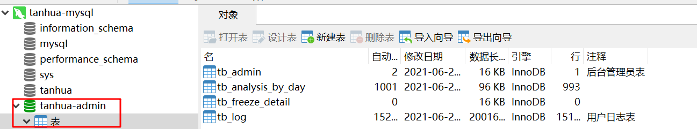

## 1、项目架构

### 1.1 概述

API网关有很多实现方式，我们通过SpringCloud Gateway实现

使用Nacos作为配置中心


### 1.2 API网关

#### 1.2.1 搭建网关

需求：创建新的网关模块`tanhua-gateway`，并配置路由

##### 依赖

```xml

<dependencies>
    <dependency>
        <groupId>org.springframework.cloud</groupId>
        <artifactId>spring-cloud-starter-gateway</artifactId>
    </dependency>

    <dependency>
        <groupId>com.alibaba.cloud</groupId>
        <artifactId>spring-cloud-starter-alibaba-nacos-discovery</artifactId>
    </dependency>

    <!-- 监控检查-->
    <dependency>
        <groupId>org.springframework.boot</groupId>
        <artifactId>spring-boot-starter-actuator</artifactId>
    </dependency>

    <!-- nacos配置中心依赖支持
    <dependency>
        <groupId>com.alibaba.cloud</groupId>
        <artifactId>spring-cloud-starter-alibaba-nacos-config</artifactId>
    </dependency>
    -->
    <dependency>
        <groupId>com.itheima</groupId>
        <artifactId>tanhua-commons</artifactId>
        <version>1.0-SNAPSHOT</version>
    </dependency>
</dependencies>
```

##### 引导类

在`tanhua-gateway`模块配置引导类

```java
@SpringBootApplication
public class GatewayApplication {

    public static void main(String[] args) {
        SpringApplication.run(GatewayApplication.class, args);
    }
}
```

##### 跨域问题配置类

```java
package com.itheima.gateway.config;

import org.springframework.context.annotation.Bean;
import org.springframework.context.annotation.Configuration;
import org.springframework.web.cors.CorsConfiguration;
import org.springframework.web.cors.reactive.CorsWebFilter;
import org.springframework.web.cors.reactive.UrlBasedCorsConfigurationSource;
import org.springframework.web.util.pattern.PathPatternParser;

/**
 * 跨域支持
 */
@Configuration
public class CorsConfig {

    @Bean
    public CorsWebFilter corsFilter() {
        CorsConfiguration config = new CorsConfiguration();
        config.addAllowedMethod("*");
        config.addAllowedOrigin("*");
        config.addAllowedHeader("*");
        UrlBasedCorsConfigurationSource source =
                new UrlBasedCorsConfigurationSource(new PathPatternParser());
        source.registerCorsConfiguration("/**", config);
        return new CorsWebFilter(source);
    }
}
```

##### 配置文件

```yml
server:
  port: 8888
spring:
  application:
    name: tanhua-gateway
  cloud:
    nacos:
      discovery:
        server-addr: 192.168.136.160:8848
    gateway:
      globalcors:
        add-to-simple-url-handler-mapping: true
        corsConfigurations:
          '[/**]':
            allowedHeaders: "*"
            allowedOrigins: "*"
            allowedMethods:
              - GET
              - POST
              - DELETE
              - PUT
              - OPTION
      routes:
        # 手机端访问
        - id: tanhua-app-server
          uri: lb://tanhua-app-server
          predicates:
            - Path=/app/**
          filters:
            - StripPrefix= 1
        # 管理后台
        - id: tanhua-admin
          uri: lb://tanhua-admin
          predicates:
            - Path=/admin/**
          filters:
            - StripPrefix= 1
#自定义配置，定义不需要校验token的连接
gateway:
  excludedUrls: /user/login,/user/loginVerification,/system/users/verification,/system/users/login
```

##### 测试

由于加入了网关，所有的请求统一发送到网关，路由到具体的服务。测试时注意修改请求地址

> `tanhua-app-server`访问地址 ip:8888/app/ （IP以自己模拟器为准）

 

#### 1.2.2 配置鉴权管理器

在网关内部可以通过过滤器完成统一鉴权，限流，日志记录等操作。


在`tanhua-gateway`模块配置鉴权过滤器

```java
@Component
public class AuthFilter implements GlobalFilter, Ordered {

    @Value("${gateway.excludedUrls}")
    private List<String> excludedUrls; //配置不校验的连接

    @Override
    public Mono<Void> filter(ServerWebExchange exchange, GatewayFilterChain chain) {
        //获取当前请求连接
        String url = exchange.getRequest().getURI().getPath();
        System.out.println( "url:"+ url);
        //放行不需要校验的接口
        if(excludedUrls.contains(url)){
            return chain.filter(exchange);
        }
        //获取请求头中的token
        String token = exchange.getRequest().getHeaders().getFirst("Authorization");
        //后台系统页面发送的token以"Bearer "开头，需要处理
        if(!StringUtils.isEmpty(token)){
            token = token.replace("Bearer ", "");
        }
        ServerHttpResponse response = exchange.getResponse();

        //使用工具类，判断token是否有效
        boolean verifyToken = JwtUtils.verifyToken(token);
        //如果token失效，返回状态码401，拦截
        if(!verifyToken) {
            Map<String, Object> responseData = new HashMap<>();
            responseData.put("errCode", 401);
            responseData.put("errMessage", "用户未登录");
            return responseError(response,responseData);
        }
        return chain.filter(exchange);
    }

    //响应错误数据
    private Mono<Void> responseError(ServerHttpResponse response,Map<String, Object> responseData){
        // 将信息转换为 JSON
        ObjectMapper objectMapper = new ObjectMapper();
        byte[] data = new byte[0];
        try {
            data = objectMapper.writeValueAsBytes(responseData);
        } catch (JsonProcessingException e) {
            e.printStackTrace();
        }
        // 输出错误信息到页面
        DataBuffer buffer = response.bufferFactory().wrap(data);
        response.setStatusCode(HttpStatus.UNAUTHORIZED);
        response.getHeaders().add("Content-Type", "application/json;charset=UTF-8");
        return response.writeWith(Mono.just(buffer));
    }

    /**
     * 设置过滤器的执行顺序
     */
    @Override
    public int getOrder() {
        return Ordered.LOWEST_PRECEDENCE;
    }
}
```

### 1.3 Nacos配置中心

Nacos提供了注册中心和配置管理的能力，使用Nacos可以快速实现服务发现、服务配置管理等需求。

这里以网关工程（`tanhua-gateway`）为例


#### 1.3.1 添加依赖

在`tanhua-gateway`模块中添加配置中心依赖

```xml

<dependency>
    <groupId>com.alibaba.cloud</groupId>
    <artifactId>spring-cloud-starter-alibaba-nacos-config</artifactId>
</dependency>
```

#### 1.3.2 添加bootstrap.yml配置

在`tanhua-gateway`模块中添加引导文件bootstrap.yml，并设置

```yml
server:
  port: 8888
spring:
  profiles:
    active: prod
  application:
    name: tanhua-gateway
  cloud:
    nacos:
      discovery:
        server-addr: 192.168.136.160:8848
      config:
        server-addr: 192.168.136.160:8848
        file-extension: yml
```

#### 1.3.3 nacos添加配置

在nacos中添加网关配置


添加配置内容


配置如下内容

```yml
server:
  port: 8888
spring:
  cloud:
    gateway:
      globalcors:
        add-to-simple-url-handler-mapping: true
        corsConfigurations:
          '[/**]':
            allowedHeaders: "*"
            allowedOrigins: "*"
            allowedMethods:
              - GET
              - POST
              - DELETE
              - PUT
              - OPTION
      routes:
        # 用户微服务
        - id: tanhua-app-server
          uri: lb://tanhua-app-server
          predicates:
            - Path=/app/**
          filters:
            - StripPrefix= 1
        # 文章微服务
        - id: tanhua-admin
          uri: lb://tanhua-admin
          predicates:
            - Path=/admin/**
          filters:
            - StripPrefix= 1
gateway:
  excludedUrls: /user/login,/user/loginVerification,/system/users/verification,/system/users/login

```

## 2、后台系统

### 2.1 概述

探花交友APP建立的后台管理系统，目的是完成探花交友项目的业务闭环，主要功能包括：用户管理、动态管理、审核管理以及系统管理。


课程中实现的功能有：登录、首页、用户管理、动态审核。

### 2.2 环境前端搭建

#### 2.2.1 导入数据库

将资料中的`tanhua-admin.sql`引入到mysql数据库中



#### 2.2.2 导入静态页面

后台系统也是采用前后端分离的方式，前端采用Vue.js实现，关于前端系统我们不进行实现，拿来直接使用。


##### nginx安装

将资料中提供的nginx解压到合适的位置


其中html目录中为，vue编译后的所有页面。

修改Nginx的`/conf/nginx.conf`配置文件：

~~~shell
    server {
        listen       8088;  #请求端口
        server_name  localhost;

        #charset koi8-r;

        #access_log  logs/host.access.log  main;
		

		location / {
            root   html;
            index  index.html index.htm;
        }
		
		location  /management {
			proxy_pass http://127.0.0.1:8888/admin;  #转发java后台网关地址
		}
		#....略
	}
~~~

* 访问vue页面的路径：localhost:8088
* 其中内部调用java服务器网关的路径 ：  http://127.0.0.1:8888/admin

##### 测试

双击`nginx.exe`,待启动完成后访问：http://127.0.0.1:8088即可访问后台项目

### 2.3 搭建后端环境

后端工程模块是准备好的，依赖两个实体类，这里先准备好。

#### 2.3.1 实体类Admin

admin：是后台中超级管理员对象

```java
package com.tanhua.model.admin;

import lombok.AllArgsConstructor;
import lombok.Data;
import lombok.NoArgsConstructor;

import java.io.Serializable;

//后台系统的管理员对象
@Data
@NoArgsConstructor
@AllArgsConstructor
public class Admin implements Serializable {
    /**
     * id
     */
    private Long id;
    /**
     * 用户名
     */
    private String username;
    /**
     * 密码
     */
    private String password;
    /**
     * 头像
     */
    private String avatar;
}
```

#### 2.3.2 导入项目

将今日资料中的tanhua-admin模块导入到探花项目中，完成开发。


#### 2.3.3 创建配置文件

创建`application.yml`配置文件

```yml
spring:
  datasource:
    driver-class-name: com.mysql.jdbc.Driver
    url: jdbc:mysql://127.0.0.1:3306/tanhua-admin?useUnicode=true&characterEncoding=utf8&autoReconnect=true&allowMultiQueries=true&useSSL=false
    username: root
    password: root
  rabbitmq:
    host: 192.168.136.160
    port: 5672
    username: guest
    password: guest
  redis:
    host: 192.168.136.160
    port: 6379
  cloud: #nacos配置
    nacos:
      discovery:
        server-addr: 192.168.136.160:8848
dubbo: #dubbo配置
  registry:
    address: spring-cloud://localhost
  consumer:
    check: false
    retries: 0
  protocols:
    dubbo:
      port: -1

#配置短信平台信息
tanhua: #手机验证码，咱们自己注册（不要白嫖）
  sms:
    signName: 物流云商
    templateCode: SMS_106590012
    accessKey: LTAI4GKgob9vZ53k2SZdyAC7
    secret: LHLBvXmILRoyw0niRSBuXBZewQ30la
  oss:
    accessKey: LTAI4GKgob9vZ53k2SZdyAC7
    secret: LHLBvXmILRoyw0niRSBuXBZewQ30la
    endpoint: oss-cn-beijing.aliyuncs.com
    bucketName: tanhua143
    url: https://tanhua143.oss-cn-beijing.aliyuncs.com
  aip:
    appId: 22837663
    apiKey: nA43galrxfUZTGtYRVK8F8tb
    secretKey: MQp567q4nGnIKfniURa2XAw8bT1SlPE3
  huanxin:
    appkey: 1110201018107234#tanhua
    clientId: YXA6nxJJ_pdEQ_eYUlqcRicS4w
    clientSecret: YXA6GMUxVEZhAvxlMn4OvHSXbWuEUTE
#mybaits-plus
mybatis-plus:
  global-config:
    db-config:
      table-prefix: tb_    #数据库表前缀
      id-type: auto        #数据库表主键的策略

```

### 2.4 管理员登录

后台系统的登录模块独立于APP端的登录。

#### 2.4.1 生成验证码

验证码：页面端发送请求到服务端。服务端生成一个验证码的图片，已流的形式返回

##### 接口文档

接口地址：http://192.168.136.160:3000/project/25/interface/api/322

 

* 手机端获取验证码可以通过手机号码保证唯一性。

* 页面端验证码自动生成UUID保证唯一性

##### SystemController

在`tanhua-admin`模块中的SystemController中添加方法。

```java
/**
 * 生成图片验证码
 */
@GetMapping("/verification")
public void verification(String uuid, HttpServletResponse response) throws IOException {
    //1、通过工具类生成验证码对象（图片数据和验证码信息）
    LineCaptcha captcha = CaptchaUtil.createLineCaptcha(299, 97);
    String code = captcha.getCode(); 
    //2、调用service，将验证码存入到redis
    redisTemplate.opsForValue().set(Constants.CAP_CODE+uuid,code);
    //3、通过输出流输出验证码
    captcha.write(response.getOutputStream());
}
```

#### 2.4.2 用户登录

##### 接口文档

接口地址：http://192.168.136.160:3000/project/25/interface/api/313


##### SystemController

```java
/**
 * 用户登录
 */
@PostMapping("/login")
public ResponseEntity login(@RequestBody Map map) {
    Map retMap = adminService.login(map);
    return ResponseEntity.ok(retMap);
}
```

##### SystemService

```java
//用户登录
public ResponseEntity login(Map map) {
    //1、获取请求的参数（username,password,verificationCode（验证码）,uuid）
    String username = (String) map.get("username");
    String password = (String) map.get("password");
    String verificationCode = (String) map.get("verificationCode");
    String uuid = (String) map.get("uuid");
    //2、判断用户名或者密码是否为空
    if (StringUtils.isEmpty(username) || StringUtils.isEmpty(password)) {
        //用户名或者密码为空
        //throw new BusinessException("用户名或者密码为空");
        Map map1 = new HashMap();
        map.put("message","用户名或者密码为空");
        return ResponseEntity.status(500).body(map1);
    }
    //3、判断验证码是否正确
    if (StringUtils.isEmpty(username)) {
        //验证码为空
        throw new BusinessException("验证码为空");
    }
    //从redis中获取验证码
    String key = Constants.CAP_CODE+uuid;
    String code = redisTemplate.opsForValue().get(key);
    if (StringUtils.isEmpty(code) || !code.equals(verificationCode)) {
        //验证码错误
        throw new BusinessException("验证码错误");
    }
    redisTemplate.delete(key);
    //4、根据用户名查询用户
    QueryWrapper<Admin> qw = new QueryWrapper<>();
    qw.eq("username", username);
    Admin admin = adminMapper.selectOne(qw);
    //5、判断用户是否存在，密码是否一致
    password = SecureUtil.md5(password); //md5加密
    if(admin == null || !admin.getPassword().equals(password)) {
        //用户名错误或者密码不一致
        throw new BusinessException("用户名或者密码");
    }
    //6、通过JWT生成token
    Map<String, Object> claims = new HashMap<String, Object>();
    claims.put("username", username);
    claims.put("id", admin.getId());
    String token = JwtUtils.getToken(claims);
    //8、构造返回值
    Map res = new HashMap();
    res.put("token", token);
    return ResponseEntity.ok(res);
}
```

#### 2.4.3 获取用户资料

##### 接口文档

文档地址：http://192.168.136.160:3000/project/25/interface/api/295


##### AdminVO

```java
@Data
@NoArgsConstructor
@AllArgsConstructor
public class AdminVo {
    /**
     * id
     */
    private String id;
    /**
     * 用户名
     */
    private String username;

    /**
     * 头像
     */
    private String avatar;

    public static AdminVo init(Admin admin) {
        AdminVo vo = new AdminVo();
        vo.setAvatar(admin.getAvatar());
        vo.setUsername(admin.getUsername());
        vo.setId(admin.getId().toString());
        return vo;
    }

}
```

##### SystemController

```java
/**
 * 获取用户的信息
 */
@PostMapping("/profile")
public ResponseEntity profile() {
    AdminVo vo = adminService.profile();
    return ResponseEntity.ok(vo);
}
```

##### SystemService

```java
//获取当前用户的用户资料
public AdminVo profile() {
    Long id = AdminHolder.getId();
    Admin admin = adminMapper.selectById(id);
    return AdminVo.init(admin);
}
```

## 3、用户管理

### 3.1 需求分析

用户管理：对探花交友客户端注册用户的管理（查询业务数据），使用Dubbo的形式调用tanhua-dubbo-service获取响应的数据结果

### 3.2 查询用户列表

#### 后台系统

`tanhu-admin`模块配置`ManageController`和`ManagerService`

##### ManageController

```java
@GetMapping("/users")
public ResponseEntity users(@RequestParam(defaultValue = "1") Integer page,
                            @RequestParam(defaultValue = "10") Integer pagesize) {
   PageResult result = managerService.findAllUsers(page,pagesize);
   return ResponseEntity.ok(result);
}
```

##### ManagerService

```java
public ResponseEntity findAllUsers(Integer page, Integer pagesize) {
    //1、调用API分页查询数据列表   Ipage<UserInfo>
    IPage<UserInfo> iPage = userInfoApi.findAll(page,pagesize);
    //2、需要将Ipage转化为PageResult
    PageResult result = new PageResult(page, pagesize, iPage.getTotal(), iPage.getRecords());
    //3、构造返回值
    return ResponseEntity.ok(result);
}
```

#### 服务提供者

`tanhua-dubbo-interface`模块的`UserInfoApi接口`定义查询所有用户信息方法

在`tanhua-dubbo-db`模块UserInfoImpl实现类中添加查询方法

##### UserInfoApi

```java
/**
 * 分页查询所有用户信息
 *
 * @param page
 * @param pagesize
 * @return
 */
IPage findAll(Integer page, Integer pagesize);
```

##### UserInfoImpl

在`UserInfoApiImpl`中实现查询所有用户信息方法

```java
@Override
public IPage<UserInfo> findAll(Integer page, Integer pagesize) {
    return userInfoMapper.selectPage(new Page<UserInfo>(page,pagesize),null);
}
```

### 3.3 查看用户详情

#### tanhu-admin

##### ManageController

```java
/**
 * 根据id查询用户详情
 *
 * @param userId
 * @return
 */
@GetMapping("/users/{userId}")
public ResponseEntity findUserById(@PathVariable("userId") Long userId) {
    UserInfo userInfo = managerService.findUserById(userId);
    return ResponseEntity.ok(userInfo);
}
```

##### ManagerService

```java
/**
 * 根据用户ID查询用户详情
 *
 * @param userId
 * @return
 */
public UserInfo findUserById(Long userId) {
    return userInfoApi.findById(userId);
}
```

### 3.4 查看视频列表

#### tanhua-admin

在`tanhua-admin`模块`ManageController`和`ManagerService`添加方法

##### ManageController

```java
    /**
     * 查询指定用户发布的所有视频列表
     */
    @GetMapping("/videos")
    public ResponseEntity videos(@RequestParam(defaultValue = "1") Integer page,
                                 @RequestParam(defaultValue = "10") Integer pagesize,
                                 Long uid ) {
        PageResult result = managerService.findAllVideos(page,pagesize,uid);
        return ResponseEntity.ok(result);
    }
```

##### ManagerService

```java
//查询指定用户发布的所有视频列表
public PageResult findAllVideos(Integer page, Integer pagesize, Long uid) {
    return videoApi.findByUserId(page, pagesize, uid);
}
```

#### tanhua-dubbo-interface

在`tanhua-dubbo-interface`中的`VideoApi`中定义查询指定用户发布的视频列表方法

```java
/**
 * 查询指定用户发布的视频列表
 *
 * @param page
 * @param pagesize
 * @param uid
 * @return
 */
PageResult findByUserId(Integer page, Integer pagesize, Long uid);
```

#### tanhua-dubbo-mongo

在`tanhua-dubbo-mongo`中的`VideoApiImpl`中实现查询指定用户发布的视频列表方法

```java
@Override
public PageResult findByUserId(Integer page, Integer pagesize, Long userId) {
    Query query = Query.query(Criteria.where("userId").in(userId));
    long count = mongoTemplate.count(query, Video.class);
    query.limit(pagesize).skip((page -1) * pagesize)
        .with(Sort.by(Sort.Order.desc("created")));
    List<Video> list = mongoTemplate.find(query, Video.class);
    return new PageResult(page,pagesize,count,list);
}
```

### 3.5 查看动态列表

#### tanhua-admin

在`tanhua-admin`模块`ManageController`和`ManagerService`添加方法

##### ManageController

```java
//查询动态
@GetMapping("/messages")
public ResponseEntity messages(@RequestParam(defaultValue = "1") Integer page,
                               @RequestParam(defaultValue = "10") Integer pagesize,
                               Long uid,Integer state) {
    PageResult result = managerService.findAllMovements(page,pagesize,uid,state);
    return ResponseEntity.ok(result);
}
```

##### ManagerService

```java
//查询动态
public PageResult findAllMovements(Integer page, Integer pagesize, Long uid, Integer state) {
    //1、调用API查询数据 ：Movment对象
    PageResult result = movementApi.findByUserId(uid,state,page,pagesize);
    //2、解析PageResult，获取Movment对象列表
    List<Movement> items = (List<Movement>) result.getItems();
    //3、一个Movment对象转化为一个Vo
    if(CollUtil.isEmpty(items)) {
        return new PageResult();
    }
    List<Long> userIds = CollUtil.getFieldValues(items, "userId", Long.class);
    Map<Long, UserInfo> map = userInfoApi.findByIds(userIds, null);
    List<MovementsVo> vos = new ArrayList<>();
    for (Movement movement : items) {
        UserInfo userInfo = map.get(movement.getUserId());
        if(userInfo != null) {
            MovementsVo vo = MovementsVo.init(userInfo, movement);
            vos.add(vo);
        }
    }
    //4、构造返回值
    result.setItems(vos);
    return result;
}
```

#### tanhua-dubbo-interface

在`tanhua-dubbo-interface`中的`MovementApi`中定义根据用户ID分页查询用户发布的动态列表方法

```java
/**
 * 根据用户ID分页查询用户发布的动态列表
 */
PageResult findByUserId(Long uid, Integer state, Integer page, Integer pagesize);
```

#### tanhua-dubbo-mongo

在`tanhua-dubbo-mongo`中的`MovementApi`中实现根据用户ID分页查询用户发布的动态列表方法

```java
@Override
public PageResult findByUserId(Long uid, Integer state, Integer page, Integer pagesize) {
    Query query = new Query();
    if(uid != null) {
        query.addCriteria(Criteria.where("userId").is(uid));
    }
    if(state != null) {
        query.addCriteria(Criteria.where("state").is(state));
    }
    //查询总数
    long count = mongoTemplate.count(query, Movement.class);
    //设置分页参数
    query.with(Sort.by(Sort.Order.desc("created"))).limit(pagesize).skip((page -1) * pagesize);

    List<Movement> list = mongoTemplate.find(query, Movement.class);
    return new PageResult(page,pagesize,count,list);
}
```

####      
