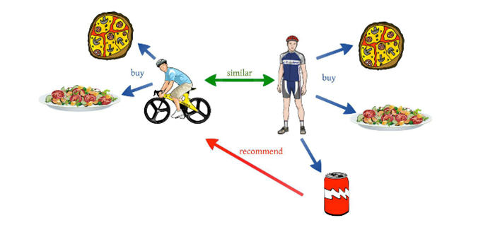
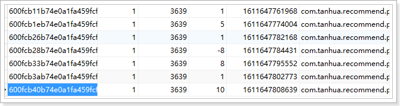
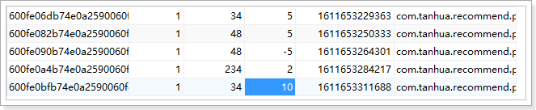

## 1、了解推荐系统

### 1.1、什么是推荐系统？

**为了解决信息过载和用户无明确需求的问题，找到用户感兴趣的物品，才有了个性化推荐系统。**

其实，解决信息过载的问题，代表性的解决方案是分类目录和搜索引擎，如hao123，电商首页的分类目录以及百度，360搜索等。

不过分类目录和搜索引擎只能解决用户主动查找信息的需求，即用户知道自己想要什么，并不能解决用户没用明确需求很随便的问题。

经典语录是：你想吃什么，随便！面对这种很随便又得罪不起的用户（女友和上帝），只能**通过分析用户的历史行为给用户的兴趣建模**
，从而主动给用户推荐能够满足他们兴趣和需求的信息。比如问问女友的闺蜜，她一般什么时候喜欢吃什么。

### 1.2、电商是推荐系统的先行者

- [ ] 电子商务网站是个性化推荐系统重要地应用的领域之一，亚马逊就是个性化推荐系统的积极应用者和推广者，亚马逊的推荐系统深入到网站的各类商品，为亚马逊带来了至少30%的销售额。
- [ ] 不光是电商类，推荐系统无处不在。QQ，微信的好友推荐；新浪微博的你可能感兴趣的人；优酷，土豆的电影推荐；豆瓣的图书推荐；大从点评的餐饮推荐；脉脉的同事推荐等。
- [ ] 推荐引擎的鼻祖思想源泉：http://portal.acm.org/citation.cfm?id=1070751
- [ ] 亚马逊最早提出基于物品的协同过滤推荐算法：http://portal.acm.org/citation.cfm?id=372071

京东的推荐： 

### 1.3、推荐系统业务流程


推荐系统广泛存在于各类网站中，作为一个应用为用户提供个性化的推荐。它需要一些用户的历史数据，一般由三个部分组成：基础数据、推荐算法系统、前台展示。

- 基础数据包括很多维度，包括用户的访问、浏览、下单、收藏，用户的历史订单信息，评价信息等很多信息；
- 推荐算法系统主要是根据不同的推荐诉求由多个算法组成的推荐模型；
- 前台展示主要是对客户端系统进行响应，返回相关的推荐信息以供展示。

### 1.4、协同过滤推荐算法

迄今为止，在个性化推荐系统中，协同过滤技术是应用最成功的技术。目前国内外有许多大型网站应用这项技术为用户更加智能（个性化、千人千面）的推荐内容。

> 核心思想：
>
> 协同过滤一般是在海量的用户中发掘出一小部分和你品位比较类似的，在协同过滤中，这些用户成为邻居，然后根据他们喜欢的其他东西组织成一个排序的目彔作为推荐给你。
>

#### 1.4.1、基于用户的推荐 UserCF




对于用户A，根据用户的历史偏好，这里只计算得到一个邻居–用户C，然后将用户C 喜欢的物品D 推荐给用户A。

基于用户的协同过滤算法先计算的是用户与用户的相似度（兴趣相投，物以类聚人以群分），然后将相似度比较接近的用户A购买的物品推荐给用户B，专业的说法是该算法用最近邻居（nearest-neighbor）算法找出一个用户的邻居集合，该集合的用户和该用户有相似的喜好，算法根据邻居的偏好对该用户进行预测。

#### 1.4.2、基于商品的推荐 ItemCF


- 基于ItemCF的原理和基于UserCF类似，只是在计算邻居时采用物品本身，而不是从用户的角度，即基于用户对物品的偏好找到相似的物品，然后根据用户的历史偏好，推荐相似的物品给他。
- 从计算的角度看，就是将所有用户对某个物品的偏好作为一个向量来计算物品之间的相似度，得到物品的相似物品后，根据用户历史的偏好预测当前用户还没有表示偏好的物品，计算得到一个排序的物品列表作为推荐。
- 解释：对于物品A，根据所有用户的历史偏好，喜欢物品A 的用户都喜欢物品C，得出物品A 和物品C 比较相似，而用户C 喜欢物品A，那么可以推断出用户C
  可能也喜欢物品C。

### 1.5、ALS算法

ALS 是交替最小二乘 （alternating least squares）的简称。在机器学习的上下文中，ALS
特指使用交替最小二乘求解的一个协同推荐算法。它通过观察到的所有用户给产品的打分，来推断每个用户的喜好并向用户推荐适合的产品。从协同过滤的分类来说，ALS算法属于User-Item
CF，也叫做混合CF。它同时考虑了User和Item两个方面。

## 2、好友推荐

对于好友的推荐，需要找出每个用户之间的相似性，具体规则如下：

| 字段  | 权重分      |         |           |          |
|-----|----------|---------|-----------|----------|
| 年龄差 | 0-2岁 30分 | 3-5 20分 | 5-10岁 10分 | 10岁以上 0分 |
| 性别  | 异性 30分   | 同性 0分   |           |          |
| 位置  | 同城 20分   | 不同 0分   |           |          |
| 学历  | 相同 20分   | 不同 0分   |           |          |

### 2.1、流程

* 推荐系统读取数据库中的用户数据

* 根据用户资料，进行推荐运算

* 将推荐数据存入到MongoDB

  

### 2.2、部署好友推荐服务

推荐系统是由专业的大数据人员开发编写的，我们只需要部署运行。在课程中已经以docker-compose提供了相应系统

```shell
#进入目录
cd /root/docker-file/recommend/
#创建容器并启动
docker-compose up –d
#查看容器
docker ps -a
```

* 推荐系统内部包含了好友推荐，动态推荐以及视频推荐。

* 推荐系统会访问本地数据库，所以需要打开本地数据库的远程访问权限

* 如果想要用户root可以远程登录，则可通过修改user表中root用户对应的host字段值为“%”即可。我们用以下语句进行修改：

```sql
update user set host = '%' where user = 'root';
#或者
GRANT ALL PRIVILEGES ON *.* TO '登录id'@'%' IDENTIFIED BY '登录密码' WITH GRANT OPTION;
```

执行完成后，可以看到MongoDB中的recommend_user表中数据已经重新生成了。


## 3、圈子推荐

### 3.1、功能说明

在圈子功能中，针对于用户发布的动态信息，系统可以根据用户的发布、浏览、点赞等操作，对动态信息做计算，然后对每个用户进行不同的推荐。

### 3.2、流程说明


流程说明：

- 用户对圈子的动态操作，如：发布、浏览、点赞、喜欢等，就会给RocketMQ进行发送消息；
- 推荐系统接收消息，并且处理消息数据，处理之后将结果数据写入到MongoDB中；
- Spark系统拉取数据，然后进行推荐计算；
- 计算之后的结果数据写入到Redis中，为每个用户都进行个性化推荐；

### 3.3、动态计分规则

- 浏览 +1
- 点赞 +5
- 喜欢 +8
- 评论 + 10
- 发布动态
    - 文字长度：50以内1分，50~100之间2分，100以上3分
    - 图片个数：每个图片一分

核心推荐逻辑：

- 推荐模型：用户 | 动态 | 评分
- 其中，评分是用户对动态操作的得分合计
- 为什么自己发布动态还要计分？ 是因为，自己发布就相当于自己对此动态也感兴趣，这样就可以在相似的人之间进行推荐了。

### 3.4、发送消息

在之前的系统中，已经完成的日志消息的发送


探花系统发布的日志消息统一发送到MQ

### 3.5、接收消息

接收消息的工作需要新创建tanhua-recommend工程，在此工程中完成相关的操作。

#### 3.5.1、创建tanhua-recommend工程

~~~xml

<dependencies>
    <dependency>
        <groupId>com.itheima</groupId>
        <artifactId>tanhua-model</artifactId>
        <version>1.0-SNAPSHOT</version>
    </dependency>
    <!--RabbitMQ-->
    <dependency>
        <groupId>org.springframework.boot</groupId>
        <artifactId>spring-boot-starter-amqp</artifactId>
    </dependency>
    <dependency>
        <groupId>cn.hutool</groupId>
        <artifactId>hutool-all</artifactId>
        <version>5.4.3</version>
    </dependency>
</dependencies>
~~~

#### 3.5.2、配置文件

application.yml

~~~properties
spring:
  rabbitmq:
    host: 192.168.136.160
    port: 5672
    username: guest
    password: guest
  data:
    mongodb:
      uri: mongodb://192.168.136.160:27017/tanhua
~~~

#### 3.5.3、启动类

```java
package com.tanhua.recommend;

import org.springframework.boot.SpringApplication;
import org.springframework.boot.autoconfigure.SpringBootApplication;

@SpringBootApplication
public class RecommendApplication {

    public static void main(String[] args) {
        SpringApplication.run(RecommendApplication.class,args);
    }
}

```

#### 3.5.4、实体类

存储到MongoDB的中的实体结构。

~~~java
package com.tanhua.model.mongo;

import lombok.AllArgsConstructor;
import lombok.Data;
import lombok.NoArgsConstructor;
import org.bson.types.ObjectId;
import org.springframework.data.mongodb.core.mapping.Document;

//大数据动态评分实体类
@Data
@NoArgsConstructor
@AllArgsConstructor
@Document("recomment_movement_score")
public class MovementScore {

    private ObjectId id;
    private Long userId;// 用户id
    private Long movementId; //动态id，需要转化为Long类型
    private Double score; //得分
    private Long date; //时间戳
}

~~~

#### 3.5.5、RecommendMovementListener

~~~java
package com.tanhua.recommend.listener;


import cn.hutool.core.util.StrUtil;
import com.alibaba.fastjson.JSON;
import com.tanhua.model.mongo.Movement;
import com.tanhua.model.mongo.MovementScore;
import org.springframework.amqp.core.ExchangeTypes;
import org.springframework.amqp.rabbit.annotation.Exchange;
import org.springframework.amqp.rabbit.annotation.Queue;
import org.springframework.amqp.rabbit.annotation.QueueBinding;
import org.springframework.amqp.rabbit.annotation.RabbitListener;
import org.springframework.beans.factory.annotation.Autowired;
import org.springframework.data.mongodb.core.MongoTemplate;
import org.springframework.stereotype.Component;

import java.util.Map;

@Component
public class RecommendMovementListener {

    @Autowired
    private MongoTemplate mongoTemplate;

    @RabbitListener(bindings = @QueueBinding(
            value = @Queue(
                    value = "tanhua.movement.queue",
                    durable = "true"
            ),
            exchange = @Exchange(
                    value = "tanhua.log.exchange",
                    type = ExchangeTypes.TOPIC),
            key = {"log.movement"})
    )
    public void recommend(String message) throws Exception {
        System.out.println("处理动态消息："+message);
        try {
            Map<String, Object> map = JSON.parseObject(message);
            //1、获取数据
            Long userId = Long.valueOf(map.get("userId").toString());
            String date = (String) map.get("date");
            String busId = (String) map.get("busId");
            String type = (String) map.get("type");
            Movement movement = mongoTemplate.findById(busId, Movement.class);
            if(movement != null) {
                MovementScore ms = new MovementScore();
                ms.setUserId(userId);
                ms.setDate(System.currentTimeMillis());
                ms.setMovementId(movement.getPid());
                ms.setScore(getScore(type,movement));
                mongoTemplate.save(ms);
            }
        } catch (Exception e) {
            e.printStackTrace();
        }
    }

    private static Double getScore(String type,Movement movement) {
        //0201为发动态  基础5分 50以内1分，50~100之间2分，100以上3分
        //0202为浏览动态， 1
        //0203为动态点赞， 5
        //0204为动态喜欢， 8
        //0205为评论，     10
        //0206为动态取消点赞， -5
        //0207为动态取消喜欢   -8
        Double score = 0d;
        switch (type) {
            case "0201":
                score = 5d;
                score += movement.getMedias().size();
                int length = StrUtil.length(movement.getTextContent());
                if (length >= 0 && length < 50) {
                    score += 1;
                } else if (length < 100) {
                    score += 2;
                } else {
                    score += 3;
                }
                break;
            case "0202":
                score = 1d;
                break;
            case "0203":
                score = 5d;
                break;
            case "0204":
                score = 8d;
                break;
            case "0205":
                score = 10d;
                break;
            case "0206":
                score = -5d;
                break;
            case "0207":
                score = -8d;
                break;
            default:
                break;
        }
        return score;
    }
}

~~~

### 3.6、测试

测试方法：使用APP进行操作，可以看到在MongoDB中已经有数据写入。



## 4、小视频推荐

小视频的推荐和动态推荐的实现逻辑非常的类似。

### 4.1、动态计分规则

- 发布+2
- 点赞 +5
- 评论 + 10

### 4.2、发送消息

### 4.3、接收消息

#### 5.3.1、VideoScore

视频评分实体类

~~~java
package com.tanhua.model.mongo;

import lombok.AllArgsConstructor;
import lombok.Data;
import lombok.NoArgsConstructor;
import org.bson.types.ObjectId;
import org.springframework.data.mongodb.core.mapping.Document;

@Data
@NoArgsConstructor
@AllArgsConstructor
@Document("recomment_video_score")
public class VideoScore {

    private ObjectId id;
    private Long userId;// 用户id
    private Long videoId; //视频id，需要转化为Long类型 video中的vid字段
    private Double score; //得分
    private Long date; //时间戳
}

~~~

#### 5.3.2、RecommendVideoListener

~~~java
package com.tanhua.recommend.listener;

import com.alibaba.fastjson.JSON;
import com.tanhua.model.mongo.Video;
import com.tanhua.model.mongo.VideoScore;
import org.springframework.amqp.core.ExchangeTypes;
import org.springframework.amqp.rabbit.annotation.Exchange;
import org.springframework.amqp.rabbit.annotation.Queue;
import org.springframework.amqp.rabbit.annotation.QueueBinding;
import org.springframework.amqp.rabbit.annotation.RabbitListener;
import org.springframework.beans.factory.annotation.Autowired;
import org.springframework.data.mongodb.core.MongoTemplate;
import org.springframework.stereotype.Component;

import java.util.Map;

@Component
public class RecommendVideoListener {

    @Autowired
    private MongoTemplate mongoTemplate;

    @RabbitListener(bindings = @QueueBinding(
            value = @Queue(
                    value = "tanhua.video.queue",
                    durable = "true"
            ),
            exchange = @Exchange(
                    value = "tanhua.log.exchange",
                    type = ExchangeTypes.TOPIC),
            key = {"log.video"})
    )
    public void recommend(String message) throws Exception {
        System.out.println("处理视频消息："+message);
        try {
            Map<String, Object> map = JSON.parseObject(message);
            //1、获取数据
            Long userId = (Long) map.get("userId");
            String date = (String) map.get("date");
            String objId = (String) map.get("objId");
            String type = (String) map.get("type");
            Video video = mongoTemplate.findById(objId, Video.class);
            if(video != null) {
                VideoScore vs = new VideoScore();
                vs.setUserId(userId);
                vs.setDate(System.currentTimeMillis());
                vs.setVideoId(video.getVid());
                vs.setScore(getScore(type));
                mongoTemplate.save(vs);
            }
        } catch (Exception e) {
            e.printStackTrace();
        }
    }

    private static Double getScore(String type) {
        //0301为发小视频，0302为小视频点赞，0303为小视频取消点赞，0304为小视频评论
        Double score = 0d;
        switch (type) {
            case "0301":
                score=2d;
                break;
            case "0302":
                score=5d;
                break;
            case "0303":
                score = -5d;
                break;
            case "0304":
                score = 10d;
                break;
            default:
                break;
        }
        return score;
    }
}

~~~

#### 5.3.3、测试



可以看到，用户1对于视频有点赞、取消点赞、评论等操作。

测试Reids，可以发现已经存入了推荐数据


