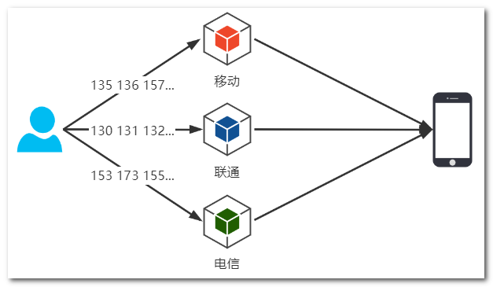
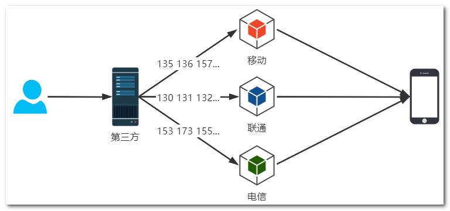
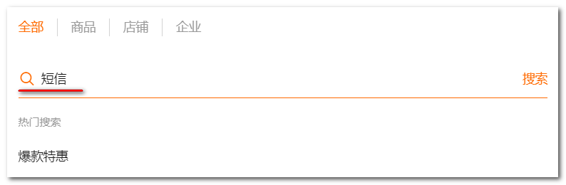
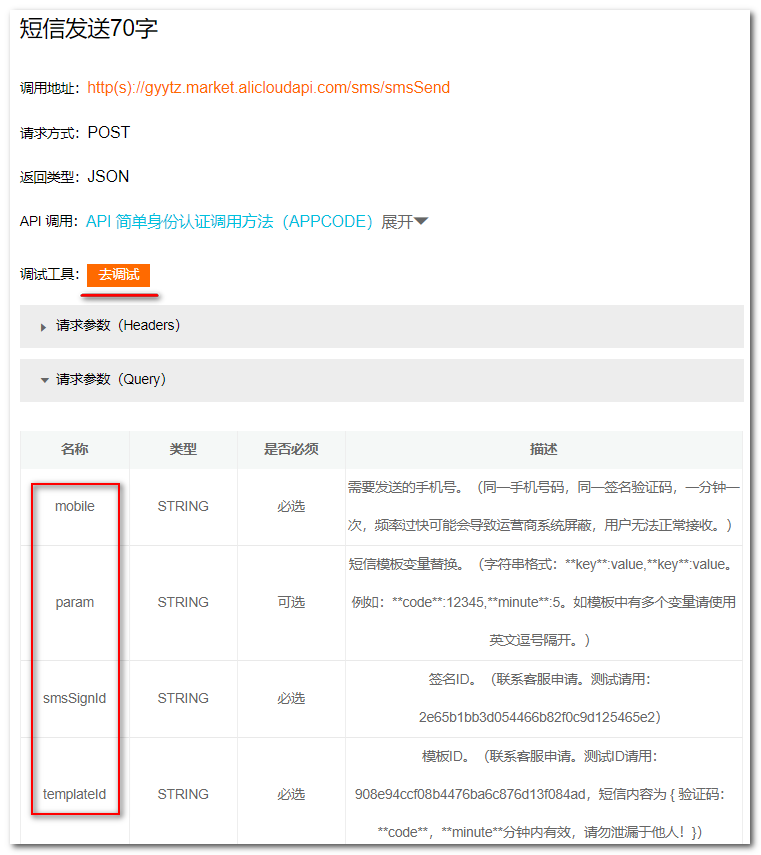
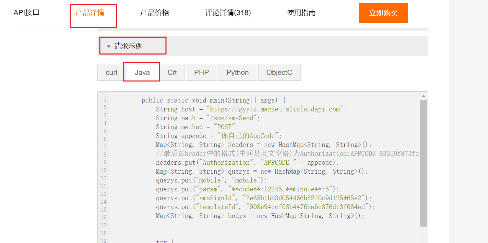

## 发送验证码

短信发送是电信运营商提供的服务，需要访问对应的接口，不同运营商提供的接口地址肯定不一样，如果直接访问这些接口就需要判断收信息的手机号属于哪个运营商，关键在于这些接口不对个人开放，还要考虑调用短信服务的费用问题




因此目前调用短信业务都是使用第三方企业的短信服务，他们与运营商合作，封装了短信接口，调用方法，而且费用相对便宜



第三方的短信服务有很多，其中阿里云也提供了短信服务

### 短信服务（推荐）

#### 注册购买

第一步：云市场搜索短信服务

地址：https://market.aliyun.com/?spm=5176.19720258.J_8058803260.16.e9392c4a1drmWI





第二步：选择购买的短信服务


第三步：点击购买，有5条免费使用，测试也会消耗使用次数，用完了在付费购买即可


第四步：找到自己购买的云服务

- 点击【云市场】


- 点击头像


- 可以看到已购买的服务

  这里有几项重要信息：AppKey AppSecret AppCode 调用购买的这个短信服务接口时候需要用到，用于确认使用者身份

  接口 ： 调用该服务时访问的接口


第五步： 测试接口的使用

地址：https://market.aliyun.com/products/57126001/cmapi00037415.html?spm=5176.2020520132.101.2.2e377218GRmLvt#sku=yuncode3141500001

注意不是购买，往下翻，购买下方就是测试内容以及提供的模板内容，如果需要自定义签名和模板内容，联系客服申请




第六步： 调试接口测试，发送成功说明服务购买成功，可以使用


#### 代码测试

第一步：参考API，在【API接口】中已经给出了Java代码怎么调用该服务的接口

地址https:
//market.aliyun.com/products/57126001/cmapi00037415.html?spm=5176.2020520132.101.2.2e377218GRmLvt#sku=yuncode3141500001

 

第二步：参考API，编写发送短信工具类

```java
package com.tanhua.test.junit;

import cn.hutool.http.Header;
import cn.hutool.http.HttpRequest;

import java.util.HashMap;
import java.util.Map;

/**
 * 测试短信
 */
public class SmsUtilTest {

    public static void main(String[] args) {
        //手机号码
        String mobile = "";
        //验证码
        String code = "";
        //签名ID。（联系客服申请。测试请用：2e65b1bb3d054466b82f0c9d125465e2）
        String smsSignId="";
        //模板ID。（联系客服申请。测试ID请用：908e94ccf08b4476ba6c876d13f084ad，短信内容为 { 验证码：**code**，**minute**分钟内有效，请勿泄漏于他人！}）
        String templateId="";
        //应用code  https://market.console.aliyun.com/imageconsole/index.htm?#/bizlist?_k=r5f9m0 查找
        String appCode="";

        //请求连接
        String host = "https://gyytz.market.alicloudapi.com/sms/smsSend";
        //拼装请求体
        Map<String, Object> querys = new HashMap<String, Object>();
        querys.put("mobile", mobile);
        querys.put("param", "**code**:"+code+",**minute**:5");
        querys.put("smsSignId", smsSignId);
        querys.put("templateId", templateId);

        try {
            String result = HttpRequest.post(host)
                    .header(Header.AUTHORIZATION, "APPCODE " + appCode)//头信息，多个头信息多次调用此方法即可
                    .form(querys)//表单内容
                    .timeout(20000)//超时，毫秒
                    .execute().body();
            System.out.println(result);
        } catch (Exception e) {
            e.printStackTrace();
        }
    }
}
```

### 探花系统组件封装

#### 配置类

```java
package com.tanhua.autoconfig.properties;

import lombok.Data;
import org.springframework.boot.context.properties.ConfigurationProperties;

@Data
@ConfigurationProperties(prefix = "tanhua.sms")
public class SmsProperties {

    private String smsSignId; //签名
    private String templateId; //模板
    private String appcode;
}
```

#### 工具组件

```java
package com.tanhua.autoconfig.template;


import cn.hutool.http.Header;
import cn.hutool.http.HttpRequest;
import com.tanhua.autoconfig.properties.SmsProperties;

import java.util.HashMap;
import java.util.Map;

public class SmsTemplate {

    private SmsProperties properties;

    public SmsTemplate (SmsProperties properties) {
        this.properties = properties;
    }

    public void sendSms(String mobile,String code) {

        //请求连接
        String host = "https://gyytz.market.alicloudapi.com/sms/smsSend";
        //拼装请求体
        Map<String, Object> querys = new HashMap<String, Object>();
        querys.put("mobile", mobile);
        querys.put("param", "**code**:"+code+",**minute**:5");
        querys.put("smsSignId", properties.getSmsSignId());
        querys.put("templateId", properties.getTemplateId());

        try {
            String result = HttpRequest.post(host)
                    .header(Header.AUTHORIZATION, "APPCODE " + properties.getAppcode())//头信息，多个头信息多次调用此方法即可
                    .form(querys)//表单内容
                    .timeout(20000)//超时，毫秒
                    .execute().body();
            System.out.println(result);
        } catch (Exception e) {
            e.printStackTrace();
        }
    }
}
```

#### 装配类

```java
package com.tanhua.autoconfig;

import com.tanhua.autoconfig.properties.SmsProperties;
import com.tanhua.autoconfig.template.SmsTemplate;
import org.springframework.boot.context.properties.EnableConfigurationProperties;
import org.springframework.context.annotation.Bean;

//创建配置文件数据
@EnableConfigurationProperties(
        value = {
                SmsProperties.class,
        }
)
public class TanhuaAutoConfiguration {

    //创建模板对象
    @Bean
    public SmsTemplate smsTemplate(SmsProperties properties) {
        return new SmsTemplate(properties);
    }
}
```

#### spring.factories(略)
