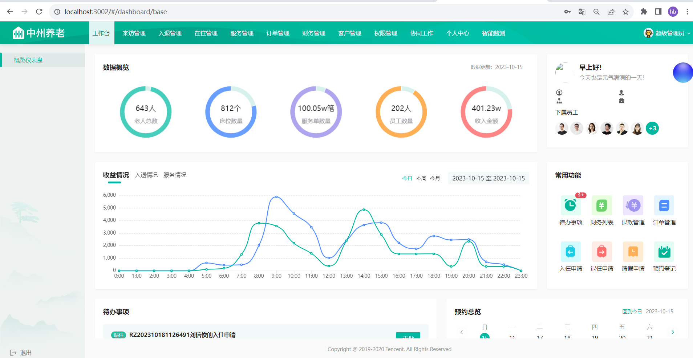
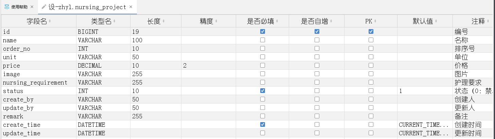
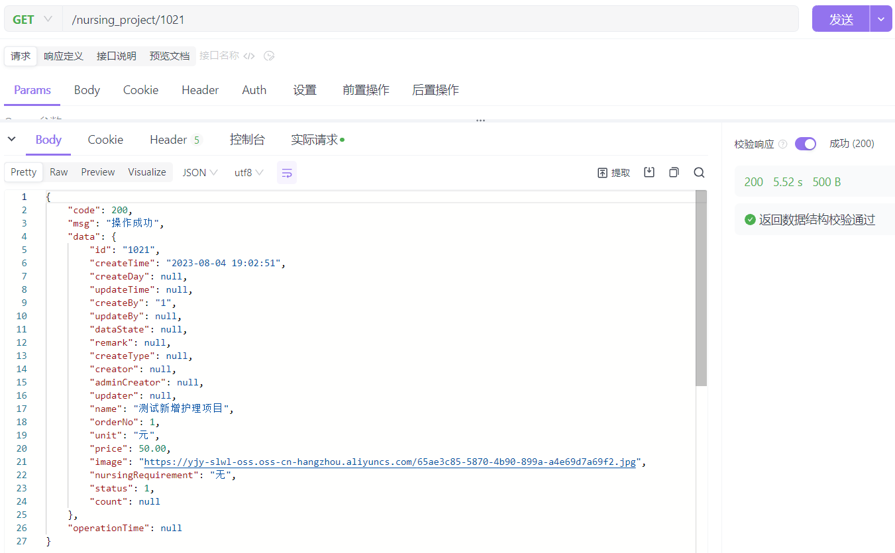
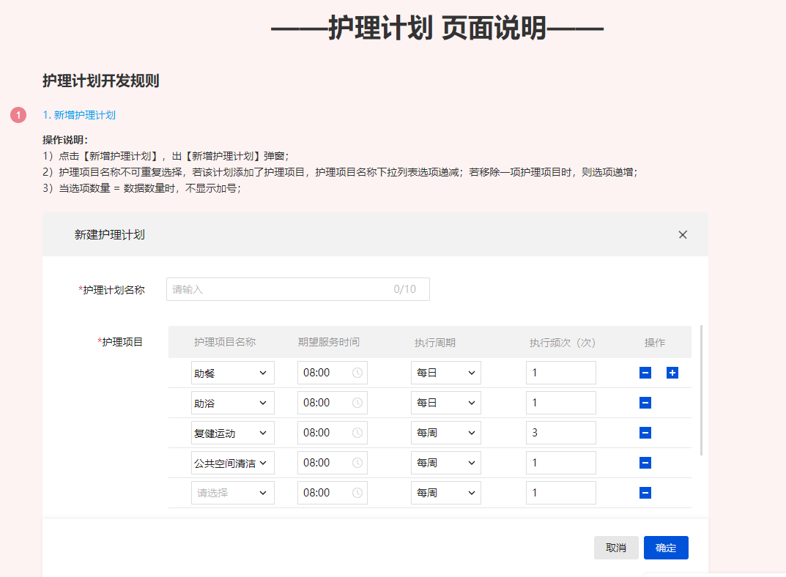

# day01-基础数据开发-服务管理

## 1 目标

各位同学，今天开始我们来学习第一个项目，中州养老项目，在今天的学习内容中主要包含了以下内容：

- 中州养老项目核心业务流程、系统架构、技术架构
- 项目管理必知的内容
- 基础环境搭建及运行
- 护理项目功能开发（项目中的一个模块）
- 作业练习（护理计划、护理等级）

学习目标：

- 能够简单的描述清楚中州养老项目
- 能够熟悉项目中必要的常识
- 能够动手搭建前后端项目，并且能够在本地运行起来
- 能够动手完成护理项目功能的接口开发

## 2 中州养老项目介绍

中州养老院是一家致力于为老年人提供高质量养老服务的专业机构。拥有着多年的行业经验和深厚的服务实力，一直秉持着“以人为本、关爱生命”的核心理念，始终致力于为老年人提供最优质的养老服务，为晚年生活注入更多的快乐与温暖。

中州养老院坐落在一片幽静的绿树成荫的区域，占地面积超过30,000平方米，总建筑面积为40,000平方米。经过多年的发展，中州养老院成长为一家床位数量众多、服务项目丰富的养老机构，现有床位超过800张，员工人数达到200余人。该养老院为老年人提供舒适的住宿环境，房间宽敞明亮，家具精美，充满温馨和舒适感。床铺舒适柔软，提供优质的床垫和床上用品，确保老年人的良好睡眠。同时中州养老院注重细节，为老年人提供贴心、周到的服务。中州养老院员工经过专业培训，拥有高素质的服务意识和服务技能。他们时刻以老年人的需求和舒适为重，热情友好，愿意倾听老年人的心声，为老年人提供贴心、专业的服务和关怀。

中州养老院不断地推进创新，为老人提供更加优质的服务。还还获得了多项荣誉，包括“全国优秀养老院”、“山区老年人关爱先进集体”等。这些荣誉的获得证明了中州在养老服务领域中的领先地位，同时也是中州养老院不断努力的动力。

### 2.1 行业背景

中国老龄化程度加深，我国老龄事业和养老服务体系的发展得到了国家的高度重视，在国家政策的支持下，我国智慧养老产业主体持续增多，产业链不断整合，发展前景较好。我国正在形成一个多元化“互联网+养老”的智慧老年护理服务系统，智慧养老是我国的必然趋势

**市场规模及预测**


- 2022年中国养老产业市场规模达到10.3万亿元，同比增长16.7%。

- 预计2023-2027年中国养老产业迎来较快速增长。预计2027年中国养老产业市场规模达21.1万亿元

### 2.2 整体业务流程

中州养老系统为养老院量身定制开发专业的养老管理软件产品；涵盖来访管理、入退管理、在住管理、服务管理、财务管理等功能模块，涉及从来访参观到退住办理的完整流程。


### 2.3 系统架构

项目原型地址：https://rp-java.itheima.net/zhyl/

中州养老项目分为两端，一个是管理后台，另外一个是家属端

- 管理后台：养老院员工使用，入住、退住，给老人服务记录等等
- 家属端：养老院的老人家属使用，查看老人信息，缴费，下订单等等


### 2.4 技术架构

下图展现了中州养老项目主要使用的技术：


## 3 项目管理

在讲解项目之前，我们有必要去熟悉一下开发软件的一些基础理论和物料，这样可以使我们更快的熟悉软件的开发的节奏，并熟知我们的核心任务及在团队中的角色分工。主要包含了以下几个部分

- 项目生命周期
- 项目开发模式
- 项目管理
- 项目中产生的文档
- 后端人员开发流程

### 3.1 项目生命周期


1. 需求分析：在这个阶段，开发团队需要与客户或业务代表沟通，了解软件的功能和性能需求，以及用户的需求和期望。这个阶段的目的是确保开发团队理解软件的需求，并能够为之制定开发计划。

2. 设计：在这个阶段，开发团队需要根据需求分析结果，设计软件的架构和模块，制定开发计划。设计阶段的目的是确保软件的架构和模块能够满足软件需求，并且能够支持软件的可维护性和可扩展性。

3. 编码：在这个阶段，开发团队需要根据设计文档，编写软件代码。编码阶段的目的是将设计文档转化为可执行的软件代码，并确保代码的质量和可读性。

4. 测试：在这个阶段，开发团队需要对软件进行测试，包括单元测试、集成测试、系统测试、验收测试等。测试阶段的目的是发现并修复软件中存在的缺陷和错误，并确保软件能够满足需求和期望。

5. 部署：在这个阶段，开发团队需要将软件部署到生产环境中，确保软件能够正常运行。部署阶段的目的是确保软件能够在实际环境中运行，并能够满足用户的需求和期望。

6. 运维：在这个阶段，开发团队需要对软件进行维护和更新，确保软件一直能够满足用户的需求和期望。运维阶段的目的是确保软件能够持续地运行，并能够满足用户的不断变化的需求和期望。

### 3.2 项目开发模式

#### 3.2.1 瀑布模型（Waterfall Model）

瀑布模型是一种顺序型开发模式，各个阶段按照顺序依次进行，每个阶段完成后才能进入下一个阶段。这种模式适用于需求稳定、开发周期长的项目。


#### 3.2.2 敏捷开发（Agile Development）

敏捷开发是一种迭代型开发模式，强调团队合作、用户参与和快速响应变化。敏捷开发方法包括Scrum、XP、Lean等，适用于需求不稳定、开发周期较短的项目。


- DevOps

DevOps是一种将开发和运维流程整合在一起的开发模式，强调自动化和持续交付。DevOps适用于需要频繁部署和更新的项目。


**三者对比**：


### 3.3 项目管理

#### 3.3.1 进度管理

1. 制定计划：在软件开发开始之前，制定开发计划和时间表，确定每个阶段的工作内容和时间节点。计划的制定需要考虑到人力、物力、时间等资源的限制，并充分考虑风险和变更管理。

2. 监控进度：在软件开发过程中，要对项目进度进行监控和控制，及时发现和处理进度偏差和问题。可以通过制定里程碑、进度报告、进度会议等方式来监控项目进度。

3. 管理风险：软件开发中存在各种风险，如需求变更、技术难点、人员流失等。需要及时识别和管理这些风险，制定应对措施，以避免对项目进度的负面影响。

4. 优化流程：软件开发是一个复杂的过程，需要不断优化流程，提高效率和质量。可以采用持续集成、自动化测试、代码审查等方式来优化流程，提高开发效率和质量。

5. 管理变更：在软件开发过程中，会出现各种变更，如需求变更、技术方案变更等。需要对变更进行管理，确保变更的合理性和影响范围，并及时更新计划和时间表。

#### 3.3.2 缺陷管理

1. 发现和记录：在软件测试过程中，测试人员会发现各种缺陷和问题，需要及时记录并分类。记录缺陷时，需要包括缺陷的描述、复现步骤、环境信息等详细信息。

2. 筛选和分析：对于发现的缺陷，需要根据优先级和严重程度进行筛选和分析，确定哪些缺陷需要优先处理。在分析缺陷时，需要考虑到缺陷的根本原因，并制定相应的修复方案。

3. 分配和跟踪：将已筛选的缺陷分配给相应的开发人员进行修复，并跟踪修复进度和状态。在跟踪缺陷时，需要及时更新缺陷状态、处理进度、修复时间等信息。

4. 验证和关闭：在开发人员完成缺陷修复后，需要进行验证测试，确保缺陷已经被修复。如果验证测试通过，则可以将缺陷关闭。如果验证测试失败，则需要重新分配给开发人员进行修复。

5. 统计和分析：对于已关闭的缺陷，需要进行统计和分析，了解缺陷的类型、数量、分布情况等信息。通过对缺陷统计和分析，可以发现软件开发中的问题和瓶颈，并采取相应的措施进行优化。

#### 3.3.3 代码规范

在软件开发中，代码规范是非常重要的，可以提高代码的可读性、可维护性和可扩展性。以下是一些常见的代码规范：

1. 命名规范：变量、函数、类等命名要具有清晰明了的含义，使用驼峰式命名法。避免使用缩写或简写，除非是广泛使用的术语。

2. 缩进和空格：代码缩进要保持一致，通常使用四个空格或一个制表符。运算符和关键字周围要留有空格，但是在括号内不需要。

3. 注释规范：注释要清晰明了，描述代码的作用、逻辑和实现细节。注释应该写在代码上方，而不是行末。代码中应该尽可能地减少注释，让代码本身尽可能地自解释。

4. 函数规范：函数应该尽可能地短小精悍，每个函数只做一件事情。函数的参数应该尽可能地少，最好不要超过三个。函数应该有明确的返回值类型和返回值。

5. 异常处理规范：在代码中应该尽可能地处理异常情况，避免程序崩溃或出现不可预知的行为。异常处理应该具有清晰明了的逻辑和错误提示信息。

### 3.4 文档介绍

#### 3.4.1 原型+PRD

程序员开发重要依据！！！

PRD：Product Requirements Document 产品需求文档

#### 3.4.2 UIUE

UIUE是：用户界面体验

UI角色（User Interface，用户界面）主要负责为用户提供与程序交互的界面。UI是用户与系统之间的桥梁，它涵盖了用户在使用软件时所看到和操作的所有元素。

UE角色（User Experience）：用户体验设计师，就是管产品好不好用，是不是人性化。

UI角色（User Interface，用户界面）主要负责为用户提供与程序交互的界面。UI是用户与系统之间的桥梁，它涵盖了用户在使用软件时所看到和操作的所有元素

1. **界面设计（Interface Design）**：UI角色负责设计用户界面的外观和布局。这包括选择颜色、字体、图标、按钮样式等元素，以及整体界面的组织和结构。目标是使界面简洁、直观、易于理解和使用。
2. **用户体验设计（User Experience Design）**：UI角色关注用户在使用软件时的感受和体验。他们致力于确保用户界面是用户友好的，用户能够轻松完成任务，同时尽量减少用户遇到的困难和挑战。
3. **原型设计和交互设计（Prototyping and Interaction Design）**
   ：在开发软件之前，UI角色通常会创建原型，这是界面的初步模型，用于演示和测试界面的功能和流程。交互设计关注用户如何与界面元素进行交互，例如按钮点击、菜单选择等。
4. **图形设计（Graphic Design）**：UI角色负责创建和选择界面中使用的图形元素，例如图标、图片、背景等。这些图形元素不仅要美观，还要在视觉上与界面的整体风格和主题相匹配。
5. **移动设备适配（Mobile Responsiveness）**：对于移动应用程序或响应式网页，UI角色需要确保界面在不同尺寸的移动设备上都能正确地显示和操作，以提供一致的用户体验。
6. **多平台支持（Cross-Platform Support）**：UI角色还需要考虑在不同操作系统和设备上的界面兼容性，确保软件可以在不同平台上运行并保持一致性。
7. **可访问性（Accessibility）**：UI角色要关注那些可能有特殊需求的用户，确保他们也能够方便地使用软件。这可能包括为视觉障碍用户提供屏幕阅读器支持，或为身体障碍用户提供键盘导航方式。
8. **与开发团队的协作**：UI角色通常需要与开发团队密切合作，确保设计的可实现性，并在开发过程中进行必要的调整和优化。

总的来说，UI角色在软件开发过程中发挥着至关重要的作用，他们不仅要关注界面的外观，还要确保用户能够轻松、愉快地与软件进行交互，从而提升用户体验和满意度。

#### 3.4.3 个人开发计划

- 需求分析设计
- 编码自测
- 接口联调

### 3.5 开发流程

为了让我们更快的进入开发的节奏，熟悉开发流程，或者掌握一个好的开发流程习惯，可以增加我们的工作效率。

现在市面上的软件开发，几乎都是前后端分离的项目，所以我们主要是从两个角色来说明开发流程，分别是前端开发和后端开发

- 后端开发

  

    - 需求分析(基于原型和PRD)
    - 开发计划(工期评估)
    - 表结构设计(基于原型和PRD)
    - 接口设计(基于原型和PRD)
    - 功能实现(基于接口设计+原型+PRD)
    - 前后端联调
    - 测试提bug
    - 前后端优化，再联调
    - 测试回归bug
    - 功能验收

- 前端开发

  

    - 需求分析(基于原型和PRD)
    - 开发计划(工期评估)
    - 接口设计(基于原型和PRD)
    - 功能实现(基于接口设计+原型+PRD)
    - 前后端联调
    - 测试提bug
    - 前后端优化，再联调
    - 测试回归bug
    - 功能验收

## 4 基础环境准备

在开发具体的业务之前，我们应该先熟悉当前项目的开发环境，当然也包含了测试环境等等。

每个项目都有不同的开发环境，中州养老项目主要的环境，部署到了linux系统，目前使用的CentOS7。

为了大家快速统一开发环境，我们在资料中提供了统一的Linux系统，需要大家使用vm ware软件来挂载

在当前linux系统中包含的开发环境有：

- MySQL
- Redis
- xxl-job（分布式任务调度框架）
- nginx （反向代理服务器）

### 4.1 虚拟机说明

#### 4.1.1 挂载虚拟机

找到资料中的虚拟机镜像文件夹，**双击**`CentOS 7 64位.vmx`即可挂载到虚拟机中（需提前安装虚拟机）


#### 4.1.2 设置虚拟网络

**因为此虚拟机已设置静态的ip地址，目前网段就是192.168.200.0**，所以为了减少环境网络的配置，可以手动设置虚拟机中NAT网卡的网段

设置步骤：

①：找到虚拟机的编辑按钮，打开`虚拟网络编辑器`

②：选中NAT模式的网卡，在下面的子网IP的输入框中**手动**设置为：`192.168.200.0`,确定保存即可


③：右键虚拟机-->设置-->网络适配器-->自定义：选择**NAT网卡**连接模式


④：启动服务器（网络设置完成后再启动服务器）

#### 4.1.3 FinalShell客户端链接

**此虚拟机的静态ip为：192.168.200.146**，防火墙已关闭，可以直接使用客户端链接

以FinalSehll工具为例：


> 注意：此虚拟机的用户名：root，密码：itcast

### 4.2 后台代码运行

当我们熟悉了，并且搭建完成了所需要的开发环境就来启动完整的项目

#### 4.2.1 环境准备

环境要求，一般项目组中有专门的文档进行说明，如果没有文档，可以找老手程序员做进一步的了解。

1. 环境要求：

    - jdk11
    - maven 3.6.x
    - mysql8
    - 编码：utf-8
    - git

2. maven仓库

   在资料中找到 ’responsitoy_zzyl’ 文件夹

   

   把当前文件夹设置为maven的默认本地仓库，并在idea开发工具中设置

   > 注意：如果不使用资料中的本地仓库，也可以自行下载项目中所需要的依赖
   >
   >到了公司以后，可以咨询同事拷贝本地仓库，如果公司有maven的私服，也可以找同事要一份maven的settings文件，里面就包含了所有的配置，就包含了私服的地址和账户

3. 代码拉取

   大家在gogs中使用zzyl账户登录，找到zzyl-code仓库，对应分支名字为master，然后在本地使用git命令：`git clone 仓库地址`
   就能把代码克隆到本地，然后使用idea打开就能进行开发了

   `git clone http://git.zzyl.com/zzyl/zzyl-code.git`

   

   启动项目，引导类位置：zzyl-web模块下的ZzylApplication

   

#### 4.2.2 代码结构

在提供的代码中，已经有了很多的基础类和业务类，我们一起来看一下

1. 工程结构

   ```json
   ├── zzyl                              
   │   ├── zzyl-common    //通用的模块，比如，统一的异常、工具类、常量等等
   │   ├── zzyl-framework   //框架核心类，比如，配置类、公共的拦截器等
   │   ├── zzyl-pay         //支付组件，目前对接微信扫码支付功能
   │   ├── zzyl-security    //安全组件，权限所有功能在这里实现
   │   ├── zzyl-service     //业务层，编写业务层代码
   │   ├── zzyl-web         //控制层，对外提供接口
   ```

   我们先来熟悉下common、framework、service、web模块，这些都与我们的业务开发息息相关，后期我们会再详细讲解pay、security模块。

2. zzyl-common模块

   ```json
   ├── com.zzyl                              
   │   ├── base
   │   │   ├── AjaxResult    //通用的接口返回结果类
   │   │   ├── BaseDto       //基础的DTO，所有自定义的DTO都继承它
   │   │   ├── BaseEntity    //基础的实体类，所有自定义的实体类都继承它
   │   │   ├── BaseVo        //基础的VO，所有自定义的VO都继承它
   │   │   ├── IBasicEnum    //公共的枚举类
   │   │   ├── PageResponse  //分页列表使用该对象封装       
   │   ├── constants         //这个包下存储所有的自定义常量类
   │   ├── enums             
   │   │   ├── BasicEnum     //基础枚举
   │   ├── exception         //公用异常包
   │   │   ├── BaseException  //基础异常类
   │   │   ├── GlobalExceptionHandler  //全局异常处理器
   │   ├── utils   //工具类包
   │   ├── vo      //公共的vo包
   ```

   > DTO（Data Transfer Object）据传输对象，主要用于外部接口参数传递封装，接口与接口进行传递使用
   >
   > VO（Value Object）视图对象，主要用于给前端返回页面参数使用

3. zzyl-framework模块

   ```json
   ├── com.zzyl                              
   │   ├── config
   │   │   ├── OssAliyunAutoConfig    //阿里OSS配置类
   │   │   ├── OSSAliyunFileStorageService    //OSS上传、删除接口封装
   │   │   ├── MybatisConfig       //mybatis自定义拦截器
   │   │   ├── SwaggerConfig    //swagger配置类，在线接口
   │   │   ├── WebMvcConfig        //mvc配置类，拦截器、映射器等
   │   ├── intercept             
   │   │   ├── AutoFillInterceptor     //自动填充字段拦截器
   │   ├── properties         
   │   │   ├── AliOssConfigProperties  //阿里OSS配置读取
   │   │   ├── JwtTokenManagerProperties  //JWT配置读取
   │   │   ├── SwaggerConfigProperties  //Swagger配置读取
   ```

4. zzyl-service模块

   ```json
   java
   ├── com.lunckon                              
   │   ├── dto   
   │   ├── entity             
   │   ├── enums  
   │   ├── mapper
   │   ├── service             
   │   ├── vo  
   resouces
   ├── mapper
   │   ├── xxxxx.xml
   ```

5. zzyl-web模块

   ```json
   java
   ├── com.lunckon                              
   │   ├── controller   
   │   │   ├── XxxController
   │   ├── zzylApplication  
   resouces
   ├── application.yml
   ├── logback.xml
   ```

#### 4.2.3 已实现的功能

在git的master分支中已经提供了项目的所有的后端代码，可以启动之后可以感受下这个项目的功能，也方便大家更好的熟悉业务

### 4.3 前端环境搭建及运行

#### 4.3.1 前端环境

- node-v16.20.0  (强制)

  

- Vue 3

- TypeScript

- 开发工具：vscode

- 前端vue组件：TDesign

#### 4.3.2 代码运行

1. 代码导入

   在代码文件夹中找到’前端完整代码’，拷贝到一个没有中文的目录，然后使用vs code打开

   

   

3. 安装运行

   ```bash
   ## 安装依赖
   npm install 
   
   ## 启动项目 
   npm run dev
   
   ## 构建正式环境 - 打包
   npm run build
   ```

### 4.4 启动前后端项目

在浏览器中输入网址，在前端项目启动之后的控制台，会提示访问的地址是什么，效果如下：



## 5 护理项目功能开发

在开发具体的功能之前，我们来回顾一下刚才讲过的后端开发流程


其中，模块开发最耗时的是设计阶段，包含了需求分析、评估工期、表结构设计、接口设计这几部分

如果这几步我们都能顺利完成，那么功能开发（代码），就水到渠成了

### 5.1 需求分析

需求分析，该如何入手呢？

入手的基本思路就是原型文档和PRD文档，有了这两个文档，我们就有了很重要的开发依据

> 注意：在实际开发中，有了新需求以后，产品经理会先给项目组的成员开会，来评审新的需求，在会议中，如果有任何不理解的需求，要及时提出来，方便后期设计、开发

#### 5.1.1 功能原型及PRD

我们第一个要开发的功能是在**服务管理**-->**护理计划**-->**护理项目**

原型向导：


#### 5.1.2 护理项目-列表条件分页查询


在当前页面中，展示了护理项目的列表，不过，我们看任何需求的时候，最好能先通篇通读一下需求文档，特别是公共的说明

在当前项目的公共说明中，第9条规则是这么定义的，如下图

原型导航：


分页通用规则


如果数据不超过10条，则不展示分页信息，超过10条，则需要展示分页栏

#### 5.1.3 护理项目-新增或编辑


- 点击【新增护理项目】，出【新增护理项目】弹窗

- 点击列表中的【编辑】按钮，出【编辑护理项目】弹窗

#### 5.1.4 护理项目-列表操作（删除、编辑、禁用）

- 若该项目已与护理计划进行绑定，删除、编辑、禁用按钮置灰，不可点击
- 若未与护理计划进行绑定/护理计划已解绑，护理项目可删除，已涉及到的护理项目数据不清空

#### 5.1.5 多模块之间的E-R图

通过以上内容分析，我们知道，护理项目的删除、编辑、和禁用与**护理计划**模块有强关联，所以在开发之前，我们也需要清楚护理计划和护理项目的关系，才能更全面的进行功能开发

服务管理包含：护理等级、护理计划、护理项目、负责老人、任务安排这5个子模块；我们先来分析前3个。

1. 护理等级作为护理模块的基础数据，主要是用于识别老人的身体健康状况，护理等级与护理计划进行绑定，管理员可对护理计划进行增删改、修改状态等操作；
2. 护理计划作为护理模块的基础数据，护理计划主要是与护理等级和护理项目进行绑定，后台管理人员在创建计划时，可选择该计划要执行哪些任护理项目；后台管理人员可以护理计划进行增删改，修改状态等操作；
3. 护理项目作为护理模块的基础数据，主要是由护理员给老年人提供护理服务，常见的有：洗头、助餐、复健运动等，护理项目分为护理计划内与护理计划外，两者之间的区别是：前者是根据护理计划产生的，后者是由家属从用户端进行下单支付产生的；

E-R图


### 5.2 表结构设计

根据我们刚才看到的原型及PRD，我们接下来就基于刚才分析的原型来创建表结构

在创建表结构之前，我们需要先知道项目的中的建表规约，如果项目组中没有强制要求，我们一般会采用阿里的开发手册作为项目的开发规约

在创建具体的表的时候，我们可以有很多的工具进行创建，比如，MySQL客户端的链接工具、PowerDesigner等都是可以的。

#### 5.2.1 建表规约

因为现在项目中，没有明确的开发手册，可以参考阿里的开发手册：《Java开发手册-嵩山版》

#### 5.2.2 创建表

创建表的工具，我们选择使用传智研究院自研的一个工具，协助我们来设计表结构

1)创建表的工具：

下载地址：http://boom.gjsm.cn/index.html


2)设计表字段

表字段的设计，主要的依据就是刚才分析过的原型图，我们需要多方位的来确定字段数量和类型

需要查看原型的列表、新增护理项目的字段等这些原型来作为参考，如下图

列表页


新增页


我们现在能确定的字段有

- 护理图片（字符串）
- 护理项目名称
- 价格
- 单位
- 排序
- 创建人
- 创建时间
- 状态（禁用，启用）
- 护理项目描述

以上字段是护理项目中的基本的字段名称，但是一张表中，有必要的6个字段需要考虑进去，分别是

- id 主键
- 创建时间
- 修改时间
- 创建人
- 修改人
- 备注

> 1. 任何一张表都必须要包含主键，主键的生成策略：
     >

- 自增 保证唯一，数值类型，单体项目用的较多

> - UUID 保证唯一，字符串类型，占用空间大
    >

- 雪花算法 保证唯一，数值类型，分布式项目用的较多

> 2. 其中创建人、修改人、创建时间、修改时间的作用是：方便后期做权限管理或者是数据筛选

所以最终的表的字段为：

- id 主键

- 护理图片
- 护理项目名称
- 价格
- 单位
- 排序
- 状态（禁用，启用）
- 护理项目描述
- 创建人
- 修改人
- 创建时间
- 修改时间
- 备注

当确定了字段以后，我们还要考虑，字段的名称和对应的数据类型

- 字段的名称：使用英文命名，可以使用翻译软件来确定，如果包含多个单词，需要使用下划线分割

- 数据类型：根据字段存储的类型和存储数据的长度来确定使用合适的类型

- 确定后的表名、字段名、数据类型，主键生成策略。如下：

  ```java
  - nursing_project   护理项目（表名）
  	- id                     主键                            bigint   主键自增
  	- image                  护理图片                        varchar(255)
  	- name                   护理项目名称                     varchar(100)
  	- price                  价格                            decimal(10,2)
  	- unit                   单位                            varchar(50)
  	- order_no               排序                            int
  	- status                 状态（0：禁用，1：启用）          int
  	- nursing_requirement    护理项目描述                     varchar(255)
  	- create_by              创建人                          varchar(50)
  	- update_by              修改人                          varchar(50)
  	- create_time            创建时间                        datetime
  	- update_time            修改时间                        datetime
  	- remark                 备注                            varchar(255)
  ```

当我们确定了表的所有内容以后，就可以使用工具来创建表了，操作如下：


3)完成的护理项目表结构



4)建表语句参考

```sql
DROP TABLE IF EXISTS `nursing_project`;

CREATE TABLE `nursing_project` (
  `id` bigint NOT NULL AUTO_INCREMENT COMMENT '编号',
  `name` varchar(100) DEFAULT NULL COMMENT '名称',
  `order_no` int DEFAULT NULL COMMENT '排序号',
  `unit` varchar(50) DEFAULT NULL COMMENT '单位',
  `price` decimal(10,2) DEFAULT NULL COMMENT '价格',
  `image` varchar(255) DEFAULT NULL COMMENT '图片',
  `nursing_requirement` varchar(255) DEFAULT NULL COMMENT '护理要求',
  `status` int NOT NULL DEFAULT '1' COMMENT '状态（0：禁用，1：启用）',
  `create_by` varchar(50) DEFAULT NULL COMMENT '创建人',
  `update_by` varchar(50) DEFAULT NULL COMMENT '更新人',
  `remark` varchar(255) DEFAULT NULL COMMENT '备注',
  `create_time` datetime NOT NULL DEFAULT CURRENT_TIMESTAMP COMMENT '创建时间',
  `update_time` datetime DEFAULT CURRENT_TIMESTAMP ON UPDATE CURRENT_TIMESTAMP COMMENT '更新时间',
  PRIMARY KEY (`id`),
  UNIQUE KEY `name` (`name`)
) ENGINE=InnoDB AUTO_INCREMENT=44 DEFAULT CHARSET=utf8mb4 COLLATE=utf8mb4_0900_ai_ci COMMENT='护理项目表';
```

5)对应的实体类

要根据表中字段的类型，来创建实体类的类型，如果字段中有下划线，则使用驼峰转换

```java
package com.zzyl.entity;

import lombok.Data;

import java.math.BigDecimal;

/**
 * 护理项目实体类
 */
@Data
public class NursingProject extends BaseEntity {

    /**
     * 护理名称
     */
    private String name;

    /**
     * 排序
     */
    private Integer orderNo;

    /**
     * 单位
     */
    private String unit;

    /**
     * 价格
     */
    private BigDecimal price;

    /**
     * 图片路径
     */
    private String image;

    /**
     * 护理要求
     */
    private String nursingRequirement;

    /**
     * 状态 （0：禁用，1：启用）
     */
    private Integer status;
}
```

BaseEntity：存储一些公共的字段和方法

在这个基类中，是冗余了一些字段的，方便后期适配更多的可能

```java
package com.zzyl.base;

import com.fasterxml.jackson.annotation.JsonIgnore;
import lombok.Data;
import lombok.NoArgsConstructor;

import java.io.Serializable;
import java.time.LocalDateTime;
import java.util.HashMap;
import java.util.Map;

/**
 * @Description：实体基础类
 */
@Data
@NoArgsConstructor
public class BaseEntity implements Serializable {
    /**
     * 主键
     */
    public Long id;
    /**
     * 创建时间
     */
    public LocalDateTime createTime;
    /**
     * 更新时间
     */
    public LocalDateTime updateTime;
    /**
     * 创建人
     */
    private Long createBy;
    /**
     * 更新 人
     */
    private Long updateBy;
    /**
     * 备注
     */
    private String remark;
    /**
     * 创建人
     */
    private String creator;
    /**
     * 更新 人
     */
    private String updater;

    /**
     * 请求参数
     */
    @JsonIgnore
    private Map<String, Object> params;

    public Map<String, Object> getParams() {
        if (params == null) {
            params = new HashMap<>();
        }
        return params;
    }
}
```

### 5.3 接口设计

接口设计的重要依据也是我们刚才分析的需求，首先我们要确定一下，当前这个模块里面包含了哪些接口


通过以上页面，我们可以看到，总共有7个接口

- 分页条件查询
- 新增
- 根据id查询
- 修改
- 删除
- 启用和禁用
- 上传图片（在提供的项目中，已完成，对应的接口为：CommonController）

#### 5.3.1 如何设计一个接口

现在我们确定了具体的接口，那么我们该如何设计一个接口呢？

首先，我们需要知道接口的基本组成部分，以此来编写接口文档，方便前后端同步

接口的组成部分，都包含了必要的四项：**请求路径、请求方式、入参、出参**

- 请求路径，请求的资源路径，比如，

    - 我们现在开发护理项目，一般开头就是`/nursing_project`
    - 如果是新增，可以使用拼接路径区分：`/nursing_project/add`

- 请求方式，需要符合restful风格

    - 查询 GET
    - 新增 POST
    - 修改 PUT
    - 删除 DELETE

- 入参，接口接收的请求参数，目前使用springmvc通常包含三种

    - 路径上的参数

        - 问号传参，例如：`/nursing_project?status=1`
        - path传参 ，例如：`/nursing_project/status/1`

    - 请求体参数

      ```json
      {
          "name":"洗脚",
          "status":1
      }
      ```

- 出参，前后端分离开发，通常都会返回json格式，如下：

    - 基本的返回

      ```json
      {
          "code": 200,
          "msg": "操作成功",
          "data": {
              "id": "41",
              "createTime": "2023-07-31 11:36:37",
              "createBy": "1671403256519078006",
              "planName": "额的发挥",
              "status": 1
          }
      }
      ```

      > code：响应状态码
      >
      >msg：接口请求提示信息（成功 | 失败）
      >
      >data：具体返回的数据

    - 分页的数据返回

      ```json
      {
          "code": 200,
          "msg": "操作成功",
          "data": {
              "total": "26",
              "pageSize": 10,
              "pages": "3",
              "page": 1,
              "records": [
                  {
                      "id": "42",
                      "createTime": "2023-07-31 15:13:44",
                      "updateTime": "2023-08-04 19:22:51",
                      "createBy": "1671403256519078006",
                      "updateBy": "1671403256519078006",
                      "creator": "小烁-副院长",
                      "name": "烁烁的豪华项目",
                      "orderNo": 1,
                      "unit": "次",
                      "price": 1000000.00,
                      "image": "https://yjy-slwl-oss.oss-cn-hangzhou.aliyuncs.com/8469d42d-329c-4200-9019-358cb806d75c.png",
                      "nursingRequirement": "你付款吧，保你满意888",
                      "status": 1,
                      "count": 0
                  }
              ]
          }
      }
      ```

      > 分页数据又包含了关于分页的字段
      >
      >- total 总条数
      >- pageSize 每页调试条数
      >- pages 总页数
      >- page 当前页码
      >- records 分页后的数据列表

接口入参和出参的对象概念：

- DTO：**Data Transfer Object**数据传输对象:xxxDto或者xxxDTO，xxx为业务领域相关的名称。接口的入参

- VO：**Value Object**展示对象:xxxVO或者xxxVo，xxx一般为网页名称。接口的出参

#### 5.3.1 分页条件查询

我们知道了接口的必要组成部分以后，下面，我们先来分析第一个接口，分页条件查询护理项目

- 接口地址，定位资源的路径：我们可以定义为：`/nursing_project`

- 请求方式，需要符合restful风格，查询就是`GET`请求

- 请求参数，我们需要详细查看原型页面

  

  以上条件有两个：护理项目名称的模糊查询、状态精确查询

  由于在通用定义里面有分页规则，所以，也需要有分页条件，必要包含两个条件：当前页、每页条数

  所以，最终的查询条件为：

  | 参数名称 | 参数说明 | 数据类型 |
  | -------- | ------------------------ | -------- |
  | name | 护理项目名称 | string |
  | pageNum | 当前页码 | int |
  | pageSize | 每页显示条数 | int |
  | status | 状态（0：禁用，1：启用） | int |

- 响应示例

  由于目前是分页查询，所以需要返回分页相关的数据，在records字段中返回的是护理项目列表数据

```json
{
  "code": 0,
  "data": {
    "page": 0,
    "pageSize": 0,
    "pages": 0,
    "records": [
      {
        "adminCreator": "",
        "count": 0,
        "createBy": 0,
        "createDay": "",
        "createTime": "",
        "createType": 0,
        "creator": "",
        "dataState": "",
        "id": 0,
        "image": "",
        "name": "",
        "nursingRequirement": "",
        "orderNo": 0,
        "price": 0,
        "remark": "",
        "status": 0,
        "unit": "",
        "updateBy": 0,
        "updateTime": "",
        "updater": ""
      }
    ],
    "total": 0
  },
  "msg": "",
  "operationTime": ""
}
```

#### 5.3.2 新增

我们依据上面的分析，新增护理项目的接口如下：

- 接口地址:`/nursing_project`

- 请求方式:`POST`

- 请求示例:

  由于新增是post请求，我们使用请求体的方式接收参数更合适，需要前端封装json发送请求

```json
{
  "id": 0,
  "image": "",
  "name": "",
  "nursingRequirement": "",
  "orderNo": 0,
  "price": 0,
  "remark": "",
  "status": 0,
  "unit": ""
}
```

- 响应示例:

  新增之后，我们不需要返回护理项目的具体数据，只需要返回一个成功与否即可

```json
{
  "code": 0,
  "data": {},
  "msg": "",
  "operationTime": ""
}
```

#### 5.3.3 根据id查询护理项目

我们依据上面的分析，在编辑护理项目的时候，需要先根据id查询护理项目，修改之后，可以再修改

- 接口地址:`/nursing_project/{id}`

- 请求方式:`GET`

- 请求参数:

  路径上的参数

| 参数名称 | 参数说明 | 数据类型 |
|------|------|------|
| id   | 主键   | long |

- 响应示例:

```json
{
  "code": 0,
  "data": {
    "adminCreator": "",
    "count": 0,
    "createBy": 0,
    "createDay": "",
    "createTime": "",
    "createType": 0,
    "creator": "",
    "dataState": "",
    "id": 0,
    "image": "",
    "name": "",
    "nursingRequirement": "",
    "orderNo": 0,
    "price": 0,
    "remark": "",
    "status": 0,
    "unit": "",
    "updateBy": 0,
    "updateTime": "",
    "updater": ""
  },
  "msg": "",
  "operationTime": ""
}
```

#### 5.3.4 编辑

- 接口地址:`/nursing_project`

- 请求方式:`PUT`

- 请求示例:

```json
{
  "id": 0,
  "image": "",
  "name": "",
  "nursingRequirement": "",
  "orderNo": 0,
  "price": 0,
  "remark": "",
  "status": 0,
  "unit": ""
}
```

- 响应示例:

```json
{
  "code": 0,
  "data": {},
  "msg": "",
  "operationTime": ""
}
```

#### 5.3.5 启用-禁用

- 接口地址:`/nursing_project/{id}/status/{status}`

- 请求方式:`PUT`

- 请求参数:

| 参数名称   | 参数说明          | 数据类型 |
|--------|---------------|------|
| id     | 主键            | long |
| status | 状态（0：禁用，1：启用） | int  |

- 响应示例:

```javascript
{
    "code"
:
    0,
        "data"
:
    {
    }
,
    "msg"
:
    "",
        "operationTime"
:
    ""
}
```

#### 5.3.6 删除

- 接口地址:`/nursing_project/{id}`

- 请求方式:`DELETE`

- 请求参数:

| 参数名称 | 参数说明 | 数据类型 |
|------|------|------|
| id   | 主键   | long |

- 响应示例:

```javascript
{
    "code"
:
    0,
        "data"
:
    {
    }
,
    "msg"
:
    "",
        "operationTime"
:
    ""
}
```

### 5.4 功能开发

如果我们能顺利的做完了需求分析、表接口设计、接口设计，再去完成功能代码的时候，就相对容易些。

现在我们需要确定的是后台代码的具体的开发步骤，一个良好的步骤，可以增加我们的开发效率

- controller的基本定义（接口四要素）

- mapper接口和映射文件
- 业务层代码编写
- 单元测试
- 业务层对接控制层
- 接口测试

#### 5.4.1 分页条件查询护理项目列表

我们所有的controller接口都在zzyl-web模块下创建。

1)定义controller接口

```java
package com.zzyl.controller;

import com.zzyl.base.AjaxResult;
import com.zzyl.base.PageResponse;
import com.zzyl.entity.NursingProject;
import org.springframework.web.bind.annotation.GetMapping;
import org.springframework.web.bind.annotation.RequestMapping;
import org.springframework.web.bind.annotation.RequestParam;
import org.springframework.web.bind.annotation.RestController;

@RestController
@RequestMapping("nursing_project")
public class NursingProjectController {

    @GetMapping
    public ResponseResult<PageResponse<NursingProjectVo>> getByPage(
            @RequestParam(value = "name",required = false) String name,
            @RequestParam(value = "status",required = false) Integer status,
            @RequestParam(value = "pageNum",defaultValue = "1")Integer pageNum,
            @RequestParam(value = "pageSize",defaultValue = "10")Integer pageSize
    ){
        return null;
    }
}
```

2)定义mapper接口和xml映射文件

```java
package com.zzyl.mapper;

import com.github.pagehelper.Page;
import com.zzyl.entity.NursingProject;
import org.apache.ibatis.annotations.Mapper;

import java.util.List;

/**
 * 护理项目Mapper接口
 */
@Mapper
public interface NursingProjectMapper {

    public List<NursingProjectVo> selectByPage(String name,Integer status,Integer pageNum,Integer pageSize);

}
```

存储目录：src/main/resources/mapper/NursingProjectMapper.xml

```xml
<?xml version="1.0" encoding="UTF-8" ?>
<!DOCTYPE mapper PUBLIC "-//mybatis.org//DTD Mapper 3.0//EN" "http://mybatis.org/dtd/mybatis-3-mapper.dtd" >
<mapper namespace="com.zzyl.mapper.NursingProjectMapper">

    <resultMap id="nursingProjectResultMap" type="com.zzyl.vo.NursingProjectVo">
        <id column="id" property="id"/>
        <result column="name" property="name"/>
        <result column="order_no" property="orderNo"/>
        <result column="unit" property="unit"/>
        <result column="price" property="price"/>
        <result column="image" property="image"/>
        <result column="nursing_requirement" property="nursingRequirement"/>
        <result column="status" property="status"/>
        <result column="create_by" property="createBy"/>
        <result column="update_by" property="updateBy"/>
        <result column="remark" property="remark"/>
        <result column="create_time" property="createTime"/>
        <result column="update_time" property="updateTime"/>
        <result column="creator" property="creator"/>
    </resultMap>


    <select id="selectByPage" resultMap="nursingProjectResultMap">
        select p.*,su.real_name as creator from nursing_project p left join sys_user su on p.create_by = su.id
        <where>
            <if test="name != null and name != ''">
                and name like concat('%',#{name},'%');
            </if>
            <if test="status != null">
                and status = #{status}
            </if>
        </where>
        order by order_no ,create_time desc
    </select>
</mapper>
```

3)业务层service和实现类

业务层接口

```java
package com.zzyl.service;

import com.zzyl.base.PageResponse;
import com.zzyl.vo.NursingProjectVo;

/**
 * 护理项目Service接口
 */
public interface NursingProjectService {

     /**
     * 根据条件分页查询护理项目
     * @param name
     * @param status
     * @param pageNum
     * @param pageSize
     * @return
     */
    public PageResponse<NursingProjectVo> getByPage(String name, Integer status, Integer pageNum, Integer pageSize);

}
```

NursingProjectVo

```java
package com.zzyl.vo;

import com.zzyl.base.BaseVo;
import io.swagger.annotations.ApiModelProperty;
import lombok.Data;

import java.math.BigDecimal;

/**
 * 护理项目视图对象
 */
@Data
public class NursingProjectVo extends BaseVo {

    /**
     * 护理名称
     */
    private String name;

    /**
     * 排序
     */
    private Integer orderNo;

    /**
     * 单位
     */
    private String unit;

    /**
     * 价格
     */
    private BigDecimal price;

    /**
     * 图片路径
     */
    private String image;

    /**
     * 护理要求
     */
    private String nursingRequirement;

    /**
     * 护理项目绑到计划的个数
     */
    private Integer count;
}
```

实现类

```java
package com.zzyl.service.impl;

import cn.hutool.core.collection.CollUtil;
import com.github.pagehelper.Page;
import com.github.pagehelper.PageHelper;
import com.zzyl.base.PageResponse;
import com.zzyl.dto.NursingProjectDto;
import com.zzyl.entity.NursingProject;
import com.zzyl.entity.NursingProjectPlan;
import com.zzyl.mapper.NursingProjectMapper;
import com.zzyl.mapper.NursingProjectPlanMapper;
import com.zzyl.service.NursingProjectService;
import com.zzyl.vo.NursingProjectVo;
import org.springframework.beans.BeanUtils;
import org.springframework.beans.factory.annotation.Autowired;
import org.springframework.stereotype.Service;

import java.util.ArrayList;
import java.util.List;
import java.util.Map;
import java.util.Optional;
import java.util.stream.Collectors;

/**
 * 护理项目Service实现类
 */
@Service
public class NursingProjectServiceImpl implements NursingProjectService {

    @Autowired
    private NursingProjectMapper nursingProjectMapper;

    /**
     * 根据条件分页查询护理项目
     * @param name
     * @param status
     * @param pageNum
     * @param pageSize
     * @return
     */
    @Override
    public PageResponse<NursingProjectVo> getByPage(String name, Integer status, Integer pageNum, Integer pageSize) {

        PageHelper.startPage(pageNum,pageSize);
        List<NursingProjectVo> nursingProjects = nursingProjectMapper.selectByPage(name, status, pageNum, pageSize);
        Page<NursingProjectVo> pages = (Page<NursingProjectVo>) nursingProjects;
        return PageResponse.of(pages, NursingProjectVo.class);
    }

}
```

4)控制层接口调用

```java
package com.zzyl.controller;

import java.util.List;

/**
 * 护理项目Controller类
 */
@RestController
@RequestMapping("/nursing_project")
public class NursingProjectController {

    @Autowired
    private NursingProjectService nursingProjectService;

    @GetMapping
    public ResponseResult<PageResponse<NursingProjectVo>> getByPage(
            @RequestParam(value = "name",required = false) String name,
            @RequestParam(value = "status",required = false) Integer status,
            @RequestParam(value = "pageNum",defaultValue = "1")Integer pageNum,
            @RequestParam(value = "pageSize",defaultValue = "10")Integer pageSize
    ){
        return success(nursingProjectService.getByPage(name,status,pageNum,pageSize));
    }

}
```

5)接口测试

postman或者ApiFox


#### 5.4.2 新增护理项目

1)在controller定义新增方法

```java
/**
 * 新增护理项目
 *
 * @param nursingProjectDTO 护理项目数据传输对象
 * @return 操作结果
 */
@PostMapping
public ResponseResult add(@RequestBody NursingProjectDto nursingProjectDTO) {
    return null;
}
```

需定义NursingProjectDto类，用于接收前端传递过来的参数

```java
package com.zzyl.dto;

import com.zzyl.base.BaseDto;
import lombok.Data;

import java.math.BigDecimal;

/**
 * 护理项目数据传输对象
 */
@Data
public class NursingProjectDto extends BaseDto {

    /**
     * 名称
     */
    private String name;

    /**
     * 排序号
     */
    private Integer orderNo;

    /**
     * 单位
     */
    private String unit;

    /**
     * 价格
     */
    private BigDecimal price;

    /**
     * 图片
     */
    private String image;

    /**
     * 护理要求
     */
    private String nursingRequirement;

    /**
     * 状态（0：禁用，1：启用）
     */
    private Integer status;
}
```

BaseDto(代码中已提供)

```java
package com.zzyl.dto;

import com.fasterxml.jackson.annotation.JsonIgnore;
import lombok.Data;

import java.io.Serializable;
import java.util.HashMap;
import java.util.Map;

/**
 * Entity基类
 */
@Data
public class BaseDto implements Serializable {
    private static final long serialVersionUID = 1L;

    /**
     * 主键
     */
    private Long id;

    /**
     * 搜索值
     */
    @JsonIgnore
    private String searchValue;

    /**
     * 备注
     */
    private String remark;

    /**
     * 请求参数
     */
    @JsonIgnore
    private Map<String, Object> params;

    public Map<String, Object> getParams() {
        if (params == null) {
            params = new HashMap<>();
        }
        return params;
    }

    public void setParams(Map<String, Object> params) {
        this.params = params;
    }
}
```

2)在NursingProjectMapper接口中添加方法

```java
/**
 * 新增护理项目
 *
 * @param nursingProject 护理项目对象
 * @return int
 */
int insert(NursingProject nursingProject);
```

NursingProjectMapper.xml

```java
<!-- 新增护理项目 -->
<insert id="insert">
    insert into nursing_project (name, order_no, unit, price, image, nursing_requirement, status, create_by,
                                 update_by, remark, create_time, update_time)
    values (#{name}, #{orderNo}, #{unit}, #{price}, #{image}, #{nursingRequirement}, #{status}, #{createBy},
            #{updateBy}, #{remark}, #{createTime}, #{updateTime})
</insert>
```

3)业务层service和实现类

业务层接口NursingProjectService

```java
/**
 * 新增护理项目
 *
 * @param nursingProjectDTO 护理项目数据传输对象
 */
void add(NursingProjectDto nursingProjectDTO);
```

实现类NursingProjectServiceImpl

```java
/**
 * 新增护理项目
 *
 * @param nursingProjectDTO 护理项目数据传输对象
 */
@Override
public void add(NursingProjectDto nursingProjectDTO) {
    NursingProject nursingProject = new NursingProject();
    BeanUtils.copyProperties(nursingProjectDTO, nursingProject);
    nursingProjectMapper.insert(nursingProject);
}
```

4)控制层接口调用

```java
/**
 * 新增护理项目
 * @param nursingProjectDTO 护理项目数据传输对象
 * @return 操作结果
 */
@PostMapping
public ResponseResult add(
        @RequestBody NursingProjectDto nursingProjectDTO) {
    nursingProjectService.add(nursingProjectDTO);
    return ResponseResult.success();
}
```

5)接口测试

postman或者ApiFox


#### 5.4.3 根据id查询护理项目

1)在controller定义新增方法

```java
/**
 * 根据编号查询护理项目信息
 *
 * @param id 护理项目编号
 * @return 护理项目信息
 */
@GetMapping("/{id}")
public ResponseResult<NursingProjectVo> getById(
        @PathVariable("id") Long id) {
    return null;
}
```

2)在NursingProjectMapper接口中添加方法

```java
/**
     * 根据id查询护理项目
     * @param id
     * @return
     */
NursingProject selectById(Long id);
```

NursingProjectMapper.xml

```xml

<select id="selectById" resultMap="nursingProjectResultMap">
    select *
    from nursing_project
    where id = #{id}
</select>
```

3)业务层service和实现类

业务层接口NursingProjectService

```java
/**
 * 根据编号查询护理项目信息
 *
 * @param id 护理项目编号
 * @return 护理项目信息
 */
NursingProjectVo getById(Long id);
```

实现类NursingProjectServiceImpl

```java
/**
     * 根据ID查询护理项目
     * @param id
     * @return
     */
@Override
public NursingProjectVo getById(Long id) {
    return nursingProjectMapper.selectById(id);
}
```

4)控制层接口调用

```java
/**
 * 根据编号查询护理项目信息
 * @param id 护理项目编号
 * @return 护理项目信息
 */
@GetMapping("/{id}")
public ResponseResult<NursingProjectVo> getById(@PathVariable("id") Long id) {
    NursingProjectVo nursingProjectVO = nursingProjectService.getById(id);
    return ResponseResult.success(nursingProjectVO);
}
```

5)接口测试

postman或者ApiFox



#### 5.4.4 编辑护理项目

1)在controller定义新增方法

```java
/**
 * 更新护理项目信息
 *
 * @param nursingProjectDTO 护理项目数据传输对象
 * @return 操作结果
 */
@PutMapping
public ResponseResult update(@RequestBody NursingProjectDto nursingProjectDTO) {
    return null;
}
```

2)在NursingProjectMapper接口中添加方法

```java
/**
     * 更新护理项目
     * @param nursingProject
     */
void update(NursingProject nursingProject);
```

NursingProjectMapper.xml

```xml

<update id="update">
    update nursing_project
    set name = #{name},
    order_no = #{orderNo},
    unit = #{unit},
    price = #{price},
    image = #{image},
    nursing_requirement = #{nursingRequirement},
    status = #{status},
    update_by = #{updateBy},
    remark = #{remark},
    update_time = #{updateTime}
    where id = #{id}
</update>
```

3)业务层service和实现类

业务层接口NursingProjectService

```java
/**
 * 更新护理项目信息
 *
 * @param nursingProjectDTO 护理项目数据传输对象
 */
void update(NursingProjectDto nursingProjectDTO);
```

实现类NursingProjectServiceImpl

```java
@Override
public void update(NursingProjectDto nursingProjectDTO) {
    NursingProject nursingProject = new NursingProject();
    BeanUtils.copyProperties(nursingProjectDTO, nursingProject);
    nursingProjectMapper.update(nursingProject);
}
```

4)控制层接口调用

```java
/**
 * 更新护理项目信息
 *
 * @param nursingProjectDTO 护理项目数据传输对象
 * @return 操作结果
 */
@PutMapping
public ResponseResult update(@RequestBody NursingProjectDto nursingProjectDTO) {
    nursingProjectService.update(nursingProjectDTO);
    return ResponseResult.success();
}
```

5)接口测试

postman或者ApiFox


#### 5.4.5 启动-禁用

1)在controller定义新增方法

```java
@PutMapping("/{id}/status/{status}")
public ResponseResult enableOrDisable(
        @PathVariable Long id,
        @PathVariable Integer status) {
    return null;
}
```

2)在NursingProjectMapper接口中添加方法

```java
/**
     * 启用和禁用护理项目
     * @param id
     * @param status
     * @return
     */
void updateStatus(@Param("id") Long id, @Param("status")Integer status);
```

NursingProjectMapper.xml

```xml

<update id="updateStatus">
    UPDATE nursing_project
    SET status = #{status}
    WHERE id = #{id}
</update>
```

3)业务层service和实现类

业务层接口NursingProjectService

```java
/**
 * 启用或禁用
 * @param id ID
 * @param status 状态
 */
void enableOrDisable(Long id, Integer status);
```

实现类NursingProjectServiceImpl

```java
@Override
public void enableOrDisable(Long id, Integer status) {
    nursingProjectMapper.updateStatus(id, status);
}
```

4)控制层接口调用

```java
@PutMapping("/{id}/status/{status}")
public ResponseResult enableOrDisable(
        @PathVariable Long id,
        @PathVariable Integer status) {
    nursingProjectService.enableOrDisable(id, status);
    return ResponseResult.success();
}
```

5)接口测试

postman或者ApiFox


#### 5.4.6 删除护理项目

1)在controller定义新增方法

```java
/**
 * 删除护理项目信息
 *
 * @param id 护理项目编号
 * @return 操作结果
 */
@DeleteMapping("/{id}")
public ResponseResult deleteById(@PathVariable("id") Long id) {
    return null;
}
```

2)在NursingProjectMapper接口中添加方法

```java
/**
     * 删除护理项目
     * @param id
     * @return
     */
void deleteById(Long id);
```

NursingProjectMapper.xml

```xml

<delete id="deleteById">
    delete
    from nursing_project
    where id = #{id}
</delete>
```

3)业务层service和实现类

业务层接口NursingProjectService

```java
/**
 * 删除护理项目信息
 *
 * @param id 护理项目编号
 */
void deleteById(Long id);
```

实现类NursingProjectServiceImpl

```java
@Override
public void deleteById(Long id) {
    nursingProjectMapper.deleteById(id);
}
```

4)控制层接口调用

```java
/**
 * 删除护理项目信息
 *
 * @param id 护理项目编号
 * @return 操作结果
 */
@DeleteMapping("/{id}")
public ResponseResult deleteById(
        @PathVariable("id") Long id) {
    NursingProjectVo nursingProjectVO = nursingProjectService.getById(id);
    if (nursingProjectVO == null) {
        return ResponseResult.error();
    }
    nursingProjectService.deleteById(id);
    return ResponseResult.success();
}
```

5)接口测试

postman或者ApiFox


### 5.5 在线接口调试工具-swagger

刚才我们使用ApiFox工具测试，都是基于在特别熟悉接口的路径，请求方式，出参和入参的情况下测试的。现在如果我们与前端对接，需要提供详细的接口文档才行，不过在开发的过程中，接口文档可能不能及时的提供，或者是更新不及时，就会造成信息闭塞，造成不必要的效率降低。

所以，一般的前后端分离的项目，都会采用在线的接口工具进行调试，可以实时的展示接口的详细数据

#### 5.5.1 介绍

Swagger 是一个规范和完整的框架，用于生成、描述、调用和可视化 RESTful 风格的 Web 服务(<https://swagger.io/>)。 它的主要作用是：

1. 使得前后端分离开发更加方便，有利于团队协作

2. 接口的文档在线自动生成，降低后端开发人员编写接口文档的负担

3. 功能测试

   Spring已经将Swagger纳入自身的标准，建立了Spring-swagger项目，现在叫Springfox。通过在项目中引入Springfox
   ，即可非常简单快捷的使用Swagger。

knife4j是为Java
MVC框架集成Swagger生成Api文档的增强解决方案,前身是swagger-bootstrap-ui,取名kni4j是希望它能像一把匕首一样小巧,轻量,并且功能强悍!

目前，一般都使用knife4j框架。

#### 5.5.2 项目中集成

1. 导入 knife4j 的maven坐标

   在pom.xml中添加依赖

   ```xml
   <!--  knife4j版接口文档 访问/doc.html-->
   <dependency>
       <groupId>com.github.xiaoymin</groupId>
       <artifactId>knife4j-spring-boot-starter</artifactId>
   </dependency>
   ```

2. 在配置类中加入 knife4j 相关配置

   在zzyl-common工程中的config包下

   ```java
   package com.zzyl.config;
   
   import com.github.xiaoymin.knife4j.spring.annotations.EnableKnife4j;
   import com.zzyl.properties.SwaggerConfigProperties;
   import org.springframework.beans.factory.annotation.Autowired;
   import org.springframework.boot.actuate.autoconfigure.endpoint.web.CorsEndpointProperties;
   import org.springframework.boot.actuate.autoconfigure.endpoint.web.WebEndpointProperties;
   import org.springframework.boot.actuate.autoconfigure.web.server.ManagementPortType;
   import org.springframework.boot.actuate.endpoint.ExposableEndpoint;
   import org.springframework.boot.actuate.endpoint.web.*;
   import org.springframework.boot.actuate.endpoint.web.annotation.ControllerEndpointsSupplier;
   import org.springframework.boot.actuate.endpoint.web.annotation.ServletEndpointsSupplier;
   import org.springframework.boot.actuate.endpoint.web.servlet.WebMvcEndpointHandlerMapping;
   import org.springframework.boot.autoconfigure.condition.ConditionalOnClass;
   import org.springframework.boot.context.properties.EnableConfigurationProperties;
   import org.springframework.context.annotation.Bean;
   import org.springframework.context.annotation.Configuration;
   import org.springframework.context.annotation.Import;
   import org.springframework.core.env.Environment;
   import org.springframework.util.StringUtils;
   import springfox.bean.validators.configuration.BeanValidatorPluginsConfiguration;
   import springfox.documentation.builders.ApiInfoBuilder;
   import springfox.documentation.builders.PathSelectors;
   import springfox.documentation.builders.RequestHandlerSelectors;
   import springfox.documentation.service.Contact;
   import springfox.documentation.spi.DocumentationType;
   import springfox.documentation.spring.web.plugins.Docket;
   
   import java.util.ArrayList;
   import java.util.Collection;
   import java.util.List;
   
   @Configuration
   @EnableConfigurationProperties(SwaggerConfigProperties.class)
   @EnableKnife4j
   @Import(BeanValidatorPluginsConfiguration.class)
   public class SwaggerConfig {
   
       @Autowired
       SwaggerConfigProperties swaggerConfigProperties;
   
       @Bean(value = "defaultApi2")
       @ConditionalOnClass(SwaggerConfigProperties.class)
       public Docket defaultApi2() {
           // 构建API文档  文档类型为swagger2
           return new Docket(DocumentationType.SWAGGER_2)
               .select()
               // 配置 api扫描路径
               .apis(RequestHandlerSelectors.basePackage(swaggerConfigProperties.getSwaggerPath()))
               // 指定路径的设置  any代表所有路径
               .paths(PathSelectors.any())
               // api的基本信息
               .build().apiInfo(new ApiInfoBuilder()
                   // api文档名称
                   .title(swaggerConfigProperties.getTitle())
                   // api文档描述
                   .description(swaggerConfigProperties.getDescription())
                   // api文档版本
                   .version("1.0") // 版本
                   // api作者信息
                   .contact(new Contact(
                       swaggerConfigProperties.getContactName(),
                       swaggerConfigProperties.getContactUrl(),
                       swaggerConfigProperties.getContactEmail()))
                   .build());
       }
   
       /**
        * 增加如下配置可解决Spring Boot 6.x 与Swagger 3.0.0 不兼容问题
        **/
       @Bean
       public WebMvcEndpointHandlerMapping webEndpointServletHandlerMapping(WebEndpointsSupplier webEndpointsSupplier,
                                                                            ServletEndpointsSupplier servletEndpointsSupplier,
                                                                            ControllerEndpointsSupplier controllerEndpointsSupplier,
                                                                            EndpointMediaTypes endpointMediaTypes,
                                                                            CorsEndpointProperties corsProperties,
                                                                            WebEndpointProperties webEndpointProperties,
                                                                            Environment environment) {
           List<ExposableEndpoint<?>> allEndpoints = new ArrayList();
           Collection<ExposableWebEndpoint> webEndpoints = webEndpointsSupplier.getEndpoints();
           allEndpoints.addAll(webEndpoints);
           allEndpoints.addAll(servletEndpointsSupplier.getEndpoints());
           allEndpoints.addAll(controllerEndpointsSupplier.getEndpoints());
           String basePath = webEndpointProperties.getBasePath();
           EndpointMapping endpointMapping = new EndpointMapping(basePath);
           boolean shouldRegisterLinksMapping = this.shouldRegisterLinksMapping(webEndpointProperties, environment, basePath);
           return new WebMvcEndpointHandlerMapping(endpointMapping, webEndpoints, endpointMediaTypes, corsProperties.toCorsConfiguration(),
                   new EndpointLinksResolver(allEndpoints, basePath), shouldRegisterLinksMapping, null);
       }
       private boolean shouldRegisterLinksMapping(WebEndpointProperties webEndpointProperties, Environment environment, String basePath) {
           return webEndpointProperties.getDiscovery().isEnabled() && (StringUtils.hasText(basePath) || ManagementPortType.get(environment).equals(ManagementPortType.DIFFERENT));
       }
   }
   ```

   > 其中SwaggerConfigProperties配置以及具体的内容，在原始工程中都已经提供

3. 设置静态资源映射，否则接口文档页面无法访问，配置类为：WebMvcConfig

   WebMvcConfiguration.java

   ```java
   @Override
   public void addResourceHandlers(ResourceHandlerRegistry registry) {
       //支持webjars
       registry.addResourceHandler("/webjars/**")
               .addResourceLocations("classpath:/META-INF/resources/webjars/");
       //支持swagger
       registry.addResourceHandler("swagger-ui.html")
               .addResourceLocations("classpath:/META-INF/resources/");
       //支持小刀
       registry.addResourceHandler("doc.html")
               .addResourceLocations("classpath:/META-INF/resources/");
   }
   ```

#### 5.5.3 常用注解

通过注解可以控制生成的接口文档，使接口文档拥有更好的可读性，常用注解如下：

| 注解                | 说明                             |
|-------------------|--------------------------------|
| @Api              | 用在类上，描述Controller的作用           |
| @ApiOperation     | 用在方法上，说明方法的用途、作用               |
| @ApiParam         | 用在方法的参数上，描述单个形参的含义             |
| @ApiImplicitParam | 用在方法上，描述单个形参的含义，与上面相比使用范围更广    |
| @ApiModel         | 用在类上，用对象来接收参数或者返回参数，描述类的含义     |
| @ApiModelProperty | 用在类的属性上，用对象来接收参数或者返回参数，描述字段的含义 |

#### 5.5.4 改造代码

NursingProjectController控制层代码

```java
package com.zzyl.controller;

import com.zzyl.base.PageResponse;
import com.zzyl.base.ResponseResult;
import com.zzyl.dto.NursingProjectDto;
import com.zzyl.service.NursingProjectService;
import com.zzyl.vo.NursingProjectVo;
import io.swagger.annotations.Api;
import io.swagger.annotations.ApiOperation;
import io.swagger.annotations.ApiParam;
import org.springframework.beans.factory.annotation.Autowired;
import org.springframework.web.bind.annotation.*;

import java.util.List;

/**
 * 护理项目Controller类
 */
@RestController
@RequestMapping("/nursing_project")
@Api(tags = "护理项目管理")
public class NursingProjectController {

    @Autowired
    private NursingProjectService nursingProjectService;

    /**
     * 新增护理项目
     *
     * @param nursingProjectDTO 护理项目数据传输对象
     * @return 操作结果
     */
    @PostMapping
    @ApiOperation("新增护理项目")
    public ResponseResult add(
            @ApiParam(value = "护理项目数据传输对象", required = true)
            @RequestBody NursingProjectDto nursingProjectDTO) {
        nursingProjectService.add(nursingProjectDTO);
        return ResponseResult.success();
    }

    /**
     * 根据编号查询护理项目信息
     *
     * @param id 护理项目编号
     * @return 护理项目信息
     */
    @GetMapping("/{id}")
    @ApiOperation("根据编号查询护理项目信息")
    public ResponseResult<NursingProjectVo> getById(
            @ApiParam(value = "护理项目编号", required = true)
            @PathVariable("id") Long id) {
        NursingProjectVo nursingProjectVO = nursingProjectService.getById(id);
        return ResponseResult.success(nursingProjectVO);
    }

    /**
     * 分页查询护理项目列表
     *
     * @param name     护理项目名称
     * @param status   状态：0-禁用，1-启用
     * @param pageNum  当前页码
     * @param pageSize 每页显示数量
     * @return 护理项目列表
     */
    @GetMapping
    @ApiOperation("分页查询护理项目列表")
    public ResponseResult<PageResponse<NursingProjectVo>> getByPage(
            @ApiParam(value = "护理项目名称")
            @RequestParam(value = "name", required = false) String name,
            @ApiParam(value = "状态：0-禁用，1-启用")
            @RequestParam(value = "status", required = false) Integer status,
            @ApiParam(value = "当前页码")
            @RequestParam(value = "pageNum", defaultValue = "1") Integer pageNum,
            @ApiParam(value = "每页显示数量")
            @RequestParam(value = "pageSize", defaultValue = "10") Integer pageSize) {
        PageResponse<NursingProjectVo> nursingProjectPageInfo = nursingProjectService.getByPage(name, status, pageNum, pageSize);
        return ResponseResult.success(nursingProjectPageInfo);
    }

    /**
     * 更新护理项目信息
     *
     * @param nursingProjectDTO 护理项目数据传输对象
     * @return 操作结果
     */
    @PutMapping
    @ApiOperation("更新护理项目信息")
    public ResponseResult update(
            @ApiParam(value = "护理项目数据传输对象", required = true)
            @RequestBody NursingProjectDto nursingProjectDTO) {
        nursingProjectService.update(nursingProjectDTO);
        return ResponseResult.success();
    }

    /**
     * 删除护理项目信息
     *
     * @param id 护理项目编号
     * @return 操作结果
     */
    @DeleteMapping("/{id}")
    @ApiOperation("删除护理项目信息")
    public ResponseResult deleteById(
            @ApiParam(value = "护理项目编号", required = true)
            @PathVariable("id") Long id) {
        NursingProjectVo nursingProjectVO = nursingProjectService.getById(id);
        if (nursingProjectVO == null) {
            return ResponseResult.error();
        }
        nursingProjectService.deleteById(id);
        return ResponseResult.success();
    }

    @PutMapping("/{id}/status/{status}")
    @ApiOperation("启用/禁用护理项目")
    public ResponseResult enableOrDisable(
            @ApiParam(value = "护理项目编号", required = true)
            @PathVariable Long id,
            @ApiParam(value = "状态：0-禁用，1-启用", required = true)
            @PathVariable Integer status) {
        nursingProjectService.enableOrDisable(id, status);
        return ResponseResult.success();
    }

    @ApiOperation("查询所有护理项目")
    @GetMapping("/all")
    public ResponseResult<List<NursingProjectVo>> getAllNursingProject() {
        return ResponseResult.success(nursingProjectService.listAll());
    }
}
```

NursingProjectDto

```java
@Data
@ApiModel(value = "护理项目参数接收实体")
public class NursingProjectDto extends BaseDto {

    @ApiModelProperty(value = "护理名称")
    private String name;

    @ApiModelProperty(value = "排序字段")
    private Integer orderNo;

    @ApiModelProperty(value = "单位")
    private String unit;

    @ApiModelProperty(value = "价格")
    private BigDecimal price;

    @ApiModelProperty(value = "图片")
    private String image;

    @ApiModelProperty(value = "护理要求")
    private String nursingRequirement;

    @ApiModelProperty(value = "状态（0：禁用，1：启用）")
    private Integer status;
}
```

BaseDto

```java
package com.zzyl.base;

import com.fasterxml.jackson.annotation.JsonIgnore;
import io.swagger.annotations.ApiModelProperty;
import lombok.Data;

import java.io.Serializable;
import java.util.HashMap;
import java.util.Map;

/**
 * Entity基类
 *
 *
 */
@Data
public class BaseDto implements Serializable
{
    private static final long serialVersionUID = 1L;

    /**
     * 主键
     */
    @ApiModelProperty(value = "主键")
    private Long id;

    /** 搜索值 */
    @JsonIgnore
    private String searchValue;

    /** 备注 */
    @ApiModelProperty(value = "备注")
    private String remark;

    /** 请求参数 */
    @JsonIgnore
    private Map<String, Object> params;

    public Map<String, Object> getParams()
    {
        if (params == null)
        {
            params = new HashMap<>();
        }
        return params;
    }

    public void setParams(Map<String, Object> params)
    {
        this.params = params;
    }
}
```

NursingProject

```java
/**
 * 护理项目实体类
 */
@Data
@ApiModel(description = "护理项目实体类")
public class NursingProject extends BaseEntity {

    /**
     * 护理名称
     */
    @ApiModelProperty(value = "护理名称")
    private String name;

    /**
     * 排序
     */
    @ApiModelProperty(value = "排序")
    private Integer orderNo;

    /**
     * 单位
     */
    @ApiModelProperty(value = "单位")
    private String unit;

    /**
     * 价格
     */
    @ApiModelProperty(value = "价格")
    private BigDecimal price;

    /**
     * 图片路径
     */
    @ApiModelProperty(value = "图片路径")
    private String image;

    /**
     * 护理要求
     */
    @ApiModelProperty(value = "护理要求")
    private String nursingRequirement;

    /**
     * 状态 （0：禁用，1：启用）
     */
    @ApiModelProperty(value = "状态 （0：禁用，1：启用）")
    private Integer status;
}
```

BaseEntity

```java
/**
 * @Description：实体基础类
 */
@Data
@NoArgsConstructor
@ApiModel(description = "实体基础类")
public class BaseEntity implements Serializable {
    /**
     * 主键
     */
    @ApiModelProperty(value = "主键")
    public Long id;

    /**
     * 创建时间
     */
    @ApiModelProperty(value = "创建时间")
    public LocalDateTime createTime;

    /**
     * 更新时间
     */
    @ApiModelProperty(value = "更新时间")
    public LocalDateTime updateTime;

    /**
     * 创建人
     */
    @ApiModelProperty(value = "创建人")
    private Long createBy;

    /**
     * 更新人
     */
    @ApiModelProperty(value = "更新人")
    private Long updateBy;

    /**
     * 备注
     */
    @ApiModelProperty(value = "备注")
    private String remark;

    /**
     * 创建人
     */
    @ApiModelProperty(value = "创建人")
    private String creator;

    /**
     * 更新人
     */
    @ApiModelProperty(value = "更新人")
    private String updater;

    /**
     * 请求参数 (JsonIgnore is used to exclude it from Swagger docs)
     */
    @JsonIgnore
    private Map<String, Object> params;

    public Map<String, Object> getParams() {
        if (params == null) {
            params = new HashMap<>();
        }
        return params;
    }
}
```

#### 5.5.5 在线文档调试

启动本地服务后，访问地址：http://ip:port/doc.html--->http://localhost:9995/doc.html


在这里即可对接口的描述信息（路径、请求方式、出参、入参）进行查看，也可以对接口进行调试

#### 5.5.6 ChatGPT协助编写swagger注释

打开openai，把controller类的所有代码都给它，在最后添加一句话：

**帮我给上述代码添加上swagger注释**，效果如下：


同理：

请求的dto类，返回的实体类上添加的swagger注解，都可以使用ChatGPT协助完成

> 注意：ChatGPT添加的swagger注解中的中文描述，部分有些出入，需要手动调整

## 6 作业

### 6.1 业务理解代码阅读

#### 6.1.1 需求分析

我们直接查看原型


在对应的原型页面，右侧有详细的PRD说明，如下图



#### 6.1.2 表结构设计

还是我们之前分析的E-R图


- 护理项目与护理计划是多对多的关系
- 护理等级与护理计划是一对多的关系

### 6.2 制定开发计划

查看资料中的”功能清单”，结合项目的原型和PRD，评估其中**一个模块**的开发计划


