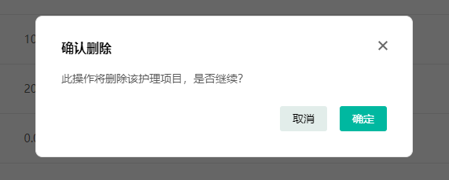

# 基础数据开发-服务管理

## 1 目标

各位同学，我们在第一天中，已经完成了服务管理下护理项目的后端接口开发，并且我们也做了测试。但是光有接口是不行的，还需要有前端的页面效果，那今天呢，我们就来开发护理项目的前端部分

开发这个需要大家具备VUE3 + TS 的基础才行。

我们今天主要的目标是：

- 使用前端开发的视角来重新分析需求，掌握其分析套路和策略
- 掌握TDesign组件选择使用的方式
- 能够动手完成护理项目页面开发
- 能够独立完成前端与后端的接口对接和联调

## 2 护理项目-设计

我们再来回顾一下前端的开发流程，大家来看这个图


在功能实现之前，我们有很多的工作需要完成，而这就是设计这部分的内容，主要包含了**需求分析**、**评估工期**、**接口设计**

其中到目前为止，后端已经提供了在线接口文档Knife4j，现在需要做的就是需求分析和功能实现

> 评估工期，我们在学习阶段不太关注，先跳过

在day01中我们已经分析过需求了，为什么还要做需求分析呢？

因为前端和后端对于需求来说，关注的点是不一样的，后端更注重逻辑，前端更注重展示效果，并且在完成功能之前，我们还需要查阅UI设计师提供的设计稿（图）来辅助我们完成页面的开发

请查看当天的资料：UI设计

### 2.1 页面分析

下面，我们来重新分析一下需求，还是打开原型图，找到护理项目这个小模块

列表页


当点击`新增护理项目`按钮或者是列表项中`编辑`的时候，需要弹窗进行新增或者是编辑，如下图


- 点击【新增护理项目】，出【新增护理项目】弹窗

- 点击`编辑`，出【编辑护理项目】弹窗

当编辑输入框内容的时候，验证规则如下：


> 关于价格、排序、图片这三个字段，需要进一步查看**公共说明**文档


在列表项`操作`中的`删除`和`禁用`也会有弹窗，大家可以打开原型的`全局/公共说明`

删除弹窗


禁用弹窗


> 注意：启用与禁用操作、逻辑相反，且不出确认弹窗；


通过以上分析，我们现在大概知道了，这个护理项目分为了四个部分，分别是：

- 列表页
- 新增和编辑弹窗
- 删除弹窗
- 禁用弹窗

以上所有的页面，我们都可以到TDesign组件去寻找，来适配我们当前的项目

### 2.2 页面效果

前端在做开发的时候，我们开发的效果，要完全还原UI的设计稿效果，这个也属于验收测试的一部分，所以在页面开发的时候，UI设计稿也是我们需要先分析和查看的。下面是一些页面的配色、布局、样式和要求

- 列表页


- 弹窗模板


## 3 护理项目-功能开发

现在我们再来回顾一下，前端主要包含的技术：vue3 + typescript + TDesign + vite + pinia

其中TDesign组件我们开发页面重要参考，这里面提供了非常多的组件，大家需要收藏这个官网地址，方便我们随时查看：https://tdesign.tencent.com/vue-next/overview

当我们已经完成了需求分析，开发具体功能基本的步骤有四个

- 先到TDesign组件找到对应的组件，先用静态组件在项目中展示效果
- 编写接口代码，参考knife4j在线接口文档
- 修改静态页面，调用接口，动态渲染数据
- 样式微调，公共组件封装

> **疑问：没有在线接口文档怎么办？**
>
>- 先到TDesign组件找到对应的组件，先用静态组件在项目中展示效果
>- mock接口数据（模拟接口和数据） | 离线的接口文档（前后端共同制定）
>- 修改静态页面，调用mock接口，渲染数据
>
>- 样式微调，公共组件封装
>
>**两者对比**：在后期接口联调的时候，mock接口的成本更高

### 3.1 护理项目-分页条件查询列表

#### 3.1.1 静态组件

在`@/pages/serve/plan/project/`目录中新建`index.vue`组件，我们现在想要一个列表分页展示，可以参考TDesign组件提供好的基础内容，链接如下：

https://tdesign.tencent.com/vue-next/components/table

我们找到基础表格


然后拷贝它所有的代码，到我们创建的index.vue组件中

```vue

<template>
  <t-space direction="vertical">
    <!-- 按钮操作区域 -->
    <t-radio-group v-model="size" variant="default-filled">
      <t-radio-button value="small">小尺寸</t-radio-button>
      <t-radio-button value="medium">中尺寸</t-radio-button>
      <t-radio-button value="large">大尺寸</t-radio-button>
    </t-radio-group>

    <t-space>
      <t-checkbox v-model="stripe"> 显示斑马纹</t-checkbox>
      <t-checkbox v-model="bordered"> 显示表格边框</t-checkbox>
      <t-checkbox v-model="hover"> 显示悬浮效果</t-checkbox>
      <t-checkbox v-model="tableLayout"> 宽度自适应</t-checkbox>
      <t-checkbox v-model="showHeader"> 显示表头</t-checkbox>
    </t-space>

    <!-- 当数据为空需要占位时，会显示 cellEmptyContent -->
    <t-table
        row-key="index"
        :data="data"
        :columns="columns"
        :stripe="stripe"
        :bordered="bordered"
        :hover="hover"
        :table-layout="tableLayout ? 'auto' : 'fixed'"
        :size="size"
        :pagination="pagination"
        :show-header="showHeader"
        cell-empty-content="-"
        resizable
        @row-click="handleRowClick"
    >
    </t-table>
  </t-space>
</template>

<script setup lang="jsx">
  import {ref} from 'vue';
  import {ErrorCircleFilledIcon, CheckCircleFilledIcon, CloseCircleFilledIcon} from 'tdesign-icons-vue-next';

  const statusNameListMap = {
    0: {label: '审批通过', theme: 'success', icon: <CheckCircleFilledIcon/>},
    1: {label: '审批失败', theme: 'danger', icon: <CloseCircleFilledIcon/>},
    2: {label: '审批过期', theme: 'warning', icon: <ErrorCircleFilledIcon/>},
  };
  const data = [];
  const total = 28;
  for (let i = 0; i < total; i++) {
    data.push({
      index: i + 1,
      applicant: ['贾明', '张三', '王芳'][i % 3],
      status: i % 3,
      channel: ['电子签署', '纸质签署', '纸质签署'][i % 3],
      detail: {
        email: ['w.cezkdudy@lhll.au', 'r.nmgw@peurezgn.sl', 'p.cumx@rampblpa.ru'][i % 3],
      },
      matters: ['宣传物料制作费用', 'algolia 服务报销', '相关周边制作费', '激励奖品快递费'][i % 4],
      time: [2, 3, 1, 4][i % 4],
      createTime: ['2022-01-01', '2022-02-01', '2022-03-01', '2022-04-01', '2022-05-01'][i % 4],
    });
  }

  const stripe = ref(true);
  const bordered = ref(true);
  const hover = ref(false);
  const tableLayout = ref(false);
  const size = ref('medium');
  const showHeader = ref(true);

  const columns = ref([
    {colKey: 'applicant', title: '申请人', width: '100'},
    {
      colKey: 'status',
      title: '申请状态',
      cell: (h, {row}) => {
        return (
            <t-tag shape="round" theme={statusNameListMap[row.status].theme} variant="light-outline">
              {statusNameListMap[row.status].icon}
              {statusNameListMap[row.status].label}
            </t-tag>
        );
      },
    },
    {colKey: 'channel', title: '签署方式'},
    {colKey: 'detail.email', title: '邮箱地址', ellipsis: true},
    {colKey: 'createTime', title: '申请时间'},
  ]);

  const handleRowClick = (e) => {
    console.log(e);
  };

  const pagination = {
    defaultCurrent: 1,
    defaultPageSize: 5,
    total,
  };
</script>
```

在上面的代码中，主要控制数据显示的是`<t-table>`标签，我们来详细说一下这个标签的内容

```html

<t-table
        row-key="index"
        :data="data"
        :columns="columns"
        :stripe="stripe"
        :bordered="bordered"
        :hover="hover"
        :table-layout="tableLayout ? 'auto' : 'fixed'"
        :size="size"
        :pagination="pagination"
        :show-header="showHeader"
        cell-empty-content="-"
        resizable
        @row-click="handleRowClick"
>
```

- row-key
- :data 数据源 (数组)
- :columns 列配置(数组)
- :stripe 是否显示斑马纹
- :bordered 是否显示表格边框
- :hover 是否显示鼠标悬浮状态
- :table-layout 表格布局方式 可选项：auto/fixed
- :size 表格尺寸
- :pagination 分页配置， 用于模块内切换内容的控件
- :show-header 是否显示表头
- cell-empty-content 单元格数据为空时呈现的内容
- resizable 是否允许调整列宽
- @row-click 行点击时触发，泛型 T 指表格数据类型

table组件更多的api参考：https://tdesign.tencent.com/vue-next/components/table?tab=api

我们现在启动前端项目，同时也需要启动后端，然后在网页上访问**服务管理**-->**护理计划**-->**护理项目**

如果能看到如下效果，就证明刚才的路由和vue创建都是成功的


#### 3.1.2 查询接口

定义模型对象：在src/api/model中新增一个文件serveModel.ts，代码如下

```tsx
export interface ProjecListModel {
    createBy: number
    createTime: string
    creator: string
    id: number
    image: string
    name: string
    nursingRequirement: string
    orderNo: number
    price: number
    status: number
    unit: string
    updateBy: number
    updateTime: string
}
```

> 以上类型定义需要与后台接口字段和类型进行对应，参考在线接口文档

在src/api目录中新增一个serve.ts文件，定义接口，代码如下：

```tsx
import {request} from '@/utils/request'
import type {ProjecListModel} from '@/api/model/nursingModel'

// 分页查询护理项目信息
export function getProjectList(params) {
    return request.get<ProjecListModel>({
        url: `/nursing_project`,
        params
    })
}
```

> 注意：路径要与后台提供的接口路径保持一致，参考在线接口文档

#### 3.1.3 修改静态页面，调用接口，动态渲染数据

1. 定义表头

   我们查看原型，表格中的表格如下：

   

   在`<t-table>`标签中有一个属性叫做`:columns`，它是一个数组，里面可以定义表头

   为了方便管理，我们在`@/pages/serve/plan/project/`文件夹下创建一个`constants.ts`文件

   ```tsx
   export const COLUMNS = [
       {
         title: '序号',
         align: 'left',
         width: 100,
         minWidth: 100,
         colKey: 'rowIndex'
       },
       { 
         title: '护理图片',
         width: 150, 
         minWidth: '150px',
         colKey: 'image' 
       },
       {
         title: '护理项目名称',
         minWidth: '150px',
         colKey: 'name'
       },
       {
         title: '价格（元）',
         minWidth: '160px',
         colKey: 'price'
       },
       {
         title: '单位',
         minWidth: '150px',
         colKey: 'unit'
       },
       {
         title: '排序',
         minWidth: '150px',
         colKey: 'orderNo'
       },
       {
         title: '创建人',
         minWidth: '200px',
         colKey: 'creator'
       },
       {
         title: '创建时间',
         minWidth: '180px',
         colKey: 'createTime'
       },
       {
         title: '状态',
         colKey: 'status',
         width: 120,
         minWidth: '120px',
         cell: (h, { row }) => {
           const statusList = {
             1: {
               label: '启用'
             },
             0: {
               label: '禁用'
             }
           }
           return h(
             'span',
             {
               class: `status-dot status-dot-${row.status}`
             },
             statusList[row.status].label
           )
         }
       },
       {
         align: 'left',
         fixed: 'right',
         width: 154,
         minWidth: '154px',
         colKey: 'op',
         title: '操作'
       }
     ]
   ```

   然后在index.vue中删除掉关于columns定义的属性，然后引入我们刚才定义的constants.ts文件

   ```tsx
   import { COLUMNS } from './constants'
   ```

   修改`<t-table :columns="COLUMNS">`  让标签中的`:columns`指向我们引入的`COLUMNS`

2. 静态数据展示

   我们打开knife4j在线接口文档，找到护理项目接口，做一个测试，获得到json相关的数据

   

   获取json之后，我们可以修改index.vue中的for循环，模拟真实的接口数据

   ```json
   const total = 16
   for (let i = 0; i < total; i++) {
     data.push({
       index: i + 1,
       createTime: '2023-07-11 15:24:52',
       updateTime: '2023-07-18 14:41:51',
       creator: '张三李四王五',
       name: '喂饭',
       orderNo: 1,
       unit: '次',
       price: 20,
       image:
         'https://yjy-slwl-oss.oss-cn-hangzhou.aliyuncs.com/2a6ababd-6f0d-4e07-9dff-ca34123912dc.png',
       status: 1,
       count: 0
     })
   }
   ```

   保存查看效果如下：

   

   这样就可以展示真实的数据了

3. 添加样式

   目前前端开发人员已经对页面样式进行了修复，在table标签外部，添加以下三个div，来修饰样式

   ```vue
   <template>
       <div class="min-h serveProject bg-wt">
           <div class="baseList">
             <div class="tableBoxs">
                 <t-tabel>
       				<!-- 其他代码省略 -->
       		  </t-tabel>
             </div>
           </div>
       </div>
   </template>
   ```


4. 图片预览处理

   目前在列表中展示的是图片的路径，我们的需求是，需要展示小图，并且可以预览图片（大图）

   这个在TDesign组件中已经提供了

   网址：https://tdesign.tencent.com/vue-next/components/image-viewer

   我们在`<t-table></t-table>`**标签对内**处理图片的展示，代码如下：

   ```html
   <t-table>
   	<!-- 图片预览及展示 -->
       <template #image="{ row }">
           <div class="tdesign-demo-image-viewer__base">
               <t-image-viewer :images="[row.image]">
                   <template #trigger="{ open }">
                       <div class="tdesign-demo-image-viewer__ui-image">
                           
                           <div
                                class="tdesign-demo-image-viewer__ui-image--hover"
                                @click="open"
                                >
                               <span><BrowseIcon size="1.4em" /> 预览</span>
                           </div>
                       </div>
                   </template>
               </t-image-viewer>
           </div>
       </template>
   </t-table>
   ```

5. 价格展示

   在列表展示的价格需要保留小数点后两位，如果是整数，需要补零

   我们同样在`<t-table></t-table>`**标签对内**处理字段的展示，代码如下：

   ```vue
   <t-table>
       <!-- 价格拼接 -->
       <template #price="{ row }">
           {{ isDecimals(row.price) ? row.price : row.price + '.00' }}
       </template>
   </t-table>
    
   <script setup lang="ts">
       //在js代码中添加isDecimals方法，判断当前字段是否包含了小数点
       const isDecimals = (val) => {
         if (String(val).indexOf('.') > -1) {
           return true
         }
         return false
       }
   </script>
   ```


6. 操作按钮处理

   在table的最右侧，有三个按钮，我们先来看效果

   

   分别代表了不同的操作，我们目前先处理显示的问题，后期我们再做具体的操作

   我们同样在`<t-table></t-table>`**标签对内**处理字段的展示，代码如下：

   ```vue
   <t-table>
        <!-- 操作栏 -->
       <template #op="{ row }">
         <div class="operateCon">
           <a 
           class="btn-dl"
           >删除</a>
           <a 
           class="font-bt"
           >编辑</a>
           <a 
           class="delete"
           >禁用</a>
         </div>
       </template>
   </t-table>
   ```

   > 标签中的样式，在提供的前端工程中已经包含，大家直接使用即可

7. 调用接口，并调式分页组件

   把刚才我们定义的接口先引入到index.vue中，然后编写调用接口的方法，代码如下：

   ```vue
   <template>
     <!-- 当数据为空需要占位时，会显示 cellEmptyContent -->
      <t-table 
             :row-key="rowKey" 
             :data="data" 
             :columns="COLUMNS" 
             vertical-align="middle"
             :hover="hover"
             :loading="dataLoading"
             tabel-content-width="100%"
             table-layout="fixed"
             >
       <!-- 价格拼接 -->
       <template #price="{ row }">
         {{ isDecimals(row.price) ? row.price : row.price + '.00' }}
       </template>
   
       <!-- 图片预览及展示 -->
       <template #image="{ row }">
         <div class="tdesign-demo-image-viewer__base">
           <t-image-viewer :images="[row.image]">
             <template #trigger="{ open }">
               <div class="tdesign-demo-image-viewer__ui-image">
                 
                 <div
                   class="tdesign-demo-image-viewer__ui-image--hover"
                   @click="open"
                 >
                   <span><BrowseIcon size="1.4em" /> 预览</span>
                 </div>
               </div>
             </template>
           </t-image-viewer>
         </div>
       </template>
   
       <!-- 操作栏 -->
       <template #op="{ row }">
         <div class="operateCon">
           <a class="btn-dl">删除</a>
           <a class="font-bt">编辑</a>
           <a class="delete">禁用</a>
         </div>
       </template>
     </t-table>
   	 <!-- 分页 -->
           <t-pagination
             v-if="total > 10"
             v-model="pagination.pageNum"
             v-model:pageSize="pagination.pageSize"
             :total="total"
             @change="onPageChange"
           />
   </template>
     
   <script setup lang="ts">
   import {  onMounted, ref } from 'vue'
   import { COLUMNS } from './constants'
   import { getProjectList } from '@/api/serve'
   
   var data = ref([])
   var total = ref(0)
   const dataLoading = ref(false) // 加载中
   
   //分页对象
   const pagination = ref({
     pageSize: 10,
     pageNum: 1
   })
   
   //生命周期
   onMounted(() => {
     getList()
   })
   
   //获取列表数据
   const getList = async () => {
     const res = await getProjectList(pagination.value)
     data.value = res.data.records
     total.value = Number(res.data.total)
   }
   
   // 翻页设置当前页
   const onPageChange = (val) => {
     pagination.value.pageNum = val.current
     pagination.value.pageSize = val.pageSize
     getList()
   }
   
   const isDecimals = (val) => {
     if (String(val).indexOf('.') > -1) {
       return true
     }
     return false
   }
   </script>
   ```

   我们现在，可以刷新网页，就可以看到跟原型图和UI设计稿几乎一样的效果了

   

8. 序号处理

   但是我们发现，在上述的效果展示中，没有序号了

   因为我们之前在使用for循环模拟数据的时候是给了设置了一个index字段的，但是我们查询的接口中并没有这个字段，现在我们可以使用前端TDesign中的表格属性rowIndex解决，代码如下：

   我们同样在`<t-table></t-table>`**标签对内**处理字段的展示，代码如下：

   ```vue
   <template>
     <t-table>
       <!-- 序号 -->
       <template #rowIndex="{ rowIndex }">{{ rowIndex + 1 }}</template>
     </t-table>
   </template>
   ```

   效果如下：

   

最终代码：

```vue

<template>
  <div class="min-h serveProject bg-wt">
    <div class="baseList">
      <div class="tableBoxs">
        <!-- 当数据为空需要占位时，会显示 cellEmptyContent -->
        <t-table
            :row-key="rowKey"
            :data="data"
            :columns="COLUMNS"
            vertical-align="middle"
            :hover="hover"
            :loading="dataLoading"
            tabel-content-width="100%"
            table-layout="fixed"
        >
          <!-- 序号 -->
          <template #rowIndex="{ rowIndex }">{{ rowIndex + 1 }}</template>
          <!-- 图片预览 -->
          <template #image="{ row }">
            <div>
              <div class="tdesign-demo-image-viewer__base">
                <t-image-viewer :images="[row.image]">
                  <template #trigger="{ open }">
                    <div class="tdesign-demo-image-viewer__ui-image">
                      
                      <div class="tdesign-demo-image-viewer__ui-image--hover" @click="open">
                        <span>
                          <BrowseIcon size="1.4em"/> 预览
                        </span>
                      </div>
                    </div>
                  </template>
                </t-image-viewer>
              </div>
            </div>
          </template>
          <!-- 价格拼接 -->
          <template #price="{ row }">
            {{ isDecimals(row.price) ? row.price : row.price + '.00' }}
          </template>

          <!-- 按钮处理 -->
          <template #op="{ row }">
            <div class="operateCon">
              <a class="btn-dl">删除</a>
              <a class="font-bt">编辑</a>
              <a class="delete">禁用</a>
            </div>
          </template>
        </t-table>
        <!-- 分页 -->
        <t-pagination
            v-if="total > 10"
            v-model="pagination.pageNum"
            v-model:pageSize="pagination.pageSize"
            :total="total"
            @change="onPageChange"
        />
      </div>
    </div>
  </div>
</template>

<script setup lang="jsx">
  import {ref, onMounted} from 'vue';
  import {COLUMNS} from './constants'
  import {getProjectList} from '@/api/serve'

  const data = ref([]);
  const total = ref(0);
  const dataLoading = ref(false) // 加载中

  const pagination = ref({
    pageSize: 10,
    pageNum: 1
  })
  //生命周期
  onMounted(() => {
    getList()
  })

  //调用接口
  const getList = async () => {
    const res = await getProjectList(pagination.value)
    data.value = res.data.records
    total.value = Number(res.data.total)
  }

  // 翻页设置当前页
  const onPageChange = (val) => {
    pagination.value.pageNum = val.current
    pagination.value.pageSize = val.pageSize
    getList()
  }

  //判断当前参数是否包含小数点
  const isDecimals = (val) => {
    if (String(val).indexOf('.') > -1) {
      return true;
    }
    return false;
  }

</script>
```

#### 3.1.4 抽取组件

我们完成了列表查询以后，发现index.vue中已经有了不少的代码了，后面我还有搜索表单、新增、编辑、删除、禁用等功能，如果所有的内容都放在同一个vue中不太好，原因有两个，第一不太好阅读，后期修改调试不方便；第二不通用，假如其他页面有相同的功能，不能复用

所以通常情况下，我们都会对一个组件进行封装，封装为一个单独的vue，然后让index.vue去引用


抽取组件

我们在`pages/serve/plan/project`目录中新增一个目录`components`，新增一个TableList.vue组件

我们可以把index.vue中的代码全粘贴过来进行改造，其中调用接口、接口的参数、具体的方法还是在父组件中执行

- 如果子组件需要让父组件传递属性，需要在子组件中定义`defineProps`并需要指明类型

- 如果子组件需要调用父组件的方法，需要在子组件中定义`defineEmits`需要指定方法列表

- 如果子组件需要监听父组件的参数变化，则需要使用`watch`来监听

代码如下

文件路径：pages/serve/plan/project/components/TableList.vue

```vue

<template>
  <div class="baseList">
    <div class="tableBoxs">
      <!-- 当数据为空需要占位时，会显示 cellEmptyContent -->
      <t-table
          :data="data"
          :columns="COLUMNS"
          :row-key="rowKey"
          vertical-align="middle"
          :hover="true"
          :loading="dataLoading"
          table-layout="fixed"
          table-content-width="100%"
      >
        <!-- 处理序号 -->
        <template #rowIndex="{ rowIndex }">
          {{ rowIndex + 1 }}
        </template>
        <!-- 图片预览及展示 -->
        <template #image="{ row }">
          <div class="tdesign-demo-image-viewer__base">
            <t-image-viewer :images="[row.image]">
              <template #trigger="{ open }">
                <div class="tdesign-demo-image-viewer__ui-image">
                  
                  <div class="tdesign-demo-image-viewer__ui-image--hover" @click="open">
                                        <span>
                                            <BrowseIcon size="1.4em"/> 预览
                                        </span>
                  </div>
                </div>
              </template>
            </t-image-viewer>
          </div>
        </template>
        <!-- 价格拼接 -->
        <template #price="{ row }">
          {{ isDecimals(row.price) ? row.price : row.price + '.00' }}
        </template>
        <!-- 操作栏 -->
        <template #op="{ row }">
          <div class="operateCon">
            <a class="btn-dl">删除</a>
            <a class="font-bt">编辑</a>
            <a class="delete">禁用</a>
          </div>
        </template>
      </t-table>
      <t-pagination v-if="total > 10" :total="total" v-model:current="pagination.pageNum"
                    v-model:pageSize="pagination.pageSize" @change="onPageChange"/>
    </div>
  </div>
</template>
<script setup lang="ts">

  import {COLUMNS} from '../constants'

  // 行的key
  const rowKey = 'index'

  const props = defineProps({
    data: {
      type: Object,
      default: () => {
        return {}
      }
    },
    // 总条数
    total: {
      type: Number,
      default: 0
    },
    pagination: {
      type: Object,
      default: () => {
        return {}
      }
    },
    // 加载状态
    dataLoading: {
      type: Boolean,
      default: false
    }
  })

  //声明方法
  const emit = defineEmits([
    'onPageChange'
  ])

  //点击翻页
  const onPageChange = (val) => {
    emit('onPageChange', val)
  }

  const isDecimals = (val) => {
    if (String(val).indexOf('.') > -1) {
      return true
    }
    return false
  }

</script>
```

修改index.vue，删除之前的`<t-table>`标签的内容，与当前标签相关的配置也可以删除（TabalList中已定义）

在index.vue中引入新创建的组件

```vue
import TableList  from './components/TableList.vue'
```

在`<template></template>`标签定义TableList组件

```vue

<template>
  <div class="min-h serveProject bg-wt">
    <TableList
        :data="data"
        :total="total"
        :pagination="pagination"
        :dataLoading="dataLoading"
        @onPageChange="onPageChange"
    >
    </TableList>
  </div>
</template>
```

参数和方法的传递

①`:data、:pagination、:total`这三个就是TableList组件需要的**变量**，通过这三个属性传递

②`@getCurrent、@isDecimals`这两个就是TableList组件需要的**方法**

index.vue最终代码

```vue

<template>
  <div class="min-h serveProject bg-wt">
    <TableList
        :data="data"
        :total="total"
        :pagination="pagination"
        :dataLoading="dataLoading"
        @onPageChange="onPageChange"
    >
    </TableList>
  </div>
</template>

<script setup lang="jsx">

  import {ref, onMounted} from 'vue';
  import {getProjectList} from '@/api/serve'
  import TableList from './components/TableList.vue'


  const data = ref([]);
  const total = ref(0);
  const dataLoading = ref(false) // 加载中

  const pagination = ref({
    pageNum: 1,
    pageSize: 10
  })

  //初始完成后执行查询方法
  onMounted(() => {
    getList();
  })

  //翻页设置当前页
  const onPageChange = (val) => {
    pagination.value.pageNum = val.current
    pagination.value.pageSize = val.pageSize
    getList()
  }

  //调用接口方法
  const getList = async () => {
    const res = await getProjectList(pagination.value);
    data.value = res.data.records;
    total.value = Number(res.data.total)
  }

</script>
```

> 封装组件的过程中，大家一定要一点点调试，经常到网页中查看效果，千万不要一下子把代码写完再调试

#### 3.1.5 封装搜索组件

我们现在已经实现了列表的查询，但是目前还不完善，因为在原型图中，还有搜索框没有添加，就是接口的搜索条件还没有添加


我们接下来就开发这个功能，我们可以直接去定义搜索组件，然后在index.vue中去引用

1. 定义SearchFrom.vue组件

   在pages/serve/plan/project/components路径新建SearchFrom.vue

   代码如下：

   ```vue
   <template>
       <div class="formBox">
           <t-form ref="form" :model="searchData" label-width="98">
               <t-row>
                   <t-col>
                       <t-form-item label="护理项目名称：" name="name">
                           <t-input placeholder="请输入内容" v-model="searchData.name" class="form-item-content" type="search"
                               clearable @clear="handleClear('name')" />
                       </t-form-item>
                   </t-col>
                   <t-col>
                       <t-form-item label="状态：" name="status">
                           <t-select clearable v-model="searchData.status" placeholder="请输入内容" @clear="handleClear('status')">
                               <t-option v-for="(item, index) in statusData" :key="index" :value="item.id" :label="item.value"
                                   title="" />
                           </t-select>
                       </t-form-item>
                   </t-col>
                   <t-col class="searchBtn">
                       <button type="button" class="bt-grey wt-60" @click="handleReset()">重置</button>
                       <button type="button" class="bt wt-60" @click="handleSearch()">搜索</button>
                   </t-col>
               </t-row>
           </t-form>
   
       </div>
   </template>
   
   <script setup lang="ts">
   
   import { ref } from 'vue';
   import { statusData } from '@/utils/commonData'
   
   
   const form = ref(null);
   /* const searchData = ref({
       name: '',
       status: 0
   }); */
   //接收变量
   defineProps({
       searchData: {
           type: Object,
           default: () => ({})
       }
   })
   
   //声明方法
   const emits = defineEmits(['handleReset','handleSearch','handleClear'])
   
   //重置搜索框
   const handleReset = () =>{
       emits('handleReset')
   }
   
   //搜索
   const handleSearch = () =>{
       emits('handleSearch')
   }
   
   //清空
   const handleClear = (val) =>{
       emits('handleClear',val)
   }
   
   </script>
   ```

   > TDesign组件参考链接
   >
   >- Grid栅格：https://tdesign.tencent.com/vue-next/components/grid
   >
   >- Form 表单：https://tdesign.tencent.com/vue-next/components/form

>
>- Input输入框：https://tdesign.tencent.com/vue-next/components/input
>
>- Button 按钮：https://tdesign.tencent.com/vue-next/components/button
>
>注意：其中的class样式，是专业的前端人员调试后的，大家直接使用即可，比如：
>
>

2. 在父组件中引用SearchFrom.vue

   ```vue
   <template>
     <div class="min-h serveProject bg-wt">
       <!-- 搜索框 -->
       <SearchFrom :searchData="pagination" @handleClear="handleClear" @handleReset="handleReset"
         @handleSearch="handleSearch"></SearchFrom>
   
       <TableList :data="data" :total="total" :pagination="pagination" :dataLoading="dataLoading"
         @onPageChange="onPageChange">
       </TableList>
   
   
     </div>
   </template>
   
   <script setup lang="jsx">
   
   import { ref, onMounted } from 'vue';
   import { getProjectList } from '@/api/serve'
   import TableList from './components/TableList.vue'
   import SearchFrom from './components/SearchFrom.vue'
   
   //其他代码省略.....
   
   //重置搜索框
   const handleReset = () => {
     //重置页码
     pagination.value = {
       pageNum: 1,
       pageSize: 10
     }
     getList()
   }
   
   //搜索
   const handleSearch = () => {
     //点击了搜索按钮之后，就需要重置页码
     pagination.value.pageNum = 1
     getList()
   }
   
   //清空
   const handleClear = (val) => {
     if(val === 'name'){
       delete pagination.value.name
     }else{
       delete pagination.value.status
     }
   
     pagination.value = {
       //把pagination对象的所有字段，都填充进来
       ...pagination.value
     }
   
     getList()
   }
   </script>
   ```

### 3.2 护理项目-新增

#### 3.2.1 需求回顾

我们先查看原型，在列表的右上角有一个按钮，点击之后会出现弹窗，可以输入表单数据


弹窗(新增或编辑)


依据原型，弹窗中的内容有很多，分别是

- 护理项目名称
- 价格
- 单位
- 排序
- 状态
- 护理图片
- 护理项目描述

在去填写这些字段的时候，PRD文档中详细说明了校验规则


这里面所有的字段，都在一个表单中，然后在表单中有各式各样的输入项，像这些所有内容，我们都可以在TDesign组件中去找到合适的内容进行填充


#### 3.2.2 新增或编辑Dialog(弹窗)

TDesign弹窗组件：https://tdesign.tencent.com/vue-next/components/dialog

在pages/serve/plan/project/components目录新增一个DialogFrom.vue
注意：可以从讲义中直接拷贝到代码中进行开发，我们重点练习vue部分相关的代码

```vue
<!-- 护理项目新增编辑弹窗 -->
<template>
  <div class="dialog-form">
    <t-dialog
        v-model:visible="formVisible"
        :header="title + '护理项目'"
        :footer="false"
        :on-close="onClickCloseBtn"
    >
      <template #body>
        <!-- 表单内容 -->
        <div class="dialogCenter">
          <div class="dialogOverflow">
            <t-form
                ref="form"
                :data="formData"
                :rules="rules"
                :label-width="110"
                :reset-type="resetType"
                @reset="onClickCloseBtn"
                @submit="onSubmit"
            >
              <t-form-item label="护理项目名称：" name="name">
                <t-input
                    v-model="formData.name"
                    class="wt-400"
                    placeholder="请输入"
                    clearable
                    show-limit-number
                    :maxlength="10"
                >
                </t-input>
              </t-form-item>
              <t-form-item label="价格：" name="price">
                <t-input-number
                    v-model="formData.price"
                    :min="0"
                    :step="10"
                    placeholder="0.00"
                    :decimal-places="2"
                    @blur="textBlurPrice"
                    @change="textBlurPrice"
                ></t-input-number>
              </t-form-item>
              <t-form-item label="单位：" name="unit">
                <t-input
                    v-model="formData.unit"
                    class="wt-400"
                    placeholder="请输入"
                    clearable
                    show-limit-number
                    :maxlength="5"
                >
                </t-input>
              </t-form-item>
              <t-form-item label="排序：" name="orderNo">
                <t-input-number
                    v-model="formData.orderNo"
                    :min="minNumber"
                    @blur="textBlurNo"
                    @change="textBlurNo"
                ></t-input-number>
              </t-form-item>
              <t-form-item label="状态：" name="status">
                <t-radio-group v-model="formData.status">
                  <t-radio
                      v-for="(item, index) in statusData"
                      :key="index"
                      :value="item.id"
                  >{{ item.value }}
                  </t-radio
                  >
                </t-radio-group>
              </t-form-item>
              <t-form-item label="护理图片：" name="image">
                <t-upload
                    ref="uploadRef"
                    v-model="photoFile"
                    action="api/common/upload"
                    :autoUpload="autoUpload"
                    theme="image"
                    :size-limit="sizeLimit"
                    tips="图片大小不超过2M,仅支持上传PNG JPG JPEG类型图片"
                    accept="image/*"
                    :before-upload="beforeUpload"
                    @remove="remove"
                    @fail="handleFail"
                    @success="handleSuccess"
                ></t-upload>
              </t-form-item>
              <t-form-item label="护理项目描述：" name="nursingRequirement"
              >
                <t-textarea
                    v-model="formData.nursingRequirement"
                    class="wt-400"
                    placeholder="请输入"
                    show-limit-number
                    :maxlength="50"
                >
                </t-textarea>
              </t-form-item>
              <t-form-item class="dialog-footer">
                <div>
                  <button class="bt bt-grey wt-60" type="reset">取消</button>
                  <button theme="primary" type="submit" class="bt wt-60">
                    <span>确定</span>
                  </button>
                </div>
              </t-form-item>
            </t-form>
          </div>
        </div>
      </template>
    </t-dialog>
  </div>
</template>

<script setup lang="ts">
  import {ref, watch} from 'vue'
  import {MessagePlugin, ValidateResultContext} from 'tdesign-vue-next'
  // 基础数据
  import {statusData} from '@/utils/commonData'
  // 获取父组件值、方法
  const props = defineProps({
    // 弹层隐藏显示
    visible: {
      type: Boolean,
      default: false
    },
    //   详情数据
    data: {
      type: Object,
      default: () => {
        return {}
      }
    },
    // 最小值
    minNumber: {
      type: Number,
      default: 1
    },
    // 标题
    title: {
      type: String,
      default: '新增'
    },
  })
  // ------定义变量------
  // 触发父级事件
  const emit: Function = defineEmits([
    'handleClose',
    'fetchData',
    'handleAdd',
    'handleEdit'
  ])
  const resetType = ref('empty') // 重置表单
  const form = ref() // 表单
  const formVisible = ref(false) // 弹窗
  // 表单数据
  const formData = ref<Object | any>({
    status: 1,
    orderNo: 1
  })
  const autoUpload = ref(true) // 是否在选择文件后自动发起请求上传文件
  const photoFile = ref([]) // 绑定上传的文件
  const sizeLimit = ref({
    size: 2,
    unit: 'MB',
    message: '图片大小超过2m，请重新上传'
  }) // 图片的大小限制
  // 表单校验
  const rules = {
    name: [
      // 名称校验
      {
        required: true,
        message: '护理项目名称为空，请输入护理项目名称',
        type: 'error',
        trigger: 'blur'
      }
    ],
    // 费用校验
    price: [
      {
        required: true,
        message: '价格为空，请输入价格',
        type: 'error',
        trigger: 'blur'
      },
      {
        validator: (val) => val >= 0.01,
        message: '价格为空，请输入价格',
        type: 'error',
        trigger: 'change'
      }
    ],
    // 单位
    unit: [
      {
        required: true,
        message: '单位为空，请输入单位',
        type: 'error',
        trigger: 'blur'
      }
    ],
    // 排序
    orderNo: [
      {
        required: true,
        message: '排序为空，请输入排序',
        type: 'error',
        trigger: 'blur'
      },
      {
        validator: (val) => val >= 1,
        message: '排序为空，请输入排序',
        type: 'error',
        trigger: 'change'
      }
    ],
    //   状态
    status: [
      {
        required: true,
        message: '状态为空，请选择状态',
        type: 'error',
        trigger: 'change'
      }
    ],
    // 护理图片
    image: [
      {
        required: true,
        message: '护理图片为空，请上传护理图片',
        type: 'error',
        trigger: 'change'
      }
    ],
    //   项目描述
    nursingRequirement: [
      {
        required: true,
        message: '护理项目描述为空，请输入护理项目描述',
        type: 'error',
        trigger: 'blur'
      }
    ]
  }
  // 弹窗标题
  const title = ref()
  // 监听器，监听父级传递的visible值，控制弹窗显示隐藏
  watch(
      () => props.visible,
      () => {
        formVisible.value = props.visible
        title.value = props.title
      }
  )
  // 监听器，监听父级传递的data值，控制表单数据
  watch(
      () => props.data,
      (val) => {
        formData.value = val
        const obj = {
          url: val.image
        }
        photoFile.value.push(obj)
      }
  )
  // -----定义方法------
  // 提交表单
  const onSubmit = (result: ValidateResultContext<FormData>) => {
    if (result.validateResult === true) {
      if (props.title === '新增') {
        // 调用新增接口
        emit('handleAdd', formData.value)
      } else {
        // 调用编辑接口
        emit('handleEdit', formData.value)
      }
    }
  }
  // 清除表单数据
  const handleClear = () => {
    // 重置表单
    form.value.reset()
    formData.value.orderNo = 1
    formData.value.status = 1
    photoFile.value = []
  }
  // 点击取消关闭
  const onClickCloseBtn = () => {
    handleClear()
    emit('handleClose')
  }
  // // 监听价格
  const textBlurPrice = () => {
    const data = Number(formData.value.price)
    minPrice(data)
  }
  // 监听排序
  const textBlurNo = () => {
    const data = Number(formData.value.orderNo)
    minNum(data)
  }
  // 当前输入的金额小于0的时候显示0.00
  const minPrice = (val) => {
    if (val < 0) {
      formData.value.fee = '0.00'
    }
  }
  // 当前输入的排序小于等于1的时候显示1
  const minNum = (val) => {
    if (val <= 1) {
      formData.value.orderNo = 1
    }
  }
  // 移除图片时将图片设置为默认图片
  const remove = () => {
    photoFile.value = []
    formData.value.image = ''
  }
  // 上传图片失败
  const handleFail = ({file}) => {
    MessagePlugin.error(`图片 ${file.name} 上传失败`)
  }
  // 上传成功后触发。
  const handleSuccess = (params) => {
    const photo = params.response.data
    formData.value.image = photo
    photoFile.value[0].response.url = photo
    photoFile.value[0].url = photo
  }
  // 限制图片的大小
  const beforeUpload = (file) => {
    if (file.size > 2 * 1024 * 1024) {
      MessagePlugin.error('图片大小超过2M，请重新上传')
      return false
    }
    return true
  }
  // 向父组件暴露数据与方法
  defineExpose({
    handleClear
  })
</script>
```

其中visible属性控制是否弹出弹窗，true：弹出，false：退出

#### 3.2.3 TableList组件中添加”新增按钮”

调出弹窗的按钮在列表的左上角：`新增护理项目`按钮


在TableList组件中新增按钮代码，代码如下：

```vue

<div class="newBox">
  <button class="bt wt-120" @click="handleBulid()">
    新增护理项目
  </button>
</div>

在js代码中增加方法handleBulid，来打开弹窗
<script setup lang="ts">

  //声明方法
  const emit = defineEmits([
    'onPageChange', 'handleBulid'
  ])

  //新增按钮
  const handleBulid = () => {
    emit('handleBulid')
  }

</script>
```

在index.vue中去引用，我们在父组件中中去控制visible属性，需要给刚才定义的按钮绑定（新增护理项目）

```vue

<template>
  <TableList
      :data="data"
      :total="total"
      :pagination="pagination"
      @getCurrent="getCurrent"
      @isDecimals="isDecimals"
      @handleBulid="handleBulid"
  //注意这里需要在TableList组件中调用父组件的方法
  ></TableList>
  <DialogFrom
      :visible="visible"
      @handleClose="handleClose"
  ></DialogFrom>
</template>
<script setup lang="ts">
  import DialogFrom from './components/DialogFrom.vue'
  //是否显示弹窗
  var visible = ref(false)
  //点击新增护理项目 按钮 把visible设置为true，弹出
  const handleBulid = () => {
    visible.value = true;
  }
  //点击弹窗中的关闭或取消，关闭弹窗
  const handleClose = () => {
    visible.value = false;
  }
</script>
```

#### 3.3.4  编写新增接口

在src/api/serve.ts文件，定义新增接口，代码如下：

```js
// 护理项目添加
export function projectAdd(params) {
    return request.post < ProjecListModel > ({
        url: '/nursing_project',
        data: params
    })
}
```

#### 3.3.5 index组件与Dialog组件整合

index.vue中继续完善DialogFrom组件的内容，代码如下：

```vue

<template>

  <DialogFrom
      ref="formRef"
      :visible="visible"
      :title="title"
      @handleClose="handleClose"
      @handle-add="handleAdd"
  >
  </DialogFrom>

</template>

<script setup lang="ts">
  import {onMounted, ref} from 'vue'
  import TableList from './components/TableList.vue'
  import SearchFrom from './components/SearchFrom.vue'
  import DialogFrom from './components/DialogFrom.vue'
  import {getProjectList, projectAdd} from '@/api/serve'
  import {MessagePlugin} from 'tdesign-vue-next'


  var visible = ref(false)
  const formRef = ref(null)
  const title = ref('') // 弹窗标题
  const formBaseData = ref({}) // 弹窗表单内容

  const handleBulid = () => {
    title.value = '新增'
    visible.value = true;
  }

  const handleClose = () => {
    visible.value = false;
  }

  // 添加
  const handleAdd = async (val) => {
    const res = await projectAdd(val)
    if (res.code === 200) {
      MessagePlugin.success('添加成功')
      getList()
      handleClose()
      formRef.value.handleClear()
    } else {
      MessagePlugin.error(res.msg)
    }
  }
</script>
```

- formRef就是指子组件，定义为了一个对象

- 子组件向父组件暴露数据和方法，可以让父组件去执行

  ```vue
  // 向父组件暴露数据与方法
  defineExpose({
  handleClear
  })
  ```

- formRef.value.handleClear()  就是父组件中直接执行子组件暴露的方法

### 3.3 护理项目-编辑

#### 3.3.1 需求梳理

当我点击列表中的编辑按钮，首先需要回显数据，然后修改完成以后，点击确定是修改数据


也就是说，这里面我们需要准备两个接口，分别是：**根据id查询详情**和**修改**

#### 3.3.2 列表中编辑打开弹窗

找到TableList组件中的操作栏，修改编辑a标签


```vue
<!-- 操作栏 -->
<template #op="{ row }">
  <div class="operateCon">
    <a class="btn-dl">删除</a>
    <a class="font-bt" @click="handleEdit(row)">编辑</a>
    <a class="delete">禁用</a>
  </div>
</template>
```

在当前组件中，需要调用父组件的方法


```js
//引入该组件，需要传递方法
const emit = defineEmits(['getCurrent', 'handleBulid', 'handleEdit'])
//编辑   参数为一行数据
const handleEdit = (row) => {
    emit('handleEdit', row)
}
```

在index.vue组件中添加对应的方法，需要调用接口查询护理项目的详情

```vue

<template>

  <TableList
      :data="data"
      :total="total"
      :pagination="pagination"
      :dataLoading="dataLoading"
      @onPageChange="onPageChange"
      @handleBulid="handleBulid"
      @handleEdit="handleEdit">
  </TableList>

  <!-- 新增或编辑弹窗 -->
  <DialogFrom
      ref="formRef"
      :title="title"
      :visible="visible"
      :data="formBaseData"
      @handleClose="handleClose"
      @handleAdd="handleAdd">
  </DialogFrom>

</template>

<script setup lang="ts">
  //添加接口
  import {getProjectList, projectAdd, getProjectDetails} from '@/api/serve'

  const title = ref('') // 弹窗标题
  const formBaseData = ref({}) // 弹窗表单内容

  //编辑
  const handleEdit = (val) => {
    // 将弹窗的标题
    title.value = '编辑'
    // 获取详情
    getDetails(val.id)
    // 显示弹窗
    visible.value = true
  }

  // 获取详情数据
  const getDetails = async (id) => {
    const res = await getProjectDetails(id) // 获取列表数据
    if (res.code === 200) {
      formBaseData.value = res.data
    }
  }
</script>
```

在src/api/serve.ts文件，定义查询详情接口，参考Knife4j在线接口文档

```js
// 获取护理项目详情
export function getProjectDetails(id) {
    return request.get < ProjecListModel > ({
        url: `/nursing_project/${id}`
    })
}
```

修改DialogFrom组件，回显数据，这个能够回显的原因有两个

第一：在DialogFrom组件中定义了接收了父组件的data数据

第二：在DialogFrom组件中定义了侦听，一旦数据发生变化就会重新给表单数据赋值

```vue

<script setup lang="ts">
  import {ref, watch} from 'vue'
  // 基础数据
  import {statusData} from '@/utils/commonData'
  import {MessagePlugin, ValidateResultContext} from 'tdesign-vue-next'
  import {rules} from './rules'

  const props = defineProps({
// 监听器，监听父级传递的data值，控制表单数据
    watch(
  ()
  =>
  props.data,
      (val) => {
        formData.value = val
        const obj = {
          url: val.image
        }
        photoFile.value.push(obj)
      }
  )
</script>
```

我们现在打开编辑弹窗，数据就可以回显了，效果如下：


#### 3.3.3 修改数据

我们刚才是回显了护理项目的详细数据，现在当我们修改了数据之后，点击确定就需要调用后端的修改接口了，由于我们之前写过新增，它们的思路基本是一致的，并且新增和编辑复用了弹窗，我们现在只需要编写修改的接口即可。

在src/api/serve.ts文件，定义修改护理项目的接口，参考Knife4j在线接口文档

```tsx
// 护理项目编辑
export function projectUpdate(params: ProjecListModel) {
    return request.put<ProjecListModel>({
        url: `/nursing_project`,
        data: params
    })
}
```

由于我们之前在DialogFrom表单中已经定义了修改的方法，并且让它去调用了父组件的方法，我们现在只需要在父组件中去定义修改方法即可

```vue

<template>

  <SearchFrom
      :searchData="pagination"
      @handleReset="handleReset"
      @handleSearch="handleSearch">
  </SearchFrom>

  <TableList
      :data="data"
      :total="total"
      :pagination="pagination"
      @getCurrent="getCurrent"
      @isDecimals="isDecimals"
      @handleBulid="handleBulid"
      @handleEdit="handleEdit"
  ></TableList>

  <DialogFrom
      ref="formRef"
      :visible="visible"
      :data="formBaseData"
      :title="title"
      @handleClose="handleClose"
      @handle-add="handleAdd"
      @handleEdit="handleEditForm"
  >
  </DialogFrom>

</template>

<script setup lang="ts">
  import {getProjectList, projectAdd, getProjectDetails, projectUpdate} from '@/api/serve'

  // 修改数据
  const handleEditForm = async (val) => {
    const res = await projectUpdate(val)
    if (res.code === 200) {
      MessagePlugin.success('编辑成功')
      getList()
      handleClose()
      formRef.value.handleClear()
    } else {
      MessagePlugin.error(res.msg)
    }
  }

  //编辑
  const handleEdit = (val) => {
    // 将弹窗的标题
    title.value = '编辑'
    // 获取详情
    getDetails(val.id)
    // 显示弹窗
    visible.value = true
  }
</script>

```

> 大家注意：
>
> 在index.vue中有两个Edit方法，它们的作用是不同的
>
> - handleEdit 被列表中的`编辑`按钮触发，作用是打开弹窗，获取详情，在TableList被引用
> - handleEditForm 弹窗中的确定按钮触发，作用是修改数据 ，在DialogFrom中被引用

### 3.4 护理项目-删除

当我们点击了删除按钮，就会先弹出一个确认框，再来决定是否需要删除



由于像这样的`删除`弹窗，在当前项目中的很普遍，应用的地方很多，所以，像这样的弹窗都会封装为一个公共的组件来让项目使用

我们项目中公共组件位置在src/components目录中

其中的删除组件在src/components/OperateDialog/index.vue

我们先来分析一下这个代码：

```vue
<!--操作弹层-->
<template>
  <div class="deleteDialog baseDialog">
    <t-dialog
        v-model:visible="dialogVisible"
        :header="title ? title : '确认删除'"
        :footer="false"
        :on-close="handleClose"
        :on-confirm="handleSubmit"
    >
      <div v-if="title === '确认驳回'">
        驳回申请后，该流程将自动驳回至发起人，是否继续？
      </div>
      <div v-else-if="title === '确认提交'">
        账单审批通过后，应退金额不可再次修改。完成退款操作后，退款金额将退到预缴款余额中，最终随退住办理完结时一起退还给老人，是否确定提交账单？
      </div>
      <div v-else>
        <div v-if="text">此操作将{{ text }}，是否继续？</div>
        <div v-else>此操作将删除该{{ deleteText }}，是否继续？</div>
      </div>

      <!-- 此操作将永久删除这条信息，是否继续？ -->
      <div class="dialog-footer">
        <button
            theme="primary"
            type="submit"
            class="bt-grey wt-60"
            @click="handleClose"
        >
          <span>取消</span>
        </button>
        <button
            theme="primary"
            type="submit"
            class="bt wt-60"
            @click="handleSubmit"
        >
          <span>确定</span>
        </button>
      </div>
    </t-dialog>
  </div>
</template>
<script setup lang="ts">
  import {ref, watch} from 'vue'
  // 获取父组件值、方法
  const props = defineProps({
    // 弹层隐藏显示
    visible: {
      type: Boolean,
      default: false
    },
    title: {
      type: String,
      default: ''
    },
    text: {
      type: String,
      default: ''
    },
    deleteText: {
      type: String,
      default: ''
    }
  })
  // ------定义变量------
  const emit = defineEmits(['handleClose', 'handleDelete']) // 子组件获取父组件事件传值
  const dialogVisible = ref(false)
  watch(
      () => props.visible,
      (newVal) => {
        dialogVisible.value = newVal
      }
  )
  // ------定义方法------
  // 关闭弹层
  const handleClose = () => {
    emit('handleClose')
  }
  // 提交确定删除
  const handleSubmit = () => {
    emit('handleDelete')
  }
</script>
```

我们想要使用这个组件，想要传入几个值

> - :visible 控制弹窗的调出
>- :deleteText 删除的具体项目业务提示 ，比如：此操作将删除该**护理项目**，是否继续？
>- handleClose 关闭弹窗的方法
>- handleDelete 调用后端删除接口，执行数据删除

下面我们就进入代码开发，首先我们要做的是调出该弹窗，然后才会执行删除

调出弹窗是在列表页中的”删除”按钮


我们需要修改TableList组件，来调出弹窗，代码如下：

```vue

<template>
  <div class="newBox">
    <button class="bt wt-120" @click="handleBulid()">新增护理项目</button>
  </div>
  <!-- 当数据为空需要占位时，会显示 cellEmptyContent -->
  <t-table
      rowKey="index"
      :data="data"
      :columns="COLUMNS"
      :stripe="stripe"
      :bordered="bordered"
      :hover="hover"
      :table-layout="tableLayout ? 'auto' : 'fixed'"
      :size="size"
      :pagination="pagination.total > 10 ? pagination : null"
      :show-header="showHeader"
      cell-empty-content="-"
      resizable
      @page-change="getCurrent"
  >
    <!-- 操作栏 -->
    <template #op="{ row }">
      <div class="operateCon">
        <a class="btn-dl" @click="handleClickDelete(row)">删除</a>
        <a class="font-bt" @click="handleEdit(row)">编辑</a>
        <a class="delete">禁用</a>
      </div>
    </template>
  </t-table>
</template>

<script setup lang="ts">

  //引入该组件，需要传递方法
  const emit = defineEmits([
    'getCurrent',
    'isDecimals',
    'handleBulid',
    'handleEdit',
    'handleClickDelete'
  ])

  // 点击删除
  const handleClickDelete = (row) => {
    emit('handleClickDelete', row)
  }

</script>
```

准备删除接口

在src/api/serve.ts文件，定义删除护理项目的接口，参考Knife4j在线接口文档

```js
// 护理项目删除
export function projectDelete(id) {
    return request.delete({
        url: `/nursing_project/${id}`
    })
}
```

然后在index.vue中添加handleClickDelete方法来控制弹窗的出现，不过，我们也需要在index.vue中引入delete弹窗，代码如下：

```vue

<template>

  <TableList
      :data="data"
      :total="total"
      :pagination="pagination"
      @getCurrent="getCurrent"
      @isDecimals="isDecimals"
      @handleBulid="handleBulid"
      @handleEdit="handleEdit"
      @handleClickDelete="handleClickDelete"
  ></TableList>

  <!-- 删除弹层 -->
  <Delete
      :visible="dialogDeleteVisible"
      :delete-text="operateText"
      @handle-delete="handleDelete"
      @handle-close="handleDeleteClose"
  ></Delete>

</template>

<script setup lang="ts">
  // 删除弹层
  import Delete from '@/components/OperateDialog/index.vue'
  import {getProjectList, projectAdd, getProjectDetails, projectUpdate, projectDelete} from '@/api/serve'

  const dialogDeleteVisible = ref(false) // 控制删除弹层显示隐藏
  const operateText = ref('护理项目') // 要操作的内容提示
  const typeId = ref('') // 设置删除id


  // 确认删除
  const handleDelete = async () => {
    const res = await projectDelete(typeId.value)
    if (res.code === 200) {
      dialogDeleteVisible.value = false
      MessagePlugin.success('删除成功')
      getList()
    }
  }
  // 点击删除
  const handleClickDelete = (val) => {
    typeId.value = val.id
    dialogDeleteVisible.value = true
  }

  // 关闭删除弹层
  const handleDeleteClose = () => {
    dialogDeleteVisible.value = false
  }

</script>
```

- 在TableList组件传递handleClickDelete，并编写handleClickDelete方法逻辑
- 引入Delete组件
    - 方法：handle-close 关闭删除弹窗
    - 方法：handle-delete 调用接口删除
    - 属性：visible 控制删除弹层显示隐藏
    - 属性：delete-text 要操作的内容提示

### 3.5 护理项目-启用禁用

跟删除弹窗类似，在点击禁用的时候，也会出现弹窗，效果如下


> 需求回顾：只有禁用才会有弹窗确认提示，如果是启用，则不会弹窗，直接启用

因为这个功能也是通用的，在项目也已经提供了公共的组件

禁用组件路径：src/components/Forbidden/index.vue

```vue
<!--删除弹层-->
<template>
  <div class="deleteDialog baseDialog">
    <t-dialog
        v-model:visible="dialogVisible"
        header="确认禁用"
        :footer="false"
        :on-close="handleClose"
        :on-confirm="handleSubmit"
    >
      此操作将禁用该{{ text }}，是否继续？
      <div class="dialog-footer">
        <button
            theme="primary"
            type="submit"
            class="bt-grey wt-60"
            @click="handleClose"
        >
          <span>取消</span>
        </button>
        <button
            theme="primary"
            type="submit"
            class="bt wt-60"
            @click="handleSubmit"
        >
          <span>确定</span>
        </button>
      </div>
    </t-dialog>
  </div>
</template>
<script setup lang="ts">
  import {ref, watch} from 'vue'
  // 获取父组件值、方法
  const props = defineProps({
    // 弹层隐藏显示
    visible: {
      type: Boolean,
      default: false
    },
    text: {
      type: String,
      default: ''
    }
  })
  // ------定义变量------
  const emit = defineEmits(['handleClose', 'handleSubmit']) // 子组件获取父组件事件传值
  const dialogVisible = ref(false)
  watch(
      () => props.visible,
      (newVal, oldVal) => {
        dialogVisible.value = newVal
      }
  )
  // ------定义方法------
  // 关闭弹层
  const handleClose = () => {
    emit('handleClose')
  }
  // 提交确定删除
  const handleSubmit = () => {
    emit('handleSubmit')
  }
</script>
```

我们想要使用这个组件，想要传入几个值

> - :visible 控制弹窗的调出
>- :text 禁用的具体项目业务提示 ，比如：此操作将禁用该**护理项目**，是否继续？
>- handleClose 关闭弹窗的方法
>- handleSubmit 调用后端禁用接口，执行禁用

下面我们就进入代码开发，首先我们要做的是调出该弹窗，然后才会执行禁用

调出弹窗是在列表页中的”禁用”按钮


我们需要修改TableList组件，来调出弹窗，并且我们也发现了，如果是启用是绿色按钮，如果是禁用是红色按钮，这个需要使用状态的不同来控制按钮的颜色，代码如下：

```vue

<template>
  <div class="newBox">
    <button class="bt wt-120" @click="handleBulid()">新增护理项目</button>
  </div>
  <!-- 当数据为空需要占位时，会显示 cellEmptyContent -->
  <t-table
      rowKey="index"
      :data="data"
      :columns="COLUMNS"
      :stripe="stripe"
      :bordered="bordered"
      :hover="hover"
      :table-layout="tableLayout ? 'auto' : 'fixed'"
      :size="size"
      :pagination="pagination.total > 10 ? pagination : null"
      :show-header="showHeader"
      cell-empty-content="-"
      resizable
      @page-change="getCurrent"
  >
    <!-- 操作栏 -->
    <template #op="{ row }">
      <div class="operateCon">
        <a class="btn-dl" @click="handleClickDelete(row)">删除</a>
        <a class="font-bt" @click="handleEdit(row)">编辑</a>
        <a
            class="delete"
            :class="row.status === 1 ? 'btn-dl' : 'font-bt'"
            @click="handleForbidden(row)"
        >{{ row.status === 1 ? '禁用' : '启用' }}</a
        >
      </div>
    </template>
  </t-table>
</template>

<script setup lang="ts">
  import {watch, ref} from 'vue'
  import {COLUMNS} from '../constants'

  //引入该组件，需要传递方法
  const emit = defineEmits([
    'getCurrent',
    'isDecimals',
    'handleBulid',
    'handleEdit',
    'handleClickDelete',
    'handleForbidden'
  ])

  // 禁用
  const handleForbidden = (row) => {
    emit('handleForbidden', row)
  }
</script>
```

准备删除接口

在src/api/serve.ts文件，定义禁用护理项目的接口，参考Knife4j在线接口文档

```js
// 护理项目禁用启用
export function projectStatus(params) {
    return request.put({
        url: `/nursing_project/${params.id}/status/${params.status}`
    })
}
```

然后在index.vue中添加handleForbidden方法来控制弹窗的出现，不过，我们也需要在index.vue中引入禁用弹窗，代码如下：

```vue

<template>

  <TableList
      :data="data"
      :total="total"
      :pagination="pagination"
      @getCurrent="getCurrent"
      @isDecimals="isDecimals"
      @handleBulid="handleBulid"
      @handleEdit="handleEdit"
      @handleClickDelete="handleClickDelete"
      @handleForbidden="handleForbidden"
  ></TableList>

  <!-- 禁用弹层 -->
  <Forbidden
      :visible="dialogVisible"
      :text="operateText"
      @handle-submit="handleForbiddenSub"
      @handle-close="handleForbiddenClose"
  ></Forbidden>

</template>

<script setup lang="ts">
  import {onMounted, ref} from 'vue'
  import TableList from './components/TableList.vue'
  import SearchFrom from './components/SearchFrom.vue'
  import DialogFrom from './components/DialogFrom.vue'
  // 删除弹层
  import Delete from '@/components/OperateDialog/index.vue'
  // 禁用弹窗
  import Forbidden from '@/components/Forbidden/index.vue'
  import {getProjectList, projectAdd, getProjectDetails, projectUpdate, projectDelete, projectStatus} from '@/api/serve'
  import {MessagePlugin} from 'tdesign-vue-next'

  var data = ref([])
  var total = ref(0)
  var visible = ref(false)
  const formRef = ref(null)
  const title = ref('') // 弹窗标题
  const formBaseData = ref({}) // 弹窗表单内容
  const dialogDeleteVisible = ref(false) // 控制删除弹层显示隐藏
  const operateText = ref('护理项目') // 要操作的内容提示
  const typeId = ref('') // 设置删除id
  const dialogVisible = ref(false);
  const typeStatus = ref(null) // 禁用启用
  const statusText = ref('') // 启用禁用提示

  //确定禁用
  const handleForbiddenSub = async () => {
    const params = {
      id: typeId.value,
      status: typeStatus.value
    }
    const res = await projectStatus(params)
    if (res.code === 200) {
      dialogVisible.value = false
      MessagePlugin.success(statusText.value)
      getList()
    }
  }

  // 禁用弹窗
  const handleForbidden = (val) => {
    typeId.value = val.id
    if (val.status === 1) {
      dialogVisible.value = true
      typeStatus.value = 0
      statusText.value = '禁用成功'
    } else {
      typeStatus.value = 1
      handleForbiddenSub()
      statusText.value = '启用成功'
    }
  }

  // 关闭禁用弹窗
  const handleForbiddenClose = () => {
    dialogVisible.value = false
  }

</script>
```

- 在TableList组件传递handleForbidden，并编写handleForbidden方法逻辑
- 引入Forbidden组件
    - 方法：handleForbiddenClose 关闭禁用弹窗
    - 方法：handleForbiddenSub 调用接口启用或禁用
    - 属性：dialogVisible 控制禁用弹层显示隐藏
    - 属性：operateText 要操作的内容提示
    - 属性：typeId 护理项目id临时存储
    - 属性：typeStatus 护理项目状态临时存储（禁用 | 启用）

## 4 前后端联调

### 4.1 什么是前后端联调


现在的开发基本都是前后端分离的项目，对于前端来说，后端还没有提供接口的时候，前端需要的数据从哪里来呢？通常情况下，可以自己造数据写死，还可以使用mock来造数据，别管是哪种方式，都没有调用真正的后台接口。假如现在后端已经给提供了接口，前端所需要的数据就要替换为后端提供的接口数据了。这个时候就需要进行前后端的联调，这个过程就是前后端接口联调

### 4.2 为什么要联调

为什么要进行联调呢？我们之前不是已经分析了需求，也定义好了接口了吗？

可能的原因如下几条：

- 后端没有做严谨的测试，依赖前端调用接口达到测试的目的
- 前端没有做严谨的测试，想要调用后台接口输出数据达到测试的目的
- 前后端整合一起才是完整的靠谱的项目
- 多方配合尽早找出问题，交付客户稳定的产品

### 4.3 联调的最佳实践

- 定义明确的接口规范

    - 响应码
    - 入参的结构(数据类型、传参的方式)
    - 出参的数据结构
    - ...

- 本地联调测试

    - 前后端都应该在本地进行自测

- 制定联调计划

    - 在评估工期的过程中，都需要制定联调计划，要确保项目的开发进度
    - 如果临时制定联调计划，可能会出现前后端人员时间不匹配的情况，耽误工期

- 保证环境稳定

    - 如果前后端开发都在一起办公，可以先通过局域网链接的方式进行小范围联调
    - 如果不在一起办公，则需要都部署到测试环境（公共的环境）中去进行联调测试

- 问题记录及修复

  在联调过程中，出现问题很正常，比如说接口不兼容、性能瓶颈等。为了避免重复出现问题，开发人员需要记录问题，并及时解决。


