# 权限认证-基础

## 1 目标

前几天，我们已经完成了项目中的一些基础功能的开发，接下来的三天，我们会讲解比较重要的一个大模块，权限。在后台管理系统中，几乎每个项目都会使用到权限认证，所以我们项目中会重点讲解这些内容，让大家掌握其核心原理，增加自己的核心竞争力。

我们今天主要开发的业务是权限相关的知识，主要就包含了以下几个内容：

- 能够熟悉RBAC权限模型的整体业务流程及涉及到的表结构
- 能够独立完成部门管理的所有接口
- 能够独立完成岗位管理的所有接口
- 能够掌握SpringCache的特点，并且能够在项目中应用

## 2 RBAC模型

在企业系统中，通过配置用户的功能权限可以解决不同的人分管不同业务的需求，基于RBAC模型，RBAC（Role Based Access Control)
模型，它的中文是基于角色的访问控制，主要是将功能组合成角色，再将角色分配给用户，也就是说**角色是功能的合集**。

比如：

企业A总共有12个功能，需要创建100个用户。这些用户包括财务管理、人事管理、销售管理等等。如果不引入基于角色的访问控制（RBAC）模型，我们就需要每创建一个用户就要分配一次功能，这将至少需要进行100次操作（每个用户只能拥有一个功能）。如果用户数量增加到1000甚至10000，并且一个用户可能会拥有多个功能，操作将会变得非常繁琐。如图：

​    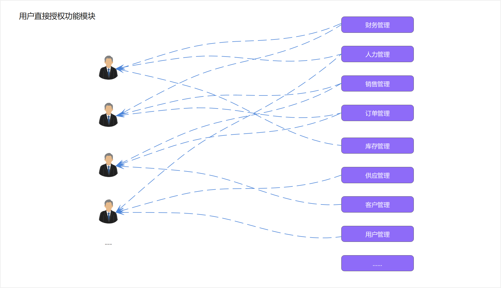

​
经过多次操作后发现，有些人被分配了相同的功能。例如，A、B等10个用户都被分配了客户管理、订单管理和供应商管理这几个模块。我们是否可以将这几个功能模块组合成一个包，然后将整个包分配给需要的用户呢？这个包被称为角色。由于角色和功能之间的对应关系相对稳定，在分配权限时只需分配角色即可，如下图所示：如图所示：

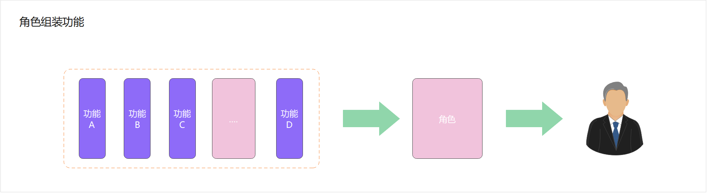

基于RBAC授权模式后，我们可以达到以下2个目标：

- 解耦用户和功能，降低操作错误率
- 降低功能权限分配的繁琐程度

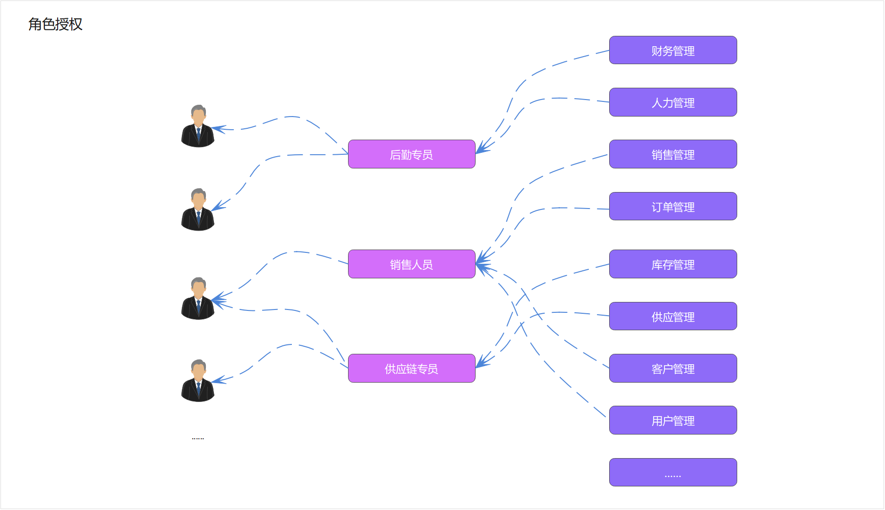

### 2.1 权限系统运行演示

我们可以通过运行权限系统，来理解RBAC。

### 2.2 ER图与关系梳理

在一个核心业务系统中，我们通常通过业务分析，从而抽离出数据库表，表确定之后我们会进一步分析表中应该有的字段，下面我先看下业务ER图：

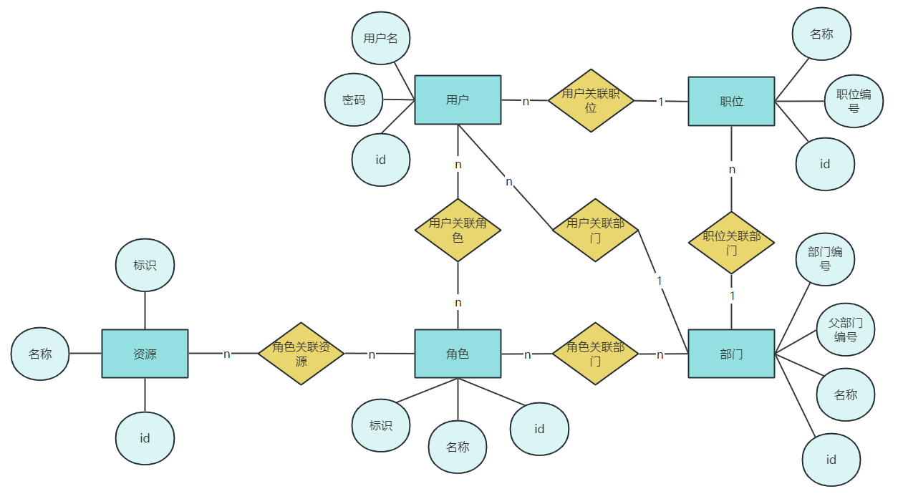

上图中清楚的描述用户、角色、资源、职位、部门之间的关系，同时我们进一步推导出以下结果：

- 用户与职位是N:1关系
- 用户与部门是N:1关系
- 用户与角色是N:N关系，则它们之间必然有一个中间表
- 角色与部门是N:N关系，则它们之间必然有一个中间
- 角色与资源是N:N关系，则它们之间必然有一个中间表

下图就展示了权限认证涉及到的所有的表结构，共8张表

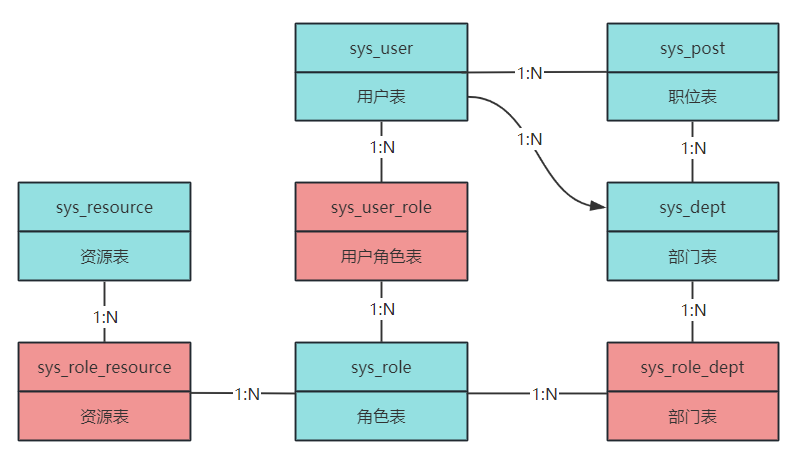

具体的表字段大家可以查看提供的数据库，我们在做业务的时候，会再次梳理这些表中的字段

## 3 部门管理

我们先来完成部门管理这个模块，因为这个模块跟其他业务的耦合度相对较高，几乎权限所有的模块都要关联部门

我们再局部的说明一下部门跟其他业务的关系

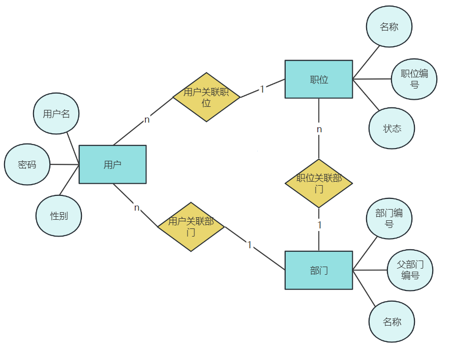

三者之间的关系

- 部门与用户是一对多的关系
- 岗位与用户是一对多的关系
- 部门与岗位是一对多的关系

### 3.1 需求分析

我们可以原型图进行说明，这个是功能列表页

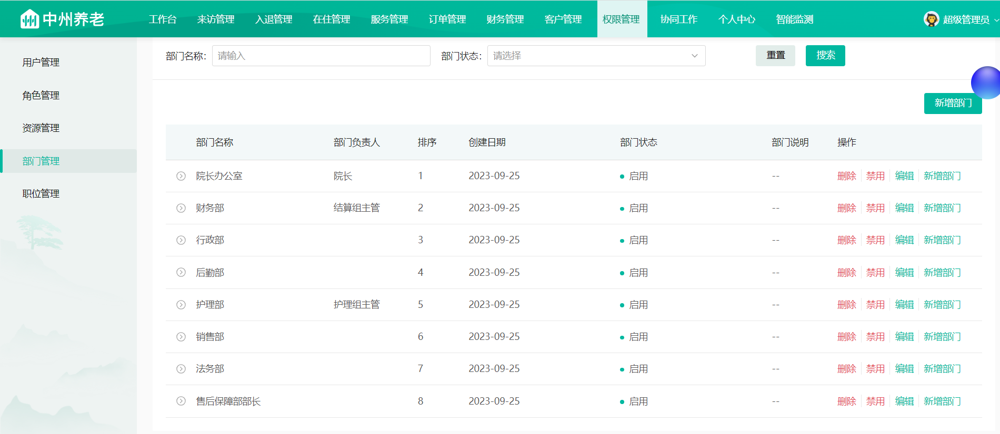

- 可以按照条件进行查询，由于一个公司的部门的数量是有限的，列表查询不需要分页

- 对于每一行都可以进行”删除”，”禁用”，”编辑”，”新增部门”

- 点击新增部门按钮，则会弹窗，如下图

  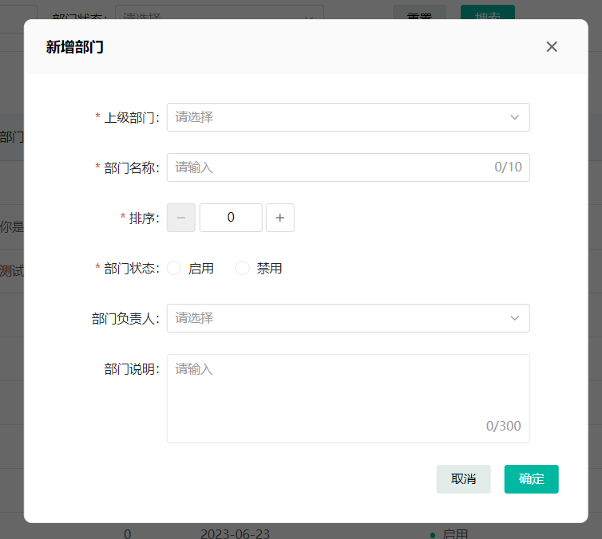

### 3.2 表结构分析

表名：sys_dept

字段说明：

| 字段             | 类型           | 说明            |
|----------------|--------------|---------------|
| id             | bigint       | 部门id          |
| parent_dept_no | varchar(20)  | 父部门编号         |
| dept_no        | varchar(20)  | 部门编号          |
| dept_name      | varchar(30)  | 部门名称          |
| sort_no        | int          | 排序            |
| data_state     | char(1)      | 数据状态（0正常 1停用） |
| create_time    | datetime     | 创建时间          |
| update_time    | datetime     | 更新时间          |
| create_by      | bigint       | 创建者           |
| update_by      | bigint       | 更新者           |
| leader_id      | bigint       | 负责人Id         |
| remark         | varchar(500) | 备注            |

表中parent_dept_no和dept_no是用于构建树形结构的基础，通过这2个字段定义资源的上下级关系，通常添加部门，我们通过程序自动生成编号，生成的编号满足以下规则:

- 1级：100000000000000
- 2级：100001000000000
- 3级：100001001000000
- 4级：100001001001000
- 5级：100001001001001

当我们在需要查询当前1级节点以下所有节点时，就不用再递归查询，使用like “dept_no%”即可。

> 举个例子：
>
>想要查询100001001000000下所有的部门，我们的查询方式为：
>
>```sql
>select * from sys_dept where dept_no like '100001001%'
>```
>
>这样就可以查询到100001001000000部门下所有的部门了

对应的实体类：

```java
@Data
public class Dept extends BaseEntity {

    private static final long serialVersionUID = 1L;

    /**
     * 父部门编号
     */
    private String parentDeptNo;

    /**
     * 部门编号:
     */
    private String deptNo;

    /**
     * 部门名称
     */
    private String deptName;

    /**
     * 排序
     */
    private Integer sortNo;

    /**
     * 数据状态（0正常 1停用）
     */
    private String dataState;

    /**
     * 负责人Id
     */
    private Long leaderId;

}
```

### 3.3 接口分析

依据我们刚才分析的部门的需求，在部门模块中共有5个接口，分别是：

- 添加部门
- 修改部门
- 启用-禁用
- 部门列表
- 删除部门

下面我们就来具体分析每个接口包含的四要素（路径、请求方式、入参、出参）

#### 3.3.1 部门列表

**接口地址**:`/dept/list`

**请求方式**:`POST`

**请求示例**:

```json lines
{
    "parentDeptNo":"", //父部门编号
    "dataState":"", //状态
    "deptName":"" //部门名称
}
```

**响应示例**:

```json lines
{
    "code":200,
        "msg":"操作成功",
        "data":[
        {
            "id": "1671445634122588250",
            "createTime": "2023-07-09 16:00:13",
            "createDay": "2023-07-09",
            "updateTime": "2023-08-25 20:21:56",
            "createBy": "1",
            "updateBy": "1671403256519078006",
            "dataState": "0",
            "remark": "大沙发的",
            "parentDeptNo": "100001000000000",
            "deptNo": "100001030000000",
            "deptName": "静测试部",
            "sortNo": 0,
            "level": 4
        },
        {
            "id": "1671445634122588247",
            "createTime": "2023-07-07 18:18:59",
            "createDay": "2023-07-07",
            "updateTime": "2023-07-28 17:19:19",
            "createBy": "1671403256519078006",
            "updateBy": "1671403256519078006",
            "dataState": "0",
            "remark": "",
            "parentDeptNo": "100001000000000",
            "deptNo": "100001029000000",
            "deptName": "大管家",
            "sortNo": 0,
            "leaderId": "1671403256519078076",
            "leaderName": "你是是",
            "level": 4
        }
    ], 
        "operationTime":"2023-08-27 11:25:01"
}
```

#### 3.3.2 部门树形结构接口

由于是初始化部门的树形结构，这个接口需要在部门中去定义

**接口地址**:`/dept/tree`

**请求方式**:`POST`

**请求示例**:

无

**响应示例**:

```javascript
{
    "code":200,
        "msg":"操作成功",
        "data":{
        "items":
            [
                {
                    "id": "100001000000000",
                    "label": "智慧养老院",
                    "children": [
                        {
                            "id": "100001001000000",
                            "label": "院长办公室"
                        },
                        {
                            "id": "100001002000000",
                            "label": "财务部",
                            "children": [
                                {
                                    "id": "100001002001000",
                                    "label": "会计组"
                                },
                                {
                                    "id": "100001002002000",
                                    "label": "结算组"
                                }
                            ]
                        }
                    ]
                }
            ]
    }
}
```

#### 3.3.3 部门添加

**接口地址**:`/dept`

**请求方式**:`PUT`

**接口描述**:<p>部门添加</p>

**请求示例**:

```javascript
{
    "dataState":"",//部门状态
    "deptName":"",//部门名称
    "leaderId":0, // 部门负责人id
    "parentDeptNo":"", //上级部门编号
    "remark":"", //部门说明
    "sortNo":0   //排序
}
```

**响应示例**:

```javascript
{
    "code":0,
    "data":true,
    "msg":"",
    "operationTime":""
}
```

#### 3.3.4 部门修改

**接口地址**:`/dept`

**请求方式**:`PATCH`

**请求示例**:

```javascript
{
    "dataState"
:
    "",//部门状态
        "deptName"
:
    "",//部门名称
        "leaderId"
:
    0, // 部门负责人id
        "parentDeptNo"
:
    "", //上级部门编号
        "remark"
:
    "", //部门说明
        "sortNo"
:
    0,   //排序
        "id"
:
    1671445634122588232   // 主键
}
```

**响应示例**:

```javascript
{
    "code"
:
    0,
        "data"
:
    true,
        "msg"
:
    "",
        "operationTime"
:
    ""
}
```

#### 3.3.5 启用-禁用

**接口地址**:`/dept/is_enable`

**请求方式**:`PATCH`

**请求示例**:

```javascript
{
    "dataState"
:
    "",  //状态
        "id"
:
    1671445634122588232
}
```

**响应示例**:

```javascript
{
    "code"
:
    0,
        "data"
:
    true,
        "msg"
:
    "",
        "operationTime"
:
    ""
}
```

#### 3.3.6 删除部门

**接口地址**:`/dept/{deptId}`

**请求方式**:`DELETE`

**请求参数**:

| 参数名称   | 参数说明 | 请求类型         | 数据类型   |
|--------|------|--------------|--------|
| deptId | 部门id | path(路径上的参数) | string |

**响应示例**:

```json
{
  "code": 0,
  "data": 1,
  "msg": "",
  "operationTime": ""
}
```

### 3.4 功能实现

下面，我们就依据我们刚才分析的接口来完成具体的功能，由于这些也都是增删改查的代码，我们在课堂上一起来写一些比较有代表的功能，剩下的接口需要大家自己实现

我们课堂上的需要实现的接口有：

- 部门列表 需要有上下级的关系，按照父部门编号查询子部门列表
- 部门树形 在新增或是后边的岗位查询都需要展示部门的属性结构，查询没有条件，把所有数据组装成树形结构

- 部门添加 需要设计部门编号，讲解一种通用的编号生成方案

需要大家自己实现的接口：

- 部门修改
- 启用-禁用
- 部门删除

#### 3.4.1 权限模块环境说明

权限模块是比较通用的模块，在很多项目中都会存在，它具有独立性，所以我们可以把它单独使用一个工程模块来管理。

在zzyl父工程中使用zzyl-security模块，如下图

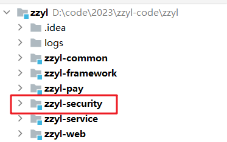

#### 3.4.2 部门列表

这个部门列表不需要分页，依据我们刚才的接口分析，我们直接来编码

1)定义接口

新增类DeptController中定义新的方法

```java
package com.zzyl.controller;

/**
 * @author sjqn
 */
@RestController
@RequestMapping("/dept")
@Api(tags = "部门管理")
public class DeptController {

    @PostMapping("/list")
    @ApiOperation("部门列表")
    @ApiImplicitParam(name = "deptDto",value = "部门DTO对象",required = true,dataType = "DeptDto")
    @ApiOperationSupport(
            includeParameters = {"deptDto.dataState","deptDto.deptName","deptDto.parentDeptNo"}
    )
    public ResponseResult<List<DeptVo>> deptList(@RequestBody DeptDto deptDto){
       
        return null;
    }

}

```

> 其中的ApiOperationSupport是可以在swagger接口文档中说明参数包含了哪些字段，比如你定义的dto是10个字段，但是当前接口只需要6个字段，就可以把这6个字段声明出来，这样做的好处就是dto可以在多个接口中复用

2)持久层mapper

在DeptMapper中新增方法

```java
package com.zzyl.mapper;

/**
 * @author sjqn
 */
@Mapper
public interface DeptMapper {
    /**
     * 查询列表
     * @param deptDto
     * @return
     */
    List<DeptVo> selectList(DeptDto deptDto);

}

```

对应的xml映射文件

```xml
<?xml version="1.0" encoding="UTF-8"?>
<!DOCTYPE mapper PUBLIC "-//mybatis.org//DTD Mapper 3.0//EN" "http://mybatis.org/dtd/mybatis-3-mapper.dtd">
<mapper namespace="com.zzyl.mapper.DeptMapper">
    <resultMap id="BaseResultMap" type="com.zzyl.entity.Dept">
        <id column="id" jdbcType="BIGINT" property="id"/>
        <result column="parent_dept_no" jdbcType="VARCHAR" property="parentDeptNo"/>
        <result column="dept_no" jdbcType="VARCHAR" property="deptNo"/>
        <result column="dept_name" jdbcType="VARCHAR" property="deptName"/>
        <result column="sort_no" jdbcType="INTEGER" property="sortNo"/>
        <result column="data_state" jdbcType="CHAR" property="dataState"/>
        <result column="create_time" jdbcType="TIMESTAMP" property="createTime"/>
        <result column="update_time" jdbcType="TIMESTAMP" property="updateTime"/>
        <result column="create_by" jdbcType="BIGINT" property="createBy"/>
        <result column="update_by" jdbcType="BIGINT" property="updateBy"/>
        <result column="leader_id" jdbcType="BIGINT" property="leaderId"/>
        <result column="leader_name" jdbcType="BIGINT" property="leaderName"/>
    </resultMap>
    <resultMap id="BaseResultVoMap" type="com.zzyl.vo.DeptVo">
        <id column="id" jdbcType="BIGINT" property="id"/>
        <result column="parent_dept_no" jdbcType="VARCHAR" property="parentDeptNo"/>
        <result column="dept_no" jdbcType="VARCHAR" property="deptNo"/>
        <result column="dept_name" jdbcType="VARCHAR" property="deptName"/>
        <result column="sort_no" jdbcType="INTEGER" property="sortNo"/>
        <result column="data_state" jdbcType="CHAR" property="dataState"/>
        <result column="create_time" jdbcType="TIMESTAMP" property="createTime"/>
        <result column="update_time" jdbcType="TIMESTAMP" property="updateTime"/>
        <result column="create_by" jdbcType="BIGINT" property="createBy"/>
        <result column="update_by" jdbcType="BIGINT" property="updateBy"/>
        <result column="leader_id" jdbcType="BIGINT" property="leaderId"/>
        <result column="role_id" jdbcType="BIGINT" property="roleId"/>
        <result column="create_day" jdbcType="BIGINT" property="createDay"/>
    </resultMap>
    <sql id="Base_Column_List">
        id
        , parent_dept_no, dept_no, dept_name, sort_no, data_state, create_time, update_time,
        create_by, update_by, remark, leader_id
    </sql>

    <select id="selectList" parameterType="com.zzyl.dto.DeptDto" resultMap="BaseResultVoMap">
        select
        d.id, d.parent_dept_no, d.dept_no, d.dept_name, d.sort_no, d.data_state, d.create_time, d.update_time,
        d.create_by, d.update_by, d.remark, d.leader_id
        , u.real_name as leader_name,DATE_FORMAT(d.create_time,'%Y-%m-%d') as create_day
        from sys_dept d
        left join sys_user u on u.id = leader_id
        <where>
            <if test="deptName!=null and deptName!=''">
                and d.dept_name like concat('%',#{deptName},'%')
            </if>
            <if test="parentDeptNo!=null and parentDeptNo!=''">
                and d.parent_dept_no like concat(#{parentDeptNo},'%')
            </if>
            <if test="dataState!=null and dataState!=''">
                and d.data_state=#{dataState}
            </if>
        </where>
        order by d.sort_no asc, d.create_time desc
    </select>

</mapper>
```

由于在部门列表的展示中，需要展示部门的负责人，所以关联了sys_user用户表来查询负责人姓名，虽然现在我们还没有开发用户模块，但是用户表已经有了，在这里可以进行关联查询

- 在sys_dept表和实体类中并没有一个叫做leader_name的字段，我们需要扩展一下，只需要在Dept实体类中新增一个leaderName字段即可，并且把对应的xml映射文件中的BaseResultVoMap中定义这个字段
- 在返回的日期中，前端要求返回的是创建的天，比如是：2023-10-31，我们需要使用mysql的日期函数单独处理
    - 格式化
        - `select DATE_FORMAT(new(),'%Y-%m-%d %H:%i:%s')--->返回字符串：2023-10-31 01:21:00`
        - `select str_to_DATE('2023-10-31 01:21:00','%Y-%m-%d %H:%i:%s')--->返回日期类型`

3)业务层

在DeptService中定义新的方法

```java
package com.zzyl.service;

/**
 * @author sjqn
 */
public interface DeptService {

    /**
     * 多条件查询部门
     * @param deptDto
     * @return
     */
    List<DeptVo> deptList(DeptDto deptDto);
}
```

实现类

```java
package com.zzyl.service.impl;

/**
 * @author sjqn
 * @date 2023/10/30
 */
@Service
public class DeptServiceImpl implements DeptService {

    @Autowired
    private DeptMapper deptMapper;

    /**
     * 多条件查询部门
     * @param deptDto
     * @return
     */
    @Override
    public List<DeptVo> deptList(DeptDto deptDto) {
        return deptMapper.selectList(deptDto);
    }

}
```

4)控制层代码补全

```java
/**
 * @Description：部门前端控制器
 */
@Slf4j
@Api(tags = "部门管理")
@RestController
@RequestMapping("dept")
public class DeptController {

    @Autowired
    DeptService deptService;

    /***
     * @description 多条件查询部门列表
     * @param deptDto 部门DTO对象
     * @return List<DeptVo>
     */
    @PostMapping("list")
    @ApiOperation(value = "部门列表",notes = "部门列表")
    @ApiImplicitParam(name = "deptDto",value = "部门DTO对象",required = true,dataType = "DeptDto")
    @ApiOperationSupport(includeParameters = {"deptDto.dataState","deptDto.deptName","deptDto.parentDeptNo"})
    public ResponseResult<List<DeptVo>> deptList(@RequestBody DeptDto deptDto) {
        List<DeptVo> deptVoList = deptService.findDeptList(deptDto);
        return ResponseResult.success(deptVoList);
    }

}
```

5)测试

同样打开前端项目进行测试

#### 3.4.2 部门树形结构

1) 定义接口

在DeptController中定义新的方法，如下代码：

```java
@PostMapping("/tree")
@ApiOperation("部门树形")
public ResponseResult<TreeVo> deptTreeVo(){
    return null;
}
```

返回值中的treeVo需要单独定义，代码如下：

```java
package com.zzyl.vo;

import io.swagger.annotations.ApiModelProperty;
import lombok.Builder;
import lombok.Data;
import lombok.NoArgsConstructor;

import java.io.Serializable;
import java.util.List;

/**
 * @description: 资源树显示类
 */
@Data
@NoArgsConstructor
public class TreeVo implements Serializable {

	@ApiModelProperty(value = "tree数据")
	private List<TreeItemVo> items;

	@Builder
	public TreeVo(List<TreeItemVo> items) {
		this.items = items;
	}
}
```

TreeItemVo

```java
package com.zzyl.vo;

import io.swagger.annotations.ApiModelProperty;
import lombok.Builder;
import lombok.Data;
import lombok.NoArgsConstructor;

import java.io.Serializable;
import java.util.ArrayList;
import java.util.List;

/**
 * @Description：资源树结构体
 */
@Data
@NoArgsConstructor
public class TreeItemVo implements Serializable {

    @ApiModelProperty(value = "节点ID")
    public String id;

    @ApiModelProperty(value = "显示内容")
    public String label;

    @ApiModelProperty(value = "显示内容")
    public List<TreeItemVo> children = new ArrayList<>();

    @Builder
    public TreeItemVo(String id, String label, List<TreeItemVo> children) {
        this.id = id;
        this.label = label;
        this.children = children;
    }
}
```

2)持久层mapper

无，使用之前查询的列表

3)业务层

在DeptService中新增方法，如下

```java
/**
 * 组织部门树形
 * @param deptDto 根节点
 * @return: deptDto
 */
public TreeVo deptTreeVo();
```

递归基本思路

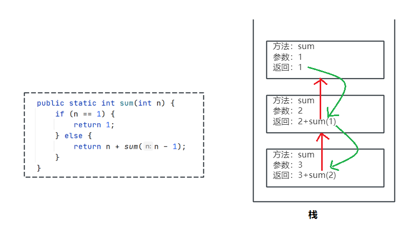

代码逻辑：

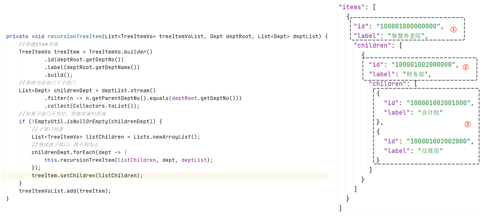

实现类中的方法：

```java
/**
     * 组织部门树形
     * @return
     */
@Override
public TreeVo deptTreeVo() {
    //获取根节点树形
    String parentDeptNo = SuperConstant.ROOT_DEPT_PARENT_ID;

    //构建查询条件
    DeptDto param = DeptDto.builder()
        .dataState(SuperConstant.DATA_STATE_0)
        .parentDeptNo(NoProcessing.processString(parentDeptNo))
        .build();
    //查询部门列表数据
    List<DeptVo> deptList =  deptMapper.selectList(param);

    if(EmptyUtil.isNullOrEmpty(deptList)){
        throw new BaseException("部门数据没有定义");
    }

    //找根节点
    DeptVo rootDept = deptList.stream().filter(d -> SuperConstant.ROOT_DEPT_PARENT_ID.equals(d.getParentDeptNo())).collect(Collectors.toList()).get(0);

    //返回的部门数据
    List<TreeItemVo> treeItemVoList = new ArrayList<>();

    //递归调用
    recursionTreeItem(treeItemVoList,rootDept,deptList);

    return TreeVo.builder().items(treeItemVoList).build();
}

/**
     * 递归调用拼装数据
     * @param treeItemVoList  封装返回的数据
     * @param rootDept  当前部门
     * @param deptList  部门列表（全部数据）
     */
private void recursionTreeItem(List<TreeItemVo> treeItemVoList, DeptVo rootDept, List<DeptVo> deptList) {
    //构建item对象
    TreeItemVo treeItemVo = TreeItemVo.builder().id(rootDept.getDeptNo()).label(rootDept.getDeptName()).build();
    //获得当前部门下的子部门
    List<DeptVo> childrenDept = deptList.stream()
        .filter(n -> n.getParentDeptNo().equals(rootDept.getDeptNo()))
        .collect(Collectors.toList());
    //如果子部门不为空，则继续递归调用
    if(!EmptyUtil.isNullOrEmpty(childrenDept)){

        ArrayList<TreeItemVo> listChildren = Lists.newArrayList();
        //子部门列表
        childrenDept.forEach(dept -> {
            this.recursionTreeItem(listChildren,dept,deptList);
        });
        treeItemVo.setChildren(listChildren);
    }

    treeItemVoList.add(treeItemVo);
}
```

4)控制层

```java
@PostMapping("/tree")
@ApiOperation("部门树形")
public ResponseResult<TreeVo> deptTreeVo(){
    TreeVo treeVo = deptService.deptTreeVo();
    return ResponseResult.success(treeVo);
}
```

5)测试

启动前端项目，然后在岗位模块中查看左侧的部门树是否成功展示

#### 3.4.4 部门添加

依据我们分析的接口，我们还是按照步骤 进行开发

1)定义接口

```java
@PutMapping
@ApiOperation(value = "部门添加",notes = "部门添加")
@ApiImplicitParam(name = "deptDto",value = "部门DTO对象",required = true,dataType = "DeptDto")
@ApiOperationSupport(includeParameters = {
    "deptDto.dataState",
    "deptDto.deptName",
    "deptDto.leaderId",
    "deptDto.remark",
    "deptDto.sortNo",
    "deptDto.parentDeptNo"})
public ResponseResult<DeptVo> createDept(@RequestBody DeptDto deptDto) {
  
    return null;
}
```

2)持久层mapper

```java
@Mapper
public interface DeptMapper {

    int insert(Dept record);
}
```

DeptMapper.xml映射文件

```xml

<insert id="insert" parameterType="com.zzyl.entity.Dept">
    <selectKey keyProperty="id" order="AFTER" resultType="java.lang.Long">
        SELECT LAST_INSERT_ID()
    </selectKey>
    insert into sys_dept
    <trim prefix="(" suffix=")" suffixOverrides=",">
        <if test="parentDeptNo != null">
            parent_dept_no,
        </if>
        <if test="deptNo != null">
            dept_no,
        </if>
        <if test="deptName != null">
            dept_name,
        </if>
        <if test="sortNo != null">
            sort_no,
        </if>
        <if test="dataState != null">
            data_state,
        </if>
        <if test="createTime != null">
            create_time,
        </if>
        <if test="updateTime != null">
            update_time,
        </if>
        <if test="createBy != null">
            create_by,
        </if>
        <if test="updateBy != null">
            update_by,
        </if>
        <if test="leaderId != null">
            leader_id,
        </if>
        <if test="remark != null">
            remark,
        </if>
    </trim>
    <trim prefix="values (" suffix=")" suffixOverrides=",">
        <if test="parentDeptNo != null">
            #{parentDeptNo,jdbcType=VARCHAR},
        </if>
        <if test="deptNo != null">
            #{deptNo,jdbcType=VARCHAR},
        </if>
        <if test="deptName != null">
            #{deptName,jdbcType=VARCHAR},
        </if>
        <if test="sortNo != null">
            #{sortNo,jdbcType=INTEGER},
        </if>
        <if test="dataState != null">
            #{dataState,jdbcType=CHAR},
        </if>
        <if test="createTime != null">
            #{createTime,jdbcType=TIMESTAMP},
        </if>
        <if test="updateTime != null">
            #{updateTime,jdbcType=TIMESTAMP},
        </if>
        <if test="createBy != null">
            #{createBy,jdbcType=BIGINT},
        </if>
        <if test="updateBy != null">
            #{updateBy,jdbcType=BIGINT},
        </if>
        <if test="leaderId != null">
            #{leaderId,jdbcType=BIGINT},
        </if>
        <if test="remark != null">
            #{remark,jdbcType=VARCHAR}
        </if>
    </trim>
</insert>
```

3)业务层

DeptService

```java
/**
 * @Description：部门表服务类
 */
public interface DeptService {

    /**
     * @Description 创建部门表
     * @param deptDto 对象信息
     * @return DeptVo
     */
    Boolean createDept(DeptDto deptDto);

}
```

实现类

```java
/**
     * 添加部门
     * @param deptDto
     */
@Override
public void createDept(DeptDto deptDto) {

    Dept dept = BeanUtil.toBean(deptDto, Dept.class);

    //根据父部门编号，构建部门编号
    String deptNo = createDeptNo(deptDto.getParentDeptNo());
    dept.setDeptNo(deptNo);

    //保存
    int flag = deptMapper.insert(dept);

    if(flag != 1){
        throw new BaseException("保存部门失败");
    }


}

/**
     * 构建部门编号
     * @param parentDeptNo
     * @return
     */
private String createDeptNo(String parentDeptNo) {

    //部门层级不能超过4级
    if(NoProcessing.processString(parentDeptNo).length() /3 == 5){
        throw new BaseException("部门创建不能超过4级");
    }

    //构建部门编号，有两种情况，当前父部门编号，有子部门：在已有的子部门的基础上累加  |  没有子部门：新增子部门编号
    DeptDto deptDto = DeptDto.builder().parentDeptNo(parentDeptNo).build();
    List<DeptVo> deptVoList = deptMapper.selectList(deptDto);
    //无下属节点则创建下属节点
    if(EmptyUtil.isNullOrEmpty(deptVoList)){
        return NoProcessing.createNo(parentDeptNo,false);
    }else {
        //有下属节点则累加下属节点
        Long deptNo = deptVoList.stream().map(dept -> {
            return Long.valueOf(dept.getDeptNo());
        }).max(Comparator.comparing(i -> i)).get();
        return NoProcessing.createNo(String.valueOf(deptNo),true);
    }
}
```

4)控制层

```java
@PutMapping
@ApiOperation(value = "部门添加",notes = "部门添加")
@ApiImplicitParam(name = "deptDto",value = "部门DTO对象",required = true,dataType = "DeptDto")
@ApiOperationSupport(includeParameters = {
    "deptDto.dataState",
    "deptDto.deptName",
    "deptDto.leaderId",
    "deptDto.remark",
    "deptDto.sortNo",
    "deptDto.parentDeptNo"})
public ResponseResult<DeptVo> createDept(@RequestBody DeptDto deptDto) {
    return ResponseResult.successdeptService.createDept(deptDto);
}
```

5)测试

权限后面的前端代码不需要大家编写，大家可以直接启动前端项目来测试功能

## 4 岗位管理

我们再来回顾一下刚才的表关系，大家还是看这个图


部门和岗位的关系是一对多

### 4.1 需求分析

我们先来看岗位中的第一个页面

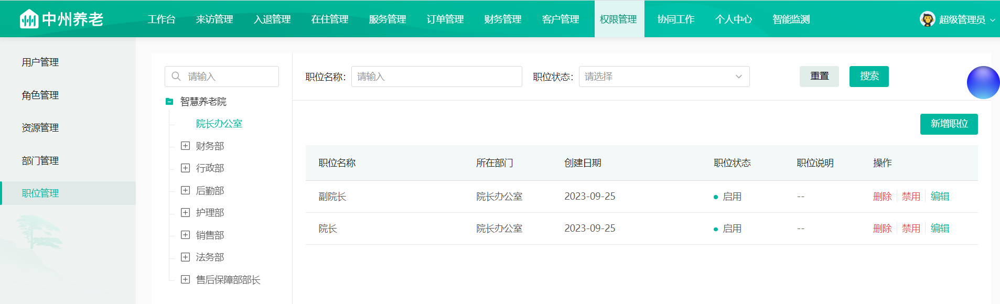

这个页面中包含了两部分内容，第一个是左侧的部门结构树，第二个是岗位列表

并且是这个页面中也包含了很多的按钮，分别是：”新增职位”、”删除”、”禁用”、”编辑”

当我们点击了"新增岗位"按钮之后，会弹窗提示，如下效果

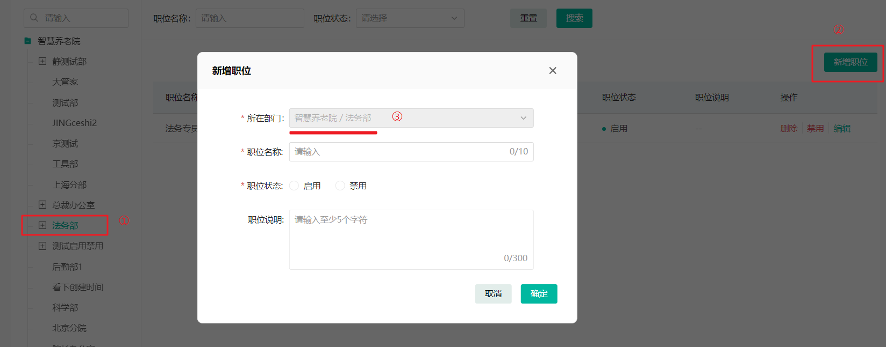

首先选中了一个部门，然后点击"新增职位"按钮，在弹窗之后，会自动回显选择的部门（置灰不可改）

### 4.2 表结构分析

表名：sys_post

字段说明：

| 字段          | 类型           | 说明                |
|-------------|--------------|-------------------|
| id          | bigint       | 岗位id              |
| dept_no     | varchar(20)  | 部门编号              |
| post_no     | varchar(20)  | 岗位编码：父部门编号+01【2位】 |
| post_name   | varchar(50)  | 岗位名称              |
| sort_no     | int          | 排序                |
| data_state  | char(1)      | 数据状态（0正常 1停用）     |
| create_time | datetime     | 创建时间              |
| update_time | datetime     | 更新时间              |
| create_by   | bigint       | 创建者               |
| update_by   | bigint       | 更新者               |
| remark      | varchar(500) | 备注                |

对应实体类：

```java
package com.zzyl.entity;

import com.zzyl.base.BaseEntity;
import lombok.Data;
import lombok.NoArgsConstructor;

@Data
@NoArgsConstructor
public class Post extends BaseEntity {

    private static final long serialVersionUID = 1L;

    /**
     * 部门编号
     */
    private String deptNo;

    /**
     * 岗位编码：父部门编号+01【2位】
     */
    private String postNo;

    /**
     * 岗位名称
     */
    private String postName;

    /**
     * 显示顺序
     */
    private Integer sortNo;

    /**
     * 数据状态（0正常 1停用）
     */
    private String dataState;

}
```

### 4.3 接口分析

依据刚才的需求分析，岗位接口如下：

- 岗位列表查询
- 岗位添加
- 岗位修改
- 岗位删除

#### 4.3.1 岗位添加

**接口地址**:`/post`

**请求方式**:`PUT`

**请求示例**:

```javascript
{
    "deptNo":"", //部门编号
    "remark":"", //备注
    "dataState":"",//是否启用(0:启用,1:禁用)
    "postName":"" //岗位名称
}
```

**响应示例**:

```javascript
{
    "code":0,
    "data":true,
    "msg":"",
    "operationTime":""
}
```

#### 4.3.2 岗位修改

其中的”编辑”、”启用”、”禁用” 三个按钮共用这个接口

**接口地址**:`/post`

**请求方式**:`PATCH`

**请求示例**:

```javascript
{
    "id":0,  //主键
    "deptNo":"", //部门编号
    "remark":"", //备注
    "dataState":"",//是否启用(0:启用,1:禁用)
    "postName":"" //岗位名称
}
```

**响应示例**:

```javascript
{
    "code":0,
    "data":true,
    "msg":"",
    "operationTime":""
}
```

#### 4.3.3 岗位分页

**接口地址**:`/post/page/{pageNum}/{pageSize}`

**请求方式**:`POST`

**请求示例**:

```javascript
{
    "deptNo":"",//部门编号
    "dataState":"",//岗位状态
    "postName":""//岗位名称
}
```

**响应示例**:

```javascript
{
    "code":200,
    "msg":"操作成功",
    "data":{
        "total":"2",
        "pageSize":10,
        "pages":"1",
        "page":1,
        "records":[
            {
                "id": "1671446178337726569",
                "createTime": "2023-07-11 10:30:25",
                "createDay": "2023-07-11",
                "createBy": "1671403256519078006",
                "dataState": "0",
                "remark": "",
                "deptNo": "100001005000000",
                "postNo": "100001005002000",
                "postName": "财务主管",
                "deptVo": {
                    "id": "1671445634122588164",
                    "createTime": "2023-06-22 11:42:36",
                    "updateTime": "2023-06-30 09:14:16",
                    "createBy": "1671362878457892866",
                    "updateBy": "1",
                    "dataState": "0",
                    "remark": "啊实打实打阿萨德阿萨德按时",
                    "parentDeptNo": "100001000000000",
                    "deptNo": "100001005000000",
                    "deptName": "财务部",
                    "sortNo": 2,
                    "leaderId": "1671403256519077890",
                    "level": 4
                }
            },
            {
                "id": "1671446178337726568",
                "createTime": "2023-07-11 10:30:14",
                "createDay": "2023-07-11",
                "createBy": "1671403256519078006",
                "dataState": "0",
                "deptNo": "100001005000000",
                "postNo": "100001005001000",
                "postName": "结算员",
                "deptVo": {
                    "id": "1671445634122588164",
                    "createTime": "2023-06-22 11:42:36",
                    "updateTime": "2023-06-30 09:14:16",
                    "createBy": "1671362878457892866",
                    "updateBy": "1",
                    "dataState": "0",
                    "remark": "啊实打实打阿萨德阿萨德按时",
                    "parentDeptNo": "100001000000000",
                    "deptNo": "100001005000000",
                    "deptName": "财务部",
                    "sortNo": 2,
                    "leaderId": "1671403256519077890",
                    "level": 4
                }
            }
        ]
    },
    "operationTime":"2023-08-27 02:53:24"
}
```

#### 4.3.4 删除岗位

**接口地址**:`/post/{postIds}`

**请求方式**:`DELETE`

**请求参数**:

| 参数名称    | 参数说明    | 请求类型 | 是否必须 | 数据类型   | schema |
|---------|---------|------|------|--------|--------|
| postIds | postIds | path | true | string |        |

**响应示例**:

```javascript
{
    "code":0,
    "data":{},
    "msg":"",
    "operationTime":""
}
```

### 4.4 功能实现

基于我们刚才分析的接口，有两部分，第一就是部门的树形结构，第二个是关于岗位的

我们在课堂上一起来实现部门的树形结构这个接口

关于岗位管理的接口，基于大家的经验来看，如果大家能够独立完成前几天和今天上午的作业代码，那么对于岗位模块的所有接口，大家也一定能够胜任，所以，关于岗位的所有的接口的开发工作全部当做今天的作业

## 5 Spring Cache

在我们查询部门数据的时候，特别是树形结构，要把所有的属性结构数据都展示出来，这个是会对数据库的访问造成一定的压力，并且从数据库查询效率也不是很高，所以我们通常都会添加缓存来提升效率

添加**缓存**的基本逻辑：

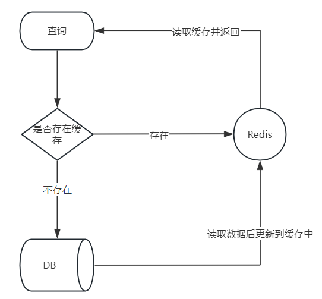

关于缓存的添加，我们可以直接使用redis来管理缓存，不过一般企业开发中，我们更多的是使用统一管理缓存的框架来实现，主要是更加的低耦合，并且切换缓存的成本的很低

### 5.1 介绍

Spring Cache 是一个框架，实现了基于注解的缓存功能，只需要简单地加一个注解，就能实现缓存功能。

Spring Cache 提供了一层抽象，底层可以切换不同的缓存实现，例如：

- EHCache
- Caffeine
- Redis(常用)

### 5.2 常用注解

在SpringCache中提供了很多缓存操作的注解，常见的是以下几个：

| **注解**         | **说明**                                                      |
|----------------|-------------------------------------------------------------|
| @EnableCaching | 开启缓存注解功能，通常加在启动类上                                           |
| @Cacheable     | 在方法执行前先查询缓存中是否有数据，如果有数据，则直接返回缓存数据；如果没有缓存数据，调用方法并将方法返回值放到缓存中 |
| @CachePut      | 将方法的返回值放到缓存中                                                |
| @CacheEvict    | 将一条或多条数据从缓存中删除                                              |
| @Caching       | 缓存的结合体，可以组合以上注解在一个方法中使用，比如有新增，有删除                           |

在spring boot项目中，使用缓存技术只需在项目中导入相关缓存技术的依赖包，并在启动类上使用@EnableCaching开启缓存支持即可。

例如，使用Redis作为缓存技术，只需要导入Spring data Redis的maven坐标即可。

### 5.3 入门案例

#### 5.3.1 环境准备

**导入基础工程:**底层已使用Redis缓存实现

基础环境的代码，在我们今天的资料中已经准备好了， 大家只需要将这个工程导入进来就可以了。导入进来的工程结构如下：

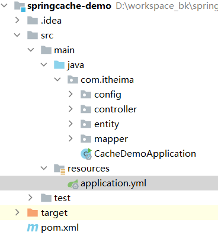

**数据库准备:**

创建名为cache_db数据库，执行以下sql脚本来创建用户表

```sql
CREATE TABLE "user" (
  "id" bigint NOT NULL AUTO_INCREMENT,
  "name" varchar(45) DEFAULT NULL,
  "age" int DEFAULT NULL,
  PRIMARY KEY ("id")
) ENGINE=InnoDB AUTO_INCREMENT=3 DEFAULT CHARSET=utf8mb4 COLLATE=utf8mb4_0900_ai_ci;
```

引导类上加`@EnableCaching`用于开启缓存

```java
package com.itheima;

import lombok.extern.slf4j.Slf4j;
import org.springframework.boot.SpringApplication;
import org.springframework.boot.autoconfigure.SpringBootApplication;
import org.springframework.cache.annotation.EnableCaching;

@Slf4j
@SpringBootApplication
@EnableCaching//开启缓存注解功能
public class CacheDemoApplication {
    public static void main(String[] args) {
        SpringApplication.run(CacheDemoApplication.class,args);
        log.info("项目启动成功...");
    }
}
```

#### 5.3.2 @CachePut注解

**@CachePut 说明：**

- 作用: 将方法返回值，放入缓存

- value: 缓存的名称, 每个缓存名称下面可以有很多key

- key: 缓存的key ----------> 支持Spring的表达式语言SPEL语法

**在save方法上加注解@CachePut**

当前UserController的save方法是用来保存用户信息的，我们希望在该用户信息保存到数据库的同时，也往缓存中缓存一份数据，我们可以在save方法上添加注解
`@CachePut`，用法如下：

```java
	/**
	* CachePut：将方法返回值放入缓存
	* value：缓存的名称，每个缓存名称下面可以有多个key
	* key：缓存的key
	*/
	@PostMapping
    @CachePut(value = "userCache", key = "#user.id")//key的生成：userCache::1
    public User save(@RequestBody User user){
        userMapper.insert(user);
        return user;
    }
```

**说明：**key的写法如下

- #user.id : #user指的是方法形参的名称, id指的是user的id属性 , 也就是使用user的id属性作为key ;

- #result.id : #result代表方法返回值，该表达式 代表以返回对象的id属性作为key ；

- #p0.id：#p0指的是方法中的第一个参数，id指的是第一个参数的id属性,也就是使用第一个参数的id属性作为key

- #a0.id：#a0指的是方法中的第一个参数，id指的是第一个参数的id属性,也就是使用第一个参数的id属性作为key

- #root.args[0].id:#root.args[0]
  指的是方法中的第一个参数，id指的是第一个参数的id属性,也就是使用第一个参数的id属性作为key ;

**启动服务,通过swagger接口文档测试，访问UserController的save()方法**

因为id是自增，所以不需要设置id属性

我们现在分别查看用户表和缓存中的数据，如果都能保存，则说明集成成功

#### 5.3.3 @Cacheable注解

作用: 在方法执行前，spring先查看缓存中是否有数据，如果有数据，则直接返回缓存数据；若没有数据，调用方法并将方法返回值放到缓存中

- value: 缓存的名称，每个缓存名称下面可以有多个key

- key: 缓存的key ----------> 支持Spring的表达式语言SPEL语法

在UserController上找到getById，添加注解`@Cacheable`

```java
	/**
	* Cacheable：在方法执行前spring先查看缓存中是否有数据，如果有数据，则直接返回缓存数据；若没有数据，	  *调用方法并将方法返回值放到缓存中
	* value：缓存的名称，每个缓存名称下面可以有多个key
	* key：缓存的key
	*/
	@GetMapping
    @Cacheable(cacheNames = "userCache",key="#id")
    public User getById(Long id){
        User user = userMapper.getById(id);
        return user;
    }
```

**重启服务,通过swagger接口文档测试，访问UserController的getById()方法**

第一次访问，会请求我们controller的方法，查询数据库。后面再查询相同的id，就直接从Redis中查询数据，不用再查询数据库了，就说明缓存生效了。

测试步骤：

- 提前在redis中手动删除掉id=${id}的用户数据
- 查看控制台sql语句：说明从数据库查询的用户数据
- 查看Redis中的缓存数据：说明已成功缓存
- 再次查询相同id的数据时，直接从redis中直接获取，不再查询数据库。

多条件使用案例

```java
@Cacheable(value = "userCache",key="#userDto.hashCode()",unless = "#result.size() == 0")
public List<User> getList(UserDto userDto){
    List<User> list = userMapper.getList("%" + userDto.getName() + "%", userDto.getAge());
    return list;
}
```

如果返回结果为空，则不缓存`unless = "#result == null"`或`unless = "#result.size() == 0"`

#### 5.3.4 @CacheEvict注解

- 作用: 清理指定缓存

- value: 缓存的名称，每个缓存名称下面可以有多个key

- key: 缓存的key ----------> 支持Spring的表达式语言SPEL语法

在 delete 方法上加注解`@CacheEvict`

```java
	@DeleteMapping
    @CacheEvict(cacheNames = "userCache",key = "#id")//删除某个key对应的缓存数据
    public void deleteById(Long id){
        userMapper.deleteById(id);
    }

	@DeleteMapping("/delAll")
    @CacheEvict(cacheNames = "userCache",allEntries = true)//删除userCache下所有的缓存数据
    public void deleteAll(){
        userMapper.deleteAll();
    }
```

重启服务,通过swagger接口文档测试，访问UserController的deleteAll()方法

查看数据库和缓存是否删除了数据

#### 5.3.5 @Caching注解

作用: 组装其他缓存注解

- cacheable 组装一个或多个@Cacheable注解
- put 组装一个或多个@CachePut注解
- evict 组装一个或多个@CacheEvict注解

我们可以修改getById方法，下面就使用@Caching组装使用了多种注解

```java
@Caching(
        cacheable = {
                @Cacheable(value = "userCache",key = "#id")
        },
        put = {
                @CachePut(value = "userCache",key = "#result.name"),
                @CachePut(value = "userCache",key = "#result.age")
        }
)
public User getById(Long id){
    User user = userMapper.getById(id);
    if(user == null){
        throw new RuntimeException("用户不存在");
    }
    return user;
}
```

当调用getById方法之后，首先到缓存中根据id查询数据，如果查询不成功还是会到数据库中找数据，同时会再往redis中set两个缓存，key分别是name和age

### 5.4 部门模块添加缓存

我们现在已经熟悉了spring cache的基本使用方式了，现在我们就可以把它集成我们项目中的部门模块

#### 5.4.1 环境集成

参考spring cache入门案例

#### 5.4.2 代码优化

我们可以把所有spring cache的注解都在deptService中去定义，最终代码如下：

```java
package com.zzyl.service.impl;

/**
 * @Description：部门表服务实现类
 */
@Service
public class DeptServiceImpl implements DeptService {

    @Autowired
    DeptMapper deptMapper;

    /**
     * @param deptDto 对象信息
     * @return DeptVo
     * @Description 创建部门表
     */
    @Transactional
    @Override
    @Caching(evict = {@CacheEvict(value = DeptCacheConstant.LIST,allEntries = true),
            @CacheEvict(value = DeptCacheConstant.TREE,allEntries = true)})
    public Boolean createDept(DeptDto deptDto) {
       
    }

    /**
     * @param deptDto 对象信息
     * @return Boolean
     * @Description 修改部门表
     */
    @Transactional
    @Caching(evict = {@CacheEvict(value = DeptCacheConstant.LIST,allEntries = true),
            @CacheEvict(value = DeptCacheConstant.TREE,allEntries = true)})
    @Override
    public Boolean updateDept(DeptDto deptDto) {
        
    }

    /**
     * @param deptDto 查询条件
     * @description 多条件查询部门表列表
     * @return: List<DeptVo>
     */
    @Cacheable(value = DeptCacheConstant.LIST,key ="#deptDto.hashCode()")
    @Override
    public List<DeptVo> findDeptList(DeptDto deptDto) {
       
    }


    @Override
    public List<DeptVo> findDeptInDeptNos(List<String> deptNos) {
        List<Dept> depts = deptMapper.findDeptInDeptNos(deptNos);
        return BeanConv.toBeanList(depts, DeptVo.class);
    }

    @Override
    public List<DeptVo> findDeptVoListInRoleId(List<Long> roleIdSet) {
        return deptMapper.findDeptVoListInRoleId(roleIdSet);
    }

    @Transactional
    @Caching(evict = {@CacheEvict(value = DeptCacheConstant.LIST,allEntries = true),
            @CacheEvict(value = DeptCacheConstant.TREE,allEntries = true)})
    @Override
    public int deleteDeptById(String deptId) {
       
    }

    /**
     * 启用-禁用部门
     *
     * @param deptDto
     * @return
     */
    @Caching(evict = {@CacheEvict(value = DeptCacheConstant.LIST,allEntries = true),
            @CacheEvict(value = DeptCacheConstant.TREE,allEntries = true)})
    @Override
    public Boolean isEnable(DeptDto deptDto) {

    }

    /**
     * 组织部门树形
     * @return: deptDto
     */
    @Override
    @Cacheable(value = DeptCacheConstant.TREE)
    public TreeVo deptTreeVo() {
        先到缓存中查询数据
            没有就到数据库中查询数据，同时缓存到redis
    }
}
```

## 6 作业

### 6.1 部门管理

需要完成的接口

- 部门修改
- 启用-禁用
- 部门删除

### 6.2 岗位管理

需要完成的接口：

- 岗位添加

- 岗位修改

- 岗位分页查询

  注意：在查询岗位的时候，需要展示岗位所在的部门名称，需关联部门表

- 岗位删除

