# 权限认证-SpringSecurity认证授权

## 1 目标

我们昨天已经对于权限控制的一些表和业务做了介绍，但是真正控制系统权限的，需要引入专门的安全框架才行，所以，我们今天重点来学习Spring家族中的一员Spring
Security安全框架。最终呢，我们会使用Spring Security框架来控制养老项目的后台管理系统

- 能够掌握Spring Security安全框架的作用
- 能够完成Spring Security安全框架的入门案例
- 能够完成Spring Security整合JWT实现前后端分离项目的认证

## 2 权限框架

### 2.1 概述

权限管理是所有后台系统的都会涉及的一个重要组成部分，主要目的是对不同的人访问资源进行权限的控制，避免因权限控制缺失或操作不当引发的风险问题，如操作错误，隐私数据泄露等问题。

那么如何在项目中实现权限呢？我们下面列举以下几个方案：

**方案一：使用权限框架 Shiro**

Shiro是apache旗下一个开源框架，它将软件系统的安全认证相关的功能抽取出来，实现用户身份
认证，权限授权、加密、会话管理等功能，组成了一个通用的安全认证框架。Shiro最大的特点是 不跟任何的框架或者容器捆绑，可以独立运行。

如果我们项目，没有使用到Spring框架，可以考虑使用Shiro。Shiro在小项目使用比较常见。

Shiro 最大的问题在于和 Spring 家族的产品进行整合时较为不便。在Spring Boot 推出的很长一段时间里，Shiro 都没有提供相应的
starter，后来虽然有一个 shiro-spring-boot-web-starter 出来，但配置并没有简化多少。所以在 Spring Boot/Spring Cloud
技术栈的微服务项目中，Shiro 几乎不存在优势。

**方案二：使用权限框架Spring Security**

Spring Security是一个功能强大且高度可定制的，主要负责为Java程序提供声明式的身份验证和访问控制的安全框架。其前身是Acegi
Security，后来被收纳为Spring的一个子项目，并更名为了Spring Security。

优点：

Spring Security基于Spring开发，所以Spring Security与Spring更契合；

Spring Security功能比Shiro更加强大，尤其是在安全防护方面；

Spring Security社区资源比Shiro更加丰富；

Spring Boot/Spring Cloud环境中，更容易集成Spring Security；

Spring Security 具备良好的扩展性，可以满足自定义的要求；

Spring Security对 OAuth2框架支持很好，而Shiro则对 OAuth2 支持不够。

**方案三：使用拦截器（过滤器）+JWT 实现地址鉴权**

**方案四：使用AOP实现方法鉴权**

我们在本课程，选择Spring Security安全框架。

### 2.2 核心概念

#### 2.2.1 认证

请求认证： 判断一个用户是否为合法用户的处理过程，最常用的简单身份认证方式是系统通过核对用户输入的用户名和口令，看其是否与系统中存储的该用户的用户名和口令一致，来判断用户身份是否正确，如下图所示：

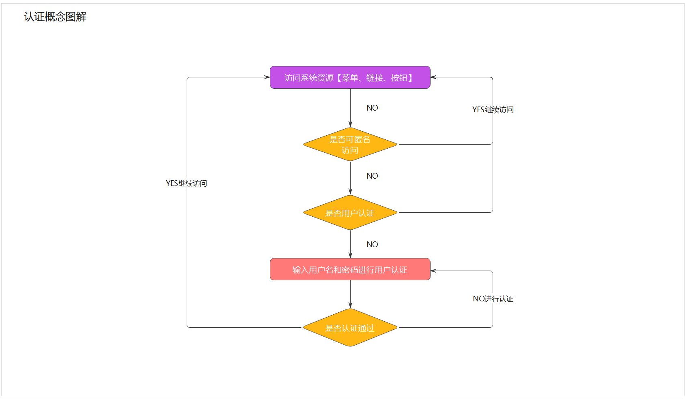

#### 2.2.2 授权

授权就是用户登录后，控制用户是否有权限访问某些资源。如下图所示：

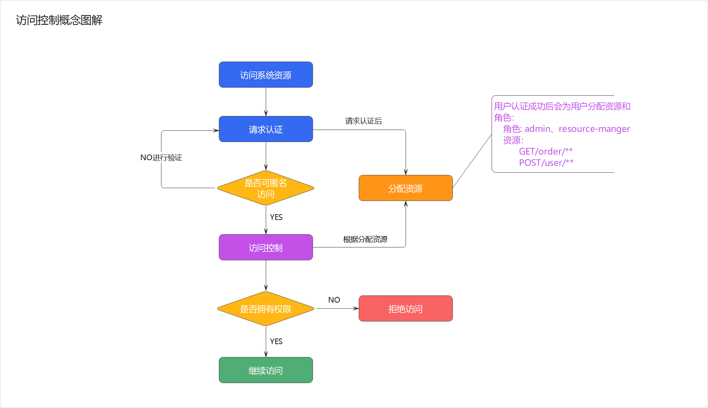

## 3 SpringSecurity

​ Spring Security 是 Spring家族中的一个安全管理框架。相比与另外一个安全框架Shiro，它提供了更丰富的功能，社区资源也比Shiro丰富。

​ 一般来说中大型的项目都是使用SpringSecurity来做安全框架。小项目有Shiro的比较多，因为相比与SpringSecurity，Shiro的上手更加的简单。

### 3.1  SpringSecurity入门

#### 3.1.1 史上最简单案例

（1）我们打开课程配套的空工程，这里只写了hello。赶快跑起来，我们可以在浏览器输入http://localhost:8080/hello 会看到浏览器输出
hello ，目前这个工程，是没有权限控制的。

（2）pom.xml 引入依赖

```xml

<dependency>
    <groupId>org.springframework.boot</groupId>
    <artifactId>spring-boot-starter-security</artifactId>
</dependency>
```

（3）浏览器输入 http://localhost:8080/hello  这时会自动跳转到一个默认登陆页面

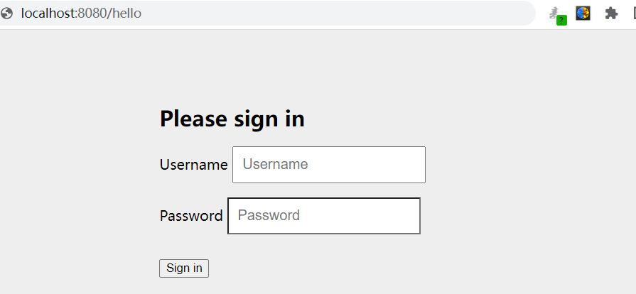

默认用户名是user,密码会输出在控制台。

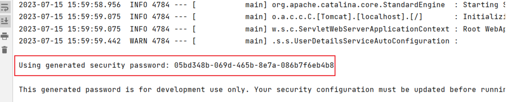

输入用户名user(默认值)和密码后，会再次跳回到hello的输入页面。

（4）在浏览器输入  http://localhost:8080/logout  退出登录。

---

我们的demo就演示完成了，是不是很神奇呀！我们只是引入了一个依赖，什么代码都没写，就实现了一套简单的权限控制了，当然实际的项目，肯定不能这么做的，我们接下来就深入学习这套框架吧。

#### 3.1.2 自定义登录页

运行完刚才的例子，你会有两个感觉，第一个是登录窗口出现的特别慢，第二个感觉是登录窗口特别简陋。实际上，更多的项目是用自己的登录页，而不是框架自带的页面！

（1）将“代码”目录中的登录页面拷贝到我们的项目中的resource 目录下的 static目录

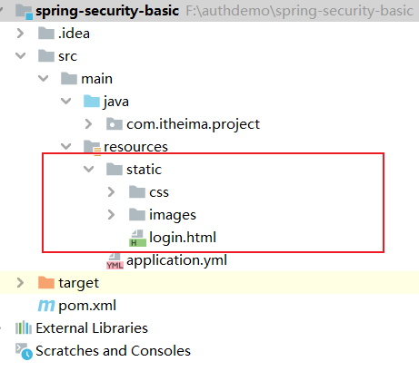

（2）创建配置类SecurityConfig，配置登录页

```java
@Configuration
public class SecurityConfig {

    @Bean
    public SecurityFilterChain securityFilterChain(HttpSecurity http) throws Exception {

        http.formLogin()             //自定义自己编写的登陆页面
                .loginPage("/login.html")    //登录页面设置
                .loginProcessingUrl("/login") //登录访问路径
                .permitAll()//登录页和登录访问路径无需登录也可以访问
                .and()
                .authorizeRequests()
                .antMatchers("/css/**","/images/**").permitAll()
                .anyRequest().authenticated()
                .and()
                .csrf().disable();    //关闭csrf防护
        return http.build();
    }

}
```

（3）再次运行项目，我们会看到登录页面，变成下面这个样子啦

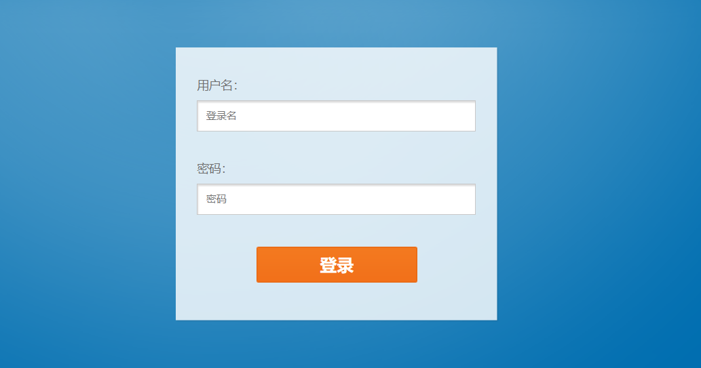

#### 3.1.3 获取当前登录用户

修改HelloController 的hello方法

```java
@RequestMapping("/hello")
public String hello(){
    //认证成功，得到认证成功之后用户信息
    Authentication authentication = SecurityContextHolder.getContext().getAuthentication();
    String userName = authentication.getName();
    return "hello  "+userName;
}
```

运行后效果如下：

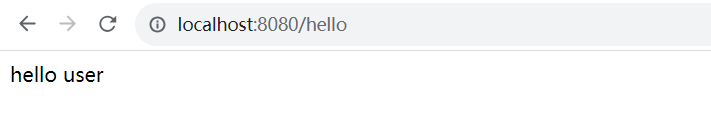

#### 3.1.4 SpringSecurity基本原理

Spring-Security其内部基础的处理方式就是通过过滤器来实现的，来我们看下刚才的例子用到的一些过滤器，如图所示：

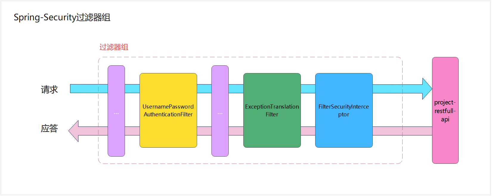

这几个过滤器都是干啥的呢？

- UsernamePasswordAuthenticationFilter:负责处理我们在登陆页面填写了用户名密码后的登陆请求。入门案例的认证工作主要有它负责。
- ExceptionTranslationFilter：处理过滤器链中抛出的任何AccessDeniedException和AuthenticationException。
- FilterSecurityInterceptor：负责权限校验的过滤器。

当然，SpringSecurity过滤器不止这些的，下面我们把他们展示出来，不需要同学们记忆，只需了解即可！

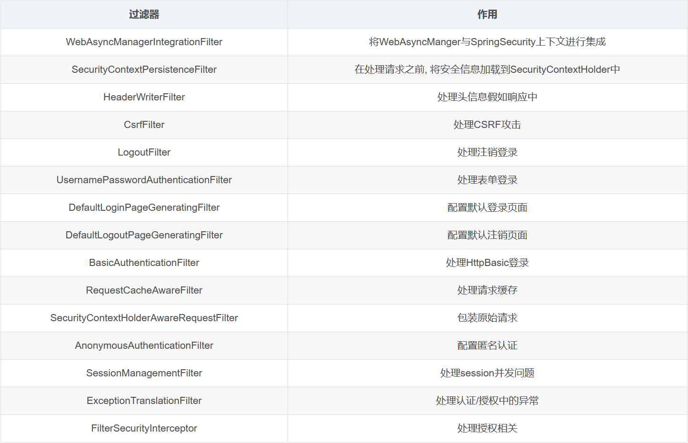

### 3.2  认证

#### 3.2.1 分析

我们在入门案例中，其实已经是一个非常简单的认证，但是用户名是写死的，密码也需要从控制台查看，很显然实际中并不能这么做。下面的学习中，我们来实现基于内存模型的认证以及用户的自定义认证，密码加密等内容。

#### 3.2.2 基于内存模型实现认证

（1）修改配置类 SecurityConfig，添加两个bean的配置

```java
    @Bean
    PasswordEncoder passwordEncoder() {
        return NoOpPasswordEncoder.getInstance();
    }

    @Bean
    public UserDetailsService users() {
        UserDetails user = User.builder()
                .username("user")
                .password("123456")
                .roles("USER")
                .build();
        UserDetails admin = User.builder()
                .username("admin")
                .password("112233")
                .roles("USER", "ADMIN")
                .build();
        return new InMemoryUserDetailsManager(user, admin);
    }
```

Spring Security 提供了一个**UserDetails**的实现类**User**，用于用户信息的实例表示。另外，**User**提供**Builder**模式的对象构建方式。

（2）再次测试，输入用户名 user 密码123456

#### 3.2.3 BCrypt密码加密

明文密码肯定不安全，所以我们需要实现一个更安全的加密方式BCrypt。

BCrypt就是一款加密工具，可以比较方便地实现数据的加密工作。也可以简单理解为它内部自己实现了随机加盐处理。例如，使用MD5加密，每次加密后的密文其实都是一样的，这样就方便了MD5通过大数据的方式进行破解。
BCrypt生成的密文长度是60，而MD5的长度是32。

我们现在随便找个类，写个main方法测试一下

```java
public static void main(String[] args) {
   String password = BCrypt.hashpw("000000", BCrypt.gensalt());
   System.out.println(password);
}
```

输出结果如下：

```
$2a$10$cRH8iMMh6XO0T.ssZ/8qVOo8ThWs/qfntIH3a7yfpbPd05h9ZGx8y
```

你运行的结果不是这样的，因为我们这里用了随机盐。

BCrypt提供了一个方法，用于验证密码是否正确。

```java
boolean checkpw = BCrypt.checkpw("000000", "$2a$10$cRH8iMMh6XO0T.ssZ/8qVOo8ThWs/qfntIH3a7yfpbPd05h9ZGx8y");
```

接下来，我们看代码如何实现

（1）修改配置类SecurityConfig 的passwordEncoder实现类为BCryptPasswordEncoder

```java
@Bean
PasswordEncoder passwordEncoder() {
    return new BCryptPasswordEncoder();
}
```

PasswordEncoder的实现类BCryptPasswordEncoder，用于BCrypt密码的解析。

（2）修改配置类SecurityConfig 的users方法中的密码，为加密后的密码

```java
@Bean
public UserDetailsService users() {
    UserDetails user = User.builder()
            .username("user")
            .password("$2a$10$2VCyByZ5oeiXCEN73wvBB.xpmJgPBbZVS/Aallmdyij2G7hmAKQTG")
            .roles("USER")
            .build();
    UserDetails admin = User.builder()
            .username("admin")
            .password("$2a$10$cRH8iMMh6XO0T.ssZ/8qVOo8ThWs/qfntIH3a7yfpbPd05h9ZGx8y")
            .roles("USER", "ADMIN")
            .build();
    return new InMemoryUserDetailsManager(user, admin);
}
```

（3）再次测试，输入用户名 user 密码123456

#### 3.2.4 基于JDBC数据库实现认证

在Spring Security框架中提供了一个UserDetailsService 接口，它的主要作用是提供用户详细信息。具体来说，当用户尝试进行身份验证时，UserDetailsService
会被调用，以获取与用户相关的详细信息。这些详细信息包括用户的用户名、密码、角色等

我们可以简单改造之前的代码，来快速熟悉一下UserDetailsService

执行流程如下：

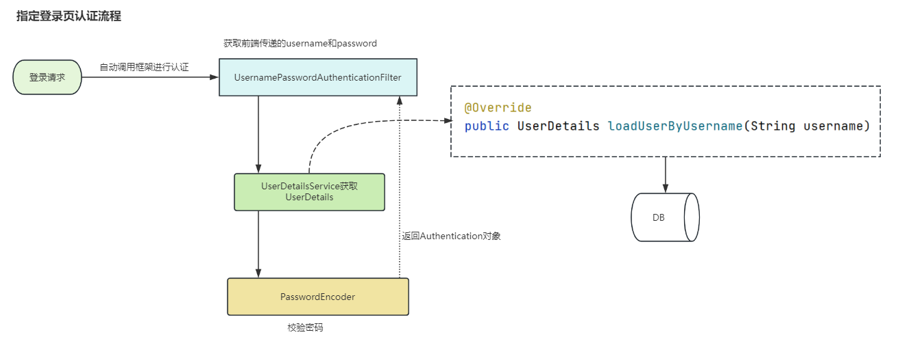

新创建一个UserDetailsServiceImpl，让它实现UserDetailsService ，代码如下

```java
@Component
public class UserDetailsServiceImpl  implements UserDetailsService {


    @Override
    public UserDetails loadUserByUsername(String username) throws UsernameNotFoundException {

        if(username.equals("user")){
            UserDetails user= User.builder()
                    .username("user")                  .password("$2a$10$8V3UHgnnI/3RCKhg5aklz.sw448DP4.x9P2hFl/fnw99QU86POlgm")
                    .roles("USER")
                    .build();
            return user;
        }
        if(username.equals("admin")){
            UserDetails admin= User.builder()
                    .username("admin")                    .password("$2a$10$pCQMCKRUi7iUXGBd14a3oetcdgD1MwgKLenxXHidq1pcfmuva1QjW")
                    .roles("ADMIN","USER")
                    .build();
            return admin;
        }
        return null;
    }
}
```

> - 当前对象需要让spring容器管理，所以在类上添加注解@Component
>- 大家注意一下loadUserByUsername方法的返回值，叫做UserDetails，这也是框架给提供了保存用户的类，并且也是一个接口，如果我们有自定义的用户信息存储，可以实现这个接口，我们后边会详细讲解

既然以上能使用这个类来查询用户信息，那么我们之前在SecurityConfig中定义的用户信息，可以注释掉了，如下：

```java
    /*
    @Bean
    public UserDetailsService users() {
        UserDetails user = User.builder()
                .username("user")
                .password("$2a$10$2VCyByZ5oeiXCEN73wvBB.xpmJgPBbZVS/Aallmdyij2G7hmAKQTG")
                .roles("USER")
                .build();
        UserDetails admin = User.builder()
                .username("admin")
                .password("$2a$10$cRH8iMMh6XO0T.ssZ/8qVOo8ThWs/qfntIH3a7yfpbPd05h9ZGx8y")
                .roles("USER", "ADMIN")
                .build();
        return new InMemoryUserDetailsManager(user, admin);
    }*/
```

我们可以重启项目，然后进行测试，发现跟之前没什么区别，一样是实现了安全校验

当然我们最终不能把用户静态的定义在代码中的，我们需要到数据库去查询用户，我们可以直接使用我们项目中的用户表，实现的步骤如下：

- 导入相关依赖（数据库、mybaits、lombok等）
- 添加配置：连接数据库、mybatis配置等（application.yml）
- 编写实体类和mapper
- 改造UserDetailsServiceImpl（用户从数据库中获取）

(1)pom 文件添加依赖

```xml

<dependency>
    <groupId>com.alibaba</groupId>
    <artifactId>druid-spring-boot-starter</artifactId>
    <version>1.2.1</version>
</dependency>
<dependency>
<groupId>org.mybatis.spring.boot</groupId>
<artifactId>mybatis-spring-boot-starter</artifactId>
<version>2.2.0</version>
</dependency>
        <!--MySQL支持-->
<dependency>
<groupId>mysql</groupId>
<artifactId>mysql-connector-java</artifactId>
<version>8.0.19</version>
</dependency>
```

(2)application.yml添加数据库相关配置

```yaml
#服务配置
server:
  #端口
  port: 8080
spring:
  application:
    name: springsecurity-demo
  #数据源配置
  datasource:
    druid:
      driver-class-name: com.mysql.jdbc.Driver
      url: jdbc:mysql://192.168.200.146:3306/security_db?useUnicode=true&characterEncoding=utf8&serverTimezone=Asia/Shanghai
      username: root
      password: heima123
# MyBatis配置
mybatis:
  #mapper配置文件
  mapper-locations: classpath*:mapper*/*Mapper.xml
  type-aliases-package: com.itheima.project.entity
  configuration:
    # 这个配置会将执行的sql打印出来，在开发或测试的时候可以用
    log-impl: org.apache.ibatis.logging.stdout.StdOutImpl
    # 驼峰下划线转换
    map-underscore-to-camel-case: true
    use-generated-keys: true
    default-statement-timeout: 60
    default-fetch-size: 100
```

(3)实体类和mapper

用户实体类

```java
package com.zzyl.security.entity;

import lombok.Data;

import java.time.LocalDateTime;

@Data
public class User {

    public Long id;

    /**
     * 用户账号
     */
    private String username;

    /**
     * open_id标识
     */
    private String openId;

    /**
     * 密码
     */
    private String password;

    /**
     * 用户类型（0:系统用户,1:客户）
     */
    private String userType;

    /**
     * 头像地址
     */
    private String avatar;

    /**
     * 用户昵称
     */
    private String nickName;

    /**
     * 用户邮箱
     */
    private String email;

    /**
     * 真实姓名
     */
    private String realName;

    /**
     * 手机号码
     */
    private String mobile;

    /**
     * 用户性别（0男 1女 2未知）
     */
    private String sex;

    /**
     * 数据状态（0正常 1停用）
     */
    private String dataState;

    /**
     * 创建时间
     */
    public LocalDateTime createTime;

    /**
     * 更新时间
     */
    public LocalDateTime updateTime;

    /**
     * 创建人
     */
    private Long createBy;

    /**
     * 更新人
     */
    private Long updateBy;

    /**
     * 备注
     */
    private String remark;

}
```

用户mapper，我们只需要定义一个根据用户名查询的方法即可

```java
package com.itheima.project.mapper;

import com.itheima.project.entity.User;
import org.apache.ibatis.annotations.Mapper;
import org.apache.ibatis.annotations.Select;

/**
 * @author sjqn
 * @date 2023/9/1
 */
@Mapper
public interface UserMapper {

    @Select("select * from sys_user where username = #{username}")
    public User findByUsername(String username);
}
```

(4)改造UserDetailsServiceImpl

```java
package com.zzyl.security.service;

import com.zzyl.security.entity.User;
import com.zzyl.security.entity.UserAuth;
import com.zzyl.security.mapper.UserMapper;
import org.springframework.beans.factory.annotation.Autowired;
import org.springframework.security.core.GrantedAuthority;
import org.springframework.security.core.authority.SimpleGrantedAuthority;
import org.springframework.security.core.userdetails.UserDetails;
import org.springframework.security.core.userdetails.UserDetailsService;
import org.springframework.security.core.userdetails.UsernameNotFoundException;
import org.springframework.stereotype.Component;

import java.util.ArrayList;
import java.util.Collection;
import java.util.List;
import java.util.SimpleTimeZone;

/**
 * @author sjqn
 * @date 2023/9/1
 */
@Component
public class UserDetailsServiceImpl implements UserDetailsService {


    @Autowired
    private UserMapper userMapper;

    @Override
    public UserDetails loadUserByUsername(String username) throws UsernameNotFoundException {

        //查询用户
        User user = userMapper.findByUsername(username);
        if(user == null){
            throw new RuntimeException("用户不存在或已被禁用");
        }
        SimpleGrantedAuthority user_role = new SimpleGrantedAuthority("user");
        SimpleGrantedAuthority admin_role = new SimpleGrantedAuthority("admin");
        List<GrantedAuthority> list = new ArrayList<GrantedAuthority>();

        list.add(user_role);
        list.add(admin_role);

        return new org.springframework.security.core.userdetails.User(user.getUsername()
                ,user.getPassword()
                , list);
    }
}
```

上述代码中，返回的UserDetails或者是User都是框架提供的类，我们在项目开发的过程中，很多需求都是我们自定义的属性，我们需要扩展该怎么办？

其实，我们可以自定义一个类，来实现UserDetails，在自己定义的类中，就可以扩展自己想要的内容，如下代码：

```java
package com.zzyl.security.entity;

import lombok.Data;
import org.springframework.security.core.GrantedAuthority;
import org.springframework.security.core.authority.SimpleGrantedAuthority;
import org.springframework.security.core.userdetails.UserDetails;

import java.util.Collection;
import java.util.List;
import java.util.stream.Collectors;

/**
 * @author sjqn
 * @date 2023/9/1
 */
@Data
public class UserAuth implements UserDetails {

    private String username; //固定不可更改
    private String password;//固定不可更改
    private String nickName;  //扩展属性  昵称
    private List<String> roles; //角色列表


    @Override
    public Collection<? extends GrantedAuthority> getAuthorities() {
        if(roles==null) return null;
        //把角色类型转换并放入对应的集合
        return roles.stream().map(role -> new SimpleGrantedAuthority("ROLE_"+role)).collect(Collectors.toList());
    }

    @Override
    public boolean isAccountNonExpired() {
        return true;
    }

    @Override
    public boolean isAccountNonLocked() {
        return true;
    }

    @Override
    public boolean isCredentialsNonExpired() {
        return true;
    }

    @Override
    public boolean isEnabled() {
        return true;
    }
}
```

然后，我们可以继续改造UserDetailsServiceImpl中检验用户的逻辑，代码如下：

```java
package com.itheima.project.service;

import com.itheima.project.entity.User;
import com.itheima.project.mapper.UserMapper;
import com.itheima.project.vo.UserAuth;
import org.springframework.beans.factory.annotation.Autowired;
import org.springframework.security.core.userdetails.UserDetails;
import org.springframework.security.core.userdetails.UserDetailsService;
import org.springframework.security.core.userdetails.UsernameNotFoundException;
import org.springframework.stereotype.Component;

import java.util.ArrayList;
import java.util.List;

/**
 * @author sjqn
 * @date 2023/10/19
 */
@Component
public class UserDetailServiceImpl implements UserDetailsService {

    @Autowired
    private UserMapper userMapper;

    @Override
    public UserDetails loadUserByUsername(String username) throws UsernameNotFoundException {
        //查询用户
        User user = userMapper.findByUsername(username);
        if(user == null){
            throw new RuntimeException("用户不存在或已被禁用");
        }
        UserAuth userAuth = new UserAuth();
        userAuth.setUsername(user.getUsername());
        userAuth.setPassword(user.getPassword());
        userAuth.setNickName(user.getNickName());

        //添加角色
        List<String> roles=new ArrayList<>();
        if("user@qq.com".equals(username)){
            roles.add("USER");
            userAuth.setRoles(roles);
        }
        if("admin@qq.com".equals(username)){
            roles.add("USER");
            roles.add("ADMIN");
            userAuth.setRoles(roles);
        }
        return userAuth;
    }
}
```

修改HelloController，使用getPrincipal()方法读取认证主体对象。

```java
/**
 * @ClassName
 * @Description
 */
@RestController
public class HelloController {

    @RequestMapping("/hello")
    public String hello(){
        //获取当前登录用户名称
        String name = SecurityContextHolder.getContext().getAuthentication().getName();
        UserAuth userAuth = (UserAuth)SecurityContextHolder.getContext().getAuthentication().getPrincipal();//取出认证主体对象

        return "hello :"+name+"  昵称："+userAuth.getNickName();
    }

}
```

### 3.3 授权

#### 3.3.1 授权

​ 授权的方式包括 web授权和方法授权，web授权是通过 url 拦截进行授权，方法授权是通过方法拦截进行授权。如果同时使用 web
授权和方法授权，则先执行web授权，再执行方法授权，最后决策都通过，则允许访问资源，否则将禁止访问。接下来，我们就主要学习web授权，方法授权是通过注解进行授权的，粒度较小，耦合度太高

#### 3.3.2 WEB授权-简单例子

我们先做个简单的例子：

（1）修改HelloController，增加两个方法 （根据hello方法复制后修改即可），主要是为了方便后边进行测试

```java
@RequestMapping("/hello/user")
public String helloUser(){
    Authentication authentication = SecurityContextHolder.getContext().getAuthentication();
    String name = authentication.getName();
    return "hello-user  "+name;
}


@RequestMapping("/hello/admin")
public String helloAdmin(){
    Authentication authentication = SecurityContextHolder.getContext().getAuthentication();
    String name = authentication.getName();
    return "hello-admin  "+name;
}
```

（2）修改 SecurityConfig 的securityFilterChain方法 ，添加对以上两个地址的角色控制

```java
@Bean
public SecurityFilterChain securityFilterChain(HttpSecurity http) throws Exception {

    http.formLogin()             //自定义自己编写的登陆页面
        .loginPage("/login.html")    //登录页面设置
        .loginProcessingUrl("/login") //登录访问路径
        .permitAll()//登录页和登录访问路径无需登录也可以访问
        .and()
        .authorizeRequests()
        .antMatchers("/css/**","/images/**").permitAll()
        .antMatchers("/hello/user").hasRole("USER")
        .antMatchers("/hello/admin").hasAnyRole("ADMIN")
        .anyRequest().authenticated()
        .and()
        .csrf().disable();    //关闭csrf防护
    return http.build();
}
```

（3）分别以user 和admin用户登录，进行测试。

#### 3.3.3 控制操作方法

上文只是将请求接口路径与配置的规则进行匹配，那匹配成功之后应该进行什么操作呢？Spring Security 内置了一些控制操作。

- permitAll() 方法，所有用户可访问。
- denyAll() 方法，所有用户不可访问。
- authenticated() 方法，登录用户可访问。
- anonymous() 方法，匿名用户可访问。
- rememberMe() 方法，通过 remember me 登录的用户可访问。
- fullyAuthenticated() 方法，非 remember me 登录的用户可访问。
- hasIpAddress(String ipaddressExpression) 方法，来自指定 IP 表达式的用户可访问。
- hasRole(String role) 方法， 拥有指定角色的用户可访问，传入的角色将被自动增加 “ROLE_” 前缀。
- hasAnyRole(String... roles) 方法，拥有指定任意角色的用户可访问。传入的角色将被自动增加 “ROLE_” 前缀。
- hasAuthority(String authority) 方法，拥有指定权限( authority )的用户可访问。
- hasAnyAuthority(String... authorities) 方法，拥有指定任意权限( authority )的用户可访问。

```java
// 如果用户具备 admin 权限，就允许访问。
.antMatchers("/hello/admin").hasAuthority("admin") 
// 如果用户具备给定权限中某一个，就允许访问。
.antMatchers("/admin/user").hasAnyAuthority("admin","user")
// 如果用户具备 user 权限，就允许访问。注意不需要手动写 ROLE_ 前缀，写了会报错
.antMatchers("/security/**").hasRole("user") 
//如果请求是指定的 IP 就允许访问。
.antMatchers("/admin/demo").hasIpAddress("192.168.200.129")
```

### 3.4  SpringSecurity整合JWT

#### 3.4.1 前后端分离的权限方案

我们前几个小节，实现的是非前后端分离情况下的认证与授权的处理，目前大部分项目，都是使用前后端分离的模式。那么前后端分离的情况下，我们如何使用SpringSecurity来解决权限问题呢？最常见的方案就是SpringSecurity+JWT 。

整体实现思路：

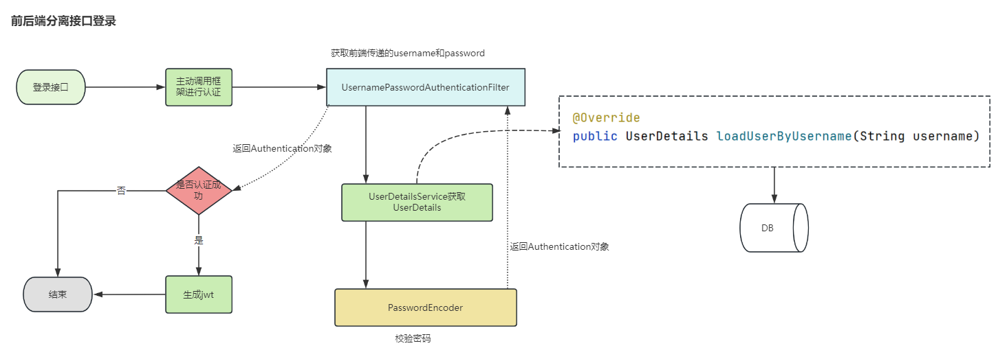

#### 3.4.2 实现登录

（1）我们新创建一个项目springsecurity-jwt，注意把上一个demo工程的代码和pom都拷贝过来

（2）pom文件引入依赖

```xml
<!--JWT-->
<dependency>
    <groupId>com.auth0</groupId>
    <artifactId>java-jwt</artifactId>
    <version>3.8.1</version>
</dependency>
<dependency>
<groupId>io.jsonwebtoken</groupId>
<artifactId>jjwt</artifactId>
<version>0.9.1</version>
</dependency>
        <!--工具包-->
<dependency>
<groupId>cn.hutool</groupId>
<artifactId>hutool-all</artifactId>
<version>5.8.0.M3</version>
</dependency>
<dependency>
<groupId>javax.xml.bind</groupId>
<artifactId>jaxb-api</artifactId>
</dependency>
<dependency>
<groupId>com.alibaba</groupId>
<artifactId>fastjson</artifactId>
<version>1.2.75</version>
</dependency>
```

（3）从zzyl-common模块中拷贝JwtUtil到当前项目中 ，用于生成和验证 JWT令牌

（4）创建LoginController

```java
package com.itheima.project.web;

import com.itheima.project.dto.LoginDto;
import com.itheima.project.util.JwtUtil;
import org.springframework.beans.factory.annotation.Autowired;
import org.springframework.security.authentication.AuthenticationManager;
import org.springframework.security.authentication.UsernamePasswordAuthenticationToken;
import org.springframework.security.core.Authentication;
import org.springframework.web.bind.annotation.PostMapping;
import org.springframework.web.bind.annotation.RequestBody;
import org.springframework.web.bind.annotation.RequestMapping;
import org.springframework.web.bind.annotation.RestController;

import java.util.HashMap;
import java.util.Map;

@RestController
@RequestMapping("security")
public class LoginController {

    @Autowired
    AuthenticationManager authenticationManager;

    @PostMapping("/login")
    public String login(@RequestBody LoginDto loginDto){

        UsernamePasswordAuthenticationToken authentication
                =new UsernamePasswordAuthenticationToken(loginDto.getUsername(),loginDto.getPassword());

        Authentication authenticate = authenticationManager.authenticate(authentication);

        if( authenticate.isAuthenticated() ){ //认证通过
            Object principal = authenticate.getPrincipal();
            Map<String, Object> claims = new HashMap<>();
            claims.put("user",principal);
            String token = JwtUtil.createJWT("itcast",360000, claims);
            return token;
        }else{
            return "";
        }
    }
}
```

（6）修改SecurityConfig

```java
package com.itheima.project.config;

import org.springframework.context.annotation.Bean;
import org.springframework.context.annotation.Configuration;
import org.springframework.security.authentication.AuthenticationManager;
import org.springframework.security.config.annotation.authentication.configuration.AuthenticationConfiguration;
import org.springframework.security.config.annotation.web.builders.HttpSecurity;
import org.springframework.security.crypto.bcrypt.BCryptPasswordEncoder;
import org.springframework.security.crypto.password.PasswordEncoder;
import org.springframework.security.web.SecurityFilterChain;

/**
 * @author sjqn
 * @date 2023/10/19
 */
@Configuration
public class SecurityConfig {

    @Bean
    public SecurityFilterChain securityFilterChain(HttpSecurity http) throws Exception {

        http.authorizeHttpRequests().antMatchers("/security/login").permitAll();
        http.csrf().disable();
        //返回
        return http.build();

    }

    @Bean
    public AuthenticationManager authenticationManager(AuthenticationConfiguration authenticationConfiguration) throws Exception {
        return authenticationConfiguration.getAuthenticationManager();
    }

    @Bean
    PasswordEncoder passwordEncoder() {
        return new BCryptPasswordEncoder();
    }
}
```

（7）使用ApiFox测试

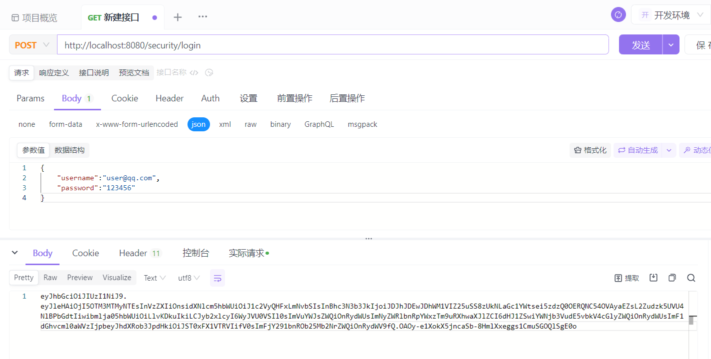

#### 3.4.3 自定义授权管理器

(1)执行流程

当用户登录以后，携带了token访问后端，那么此时Spring Security框架就要对当前请求进行验证，验证包含了两部分，第一验证携带的token是否合法，第二验证当前用户是否拥有当前访问资源的权限。

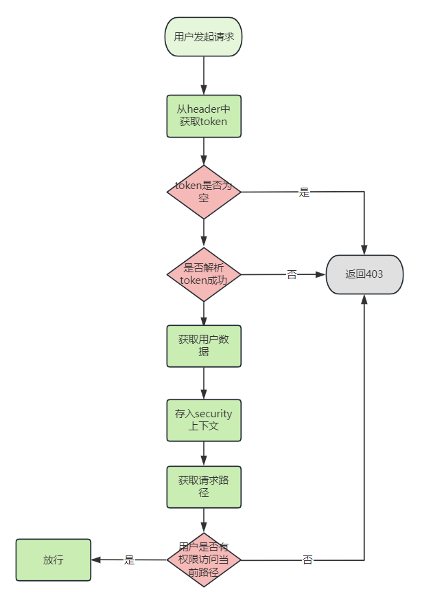

(2)自定义授权管理器TokenAuthorizationManager

```java
package com.itheima.project.config;

import cn.hutool.core.util.ObjectUtil;
import com.alibaba.fastjson.JSON;
import com.alibaba.fastjson.JSONObject;
import com.itheima.project.util.JwtUtil;
import com.itheima.project.vo.UserAuth;
import io.jsonwebtoken.Claims;
import org.springframework.security.authentication.UsernamePasswordAuthenticationToken;
import org.springframework.security.authorization.AuthorizationDecision;
import org.springframework.security.authorization.AuthorizationManager;
import org.springframework.security.core.Authentication;
import org.springframework.security.core.context.SecurityContextHolder;
import org.springframework.security.web.access.intercept.RequestAuthorizationContext;
import org.springframework.stereotype.Component;

import javax.servlet.http.HttpServletRequest;
import java.util.function.Supplier;

/**
 * @author sjqn
 * @date 2023/9/1
 */
@Component
public class TokenAuthorizationManager implements AuthorizationManager<RequestAuthorizationContext> {

    @Override
    public AuthorizationDecision check(Supplier<Authentication> authentication, RequestAuthorizationContext requestAuthorizationContext) {

        //获取request
        HttpServletRequest request = requestAuthorizationContext.getRequest();
        //获取用户当前的请求地址
        String requestURI = request.getRequestURI();
        //获取token
        String token = request.getHeader("token");
        if(null == token || "".equals(token)){
            return new AuthorizationDecision(false);
        }
        //解析token
        Claims claims = JwtUtil.parseJWT("itcast", token);
        if (ObjectUtil.isEmpty(claims)) {
            //token失效
            return new AuthorizationDecision(false);
        }
        //获取userAuth
        UserAuth userAuth = JSONObject.parseObject(JSON.toJSONString(claims.get("user")),UserAuth.class);
        //存入上下文
        UsernamePasswordAuthenticationToken auth
                =new UsernamePasswordAuthenticationToken( userAuth, userAuth.getPassword(), userAuth.getAuthorities());
        SecurityContextHolder.getContext().setAuthentication(auth);

        //判断地址与对象中的角色是否匹配
        if(userAuth.getRoles().contains("ADMIN")){
            if("/hello/admin".equals(requestURI)){
                return new AuthorizationDecision(true);
            }
        }
        if(userAuth.getRoles().contains("USER")){
            if("/hello/user".equals(requestURI)){
                return new AuthorizationDecision(true);
            }
        }
        return new AuthorizationDecision(false);
    }
}
```

（2）修改SecurityConfig，注册授权管理器

并同时关闭session和缓存，前后端分离项目不需要使用session和缓存

```java
package com.itheima.project.config;

import org.springframework.beans.factory.annotation.Autowired;
import org.springframework.context.annotation.Bean;
import org.springframework.context.annotation.Configuration;
import org.springframework.security.authentication.AuthenticationManager;
import org.springframework.security.config.annotation.authentication.configuration.AuthenticationConfiguration;
import org.springframework.security.config.annotation.web.builders.HttpSecurity;
import org.springframework.security.config.http.SessionCreationPolicy;
import org.springframework.security.crypto.bcrypt.BCryptPasswordEncoder;
import org.springframework.security.crypto.password.PasswordEncoder;
import org.springframework.security.web.SecurityFilterChain;

/**
 * @author sjqn
 * @date 2023/10/19
 */
@Configuration
public class SecurityConfig {

    @Autowired
    private TokenAuthorizationManager tokenAuthorizationManager;

    @Bean
    public SecurityFilterChain securityFilterChain(HttpSecurity http) throws Exception {

        http.authorizeHttpRequests().antMatchers("/security/login").permitAll()
                .anyRequest().access(tokenAuthorizationManager);
        
        //关闭session
        http.sessionManagement().sessionCreationPolicy(SessionCreationPolicy.STATELESS);
        //关闭缓存
        http.headers().cacheControl().disable();
        
        http.csrf().disable();
        //返回
        return http.build();

    }

    @Bean
    public AuthenticationManager authenticationManager(AuthenticationConfiguration authenticationConfiguration) throws Exception {
        return authenticationConfiguration.getAuthenticationManager();
    }

    @Bean
    PasswordEncoder passwordEncoder() {
        return new BCryptPasswordEncoder();
    }
}
```

> 测试一：
>
> 登录账号：user@qq.com 拥有角色：USER
>
> 可以访问：/hello/user
>
> 其他请求返回403
>
> 测试二：
>
> 登录账号：admin@qq.com 拥有角色：USER、ADMIN
>
> 可以访问：/hello/user、/hello/user


附单词表：

| 单词             | 音标                | 解释                            |
|----------------|-------------------|-------------------------------|
| Security       | `səˈkjʊrəti`      | 安全                            |
| Authentication | `ɔːˌθentɪˈkeɪʃən` | 身份认证，衍生词：Authenticated（被认证过的） |
| Authorization  | `ˌɔːθəraɪˈzeɪʃən` | 访问授权，衍生词：Authorize、Authority  |
| Permit         | `ˈpɜːmɪt`         | 许可证                           |
| Matchers       | `ˈmætʃərz`        | 匹配器                           |
| Granted        | `ɡræntɪd`         | 授予特定的权限                       |
| Principal      | `ˈprɪnsəpl`       | 被认证和授权访问资源或系统的实体或用户           |
