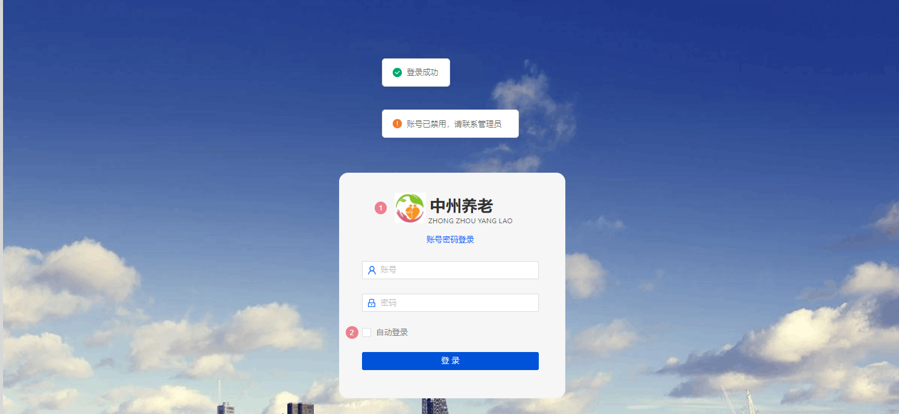

# 项目认证授权、数据权限

## 1 目标

在前两天关于权限的讲解中，我们现在已经熟悉了RBAC认证授权模型，并且对安全框架Spring Security有了一定的认识，那么接下来呢，我们就把Spring
Security框架集成中州养老项目中。

我们今天的目标是：

- 能够掌握使用Spring Security框架完成项目认证的功能
- 能够掌握使用Spring Security框架完成项目授权的功能

- 能够理解数据权限的执行逻辑

## 2 SpringSecurity完成养老项目认证和授权

### 2.1 需求分析

我们先来看原型图



大家可以自行打开原型查阅需求说明。

不过这里面有一个额外的需求，我们单独说一下

- 当前用户在同一时刻只能登录一个用户
- 如果在不同的客户端登录两次以上，那么是最近的一次token生效，其他客户端返回403

这里面包含了两个接口，一个是登录，另外一个是退出（在登录成功之后，页面的左下角可以看到）

### 2.2 接口分析

#### 登录接口

**接口地址**:`/security/login`

**请求方式**:`POST`

**请求示例**:

```javascript
{
    "username"
:
    "",
        "password"
:
    ""
}
```

**响应示例**:

```javascript
{
    "code"
:
    200,
        "msg"
:
    "操作成功",
        "data"
:
    {
        "id"
    :
        "1671403256519078138",
            "createTime"
    :
        "2023-06-19 23:11:17",
            "updateTime"
    :
        "2023-07-12 16:26:01",
            "createBy"
    :
        "1668522280851951617",
            "updateBy"
    :
        "1671403256519078079",
            "remark"
    :
        "",
            "username"
    :
        "admin@qq.com",
            "password"
    :
        "",
            "userType"
    :
        "0",
            "nickName"
    :
        "超级管理员",
            "email"
    :
        "admin@qq.com",
            "realName"
    :
        "超级管理员",
            "mobile"
    :
        "15156409998",
            "sex"
    :
        "0",
            "roleLabels"
    :
        [
            "admin"
        ],
            "resourceRequestPaths"
    :
        [
            "PUT/alert-rule/**",
            "PATCH /role",
            "DELETE/nursingLevel/delete/**",
            "DELETE/iot/DeleteDevice",
            "DELETE/alert-rule/delete/**",
            "PUT/dept",
            "PATCH/resource",
            "POST/roomTypes",
        ],
            "deptNo"
    :
        "100001000000000",
            "postNo"
    :
        "100001001000000",
            "userToken"
    :
        "ccb6882c-d2b4-4211-bd3d-fb33cd98c90d"
    }
}
```

### 2.3 功能实现

基于我们刚才分析的需求和接口，我们下面来实现登录和退出这两个功能

#### 2.3.1 登录功能

(1)思路分析

基于刚才我们分析的需求和接口的数据返回，我们先来分析下实现的思路，如下图


(2)环境集成

在zzyl-framework中导入spring security的依赖(已集成)

```xml

<dependency>
    <groupId>org.springframework.boot</groupId>
    <artifactId>spring-boot-starter-security</artifactId>
</dependency>
```

(3)定义接口

在zzyl-security中新增LoginController类来定义login方法，代码如下：

```java
/**
 * @ClassName LoginController.java
 * @Description 登录接口
 */
@RestController
@Api(tags = "用户登录")
@RequestMapping("security")
public class LoginController {


    @PostMapping("login")
    @ApiOperation(value = "用户登录",notes = "用户登录")
    public ResponseResult<UserVo> login(@RequestBody LoginDto loginDto){
        return null;
    }
}
```

LoginDto

```java
@Data
public class LoginDto {

    private String username;
    private String password;
}
```

(4)定义UserDetailService实现类

根据流程图我们知道，登录需要使用Spring Security框架提供的AuthenticationManager认证管理器来实现

首选我们需要自定义一个类来实现UserDetailsService，代码如下：

```java
package com.zzyl.service.impl;

import com.zzyl.service.UserService;
import com.zzyl.vo.UserAuth;
import com.zzyl.vo.UserVo;
import org.springframework.beans.factory.annotation.Autowired;
import org.springframework.security.core.userdetails.UserDetails;
import org.springframework.security.core.userdetails.UserDetailsService;
import org.springframework.security.core.userdetails.UsernameNotFoundException;
import org.springframework.stereotype.Component;

/**
 *  用户明细信息服务
 */
@Component
public class UserDetailsServiceImpl implements UserDetailsService {

    @Autowired
    UserService userService;

    @Override
    public UserDetails loadUserByUsername(String username) throws UsernameNotFoundException {
        //这里我们默认使用账号密码登录,对于多种登录方式如何处理-->字符串分割
        UserVo userVo = userService.findUserVoForLogin(username);
        return new UserAuth(userVo);
    }
}
```

- 目前userVo中封装了部分数据（用户表中相关的数据）

- 其中的UserAuth需要实现UserDetails，如下：

```java
package com.zzyl.vo;
import com.zzyl.utils.EmptyUtil;
import lombok.Data;
import lombok.NoArgsConstructor;
import org.springframework.security.core.GrantedAuthority;
import org.springframework.security.core.authority.SimpleGrantedAuthority;
import org.springframework.security.core.userdetails.UserDetails;

import java.time.LocalDateTime;
import java.util.ArrayList;
import java.util.Collection;

/**
 *  自定认证用户
 */
@Data
@NoArgsConstructor
public class UserAuth implements UserDetails {

    private String id;

    /**
     * 用户账号
     */
    private String username;

    /**
     * 密码
     */
    private String password;

    /**
     * 权限内置
     */
    private Collection<SimpleGrantedAuthority> authorities;

    /**
     * 用户类型（00系统用户）
     */
    private String userType;

    /**
     * 用户昵称
     */
    private String nickName;

    /**
     * 用户邮箱
     */
    private String email;

    /**
     * 真实姓名
     */
    private String realName;

    /**
     * 手机号码
     */
    private String mobile;

    /**
     * 用户性别（0男 1女 2未知）
     */
    private String sex;

    /**
     * 创建者
     */
    private Long createBy;

    /**
     * 创建时间
     */
    private LocalDateTime createTime;

    /**
     * 更新者
     */
    private Long updateBy;

    /**
     * 更新时间
     */
    private LocalDateTime updateTime;

    /**
     * 备注
     */
    private String remark;

    /**
     * 部门编号【当前】
     */
    private String deptNo;

    /**
     * 职位编号【当前】
     */
    private String postNo;

    public UserAuth(UserVo userVo) {
        this.setId(userVo.getId().toString());
        this.setUsername(userVo.getUsername());
        this.setPassword(userVo.getPassword());
        if (!EmptyUtil.isNullOrEmpty(userVo.getResourceRequestPaths())) {
            authorities = new ArrayList<>();
            userVo.getResourceRequestPaths().forEach(resourceRequestPath -> authorities.add(new SimpleGrantedAuthority(resourceRequestPath)));
        }
        this.setUserType(userVo.getUserType());
        this.setNickName(userVo.getNickName());
        this.setEmail(userVo.getEmail());
        this.setRealName(userVo.getRealName());
        this.setMobile(userVo.getMobile());
        this.setSex(userVo.getSex());
        this.setCreateTime(userVo.getCreateTime());
        this.setCreateBy(userVo.getCreateBy());
        this.setUpdateTime(userVo.getUpdateTime());
        this.setUpdateBy(userVo.getUpdateBy());
        this.setRemark(userVo.getRemark());
        this.setDeptNo(userVo.getDeptNo());
        this.setPostNo(userVo.getPostNo());
    }

    @Override
    public Collection<? extends GrantedAuthority> getAuthorities() {
        return this.authorities;
    }

    @Override
    public String getPassword() {
        return this.password;
    }

    @Override
    public String getUsername() {
        return this.username;
    }

    @Override
    public boolean isAccountNonExpired() {
        return true;
    }

    @Override
    public boolean isAccountNonLocked() {
        return true;
    }

    @Override
    public boolean isCredentialsNonExpired() {
        return true;
    }

    @Override
    public boolean isEnabled() {
        return true;
    }
}
```

(5)业务层

新建关于登录的业务层接口

```java
package com.zzyl.service;

import com.zzyl.vo.UserVo;

/**
 *  登录接口
 */
public interface LoginService {

    /***
     *  用户退出
     * @param userVo 登录信息
     * @return
     */
    UserVo login(LoginDto loginDto);
}
```

实现类：

```java
package com.zzyl.service.impl;

import cn.hutool.core.bean.BeanUtil;
import cn.hutool.json.JSONUtil;
import com.zzyl.constant.UserCacheConstant;
import com.zzyl.dto.LoginDto;
import com.zzyl.exception.BaseException;
import com.zzyl.properties.JwtTokenManagerProperties;
import com.zzyl.service.LoginService;
import com.zzyl.service.ResourceService;
import com.zzyl.service.RoleService;
import com.zzyl.utils.JwtUtil;
import com.zzyl.vo.ResourceVo;
import com.zzyl.vo.RoleVo;
import com.zzyl.vo.UserAuth;
import com.zzyl.vo.UserVo;
import org.aspectj.weaver.ast.Var;
import org.springframework.beans.factory.annotation.Autowired;
import org.springframework.data.redis.core.StringRedisTemplate;
import org.springframework.security.authentication.AuthenticationManager;
import org.springframework.security.authentication.UsernamePasswordAuthenticationToken;
import org.springframework.security.core.Authentication;
import org.springframework.stereotype.Service;

import java.util.*;
import java.util.concurrent.TimeUnit;
import java.util.stream.Collectors;

/**
 * @author sjqn
 */
@Service
public class LoginServiceImpl implements LoginService {

    @Autowired
    private AuthenticationManager authenticationManager;

    @Autowired
    private RoleService roleService;

    @Autowired
    private ResourceService resourceServicee;

    @Autowired
    private JwtTokenManagerProperties jwtTokenManagerProperties;

    @Autowired
    private StringRedisTemplate redisTemplate;


    /**
     * 用户登录
     * @param loginDto
     * @return
     */
    @Override
    public UserVo login(LoginDto loginDto) {

        //认证管理器--认证用户（需准备UserDetailsService来查询用户）
        UsernamePasswordAuthenticationToken upat =
                new UsernamePasswordAuthenticationToken(loginDto.getUsername(),loginDto.getPassword());
        Authentication authenticate = authenticationManager.authenticate(upat);
        //是否验证成功
        if(!authenticate.isAuthenticated()){
            throw new BaseException("登录失败");
        }

        //获取用户信息
        UserAuth userAuth = (UserAuth) authenticate.getPrincipal();
        //对象拷贝
        UserVo userVo = BeanUtil.toBean(userAuth, UserVo.class);

        //获取角色列表
        List<RoleVo> roleVoList = roleService.findRoleVoListByUserId(userVo.getId());
        Set<String> roleLabelSet = roleVoList.stream().map(RoleVo::getLabel).collect(Collectors.toSet());
        userVo.setRoleLabels(roleLabelSet);

        //获取资源列表（请求的路径，只有类型为r才是真正的请求按钮，也就是访问路径）
        List<ResourceVo> resourceVoList = resourceServicee.findResourceVoListByUserId(userVo.getId());
        Set<String> resourcePathsSet = resourceVoList.stream()
                .filter(x->"r".equals(x.getResourceType()))
                .map(ResourceVo::getRequestPath)
                .collect(Collectors.toSet());
        userVo.setResourceRequestPaths(resourcePathsSet);
        //密码设置为空
        userVo.setPassword("");
        
        //存储redis  username:uuid
        String uuidToken = UUID.randomUUID().toString();
        userVo.setUserToken(uuidToken);

        Map<String,Object> clamis = new HashMap<>();
        String userVoString = JSONUtil.toJsonStr(userVo);
        clamis.put("currentUser",userVoString);

        //生成token
        String jwtToken = JwtUtil.createJWT(jwtTokenManagerProperties.getBase64EncodedSecretKey(), jwtTokenManagerProperties.getTtl(), clamis);

        String userTokenKey = UserCacheConstant.USER_TOKEN+userVo.getUsername();

        long ttl = Long.valueOf(jwtTokenManagerProperties.getTtl() / 1000);

        //存储redis   username:uuid
        redisTemplate.opsForValue().set(userTokenKey, uuidToken,ttl, TimeUnit.SECONDS);

        String jwtTokenKey = UserCacheConstant.JWT_TOKEN + uuidToken;
        //存储redis  uuid:jwttoken    方便后登录的用户替换旧登录的用户
        redisTemplate.opsForValue().set(jwtTokenKey,jwtToken,ttl,TimeUnit.SECONDS);

        //返回vo
        return userVo;
    }
}
```

(6)控制层

补全控制层代码，如下：

```java
package com.zzyl.controller;

import com.github.xiaoymin.knife4j.annotations.ApiOperationSupport;
import com.zzyl.base.ResponseResult;
import com.zzyl.service.LoginService;
import com.zzyl.vo.UserVo;
import io.swagger.annotations.Api;
import io.swagger.annotations.ApiImplicitParam;
import io.swagger.annotations.ApiOperation;
import org.springframework.beans.factory.annotation.Autowired;
import org.springframework.web.bind.annotation.PostMapping;
import org.springframework.web.bind.annotation.RequestBody;
import org.springframework.web.bind.annotation.RequestMapping;
import org.springframework.web.bind.annotation.RestController;

/**
 *  登录接口
 */
@RestController
@Api(tags = "用户登录")
@RequestMapping("security")
public class LoginController {

    @Autowired
    LoginService loginService;

    @PostMapping("/login")
    @ApiOperation("用户登录")
    public ResponseResult<UserVo> login(@RequestBody LoginDto loginDto){
        UserVo userVo = loginService.login(loginDto);
        return ResponseResult.success(userVo);
    }
}
```

（6）SecurityConfig配置请求地址

```java
package com.zzyl.config;

import com.zzyl.properties.SecurityConfigProperties;
import com.zzyl.security.JwtAuthorizationManager;
import org.springframework.beans.factory.annotation.Autowired;
import org.springframework.boot.context.properties.EnableConfigurationProperties;
import org.springframework.context.annotation.Bean;
import org.springframework.context.annotation.Configuration;
import org.springframework.security.authentication.AuthenticationManager;
import org.springframework.security.config.annotation.authentication.configuration.AuthenticationConfiguration;
import org.springframework.security.config.annotation.web.builders.HttpSecurity;
import org.springframework.security.config.http.SessionCreationPolicy;
import org.springframework.security.crypto.bcrypt.BCryptPasswordEncoder;
import org.springframework.security.web.SecurityFilterChain;

import java.util.List;

/**
 *  权限核心配置类
 */
@Configuration
@EnableConfigurationProperties(SecurityConfigProperties.class)
public class SecurityConfig  {

    @Autowired
    JwtAuthorizationManager jwtAuthorizationManager;

    @Bean
    public SecurityFilterChain securityFilterChain(HttpSecurity http) throws Exception {

        //忽略地址
        http.authorizeHttpRequests()
                .antMatchers( "/security/login" )
                .permitAll();

        http.csrf().disable();
        http.sessionManagement().sessionCreationPolicy(SessionCreationPolicy.STATELESS );//关闭session
        http.headers().cacheControl().disable();//关闭缓存

        return http.build();
    }

    @Bean
    public AuthenticationManager authenticationManager(AuthenticationConfiguration authenticationConfiguration) throws Exception {
        return  authenticationConfiguration.getAuthenticationManager();
    }

    /**
     * BCrypt密码编码
     * @return
     */
    @Bean
    public BCryptPasswordEncoder bcryptPasswordEncoder() {
        return new BCryptPasswordEncoder();
    }

}
```

(7)控制层

可以使用前端工程登录，或者ApiFox工具进行测试

#### 2.3.2 用户数据存入线程中

(1)思路分析

- 当用户登录成功以后，会下发一个token给前端
- 以后用户每次请求都会携带这个token来进行验证
- **当用户请求其他业务需要当前用户信息的时候，可以直接获取当前登录人信息**，比如：创建数据需要知道创建人

所以我们可以使用ThreadLocal来进行存储当前请求（线程）的用户数据，它有两个特点：

- 线程之间的隔离
- 同一个线程数据共享

所以我们整体的思路是：


(2)功能实现

在zzyl-framework模块下新增拦截器：UserTokenIntercept

```java
package com.zzyl.intercept;

import com.zzyl.constant.SecurityConstant;
import com.zzyl.constant.UserCacheConstant;
import com.zzyl.properties.JwtTokenManagerProperties;
import com.zzyl.utils.EmptyUtil;
import com.zzyl.utils.JwtUtil;
import com.zzyl.utils.UserThreadLocal;
import org.springframework.beans.factory.annotation.Autowired;
import org.springframework.data.redis.core.StringRedisTemplate;
import org.springframework.security.access.AccessDeniedException;
import org.springframework.stereotype.Component;
import org.springframework.web.method.HandlerMethod;
import org.springframework.web.servlet.HandlerInterceptor;

import javax.servlet.http.HttpServletRequest;
import javax.servlet.http.HttpServletResponse;

/**
 *  多租户放到SubjectContent上下文中
 */
@Component
public class UserTokenIntercept implements HandlerInterceptor {

    @Autowired
    private StringRedisTemplate redisTemplate;

    @Autowired
    private JwtTokenManagerProperties jwtTokenManagerProperties;

    @Override
    public boolean preHandle(HttpServletRequest request, HttpServletResponse response, Object handler) throws Exception {

        if (!(handler instanceof HandlerMethod)) {
            return true;
        }
        //从头部中拿到当前userToken
        String userToken = request.getHeader(SecurityConstant.USER_TOKEN);
        if (!EmptyUtil.isNullOrEmpty(userToken)) {
            String jwtTokenKey = UserCacheConstant.JWT_TOKEN + userToken;
            String jwtToken = redisTemplate.opsForValue().get(jwtTokenKey);
            if (!EmptyUtil.isNullOrEmpty(jwtToken)) {
                Object userObj = JwtUtil.parseJWT(jwtTokenManagerProperties.getBase64EncodedSecretKey(), jwtToken).get("currentUser");
                String currentUser = String.valueOf(userObj);
                //放入当前线程中：用户当前的web直接获得user使用
                UserThreadLocal.setSubject(currentUser);
            }
        }
        return true;
    }

    @Override
    public void afterCompletion(HttpServletRequest request, HttpServletResponse response, Object handler, Exception ex) throws Exception {
        //移除当前线程中的参数
        UserThreadLocal.removeSubject();
    }
}
```

想要生效这个拦截器，则需要在WebMvcConfig中配置，代码如下：

```java
package com.zzyl.config;

/**
 * @ClassName WebMvcConfig.java
 * @Description webMvc高级配置
 */
@Configuration
@ComponentScan("springfox.documentation.swagger.web")
public class WebMvcConfig implements WebMvcConfigurer {

   @Autowired
   UserTokenIntercept userTokenIntercept;

    @Autowired
   UserInterceptor userInterceptor;

    //拦截的时候过滤掉swagger相关路径和登录相关接口
    private static final String[] EXCLUDE_PATH_PATTERNS = new String[]{"/swagger-ui.html",
            "/webjars/**",
            "/swagger-resources",
            "/v2/api-docs",
            // 登录接口
            "/customer/user/login",
            // 房型列表接口
            "/customer/roomTypes",
            "/customer/orders/project/**",
            "/user/refresh/**"};

    /**
     * @Description 拦截器
     */
    @Override
    public void addInterceptors(InterceptorRegistry registry) {
        //userToken拦截
        registry.addInterceptor(userTokenIntercept).excludePathPatterns(ADMIN_EXCLUDE_PATH_PATTERNS);
        // 小程序端接口鉴权拦截器
        registry.addInterceptor(userInterceptor).excludePathPatterns(EXCLUDE_PATH_PATTERNS).addPathPatterns("/customer/**");
    }

    //拦截的时候过滤掉swagger相关路径和登录相关接口
    private static final String[] ADMIN_EXCLUDE_PATH_PATTERNS = new String[]{"/swagger-ui.html",
            "/webjars/**",
            "/swagger-resources",
            "/v2/api-docs",
            "/customer/**",
            "/security/**",
            "/common/**",
            "/user/refresh/**"};

}
```

#### 2.3.3 验证登录-自定义授权管理器

基于我们刚才分析的逻辑，需要自定义授权管理器实现

在zzyl-framework模块下新增JwtAuthorizationManager，代码如下：

```java
package com.zzyl.security;

import cn.hutool.core.util.ObjectUtil;
import com.alibaba.fastjson.JSON;
import com.alibaba.fastjson.JSONObject;
import com.zzyl.constant.SecurityConstant;
import com.zzyl.constant.UserCacheConstant;
import com.zzyl.properties.JwtTokenManagerProperties;
import com.zzyl.utils.EmptyUtil;
import com.zzyl.utils.JwtUtil;
import com.zzyl.utils.UserThreadLocal;
import com.zzyl.vo.UserVo;
import io.jsonwebtoken.Claims;
import lombok.extern.slf4j.Slf4j;
import org.springframework.beans.factory.annotation.Autowired;
import org.springframework.data.redis.core.StringRedisTemplate;
import org.springframework.security.authorization.AuthorizationDecision;
import org.springframework.security.authorization.AuthorizationManager;
import org.springframework.security.core.Authentication;
import org.springframework.security.web.access.intercept.RequestAuthorizationContext;
import org.springframework.stereotype.Component;
import org.springframework.util.AntPathMatcher;

import java.util.HashMap;
import java.util.Map;
import java.util.concurrent.TimeUnit;
import java.util.function.Supplier;

/**
 *  授权管理器
 */
@Slf4j
@Component
public class JwtAuthorizationManager implements AuthorizationManager<RequestAuthorizationContext> {

    private AntPathMatcher antPathMatcher = new AntPathMatcher();

    @Autowired
    private StringRedisTemplate redisTemplate;

    @Autowired
    private JwtTokenManagerProperties jwtTokenManagerProperties;


    @Override
    public AuthorizationDecision check(Supplier<Authentication> authentication,
                                       RequestAuthorizationContext requestAuthorizationContext) {
        //用户当前请求路径
        String method = requestAuthorizationContext.getRequest().getMethod();
        String requestURI = requestAuthorizationContext.getRequest().getRequestURI();
        String targetUrl = (method+requestURI);

        //获得请求中的认证后传递过来的userToken
        String userToken = requestAuthorizationContext.getRequest().getHeader(SecurityConstant.USER_TOKEN);

        //如果userToken为空,则当前请求不合法
        if (EmptyUtil.isNullOrEmpty(userToken)){
            return new AuthorizationDecision(false);
        }

        //通过userToken获取jwtToken
        String jwtTokenKey = UserCacheConstant.JWT_TOKEN+userToken;
        //key:uuid
        String jwtToken = redisTemplate.opsForValue().get(jwtTokenKey);

        //如果jwtToken为空,则当前请求不合法
        if (EmptyUtil.isNullOrEmpty(jwtToken)){
            return new AuthorizationDecision(false);
        }

        //校验jwtToken是否合法
        Claims cla = JwtUtil.parseJWT(jwtTokenManagerProperties.getBase64EncodedSecretKey(), jwtToken);
        if (ObjectUtil.isEmpty(cla)) {
            //token失效
            return new AuthorizationDecision(false);
        }

        //如果校验jwtToken通过，则获得userVo对象
        UserVo userVo = JSONObject.parseObject(String.valueOf(cla.get("currentUser")),UserVo.class);

        //用户剔除校验:redis中最新的userToken与前端传入的userToken不符合，则认为当前用户被后续用户剔除
        //key:username  value：uuid
        String currentUserToken = redisTemplate.opsForValue().get(UserCacheConstant.USER_TOKEN + userVo.getUsername());
        if (!userToken.equals(currentUserToken)){
            return new AuthorizationDecision(false);
        }

        //如果当前UserToken存活时间少于10分钟，则进行续期
        Long remainTimeToLive = redisTemplate.opsForValue().getOperations().getExpire(jwtTokenKey);
        if (remainTimeToLive.longValue()<= 600){
            //jwt生成的token也会过期，所以需要重新生成jwttoken
            Map<String, Object> claims = new HashMap<>();
            String userVoJsonString = String.valueOf(cla.get("currentUser"));
            claims.put("currentUser", userVoJsonString);

            //jwtToken令牌颁布
            String newJwtToken = JwtUtil.createJWT(jwtTokenManagerProperties.getBase64EncodedSecretKey(), jwtTokenManagerProperties.getTtl(), claims);
            long ttl = Long.valueOf(jwtTokenManagerProperties.getTtl()) / 1000;

            redisTemplate.opsForValue().set(jwtTokenKey, newJwtToken, ttl, TimeUnit.SECONDS);
            redisTemplate.expire(UserCacheConstant.USER_TOKEN + userVo.getUsername(), ttl, TimeUnit.SECONDS);
        }

        //当前用户资源是否包含当前URL
        /*for (String resourceRequestPath : userVo.getResourceRequestPaths()) {
            boolean isMatch = antPathMatcher.match(resourceRequestPath, targetUrl);
            if (isMatch){
                log.info("用户:{}拥有targetUrl权限:{}==========",userVo.getUsername(),targetUrl);
                return new AuthorizationDecision(true);
            }
        }*/

        return new AuthorizationDecision(true);
    }

}
```

> AntPathMatcher:uri匹配规则
>
>1. ？匹配一个字符
>2. *匹配0个或多个字符
>3. **匹配0个或多个目录

需要创建Spring Security核心配置类，来过滤请求，加载授权管理器，代码如下：

```java
package com.zzyl.config;

import com.zzyl.properties.SecurityConfigProperties;
import com.zzyl.security.JwtAuthorizationManager;
import org.springframework.beans.factory.annotation.Autowired;
import org.springframework.boot.context.properties.EnableConfigurationProperties;
import org.springframework.context.annotation.Bean;
import org.springframework.context.annotation.Configuration;
import org.springframework.security.authentication.AuthenticationManager;
import org.springframework.security.config.annotation.authentication.configuration.AuthenticationConfiguration;
import org.springframework.security.config.annotation.web.builders.HttpSecurity;
import org.springframework.security.config.http.SessionCreationPolicy;
import org.springframework.security.crypto.bcrypt.BCryptPasswordEncoder;
import org.springframework.security.web.SecurityFilterChain;

import java.util.List;

/**
 *  权限核心配置类
 */
@Configuration
@EnableConfigurationProperties(SecurityConfigProperties.class)
public class SecurityConfig  {

    @Autowired
    JwtAuthorizationManager jwtAuthorizationManager;

    @Bean
    public SecurityFilterChain securityFilterChain(HttpSecurity http) throws Exception {

        //忽略地址
        http.authorizeHttpRequests()
                .antMatchers( "/security/login" )
                .permitAll()
                .anyRequest().access(jwtAuthorizationManager);

        http.csrf().disable();
        http.sessionManagement().sessionCreationPolicy(SessionCreationPolicy.STATELESS );//关闭session
        http.headers().cacheControl().disable();//关闭缓存

        return http.build();
    }

    @Bean
    public AuthenticationManager authenticationManager(AuthenticationConfiguration authenticationConfiguration) throws Exception {
        return  authenticationConfiguration.getAuthenticationManager();
    }

    /**
     * BCrypt密码编码
     * @return
     */
    @Bean
    public BCryptPasswordEncoder bcryptPasswordEncoder() {
        return new BCryptPasswordEncoder();
    }

}

```

由于项目中有很多的请求都不需要使用安全框架进行过滤，如登录相关的接口、swagger、小程序端的接口

所以，我们需要在上述配置中添加放行的url列表，为了更方便的维护，我们可以放到application.yml文件中，如下：

```yaml
zzyl:
  framework:
    security:
      ignore-url:
        #        - /**
        - /resource/menus/**
        - /resource/myButten/**
        - /customer/**
        - /security/login
        - /security/logout
        - /doc.html
        - /*-swagger/**
        - /swagger-resources
        - /v2/api-docs
        - /webjars/**
        - /common/**
        - /ws/**
```

在zzyl-framework模块中新增对应的properties配置类

```java
package com.zzyl.properties;

import lombok.Data;
import lombok.extern.slf4j.Slf4j;
import org.springframework.boot.context.properties.ConfigurationProperties;
import org.springframework.context.annotation.Configuration;

import java.util.ArrayList;
import java.util.List;

/**
 *  忽略配置及跨域
 */
@Slf4j
@Data
@ConfigurationProperties(prefix = "zzyl.framework.security")
@Configuration
public class SecurityConfigProperties {

    String defaulePassword ;

    List<String> ignoreUrl = new ArrayList<>();

    List<String> origins = new ArrayList<>();

    String loginPage;

    //令牌有效时间
    Integer accessTokenValiditySeconds = 3*24*3600;

    //刷新令牌有效时间
    Integer refreshTokenValiditySeconds= 7*24*3600;
}
```

修改Spring Security核心配置类，添加放行的接口和请求，完整代码如下：

```java
package com.zzyl.config;

import com.zzyl.properties.SecurityConfigProperties;
import com.zzyl.security.JwtAuthorizationManager;
import org.springframework.beans.factory.annotation.Autowired;
import org.springframework.boot.context.properties.EnableConfigurationProperties;
import org.springframework.context.annotation.Bean;
import org.springframework.context.annotation.Configuration;
import org.springframework.security.authentication.AuthenticationManager;
import org.springframework.security.config.annotation.authentication.configuration.AuthenticationConfiguration;
import org.springframework.security.config.annotation.web.builders.HttpSecurity;
import org.springframework.security.config.http.SessionCreationPolicy;
import org.springframework.security.crypto.bcrypt.BCryptPasswordEncoder;
import org.springframework.security.web.SecurityFilterChain;

import java.util.List;

/**
 *  权限核心配置类
 */
@Configuration
@EnableConfigurationProperties(SecurityConfigProperties.class)
public class SecurityConfig  {

    @Autowired
    SecurityConfigProperties securityConfigProperties;

    @Autowired
    JwtAuthorizationManager jwtAuthorizationManager;

    @Bean
    public SecurityFilterChain securityFilterChain(HttpSecurity http) throws Exception {

        //忽略地址
        List<String> ignoreUrl = securityConfigProperties.getIgnoreUrl();
        http.authorizeHttpRequests()
                .antMatchers( ignoreUrl.toArray( new String[ignoreUrl.size() ] ) )
                .permitAll()
                .anyRequest().access(jwtAuthorizationManager);

        http.csrf().disable();
        http.sessionManagement().sessionCreationPolicy(SessionCreationPolicy.STATELESS );//关闭session
        http.headers().cacheControl().disable();//关闭缓存

        return http.build();
    }

    @Bean
    public AuthenticationManager authenticationManager(AuthenticationConfiguration authenticationConfiguration) throws Exception {
        return  authenticationConfiguration.getAuthenticationManager();
    }

    /**
     * BCrypt密码编码
     * @return
     */
    @Bean
    public BCryptPasswordEncoder bcryptPasswordEncoder() {
        return new BCryptPasswordEncoder();
    }

}
```

## 3 数据权限

### 3.1 概述

数据权限：对于同一类数据，拥有不同角色的用户看到的数据可能是不同的

我们先来看我们完成后的效果图


一共有五种数据范围（数据权限） ：

（1）本人 ： 只能看到自己创建的数据

（2）本级 ： 只能看到本部门创建数据

（3）本级及子级 ：可以看到本部门和本部门以下所有子部门的数据

（4）全部： 全部的数据，不筛选。

（5）自定义数据 ： 当你选择自定义数据时，会让用户选择部门，该角色只可以看到这些部门创建的数据。

**员工选择某个角色后，就拥有该角色的数据权限**。 查询业务数据时就可以按照该数据权限所属范围进行筛选。

### 3.2 表关系梳理


我们再来回顾一下角色表

| 字段          | 类型           | 说明                              |
|-------------|--------------|---------------------------------|
| id          | bigint       | 部门id                            |
| role_name   | varchar(30)  | 角色名称                            |
| label       | varchar(100) | 权限标识                            |
| sort_no     | int          | 排序                              |
| data_state  | char(1)      | 数据状态（0正常 1停用）                   |
| create_time | datetime     | 创建时间                            |
| update_time | datetime     | 更新时间                            |
| create_by   | bigint       | 创建者                             |
| update_by   | bigint       | 更新者                             |
| data_scope  | char(1)      | 数据范围：0自定义  1本人 2本部门及以下 3本部门 4全部 |
| remark      | varchar(500) | 备注                              |

如果当前角色的数据权限范围**不是**选择的**自定义**，就可以使用`data_scope`来进行说明和管理，如果角色选择的是**自定义**
，这个时候就需要有一个中间表，来记录**角色**和**部门**的对应关系

下面这个是部门和角色的中间表

| 字段          | 类型           | 说明            |
|-------------|--------------|---------------|
| id          | bigint       | 部门ID          |
| role_id     | bigint       | 角色ID          |
| dept_no     | varchar(20)  | 部门编号          |
| data_state  | char(1)      | 数据状态（0正常 1停用） |
| create_time | datetime     | 创建时间          |
| update_time | datetime     | 更新时间          |
| create_by   | bigint       | 创建者           |
| update_by   | bigint       | 更新者           |
| remark      | varchar(500) | 备注            |

### 3.3 数据权限的保存和读取

在RoleServiceImpl类中的更新角色的方法中，添加如下代码：

```java
@Override
@Transactional
public Boolean updateRole(RoleDto roleDto) {
    
    //代码省略.....
    

    //删除原有角色数据权限:这里不需要判断返回结果，有可能之前就没有自定义数据权限
    roleDeptService.deleteRoleDeptByRoleId(role.getId());
    //保存先的数据权限
    if (SecurityConstant.DATA_SCOPE_0.equals(roleDto.getDataScope())){
        //保存角色部门中间信息
        List<RoleDept> roleDeptList = Lists.newArrayList();
        Arrays.asList(roleDto.getCheckedDeptNos()).forEach(n->{
            RoleDept roleDept = RoleDept.builder()
                .roleId(role.getId())
                .deptNo(n)
                .dataState(SuperConstant.DATA_STATE_0)
                .build();
            roleDeptList.add(roleDept);
        });
        flag = roleDeptService.batchInsert(roleDeptList);
        if (flag==0){
            throw new RuntimeException("保存角色部门中间信息出错");
        }
    }
    return true;
}
```

### 3.4 读取数据控制

#### 3.4.1 思路分析

**技术实现分析**

方案一：根据需要控制的数据，按照以上四种情况分别条件查询（如果需要数据权限的数据较多，代码量巨大）

方案二：使用aop面向切面编程，来动态拼接sql完成数据的筛选，代码改动量较少

**拼接sql分析**

根据刚才的分析，不同的数据权限拼接的sql是不同的，对于每一种情况，我们都分析一下。

- 全部(状态为4)：我们查询数据不做任何限制

- 本人数据(状态为1)：目前的表中，都有一个字段叫做create_by，获取当前登录人的id去匹配即可

  ```sql
  and create_by = ${userId}
  ```

- 本级(状态3)：在当前表中需要设置一个**部门编号**，根据当前登录人查询对应部门编号，再到表中去匹配即可

  ```sql
  OR dept_no = ${deptNo}
  ```

- 本级及以下(状态2)，找到当前表中的部门编号，再找到部门下的子部门编号进行匹配

  ```sql
  OR dept_no IN ( SELECT dept_no FROM sys_dept WHERE dept_no = ${deptNo} or parent_dept_no like ${deptNo}
  ```

- 自定义(状态0)：需要进行关联查询；根据当前登录人找到对应的角色，然后通过角色再查询关联的部门列表，中间表为：sys_role_dept

  ```sql
  OR dept_no IN ( SELECT dept_no FROM sys_role_dept WHERE role_id = ${roleId} ) 
  ```

  示例：

  ```sql
  示例：
  select * from retreat where 1=1 OR dept_no IN ( SELECT dept_no FROM sys_role_dept WHERE role_id = ${roleId} )
  ```

#### 3.4.2 功能实现

(1)自定义注解，标识在需要数据权限控制的接口方法上

在luckon-common模块中自定义注解，代码如下：

```java
package com.luckon.base;

import java.lang.annotation.*;

/**
 * DataScope
 * @describe: 数据权限过滤注解
 **/
@Target(ElementType.METHOD)  //该注解作用在什么位置，method就是方法上
@Retention(RetentionPolicy.RUNTIME) //注解的生命周期，runtime就是运行时有效
@Documented  //可选，一个标记注解，方便JavaDoc提取为文档
public @interface DataScope {
    /**
     * 部门表的别名
     */
    public String deptAlias() default "";

    /**
     * 用户表的别名
     */
    public String userAlias() default "";
}
```

(2)编写aop切面，根据刚才分析的四种情况分别拼接不同的sql查询

在luckon-security模块中定义aop切面，代码如下：

```java
package com.zzyl.aspect;

import cn.hutool.json.JSONUtil;
import com.zzyl.base.BaseDto;
import com.zzyl.base.DataScope;
import com.zzyl.utils.NoProcessing;
import com.zzyl.utils.ObjectUtil;
import com.zzyl.utils.StringUtils;
import com.zzyl.utils.UserThreadLocal;
import com.zzyl.vo.RoleVo;
import com.zzyl.vo.UserVo;
import org.aspectj.lang.JoinPoint;
import org.aspectj.lang.Signature;
import org.aspectj.lang.annotation.Aspect;
import org.aspectj.lang.annotation.Before;
import org.aspectj.lang.annotation.Pointcut;
import org.aspectj.lang.reflect.MethodSignature;
import org.springframework.stereotype.Component;

import java.lang.reflect.Method;

/**
 * DataScopeAspect
 * @author itheima
 **/
@Aspect
@Component
public class DataScopeAspect {

    /**
     * 自定数据权限
     */
    public static final String DATA_SCOPE_CUSTOM = "0";

    /**
     * 仅本人数据权限
     */
    public static final String DATA_SCOPE_SELF = "1";

    /**
     * 部门及以下数据权限
     */
    public static final String DATA_SCOPE_DEPT_AND_CHILD = "2";

    /**
     * 部门数据权限
     */
    public static final String DATA_SCOPE_DEPT = "3";

    /**
     * 全部数据权限
     */
    public static final String DATA_SCOPE_ALL = "4";


    /**
     * 数据权限过滤关键字
     */
    public static final String DATA_SCOPE = "dataScope";

    // 配置织入点
    @Pointcut("@annotation(com.zzyl.base.DataScope)")
    public void dataScopePointCut() {
    }

    @Before("dataScopePointCut()")
    public void doBefore(JoinPoint point) throws Throwable {
        handleDataScope(point);
    }

    protected void handleDataScope(final JoinPoint joinPoint) {
        // 获得注解
        DataScope controllerDataScope = getAnnotationLog(joinPoint);
        if (controllerDataScope == null) {
            return;
        }
        // 获取当前的用户
        String subject = UserThreadLocal.getSubject();
        UserVo userVo = JSONUtil.toBean(subject, UserVo.class);
        // 如果是超级管理员，则不过滤数据
        if (StringUtils.isNotNull(userVo) && !userVo.getUsername().equals("admin")) {
            dataScopeFilter(joinPoint, userVo, controllerDataScope.deptAlias(),
                    controllerDataScope.userAlias());
        }
    }

    /**
     * 数据范围过滤
     *
     * @param joinPoint 切点
     * @param user      用户
     * @param userAlias 别名
     */
    public static void dataScopeFilter(JoinPoint joinPoint, UserVo user, String deptAlias, String userAlias) {
        System.out.println("过滤数据---------------");
        StringBuilder sqlString = new StringBuilder();

        for (RoleVo role : user.getRoleList()) {
            String dataScope = role.getDataScope();//拥有的数据权限
            // 如果是全部数据权限，则不过滤数据
            if (DATA_SCOPE_ALL.equals(dataScope)) {
                sqlString = new StringBuilder();
                break;
                // 如果是自定数据权限，则只查看自己的数据
            } else if (DATA_SCOPE_CUSTOM.equals(dataScope)) {
                sqlString.append(" OR dept_no IN ( SELECT dept_no FROM sys_role_dept WHERE role_id = " + role.getId() + " ) ");
                // 如果是部门数据权限，则只查看本部门数据
            } else if (DATA_SCOPE_DEPT.equals(dataScope)) {
                sqlString.append(" and (dept_no = " + user.getDeptNo() + ") ");
                // 如果是部门及以下数据权限，则查看本部门以及下级数据
            } else if (DATA_SCOPE_DEPT_AND_CHILD.equals(dataScope)) {
                String str = NoProcessing.processString(user.getDeptNo()) + "%";
                sqlString.append(
                        " OR dept_no IN ( SELECT dept_no FROM sys_dept WHERE dept_no = " + user.getDeptNo() + " or parent_dept_no like  '" + str + "')");
                // 如果是仅本人数据权限，则只查看本人的数据
            } else if (DATA_SCOPE_SELF.equals(dataScope)) {//  or u.user_id = 登录用户id
                sqlString.append(" and ( create_by = " + user.getId()+")");
            }
        }

        if (StringUtils.isNotBlank(sqlString.toString())) {
            Object params = joinPoint.getArgs()[0];  //获取第一个参数  要求一定得是一个BaseEntity  在Service执行前 则就已经加上了 Sql   or u.user_id = 登录用户id
            if (ObjectUtil.isNotNull(params) && params instanceof BaseDto) {
                BaseDto baseDto = (BaseDto) params;
                baseDto.getParams().put(DATA_SCOPE,  sqlString);
            }
        }
    }

    /**
     * 是否存在注解，如果存在就获取
     */
    private DataScope getAnnotationLog(JoinPoint joinPoint) {
        Signature signature = joinPoint.getSignature();
        MethodSignature methodSignature = (MethodSignature) signature;
        Method method = methodSignature.getMethod();

        if (method != null) {
            return method.getAnnotation(DataScope.class);
        }
        return null;
    }
}
```

(3)业务中集成数据权限

比如在老人退住查询列表中需要控制数据

```java
@ApiOperation(value = "退住管理", notes = "退住管理列表页")
@PostMapping("/selectByPage")
@DataScope
public ResponseResult selectByPage(@RequestBody RetreatReqDto retreatReqDto) {
    return retreatService.selectByPage(retreatReqDto);
}
```

以上接口有两个要求：

- 在控制层的方法上添加@DataScope注解，声明是AOP需要拦截的方法

- 接口的dto必须继承BaseDto，因为在BaseDto中添加了对应的属性，用于接收拼接的参数

```java
private Map<String, Object> params;

public Map<String, Object> getParams() {
    if (params == null) {
        params = new HashMap<>();
    }
    return params;
}
```

(4)接收动态sql的参数，调整mapper


(5)测试

大家可以自己创建一个新的用户，然后为用户绑定新的角色，在当前角色中设置不同的数据权限，来查看数据最终的展示效果


