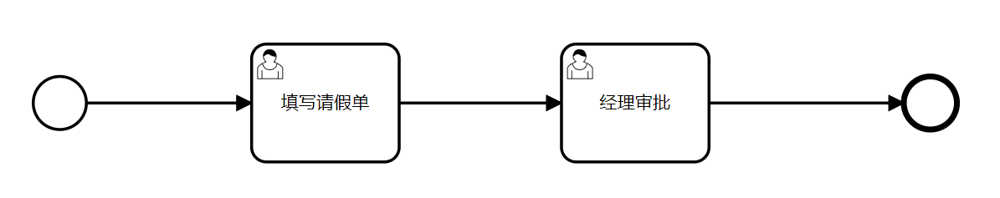

# 工作流-Activiti7基础

## 1 目标

我们前几天的开发中，都是做的系统的基础模块开发，那接下来的几天，我们会开始养老项目的核心业务开发，比如，有老人的入住办理，退住办理等等这些，如下图

入住办理


退住办理


在上图中，使用红框圈起来的内容，大家可以看到，入住和退住，它们都有完整的比较长的流程，里面涉及到了多个表单的提交和多个角色的审核，那么在业务开发的过程中，如果想要完美的实现这些流程的开发，我们最好的技术选型就是使用
**工作流**技术完成，那什么是工作流呢？

工作流（ Workflow ）：是一项将系统任务或操作抽取，再按照预定业务流程进行组织、协调、并自动化执行的技术。

我们也可以简单理解工作流是一种开发方式，其主要是解决一些业务场景硬编码方式的成本高、效率低、变更慢等问题的技术。

在今天，我们会先讲解工作流技术的基础内容，在接下来的几天，我们会把工作流集成到我们的项目中完成入住和退住的开发。

所以我们今天的目标是：

- 掌握工作流的使用场景有哪些
- 能够清楚Activiti7的特点
- 能够掌握BPMN设计器的使用以及常见的流程符号
- 能够独立完成Springboot与Activiti7的集成
- 能够独立完成请假流程的审批代码开发
- 能够掌握完成流量变量的使用
- 能够掌握使用UEL表达式动态分配办理人
- 能够掌握使用UEL表达式动态分配连线变量
- 能够掌握使用网关来完成分支执行的流程

## 2 Activiti7概述

Activiti：是一个开源的轻量级工作流和业务流程管理与执行的引擎。2010年基于jBPM4实现首次开源，旨在帮助企业自动化和优化各种业务流程。

官网地址：https://www.activiti.org/

**Activiti 的主要特点和优势：**

- 开源和跨平台：Activiti 是一个开源项目，可以在各种操作系统和平台上运行，提供灵活的部署选项。

- 高度可定制：Activiti 提供了可视化的流程设计器，使用户能够轻松设计和定制各种业务流程。流程定义可以基于 BPMN 2.0 标准进行创建。

- 强大的任务管理：Activiti 允许用户定义任务、分配任务给不同的用户或组，并支持任务的优先级和截止日期。

- 工作流引擎：Activiti 提供了强大的工作流引擎，能够自动执行流程、处理任务、执行规则等。它支持顺序流、条件流、并行网关等流程控制元素。

- 事件驱动：Activiti 支持事件驱动的流程，可以在特定的事件发生时触发流程的不同分支。

- 可扩展性：Activiti 允许开发人员通过编写自定义 Java 类来扩展其功能，满足特定的业务需求。

- 数据持久化：Activiti 使用关系型数据库来存储流程定义、流程实例、任务等信息，保证了数据的持久性和可靠性。

- 集成支持：Activiti 可以与其他技术和系统集成，如 Spring、RESTful Web Services、JavaEE 等。

- 监控和报告：Activiti 提供了流程实例的监控、报告和分析功能，使用户能够了解流程的状态和性能。

## 3 BPMN

### 3.1 概述

BPMN：业务流程建模与标记语言（Business Process Model and Notation），是一种用于图形化表示和描述业务流程的标准化标记语言。目前主流的版本是BPMN2.0，由
Object Management Group（OMG）制定，并于2011年发布，发展至今，已被主流的流程引擎支持，并作为默认。

官网：https://www.bpmn.org/

讲白了，BPMN和HTML类似都是标记语言，都是通过XML的格式来组织数据，供后端解析，也可转成图形化方式直观展示给用户看。

**例：BPMN标准的流程文件内容：**

讲白了，BPMN和HTML类似都是标记语言，都是通过XML的格式来组织数据，供后端解析，也可转成图形化方式直观展示给用户看。

**例：BPMN标准的流程文件内容：**


**转成直观的图：**


### 3.2 BPMN设计器

虽然BPMN是一个标记语言，但是在实际中，我们很少直接去用它语法进行开发，而是直接使用流程设计器来画，而画用前端技术即可实现，在前端开源项目中有一个叫bpmn-js的开源项目，现在几乎成了画流程的标准，市面上的流程设计器基本都是基于它改造的。比如Activiti7官网提供的：https://github.com/activiti/activiti-modeling-app设计器，就是基于bpmn-js实现的

找到资料中的


解压，然后使用npm命令启动:`npm run dev`


启动成功之后，访问地址为：http://localhost:9013/


到此呢，我们就把画图的工具准备好了。

### 3.3 常见流程符号

#### 3.3.1 事件event

事件（Event）是业务流程模型中的重要元素之一。事件可以发生在流程的任何阶段，并且可以影响流程的执行。根据事件发生的时间和方式，可以将BPMN事件分为以下几类：

- 开始事件（Start Event）：表示流程的起点，通常用于触发流程的启动。

- 中间事件（Intermediate Event）：发生在流程中间的事件，可以根据需要划分为多种类型，如定时器事件、消息事件、信号事件等。

- 结束事件（End Event）：表示流程的结束点，通常用于触发流程的结束。


#### 3.3.2 活动activity

活动（Activity）是业务流程模型中的重要元素之一。活动可以包括任务（Task）、子流程（Subprocess）、调用活动（Call Activity）等。

任务（Task）是最基本的活动类型，表示一个简单的、可执行的工作单元。任务通常由人工执行，并且需要指定执行者。根据执行方式的不同，任务可以分为用户任务（User
Task）和手动任务（Manual Task）。用户任务是由人工执行的，需要指定执行的用户或角色，并提供相应的输入；手动任务是由系统自动执行的，不需要指定执行的用户或角色。


#### 3.3.3 流向flow


## 4 Springboot集成Activiti7

### 4.1 导入依赖

创建一个新的项目 activiti-sample，导入以下依赖

```xml
<?xml version="1.0" encoding="UTF-8"?>
<project xmlns="http://maven.apache.org/POM/4.0.0"
         xmlns:xsi="http://www.w3.org/2001/XMLSchema-instance"
         xsi:schemaLocation="http://maven.apache.org/POM/4.0.0 http://maven.apache.org/xsd/maven-4.0.0.xsd">
    <modelVersion>4.0.0</modelVersion>

    <groupId>com.itheima</groupId>
    <artifactId>activiti-sample</artifactId>
    <version>1.0-SNAPSHOT</version>

    <parent>
        <groupId>org.springframework.boot</groupId>
        <artifactId>spring-boot-starter-parent</artifactId>
        <version>2.7.4</version>
        <relativePath/>
    </parent>

    <properties>
        <maven.compiler.source>11</maven.compiler.source>
        <maven.compiler.target>11</maven.compiler.target>
    </properties>

    <dependencies>
        <!--安全框架 spring security -->
        <dependency>
            <groupId>org.springframework.boot</groupId>
            <artifactId>spring-boot-starter-security</artifactId>
        </dependency>
        <!--springboot与activiti7整合的starter-->
        <dependency>
            <groupId>org.activiti</groupId>
            <artifactId>activiti-spring-boot-starter</artifactId>
            <version>7.10.0</version>
        </dependency>

        <dependency>
            <groupId>org.springframework.boot</groupId>
            <artifactId>spring-boot-starter-web</artifactId>
        </dependency>

        <!-- mybatis -->
        <dependency>
            <groupId>org.mybatis.spring.boot</groupId>
            <artifactId>mybatis-spring-boot-starter</artifactId>
            <version>2.1.2</version>
        </dependency>

        <dependency>
            <groupId>org.springframework.boot</groupId>
            <artifactId>spring-boot-starter-jdbc</artifactId>
        </dependency>

        <!-- mysql驱动 -->
        <dependency>
            <groupId>mysql</groupId>
            <artifactId>mysql-connector-java</artifactId>
            <scope>runtime</scope>
        </dependency>
        <!-- 单元测试 -->
        <dependency>
            <groupId>org.springframework.boot</groupId>
            <artifactId>spring-boot-starter-test</artifactId>
        </dependency>
        <dependency>
            <groupId>org.projectlombok</groupId>
            <artifactId>lombok</artifactId>
            <version>1.16.22</version>
        </dependency>
    </dependencies>

    <!--如果activiti依赖下载不了，可以配置如下地址进行下载-->
    <repositories>
        <repository>
            <id>activiti-releases</id>
            <url>https://artifacts.alfresco.com/nexus/content/repositories/activiti-releases</url>
        </repository>
    </repositories>

</project>
```

需自己创建引导类和配置文件application.yml

### 4.2 属性配置

```yaml
server:
  port: 8989
spring:
  datasource:
    username: root
    password: heima123
    url: jdbc:mysql://192.168.200.146:3306/activiti-db?useUnicode=true&characterEncoding=utf-8&useSSL=true&serverTimezone=UTC&nullCatalogMeansCurrent=true&serverTimezone=Asia/Shanghai
    driver-class-name: com.mysql.cj.jdbc.Driver
    #日志的相关配置
  activiti:
    #是否让activiti自动创建所有的历史表
    history-level: full
    #是否需要使用历史表,默认false不使用,而配置true是使用历史表
    db-history-used: true
    #流程自动部署，关闭，需要手动部署流程 服务启动的时候自动检查resources目录下的bpmn文件 如果为true自动部署流程
    check-process-definitions: false
    #关闭启动服务自动框架部署
    deployment-mode: never-fail
```

注意：需要在自己的MySQL中创建一个新的数据库：activiti-db

准备一个引导类，然后启动项目，启动日志中，我们可以看到，activiti会自动创建表结构


我们也可以直接查询数据库，数据库中创建了25张表，目前说明springboot已成功集成了activiti7


### 4.3 表结构

Activiti 的表都以 ACT_   开头。 第二部分是表示表的用途的两个字母标识。 用途也和服务的 API 对应。

- ACT_RE ：`RE`表示 repository。 这个前缀的表包含了流程定义和流程静态资源 （图片，规则）
- ACT_RU：`RU`表示 runtime。 这些运行时的表，包含流程实例，任务，变量，异步任务，等运行中的数据。 Activiti 只在流程实例执行过程中保存这些数据，
  在流程结束时就会删除这些记录。 这样运行时表可以一直很小速度很快。
- ACT_HI：`HI`表示 history。 这些表包含历史数据，比如历史流程实例， 变量，任务等等。
- ACT_GE ： `GE` 表示 general。 通用数据， 用于不同场景下

具体的表含义，如下：

- 一般数据
    - ACT_GE_BYTEARRAY 通用的流程定义和流程资源
    - ACT_GE_PROPERTY 系统相关属性
- 流程历史记录
    - ACT_HI_ACTINST 历史的流程实例
    - ACT_HI_ATTACHMENT 历史的流程附件
    - ACT_HI_COMMENT 历史的说明性信息
    - ACT_HI_DETAIL 历史的流程运行中的细节信息
    - ACT_HI_IDENTITYLINK 历史的流程运行过程中用户关系
    - ACT_HI_PROCINST 历史的流程实例
    - ACT_HI_TASKINST 历史的任务实例
    - ACT_HI_VARINST 历史的流程运行中的变量信息
- 流程定义表
    - ACT_RE_DEPLOYMENT 部署单元信息
    - ACT_RE_MODEL 模型信息
    - ACT_RE_PROCDEF 已部署的流程定义
- 运行实例表
    - ACT_RU_EVENT_SUBSCR 运行时事件
    - ACT_RU_EXECUTION 运行时流程执行实例
    - ACT_RU_IDENTITYLINK 运行时用户关系信息，存储任务节点与参与者的相关信息
    - ACT_RU_JOB 运行时作业
    - ACT_RU_TASK 运行时任务
    - ACT_RU_VARIABLE 运行时变量表

### 4.4 常见api

在activiti7框架内部，已经对25张表的数据操作，已经封装了对应的service，在我们业务进行集成的时候，一般情况下无需再开发针对activiti7相关表的操作进行开发，直接使用activiti7内部提供的api即可。

- RepositoryService：用于部署流程定义，可以添加、删除、查询和管理流程定义。

- RuntimeService：用于启动、查询和管理正在运行的流程实例。
- TaskService：用于查询和管理当前用户可以操作的任务，以及完成任务。
- HistoryService：用于查询历史数据，例如已完成的流程实例、已删除的流程实例、用户任务等。

因为我们现在使用的是springboot集成了activiti，这些api也被spring容器进行了管理，需要用到以上api的时候，直接注入即可，例如

```java
@Autowired
private RepositoryService repositoryService;

/**
     * 部署流程定义
     */
public void saveNewDeploy(FlowInfo flowInfo) {
    Deployment deployment = repositoryService.createDeployment()
        .addClasspathResource(flowInfo.getFilepath()) // 添加bpmn资源
        .name(flowInfo.getFlowname())
        .key(flowInfo.getFlowkey())
        .deploy();
    System.out.println("流程部署id：" + deployment.getId());
    System.out.println("流程部署名称：" + deployment.getName());
}
```

## 5 请假流程审批

### 5.1 需求说明

在企业中，员工如果有事需要请假，一般都需要向上级请假，得到批准后，方可离开公司。而整个过程在企业中需要在系统中完成，以信息化员工的出勤信息，便于工资、奖金的结算，因此需要开发此功能，需求如下：

- 员工：请假的员工需要先填写请假单，填写的字段有：请假人、请假天数、开始请假时间、请假事由；
- 经理：审批员工的请假单，如果不同意，则需要说明不同意的理由；


**实现步骤**

在这里我们主要是来了解一下基于Activiti如何来实现上述需求，其主要的实现步骤是什么？

1、集成流程引擎，（已完成）

2、画流程图，基于bpmn-js工具

3、保存流程图，基于activiti提供的api

4、部署和运行流程图，基于activiti提供的api

5、开发同意和不同意审批功能，基于activiti提供的api

### 5.2 画流程

我们打开bpmn-js，可以直接在页面中画图，步骤如下：

(1)定义流程编号（ID）和名称


(2)新增一个用户任务，并指定代理人为：张三


(3)新增一个用户任务，并指定代理人为：李四，同时需要结束这个流程，最后需要有一个结束事件


流程图画好之后，在页面的左下角有一个导出，就可以直接导出为bpmn文件（xml文件）


把生成后的bpmn文件拷贝到idea中备用，存储位置：resource/bpmn/diagram.bpmn

因为保存的文件都是xml文件，我们为了方便查看这些流程，也可以截个图一起放入bpmn目录下


### 5.3 部署流程

我们在项目的测试包下创建一个ACTQuickStartTest类来完成入门的所有代码

在我们去部署流程、创建流程实例、执行任务的时候可以直接使用activiti提供的api，我们先用三个

- RepositoryService：用于部署流程定义，可以添加、删除、查询和管理流程定义。

- RuntimeService：用于启动、查询和管理正在运行的流程实例。
- TaskService：用于查询和管理当前用户可以操作的任务，以及完成任务。

```java
package com.itheima.activiti.test;

/**
 * 流程部署
 * 添加资源文件、获取部署信息、部署时间
 * act_re_deployment
 */
@SpringBootTest
public class ACTQuickStartTest {

    @Autowired
    private RepositoryService repositoryService;

    /**
     * 流程部署
     */
    @Test
    public void deployProcess() {
        String fileName = "bpmn/diagram.bpmn";
        String imageFile = "bpmn/diagram.png";
        //定义流程
        Deployment deployment = repositoryService.createDeployment()
                .addClasspathResource(fileName)
                .addClasspathResource(imageFile)
                .name("Process_1")
                .deploy();
        //部署流程
        System.out.println(deployment.getId());
        System.out.println(deployment.getName());
    }

}
```

执行成功以后，打印了流程部署id和流程的name


我们在数据库中查询，

- ACT_RE_DEPLOYMENT 流程部署
- ACT_GE_BYTEARRAY 流程资源
- ACT_RE_PROCDEF 流程定义表

(1) ACT_RE_DEPLOYMENT 流程部署表

```sql
select * from ACT_RE_DEPLOYMENT 
```


ACT_RE_DEPLOYMENT 表结构

| 字段名                      | 类型        | 长度  | 注释        |
|--------------------------|-----------|-----|-----------|
| ID_                      | varchar   | 64  | 主键        |
| NAME_                    | varchar   | 255 | 名称        |
| CATEGORY_                | varchar   | 255 | 分类        |
| KEY_                     | varchar   | 255 | 业务key     |
| TENANT_ID_               | varchar   | 255 | 租户ID      |
| DEPLOY_TIME_             | timestamp |     | 部署时间      |
| ENGINE_VERSION_          | varchar   | 255 | 引擎版本，一般为空 |
| VERSION_                 | int       | 10  | 部署版本      |
| PROJECT_RELEASE_VERSION_ | varchar   | 255 | 项目版本，一般为空 |

(2)ACT_GE_BYTEARRAY流程资源

```sql
select * from ACT_GE_BYTEARRAY 
```


表结构

| 字段名            | 类型       | 长度         | 注释          |
|----------------|----------|------------|-------------|
| ID_            | varchar  | 64         | 主键          |
| REV_           | int      | 10         | 数据更新乐观锁     |
| NAME_          | varchar  | 255        | 名称          |
| DEPLOYMENT_ID_ | varchar  | 64         | 部署ID        |
| BYTES_         | longblob | 4294967295 | 大字段内容       |
| GENERATED_     | tinyint  | 3          | 标识是否自动生成的记录 |

(3)act_re_procdef 流程定义表，部署每个新的流程定义都会在这张表中增加一条记录

```sql
select * from ACT_RE_PROCDEF
```


表结构

| 字段名                     | 类型      | 长度   | 注释                                     |
|-------------------------|---------|------|----------------------------------------|
| ID_                     | varchar | 64   | 主键                                     |
| REV_                    | int     | 10   | 数据更新乐观锁                                |
| CATEGORY_               | varchar | 255  | 分类                                     |
| NAME_                   | varchar | 255  | 名称                                     |
| KEY_                    | varchar | 255  | 流程定义key                                |
| VERSION_                | int     | 10   | 流程定义版本                                 |
| DEPLOYMENT_ID_          | varchar | 64   | 关联部署ID                                 |
| RESOURCE_NAME_          | varchar | 4000 | 流程定义存在的资源名称                            |
| DGRM_RESOURCE_NAME_     | varchar | 4000 | 流程图文件的资源名称，一般为空                        |
| DESCRIPTION_            | varchar | 4000 | 流程定义描述                                 |
| HAS_START_FORM_KEY_     | tinyint | 3    | 是否启动表单，1是，0否，一般为0                      |
| HAS_GRAPHICAL_NOTATION_ | tinyint | 3    | 是否图形标记，1是，0否，可以理解成<br />xml中节点坐标等信息是否有 |
| SUSPENSION_STATE_       | int     | 10   | 挂起状态，1挂起，2未挂起                          |
| TENANT_ID_              | varchar | 255  | 租户ID                                   |
| ENGINE_VERSION_         | varchar | 255  | 引擎版本，一般不用                              |
| APP_VERSION_            | int     | 10   | APP版本，一般不用                             |

act_re_deployment和act_re_procdef一对多关系，一次部署在流程部署表生成一条记录，但一次部署可以部署多个流程定义，每个流程定义在流程定义表生成一条记录。每一个流程定义在act_ge_bytearray会存在两个资源记录，bpmn和png。

一般情况下：一次部署一个流程，这样部署表和流程定义表是一对一有关系，方便读取流程部署及流程定义信息。

### 5.4 运行流程实例

什么是流程实例呢？流程实例和流程部署的关系

我们还是先来看一下刚才的请假的流程图



这个图定义好之后，是公司的任何人都会按照这个流程去执行请假，这个流程定义好之后，我们存储起来，相当于定义了一个**模板**
，这个就是流程部署

公司有很多人，每个人请假填写的申请单是不一样的，那么只要有人填写一次申请单，就相当于是一个流程实例。简单说就是用户或程序按照流程定义内容发起一个流程，这就是一个流程实例

```java
@Autowired
private RuntimeService runtimeService;

@Test
public void initProcessInstance(){

    ProcessInstance processInstance = runtimeService.startProcessInstanceByKey("Process_1", "business_key_01");
    System.out.println("流程定义Id: "+ processInstance.getProcessDefinitionId());
    System.out.println("流程实例Id: "+ processInstance.getProcessInstanceId());

}
```

启动流程实例时，指定的businesskey，就会在act_ru_execution #流程实例的执行表中存储businesskey。

Businesskey：业务标识，通常为业务表的主键，业务标识和流程实例一一对应。业务标识来源于业务系统。存储业务标识就是根据业务标识来关联查询业务系统的数据。

> 比如，在这个请假流程中，有一张表是专门存储请假单的。
>
>那不同的人执行请假流程，就会有单独的流程实例，那对应的请假单表中的数据也是不一样的，通常这个businesskey关联就是因为的主键（请假单表的主键）

控制台打印结果：


流程实例启动之后，也会操作相关的表结构

- act_hi_actinst 流程实例执行历史

- act_hi_identitylink 流程的参与用户历史信息

- act_hi_procinst 流程实例历史信息

- act_hi_taskinst 流程任务历史信息

- act_ru_execution 流程执行信息

- act_ru_identitylink 流程的参与用户信息

- act_ru_task 任务信息

```sql
select * from ACT_HI_ACTINST     
select * from ACT_HI_IDENTITYLINK  
select * from ACT_HI_PROCINST      
select * from ACT_HI_TASKINST       
select * from ACT_RU_EXECUTION   
select * from ACT_RU_IDENTITYLINK  
select * from ACT_RU_TASK 
```

### 5.5 任务完成和拒绝

在操作任务的时候，我们主要使用TaskService来进行操作

#### 5.5.1 查询待办任务

我们回顾一下，请假流程图


当流程实例创建之后，就会分配给不同的人来去执行流程中的任务（目前都是用户任务），因为在流程图中已经定义了每个节点的操作人，所以操作人可以进行查询我的待办任务

根据流程图的中的定义，第一个”填写请假单”是由**张三**负责的，我们就可以先查询张三的任务

代码如下：

```java
@Autowired
private TaskService taskService;


//查询我的代办任务
@Test
public void getTasksByAssignee() {

    Task task = taskService.createTaskQuery()
        .processDefinitionKey("Process_1")
        .taskAssignee("张三")
        .processInstanceBusinessKey("business_key_01")
        .singleResult();

    System.out.println(task.getId());
    System.out.println(task.getName());
    System.out.println(task.getAssignee());
}
```

#### 5.5.2 填写申请单

现在流程中的节点已经走到了张三这里，需要他进行处理，因为目前是请假申请单，所以他需要填写请假单的内容，并且提交数据，继续往下执行流程

- TaskService：是一个常用的API，主要用来对任务进行各种操作
- 调用complete方法，即可结束当前节点，并且流程会自动开启下一个节点的任务。同时在结束时还可以把填写的表单数据，作为流程变量（这些流程变量，后续再去讲解如何使用）。

代码如下：

```java
//执行任务
@Test
public void completeTask() {

    String assingee = "张三";
    String businessKey = "business_key_0001";

    //根据流程key 和 任务的负责人 查询任务
    //返回一个任务对象
    Task task = taskService.createTaskQuery()
            .processDefinitionKey("Process_1") //流程Key
            .taskAssignee(assingee)  //要查询的负责人
            .processInstanceBusinessKey(businessKey)
            .singleResult();

    //执行任务
    if(task != null){

        Map<String,Object> variables = new HashMap<>();
        variables.put("userName","张三");
        variables.put("startDate","2024-01-01");
        variables.put("days","1");
        variables.put("reason","元旦回家探亲");


        taskService.complete(task.getId(),variables);
        System.out.println("任务完成...");
    }
}
```

执行上面代码后，可以在act_ru_execution表中发现，新增了【经理审批】待执行的节点，而完成的【填写请假单】节点被删除了。

同时在act_ru_task表中，待办任务也变成了李四【经理审批】：


代码中传入的表单数据，同时也作为流程变量存储到了act_ru_variable表中（详细字段含义，后续讲解）。


#### 5.5.3 经理同意

关于经理同意操作的实现，如果我们把【同意】看做是经理填写的【审批表单（包括：审批结果、审批意见）】中的一个字段，那么其实现和完成填写请假单任务的实现差不多，经理点击同意之后也需要完成当前节点执行下一结束节点。

任务执行有两种情况，第一个是同意，第二个是不同意，我们先开发同意

```java
@Test
public void testAgree(){

    Authentication authentication = new UsernamePasswordAuthenticationToken("李四","123456");
    SecurityContextHolder.getContext().setAuthentication(authentication);

    Task task = taskService.createTaskQuery()
        .processDefinitionKey("Process_1")
        .taskAssignee("李四")
        .processInstanceBusinessKey("business_key_01").singleResult();

    if(null != task){

        Map<String,Object> variables = new HashMap<>();
        variables.put("approvalStatus","同意");
        variables.put("approvalNote","123");

        taskService.complete(task.getId(),variables);
        System.out.println("任务完成...");
    }

}
```

上述代码执行成功后，到数据库中查看act_ru_execution、act_ru_task、act_ru_variable中的数据，你会发现里面没有了相关流程实例的数据，那是因为【经理审批】节点执行完成之后，后面的结束节点也会自动执行，因此流程就执行完成了。而<b style="color:red">
act_ru_开头的表只存储运行中的流程信息</b>，不会存储流程结束了的信息，<b style="color:red">
结束了的相关信息都转到act_hi开头的表中存储了</b>，相关表稍后我们再去认识。

#### 5.5.4 经理不同意

经理不同意和同意都是审批操作，那么不同意的实现就和同意的实现一样？不然，在这里不同意的需求要比同意的复杂一点，不同意则流程会终止执行。比如下面流程中，如果经理1审批不同意，那么经理2就不用审批了，整个流程就应该直接结束。因此不同意，则应该是终止流程而不是完成节点。


综上需求所述，则不同意的实现代码如下：

- 在这里，要终止流程，因此操作的是流程实例
- 在删除流程时，同时也把审批不同意及理由，作为流程变量存储到流程变量中

```java
@Test
public void testRejectTask() {

    String assingee = "李四";

    Task task = taskService.createTaskQuery()
        .processDefinitionKey("Process_1") //流程Key
        .taskAssignee(assingee)  //要查询的负责人
        .singleResult();

    String reason = "时间太久，不同意";
    Map<String, Object> variables = new HashMap<>();
    variables.put("approvalStatus", "不同意");
    variables.put("approvalNode", reason);

    //记录流程变量
    runtimeService.setVariables(task.getProcessInstanceId(), variables);
    //添加流程变量，删除流程实例，表示任务被拒绝
    runtimeService.deleteProcessInstance(task.getProcessInstanceId(), reason);
}
```

上述代码执行成功后，同样在数据库中act_ru_execution、act_ru_task、act_ru_variable中的看不到数据，应为整个流程都被删除了，也结束了，信息也被转到了act_hi开头的表中。

到此，《单人审批请假流程》的整个流程就基本实现完成了。

#### 5.5.5 查询历史任务

```java
package com.itheima.activiti.test;

import org.activiti.engine.HistoryService;
import org.activiti.engine.history.HistoricTaskInstance;
import org.activiti.engine.history.HistoricTaskInstanceQuery;
import org.junit.jupiter.api.Test;
import org.springframework.beans.factory.annotation.Autowired;
import org.springframework.boot.test.context.SpringBootTest;

import java.util.List;
import java.util.Map;

/**
 * @author sjqn
 */
@SpringBootTest
public class HistoryTest {

    @Autowired
    private HistoryService historyService;

    @Test
    public void getHistoryList(){
        HistoricTaskInstanceQuery instanceQuery = historyService.createHistoricTaskInstanceQuery()
                .includeProcessVariables()
                .orderByHistoricTaskInstanceEndTime().desc()
                .finished()
                .taskAssignee("张三");
        //自定义流程变量  条件查询
//        instanceQuery.processVariableValueGreaterThan("days", "1");

        List<HistoricTaskInstance> list = instanceQuery.list();

        for (HistoricTaskInstance history : list) {
            System.out.println("Id: " + history.getId());
            System.out.println("ProcessInstanceId: " + history.getProcessInstanceId());
            System.out.println("StartTime: " + history.getStartTime());
            System.out.println("Name: " + history.getName());
            Map<String, Object> processVariables = history.getProcessVariables();
            System.out.println(processVariables.get("days").toString());
            System.out.println(processVariables.get("reason").toString());
        }

    }
}
```

查询条件API说明

| 方法名称                                                                        |                |
|-----------------------------------------------------------------------------|----------------|
| processInstanceBusinessKey(String processInstanceBusinessKey)               | 根据流程实例业务Key查询  |
| taskId(String taskId)                                                       | 根据任务ID查询       |
| taskAssignee(String taskAssignee)  \| taskAssigneeLike(String taskAssignee) | 根据执行人查询        |
| finished()                                                                  | 已完成的（申请过、同意过）  |
| unfinished()                                                                | 未完成任务          |
| orderByHistoricTaskInstanceEndTime().desc()                                 | 按照执行时间排序       |
| taskName(String var1)  \|  taskNameLike(String var1)                        | 根据节点任务名称查询     |
| list()                                                                      | 返回分页数据         |
| includeProcessVariables()                                                   | 包含流程变量（配合下面使用） |
| processVariableValueEquals(String variableName, Object variableValue)       | 两个值相等          |
| processVariableValueNotEquals(String variableName, Object variableValue)    | 两个值不相等         |
| processVariableValueGreaterThan(String name, Object value)                  | 大于             |
| processVariableValueLessThan(String name, Object value)                     | 小于             |

## 6 流程变量

在刚才我们做过的例子中，其实就是固定分配，我们在画流程图的时候，指定的是具体的人去执行任务


比如上图中，我们创建了用户任务节点之后，可以指定代理人，目前是让张三审核

不过，在实际的开发中，不同的部门有不同的人，这个执行人应该是一个变量，不应该写死，所以，固定分配可以在我们做demo的时候使用，在业务开发的过程中，需要使用动态的设置代理人

### 6.1 UEL表达式

我们现在想要动态的设置任务的代理人，我们就可以使用UEL表达式来完成。

UEL表达式（Unified Expression Language），是一种用于在流程定义中评估和计算表达式的语言。可以用来做流程条件判断、变量赋值等，使得流程定义或运行变得更加的灵活。

```
- 定界符：${assignee} |  ${user.assignee}
- 数学运算：${ 5+5 }
- 逻辑判断：${amount > 100}
- 方法调用：${ list('参数') }，调用的是list方法，这个方法是Activiti内置的方法，把参数转成一个集合
```

### 6.2 动态分配任务人

#### 6.2.1 改造流程图

打开BPMN-JS前端工程，修改刚才的请假流程图，需要修改两个节点，分别是填写申请单、经理审核

第一：修改”填写申请单”任务节点，代理人改为：`${assingee0}`


第二：修改”经理审核”任务节点，代理人改为：`${assingee1}`


第三：重新导出流程图，放到idea中

为了跟之前的流程图区分，我们在导出之前可以修改流程图的编号，目前为：Process_2，如下：


流程图文件的名字改为：diagram-uel.bpmn


#### 6.2.2 动态分配

我们现在的任务是UEL表达式来动态分配代理人的，其中的流程部署和任务执行的方式都一样，唯一不同的是，启动流程实例的时候，需要设置流程变量，来给刚才的${assingee0}和$
{assingee1}赋值，这样就能做到，多个人申请流程，是多套流程实例，每一套都有可能是不同的人来去处理任务

代码如下：

```java
package com.itheima.activiti.test;

/**
 * @author sjqn
 * @date 2023/9/30
 */
@SpringBootTest
public class UELTest {

    @Autowired
    private RepositoryService repositoryService;

    @Autowired
    private RuntimeService runtimeService;

    /**
     * 流程部署
     */
    @Test
    public void deployProcess() {
        String fileName = "bpmn/diagram-uel.bpmn";
        //定义流程
        Deployment deployment = repositoryService.createDeployment()
                .addClasspathResource(fileName)
                .name("Process_2")
                .deploy();
        //部署流程
        System.out.println(deployment.getId());
        System.out.println(deployment.getName());
    }

    @Test
    public void initProcessInstanceWithArgs() {
        //流程变量
        Map<String,Object> variables = new HashMap<String,Object>();
        variables.put("assingee0","赵六");
        variables.put("assingee1","王五");

        //启动流程实例
        ProcessInstance processInstance = runtimeService.startProcessInstanceByKey(
                "Process_2",
                "business_key_02",
                variables);
        //Process_2:1:2ca378d1-fe9b-11ed-b40d-5405db5be13e
        System.out.println("流程实例ID: " + processInstance.getProcessDefinitionId());
    }

}
```

#### 6.2.3 任务查询和执行

任务查询和执行还是跟之前是一样的，因为现在我们已经给任务节点分配了执行人，代码如下：

```java
//查询我的代办任务
@Test
public void getTasksByAssignee() {

    String assingee = "赵六";

    Task task = taskService.createTaskQuery()
        .processDefinitionKey("Process_2") //流程Key
        .taskAssignee(assingee)  //要查询的负责人
        .singleResult();

    System.out.println("Id: " + task.getId());
    System.out.println("Name: " + task.getName());
    System.out.println("Assignee: " + task.getAssignee());
}

//执行任务
@Test
public void completeTask() {

    String assingee = "赵六";

    //根据流程key 和 任务的负责人 查询任务
    //返回一个任务对象
    Task task = taskService.createTaskQuery()
        .processDefinitionKey("Process_2") //流程Key
        .taskAssignee(assingee)  //要查询的负责人
        .singleResult();

    if (task == null) {
        System.out.println(assingee + ",没有任务可以执行...");
    } else {
        //执行任务

        // 把张三填写的请假单中的数据，作为流程变量，设置到流程中
        Map<String, Object> variables = new HashMap<>();
        variables.put("userName", "赵六");
        variables.put("startDate", "2024-1-1");
        variables.put("days", "1");
        variables.put("reason", "元旦回家");

        taskService.complete(task.getId(), variables);
        System.out.println("完成任务");
    }
}
```

其中经理审批的同意和不同意跟之前的代码是一样的，大家可以参考之前的代码

#### 6.2.4 其他类型支持

刚才的例子只是UEL表达式中最基本的设置变量的方式，UEL还支持其他很多类型，比如：

使用pojo对象赋值


spring的bean


### 6.3 动态分配连线上的变量

#### 6.3.1 需求说明

我们先来看一个新的需求，如下图


一个员工请假，如果请假天数不超过3天，则由经理审批，如果请假天数超过3天，则由总经理审批

这个就需要我们在流程连上设置变量，就是我们刚才说的UEL表达式

#### 6.3.2 画流程图


上面流程中，重点是在经理审批和总经理审批的连上中设置UEL变量

```
- 经理审批--->  ${days <= 3}
- 总经理审批--->  ${days > 3}
```

我们画好流程图之后，需要把它导出，然后放到idea中的


#### 6.3.3 代码开发

(1)部署流程

```java

/**
 * @author sjqn
 * @date 2023/9/16
 */
@SpringBootTest
public class SequenceTest {

    @Autowired
    private RepositoryService repositoryService;

    @Autowired
    private RuntimeService runtimeService;

    @Autowired
    private TaskService taskService;

    /**
     * 流程部署
     */
    @Test
    public void deployProcess() {
        String fileName = "bpmn/diagram-sequence.bpmn";
        //定义流程
        Deployment deployment = repositoryService.createDeployment()
                .addClasspathResource(fileName)
                .name("Process_3")
                .deploy();
        //部署流程
        System.out.println(deployment.getId());
        System.out.println(deployment.getName());
    }

}
```

(2)启动流程实例，设置流程变量

```java
/**
 * @author sjqn
 * @date 2023/9/16
 */
@SpringBootTest
public class SequenceTest {

    @Autowired
    private RepositoryService repositoryService;

    @Autowired
    private RuntimeService runtimeService;

    @Autowired
    private TaskService taskService;


    @Test
    public void initProcessInstanceWithArgs() {
        //流程变量
        Map<String,Object> variables = new HashMap<String,Object>();
        variables.put("assingee0","张三");
        variables.put("assingee1","李四");
        variables.put("assingee2","王五");

        //启动流程实例
        ProcessInstance processInstance = runtimeService.startProcessInstanceByKey(
                "Process_3",
                "business_key_03",
                variables);
        //Process_2:1:2ca378d1-fe9b-11ed-b40d-5405db5be13e
        System.out.println("流程实例ID: " + processInstance.getProcessDefinitionId());
    }

}
```

(3)填写请假单

```java
package com.itheima.activiti.test;

import org.activiti.engine.RepositoryService;
import org.activiti.engine.RuntimeService;
import org.activiti.engine.TaskService;
import org.activiti.engine.repository.Deployment;
import org.activiti.engine.runtime.ProcessInstance;
import org.activiti.engine.task.Task;
import org.junit.jupiter.api.Test;
import org.springframework.beans.factory.annotation.Autowired;
import org.springframework.boot.test.context.SpringBootTest;

import java.util.HashMap;
import java.util.Map;

/**
 * @author sjqn
 * @date 2023/9/16
 */
@SpringBootTest
public class SequenceTest {

    @Autowired
    private RepositoryService repositoryService;

    @Autowired
    private RuntimeService runtimeService;

    @Autowired
    private TaskService taskService;


    //查询我的代办任务
    @Test
    public void getTasksByAssignee() {

        String assingee = "张三";
        String businessKey = "business_key_03";

        Task task = taskService.createTaskQuery()
                .processDefinitionKey("Process3") //流程Key
                .taskAssignee(assingee)  //要查询的负责人
                .processInstanceBusinessKey(businessKey)
                .singleResult();

        System.out.println("Id: " + task.getId());
        System.out.println("Name: " + task.getName());
        System.out.println("Assignee: " + task.getAssignee());
    }

    //执行任务
    @Test
    public void completeTask() {

        String assingee = "张三";
        String businessKey = "business_key_03";

        //根据流程key 和 任务的负责人 查询任务
        //返回一个任务对象
        Task task = taskService.createTaskQuery()
                .processDefinitionKey("Process3") //流程Key
                .taskAssignee(assingee)  //要查询的负责人
                .processInstanceBusinessKey(businessKey)
                .singleResult();

        if (task == null) {
            System.out.println(assingee + ",没有任务可以执行...");
        } else {
            //执行任务

            // 把张三填写的请假单中的数据，作为流程变量，设置到流程中
            Map<String, Object> variables = new HashMap<>();
            variables.put("userName", "张三");
            variables.put("startDate", "2024-1-1");
            variables.put("days", "5");
            variables.put("reason", "元旦回家");

            taskService.complete(task.getId(), variables);
            System.out.println("完成任务");
        }
    }
}
```

- 当`张三`填写申请单，我们重点设置`days`这个变量
- 当`days`变量小于等于3则会把下一个任务分配经理(李四)审批
- 当`days`变量大于3则会把下一个任务分配给总经理(王五)审批

(4)经理审批或总经理审批

通过流程变量`days`控制之后，分配到了经理审批或总经理审批完成整个流程任务

## 7 流程网关

### 7.1 概述

网关（Gateway）是用于控制流程执行流向的元素。网关的作用是在流程执行时进行决策，决定流程的下一个执行步骤。根据网关的决策方式，可以将BPMN网关分为以下几种类型：

1. 排他网关（Exclusive Gateway）：也称为XOR网关或基于数据的排他网关，用于在流程中创建决策点。当执行到达排他网关时，所有出口顺序流会按照它们定义的顺序进行计算。条件计算为true的顺序流会被选择用于继续流程。
2. 包容网关（Inclusive Gateway）：也称为AND网关或包容性决策网关，用于在流程中创建平行的路径。当执行到达包容网关时，所有出口顺序流同时进行计算，并且至少要有一个条件计算为true的顺序流被选择用于继续流程。
3. 综合网关（Complex Gateway）：用于模拟复杂的同步行为。通过表达式激活条件描述精确的行为。
4. 基于事件的网关（Event-based Gateway）：基于事件的网关代表流程中的一个分支点，其中遵循网关的替代路径基于发生的事件，而不是使用流程数据对表达式的评估。
5. 并行网关（Parallel Gateway）：用于同步（组合）并行流并创建并行流。


### 7.2 排他网关

排他网关，用来在流程中实现决策。 当流程执行到这个网关，所有分支都会判断条件是否为true，如果为true则执行该分支，

**注意**：排他网关只会选择一个为true的分支执行。如果有两个分支条件都为true，排他网关会选择id值较小的一条分支去执行。

为什么要用排他网关？

不用排他网关也可以实现分支，如：在连线的condition条件上设置分支条件。

在连线设置condition条件的缺点：如果条件都不满足，流程就结束了(是异常结束)。

如果 使用排他网关决定分支的走向，如下：


如果从网关出去的线所有条件都不满足则系统抛出异常。

```java
org.activiti.engine.ActivitiException: No outgoing sequence flow of the exclusive gateway 'exclusivegateway1' could be selected for continuing the process
   at org.activiti.engine.impl.bpmn.behavior.ExclusiveGatewayActivityBehavior.leave(ExclusiveGatewayActivityBehavior.java:85)

```

> 实现代码：参考6.3章节中

## 8 作业

采购流程审批


