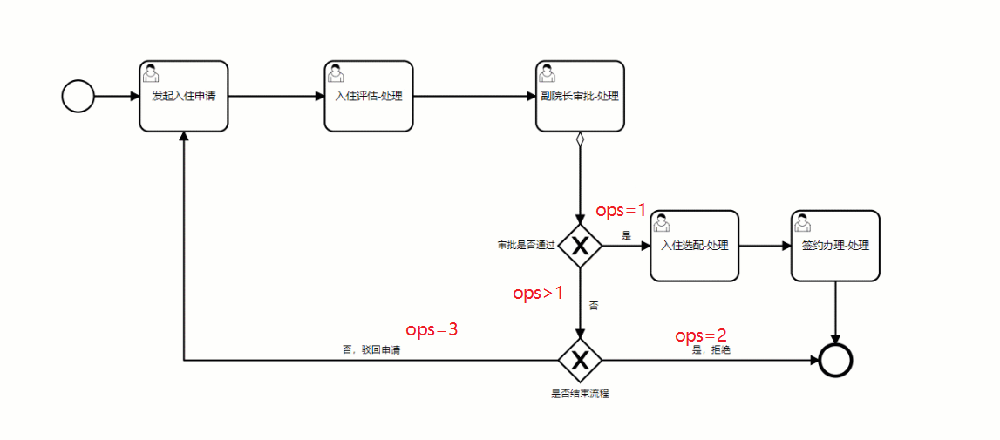

# 协同-入住申请

## 1 目标

在前一天中，我们已经对Activiti7工作流技术有了一定的了解，那么接下来我们会使用工作流技术来完养老项目的核心业务之一：入住申请。

入住申请属于养老项目中的核心业务之一，里面涉及到了很多的实体关联，所以，我们在开发之前必须要搞明白需求，敲定技术解决方案，方才能顺利的完成开发。

今日的目标如下：

- 能够全面掌握熟悉入住的业务流程
- 能够独立完成入住相关表结构的创建
- 能够使用AI工具快速生成实体类、mapper接口以及映射文件
- 能够分析出入住的相关接口
- 能够独立完成养老顾问-申请入住的接口开发

## 2 入住申请-需求分析

在开发之前，我们还是一样的套路，先对这个业务进行分析

### 2.1 整体业务介绍


1. 上述流程中涉及到多个角色参与流程，分别是：养老顾问、护理组主管、副院长、法务部员工

​ 详细角色岗位职责，请查看原型中的”项目说明”->"岗位职责"

2. 审批结果(5种)

   

3. 协同

    - 当养老顾问发起了申请之后，下一个操作人是护理组主管，养老顾问登录账号之后，操作数据是在**协同工作**->**我的待办**->*
      *我的待办-待处理**|**已处理**

      在这里可以分配自己的任务，然后可以进行下一步的处理

      

    - 当养老顾问发起了申请之后，可以在**我的申请**中查看任务的流程处理过程

      

### 2.2 详细业务分析

我们先来看整体的流程，如下图：


#### 2.2.1 申请入住

先打开原型图，如下：


这一步的操作人是”养老顾问”，主要作用就是：上传老人相关资料（个人信息、家人信息、身份信息）

原型中有三个页面对应了三个表单

- 基本信息：老人的基本数据
- 家属信息：老人的家属信息可以绑定
- 资料上传：上传老人的身份证信息

#### 2.2.2 入住评估

我们继续原型图，如下图：


这一步的操作是由”护理组长”来操作，主要是对老人的健康情况做评估

这个原型也对应了三个表单

- 健康评估：老人的历史健康数据，疾病情况、用药情况、风险事件、体检报告
- 能力评估：让老人做题，判断老人的自理能力
- 评估报告：根据老人的做题的结果，给老人能力打分，然后给出护理等级鉴定

#### 2.2.3 入住审批

先来看原型图


这一步的操作是由”副院长”来操作，首先展示老人的详细数据，前两步的数据，让副院长老审批

审批的结果有三种，分别是：

- 审核通过，通过由审批人操作，通过之后进入下一节点，或结束流程；

  1）若最后一个审批人通过后，发起人不可撤销；

  2）若下一节点已审批，发起人不可撤回；

- 审核拒绝

    - 通过由审批人操作，拒绝后，此流程结束；

    - 若审批拒绝后，发起人不可修改申请单，需重新填写并提交新表单；

- 驳回

  驳回修改动作由审批人操作，选择驳回后，将自动驳回到发起人，驳回后，发起人可修改申请单，重新走工作流/审批流；

#### 2.2.4 入住配置

我们继续来看”入住配置”


这一步的操作还是由”养老顾问”来操作

- 入住期限：可以选择老人入住期限
- 护理等级：可以选择护理等级，当选择护理等级后，在下面的费用设置里面自动显示护理费用
- 入住床位：当点击”选择护理床位”，会跳转到床位管理选择床位，在下面会自动显示床位费用
- 费用设置：可以手动设置费用期限（费用期限必须在入住期限内），可以再手动设置其他费用
- 费用预览：可以预览老人的首月的月度账单费用
- 当点击保存按钮之后，会保存老人的入住的配置

#### 2.2.5 签约办理

我们继续来看原型图


这一步由”法务”人员来操作，让法务人员在线上签订老人的入住合同，并且在系统中上传老人的入住合同

当这一步操作完成后，同时需要保存老人的合同相关数据

#### 2.2.6 申请人-撤销

在我的申请中，当流程还没有审核完成之前，申请人都可以在这里进行撤销，当单子撤销之后，这个入住单就会结束，该老人如果再次入住，则需要重新发起申请


## 3 入住申请-表结构设计

### 3.1 E-R图

由我们刚才分析的需求，我们需要保存很多的内容，也就是说需要创建很多张表来保存数据，整体的实体关系如下：


### 3.2 表结构说明

- 入住之后，第一肯定会创建老人表

- 在申请入住的时候需要创建填写老人的入住信息
- 在选择入住的时候，需要录入老人的入住配置
- 同时也会创建老人的入住合同，保存合同信息
- 老人入住开始后
    - 根据入住配置会生成月度账单
    - 会创建余额表，来保存老人的预缴款信息
- 其中的表关系如下：
    - 老人表与余额表、入住表、入住配置表、账单表、合同表都是一对一的关系

### 3.3 操作记录表

我们来看原型图，在原型图的右侧有操作记录，效果如下：


处理或者是审核的**每一次**（通过、拒绝、驳回、撤回、撤销）操作，都会记录到操作记录表中

### 3.4 表结构创建

老人表：

```sql
CREATE TABLE "elder" (
  "id" bigint NOT NULL AUTO_INCREMENT COMMENT 'id',
  "name" varchar(255) CHARACTER SET utf8mb4 COLLATE utf8mb4_0900_ai_ci DEFAULT NULL COMMENT '名称',
  "image" varchar(255) CHARACTER SET utf8mb4 COLLATE utf8mb4_0900_ai_ci DEFAULT NULL COMMENT '图片',
  "id_card_no" varchar(20) CHARACTER SET utf8mb4 COLLATE utf8mb4_0900_ai_ci DEFAULT NULL COMMENT '身份证号',
  "age" varchar(50) CHARACTER SET utf8mb4 COLLATE utf8mb4_0900_ai_ci DEFAULT NULL COMMENT '欠费金额（元）',
  "sex" varchar(50) CHARACTER SET utf8mb4 COLLATE utf8mb4_0900_ai_ci DEFAULT NULL COMMENT '支付截止时间',
  "status" int NOT NULL DEFAULT '1' COMMENT '状态（0：禁用，1:启用  2:请假 3:退住中 4入住中 5已退住）',
  "phone" varchar(50) CHARACTER SET utf8mb4 COLLATE utf8mb4_0900_ai_ci NOT NULL COMMENT '手机号',
  "create_time" datetime NOT NULL COMMENT '创建时间',
  "update_time" datetime DEFAULT NULL COMMENT '更新时间',
  "create_by" bigint DEFAULT NULL COMMENT '创建人id',
  "update_by" bigint DEFAULT NULL COMMENT '更新人id',
  "remark" varchar(255) CHARACTER SET utf8mb4 COLLATE utf8mb4_0900_ai_ci DEFAULT NULL COMMENT '备注',
  PRIMARY KEY ("id") USING BTREE,
  UNIQUE KEY "name_id_card_no" ("name","id_card_no") USING BTREE
) ENGINE=InnoDB AUTO_INCREMENT=104 DEFAULT CHARSET=utf8mb4 COLLATE=utf8mb4_0900_ai_ci ROW_FORMAT=DYNAMIC COMMENT='老人表';
```

实体类：

```java
/**
 * 老人实体类
 */
@Data
public class Elder extends BaseEntity {

    /**
     * 姓名
     */
    private String name;

    /**
     * 头像
     */
    private String image;

    /**
     * 状态（0：禁用，1:启用  2:请假 3:退住中 4入住中 5已退住）
     */
    private Integer status;

    /**
     * 身份证号
     */
    private String idCardNo;

    /**
     * 手机号
     */
    private String phone;

    @ApiModelProperty(value = "年龄")
    private String age;

    @ApiModelProperty(value = "性别")
    private String sex;


}
```

入住表：

```sql
CREATE TABLE "check_in" (
  "id" bigint NOT NULL AUTO_INCREMENT COMMENT 'id',
  "check_in_code" varchar(255) CHARACTER SET utf8mb4 COLLATE utf8mb4_unicode_ci NOT NULL COMMENT '编号',
  "title" varchar(255) CHARACTER SET utf8mb4 COLLATE utf8mb4_unicode_ci NOT NULL COMMENT '标题',
  "elder_id" bigint NOT NULL COMMENT '老人id',
  "counselor" varchar(255) CHARACTER SET utf8mb4 COLLATE utf8mb4_unicode_ci DEFAULT NULL COMMENT '养老顾问',
  "check_in_time" timestamp NULL DEFAULT NULL COMMENT '入住时间',
  "reason" varchar(255) CHARACTER SET utf8mb4 COLLATE utf8mb4_unicode_ci DEFAULT NULL COMMENT '原因',
  "remark" varchar(255) CHARACTER SET utf8mb4 COLLATE utf8mb4_unicode_ci DEFAULT NULL COMMENT '备注',
  "applicat" varchar(255) CHARACTER SET utf8mb4 COLLATE utf8mb4_unicode_ci NOT NULL COMMENT '申请人',
  "dept_no" varchar(255) CHARACTER SET utf8mb4 COLLATE utf8mb4_unicode_ci NOT NULL COMMENT '部门编号',
  "applicat_id" bigint NOT NULL COMMENT '申请人id',
  "create_time" timestamp NOT NULL COMMENT '创建时间',
  "flow_status" int NOT NULL COMMENT '流程状态',
  "status" int NOT NULL COMMENT '审核状态',
  "other_apply_info" text CHARACTER SET utf8mb4 COLLATE utf8mb4_unicode_ci COMMENT '其他申请信息',
  "review_info" text CHARACTER SET utf8mb4 COLLATE utf8mb4_unicode_ci COMMENT '评估信息',
  "update_time" timestamp NULL DEFAULT NULL COMMENT '更新时间',
  PRIMARY KEY ("id") USING BTREE
) ENGINE=InnoDB AUTO_INCREMENT=98 DEFAULT CHARSET=utf8mb4 COLLATE=utf8mb4_unicode_ci ROW_FORMAT=DYNAMIC;
```

实体类：

```java
/**
 * @author sjqn
 * @date 2023/6/19
 */
@Data
@ApiModel(description = "入住实体类")
public class CheckIn extends BaseEntity {

    /**
     * 入住单号
     */
    @ApiModelProperty(value = "入住单号")
    private String checkInCode;

    /**
     * 入住标题
     */
    @ApiModelProperty(value = "入住标题")
    private String title;

    @ApiModelProperty(value = "老人")
    private ElderDto elderDto;

    /**
     * 其他申请信息
     */
    @ApiModelProperty(value = "其他信息")
    private String otherApplyInfo;


    /**
     * 评估信息
     */
    @ApiModelProperty(value = "评估信息")
    private String reviewInfo;
    /**
     * 老人id
     */
    @ApiModelProperty(value = "老人id")
    private Long elderId;

    /**
     * 养老顾问
     */
    @ApiModelProperty(value = "养老顾问")
    private String counselor;

    /**
     * 入住时间
     */
    @ApiModelProperty(value = "入住时间")
    private LocalDateTime checkInTime;

    /**
     * 入住原因
     */
    @ApiModelProperty(value = "入住原因")
    private String reason;
    /**
     * 备注
     */
    @ApiModelProperty(value = "备注")
    private String remark;
    /**
     * 申请人
     */
    @ApiModelProperty(value = "申请人")
    private String applicat;

    /**
     * 申请人部门编号
     */
    @ApiModelProperty(value = "申请人")
    private String deptNo;

    /**
     * 申请人id
     */
    @ApiModelProperty(value = "申请人id")
    private Long applicatId;
    /**
     * 申请时间
     */
    @ApiModelProperty(value = "申请时间")
    private LocalDateTime createTime;
    /**
     * 流程状态
     *  0:申请入住
     *  1:入住评估
     *  2:入住审批
     *  3:入住配置
     *  4:签约办理
     */
    @ApiModelProperty(value = "流程状态")
    private Integer flowStatus;
    /**
     * 状态（1：申请中，2:已完成,3:已关闭）
     */
    @ApiModelProperty(value = "状态")
    private Integer status;


    private ElderVo elderVo;

    private RoomVo roomVo;

    private CheckInConfigVo checkInConfigVo;

    private NursingLevelVo nursingLevelVo;
    private BedVo bedVo;

    //状态枚举类
    @Alias("CheckInFolwStatus")
    public enum FlowStatus{
        APPLY(0, "入住申请", "养老顾问"),
        REVIEW(1, "入住评估", "护理组主管"),
        APPROVAL(2, "入住审核", "院长"),
        CONFIG(3, "入住配置", "养老顾问"),
        SIGN(4, "签约办理", "法务");
        Integer code;
        String name;
        String role;

        FlowStatus(Integer code, String name, String role){
            this.code = code;
            this.name = name;
            this.role = role;
        }
        public Integer getCode(){
            return this.code;
        }

        public String getName(){
            return this.name;
        }

        public String getRole(){
            return this.role;
        }
    }

    //状态枚举类
    @Alias("CheckInStatus")
    public enum Status{
        APPLICATION(1),
        FINISHED(2),
        CLOSED(3);
        Integer code;
        Status(Integer code){
            this.code = code;
        }
        public Integer getCode(){
            return this.code;
        }
    }


}
```

入住配置表：

```sql
CREATE TABLE "check_in_config" (
  "id" bigint NOT NULL AUTO_INCREMENT COMMENT '主键',
  "elder_id" bigint NOT NULL COMMENT '老人ID',
  "check_in_start_time" datetime NOT NULL COMMENT '入住开始时间',
  "check_in_end_time" datetime NOT NULL COMMENT '入住结束时间',
  "nursing_level_id" bigint NOT NULL COMMENT '护理等级ID',
  "bed_no" varchar(50) CHARACTER SET utf8mb4 COLLATE utf8mb4_0900_ai_ci NOT NULL COMMENT '床位号',
  "cost_start_time" datetime NOT NULL COMMENT '费用开始时间',
  "cost_end_time" datetime NOT NULL COMMENT '费用结束时间',
  "deposit_amount" decimal(10,2) NOT NULL COMMENT '押金（元）',
  "nursing_cost" decimal(10,2) NOT NULL COMMENT '护理费用（元/月）',
  "bed_cost" decimal(10,2) NOT NULL COMMENT '床位费用（元/月）',
  "other_cost" decimal(10,2) NOT NULL DEFAULT '0.00' COMMENT '其他费用（元/月）',
  "medical_insurance_payment" decimal(10,2) NOT NULL DEFAULT '0.00' COMMENT '医保支付（元/月）',
  "government_subsidy" decimal(10,2) NOT NULL DEFAULT '0.00' COMMENT '政府补贴（元/月）',
  "create_time" datetime NOT NULL COMMENT '创建时间',
  "update_time" datetime DEFAULT NULL COMMENT '更新时间',
  "create_by" bigint DEFAULT NULL COMMENT '创建人id',
  "update_by" bigint DEFAULT NULL COMMENT '更新人id',
  "remark" varchar(255) CHARACTER SET utf8mb4 COLLATE utf8mb4_0900_ai_ci DEFAULT NULL COMMENT '备注',
  PRIMARY KEY ("id") USING BTREE
) ENGINE=InnoDB AUTO_INCREMENT=63 DEFAULT CHARSET=utf8mb4 COLLATE=utf8mb4_0900_ai_ci ROW_FORMAT=DYNAMIC COMMENT='入住配置表';
```

实体类：

```java
/**
 * 入住配置实体类
 */
@Data
public class CheckInConfig extends BaseEntity  {
    /**
     * 主键id
     */
    private Long id;

    /**
     * 老人id
     */
    private Long elderId;

    /**
     * 入住开始时间
     */
    @JsonFormat(pattern = "yyyy-MM-dd HH:mm:ss")
    private LocalDateTime checkInStartTime;

    /**
     * 入住结束时间
     */
    @JsonFormat(pattern = "yyyy-MM-dd HH:mm:ss")
    private LocalDateTime checkInEndTime;

    /**
     * 护理等级id
     */
    private Long nursingLevelId;

    /**
     * 床位号
     */
    private String bedNo;

    /**
     * 费用开始时间
     */
    @JsonFormat(pattern = "yyyy-MM-dd HH:mm:ss")
    private LocalDateTime costStartTime;

    /**
     * 费用结束时间
     */
    @JsonFormat(pattern = "yyyy-MM-dd HH:mm:ss")
    private LocalDateTime costEndTime;

    /**
     * 押金金额
     */
    private BigDecimal depositAmount;

    /**
     * 护理费用
     */
    private BigDecimal nursingCost;

    /**
     * 床位费用
     */
    private BigDecimal bedCost;

    /**
     * 其他费用
     */
    private BigDecimal otherCost;

    /**
     * 医保支付金额
     */
    private BigDecimal medicalInsurancePayment;

    /**
     * 政府补贴金额
     */
    private BigDecimal governmentSubsidy;

    private NursingLevel nursingLevel;
}

```

余额表：

```sql
CREATE TABLE "balance" (
  "id" bigint NOT NULL AUTO_INCREMENT COMMENT '主键',
  "prepaid_balance" decimal(10,2) unsigned zerofill DEFAULT '00000000.00' COMMENT '预交款余额',
  "deposit_amount" decimal(10,2) unsigned zerofill DEFAULT '00000000.00' COMMENT '押金金额',
  "arrears_amount" decimal(10,2) unsigned zerofill DEFAULT '00000000.00' COMMENT '欠费金额（元）',
  "payment_deadline" datetime DEFAULT NULL COMMENT '支付截止时间',
  "status" int NOT NULL DEFAULT '0' COMMENT '状态（0：正常，1：退住  2：入住未缴押金）',
  "elder_id" bigint NOT NULL COMMENT '老人ID',
  "elder_name" varchar(50) CHARACTER SET utf8mb4 COLLATE utf8mb4_0900_ai_ci DEFAULT NULL COMMENT '老人姓名',
  "bed_no" varchar(50) CHARACTER SET utf8mb4 COLLATE utf8mb4_0900_ai_ci DEFAULT NULL COMMENT '床位号',
  "create_time" datetime NOT NULL COMMENT '创建时间',
  "update_time" datetime DEFAULT NULL COMMENT '更新时间',
  "create_by" bigint DEFAULT NULL COMMENT '创建人id',
  "update_by" bigint DEFAULT NULL COMMENT '更新人id',
  "remark" varchar(255) CHARACTER SET utf8mb4 COLLATE utf8mb4_0900_ai_ci DEFAULT NULL COMMENT '备注',
  PRIMARY KEY ("id") USING BTREE
) ENGINE=InnoDB AUTO_INCREMENT=72 DEFAULT CHARSET=utf8mb4 COLLATE=utf8mb4_0900_ai_ci ROW_FORMAT=DYNAMIC COMMENT='余额表';
```

实体类：

```java
/**
 * 余额实体类
 */
@Data
public class Balance extends BaseEntity {
    /**
     * 主键id
     */
    private Long id;

    /**
     * 预付款余额
     */
    private BigDecimal prepaidBalance;

    /**
     * 押金金额
     */
    private BigDecimal depositAmount;

    /**
     * 欠费金额
     */
    private BigDecimal arrearsAmount;

    /**
     * 缴费截止日期
     */
    @JsonFormat(pattern = "yyyy-MM-dd HH:mm:ss")
    private LocalDateTime paymentDeadline;

    /**
     * 状态（0：正常，1：退住）
     */
    private Integer status;

    /**
     * 老人id
     */
    private Long elderId;

    /**
     * 老人姓名
     */
    private String elderName;

    /**
     * 床位号
     */
    private String bedNo;
}
```

账单表：

```sql
CREATE TABLE "bill" (
  "id" bigint NOT NULL AUTO_INCREMENT COMMENT '主键',
  "bill_no" varchar(50) CHARACTER SET utf8mb4 COLLATE utf8mb4_0900_ai_ci NOT NULL COMMENT '账单编号',
  "trading_order_no" bigint DEFAULT '0' COMMENT '交易系统订单号',
  "bill_type" tinyint NOT NULL DEFAULT '0' COMMENT '账单类型（0：月度账单，1服务账单）',
  "bill_month" varchar(50) CHARACTER SET utf8mb4 COLLATE utf8mb4_0900_ai_ci DEFAULT NULL COMMENT '账单月份',
  "elder_id" bigint NOT NULL COMMENT '老人ID',
  "bill_amount" decimal(10,2) NOT NULL COMMENT '账单金额（元）',
  "payable_amount" decimal(10,2) NOT NULL COMMENT '应付金额（元）',
  "prepaid_amount" decimal(10,2) unsigned zerofill DEFAULT NULL COMMENT '预付款支付金额',
  "deposit_amount" decimal(10,2) unsigned zerofill DEFAULT NULL COMMENT '押金金额',
  "current_cost" decimal(10,2) NOT NULL COMMENT '本期应付',
  "payment_deadline" datetime NOT NULL COMMENT '支付截止时间',
  "transaction_status" int NOT NULL COMMENT '账单状态（0：未支付，1已支付, 2已关闭）',
  "bill_start_time" datetime DEFAULT NULL COMMENT '账单开始时间',
  "bill_end_time" datetime DEFAULT NULL COMMENT '账单结束时间',
  "total_days" int DEFAULT NULL COMMENT '共计天数（天）',
  "create_time" datetime NOT NULL COMMENT '创建时间',
  "lname" varchar(50) CHARACTER SET utf8mb4 COLLATE utf8mb4_0900_ai_ci DEFAULT '' COMMENT '护理等级名称',
  "type_name" varchar(50) CHARACTER SET utf8mb4 COLLATE utf8mb4_0900_ai_ci DEFAULT '' COMMENT '房间类型名称',
  "update_time" varchar(50) CHARACTER SET utf8mb4 COLLATE utf8mb4_0900_ai_ci DEFAULT NULL COMMENT '更新时间',
  "create_by" bigint DEFAULT NULL COMMENT '创建人id',
  "update_by" bigint DEFAULT NULL COMMENT '更新人id',
  "remark" varchar(255) CHARACTER SET utf8mb4 COLLATE utf8mb4_0900_ai_ci DEFAULT NULL COMMENT '备注',
  PRIMARY KEY ("id") USING BTREE
) ENGINE=InnoDB AUTO_INCREMENT=73 DEFAULT CHARSET=utf8mb4 COLLATE=utf8mb4_0900_ai_ci ROW_FORMAT=DYNAMIC COMMENT='账单表';
```

实体类：

```java
/**
 * 账单实体类
 */
@Data
public class Bill extends BaseEntity {
    /**
     * 账单id
     */
    private Long id;

    /**
     * 账单编号
     */
    private String billNo;

    /**
     * 账单类型
     */
    private Integer billType;

    /**
     * 账单月份
     */
    private String billMonth;

    /**
     * 老人id
     */
    private Long elderId;

    /**
     * 账单金额
     */
    private BigDecimal billAmount;

    /**
     * 应付金额
     */
    private BigDecimal payableAmount;

    /**
     * 缴费截止日期
     */
    @JsonFormat(pattern = "yyyy-MM-dd HH:mm:ss")
    private LocalDateTime paymentDeadline;

    /**
     * 交易状态
     */
    private Integer transactionStatus;

    /**
     * 账单开始时间
     */
    @JsonFormat(pattern = "yyyy-MM-dd HH:mm:ss")
    private LocalDateTime billStartTime;

    /**
     * 账单结束时间
     */
    @JsonFormat(pattern = "yyyy-MM-dd HH:mm:ss")
    private LocalDateTime billEndTime;

    /**
     * 账单总天数
     */
    private Integer totalDays;

    /**
     * 本期应付
     */
    private BigDecimal currentCost;

    /**
     * 押金金额
     */
    private BigDecimal depositAmount;

    /**
     * 预付款支付金额
     */
    private BigDecimal prepaidAmount;

    private Long tradingOrderNo;

    @ApiModelProperty(value = "等级名称")
    private String lname;

    @ApiModelProperty(value = "房间类型名称")
    private String typeName;

    private ElderVo elderVo;

    @ApiModelProperty(value = "总欠费金额")
    private BigDecimal total;

    private CheckInConfigVo checkInConfigVo;

    /*private List<TradingVo> tradingVo;
    private RefundRecordVo refundRecordVo;*/

    private BedVo bedVo;
}
```

合同表：

```sql
CREATE TABLE "contract" (
  "id" bigint NOT NULL AUTO_INCREMENT COMMENT '主键',
  "name" varchar(255) CHARACTER SET utf8mb4 COLLATE utf8mb4_0900_ai_ci NOT NULL COMMENT '合同名称',
  "contract_no" varchar(255) CHARACTER SET utf8mb4 COLLATE utf8mb4_0900_ai_ci NOT NULL COMMENT '合同编号',
  "pdf_url" varchar(255) CHARACTER SET utf8mb4 COLLATE utf8mb4_0900_ai_ci DEFAULT NULL COMMENT '协议地址',
  "member_phone" varchar(50) CHARACTER SET utf8mb4 COLLATE utf8mb4_0900_ai_ci DEFAULT NULL COMMENT '丙方手机号',
  "elder_id" bigint DEFAULT NULL COMMENT '老人id',
  "elder_name" varchar(50) CHARACTER SET utf8mb4 COLLATE utf8mb4_0900_ai_ci DEFAULT NULL COMMENT '老人姓名',
  "member_name" varchar(50) CHARACTER SET utf8mb4 COLLATE utf8mb4_0900_ai_ci DEFAULT NULL COMMENT '丙方名称',
  "start_time" datetime NOT NULL COMMENT '开始时间',
  "end_time" datetime NOT NULL COMMENT '结束时间',
  "status" tinyint NOT NULL DEFAULT '0' COMMENT '状态，0：未生效，1：已生效，2：已过期, 3：已失效',
  "sort" int DEFAULT '0' COMMENT '排序字段',
  "level_desc" varchar(255) CHARACTER SET utf8mb4 COLLATE utf8mb4_0900_ai_ci DEFAULT NULL COMMENT '级别描述',
  "create_time" datetime NOT NULL COMMENT '创建时间',
  "create_by" varchar(255) CHARACTER SET utf8mb4 COLLATE utf8mb4_0900_ai_ci NOT NULL COMMENT '创建人',
  "update_time" datetime DEFAULT NULL COMMENT '更新时间',
  "update_by" varchar(255) CHARACTER SET utf8mb4 COLLATE utf8mb4_0900_ai_ci DEFAULT NULL COMMENT '更新人',
  "remark" varchar(255) CHARACTER SET utf8mb4 COLLATE utf8mb4_0900_ai_ci DEFAULT NULL COMMENT '备注',
  "check_in_no" varchar(255) CHARACTER SET utf8mb4 COLLATE utf8mb4_0900_ai_ci DEFAULT NULL COMMENT '入住单号',
  "sign_date" datetime NOT NULL COMMENT '签约日期',
  "release_submitter" varchar(255) CHARACTER SET utf8mb4 COLLATE utf8mb4_0900_ai_ci DEFAULT NULL COMMENT '解除提交人',
  "release_date" datetime DEFAULT NULL COMMENT '解除日期',
  "release_pdf_url" varchar(255) CHARACTER SET utf8mb4 COLLATE utf8mb4_0900_ai_ci DEFAULT NULL COMMENT '解除协议url',
  PRIMARY KEY ("id") USING BTREE
) ENGINE=InnoDB AUTO_INCREMENT=56 DEFAULT CHARSET=utf8mb4 COLLATE=utf8mb4_0900_ai_ci ROW_FORMAT=DYNAMIC COMMENT='合同表';
```

实体类：

```java
/**
 * 合同实体类
 */
@Data
public class Contract extends BaseEntity {

    /**
     * 合同名称
     */
    private String name;

    /**
     * 丙方手机号
     */
    private String memberPhone;

    /**
     * 丙方名称
     */
    private String memberName;

    /**
     * 老人名称
     */
    private String elderName;

    /**
     * 合同编号
     */
    private String contractNo;

    /**
     * 合同pdf文件地址
     */
    private String pdfUrl;

    /**
     * 会员id
     */
    private Long memberId;

    /**
     * 老人id
     */
    private Long elderId;

    /**
     * 合同开始时间
     */
    @JsonFormat(pattern = "yyyy-MM-dd HH:mm:ss")
    private LocalDateTime startTime;

    /**
     * 合同结束时间
     */
    @JsonFormat(pattern = "yyyy-MM-dd HH:mm:ss")
    private LocalDateTime endTime;

    /**
     * 合同状态
     */
    private Integer status;

    /**
     * 排序
     */
    private Integer sort;

    /**
     * 级别描述
     */
    private String levelDesc;

    /**
     * 入住编号
     */
    private String checkInNo;

    /**
     * 签约时间
     */
    @JsonFormat(pattern = "yyyy-MM-dd HH:mm:ss")
    private LocalDateTime signDate;

    /**
     * 解除提交人
     */
    private String releaseSubmitter;

    /**
     * 解除时间
     */
    @JsonFormat(pattern = "yyyy-MM-dd HH:mm:ss")
    private LocalDateTime releaseDate;

    /**
     * 解除pdf文件地址
     */
    private String releasePdfUrl;

    private ElderVo elderVo;

    private RoomVo roomVo;
}
```

操作记录表：

```sql
CREATE TABLE "accraditation_record" (
  "id" bigint NOT NULL AUTO_INCREMENT COMMENT '主键',
  "opinion" varchar(255) CHARACTER SET utf8mb4 COLLATE utf8mb4_unicode_ci DEFAULT NULL COMMENT '审批意见',
  "type" tinyint DEFAULT NULL COMMENT '审批类型(1:退住,2:请假,3:入住)',
  "approver_id" bigint DEFAULT NULL COMMENT '审批人id',
  "approver_name" varchar(255) CHARACTER SET utf8mb4 COLLATE utf8mb4_unicode_ci DEFAULT NULL COMMENT '审批人',
  "approver_name_role" varchar(255) CHARACTER SET utf8mb4 COLLATE utf8mb4_unicode_ci DEFAULT NULL COMMENT '审批人角色',
  "next_approver_id" bigint DEFAULT NULL COMMENT '下一个审核人id',
  "next_approver" varchar(255) CHARACTER SET utf8mb4 COLLATE utf8mb4_unicode_ci DEFAULT NULL COMMENT '下一个审核人',
  "next_approver_role" varchar(255) CHARACTER SET utf8mb4 COLLATE utf8mb4_unicode_ci DEFAULT NULL COMMENT '下一个审核人角色',
  "bussniess_id" bigint DEFAULT NULL COMMENT '业务id',
  "current_step" varchar(255) CHARACTER SET utf8mb4 COLLATE utf8mb4_unicode_ci DEFAULT NULL COMMENT '当前操作步骤',
  "next_step" varchar(255) CHARACTER SET utf8mb4 COLLATE utf8mb4_unicode_ci DEFAULT NULL COMMENT '下一步操作',
  "audit_status" tinyint DEFAULT NULL COMMENT '审核状态(1:通过,2:拒绝,3:驳回,4:撤回,5:撤销)',
  "step_no" bigint DEFAULT NULL COMMENT '审核步骤',
  "create_time" datetime DEFAULT NULL COMMENT '创建时间',
  "update_time" datetime DEFAULT NULL COMMENT '更新时间',
  "create_by" bigint DEFAULT NULL COMMENT '创建人',
  "update_by" bigint DEFAULT NULL COMMENT '更新人',
  "handle_type" tinyint DEFAULT NULL COMMENT '处理类型（0:已审批，1：已处理）',
  PRIMARY KEY ("id") USING BTREE
) ENGINE=InnoDB AUTO_INCREMENT=870 DEFAULT CHARSET=utf8mb4 COLLATE=utf8mb4_unicode_ci ROW_FORMAT=DYNAMIC COMMENT='审批记录表';
```

实体类：

```java
@Data
@ApiModel(description = "退住实体类")
public class AccraditationRecord extends BaseEntity {

    private Long id;

    /**
     * 审批意见
     */
    @ApiModelProperty(value = "审批意见")
    private String opinion;
    /**
     * 审批类型
     * 1:退住
     * 2:请假
     * 3:入住
     */
    @ApiModelProperty(value = "审批类型")
    private Integer type;
    /**
     * 审批人id
     */
    @ApiModelProperty(value = "审批人id")
    private Long approverId;
    /**
     * 审批人
     */
    @ApiModelProperty(value = "审批人")
    private String approverName;

    /**
     * 审批人角色
     */
    @ApiModelProperty(value = "审批人角色")
    private String approverNameRole;

    /**
     * 业务id
     */
    @ApiModelProperty(value = "业务id")
    private Long bussniessId;
    /**
     * 当前审核步骤
     */
    @ApiModelProperty(value = "当前审核步骤")
    private String currentStep;

    /**
     * 下一个审核步骤
     */
    @ApiModelProperty(value = "当前审核步骤")
    private String nextStep;

    /**
     * 审核状态
     * 1:通过
     * 2:拒绝
     * 3:驳回
     * 4:撤回
     * 5:撤销
     */
    @ApiModelProperty(value = "审核状态(1:通过,2:拒绝,3:驳回,4:撤回,5:撤销)")
    private Integer auditStatus;

    /**
     * 下一个审批人
     */
    @ApiModelProperty(value = "下一个审批人")
    private String nextApprover;

    /**
     * 下一个审批人id
     */
    @ApiModelProperty(value = "下一个审批人id")
    private Long nextApproverId;

    /**
     * 下一个审批人角色
     */
    @ApiModelProperty(value = "下一个审批人")
    private String nextApproverRole;

    /**
     * 审核步骤（序号，从1开始）
     */
    @ApiModelProperty(value = "审核步骤（序号，从1开始）")
    private Long stepNo;

    /**
     * 处理类型（0:已审批，1：已处理）
     */
    @ApiModelProperty(value = "处理类型（0:已审批，1：已处理）")
    private Integer handleType;

}
```

### 3.5 mapper准备

我们按照创建的表，可以快速使用AI工具来生成mapper接口和映射文件，主要是包含了基本的增删改查

我以老人表为例，大家可以参考

问AI


生成后的文件

```java
import java.util.List;

public interface ElderMapper {

    // Create
    void insertElder(Elder elder);

    // Read
    Elder getElderById(Long id);

    List<Elder> getAllElders();

    // Update
    void updateElder(Elder elder);

    // Delete
    void deleteElder(Long id);
}

```

ElderMapper映射文件

```xml
<!DOCTYPE mapper PUBLIC "-//mybatis.org//DTD Mapper 3.0//EN"
        "http://mybatis.org/dtd/mybatis-3-mapper.dtd">
<mapper namespace="your.package.name.ElderMapper">

    <!-- Insert -->
    <insert id="insertElder" parameterType="your.package.name.Elder">
        INSERT INTO elder (name, image, id_card_no, age, sex, status, phone, create_time, update_time, create_by,
        update_by, remark)
        VALUES (#{name}, #{image}, #{idCardNo}, #{age}, #{sex}, #{status}, #{phone}, #{createTime}, #{updateTime},
        #{createBy}, #{updateBy}, #{remark})
    </insert>

    <!-- Select by ID -->
    <select id="getElderById" parameterType="long" resultType="your.package.name.Elder">
        SELECT * FROM elder WHERE id = #{id}
    </select>

    <!-- Select All -->
    <select id="getAllElders" resultType="your.package.name.Elder">
        SELECT * FROM elder
    </select>

    <!-- Update -->
    <update id="updateElder" parameterType="your.package.name.Elder">
        UPDATE elder
        SET name = #{name}, image = #{image}, id_card_no = #{idCardNo}, age = #{age},
        sex = #{sex}, status = #{status}, phone = #{phone}, update_time = #{updateTime},
        create_by = #{createBy}, update_by = #{updateBy}, remark = #{remark}
        WHERE id = #{id}
    </update>

    <!-- Delete by ID -->
    <delete id="deleteElder" parameterType="long">
        DELETE FROM elder WHERE id = #{id}
    </delete>
</mapper>
```

> - 上述的包名需要改成自己的
>- 其他的表生成的方式与上面类似

## 4 入住申请-流程图绘制

### 4.1 入住流程绘制


入住流程的思路如下：

- 当启动流程的时候，我们需要设置流程变量，办理人的设置
    - 发起人申请：变量为assignee0，这个办理人为养老顾问，也是当前登录人
    - 入住评估处理：变量为assignee1，这个办理人为护理部组长（根据之前的权限表获取）
    - 副院长审批-处理：变量为assignee2，这个办理人为副院长（根据之前的权限表获取）
    - 入住选配-处理：变量为assignee3，这个办理人为养老顾问，也是当前登录人
    - 签约办理-处理：变量为assignee4，这个办理人为法务人员（根据之前的权限表获取）

- 在第三步院长审核的时候，有多种情况，我们可以使用网关来进行判断

  

    - 审核通过，则走向第四步：入住选配-处理
    - 审核拒绝，则直接结束流程
    - 驳回，则直接走向第一步：发起入住申请

- 用户任务中的formKey是方便找到节点的位置

    - formKey = 0 发起入住申请
    - formKey = 1 入住评估-处理
    - formKey = 2 副院长审批-处理
    - formKey = 3 入住选配-处理
    - formKey = 4 签约办理-处理

导出后的BPMN文件，如下：

```xml
<?xml version="1.0" encoding="UTF-8"?>
<bpmn2:definitions xmlns:xsi="http://www.w3.org/2001/XMLSchema-instance"
                   xmlns:bpmn2="http://www.omg.org/spec/BPMN/20100524/MODEL"
                   xmlns:bpmndi="http://www.omg.org/spec/BPMN/20100524/DI"
                   xmlns:dc="http://www.omg.org/spec/DD/20100524/DC" xmlns:di="http://www.omg.org/spec/DD/20100524/DI"
                   xmlns:activiti="http://activiti.org/bpmn" id="sample-diagram"
                   targetNamespace="http://activiti.org/bpmn"
                   xsi:schemaLocation="http://www.omg.org/spec/BPMN/20100524/MODEL BPMN20.xsd">
    <bpmn2:process id="checkIn" isExecutable="true">
        <bpmn2:startEvent id="StartEvent_1">
            <bpmn2:outgoing>Flow_1ov8d8q</bpmn2:outgoing>
        </bpmn2:startEvent>
        <bpmn2:userTask id="Activity_1t6gx8c" name="发起入住申请" activiti:formKey="0" activiti:assignee="${assignee0}">
            <bpmn2:incoming>Flow_1ov8d8q</bpmn2:incoming>
            <bpmn2:incoming>Flow_01u09rw</bpmn2:incoming>
            <bpmn2:outgoing>Flow_1ty7kvs</bpmn2:outgoing>
        </bpmn2:userTask>
        <bpmn2:sequenceFlow id="Flow_1ov8d8q" sourceRef="StartEvent_1" targetRef="Activity_1t6gx8c"/>
        <bpmn2:userTask id="Activity_0nl9q7y" name="入住评估-处理" activiti:formKey="1"
                        activiti:assignee="${assignee1}">
            <bpmn2:incoming>Flow_1ty7kvs</bpmn2:incoming>
            <bpmn2:outgoing>Flow_1rekudp</bpmn2:outgoing>
        </bpmn2:userTask>
        <bpmn2:sequenceFlow id="Flow_1ty7kvs" sourceRef="Activity_1t6gx8c" targetRef="Activity_0nl9q7y"/>
        <bpmn2:userTask id="Activity_0pnd103" name="副院长审批-处理" activiti:formKey="2"
                        activiti:assignee="${assignee2}">
            <bpmn2:incoming>Flow_1rekudp</bpmn2:incoming>
            <bpmn2:outgoing>Flow_0vubi1p</bpmn2:outgoing>
        </bpmn2:userTask>
        <bpmn2:sequenceFlow id="Flow_1rekudp" sourceRef="Activity_0nl9q7y" targetRef="Activity_0pnd103"/>
        <bpmn2:exclusiveGateway id="Gateway_0g6p4io" name="审批是否通过">
            <bpmn2:incoming>Flow_0vubi1p</bpmn2:incoming>
            <bpmn2:outgoing>Flow_0xbxwok</bpmn2:outgoing>
            <bpmn2:outgoing>Flow_0p55046</bpmn2:outgoing>
        </bpmn2:exclusiveGateway>
        <bpmn2:sequenceFlow id="Flow_0vubi1p" sourceRef="Activity_0pnd103" targetRef="Gateway_0g6p4io">
            <bpmn2:conditionExpression xsi:type="bpmn2:tFormalExpression"/>
        </bpmn2:sequenceFlow>
        <bpmn2:userTask id="Activity_0c5hzuk" name="入住选配-处理" activiti:formKey="3"
                        activiti:assignee="${assignee3}">
            <bpmn2:incoming>Flow_0xbxwok</bpmn2:incoming>
            <bpmn2:outgoing>Flow_0yzx1pm</bpmn2:outgoing>
        </bpmn2:userTask>
        <bpmn2:sequenceFlow id="Flow_0xbxwok" name="是" sourceRef="Gateway_0g6p4io" targetRef="Activity_0c5hzuk">
            <bpmn2:conditionExpression xsi:type="bpmn2:tFormalExpression">${ ops== 1}</bpmn2:conditionExpression>
        </bpmn2:sequenceFlow>
        <bpmn2:userTask id="Activity_1ri3tu5" name="签约办理-处理" activiti:formKey="4"
                        activiti:assignee="${assignee4}">
            <bpmn2:incoming>Flow_0yzx1pm</bpmn2:incoming>
            <bpmn2:outgoing>Flow_0ce33xt</bpmn2:outgoing>
        </bpmn2:userTask>
        <bpmn2:sequenceFlow id="Flow_0yzx1pm" sourceRef="Activity_0c5hzuk" targetRef="Activity_1ri3tu5"/>
        <bpmn2:endEvent id="Event_0iecfuv">
            <bpmn2:incoming>Flow_0ce33xt</bpmn2:incoming>
            <bpmn2:incoming>Flow_07yhw99</bpmn2:incoming>
        </bpmn2:endEvent>
        <bpmn2:sequenceFlow id="Flow_0ce33xt" sourceRef="Activity_1ri3tu5" targetRef="Event_0iecfuv"/>
        <bpmn2:exclusiveGateway id="Gateway_03lcoj8" name="是否结束流程">
            <bpmn2:incoming>Flow_0p55046</bpmn2:incoming>
            <bpmn2:outgoing>Flow_01u09rw</bpmn2:outgoing>
            <bpmn2:outgoing>Flow_07yhw99</bpmn2:outgoing>
        </bpmn2:exclusiveGateway>
        <bpmn2:sequenceFlow id="Flow_0p55046" name="否" sourceRef="Gateway_0g6p4io" targetRef="Gateway_03lcoj8">
            <bpmn2:conditionExpression xsi:type="bpmn2:tFormalExpression">${ ops &gt; 1}</bpmn2:conditionExpression>
        </bpmn2:sequenceFlow>
        <bpmn2:sequenceFlow id="Flow_01u09rw" name="否，驳回申请" sourceRef="Gateway_03lcoj8"
                            targetRef="Activity_1t6gx8c">
            <bpmn2:conditionExpression xsi:type="bpmn2:tFormalExpression">${ ops== 3}</bpmn2:conditionExpression>
        </bpmn2:sequenceFlow>
        <bpmn2:sequenceFlow id="Flow_07yhw99" name="是，拒绝" sourceRef="Gateway_03lcoj8" targetRef="Event_0iecfuv">
            <bpmn2:conditionExpression xsi:type="bpmn2:tFormalExpression">${ ops== 2}</bpmn2:conditionExpression>
        </bpmn2:sequenceFlow>
    </bpmn2:process>
    <bpmndi:BPMNDiagram id="BPMNDiagram_1">
        <bpmndi:BPMNPlane id="BPMNPlane_1" bpmnElement="checkIn">
            <bpmndi:BPMNEdge id="Flow_1ov8d8q_di" bpmnElement="Flow_1ov8d8q">
                <di:waypoint x="348" y="240"/>
                <di:waypoint x="400" y="240"/>
            </bpmndi:BPMNEdge>
            <bpmndi:BPMNEdge id="Flow_1ty7kvs_di" bpmnElement="Flow_1ty7kvs">
                <di:waypoint x="500" y="240"/>
                <di:waypoint x="610" y="240"/>
            </bpmndi:BPMNEdge>
            <bpmndi:BPMNEdge id="Flow_1rekudp_di" bpmnElement="Flow_1rekudp">
                <di:waypoint x="710" y="240"/>
                <di:waypoint x="850" y="240"/>
            </bpmndi:BPMNEdge>
            <bpmndi:BPMNEdge id="Flow_0vubi1p_di" bpmnElement="Flow_0vubi1p">
                <di:waypoint x="900" y="280"/>
                <di:waypoint x="900" y="385"/>
            </bpmndi:BPMNEdge>
            <bpmndi:BPMNEdge id="Flow_0xbxwok_di" bpmnElement="Flow_0xbxwok">
                <di:waypoint x="925" y="410"/>
                <di:waypoint x="980" y="410"/>
                <bpmndi:BPMNLabel>
                    <dc:Bounds x="947" y="392" width="11" height="14"/>
                </bpmndi:BPMNLabel>
            </bpmndi:BPMNEdge>
            <bpmndi:BPMNEdge id="Flow_0yzx1pm_di" bpmnElement="Flow_0yzx1pm">
                <di:waypoint x="1080" y="410"/>
                <di:waypoint x="1140" y="410"/>
            </bpmndi:BPMNEdge>
            <bpmndi:BPMNEdge id="Flow_0ce33xt_di" bpmnElement="Flow_0ce33xt">
                <di:waypoint x="1190" y="450"/>
                <di:waypoint x="1190" y="522"/>
            </bpmndi:BPMNEdge>
            <bpmndi:BPMNEdge id="Flow_0p55046_di" bpmnElement="Flow_0p55046">
                <di:waypoint x="900" y="435"/>
                <di:waypoint x="900" y="515"/>
                <bpmndi:BPMNLabel>
                    <dc:Bounds x="910" y="472" width="11" height="14"/>
                </bpmndi:BPMNLabel>
            </bpmndi:BPMNEdge>
            <bpmndi:BPMNEdge id="Flow_01u09rw_di" bpmnElement="Flow_01u09rw">
                <di:waypoint x="875" y="540"/>
                <di:waypoint x="450" y="540"/>
                <di:waypoint x="450" y="280"/>
                <bpmndi:BPMNLabel>
                    <dc:Bounds x="630" y="522" width="66" height="14"/>
                </bpmndi:BPMNLabel>
            </bpmndi:BPMNEdge>
            <bpmndi:BPMNEdge id="Flow_07yhw99_di" bpmnElement="Flow_07yhw99">
                <di:waypoint x="925" y="540"/>
                <di:waypoint x="1172" y="540"/>
                <bpmndi:BPMNLabel>
                    <dc:Bounds x="1027" y="522" width="44" height="14"/>
                </bpmndi:BPMNLabel>
            </bpmndi:BPMNEdge>
            <bpmndi:BPMNShape id="_BPMNShape_StartEvent_2" bpmnElement="StartEvent_1">
                <dc:Bounds x="312" y="222" width="36" height="36"/>
            </bpmndi:BPMNShape>
            <bpmndi:BPMNShape id="Activity_1t6gx8c_di" bpmnElement="Activity_1t6gx8c">
                <dc:Bounds x="400" y="200" width="100" height="80"/>
            </bpmndi:BPMNShape>
            <bpmndi:BPMNShape id="Activity_0nl9q7y_di" bpmnElement="Activity_0nl9q7y">
                <dc:Bounds x="610" y="200" width="100" height="80"/>
            </bpmndi:BPMNShape>
            <bpmndi:BPMNShape id="Activity_0pnd103_di" bpmnElement="Activity_0pnd103">
                <dc:Bounds x="850" y="200" width="100" height="80"/>
            </bpmndi:BPMNShape>
            <bpmndi:BPMNShape id="Gateway_0g6p4io_di" bpmnElement="Gateway_0g6p4io" isMarkerVisible="true">
                <dc:Bounds x="875" y="385" width="50" height="50"/>
                <bpmndi:BPMNLabel>
                    <dc:Bounds x="806" y="403" width="67" height="14"/>
                </bpmndi:BPMNLabel>
            </bpmndi:BPMNShape>
            <bpmndi:BPMNShape id="Activity_0c5hzuk_di" bpmnElement="Activity_0c5hzuk">
                <dc:Bounds x="980" y="370" width="100" height="80"/>
            </bpmndi:BPMNShape>
            <bpmndi:BPMNShape id="Activity_1ri3tu5_di" bpmnElement="Activity_1ri3tu5">
                <dc:Bounds x="1140" y="370" width="100" height="80"/>
            </bpmndi:BPMNShape>
            <bpmndi:BPMNShape id="Gateway_03lcoj8_di" bpmnElement="Gateway_03lcoj8" isMarkerVisible="true">
                <dc:Bounds x="875" y="515" width="50" height="50"/>
                <bpmndi:BPMNLabel>
                    <dc:Bounds x="867" y="572" width="66" height="14"/>
                </bpmndi:BPMNLabel>
            </bpmndi:BPMNShape>
            <bpmndi:BPMNShape id="Event_0iecfuv_di" bpmnElement="Event_0iecfuv">
                <dc:Bounds x="1172" y="522" width="36" height="36"/>
            </bpmndi:BPMNShape>
        </bpmndi:BPMNPlane>
    </bpmndi:BPMNDiagram>
</bpmn2:definitions>
```

### 4.2 部署流程

因为流程属于纯后台开发使用，无需在页面展示，并且项目启动之后，只需要部署一次即可，我们暂时可以手动进行部署，可以编写单元测试部署流程，代码如下：

```java
package com.zzyl.service.test;

import org.activiti.engine.RepositoryService;
import org.activiti.engine.repository.Deployment;
import org.junit.jupiter.api.Test;
import org.springframework.beans.factory.annotation.Autowired;
import org.springframework.boot.test.context.SpringBootTest;

/**
 * @author sjqn
 */
@SpringBootTest
public class ActivitiDeploymentTest {

    @Autowired
    private RepositoryService repositoryService;


    @Test
    public void testDeployment(){

        String fileName = "bpmn/check_in.bpmn";
        //定义流程
        Deployment deployment = repositoryService.createDeployment()
                .addClasspathResource(fileName)
                .name("checkIn")
                .deploy();
        //部署流程
        System.out.println(deployment.getId());
        System.out.println(deployment.getName());
    }
}
```

## 5 入住申请-接口分析

### 5.1 整体接口说明

基于我们刚才的需求分析，我们需要开发的接口有很多，共有11个接口，分别是：

- 养老顾问-申请入住
- 入住表单查询
- 查询我的待办 | 我的申请
- 护理主管-评估老人健康
- 副院长-同意
- 副院长-拒绝
- 副院长-驳回
- 副院长-撤回
- 养老顾问-入住配置
- 法务-签约办理
- 入住管理查询

由于接口较多，我们今天只开发第一个接口，后面的接口，我们后面两天完成

### 5.2 养老顾问-申请入住

**接口地址**:`/checkIn/create`

**请求方式**:`POST`

**请求示例**:

```json
{
  "elderDto": {
    //老人基本信息
    "idCardNo": "132123195607091234",
    "name": "345",
    "phone": "13212344321"
  },
  "memberElderDtos": [
    //老人家属信息
    {
      "key": "0",
      "name": "987",
      "phone": "13212348765",
      "refId": "0",
      "refName": "子女"
    },
    {
      "key": "1",
      "name": "6543",
      "phone": "13456780954",
      "refId": "2",
      "refName": "亲属"
    }
  ],
  "otherApplyInfo": "{ //老人其他信息,是一个json字符串
  "name": 345,
  "idCardNo": 132123195607091234,
  "sex": 0,
  "birthdate": "1956-07-09",
  "age": 67,
  "phone": 13212344321,
  "address": "123345667777",
  "nationality": "汉族",
  "politicStatus": "群众",
  "religion": "佛教",
  "maritalStatus": "已婚",
  "education": "中专",
  "sourceFinance": "退休金",
  "hobby": 123,
  "medicalSecurity": "城镇职工基本医疗保险",
  "medicineCard": 13212233444
}",
"taskId": "", //任务id
"url1": "https://itheim.oss-cn-beijing.aliyuncs.com/c90ba9f4-4b3a-4ee7-a1c5-674baad051b0.png",
"url2": "https://itheim.oss-cn-beijing.aliyuncs.com/aaa9dd65-f9c8-4fbe-af4c-5affb379aa98.jpg",
"url3": "https://itheim.oss-cn-beijing.aliyuncs.com/6b829553-87a4-4f39-b162-829a28829a33.jpg"
}
```

**响应示例**:

```js
{
    "code"
:
    200,
        "msg"
:
    "操作成功"
}
```

## 6 养老顾问-申请入住-接口开发

### 6.1 思路分析


1：输入表单之后，根据老人姓名和身份证号查询老人信息

2：如果能查询到老人，并且在申请入住中，则不处理该老人

3：保存老人信息到老人表中

4：保存入住信息到入住表中

5：保存操作记录（需查询下一个审核人）

6：启动流程实例

​ 6.1 为流程图中的5个assignee设置流程变量，需要按照部门找到对应的办理人

​ 6.2 在流程实例启动之前，则需要设计bussinessKey-->checkIn:入住id

​ 6.3 判断第一个任务是否是当前登录人，如果是，则直接完成任务

### 6.2 申请入住-定义接口

```java
package com.zzyl.controller;

@RestController
@RequestMapping("/checkIn")
@Api(tags = "入住")
public class CheckInController {

    @PostMapping("/create")
    @ApiOperation(value = "申请入住", notes = "传入入住对象")
    public ResponseResul createCheckIn(
            @RequestBody @ApiParam(value = "入住对象", required = true) CheckInDto checkInDto) {
        return null;
    }

}
```

CheckInDto

```java
package com.zzyl.dto;

import com.zzyl.base.BaseDto;
import io.swagger.annotations.ApiModel;
import io.swagger.annotations.ApiModelProperty;
import lombok.Data;

import java.time.LocalDateTime;
import java.util.List;

/**
 * @author sjqn
 */
@Data
@ApiModel(description = "入住实体类")
public class CheckInDto extends BaseDto {

    @ApiModelProperty(value = "保存1 提交2")
    private Integer save;

    @ApiModelProperty(value = "老人")
    private ElderDto elderDto;

    /**
     * 其他申请信息
     */
    @ApiModelProperty(value = "其他信息")
    private String otherApplyInfo;

    /**
     * 健康评估信息
     */
    @ApiModelProperty(value = "健康评估信息")
    private String reviewInfo;

    /**
     * 能力评估
     */
    @ApiModelProperty(value = "能力评估")
    private String reviewInfo1;
    /**
     * 评估报告
     */
    @ApiModelProperty(value = "评估信息")
    private String reviewInfo2;

    /**
     * 入住时间
     */
    @ApiModelProperty(value = "入住时间")
    private LocalDateTime checkInTime;

    /**
     * 家属信息
     */
    @ApiModelProperty(value = "家属信息")
    private List<MemberElderDto> memberElderDtos;

    /**
     * 一寸照片
     */
    @ApiModelProperty(value = "一寸照片")
    private String url1;

    /**
     * 身份证人像面
     */
    @ApiModelProperty(value = "身份证人像面")
    private String url2;

    /**
     * 身份证国徽面
     */
    @ApiModelProperty(value = "身份证国徽面")
    private String url3;


    /**
     * 任务ID
     */
    @ApiModelProperty(value = "任务ID")
    private String taskId;


}
```

### 6.3 申请入住-业务开发

新增入住业务层接口：CheckInService

```java
package com.zzyl.service;

/**
 * @author itheima
 */
public interface CheckInService {
    /**
     * 入住申请
     * @param checkInDto
     */
    ResponseResult createCheckIn(CheckInDto checkInDto);
}

```

实现类：

```java
package com.zzyl.service.impl;

import cn.hutool.core.bean.BeanUtil;
import cn.hutool.json.JSONObject;
import cn.hutool.json.JSONUtil;
import com.github.xiaoymin.knife4j.core.util.CollectionUtils;
import com.zzyl.base.ResponseResult;
import com.zzyl.constant.RetreatConstant;
import com.zzyl.dto.CheckInDto;
import com.zzyl.dto.ElderDto;
import com.zzyl.entity.CheckIn;
import com.zzyl.entity.Dept;
import com.zzyl.entity.Elder;
import com.zzyl.entity.User;
import com.zzyl.mapper.CheckInMapper;
import com.zzyl.mapper.DeptMapper;
import com.zzyl.mapper.UserMapper;
import com.zzyl.service.CheckInService;
import com.zzyl.service.ElderService;
import com.zzyl.utils.CodeUtil;
import com.zzyl.utils.UserThreadLocal;
import com.zzyl.vo.retreat.ElderVo;
import org.activiti.engine.RuntimeService;
import org.activiti.engine.TaskService;
import org.activiti.engine.impl.identity.Authentication;
import org.activiti.engine.runtime.ProcessInstance;
import org.activiti.engine.task.Task;
import org.springframework.beans.factory.annotation.Autowired;
import org.springframework.data.redis.core.RedisTemplate;
import org.springframework.stereotype.Service;

import java.util.HashMap;
import java.util.List;
import java.util.Map;
import java.util.stream.Collectors;

/**
 * @author sjqn
 */
@Service
public class CheckInServiceImpl implements CheckInService {

    @Autowired
    private ElderService elderService;

    @Autowired
    private CheckInMapper checkInMapper;

    private static final String CHECK_IN_CODE_PREFIX = "RZ";

    @Autowired
    private RedisTemplate<String,String> redisTemplate;


    /**
     * 创建入住申请
     * @param checkInDto
     * @return
     */
    @Override
    public ResponseResult createCheckIn(CheckInDto checkInDto) {

        //1.验证状态，如果老人已经发起申请，则不能再次发起
        ElderVo elderVo = elderService.selectByIdCardAndName(checkInDto.getElderDto().getIdCardNo(), checkInDto.getElderDto().getName());
        if(null != elderVo && checkInDto.getId() == null && !elderVo.getStatus().equals(5)){
            return ResponseResult.error(checkInDto.getElderDto().getName()+"已经发起了申请入住");
        }

        //2.保存老人信息
        ElderDto elderDto = checkInDto.getElderDto();
        String otherApplyInfo = checkInDto.getOtherApplyInfo();
        JSONObject jsonObject = JSONUtil.toBean(otherApplyInfo, JSONObject.class);
        elderDto.setAge(jsonObject.get("age").toString());
        elderDto.setSex(jsonObject.get("sex").toString());
        elderDto.setImage(checkInDto.getUrl1());
        Elder elder = elderService.insert(elderDto);

        //3.保存入住信息
        CheckIn checkIn = BeanUtil.toBean(checkInDto, CheckIn.class);
        //入住申请的所有信息
        checkIn.setOtherApplyInfo(JSONUtil.toJsonStr(checkInDto));
        //编码
        String checkInCode = CodeUtil.generateCode(CHECK_IN_CODE_PREFIX, redisTemplate, 5);
        checkIn.setCheckInCode(checkInCode);
        //标题
        checkIn.setTitle(elder.getName()+"的入住申请");
        //老人id
        checkIn.setElderId(elder.getId());

        //获取线程中的用户信息
        String subject = UserThreadLocal.getSubject();
        User user = JSONUtil.toBean(subject, User.class);

        //养老顾问，申请人
        checkIn.setCounselor(user.getRealName());
        checkIn.setApplicat(user.getRealName());

        // 申请人id
        checkIn.setApplicatId(user.getId());

        // 申请人部门编号
        checkIn.setDeptNo(user.getDeptNo());

        //流程状态
        checkIn.setFlowStatus(CheckIn.FlowStatus.APPLY.getCode());

        //审核状态
        checkIn.setStatus(CheckIn.Status.APPLICATION.getCode());

        checkInMapper.insert(checkIn);

        //4.准备流程变量
        Map<String,Object> variables =  setVariables(checkIn);

        //5.启用流程实例，并且自动完成首页点
        start(checkIn.getId(),"checkIn",user,variables,true);

        //6.保存审核记录

        return ResponseResult.success();
    }

    @Autowired
    private TaskService taskService;

    /**
     * 启动流程实例，如果当前登录人是第一个节点的执行人，则自动执行任务
     * @param id  业务id
     * @param processDefinitionKey  流程定义key
     * @param user    当前登录用户
     * @param variables  流程变量参数
     * @param autoFinished   是否自动完成
     */
    private void start(Long id, String processDefinitionKey, User user, Map<String, Object> variables, boolean autoFinished) {

        String businessKey = processDefinitionKey + ":" + id;
        //启动流程实例
        startProcess(processDefinitionKey,variables,businessKey);

        //用户登录，防止报错
        Authentication.setAuthenticatedUserId(user.getId().toString());
        //查询任务
        List<Task> list = taskService.createTaskQuery()
                .processDefinitionKey(processDefinitionKey)
                .taskAssignee(user.getId().toString())
                .list();
        //必须首节点
        list = list.stream().filter(t->"0".equals(t.getFormKey())).collect(Collectors.toList());

        if(!CollectionUtils.isEmpty(list) && autoFinished){
            for (Task task : list) {
                Map<String, Object> variables2 = new HashMap<>();
                variables2.put("processStatus",1);
                variables2.put("ops",1);

                taskService.complete(task.getId(),variables2);
            }
        }

    }

    @Autowired
    private RuntimeService runtimeService;

    /**
     * 启动流程实例
     * @param processDefinitionKey
     * @param variables
     * @param businessKey
     */
    private ProcessInstance startProcess(String processDefinitionKey, Map<String, Object> variables, String businessKey) {
        ProcessInstance processInstance = runtimeService.startProcessInstanceByKey(processDefinitionKey, businessKey, variables);
        return processInstance;
    }

    @Autowired
    private DeptMapper deptMapper;

    @Autowired
    private UserMapper userMapper;

    /**
     * 准备流程变量
     * @param checkIn
     * @return
     */
    private Map<String, Object> setVariables(CheckIn checkIn) {
        //设置流程变量
        Map<String, Object> variables = new HashMap<>();
        //养老顾问
        variables.put("assignee0",checkIn.getApplicatId());
        //入住单的其他信息
        variables.put("assignee0Name",checkIn.getApplicat());
        variables.put("processTitle",checkIn.getTitle());

        //护理主管
        Dept dept = deptMapper.selectByDeptNo(RetreatConstant.NURSING_DEPT_CODE);
        variables.put("assignee1",dept.getLeaderId());
        //院长
        List<Long> useridList = userMapper.selectByDeptNo(RetreatConstant.DEAN_OFFICE_DEPT_CODE);
        variables.put("assignee2",useridList.get(0));

        //养老顾问
        variables.put("assignee3",checkIn.getApplicatId());

        //法务员工
        List<Long> legatUserIdList = userMapper.selectByDeptNo(RetreatConstant.DEAN_OFFICE_DEPT_CODE);
        variables.put("assignee4",legatUserIdList.get(legatUserIdList.size() - 1));

        //设置流程类型   入住
        variables.put("processType",3);

        //流程类型code
        variables.put("processCode",checkIn.getCheckInCode());

        //流程类型 状态
        variables.put("processStatus",1);

        return variables;
    }
}
```

### 6.4 申请入住-控制层

我们补全CheckInController中的代码，如下：

```java
@RestController
@RequestMapping("/checkIn")
@Api(tags = "入住")
public class CheckInController {

    @Autowired
    private CheckInService checkInService;

    @PostMapping("/create")
    @ApiOperation(value = "申请入住", notes = "传入入住对象")
    public ResponseResult<CheckInVo> createCheckIn(
            @RequestBody @ApiParam(value = "入住对象", required = true) CheckInDto checkInDto) {
        return checkInService.createCheckIn(checkInDto);
    }

}
```

### 6.5 测试

当入住申请第一步成功后，会在老人表、入住表、操作记录、流程任务表中创建数据，我们暂时需要查询数据库查看数据是否保存成功即可。

### 6.6 保存审核记录

审核记录无需提供接口，是业务层之间的调用，我们后续的所有操作，都要保存审核记录，同时如果是其他业务，比如退住、请假，只要有审核记录都会进行保存

新增一个AccraditationRecordService接口，定义如下：

```java
package com.zzyl.service;

import com.zzyl.vo.RecordVo;

/**
 * @author sjqn
 */
public interface AccraditationRecordService {
    /**
     * 保存审核记录
     * @param recordVo
     */
    void insert(RecordVo recordVo);
}
```

RecoreVo

```java
package com.zzyl.vo;

import lombok.Data;

/**
 * @author itheima
 */
@Data
public class RecordVo {

    /**
     * 主键
     */
    private Long id;

    /**
     * 类型：（1:退住  2:请假  3:入住）
     */
    private Integer type;

    /**
     * 入住：（流程状态  0:申请入住  1:入住评估  2:入住审批  3:入住配置  4:签约办理）
     * 退住：（流程状态  0:申请退住  1:申请审批  2:解除合同  3:调整账单  4:账单审批  5:退住审批  6:费用算清）
     */
    private Integer flowStatus;

    /**
     * 审核状态
     * 1:通过
     * 2:拒绝
     * 3:驳回
     * 4:撤回
     * 5:撤销
     */
    private Integer status;
    /**
     * 审核意见
     */
    private String option;
    /**
     * 审核步骤
     */
    private String step;
    /**
     * 下一步的操作
     */
    private String nextStep;
    /**
     * 下一个审核人
     */
    private Long nextAssignee;

    /**
     * 当前登录用户id
     */
    private Long userId;

    /**
     * 当前登录用户真实姓名
     */
    private String realName;

    /**
     * 处理类型（0:已审批，1：已处理）
     */
    private Integer handleType;


}
```

实现类：

```java
package com.zzyl.service.impl;

import com.zzyl.entity.AccraditationRecord;
import com.zzyl.mapper.AccraditationRecordMapper;
import com.zzyl.mapper.UserRoleMapper;
import com.zzyl.service.AccraditationRecordService;
import com.zzyl.utils.ObjectUtil;
import com.zzyl.vo.RecordVo;
import com.zzyl.vo.UserRoleVo;
import org.springframework.beans.factory.annotation.Autowired;
import org.springframework.data.redis.core.StringRedisTemplate;
import org.springframework.stereotype.Service;

import java.time.LocalDateTime;
import java.util.List;

/**
 * @author sjqn
 */
@Service
public class AccraditationRecordServiceImpl implements AccraditationRecordService {


    @Autowired
    private AccraditationRecordMapper accraditationRecordMapper;

    @Autowired
    private StringRedisTemplate redisTemplate;

    private static final String RECORD_STEP_NO_PRE="RECORD:";

    @Autowired
    private UserRoleMapper userRoleMapper;

    /**
     * 保存审核记录
     *
     * @param recordVo
     */
    @Override
    public void insert(RecordVo recordVo) {

        AccraditationRecord accraditationRecord = new AccraditationRecord();
        accraditationRecord.setApproverId(recordVo.getUserId());
        accraditationRecord.setBussniessId(recordVo.getId());
        accraditationRecord.setCreateTime(LocalDateTime.now());
        accraditationRecord.setType(recordVo.getType());
        accraditationRecord.setOpinion(recordVo.getOption());
        accraditationRecord.setApproverName(recordVo.getRealName());
        accraditationRecord.setCurrentStep(recordVo.getStep());
        accraditationRecord.setAuditStatus(recordVo.getStatus());
        accraditationRecord.setHandleType(recordVo.getHandleType());
        //审核的步骤，是自增的
        accraditationRecord.setStepNo(redisTemplate.boundValueOps(RECORD_STEP_NO_PRE+recordVo.getId()).increment());
        //寻找下一个审核人
        if(ObjectUtil.isNotEmpty(recordVo.getNextAssignee())){
            //查询审核人的角色和姓名
            List<UserRoleVo> userRoleVos = userRoleMapper.selectByUserId(recordVo.getNextAssignee());
            UserRoleVo userRoleVo = userRoleVos.get(0);

            accraditationRecord.setNextApproverRole(userRoleVo.getRoleName());
            accraditationRecord.setNextApprover(userRoleVo.getUserName());
            accraditationRecord.setNextApproverId(userRoleVo.getId());
            accraditationRecord.setNextStep(recordVo.getNextStep());
        }


        accraditationRecordMapper.insert(accraditationRecord);
    }
}
```

修改CheckInServiceImpl代码，添加代码来保存审核记录

```java
package com.zzyl.service.impl;

/**
 * @author sjqn
 */
@Service
public class CheckInServiceImpl implements CheckInService {

    @Autowired
    private AccraditationRecordService accraditationRecordService;


    /**
     * 创建入住申请
     * @param checkInDto
     * @return
     */
    @Override
    public ResponseResult createCheckIn(CheckInDto checkInDto) {

        //其他代码省略.... 
        
        //6.保存审核记录
        Long nextAssignee = getNextAssignee("checkIn","checkIn:"+checkIn.getId());

        RecordVo recordVo = getRecordVo(
                checkIn,user, AccraditationRecordConstant.AUDIT_STATUS_PASS,
                "同意","发起申请-申请入住","护理组组长处理-入住评估",nextAssignee,
                AccraditationRecordConstant.RECORD_HANDLE_TYPE_PROCESSED
        );

        accraditationRecordService.insert(recordVo);

        return ResponseResult.success();
    }

    /**
     * 封装审核记录参数
     * @param checkIn  入住对象
     * @param user  当前登录用户
     * @param status  审核状态
     * @param option  操作意见
     * @param step  当前步骤
     * @param nextSetp  下一步操作人
     * @param nextAssignee  下一个审核人
     * @param handleType  处理类型（0:已审批，1：已处理）
     * @return
     */
    private RecordVo getRecordVo(CheckIn checkIn, User user, Integer status, String option, String step, String nextSetp, Long nextAssignee, Integer handleType) {

        RecordVo recordVo = new RecordVo();
        recordVo.setId(checkIn.getId());
        recordVo.setType(AccraditationRecordConstant.RECORD_TYPE_CHECK_IN);
        recordVo.setFlowStatus(checkIn.getFlowStatus());
        recordVo.setHandleType(handleType);
        recordVo.setStatus(status);
        recordVo.setOption(option);
        recordVo.setNextStep(nextSetp);
        recordVo.setNextAssignee(nextAssignee);
        recordVo.setUserId(user.getId());
        recordVo.setStep(step);
        recordVo.setRealName(user.getRealName());

        return recordVo;
    }

    /**
     * 获取下一个审核人
     * @param processDifinitionKey
     * @param bussinessKey
     * @return
     */
    private Long getNextAssignee(String processDifinitionKey, String bussinessKey) {

        Task task = taskService.createTaskQuery().processDefinitionKey(processDifinitionKey).processInstanceBusinessKey(bussinessKey).singleResult();
        if(task != null){
            return Long.valueOf(task.getAssignee());
        }
        return null;
    }

}
```

