# 协同-入住申请

## 1 目标

在前一天中，我们已经对入住的整体业务分析完毕了，并且创建了对应的表结构，也开发了其中的一个接口，就是创建申请。今天我们会继续开发入住相关的接口。

今日的目标：

- 独立完成查询我的待办和我的申请接口
- 独立完成入住表单详情查询
- 独立完成护理主管-评估接口
- 独立完成副院长审批中的同意和拒绝的接口开发

## 2 接口分析

由于接口过多，我们今天会开发5个接口，分别是

- 查询我的待办

- 入住表单查询
- 护理主管-评估老人健康
- 副院长-同意
- 副院长-拒绝

### 2.1 查询我的待办

**原型图效果**：

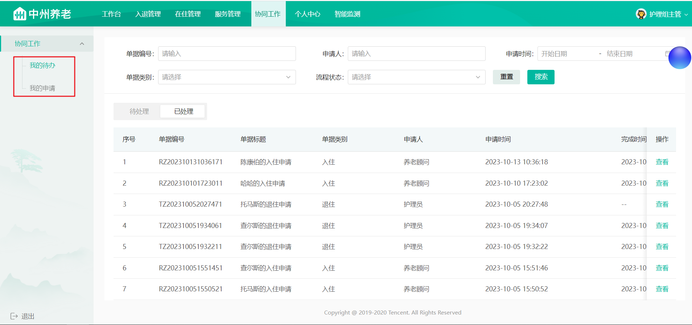

**接口地址**:`/pending_tasks/selectByPage`

**请求方式**:`POST`

**请求示例**:

```json lines
{
  "applicat": "",
  //申请人
  "applicatId": 0,
  //申请人id
  "applyStatus": 0,
  //申请状态
  "assigneeId": 0,
  //操作人
  "code": "",
  //申请单号
  "endTime": "",
  //结束时间
  "isHandle": 0,
  //是否处理完成(0:未处理,1:已处理)
  "pageNum": 0,
  //当前页
  "pageSize": 0,
  //每页条数
  "reqType": 0,
  //请求类型(0:待办，1:我的申请)
  "startTime": "",
  //开始时间
  "status": 0,
  //流程状态（1：申请中，2:已完成，3:已关闭）
  "type": 0//单据类别
  （
  1
  ：
  退住
  ，
  2
  ：
  请假
  ，
  3
  ：
  入住
  ）
}
```

**响应示例**:

```json lines
{
  "code": 200,
  "msg": "操作成功",
  "data": {
    "total": "1",
    "pageSize": 10,
    "pages": "1",
    "page": 1,
    "records": [
      {
        "id": "4ca81266-6f3f-11ee-94ed-5405db5be13e",
        "checkInId": "180",
        "applicat": "养老顾问",
        "applicationTime": "2023-10-20 19:53:36",
        "code": "RZ202310201953351",
        "status": 1,
        "assigneeId": "1671403256519078157",
        "title": "朱罡烈的入住申请",
        "type": 3
      }
    ]
  }
}
```

### 2.2 我的申请

**接口地址**:`/applications/selectByPage`

**请求方式**:`POST`

**请求示例**:

```json lines
{
  "code": "",
  //单据编号
  "endTime": "",
  //结束时间
  "pageNum": 0,
  //当前页码
  "pageSize": 0,
  //每页显示条数
  "startTime": "",
  //开始时间
  "status": 0,
  //单据状态（申请中、已完成、已关闭）
  "type": 0
  //单据类别
}
```

**响应示例**:

```json lines
{
  "code": 200,
  "msg": "操作成功",
  "data": {
    "total": "1",
    "pageSize": 10,
    "pages": "1",
    "page": 1,
    "records": [
      {
        "id": "4ca81266-6f3f-11ee-94ed-5405db5be13e",
        "checkInId": "180",
        "applicat": "养老顾问",
        "applicationTime": "2023-10-20 19:53:36",
        "code": "RZ202310201953351",
        "status": 1,
        "assigneeId": "1671403256519078157",
        "title": "朱罡烈的入住申请",
        "type": 3
      }
    ]
  }
}
```

### 2.3 入住表单查询

**接口地址**:`/checkIn`

**请求方式**:`GET`

**请求数据类型**:`application/x-www-form-urlencoded`

**响应数据类型**:`*/*`

**接口描述**:

**请求参数**:

| 参数名称       | 参数说明  | 数据类型   |
|:-----------|:------|:-------|
| assigneeId | 处理人ID | string |
| code       | 入住编码  | string |
| flowStatus | 流程状态  | int    |
| taskId     | 任务Id  | string |

**响应示例**:

```json lines
{
  "code": 200,
  "msg": "操作成功",
  "data": {
    "checkIn": {
      //入住对象
      "id": "180",
      "createTime": "2023-10-20 19:53:35",
      "updateTime": "2023-10-20 19:53:35",
      "checkInCode": "RZ202310201953351",
      "title": "朱罡烈的入住申请",
      "elderDto": {
        "name": "朱罡烈",
        "idCardNo": "132123196709071234",
        "phone": "13678904567",
        "age": "56",
        "sex": "0"
      },
      "elderId": "141",
      "otherApplyInfo": "{\"education\":\"硕士\",\"idCardNo\":\"132123196709071234\",\"sex\":0,\"politicStatus\":\"群众\",\"religion\":\"佛教\",\"nationality\":\"汉族\",...}",
      "counselor": "养老顾问",
      "applicat": "养老顾问",
      "deptNo": "100001006000000",
      "applicatId": "1671403256519078161",
      "flowStatus": 1,
      "status": 1,
      "isShow": 1,
      "memberElderDtos": [
        {
          "name": "小猪",
          "phone": "13456655444",
          "refName": "子女",
          "refId": "0"
        }
      ],
      "url1": "https://itheim.oss-cn-beijing.aliyuncs.com/f0a77cf6-6c25-4b06-b170-a3d60944cfba.png",
      "url2": "https://itheim.oss-cn-beijing.aliyuncs.com/7f94f434-7557-43b2-ad78-6e15031d6625.jpg",
      "url3": "https://itheim.oss-cn-beijing.aliyuncs.com/c8d80400-433b-4227-8c1f-896df699c2ec.jpg"
    },
    "type": 3,
    "nextApprover": "护理组主管",
    "accraditationRecords": [
      //操作记录
      {
        "id": "1759",
        "createTime": "2023-10-20 19:53:36",
        "opinion": "同意",
        "type": 3,
        "approverId": "1671403256519078161",
        "approverName": "养老顾问",
        "approverNameRole": "127.0.0.1",
        "bussniessId": "180",
        "currentStep": "发起申请-申请入住",
        "nextStep": "护理组组长处理-入住评估",
        "auditStatus": 1,
        "nextApprover": "护理组主管",
        "nextApproverId": "1671403256519078157",
        "nextApproverRole": "护理组主管",
        "stepNo": "1",
        "handleType": 1
      }
    ],
    "isShow": 1
  }
}
```

### 2.4 护理主管-评估

**接口地址**:`/checkIn/review`

**请求方式**:`POST`

**请求示例**:

```json lines
{
  "id": 180,
  //健康评估
  "reviewInfo": "{'diagnoseArr':['无疾病'],'woundArr':['无'],'lookAfterArr':['无']]}",
  //能力评估
  "reviewInfo1": "{'radio1':0,'radio1Score':1,'radio2':2,'radio2Score':3,'radio3':3}",
  //评估报告
  "reviewInfo2": "{'alteration':['已诊断疾病超过3项'],'selfScore':8,'spiritScore':10,}",
  //任务ID
  "taskId": "4ca81266-6f3f-11ee-94ed-5405db5be13e"
}
```

**响应示例**:

```json lines
{
  "code": 200,
  "msg": "操作成功"
}
```

### 2.5 副院长-同意

**接口地址**:`/checkIn/submit`

**请求方式**:`PUT`

**请求参数**:

| 参数名称    | 参数说明 | 数据类型   |
|:--------|:-----|:-------|
| id      | 入住Id | long   |
| message | 审批意见 | string |
| taskId  | 任务Id | string |

**响应示例**:

```json lines
{
  "code": 200,
  "msg": "操作成功"
}
```

### 2.6 副院长-拒绝

**接口地址**:`/checkIn/reject`

**请求方式**:`PUT`

**请求参数**:

| 参数名称    | 参数说明 | 数据类型   |
|:--------|:-----|:-------|
| id      | 入住Id | long   |
| message | 拒绝原因 | string |
| taskId  | 任务Id | string |

**响应示例**:

```json lines
{
  "code": 200,
  "msg": "操作成功"
}
```

## 3 接口功能开发

### 3.1 代码结构调整

为了更方便的维护工作流的代码，我们专门创建一个业务类来管理工作流的代码逻辑

新增一个ActFlowCommService类，定义两个方法，这两个方法，就是我们之前在CheckInServiceImpl中定义的方法

```java
package com.zzyl.service;

import com.zzyl.base.PageResponse;
import com.zzyl.dto.PendingTasksDto;
import com.zzyl.entity.CheckIn;
import com.zzyl.entity.PendingTasks;
import com.zzyl.entity.User;

import java.util.Map;

/**
 * @author sjqn
 */
public interface ActFlowCommService {

    /**
     * 查询下一个审核人
     * @param processDefinitionKey   流程定义key
     * @param businessKey
     * @return
     */
    public Long getNextAssignee(String processDefinitionKey, String businessKey);

    /**
     * 启动流程实例，并且自动执行首页点
     * @param id  业务id
     * @param user  当前登录用户
     * @param processDefinitionKey    流程定义的key
     * @param variables  流程变量参数
     * @param isAuto  是否自动完成
     */
    public void start(Long id, User user, String processDefinitionKey, Map<String, Object> variables, boolean isAuto);

}
```

实现类:

```java
package com.zzyl.service.impl;


/**
 * @author sjqn
 */
@Service
public class ActFlowCommServiceImpl implements ActFlowCommService {

    @Autowired
    private RuntimeService runtimeService;

    @Autowired
    private TaskService taskService;

    @Autowired
    private HistoryService historyService;

    /**
     * 查询下一个审核人
     * @param processDefinitionKey   流程定义key
     * @param businessKey
     * @return
     */
    @Override
    public Long getNextAssignee(String processDefinitionKey, String businessKey) {

        Task task = taskService.createTaskQuery()
                .processDefinitionKey(processDefinitionKey)
                .processInstanceBusinessKey(businessKey).singleResult();
        if(task != null){
            return Long.valueOf(task.getAssignee());
        }
        return null;


    }


    /**
     * 启动流程实例，并且自动执行首页点
     * @param id                   业务id
     * @param user                 当前登录用户
     * @param processDefinitionKey 流程定义的key
     * @param variables            流程变量参数
     * @param isAuto               是否自动完成
     */
    @Override
    public void start(Long id, User user, String processDefinitionKey, Map<String, Object> variables, boolean isAuto) {

        //启动流程实例
        String businessKey = processDefinitionKey +":" + id;
        variables.put("bussinessKey",businessKey);
        runtimeService.startProcessInstanceByKey(processDefinitionKey,businessKey,variables);

        //查询任务，执行任务
        List<Task> list = taskService.createTaskQuery()
                .processDefinitionKey(processDefinitionKey)
                .processInstanceBusinessKey(businessKey)
                .taskAssignee(user.getId().toString())
                .list();
        //判断是否是首节点
        list = list.stream().filter(t->"0".equals(t.getFormKey())).collect(Collectors.toList());
        if(!CollectionUtil.isEmpty(list) && isAuto){
            //执行任务
            for (Task task : list) {
                Map<String, Object> variables2 = new HashMap<>();
                variables2.put("processStatus",1);
                variables2.put("ops",1);
                taskService.complete(task.getId(),variables2);
            }
        }
    }

}
```

修改CheckInServiceImpl，注入ActFlowCommService进行方法调用

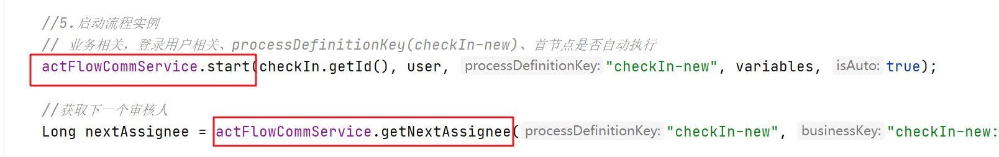

### 3.2 查询我的待办&我的申请

#### 3.2.1 思路分析


#### 3.2.2 接口定义

```java
package com.zzyl.controller;

@RestController
@RequestMapping("/pending_tasks")
@Api(tags = "待办")
public class PendingTasksController extends BaseController {

    @PostMapping("/selectByPage")
    @ApiOperation(value = "查询待办", notes = "传入退住对象")
    public ResponseResult selectByPage(@RequestBody PendingTasksDto pendingTasksDto){
        return null;
    }
}
```

参数DTO：PendingTasksDto

```java
package com.luckon.dto;

import io.swagger.annotations.ApiModel;
import io.swagger.annotations.ApiModelProperty;
import lombok.Data;

import java.util.Date;

@Data
@ApiModel("待办DTO")
public class PendingTasksDto {

    /**
     * 申请单号
     */
    @ApiModelProperty(value = "申请单号")
    private String code;
    /**
     * 申请人
     */
    @ApiModelProperty(value = "申请人")
    private String applicat;
    /**
     * 申请人id
     */
    @ApiModelProperty(value = "申请人id")
    private Long applicatId;
    /**
     * 单据类别
     */
    @ApiModelProperty(value = "单据类别")
    private Integer type;
    /**
     * 状态
     */
    @ApiModelProperty(value = "流程状态")
    private Integer status;

    /**
     * 申请状态
     */
    @ApiModelProperty(value = "申请状态")
    private Integer applyStatus;

    /**
     * 开始时间
     */
    @ApiModelProperty(value = "开始时间")
    private Date startTime;
    /**
     * 结束时间
     */
    @ApiModelProperty(value = "结束时间")
    private Date endTime;

    /**
     * 当前页
     */
    @ApiModelProperty(value = "当前页")
    private Integer pageNum;

    /**
     * 每页条数
     */
    @ApiModelProperty(value = "每页条数")
    private Integer pageSize;

    /**
     * 操作人
     */
    @ApiModelProperty(value = "操作人")
    private Long assigneeId;

    /**
     * 请求类型(0:待办，1:我的申请)
     */
    @ApiModelProperty(value = "请求类型")
    private Integer reqType;

    /**
     * 是否处理完成
     * 0:未处理
     * 1:已处理
     */
    @ApiModelProperty(value = "是否处理完成(0:未处理,1:已处理)")
    private Integer isHandle;
}

```

返回实体：

```java
package com.luckon.entity;

import io.swagger.annotations.ApiModelProperty;
import lombok.Data;

import java.io.Serializable;
import java.time.LocalDateTime;

@Data
public class PendingTasks implements Serializable {

    private static final long serialVersionUID = 1L;

    /**
    * 主键
    */
    private String id;

    private Long checkInId;

    /**
    * 申请人
    */
    @ApiModelProperty(value = "申请人")
    private String applicat;

    /**
     * 申请人id
     */
    @ApiModelProperty(value = "申请人角色名称")
    private Long applicatId;

    /**
    * 申请时间
    */
    @ApiModelProperty(value = "申请时间")
    private LocalDateTime applicationTime;

    /**
    * 编号
    */
    @ApiModelProperty(value = "编号")
    private String code;

    /**
    * 状态（1：申请中，2:已完成,3:已关闭）
    */
    @ApiModelProperty(value = "状态")
    private Integer status;

    /**
     * 操作人ID
     */
    @ApiModelProperty(value = "操作人ID")
    private Long assigneeId;

    /**
     * 操作人
     */
    @ApiModelProperty(value = "操作人")
    private String assignee;

    /**
    * 标题
    */
    @ApiModelProperty(value = "标题")
    private String title;

    /**
    * 类型（1：退住，2：请假，3：入住）
    */
    @ApiModelProperty(value = "类型")
    private Integer type;

    /**
     * 完成时间
     */
    @ApiModelProperty(value = "完成时间")
    private LocalDateTime finishTime;

    /**
     * 是否处理完成
     * 0:未处理
     * 1:已处理
     */
    @ApiModelProperty(value = "是否处理完成(0:未处理,1:已处理)")
    private Integer isHandle;

    /**
     * 审核步骤
     */
    @ApiModelProperty(value = "审核步骤")
    private Integer stepNo;


    /**
     * 流程状态
     */
    @ApiModelProperty(value = "流程状态")
    private Integer flowStatus;


}
```

#### 3.2.3 业务层开发

因为所有的数据都是从activiti的表中进行查询，在之前创建入住的时候，还需要添加几个字段，是为了方便我们进行数据的检索

需要在启动流程实例中添加三个流程变量参数

- processTitle 标题
- assignee0Name 申请人姓名
- applicationTime 申请时间

```java
private Map<String, Object> setVariables(CheckIn checkIn) {
    Map<String, Object> variables = new HashMap<>();

    variables.put("processTitle", checkIn.getTitle());
    variables.put("assignee0Name", checkIn.getApplicat());
    variables.put("applicationTime", checkIn.getCreateTime());
    
    //其他代码省略....

}
```

在ActFlowCommService中定义新的方法，如下

```java
/**
 * 查询待办和我的申请列表
 * @param pendingTasksDto
 * @return
 */
public PageResponse getMyTaskList(PendingTasksDto pendingTasksDto);
```

```java
/**
     * 分页条件查询待办任务
     *
     * @param pendingTasksDto
     * @return
     */
@Override
public PageResponse<PendingTasks> getMyTaskList(PendingTasksDto pendingTasksDto) {

    //创建查询条件
    HistoricTaskInstanceQuery taskQuery = historyService.createHistoricTaskInstanceQuery();

    //是否是已处理
    if(ObjectUtil.isNotEmpty(pendingTasksDto.getIsHandle())){
        if(pendingTasksDto.getIsHandle() == 1){
            taskQuery.finished();
        }else {
            taskQuery.unfinished();
        }
    }

    //做一系列判断来进行查询
    taskQuery.taskNameLike("%处理");
    taskQuery.taskAssignee(pendingTasksDto.getAssigneeId().toString());
    //时间范围查询
    if (ObjectUtil.isNotEmpty(pendingTasksDto.getStartTime())
        && ObjectUtil.isNotEmpty(pendingTasksDto.getEndTime())) {
        taskQuery.taskCreatedAfter(pendingTasksDto.getStartTime()).taskCreatedBefore(pendingTasksDto.getEndTime());
    }
    //单据类别
    if (ObjectUtil.isNotEmpty(pendingTasksDto.getType())) {
        taskQuery.processVariableValueEquals("processType", pendingTasksDto.getType());
    }
    //单据code
    if (ObjectUtil.isNotEmpty(pendingTasksDto.getCode())) {
        taskQuery.processVariableValueEquals("processCode", pendingTasksDto.getCode());
    }
    //任务状态
    if (ObjectUtil.isNotEmpty(pendingTasksDto.getStatus())) {
        taskQuery.processVariableValueEquals("processStatus", pendingTasksDto.getStatus());
    }

    //获取总条数
    long count = taskQuery.count();

    //分页查询
    List<HistoricTaskInstance> list = taskQuery.includeProcessVariables().orderByHistoricTaskInstanceStartTime()
        .desc().listPage((pendingTasksDto.getPageNum() - 1) * pendingTasksDto.getPageSize(), pendingTasksDto.getPageSize());

    List<PendingTasks> pendingTasksList = new ArrayList<>();

    //封装返回数据
    for (HistoricTaskInstance task : list) {
        Map<String, Object> processVariables = task.getProcessVariables();
        PendingTasks pendingTasks = new PendingTasks();
        pendingTasks.setId(task.getId());
        pendingTasks.setCode(processVariables.get("processCode").toString());
        pendingTasks.setType(Integer.parseInt(processVariables.get("processType").toString()));
        pendingTasks.setTitle(processVariables.get("processTitle").toString());
        pendingTasks.setApplicat(processVariables.get("assignee0Name").toString());
        pendingTasks.setStatus(Integer.parseInt(processVariables.get("processStatus").toString()));
        pendingTasks.setAssigneeId(Long.valueOf(task.getAssignee()));
        LocalDateTime applicationTime = LocalDateTimeUtil.parse(processVariables.get("applicationTime").toString());
        pendingTasks.setApplicationTime(applicationTime);

        //TODO 完成时间

        pendingTasksList.add(pendingTasks);

    }
    return PageResponse.of(pendingTasksList, pendingTasksDto.getPageNum(), pendingTasksDto.getPageSize(),
                           (count + pendingTasksDto.getPageSize() - 1) / pendingTasksDto.getPageSize(), count);

}
```

#### 3.2.4 控制层开发

```java
@RestController
@RequestMapping("/pending_tasks")
@Api(tags = "待办")
public class PendingTasksController extends BaseController {

    @Autowired
    private ActFlowCommService actFlowCommService;

    @PostMapping("/selectByPage")
    @ApiOperation(value = "查询待办", notes = "传入退住对象")
    public ResponseResult<PendingTasks> selectByPage(@RequestBody PendingTasksDto pendingTasksDto){
        //只查询有当前登录人的任务
        Long userId = UserThreadLocal.getMgtUserId();
        pendingTasksDto.setAssigneeId(userId);

        PageResponse<PendingTasks> pendingTasksPageResponse = actFlowCommService.myTaskInfoList(pendingTasksDto);
        return success(pendingTasksPageResponse);
    }
}
```

#### 3.2.5 测试

可以在页面中直接查看待办的数据

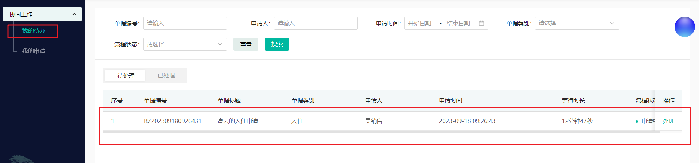

### 3.3 我的申请

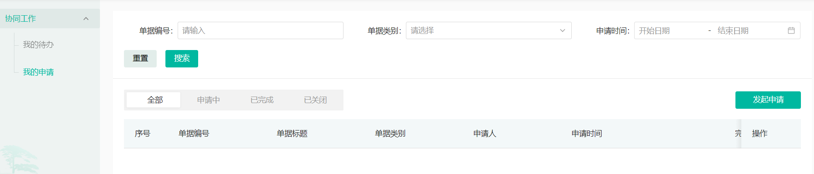

#### 3.3.1 接口定义

新增ApplicationsController类，直接调用actFlowCommService中myTaskInfoList方法即可

```java
package com.zzyl.controller;


import cn.hutool.core.bean.BeanUtil;
import com.zzyl.base.PageResponse;
import com.zzyl.base.ResponseResult;
import com.zzyl.dto.ApplicationsDto;
import com.zzyl.dto.PendingTasksDto;
import com.zzyl.entity.PendingTasks;
import com.zzyl.service.ActFlowCommService;
import com.zzyl.utils.UserThreadLocal;
import com.zzyl.vo.ApplicationsVo;
import io.swagger.annotations.Api;
import io.swagger.annotations.ApiOperation;
import org.springframework.beans.factory.annotation.Autowired;
import org.springframework.web.bind.annotation.PostMapping;
import org.springframework.web.bind.annotation.RequestBody;
import org.springframework.web.bind.annotation.RequestMapping;
import org.springframework.web.bind.annotation.RestController;

/**
* <p>
* applications 控制器实现
* </p>
*
* @author itheima
*/
@RestController
@RequestMapping("/applications")
@Api(tags = "我的申请")
public class ApplicationsController {

    @Autowired
    private ActFlowCommService actFlowCommService;

    @PostMapping("/selectByPage")
    @ApiOperation(value = "查询我的申请")
    public ResponseResult<ApplicationsVo> selectByPage(@RequestBody ApplicationsDto applicationsDto){

        Long mgtUserId = UserThreadLocal.getMgtUserId();
        applicationsDto.setApplicatId(mgtUserId);

        PendingTasksDto pendingTasksDto = BeanUtil.toBean(applicationsDto, PendingTasksDto.class);
        PageResponse<PendingTasks> pendingTasksPageResponse = actFlowCommService.getMyTaskList(pendingTasksDto);
        return ResponseResult.success(pendingTasksPageResponse);
    }

}
```

#### 3.3.2 业务层

在ActFlowCommServiceImpl类中的myTaskInfoList方法，修改代码，如果存在申请人id,则查询申请人，不然就是待办数据

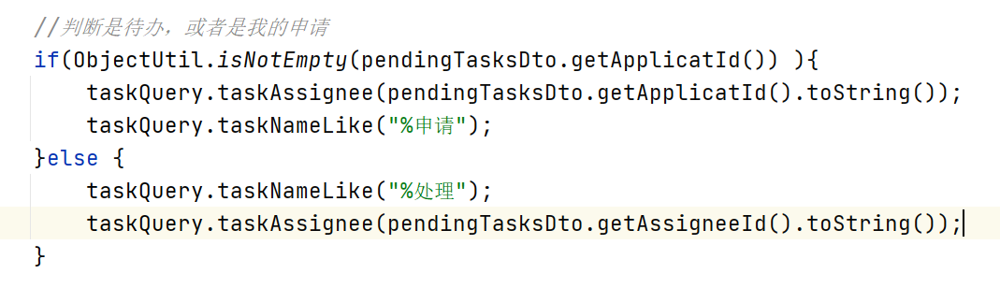

### 3.4 入住表单查询

#### 3.4.1 思路分析

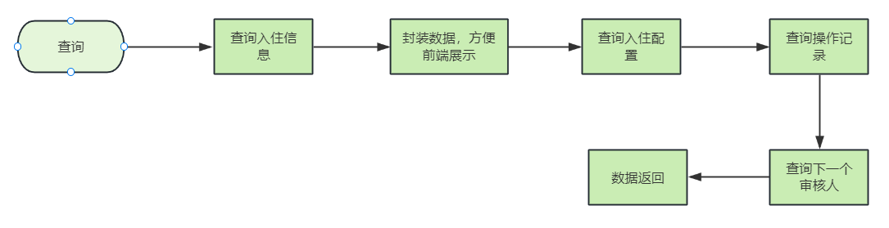

参数说明：

- db-flowStatus 数据库中存储的入住流程状态
- flowStatus 前端传递过来的流程状态
- taskId 当前登录人的任务id

#### 3.4.2 接口定义

```java
@GetMapping
@ApiOperation(value = "入住表单查询")
public ResponseResult<TasVo> getCheckIn(
        @RequestParam @ApiParam(value = "入住编码") String code,
        @RequestParam @ApiParam(value = "处理人ID") String assigneeId,
        @RequestParam @ApiParam(value = "流程状态") Integer flowStatus,
        @RequestParam(required = false) @ApiParam(value = "任务Id") String taskId) {
    return null;
}
```

TasVo

```java
package com.luckon.vo.retreat;

import com.luckon.entity.*;
import com.luckon.vo.CheckInVo;
import io.swagger.annotations.ApiModelProperty;
import lombok.Data;

import java.util.List;

/**
 * @author sjqn
 * @date 2023/6/20
 */
@Data
public class TasVo {

    /**
     * 入住信息
     */
    private CheckInVo checkIn;

    /**
     * 类型 1退住 2请假 3入住
     */
    private Integer type;

    private String nextApprover;

    /**
     * 审批记录
     */
    private List<AccraditationRecord> accraditationRecords;

    /**
     * 是否展示退住数据
     * 0:其他用户，审核中
     * 1:当前为审核人，可以正常查看数据
     */
    @ApiModelProperty(value = "是否展示入住数据")
    private Integer isShow;

}
```

#### 3.4.3 业务层开发

在CheckInService中新增方法，如下：

```java
/**
     * 查询入住信息
     * @param      * @param status
     * @param code
     * @return
     */
ResponseResult<TasVo> getCheckIn(String code, String assigneeId, Integer flowStatus, String taskId);
```

业务层代码：

```java
/**
     * 查询入住信息
     *
     * @param code
     * @param assigneeId
     * @param flowStatus
     * @param taskId
     * @return
     */
@Override
public ResponseResult<TasVo> getCheckIn(String code, String assigneeId, Integer flowStatus, String taskId) {

    //根据code查询入住单
    CheckIn checkIn = checkInMapper.selectByCheckInCode(code);
    CheckInVo checkInVo = BeanUtil.toBean(checkIn, CheckInVo.class);

    //封装数据，方便前端展示
    JSONObject jsonObject = JSON.parseObject(checkInVo.getOtherApplyInfo(), JSONObject.class);
    if (ObjectUtil.isNotEmpty(jsonObject)) {
        JSONObject otherApplyInfo = JSON.parseObject(jsonObject.getString("otherApplyInfo"), JSONObject.class);
        checkInVo.setOtherApplyInfo(otherApplyInfo.toString());

        List<MemberElderDto> memberElderDtos = JSON.parseArray(jsonObject.getString("memberElderDtos"), MemberElderDto.class);
        checkInVo.setMemberElderDtos(memberElderDtos);

        ElderDto elderDto1 = JSON.parseObject(jsonObject.getString("elderDto"), ElderDto.class);
        checkInVo.setElderDto(elderDto1);

        //取出url信息
        checkInVo.setUrl1(jsonObject.getString("url1"));
        checkInVo.setUrl2(jsonObject.getString("url2"));
        checkInVo.setUrl3(jsonObject.getString("url3"));
    }

    //如果flowStatus小于0，重新赋值
    if (flowStatus < 0) {
        flowStatus = checkIn.getFlowStatus();
    }
    //isShow字段：0 只展示操作记录，1：展示详细数据集操作记录
    Integer isShow = 1;
    int step = 1;
    if (ObjectUtil.isNotEmpty(taskId)) {
        //查询当前流程在第几步
        isShow = actFlowCommService.isCurrentUserAndStep(taskId, flowStatus, checkIn.getFlowStatus());
    }

    TasVo tasVo = new TasVo();

    // 默认显示入住申请基本信息数据
    checkInVo.setIsShow(isShow);
    tasVo.setCheckIn(checkInVo);
    tasVo.setIsShow(isShow);
    //流程类型：入住
    tasVo.setType(3);

    //审批记录数据
    List<AccraditationRecord> accraditationRecordList
        = accraditationRecordMapper.getAccraditationRecordByBuisId(checkIn.getId(), PendingTasksConstant.TASK_TYPE_CHECK_IN);
    tasVo.setAccraditationRecords(accraditationRecordList);

    return ResponseResult.success(tasVo);
}
```

为了方便封装老人的数据，我们可以在新增新增退住的时候，把老人的数据封装到**其他信息**字符串中保存到数据库中，修改申请入住代码，如下：

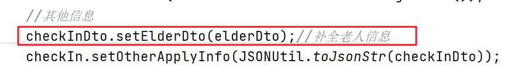

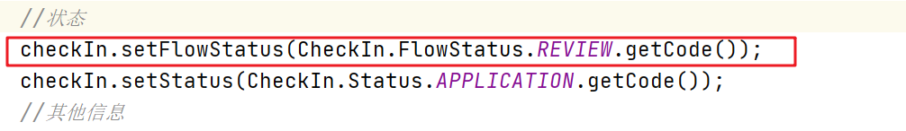

```java
/**
     * 判断当前操作的是第几步
     * @param taskId
     * @param flowStatus
     * @param dbFlowStatus
     * @return
     */
@Override
public Integer isCurrentUserAndStep(String taskId, Integer flowStatus, Integer dbFlowStatus) {

    //当前任务人的节点
    HistoricTaskInstance historicTaskInstance = historyService.createHistoricTaskInstanceQuery().taskId(taskId).singleResult();
    String formKey = historicTaskInstance.getFormKey();

    //如果前端传递的流程状态跟数据库一致，当前操作人的任务节点与状态一致
    if (dbFlowStatus.equals(flowStatus) && dbFlowStatus.equals(CheckIn.Status.APPLICATION.getCode())
        && formKey.equals(dbFlowStatus.toString())) {
        return 1;
    }
    return 0;
}
```

#### 3.4.4 控制层开发

```java
@GetMapping
@ApiOperation(value = "入住表单查询")
public ResponseResult<TasVo> getCheckIn(
        @RequestParam @ApiParam(value = "入住编码") String code,
        @RequestParam @ApiParam(value = "处理人ID") String assigneeId,
        @RequestParam @ApiParam(value = "流程状态") Integer flowStatus,
        @RequestParam(required = false) @ApiParam(value = "任务Id") String taskId) {
    return checkInService.getCheckIn(code, assigneeId, flowStatus, taskId);
}
```

#### 3.4.5 测试

护理组长登录之后，查看待办列表，点击”处理”按钮后，可以查看之前录入的数据

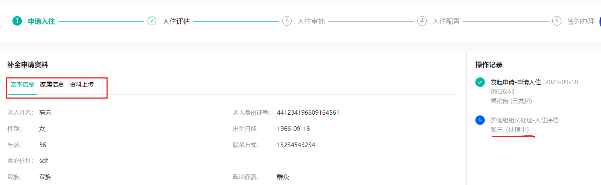

### 3.5 护理主管-评估

#### 3.5.1 思路分析

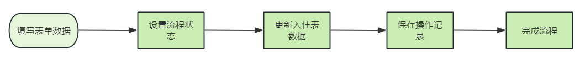

#### 3.5.2 接口定义

在CheckInController中新增接口，如下：

```java
@PostMapping("/review")
@ApiOperation(value = "评估", notes = "传入入住对象")
public ResponseResult review(
        @RequestBody @ApiParam(value = "入住对象", required = true) CheckInDto checkInDto) {
    return null;
}
```

#### 3.5.3 业务层开发

在CheckInService中新增方法，如下：

```java
/**
 * 评估
 * @param checkInDto
 * @return
 */
ResponseResult review(CheckInDto checkInDto);
```

实现类：

```java
/**
     * 评估
     * @param checkInDto
     * @return
     */
@Override
public ResponseResult review(CheckInDto checkInDto) {
    CheckIn checkIn = checkInMapper.selectByPrimaryKey(checkInDto.getId());
    checkIn.setFlowStatus(CheckIn.FlowStatus.APPROVAL.getCode());
    //保存健康评估数据
    checkIn.setReviewInfo(JSON.toJSONString(checkInDto));
    checkInMapper.updateByPrimaryKeySelective(checkIn);

    //  操作记录
    //从当前线程中获取用户数据
    String subject = UserThreadLocal.getSubject();
    User user = JSON.parseObject(subject, User.class);

    //完成流程
    actFlowCommService.completeProcess("", checkInDto.getTaskId(), user.getId().toString(), 1, null);

    //记录操作记录
    Long nextAssignee = actFlowCommService.getNextAssignee("checkIn-new", "checkIn-new:" + checkIn.getId());

    RecordVo recoreVo = getRecordVo(checkIn, user, AccraditationRecordConstant.AUDIT_STATUS_PASS,
                                    "同意", "护理部组长处理-入住评估",
                                    "院长处理-入住审批", nextAssignee
                                    , AccraditationRecordConstant.RECORD_HANDLE_TYPE_PROCESSED);
    accraditationRecordService.insert(recoreVo);

    return ResponseResult.success();
}
```

在ActFlowCommService中定义新的方法来完成任务

```java
/**
     * 完成任务
     * @param title  标题
     * @param taskId  任务id
     * @param userId  用户id
     * @param code   流程变量ops的值  1为同意，2为拒绝，3为驳回
     * @param status  审核状态  1，申请中  2 已完成   3  已关闭
     */
void completeProcess(String title, String taskId, String userId, Integer code, Integer status);
```

实现方法

```java
/**
     * 完成任务
     * @param title  标题
     * @param taskId  任务id
     * @param userId  用户id
     * @param code   流程变量ops的值  1为同意，2为拒绝，3为驳回
     * @param status  审核状态  1，申请中  2 已完成   3  已关闭
     */
@Override
public void completeProcess(String title, String taskId, String userId, Integer code, Integer status) {
    //任务Id 查询任务对象
    Task task = taskService.createTaskQuery().taskId(taskId).singleResult();

    if (task == null) {
        return;
    }

    //完成办理
    Map<String, Object> variables = new HashMap<>();
    if (ObjectUtil.isNotEmpty(status)) {
        variables.put("processStatus", status);
        variables.put("finishTime",LocalDateTime.now().toString());
    }
    if (ObjectUtil.isNotEmpty(title)) {
        variables.put("processTitle", title);
    }

    variables.put("ops", code);
    taskService.complete(taskId, variables);
}
```

#### 3.5.4 控制层开发

补全完善控制层代码：

```java
@PostMapping("/review")
@ApiOperation(value = "评估", notes = "传入入住对象")
public ResponseResult<CheckInVo> review(
        @RequestBody @ApiParam(value = "入住对象", required = true) CheckInDto checkInDto) {
    return checkInService.review(checkInDto);
}
```

#### 3.5.5 测试

使用护理组长账号登录，处理待办，提交表单，在数据库中查看是否保存成功

#### 3.5.6 补全入住表单查询

因为现在我们在入住表中新增了评估的内容，那么当用户会看之前的数据，比如评估的内容，我们就需要在表单中进行展示这部分内容，如下图

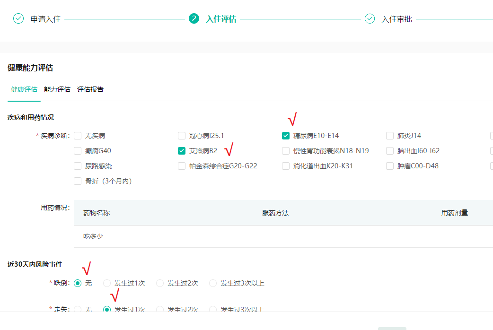

如果想要回显这些数据，我们就需要修改刚才开发的**入住表单查询**的这个业务逻辑

修改CheckInServiceImpl的getCheckIn方法，添加如下代码

```java
//查询入住评估内容
JSONObject reviewInfoJsonObj = JSON.parseObject(checkInVo.getReviewInfo());
if(ObjectUtil.isNotEmpty(reviewInfoJsonObj)){
    String reviewInfo = reviewInfoJsonObj.getString("reviewInfo");
    String reviewInfo1 = reviewInfoJsonObj.getString("reviewInfo1");
    String reviewInfo2 = reviewInfoJsonObj.getString("reviewInfo2");
    checkInVo.setReviewInfo(reviewInfo);
    checkInVo.setReviewInfo1(reviewInfo1);
    checkInVo.setReviewInfo2(reviewInfo2);
}
```

测试：我们在回看入住评估信息的时候，可以正常显示评估的数据

#### 3.5.6 修复数据展示（状态控制）

参数说明：

- taskId 从前端传递过来，当前登录人的任务，可能是历史任务（执行过的），也可能是未执行的任务

- flowStatus 从前端传递过来，用户在页面点击的流程节点

- dbFlowStatus 后端存储的流程状态，指的是当前待执行的节点

> 举例：当前数据库中待执行的节点为2（院长审批）
>
>- 院长查看表单
>

- 点击入住审批，可以查看表单数据，可以编辑数据，进行审核 taskId对应的formKey等于dbFlowStatus ,返回的isShow为1

> - 点击入住评估或者申请入住，可以查看表单数据，但是不能编辑，因为： dbFlowStatus不等于flowStatus，返回的isShow为1
>
>- 护理主管查看表单：
>
>

- 点击入住审批，只能查看操作记录，不能编辑数据 taskId对应的formKey不等于dbFlowStatus，返回的isShow为0

>
>  - 点击入住评估或者申请入住，可以查看表单数据，但是不能编辑，因为： dbFlowStatus不等于flowStatus，返回的isShow为1
>
>- 养老顾问查看表单：
>

- 点击入住审批，只能查看操作记录，不能编辑数据 taskId对应的formKey不等于dbFlowStatus，返回的isShow为0

> - 点击入住评估或者申请入住，可以查看表单数据，但是不能编辑，因为： dbFlowStatus不等于flowStatus，返回的isShow为1

在getCheckIn方法中添加如下逻辑

```java
if(flowStatus < 0){
    flowStatus = checkIn.getFlowStatus();
}

if(ObjectUtil.isNotEmpty(taskId)){
    isShow = actFlowCommService.isCurrentUserAndStep(taskId,flowStatus,checkIn.getFlowStatus());
}
```

修改isCurrentUserAndStep方法，添加参数、添加如下逻辑

```java
@Override
public Integer isCurrentUserAndStep(String taskId,Integer flowStatus, Integer dbFlowStatus) {
    HistoricTaskInstance historicTaskInstance = historyService.createHistoricTaskInstanceQuery().taskId(taskId).singleResult();
    String formKey = historicTaskInstance.getFormKey();
    //前端传递的流程状态与数据库中一致，有两种情况，是不是当前人的任务，如果是，则返回1，不是返回0
    if (flowStatus.equals(dbFlowStatus)) {
        if (formKey.equals(dbFlowStatus.toString())) {
            return 1;
        }
        return 0;
    }
    return 1;
}
```

### 3.6 副院长-同意

当护理组长提交了数据之后，现在使用副院长账号登录，在待办列表中可以查看需要待办的数据

副院长的主要职责就是审核单子，有三种情况，分别是：同意、拒绝、驳回

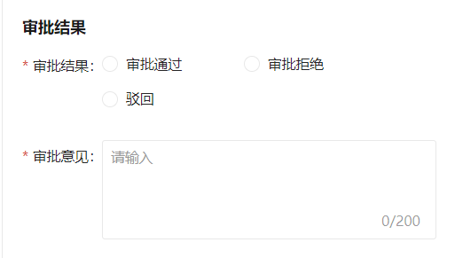

这三种情况，分别对应了不同的接口，处理逻辑也是不一样的，我们先来实现第一个：审批通过（同意）

#### 3.6.1 思路分析

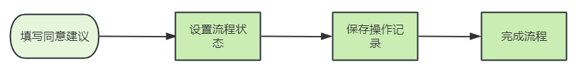

#### 3.6.2 接口定义

在CheckInController中新增接口，如下：

```java
@PutMapping("/submit")
@ApiOperation(value = "同意")
public ResponseResult submitCheckIn(
        @RequestParam @ApiParam(value = "入住Id") Long id,
        @RequestParam @ApiParam(value = "审批意见") String message,
        @RequestParam @ApiParam(value = "任务Id") String taskId) {
    return null;
}
```

#### 3.6.3 业务层开发

在CheckInService中新增方法，如下：

```java
/**
 * 同意入住申请
 * @param id
 * @return
 */
ResponseResult submitCheckIn(Long id, String info, String taskId);
```

实现类：

```java
/**
     * 同意入住申请
     * @param id
     * @param message
     * @param taskId
     * @return
     */
@Override
public ResponseResult submitCheckIn(Long id, String message, String taskId) {
    // 流程状态 操作记录
    CheckIn checkIn = checkInMapper.selectByPrimaryKey(id);
    //设置流程状态
    checkIn.setFlowStatus(CheckIn.FlowStatus.CONFIG.getCode());
    checkInMapper.updateByPrimaryKeySelective(checkIn);
    //  操作记录
    //从当前线程中获取用户数据
    String subject = UserThreadLocal.getSubject();
    User user = JSON.parseObject(subject, User.class);
    //完成任务
    actFlowCommService.completeProcess("", taskId, user.getId().toString(), 1, null);

    // 养老顾问
    CheckIn checkIn1 = checkInMapper.selectByPrimaryKey(checkIn.getId());
    Long userId = checkIn1.getApplicatId();
    RecordVo recoreVo = getRecordVo(checkIn,
                                    user,
                                    AccraditationRecordConstant.AUDIT_STATUS_PASS,
                                    message,
                                    "院长处理-入住审批",
                                    "养老顾问处理-入住配置",
                                    userId,
                                    AccraditationRecordConstant.RECORD_HANDLE_TYPE_AUDIT);
    accraditationRecordService.insert(recoreVo);
    return ResponseResult.success();
}
```

#### 3.6.4 控制层开发

补全完善控制层代码：

```java
@PutMapping("/submit")
@ApiOperation(value = "同意")
public ResponseResult submitCheckIn(
        @RequestParam @ApiParam(value = "入住Id") Long id,
        @RequestParam @ApiParam(value = "审批意见") String message,
        @RequestParam @ApiParam(value = "任务Id") String taskId) {
    return checkInService.submitCheckIn(id, message, taskId);
}
```

#### 3.6.5 测试

当审核成功以后，副院长可以在已处理列表中进行查看，分配给下一个处理人为：申请人（养老顾问）

### 3.7 副院长-拒绝

在副院长审核的时候，假如副院长感觉数据有问题，也可以拒绝审批，拒绝审批的是另外的一个接口

#### 3.7.1 思路分析

先打开，我们之前定义的流程，里面定义了两个网关，当拒绝的时候，ops为2

流程是：先走第一个网关，然后走第二个网关，最后结束流程即可

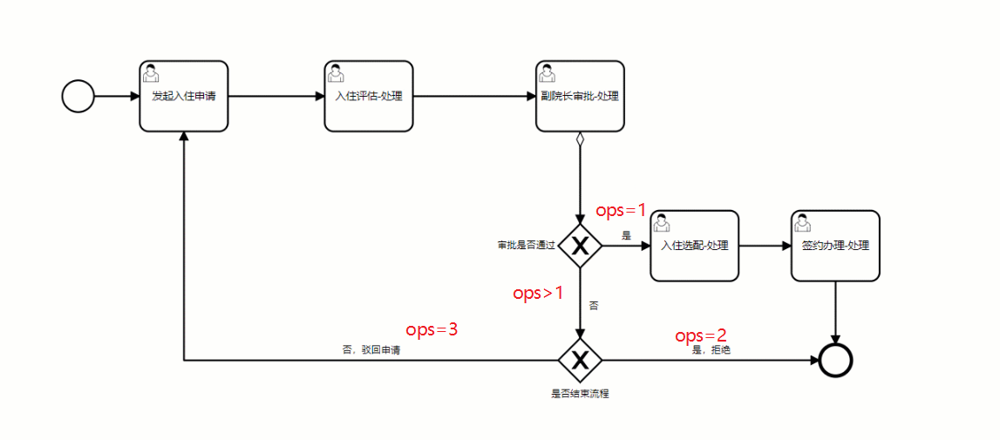

#### 3.7.2 接口定义

在CheckInController中新增接口，如下：

```java
@PutMapping("/reject")
@ApiOperation(value = "审核拒绝")
public ResponseResult auditReject(
        @RequestParam @ApiParam(value = "入住Id") Long id,
        @RequestParam @ApiParam(value = "拒绝原因") String message,
        @RequestParam @ApiParam(value = "任务Id") String taskId) {
    return null;
}
```

#### 3.7.3 业务层开发

在CheckInService中新增方法，如下：

```java
/**
 * 审核拒绝
 * @param id  入住单code
 * @param reject   拒绝原因
 * @return
 */
ResponseResult auditReject(Long id, String reject, String taskId);
```

实现类：

```java
/**
     * 拒绝
     * @param id
     * @param message
     * @param taskId
     * @return
     */
@Override
public ResponseResult auditReject(Long id, String message, String taskId) {
    //查询入住数据
    CheckIn checkIn = checkInMapper.selectByPrimaryKey(id);
    //设置流程状态
    checkIn.setFlowStatus(CheckIn.FlowStatus.CONFIG.getCode());
    checkIn.setStatus(CheckIn.Status.CLOSED.getCode());
    checkInMapper.updateByPrimaryKey(checkIn);
    //删除老人数据
    close(checkIn);

    String subject = UserThreadLocal.getSubject();
    User user = JSON.parseObject(subject, User.class);

    actFlowCommService.completeProcess("", taskId, user.getId().toString(), 2, CheckIn.Status.CLOSED.getCode());

    //记录操作记录
    RecordVo recoreVo = getRecordVo(checkIn,
                                    user,
                                    AccraditationRecordConstant.AUDIT_STATUS_REJECT,
                                    message,
                                    "院长处理-入住审批",
                                    "",
                                    null,
                                    AccraditationRecordConstant.RECORD_HANDLE_TYPE_PROCESSED);
    accraditationRecordService.insert(recoreVo);

    return ResponseResult.success();
}

private void close(CheckIn checkIn){
    elderService.deleteByPrimaryKey(checkIn.getElderId());
}
```

为了方便展示任务列表（我的待办和我的申请），在任务已关闭或者已完成之后需要返回完成时间

第一，修改ActFlowCommServiceImpl中的completeProcess方法，如果审核状态不为空，则需要设置完成时间到流程变量中

```java
if (ObjectUtil.isNotEmpty(status)) {
    variables.put("processStatus", status);
    variables.put("finishTime",LocalDateTime.now().toString());
}
```

第二，修改ActFlowCommServiceImpl中的getMyTaskList方法，在返回数据中添加如下代码

```java
//如果审核状态为已关闭或已完成，则需要返回完成时间
if(pendingTasks.getStatus().equals(PendingTasksConstant.TASK_STATUS_CLOSED) 
|| pendingTasks.getStatus().equals(PendingTasksConstant.TASK_STATUS_FINISHED)){
    LocalDateTime finishTime = LocalDateTimeUtil.parse(processVariables.get("finishTime").toString());
    pendingTasks.setFinishTime(finishTime);
}
```

#### 3.7.4 控制层开发

补全完善控制层代码：

```java
@PutMapping("/reject")
@ApiOperation(value = "审核拒绝")
public ResponseResult auditReject(
        @RequestParam @ApiParam(value = "入住Id") Long id,
        @RequestParam @ApiParam(value = "拒绝原因") String message,
        @RequestParam @ApiParam(value = "任务Id") String taskId) {
    return checkInService.auditReject(id, message, taskId);
}
```

#### 3.7.5 测试

当拒绝之后，申请人查看数据，当前入住单已经结束，老人数据清空。

