# 协同-入住申请

## 1 目标

在前两天中，我们已经对入住的整体业务分析完毕了，并且创建了对应的表结构，也开发了其中的部分接口，今天我们会继续开发入住相关的接口。

今日的目标是：

- 独立完成副院长审批的驳回、撤回接口的开发
- 独立完成养老顾问-入住配置的接口开发
- 独立完成法务-签约办理的接口开发
- 独立完成入住管理查询的接口开发

## 2 接口分析

我们今天会开发6个接口，分别是

- 副院长-驳回
- 副院长-撤回
- 申请人-撤销
- 养老顾问-入住配置
- 法务-签约办理
- 入住管理查询

### 2.1 副院长-驳回

**接口地址**:`/checkIn`

**请求方式**:`PUT`

**请求参数**:

| 参数名称    | 参数说明 | 数据类型   |
|---------|------|--------|
| id      | 入住Id | long   |
| message | 驳回消息 | string |
| taskId  | 任务Id | string |

**响应示例**:

```javascript
{
    "code"
:
    200,
        "msg"
:
    "操作成功",
}
```

### 2.2 副院长-撤回

**接口地址**:`/checkIn/revocation`

**请求方式**:`PUT`

**请求参数**:

| 参数名称       | 参数说明 | 数据类型   |
|------------|------|--------|
| flowStatus | 流程状态 | int    |
| id         | 入住Id | long   |
| taskId     | 任务Id | string |

**响应示例**:

```javascript
{
    "code"
:
    200,
        "msg"
:
    "操作成功",
}
```

### 2.3 申请人-撤销

**接口地址**:`/checkIn/cancel`

**请求方式**:`PUT`

**请求参数**:

| 参数名称   | 参数说明 | 数据类型   |
|--------|------|--------|
| id     | 入住Id | long   |
| taskId | 任务ID | string |

**响应示例**:

```javascript
{
    "code"
:
    200,
        "msg"
:
    "操作成功",
}
```

### 2.4 养老顾问-入住配置

**接口地址**:`/checkIn`

**请求方式**:`POST`

**请求示例**:

```javascript
{
    "bedCost"
:
    4500,//床位费用
        "bedId"
:
    "6",//床位Id
        "bedNumber"
:
    "104-2",//床位编号
        "checkInEndTime"
:
    "2024-10-20 00:00:00",//入住结束时间
        "checkInId"
:
    182,//入住id
        "checkInStartTime"
:
    "2023-10-20 00:00:00",//入住开始时间
        "code"
:
    "104",//房间编号
        "costEndTime"
:
    "2023-11-20 00:00:00"//,费用开始时间
    "costStartTime"
:
    "2023-10-20 00:00:00",//费用结束时间
        "depositAmount"
:
    "3000.00",//押金金额
        "elderId"
:
    "143",//老人id
        "floorId"
:
    "1",//楼层id
        "floorName"
:
    "1楼",//楼层名称
        "id"
:
    null,
        "nursingCost"
:
    1000,//护理费用
        "nursingLevelId"
:
    "4",//护理等级Id
        "roomId"
:
    "4",//房间id
        "taskId"
:
    "a1ceddf0-6f5b-11ee-bda6-5405db5be13e"//任务id
}
```

**响应示例**:

```javascript
{
    "code"
:
    200, "msg"
:
    "操作成功"
}
```

### 2.5 法务-签约办理

**接口地址**:`/checkIn/sign`

**请求方式**:`POST`

**请求示例**:

```javascript
{
    "checkInId"
:
    182,//入住id
        "contractNo"
:
    "HT202310202317241",//合同编号
        "endTime"
:
    "2024-10-20 00:00:00",//入住结束时间
        "memberName"
:
    "仁爱",//签约人（家属）
        "memberPhone"
:
    "13211222333",//家属手机号
        "name"
:
    "仁和的入住合同",//合同名称
        "pdfUrl"
:
    "https://itheim.oss-cn-beijing.aliyuncs.com/70c3a212-7b61-4476-9d13-c47a09babb2d.pdf",//合同链接
        "signDate"
:
    "2023-10-20 00:00:00",//签约时间
        "startTime"
:
    "2023-10-20 00:00:00",//入住开始时间
        "taskId"
:
    "c57f5f43-6f5b-11ee-bda6-5405db5be13e"//任务id
}
```

**响应示例**:

```javascript
{
    "code"
:
    200, "msg"
:
    "操作成功"
}
```

### 2.6 入住管理查询

**接口地址**:`/checkIn/selectByPage`

**请求方式**:`GET`

**请求参数**:

| 参数名称        | 参数说明 | 数据类型   |
|-------------|------|--------|
| checkInCode | 入住编码 | string |
| endTime     | 结束时间 | long   |
| idCardNo    | 身份证号 | string |
| name        | 姓名   | string |
| pageNum     | 页码   | int    |
| pageSize    | 每页数量 | int    |
| startTime   | 开始时间 | long   |

**响应示例**:

```javascript
{
    "code"
:
    200,
        "msg"
:
    "操作成功",
        "data"
:
    {
        "total"
    :
        "9",
            "pageSize"
    :
        10,
            "pages"
    :
        "1",
            "page"
    :
        1,
            "records"
    :
        [
            {
                "id": "182",
                "createTime": "2023-10-20 23:15:20",
                "remark": "HT202310202317241",
                "checkInCode": "RZ202310202315191",
                "title": "仁和的入住申请",
                "elderDto": {
                    "id": "182",
                    "name": "仁和",
                    "status": 2,
                    "idCardNo": "132123196612091234"
                },
                "elderId": "143",
                "counselor": "养老顾问",
                "checkInTime": "2023-10-20 00:00:00",
                "applicat": "养老顾问",
                "deptNo": "100001006000000",
                "applicatId": "1671403256519078161",
                "flowStatus": 4,
                "status": 2,
                "bedVo": {
                    "id": "182",
                    "bedNumber": "104-2",
                    "status": 0
                }
            }
        ]
    }
}
```

## 3 接口功能开发

### 3.1 副院长-驳回

#### 3.1.1 思路分析

工作流程


实现流程

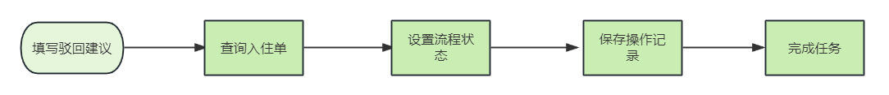

#### 3.1.2 接口定义

在CheckInController中新增方法，如下：

```java
@PutMapping
@ApiOperation(value = "驳回")
public ResponseResult disapprove(
        @RequestParam @ApiParam(value = "入住Id") Long id,
        @RequestParam @ApiParam(value = "驳回消息") String message,
        @RequestParam @ApiParam(value = "任务Id") String taskId) {
    return null;
}
```

#### 3.1.3 业务层开发

在CheckInService中新增方法，如下：

```java
/**
 * 驳回
 * @param id
 * @return
 */
ResponseResult disapprove(Long id, String message, String taskId);
```

实现方法：

```java
/**
     * 驳回
     * @param id
     * @param message
     * @param taskId
     * @return
     */
@Override
public ResponseResult disapprove(Long id, String message, String taskId) {

    // 流程状态 操作记录
    CheckIn checkIn = checkInMapper.selectByPrimaryKey(id);
    //设置流程状态
    checkIn.setFlowStatus(CheckIn.FlowStatus.APPLY.getCode());
    //清除健康评估数据
    checkIn.setReviewInfo(null);
    checkInMapper.updateByPrimaryKeySelective(checkIn);
    //清理老人数据
    close(checkIn);
    //  操作记录
    //从当前线程中获取用户数据
    String subject = UserThreadLocal.getSubject();
    User user = JSON.parseObject(subject, User.class);
    //完成任务
    actFlowCommService.completeProcess("", taskId, user.getId().toString(), 3, null);

    //保存审核记录
    RecordVo recoreVo = getRecordVo(checkIn,
                                    user,
                                    AccraditationRecordConstant.AUDIT_STATUS_DISAPPROVE,
                                    message, "驳回申请-入住审批", "养老顾问处理-入住申请",
                                    checkIn.getApplicatId(),
                                    AccraditationRecordConstant.RECORD_HANDLE_TYPE_PROCESSED);
    accraditationRecordService.insert(recoreVo);

    return ResponseResult.success();
}
```

这里的完成任务以后，回到了首页点，需要删除之前遗留的历史记录，所以在完成任务的代码中需要添加删除的逻辑

修改completeProcess方法，在任务之心之前添加如下代码

```java
//任务对象  获取流程实例Id
String processInstanceId = task.getProcessInstanceId();

Authentication.setAuthenticatedUserId(userId);
//如果是驳回，则需要删除流程实例的任务记录
HistoricTaskInstanceQuery historicTaskInstanceQuery = historyService.createHistoricTaskInstanceQuery().processInstanceId(processInstanceId);
List<HistoricTaskInstance> list = historicTaskInstanceQuery.list();
if (CollUtil.isNotEmpty(list)) {
    list.forEach(v -> {
        //删除当前任务之后的任务记录，不然可能会存在多条数据
        if (v.getFormKey().equals((Integer.parseInt(task.getFormKey()) + 1) + "")) {
            historyService.deleteHistoricTaskInstance(v.getId());
        }
        //如果状态为驳回，则删除第一个节点的任务记录，因为完成任务后，会重新分配一个任务
        if (code.equals(3) && ("0".equals(v.getFormKey()))) {
            historyService.deleteHistoricTaskInstance(v.getId());
        }
    });
}
```

#### 3.1.4 申请入住修正，添加修改逻辑

```java
/**
 * 入住申请
 *
 * @param checkInDto
 * @return
 */
@Override
public ResponseResult createCheckIn(CheckInDto checkInDto) {

    //1.检验老人是否是入住中
    ElderVo elderVo = elderService.selectByIdCardAndName(checkInDto.getElderDto().getIdCardNo(), checkInDto.getElderDto().getName());
    if (null != elderVo && elderVo.getStatus().equals(4)) {
        return ResponseResult.error(checkInDto.getElderDto().getName() + "已经发起了入住申请");
    }

    //2.保存老人数据
    ElderDto elderDto = BeanUtil.toBean(checkInDto.getElderDto(), ElderDto.class);

    //年龄、性别、头像
    elderDto.setImage(checkInDto.getUrl1());
    /* JSONObject jsonObject = BeanUtil.toBean(checkInDto.getOtherApplyInfo(), JSONObject.class);*/
    JSONObject jsonObject = JSON.parseObject(checkInDto.getOtherApplyInfo());
    elderDto.setSex(jsonObject.getInteger("sex").toString());
    elderDto.setAge(jsonObject.getInteger("age").toString());

    //保存老人数据
    Elder elder = elderService.insert(elderDto);

    String subject = UserThreadLocal.getSubject();
    User user = JSONUtil.toBean(subject, User.class);

    CheckIn checkIn = null;
    //如果入住id不为空，则需要修改，否则是保存
    if(checkInDto.getId() != null){
        //修改
        checkIn = checkInMapper.selectByPrimaryKey(checkInDto.getId());
        //其他信息
        checkInDto.setElderDto(elderDto);
        checkIn.setOtherApplyInfo(JSONUtil.toJsonStr(checkInDto));
        //标题
        checkIn.setTitle(elder.getName() + "的入住申请");
        checkIn.setElderId(elder.getId());
        //状态
        checkIn.setFlowStatus(CheckIn.FlowStatus.REVIEW.getCode());
        checkInMapper.updateByPrimaryKeySelective(checkIn);

    }else {
        //保存
        checkIn = new CheckIn();
        //编号
        String code = CodeUtil.generateCode(CHECK_IN_CODE_PREFIX, redisTemplate, 5);
        checkIn.setCheckInCode(code);
        //标题
        checkIn.setTitle(elder.getName() + "的入住申请");
        checkIn.setElderId(elder.getId());
        //获取当前登录人的信息
        checkIn.setCounselor(user.getRealName());
        checkIn.setApplicat(user.getRealName());
        checkIn.setApplicatId(user.getId());
        checkIn.setDeptNo(user.getDeptNo());
        //状态
        checkIn.setFlowStatus(CheckIn.FlowStatus.REVIEW.getCode());
        checkIn.setStatus(CheckIn.Status.APPLICATION.getCode());
        //其他信息
        checkInDto.setElderDto(elderDto);
        checkIn.setOtherApplyInfo(JSONUtil.toJsonStr(checkInDto));

        checkInMapper.insert(checkIn);
    }


    //5.启动流程实例 或者 完成流程
    if(ObjectUtil.isNotEmpty(checkInDto.getTaskId())){
        //完成任务
        actFlowCommService.completeProcess(checkIn.getTitle(),checkInDto.getTaskId(),user.getId().toString(),1,checkIn.getStatus());
    }else {
        //4.准备流程变量的参数 map
        Map<String, Object> variables = setVariables(checkIn);
        // 业务相关，登录用户相关、processDefinitionKey(checkIn-new)、首节点是否自动执行
        actFlowCommService.start(checkIn.getId(), user, "checkIn-new", variables, true);
    }


    //获取下一个审核人
    Long nextAssignee = actFlowCommService.getNextAssignee("checkIn-new", "checkIn-new:" + checkIn.getId());

    //6.保存操作记录
    RecordVo recordVo = getRecordVo(
            checkIn, user, AccraditationRecordConstant.AUDIT_STATUS_PASS,
            "同意", "发起申请-申请入住", "护理组组长处理-入住评估",
            nextAssignee
            , AccraditationRecordConstant.RECORD_HANDLE_TYPE_PROCESSED
    );

    accraditationRecordService.insert(recordVo);

    return ResponseResult.success();

}
```

#### 3.1.5 控制层开发

在控制层中补全代码，如下：

```java
@PutMapping
@ApiOperation(value = "驳回")
public ResponseResult disapprove(
        @RequestParam @ApiParam(value = "入住Id") Long id,
        @RequestParam @ApiParam(value = "驳回消息") String message,
        @RequestParam @ApiParam(value = "任务Id") String taskId) {
    return checkInService.disapprove(id, message, taskId);
}
```

#### 3.1.6 测试

使用申请人（养老顾问）账号登录，查看我的申请，可以看到单子已经回到第一步，重新开始

### 3.2 副院长-撤回

#### 3.2.1 思路分析

我们先来搞明白什么是撤回？

我们现在有这么一个流程，如下图：

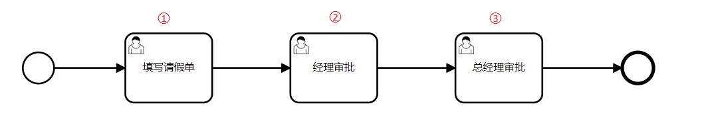

- 在这个图中，申请人填写申请单，不是审批操作不能撤回
- 经理审批属于审批操作，可以撤回，撤回的条件是：**第二步审核完成，第三步还没有开始审核**
- 总经理审批完成后会自动完成流程，也不能撤回

那现在我们分析入住的流程图：

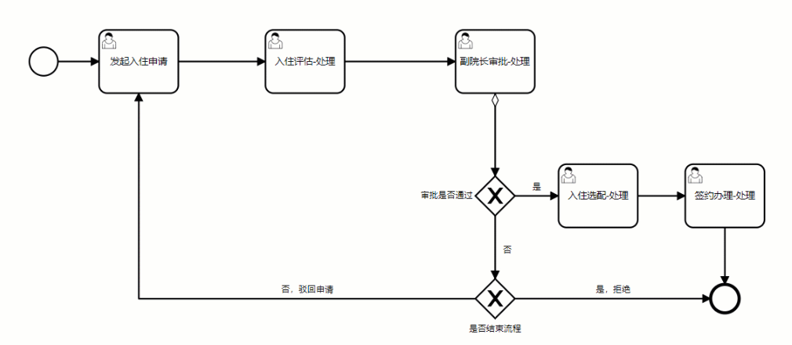

在当前的流程图中，只有**副院长审批-处理**是审批操作，也只能这一步有撤回的操作。从上面流程图中，我们可以看出，并不能使用流程变量或网关来实现撤回的操作，那该怎么实现呢？

我们都知道，流程图的执行，都是基于bpmn文件来按照流程执行的，bpmn文件其实就是一个xml文件。所以我们的实现思路是，在启动的流程实例中，
**动态的去改变连线的指向**来实现撤回，如下图：

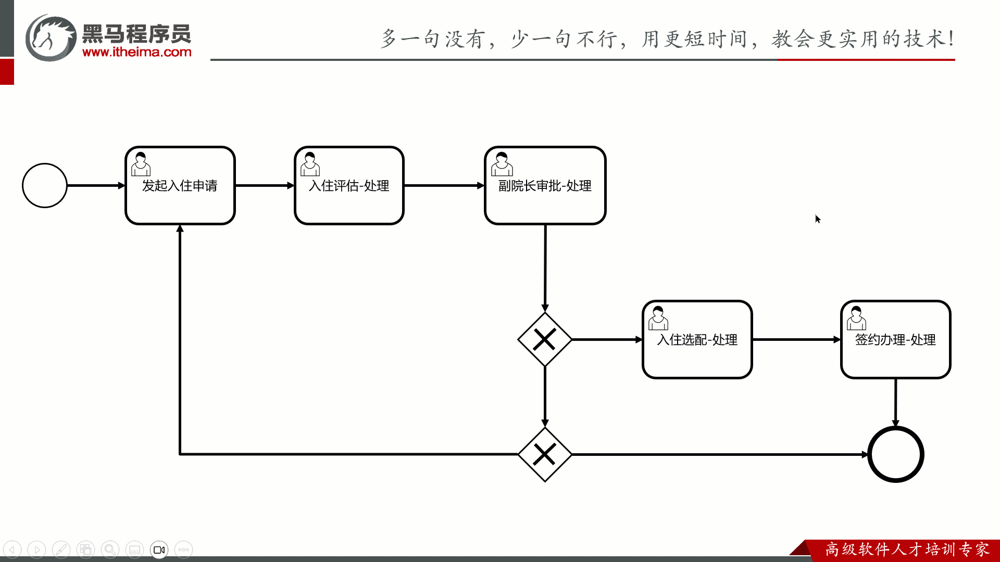

- 首先找到当前待执行的节点（入住选配-处理），再找到要撤回到的节点（副院长审批-处理）
- 把**入住评估-处理**和**副院长审批-处理**的**连线**的入口节点设置为**入住选配-处理**
- 完成当前节点任务（入住选配-处理）
- 恢复之前的两个连线（连线重新指向后会替换之前的指向）

#### 3.2.2 撤回按钮的显示

目前只有副院长审核之后，养老顾问审核之前，才会显示撤回按钮，我们需要在之前定义的**查询入住信息**的业务层代码中添加如下代码：

修改ActFlowCommServiceImpl中的isCurrentUserAndStep方法，添加返回2的逻辑

```java
@Override
public Integer isCurrentUserAndStep(String taskId,Integer flowStatus, Integer dbFlowStatus) {
    HistoricTaskInstance historicTaskInstance = historyService.createHistoricTaskInstanceQuery().taskId(taskId).singleResult();
    String formKey = historicTaskInstance.getFormKey();
    //前端传递的流程状态与数据库中一致，有两种情况，是不是当前人的任务，如果是，则返回1，不是返回0
    if (flowStatus.equals(dbFlowStatus)) {
        if (formKey.equals(dbFlowStatus.toString())) {
            return 1;
        }
        return 0;
    }

    if(formKey.equals((dbFlowStatus - 1)+"")){
        return 2;
    }

    return 1;
}
```

修改CheckInServiceImpl中的getCheckIn方法，添加如下代码

```java
//是否显示撤回按钮
boolean isRevocation = false;
if(isShow == 2 && checkIn.getStatus().equals(CheckIn.Status.APPLICATION.getCode())){
    isRevocation = true;
}

if(isShow == 2 ){
    isShow = 1;
}

tasVo.setIsShow(isShow);
tasVo.setIsRevocation(isRevocation);
```

目前已经跟前端开发沟通完毕，是否显示撤回按钮的标识就是TasVo中的属性isRevocation

```java
/**
 * 是否显示撤回
 */
@ApiModelProperty(value = "是否显示撤回")
private Boolean isRevocation;
```

展示效果：

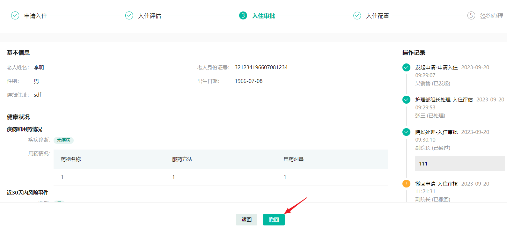

#### 3.2.3 接口定义

在CheckInController中新增方法，

```java
@PutMapping("/revocation")
@ApiOperation(value = "撤回")
public ResponseResult revocation(
        @RequestParam @ApiParam(value = "入住Id") Long id,
        @RequestParam @ApiParam(value = "流程状态") Integer flowStatus,
        @RequestParam @ApiParam(value = "任务Id") String taskId) {
    return null;
}
```

#### 3.2.4 业务层开发

在CheckInService中新增方法，如下：

```java
/**
 * 撤回
 * @param id
 * @param flowStatus
 * @return
 */
ResponseResult revocation(Long id, Integer flowStatus, String taskId);
```

实现方法：

```java
/**
     * 撤回
     * @param id
     * @param flowStatus
     * @param taskId
     * @return
     */
@Override
public ResponseResult revocation(long id, int flowStatus, String taskId) {
    //查询流程
    CheckIn checkIn = checkInMapper.selectByPrimaryKey(id);
    checkIn.setFlowStatus(checkIn.getFlowStatus() - 1);
    checkInMapper.updateByPrimaryKeySelective(checkIn);

    //  操作记录
    //从当前线程中获取用户数据
    String subject = UserThreadLocal.getSubject();
    User user = JSON.parseObject(subject, User.class);

    //获取枚举中的数据
    //第一个参数是条件，第二个参数为匹配到的值
    String name = EnumUtil.getBy(CheckIn.FlowStatus::getCode, checkIn.getFlowStatus()).getName();

    RecordVo recoreVo = getRecordVo(checkIn,
                                    user,
                                    AccraditationRecordConstant.AUDIT_STATUS_WITHDRAWS,
                                    "撤回",
                                    "撤回申请-" + name, "",
                                    user.getId(),
                                    AccraditationRecordConstant.RECORD_HANDLE_TYPE_PROCESSED);
    accraditationRecordService.insert(recoreVo);

    //撤回
    actFlowCommService.withdrawTask(taskId,false);


    return ResponseResult.success();
}
```

actFlowCommService中的方法withdrawTask，我们直接从讲义中**拷贝**过来即可，**无需大家编写**
，因为里面都是对节点的连线的操作，原理就是对bpmn文件xml的操作

新增撤回方法

在ActFlowCommService新增一个方法

```java
/**
 * 撤回任务
 *
 * @param taskId
 * @param first  是否默认退回流程第一个节点，true 是,false默认是上一个节点，
 */
public void withdrawTask(String taskId, boolean first)
```

实现方法，注意导包的时候，全部选择与activti有关联的包进行导入

```java
/**
 * 撤回任务
 *
 * @param taskId
 * @param first  是否默认退回流程第一个节点，true 是,false默认是上一个节点，
 */
@Override
public void withdrawTask(String taskId, boolean first) {
    anyJump(taskId, first);
}

/**
 * 跳转任意节点
 *
 * @param taskId 当前操作节点
 * @param first  是否默认第一 是否驳回
 */
@Override
public void anyJump(String taskId, boolean first) {
    HistoricTaskInstance historicTaskInstance = historyService.createHistoricTaskInstanceQuery().taskId(taskId).singleResult();
    //实例定义id：checkIn:1:0f97a26d-5697-11ee-bf3f-5405db5be13e
    String processDefinitionId = historicTaskInstance.getProcessDefinitionId();
    //实例id：16ea626d-5755-11ee-849a-5405db5be13e
    String processInstanceId = historicTaskInstance.getProcessInstanceId();
    // 对上一个节点和发起节点的支持:Activity_0pnd103
    String activityId = null;
    //找到需要驳回的节点中，比如：现在是：养老顾问-入住配置，那么要找的就是上一个节点：副院长-审批
    HistoricActivityInstance targetActivity = getRejectTargetActivity(null, processInstanceId, first);
    if (targetActivity != null) {
        activityId = targetActivity.getActivityId();
    }
    if (StrUtil.isEmpty(activityId)) {
        return;
    }
    try {
        //获取流程中的bpmn文件
        BpmnModel bpmnModel = repositoryService.getBpmnModel(processDefinitionId);
        //流程实例
        Process process = bpmnModel.getMainProcess();
        // 解析调整的目标节点
        //找到目标节点  -->  副院长-审批
        FlowNode targetFlowNode = (FlowNode) process.getFlowElement(activityId);
        //找到当前节点的所有连线
        List<SequenceFlow> incomingFlows = targetFlowNode.getIncomingFlows();

        List<SequenceFlow> targetSequenceFlow = new ArrayList<>();
        //遍历所有连线
        for (SequenceFlow incomingFlow : incomingFlows) {
            //连线的入节点
            FlowNode source = (FlowNode) incomingFlow.getSourceFlowElement();
            List<SequenceFlow> sequenceFlows;
            if (source instanceof ParallelGateway) {// 如果是并行网关同级节点，则跳转到所有节点
                sequenceFlows = source.getOutgoingFlows();
            } else {
                sequenceFlows = source.getOutgoingFlows();// 否则直接跳转到对应节点，包括为执行过的节点
            }
            targetSequenceFlow.addAll(sequenceFlows);
        }
        //获取当前任务中的所有待执行的任务
        List<Task> list = taskService.createTaskQuery().processInstanceId(processInstanceId).list();
        for (Task t : list) {
            //把一个任务动态转向目标节点
            //参数1：目标节点   参数2：当前任务   参数3：当前任务id    参数4:目标节点所有连线   参数5：默认flase，找上一个节点
            trunToTarget(process, t, first ? taskId : list.get(0).getId(), targetSequenceFlow, first);
        }
        if (!first) { // 撤回 删除最后的节点
            historyService.deleteHistoricTaskInstance(taskId);
            hiActinstMapper.deleteHiActivityInstByTaskId(taskId);
        } else {
            // 撤回 删除第一个
            List<HistoricTaskInstance> list1 = historyService.createHistoricTaskInstanceQuery().processInstanceId(processInstanceId).finished().orderByTaskCreateTime().asc().list();
            if (CollUtil.isNotEmpty(list1)) {
                HistoricTaskInstance firstTask = list1.get(0);
                historyService.deleteHistoricTaskInstance(firstTask.getId());
            }
        }
    } catch (Exception e) {
        e.printStackTrace();
    }
}

/**
 * 把一个任务动态转向目标节点
 * @param process   目标节点
 * @param task  当前任务
 * @param taskId             当前任务id
 * @param targetSequenceFlow  目标节点所有连线
 * @param first  默认flase，找上一个节点
 */
private void trunToTarget(Process process, TaskInfo task, String
        taskId, List<SequenceFlow> targetSequenceFlow, boolean first) {

    //当前节点:入住选配-处理
    FlowNode curFlowNode = (FlowNode) process.getFlowElement(task.getTaskDefinitionKey());
    if (curFlowNode == null) {
        //遍历节点中的所有子模块
        for (FlowElement flowElement : process.getFlowElements()) {
            if (flowElement instanceof SubProcess) {
                SubProcess subProcess = (SubProcess) flowElement;
                FlowElement fe = subProcess.getFlowElement(task.getTaskDefinitionKey());
                if (fe != null) {
                    curFlowNode = (FlowNode) fe;
                    break;
                }
            }
        }
    }
    //备份原始连线
    List<SequenceFlow> tempOutgoingSequenceFlows = new ArrayList<>(curFlowNode.getOutgoingFlows());
    //最新任务id与要删除的id一致
    if (taskId.equals(task.getId())) {
        //当前节点设置流出的连线
        curFlowNode.setOutgoingFlows(targetSequenceFlow);
        //完成当前任务
        taskService.complete(task.getId());
        if (!first) {
            //删除任务实例
            historyService.deleteHistoricTaskInstance(task.getId());
            //删除历史任务
            hiActinstMapper.deleteHiActivityInstByTaskId(task.getId());
        }
    }
    //恢复之前的连线
    curFlowNode.setOutgoingFlows(tempOutgoingSequenceFlows);
}

/**
 * 获取历史撤回或回退目标节点,支持上一节点，第一个节点
 *
 * @param taskId            要回退的taskId
 * @param processInstanceId
 * @return
 */
private HistoricActivityInstance getRejectTargetActivity(String taskId, String processInstanceId, boolean first) {

    HistoricActivityInstance targetActivity = null;
    HistoricActivityInstanceQuery query = historyService.createHistoricActivityInstanceQuery().processInstanceId(processInstanceId).activityType("userTask");

    // 取得所有历史任务按时间降序排序
    List<HistoricActivityInstance> historicActivityInstances = null;
    if (first) {// 退到第一个节点
        historicActivityInstances = query.orderByHistoricActivityInstanceStartTime().asc().list();
        return historicActivityInstances.get(0);
    } else { // 找到最近一个节点
        historicActivityInstances = query.orderByHistoricActivityInstanceStartTime().desc().list();
    }

    if (CollectionUtils.isEmpty(historicActivityInstances) || historicActivityInstances.size() < 2) {
        return null;
    }
    if (!StringUtils.isBlank(taskId)) {
        return targetActivity;
    }
    // 不传活动id的情况直接找第一个任务
    // 最后一条是当前正在进行的任务 需要找到最近的但是名称和当前任务不一样的任务去撤回
    HistoricActivityInstance current = historicActivityInstances.get(0);
    for (HistoricActivityInstance historicActivityInstance : historicActivityInstances) {
        if (!current.getActivityId().equals(historicActivityInstance.getActivityId())) {
            if (historicActivityInstance.getActivityType().equals("userTask")) {
                targetActivity = historicActivityInstance;
                break;
            }
        }
    }
    return targetActivity;
}
```

#### 3.2.5 控制层开发

补全控制层的代码，如下：

```java
@PutMapping("/revocation")
@ApiOperation(value = "撤回")
public ResponseResult revocation(
        @RequestParam @ApiParam(value = "入住Id") Long id,
        @RequestParam @ApiParam(value = "流程状态") Integer flowStatus,
        @RequestParam @ApiParam(value = "任务Id") String taskId) {
    return checkInService.revocation(id, flowStatus, taskId);
}
```

#### 3.2.6 测试

副院长审批-处理节点处理完成之后，我们回到审核页面，点击撤回按钮，入住单就由已处理变为了未处理

### 3.3 申请人-撤销

#### 3.3.1 思路分析

在我的申请列表中，当单子还是申请中，申请人是可以撤销的，如下图

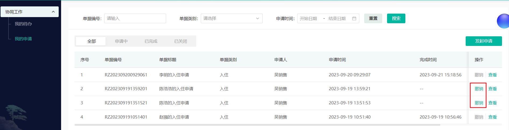

- 当点击了撤销之后，此流程结束

- 撤销后的申请，发起人和审批人无法对表单和审批结果进行任何操作

- 若部分审批人已通过，发起人撤销了，在数据在已审批列表中，不消失

我们的整体实现思路是这样，如下面动图

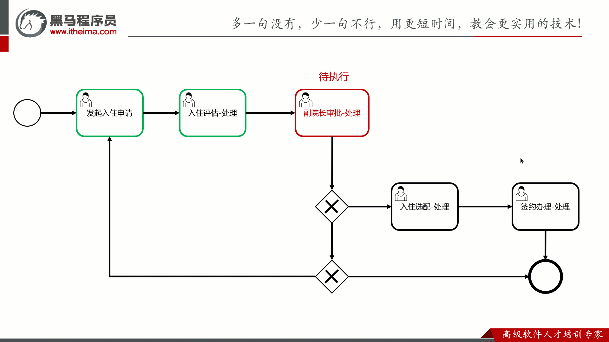

- 假如这个单子已经走到了”副院长审批-处理”，还未处理

- 申请人发起了撤销操作

- 没有执行的节点有三个，分别是：副院长审批-处理、入住选配-处理、签约办理-处理

- 先设置流程变量为3，表示入住单已经结束，方便查询
- 删除流程实例，效果就是：没执行的节点直接不会执行，已执行的节点会保留历史记录

#### 3.3.2 接口定义

在CheckInController中新增方法，如下

```java
@PutMapping("/cancel")
@ApiOperation(value = "撤销")
public ResponseResult cancel(@RequestParam @ApiParam(value = "入住Id") Long id,
                         @RequestParam @ApiParam(value = "任务ID") String taskId){
    return null;
}
```

#### 3.3.3 业务层开发

在CheckInService中新增方法，如下

```java
/**
 * 撤销
 * @param checkInCode   入住编码
 * @return
 */
ResponseResult cancel(Long checkInCode, String taskId);
```

实现方法：

```java
/**
     * 撤销
     * @param id
     * @param taskId
     * @return
     */
@Override
public ResponseResult cancel(Long id, String taskId) {

    CheckIn checkIn = checkInMapper.selectByPrimaryKey(id);
    checkIn.setStatus(CheckIn.Status.CLOSED.getCode());
    //删除老人数据
    close(checkIn);
    //  操作记录
    //从当前线程中获取用户数据
    String subject = UserThreadLocal.getSubject();
    User user = JSON.parseObject(subject, User.class);
    //记录操作记录
    RecordVo recoreVo = getRecordVo(checkIn, user,
                                    AccraditationRecordConstant.AUDIT_STATUS_CANCEL, "撤销",
                                    "撤销申请-入住申请", "",
                                    null, AccraditationRecordConstant.RECORD_HANDLE_TYPE_PROCESSED);
    accraditationRecordService.insert(recoreVo);
    //撤销操作
    actFlowCommService.closeProcess(taskId,CheckIn.Status.CLOSED.getCode());

    return ResponseResult.success();
}
```

在actFlowCommService中新增closeProcess方法，代码如下：

```java
/**
     * 撤销思路
     *  - 设置流程变量为已结束
     *  - 删除流程实例
     *
     * @param taskId 任务id
     * @param status 状态 1申请中 2已完成 3已关闭
     */
@Override
public void closeProcess(String taskId, Integer status) {

    HistoricTaskInstance historicTaskInstance = historyService.createHistoricTaskInstanceQuery().taskId(taskId).singleResult();
    // 从任务中拿到流程实例id
    String processInstanceId = historicTaskInstance.getProcessInstanceId();

    // 设置参数
    Map<String,Object> variable = new HashMap<>();
    variable.put("processStatus",code);
    variable.put("finishTime",LocalDateTime.now());
    //记录流程变量
    runtimeService.setVariables(processInstanceId, variable);
    //删除流程实例
    runtimeService.deleteProcessInstance(processInstanceId,"申请人撤销");

}
```

#### 3.3.4 控制层开发

补全控制层代码：

```java
@PutMapping("/cancel")
@ApiOperation(value = "撤销")
public ResponseResult cancel(@RequestParam @ApiParam(value = "入住Id") Long id,
                         @RequestParam @ApiParam(value = "任务ID") String taskId){
    return checkInService.cancel(id, taskId);
}
```

#### 3.3.5 问题修复

在测试的时候发现，没有入住id，因为当前任务查询的时候，并没有返回，我们需要设置入住id的返回

第一：在启动流程时候的设置一个流程变量为businessKey

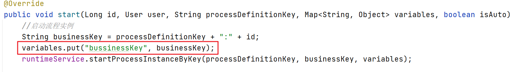

第二：查询任务列表数据时取出，并返回(ActFlowCommServiceImpl的getMyTaskList方法)

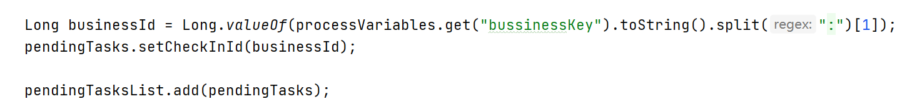

```java
Long businessId = Long.valueOf(processVariables.get("bussinessKey").toString().split(":")[1]);
pendingTasks.setCheckInId(businessId);

pendingTasksList.add(pendingTasks);
```

#### 3.3.5 测试

在我的申请列表中，点击可以撤销的单子，撤销之后

- 入住单关闭
- 已经执行任务可以正常查看

### 3.4 养老顾问-入住配置

我们先查看下原型图，如下效果

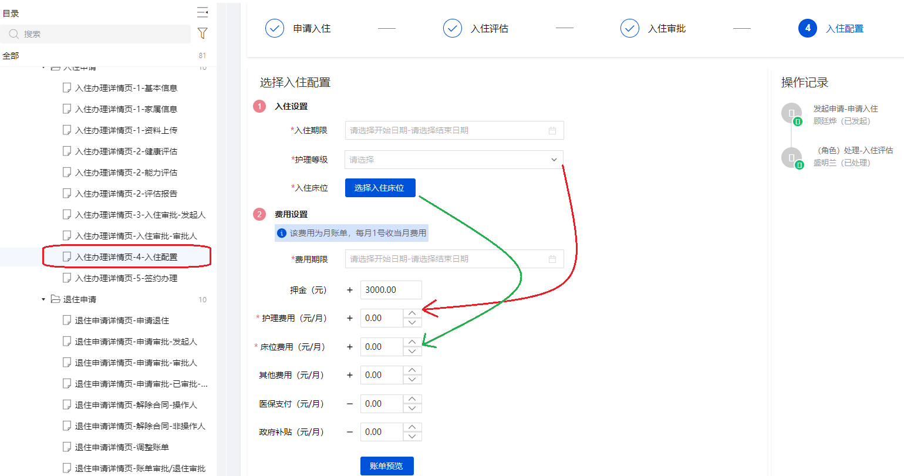

#### 3.4.1 思路分析

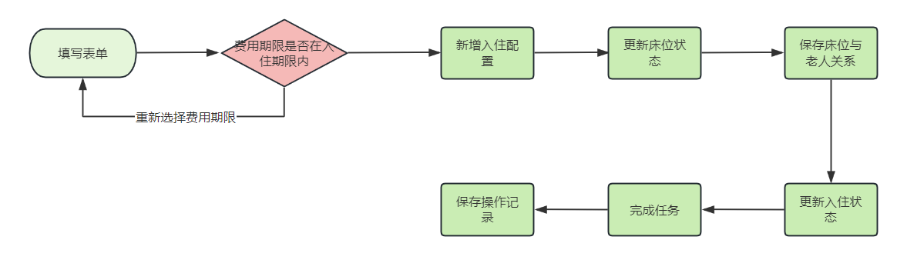

#### 3.4.2 接口定义

在CheckInController中新增方法，如下：

```java
/**
 * 入住配置
 * @param checkInConfigDto 入住配置
 * @return 操作结果
 */
@PostMapping
@ApiOperation(value = "入住配置")
public ResponseResult checkIn(@RequestBody CheckInConfigDto checkInConfigDto) {
    return null;
}
```

#### 3.4.3 业务层开发

新增checkInConfigService类，定义方法

```java
public interface CheckInConfigService {

     /**
     * 入住选择配置
     * @param checkInConfigDto 入住选择配置
     */
    ResponseResult checkIn(CheckInConfigDto checkInConfigDto);
}
```

实现类：

```java
package com.zzyl.service.impl;

/**
 * @author sjqn
 */
@Service
public class CheckInConfigServiceImpl implements CheckInConfigService {

    @Autowired
    private CheckInConfigMapper checkInConfigMapper;

    @Autowired
    private BedService bedService;

    @Autowired
    private ElderMapper elderMapper;

    @Autowired
    private CheckInMapper checkInMapper;

    @Autowired
    private RedisTemplate<String,String> redisTemplate;

    @Autowired
    private ActFlowCommService actFlowCommService;

    @Autowired
    private AccraditationRecordService accraditationRecordService;

    /**
     * 入住选择配置
     * @param checkInConfigDto 入住选择配置
     */
    @Override
    public ResponseResult checkIn(CheckInConfigDto checkInConfigDto) {


        //判断费用期限是否在入住期限内
        if(checkInConfigDto.getCheckInStartTime().isAfter(checkInConfigDto.getCostStartTime())
        || checkInConfigDto.getCheckInEndTime().isBefore(checkInConfigDto.getCostEndTime())){
            throw new BaseException("费用期限应该在入住期限内");
        }
        //保存入住配置
        CheckInConfig checkInConfig = BeanUtil.toBean(checkInConfigDto, CheckInConfig.class);

        //设置床位编号
        BedVo bedVo = bedService.getBedById(checkInConfigDto.getBedId());
        checkInConfig.setBedNo(bedVo.getBedNumber());

        //组装床位信息，方便前端展示和回显
        //拼接规则--->  楼层id:房间id:床位id:楼层名称:入住编码
        String remark = checkInConfigDto.getFloorId()+":"+checkInConfigDto.getRoomId()+":"+checkInConfigDto.getBedId()
                +":"+checkInConfigDto.getFloorName()+":"+checkInConfigDto.getCode();
        checkInConfig.setRemark(remark);
        
        //保存
        checkInConfigMapper.insert(checkInConfig);

        //修改床位状态
        bedVo.setStatus(2);
        BedDto bedDto = BeanUtil.toBean(bedVo, BedDto.class);
        bedService.updateBed(bedDto);

        //床位与老人的关系
        Elder elder = elderMapper.selectByPrimaryKey(checkInConfig.getElderId());
        elder.setBedId(bedVo.getId());
        elder.setBedNumber(bedVo.getBedNumber());
        elderMapper.updateByPrimaryKeySelective(elder);

        //设置流程状态
        CheckIn checkIn = checkInMapper.selectByPrimaryKey(checkInConfigDto.getCheckInId());
        //设置流程状态
        checkIn.setFlowStatus(CheckIn.FlowStatus.SIGN.getCode());
        //生成合同编号，备用，下一步要使用
        String htCode = CodeUtil.generateCode("HT", redisTemplate, 5);
        checkIn.setRemark(htCode);
        //更新入住时间
        checkIn.setCheckInTime(checkInConfigDto.getCheckInStartTime());
        checkInMapper.updateByPrimaryKeySelective(checkIn);

        //获取用户
        String subject = UserThreadLocal.getSubject();
        User user = JSON.parseObject(subject, User.class);

        //完成任务
        actFlowCommService.completeProcess("",checkInConfigDto.getTaskId()
                ,user.getId().toString(),1,null);

        //保存操作记录
        Long nextAssignee = actFlowCommService.getNextAssignee("checkIn-new", "checkIn-new:" + checkIn.getId());

        RecordVo recoreVo = getRecordVo(checkIn,
                user, AccraditationRecordConstant.AUDIT_STATUS_PASS,
                "同意", "养老顾问处理-入住配置",
                "法务处理-签约办理", nextAssignee
                ,AccraditationRecordConstant.RECORD_HANDLE_TYPE_PROCESSED);
        accraditationRecordService.insert(recoreVo);

        return ResponseResult.success();
    }

    /**
     * 封装审核记录参数
     *
     * @param checkIn      入住对象
     * @param user         当前登录用户
     * @param status       审核状态
     * @param option       操作意见
     * @param step         当前步骤
     * @param nextSetp     下一步操作人
     * @param nextAssignee 下一个审核人
     * @param handleType   处理类型（0:已审批，1：已处理）
     * @return
     */
    private RecordVo getRecordVo(CheckIn checkIn, User user, Integer status, String option, String step, String nextSetp, Long nextAssignee, Integer handleType) {

        RecordVo recordVo = new RecordVo();
        recordVo.setId(checkIn.getId());
        recordVo.setType(AccraditationRecordConstant.RECORD_TYPE_CHECK_IN);
        recordVo.setFlowStatus(checkIn.getFlowStatus());
        recordVo.setHandleType(handleType);
        recordVo.setStatus(status);
        recordVo.setOption(option);
        recordVo.setNextStep(nextSetp);
        recordVo.setNextAssignee(nextAssignee);
        recordVo.setUserId(user.getId());
        recordVo.setStep(step);
        recordVo.setRealName(user.getRealName());

        return recordVo;
    }
}
```

#### 3.4.4 控制层开发

补全控制层代码，如下：

```java
@Autowired
private CheckInConfigService checkInConfigService;
/**
 * 入住配置
 * @param checkInConfigDto 入住配置
 * @return 操作结果
 */
@PostMapping
@ApiOperation(value = "入住配置")
public ResponseResult checkIn(@RequestBody CheckInConfigDto checkInConfigDto) {
    return checkInConfigService.checkIn(checkInConfigDto);
}
```

#### 3.4.5 测试

需要准备一个入住单，副院长已经审批完成

在前端选择入住配置、床位等信息，提交单子后

- 检查数据库中的数据是否保存成功
    - check_in_config 入住配置表
    - bed 床位状态是否更新
    - bed_elder 床位与老人的关系是否绑定
    - check_in 数据是否更新
    - 操作记录是否保存成功
- 工作流任务是否完成及分配给下一个人（法务）

#### 3.4.6 入住配置数据回显

当已经提交了入住配置之后，假如提交人想要查看自己提交的数据，或者是单子审批完成后，检查每一步的数据，需要在入住单详情查询中显示入住的配置

所以需要修改前一天开发的接口：**入住表单查询**接口中的逻辑

在CheckInServiceImpl中的getCheckIn方法上添加如下代码

需要注入：CheckInConfigService和NursingLevelService

```java
CheckInConfig checkInConfig = checkInConfigService.findCurrentConfigByElderId(checkIn.getElderId());

//数据拷贝
CheckInConfigVo checkInConfigVo = BeanUtil.toBean(checkInConfig, CheckInConfigVo.class);

if(ObjectUtil.isNotEmpty(checkInConfig) && ObjectUtil.isNotEmpty(checkInConfig.getRemark())){
    NursingLevelVo nursingLevelVo = nursingLevelService.getById(checkInConfig.getNursingLevelId());
    checkInVo.setNursingLevelVo(nursingLevelVo);

    //取出楼层房间床位等数据
    String remark = checkInConfig.getRemark();
    String[] split = remark.split(":");
    checkInConfigVo.setFloorId(Long.valueOf(split[0]));
    checkInConfigVo.setRoomId(Long.valueOf(split[1]));
    checkInConfigVo.setBedId(Long.valueOf(split[2]));
    checkInConfigVo.setFloorName(split[3]);
    checkInConfigVo.setCode(split[4]);

    checkInVo.setCheckInConfigVo(checkInConfigVo);
}
```

上述代码中需要使用checkInConfigService来入住配置，其中的入住配置详细详细，我们还需要查询**护理等级**

在CheckInConfigService中新增方法，根据老人id查询入住配置

```java
/**
 * 根据老人id查询入住配置
 * @param elderId
 * @return
 */
CheckInConfig findCurrentConfigByElderId(Long elderId);
```

实现类：

```java
/**
 * 根据老人ID查询当前入住配置
 * @param elderId 老人ID
 * @return CheckInConfig
 */
@Override
public CheckInConfig findCurrentConfigByElderId(Long elderId) {
    return checkInConfigMapper.findCurrentConfigByElderId(elderId);
}
```

测试：养老顾问在已处理的任务中查询入住配置单，是否可以正常展示

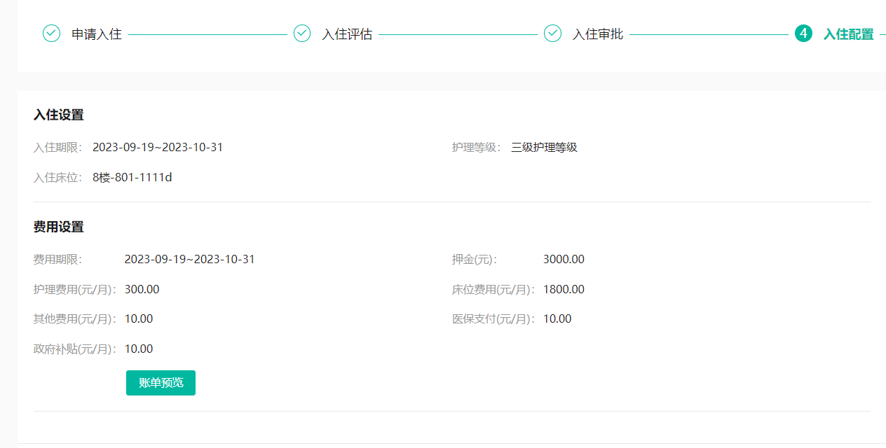

### 3.5 法务-签约办理

#### 3.5.1 思路分析

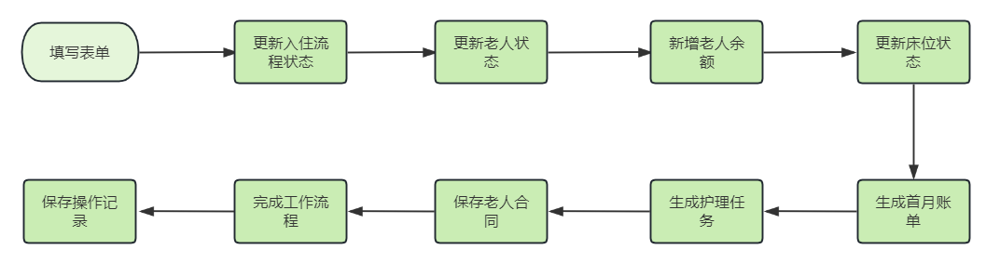

#### 3.5.2 接口定义

在CheckInController中新增方法，如下：

```java
@PostMapping("/sign")
@ApiOperation(value = "签约办理")
public ResponseResult sign(@RequestBody ContractDto contractDto) {
    return null;
}
```

#### 3.5.3 业务层开发

在ContractService中新增方法，如下：

```java
/**
     * 签约办理
     * @param contractDto
     * @return
     */
ResponseResult sign(ContractDto contractDto);
```

实现方法：

```java
@Autowired
private CheckInMapper checkInMapper;

@Autowired
private ElderMapper elderMapper;

@Autowired
private BalanceMapper balanceMapper;

@Autowired
private CheckInConfigService checkInConfigService;

@Autowired
private BedMapper bedMapper;

@Autowired
private BillService billService;

@Autowired
private NursingTaskService nursingTaskService;

@Autowired
private ActFlowCommService actFlowCommService;

@Autowired
private AccraditationRecordService accraditationRecordService;

/**
     * 签约办理
     * @param contractDto
     * @return
     */
@Override
public ResponseResult sign(ContractDto contractDto) {

    //更新入住状态  流程状态和审核状态
    CheckIn checkIn = checkInMapper.selectByPrimaryKey(contractDto.getCheckInId());
    checkIn.setStatus(CheckIn.Status.FINISHED.getCode());
    checkIn.setFlowStatus(CheckIn.FlowStatus.SIGN.getCode());
    checkInMapper.updateByPrimaryKeySelective(checkIn);

    //获取用户数据
    String subject = UserThreadLocal.getSubject();
    User user = JSON.parseObject(subject, User.class);

    //更新老人状态
    Elder elder = elderMapper.selectByPrimaryKey(checkIn.getElderId());
    elder.setStatus(1);
    elderMapper.updateByPrimaryKeySelective(elder);

    //初始化老人的余额
    Balance balance = new Balance();
    balance.setElderId(checkIn.getElderId());
    balance.setElderName(elder.getName());
    balance.setBedNo(elder.getBedNumber());
    balance.setPrepaidBalance(new BigDecimal(0));
    balance.setArrearsAmount(new BigDecimal(0));
    balance.setStatus(0);
    CheckInConfig checkInConfig = checkInConfigService.findCurrentConfigByElderId(elder.getId());
    balance.setDepositAmount(checkInConfig.getDepositAmount());

    balanceMapper.insert(balance);

    //床位状态
    Bed bed = bedMapper.getBedByNum(checkInConfig.getBedNo());
    bed.setBedStatus(1);
    bedMapper.updateBed(bed);

    //保存老人合同
    Contract contract = new Contract();
    BeanUtils.copyProperties(contractDto, contract);
    contract.setElderId(elder.getId());
    contract.setElderName(elder.getName());
    contract.setStatus(ContractStatusEnum.PENDING_EFFECTIVE.getOrdinal());
    contractMapper.insert(contract);

    //生成首月账单
    BillDto billDto = new BillDto();
    billDto.setElderId(elder.getId());
    LocalDateTime costStartTime = checkInConfig.getCostStartTime();
    String dateStr = LocalDateTimeUtil.format(costStartTime, "yyyy-MM");
    billDto.setBillMonth(dateStr);
    billService.createMonthBill(billDto);

    //生成护理任务
    ElderVo elderVo = BeanUtil.toBean(elder, ElderVo.class);
    nursingTaskService.createMonthTask(elderVo,contract.getSignDate(),null);

    //完成任务
    actFlowCommService.completeProcess("",contractDto.getTaskId()
                                       ,user.getId().toString(),1,CheckIn.Status.FINISHED.getCode());

    //保存操作记录
    RecordVo recoreVo = getRecordVo(
        checkIn,
        user,
        AccraditationRecordConstant.AUDIT_STATUS_PASS,
        "同意",
        "法务处理-签约办理",
        "",
        null,
        AccraditationRecordConstant.RECORD_HANDLE_TYPE_PROCESSED);
    accraditationRecordService.insert(recoreVo);

    return ResponseResult.success();
}

/**
     * 封装审核记录参数
     *
     * @param checkIn      入住对象
     * @param user         当前登录用户
     * @param status       审核状态
     * @param option       操作意见
     * @param step         当前步骤
     * @param nextSetp     下一步操作人
     * @param nextAssignee 下一个审核人
     * @param handleType   处理类型（0:已审批，1：已处理）
     * @return
     */
private RecordVo getRecordVo(CheckIn checkIn, User user, Integer status, String option, String step, String nextSetp, Long nextAssignee, Integer handleType) {

    RecordVo recordVo = new RecordVo();
    recordVo.setId(checkIn.getId());
    recordVo.setType(AccraditationRecordConstant.RECORD_TYPE_CHECK_IN);
    recordVo.setFlowStatus(checkIn.getFlowStatus());
    recordVo.setHandleType(handleType);
    recordVo.setStatus(status);
    recordVo.setOption(option);
    recordVo.setNextStep(nextSetp);
    recordVo.setNextAssignee(nextAssignee);
    recordVo.setUserId(user.getId());
    recordVo.setStep(step);
    recordVo.setRealName(user.getRealName());

    return recordVo;
}
```

#### 3.5.4 控制层开发

补全控制层代码：

```java
/**
 * 签约办理
 * @param contractDto 合同信息
 * @return 操作结果
 */
@PostMapping("/sign")
@ApiOperation(value = "签约办理")
public ResponseResult sign(@RequestBody ContractDto contractDto) {
    return contractService.sign(contractDto);
}
```

#### 3.5.5 测试

当签约成功以后，测试如下：

- 入住流程状态为已完成
- 新增老人余额 balance表
- 更新老人状态 elder表
- 床位状态更新为已入住
- 生成首月账单
- 生成护理任务
- 保存操作记录

```sql
select * from balance 

select * from elder

select * from bed

select * from bill

select * from nursing_task 
```

#### 3.5.6 入住单详情查询（合同部分）

当入住流程结束以后，流程上节点的任务人可以继续查看单子的审核过程和详情，如果签订合同以后就需要查看合同相关的信息，效果如下：

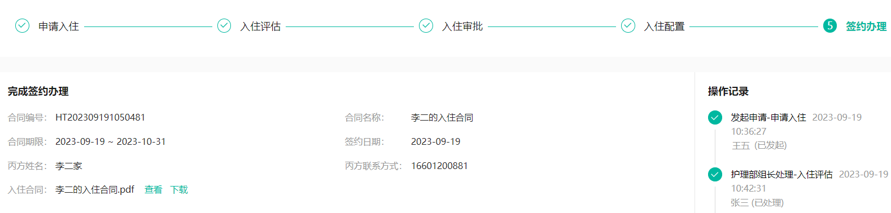

所以需要修改前一天开发的接口：**入住表单查询**接口中的逻辑

在CheckInServiceImpl中的getCheckIn方法上添加如下代码：

```java
//合同信息
Contract contract = contractMapper.selectByElderId(checkIn.getElderId());
ContractVo contractVo = BeanUtil.toBean(contract, ContractVo.class);
checkInVo.setContractVo(contractVo);
```

#### 3.5.7 合同状态自动更新

每天凌晨1点检查合同状态，如果到了入住时间则把状态改为生效，要求使用xxl-job实现

### 3.6 入住管理查询

#### 3.6.1 思路分析

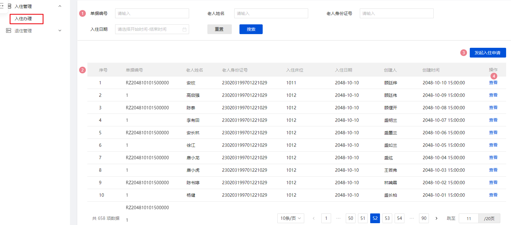

- 请详细阅读原型和PRD
- 其他注意事项
    - 在显示的字段列表中，需要从多个表中获取
        - 入住表 check_in
        - 老人表 elder

#### 3.6.2 接口定义

基于接口文档编写

#### 3.6.3 业务层开发

自己实现

#### 3.6.4 控制层开发

自己实现

#### 3.6.5 测试

### 3.7 入住成功关联业务介绍

#### 3.7.1 放开注释的代码

找到BillServiceImpl和NursingTaskServiceImpl，放开里面所有注释掉的代码

#### 3.7.2 入住流程走通的效果

（1）合同生成

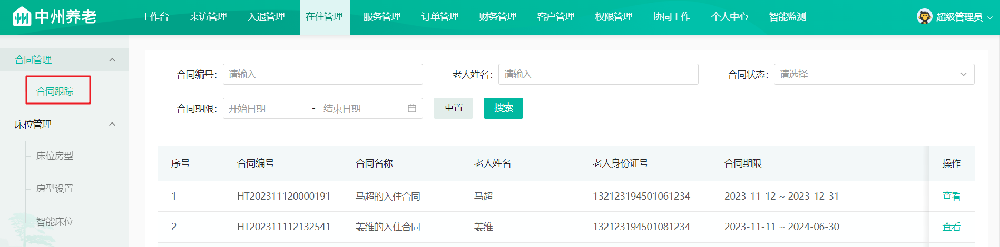

（2）老人与楼层房间床位绑定

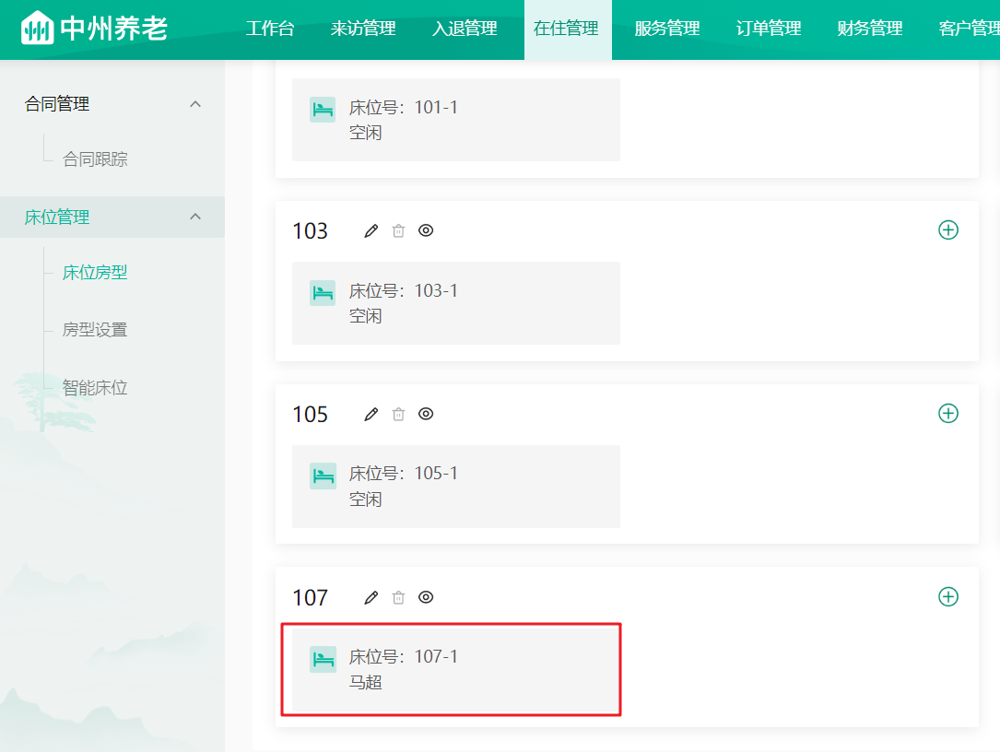

（3）老人护理任务自动生成

任务列表可以查看老人当月的护理任务节点，可以给老人绑定护理员，由绑定的护理员去按照时间去执行任务

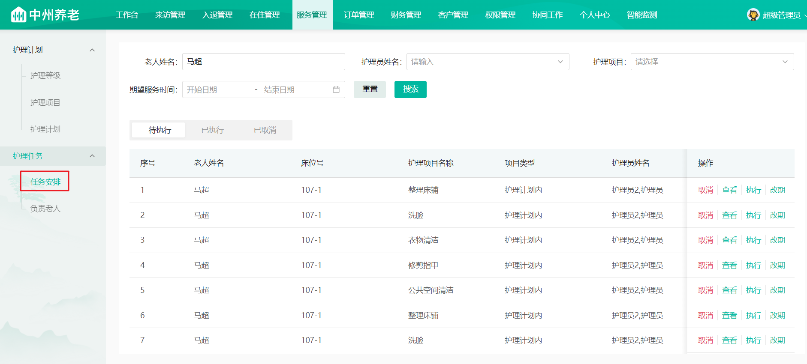

（4）自动老人的月度账单数据

可以给老人缴费（线下缴费，需上传凭证）

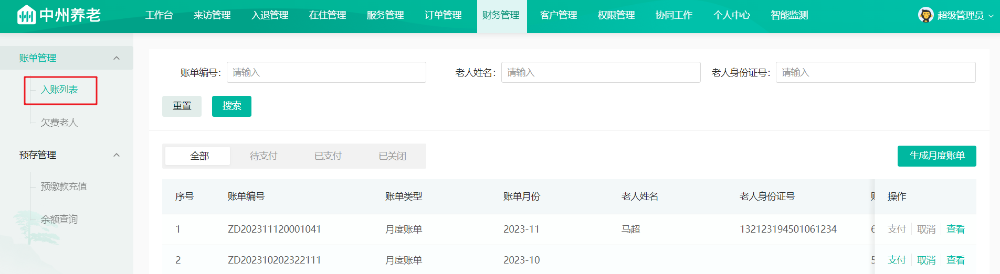

（5）小程序端查看老人的月度账单和合同

需要先绑定老人，输入老人的姓名和身份号

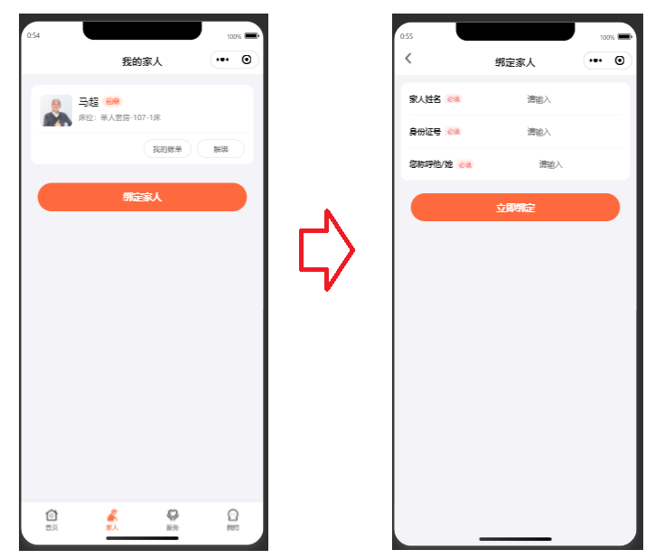

查看合同和账单

其中合同的展示查询条件是与入住中签约办理的丙方联系方式一致

简单说：现在测试，需要使用自己的手机号在小程序登录，那这个丙方联系方式就是自己的手机号

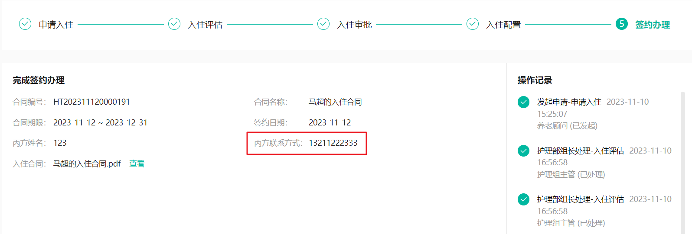

展示效果如下：

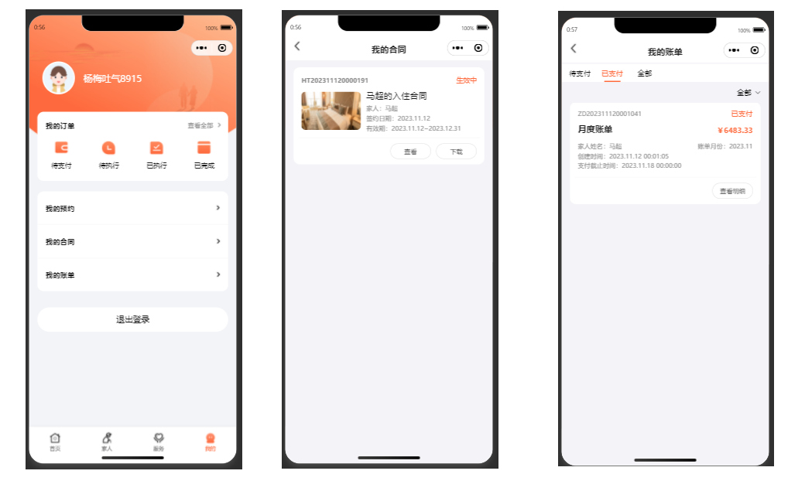

