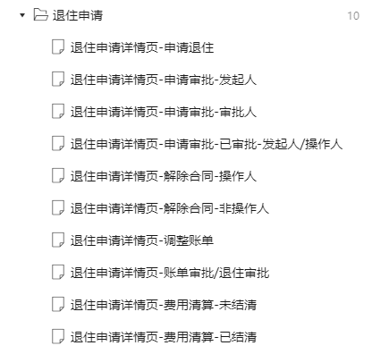
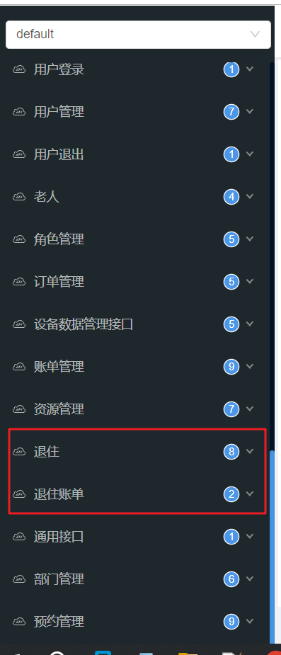

# 入退管理-退住

## 1 目标

经过前几天的努力，我们已经把入住的相关功能实现了，接下来我们要实现的是退住管理，由于退住管理与入住管理都需要使用工作流实现，我们不再实现，需要大家能够通读完代码，并写出自己的逻辑。

所以今天的目标是：

- 能够掌握退住业务的核心流程，形成逐字稿
- 能够掌握退住业务的表结构关系
- 能够阅读退住的业务流程代码，画出流程图
- 能够完成退住流程中的账单结算功能，画出流程图

## 2 需求分析

大家参考资料中的原型文档，找到退住模块

详细阅读原型和PRD文档

## 3 表结构

退住与入住有很多的表是有关系的，表结构如下：

## 4 接口文档

找到今天的分支代码：dev-day10

启动后端项目，打开swagger在线接口文档：退住和退住账单

其中的**我的申请**和**我的待办**在之前的入住模块已经实现，可复用

## 5 今日作业

以组为单位进行讨论分析需求和代码，并形成最终的逐字稿和流程图

每组选出一人上台分享组内的讨论结果，并讲解流程图

