# 物联网智能监测-IOT消息处理

## 1 目标

前一天我们已经完成了设备的管理，今天，我们就来处理设备联网之后上报数据的处理。

我们再来回顾一下IOT基本的工作原理


从图中，我们可以看到，当设备上报数据到IOT平台之后，业务系统可以从IOT平台中拉取数据到自己的数据库，方便在业务应用中去展示。

今天的目标：

- 能够熟悉AMQP协议的特点
- 能够完成使用AMQP消费IOT中设备上报的数据
- 能够清楚线程池的使用方式及使用场景
- 能够完成智能床位的功能开发
- 能够完成家属端老人数据的报表展示

## 2 异步处理基础概念

### 2.1 同步和异步

- 同步（Background Synchronous）是指任务在后台进行处理，但需要等待任务完成后才能继续执行其他操作
- 异步（Asynchronous）是指任务的提交和执行是相互独立的，任务的执行不会阻塞程序的继续执行

如下图：

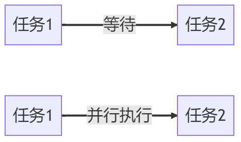

- 同步模式下，任务1完成后才能执行任务2，任务2需要等待任务1的完成。这种顺序执行的方式称为同步。
- 异步模式下，任务1和任务2可以并行执行，彼此之间相互独立，不需要等待对方的完成。这种并行执行的方式称为异步。

好处：

- 提高系统的并发性
- 改善系统的响应性

缺点：

- 复杂性增加
- 资源消耗增加

### 2.2 消息队列的基础概念

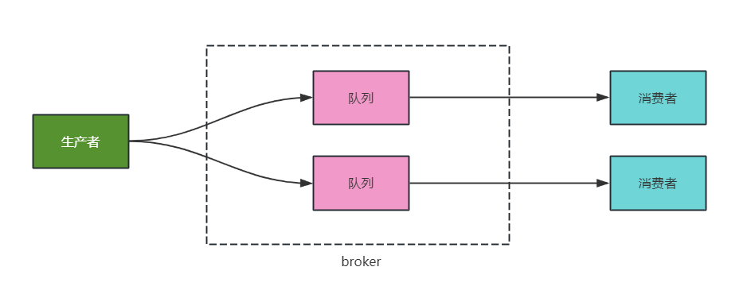

- 生产者：负责将消息发送到消息队列中
- 消费者：负责从消息队列中获取消息并进行处理
- 队列：存储消息
- broker：负责接收、存储和分发消息的中间件组件，实现了发送者和接收者之间的解耦和**异步**通信
- topic：消息的分类

在IOT中数据流转是这样的，如下图

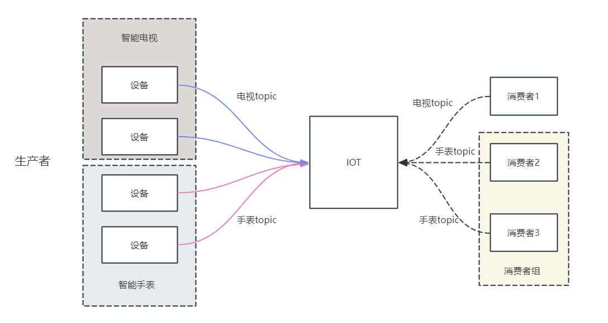

- 生产者：设备负责将消息发送到IOT中（队列）
- 每个产品可以绑定不同的topic来进行消息分类，比如有电视topic、手表topic
- IOT本身相当于是一个队列
- 消费者可以从指定的topic中获取数据
- 如果有多个消费者都要接收同一类消息，可以设置多个消费者，称为消费者组

### 2.3 什么是AMQP

AMQP全称Advanced Message Queuing Protocol，是一种网络协议，用于在应用程序之间传递消息。它是一种开放标准的消息传递协议，可以在不同的系统之间实现可靠、安全、高效的消息传递。

AMQP协议的实现包括多种消息队列软件，例如RabbitMQ、Apache ActiveMQ**、Apache Qpid**
等。这些软件提供了可靠、高效的消息传递服务，广泛应用于分布式系统、云计算、物联网等领域。

> 我们这次课程并不会详细讲解这些软件的使用，其中关于RabbitMQ我们后期的课程中会详细的，重点的去讲解。

今天我们会在课程中快速使用Apache Qpid软件来接收IOT中的数据，如下图

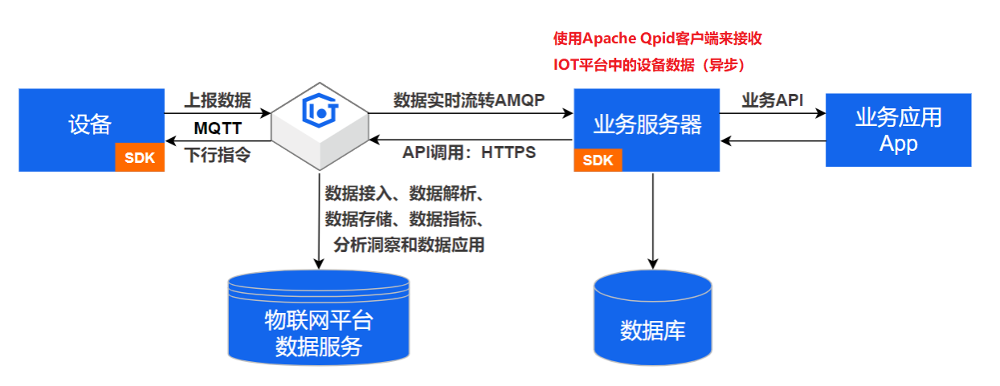

## 3 设备数据消费

在IOT官方文档中，已经提供了对应的接收数据的解决方案，如下链接：

https://help.aliyun.com/zh/iot/developer-reference/connect-a-client-to-iot-platform-by-using-the-sdk-for-java?spm=a2c4g.11186623.0.0.7d7234bdQCi7MQ

### 3.1 官网Java SDK接入

#### 3.1.1 导入pom依赖

```xml
<!-- amqp 1.0 qpid client -->
<dependency>
    <groupId>org.apache.qpid</groupId>
    <artifactId>qpid-jms-client</artifactId>
    <version>0.57.0</version>
</dependency>
        <!-- util for base64-->
<dependency>
<groupId>commons-codec</groupId>
<artifactId>commons-codec</artifactId>
<version>1.10</version>
</dependency>
```

#### 3.1.2 下载Demo代码包

下载地址：https://linkkit-export.oss-cn-shanghai.aliyuncs.com/amqp/amqp-demo.zip


代码包可以在当天资料中找到

#### 3.1.3 接收数据

我们可以修改里面的参数，包含以下几个重要参数：

- accessKey 秘钥key

- accessSecret 秘钥

- consumerGroupId 消费者组

  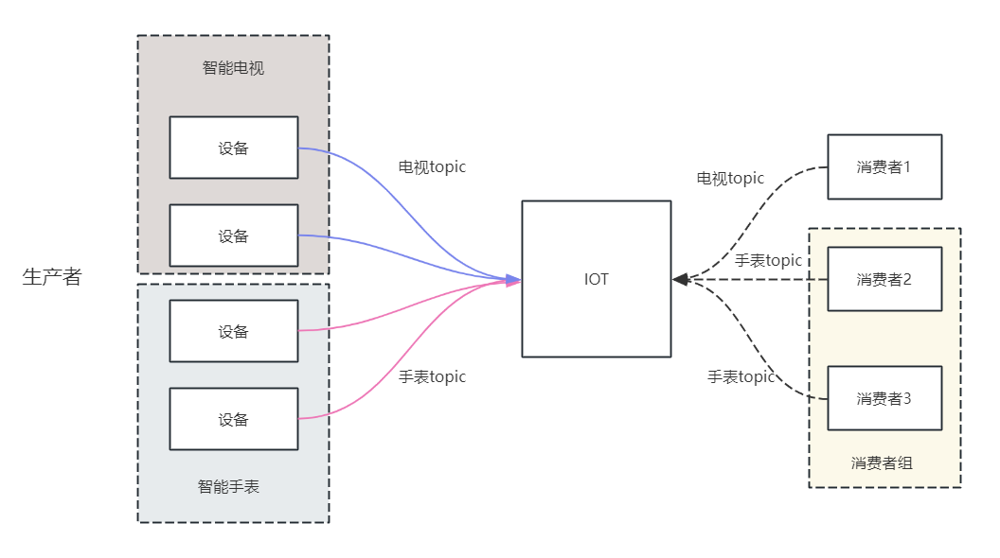

- iotInstanceId 公共实例ID

- clientId：InetAddress.getLocalHost().getHostAddress(); 获取本机ip作为clientId

修改之后的代码：

```java
package com.aliyun.iotx.demo;

import java.net.InetAddress;
import java.net.URI;
import java.net.UnknownHostException;
import java.util.ArrayList;
import java.util.Hashtable;
import java.util.List;
import java.util.concurrent.ExecutorService;
import java.util.concurrent.LinkedBlockingQueue;
import java.util.concurrent.ThreadPoolExecutor;
import java.util.concurrent.TimeUnit;

import javax.crypto.Mac;
import javax.crypto.spec.SecretKeySpec;
import javax.jms.Connection;
import javax.jms.ConnectionFactory;
import javax.jms.Destination;
import javax.jms.JMSException;
import javax.jms.Message;
import javax.jms.MessageConsumer;
import javax.jms.MessageListener;
import javax.jms.MessageProducer;
import javax.jms.Session;
import javax.naming.Context;
import javax.naming.InitialContext;

import org.apache.commons.codec.binary.Base64;
import org.apache.qpid.jms.JmsConnection;
import org.apache.qpid.jms.JmsConnectionListener;
import org.apache.qpid.jms.message.JmsInboundMessageDispatch;
import org.slf4j.Logger;
import org.slf4j.LoggerFactory;

public class AmqpClient {
    private final static Logger logger = LoggerFactory.getLogger(AmqpClient.class);
    /**
     * 工程代码泄露可能会导致 AccessKey 泄露，并威胁账号下所有资源的安全性。以下代码示例使用环境变量获取 AccessKey 的方式进行调用，仅供参考
     */
    private static String accessKey = "LTAI5tDQKg9F61aJhbmhqVRK";
    private static String accessSecret = "LYUKZH7HQGBoD025pmSq0fQsREaOYD";;
    private static String consumerGroupId = "eraicKJm98cQR0hHgsxb000100";

    //iotInstanceId：实例ID。若是2021年07月30日之前（不含当日）开通的公共实例，请填空字符串。
    private static String iotInstanceId = "iot-06z00frq8umvkx2";

    //控制台服务端订阅中消费组状态页客户端ID一栏将显示clientId参数。
    //建议使用机器UUID、MAC地址、IP等唯一标识等作为clientId。便于您区分识别不同的客户端。
    private static String clientId;

    static {
        try {
            clientId = InetAddress.getLocalHost().getHostAddress();
        } catch (UnknownHostException e) {
            e.printStackTrace();
        }
    }

    //${YourHost}为接入域名，请参见AMQP客户端接入说明文档。
    private static String host = "iot-06z00frq8umvkx2.amqp.iothub.aliyuncs.com";

    // 指定单个进程启动的连接数
    // 单个连接消费速率有限，请参考使用限制，最大64个连接
    // 连接数和消费速率及rebalance相关，建议每500QPS增加一个连接
    private static int connectionCount = 4;

    //业务处理异步线程池，线程池参数可以根据您的业务特点调整，或者您也可以用其他异步方式处理接收到的消息。
    private final static ExecutorService executorService = new ThreadPoolExecutor(
        Runtime.getRuntime().availableProcessors(),
        Runtime.getRuntime().availableProcessors() * 2, 60, TimeUnit.SECONDS,
        new LinkedBlockingQueue(50000));

    public static void main(String[] args) throws Exception {
        List<Connection> connections = new ArrayList<>();

        //参数说明，请参见AMQP客户端接入说明文档。
        for (int i = 0; i < connectionCount; i++) {
            long timeStamp = System.currentTimeMillis();
            //签名方法：支持hmacmd5、hmacsha1和hmacsha256。
            String signMethod = "hmacsha1";

            //userName组装方法，请参见AMQP客户端接入说明文档。
            String userName = clientId + "-" + i + "|authMode=aksign"
                + ",signMethod=" + signMethod
                + ",timestamp=" + timeStamp
                + ",authId=" + accessKey
                + ",iotInstanceId=" + iotInstanceId
                + ",consumerGroupId=" + consumerGroupId
                + "|";
            //计算签名，password组装方法，请参见AMQP客户端接入说明文档。
            String signContent = "authId=" + accessKey + "&timestamp=" + timeStamp;
            String password = doSign(signContent, accessSecret, signMethod);
            String connectionUrl = "failover:(amqps://" + host + ":5671?amqp.idleTimeout=80000)"
                + "?failover.reconnectDelay=30";

            Hashtable<String, String> hashtable = new Hashtable<>();
            hashtable.put("connectionfactory.SBCF", connectionUrl);
            hashtable.put("queue.QUEUE", "default");
            hashtable.put(Context.INITIAL_CONTEXT_FACTORY, "org.apache.qpid.jms.jndi.JmsInitialContextFactory");
            Context context = new InitialContext(hashtable);
            ConnectionFactory cf = (ConnectionFactory)context.lookup("SBCF");
            Destination queue = (Destination)context.lookup("QUEUE");
            // 创建连接。
            Connection connection = cf.createConnection(userName, password);
            connections.add(connection);

            ((JmsConnection)connection).addConnectionListener(myJmsConnectionListener);
            // 创建会话。
            // Session.CLIENT_ACKNOWLEDGE: 收到消息后，需要手动调用message.acknowledge()。
            // Session.AUTO_ACKNOWLEDGE: SDK自动ACK（推荐）。
            Session session = connection.createSession(false, Session.AUTO_ACKNOWLEDGE);

            connection.start();
            // 创建Receiver连接。
            MessageConsumer consumer = session.createConsumer(queue);
            consumer.setMessageListener(messageListener);
        }

        logger.info("amqp demo is started successfully, and will exit after 60s ");

        // 结束程序运行 
        Thread.sleep(6000 * 1000);
        logger.info("run shutdown");

        connections.forEach(c-> {
            try {
                c.close();
            } catch (JMSException e) {
                logger.error("failed to close connection", e);
            }
        });

        executorService.shutdown();
        if (executorService.awaitTermination(10, TimeUnit.SECONDS)) {
            logger.info("shutdown success");
        } else {
            logger.info("failed to handle messages");
        }
    }

    private static MessageListener messageListener = new MessageListener() {
        @Override
        public void onMessage(final Message message) {
            try {
                //1.收到消息之后一定要ACK。
                // 推荐做法：创建Session选择Session.AUTO_ACKNOWLEDGE，这里会自动ACK。
                // 其他做法：创建Session选择Session.CLIENT_ACKNOWLEDGE，这里一定要调message.acknowledge()来ACK。
                // message.acknowledge();
                //2.建议异步处理收到的消息，确保onMessage函数里没有耗时逻辑。
                // 如果业务处理耗时过程过长阻塞住线程，可能会影响SDK收到消息后的正常回调。
                executorService.submit(new Runnable() {
                    @Override
                    public void run() {
                        processMessage(message);
                    }
                });
            } catch (Exception e) {
                logger.error("submit task occurs exception ", e);
            }
        }
    };

    /**
     * 在这里处理您收到消息后的具体业务逻辑。
     */
    private static void processMessage(Message message) {
        try {
            byte[] body = message.getBody(byte[].class);
            String content = new String(body);
            String topic = message.getStringProperty("topic");
            String messageId = message.getStringProperty("messageId");
            logger.info("receive message"
                + ",\n topic = " + topic
                + ",\n messageId = " + messageId
                + ",\n content = " + content);
        } catch (Exception e) {
            logger.error("processMessage occurs error ", e);
        }
    }

    private static JmsConnectionListener myJmsConnectionListener = new JmsConnectionListener() {
        /**
         * 连接成功建立。
         */
        @Override
        public void onConnectionEstablished(URI remoteURI) {
            logger.info("onConnectionEstablished, remoteUri:{}", remoteURI);
        }

        /**
         * 尝试过最大重试次数之后，最终连接失败。
         */
        @Override
        public void onConnectionFailure(Throwable error) {
            logger.error("onConnectionFailure, {}", error.getMessage());
        }

        /**
         * 连接中断。
         */
        @Override
        public void onConnectionInterrupted(URI remoteURI) {
            logger.info("onConnectionInterrupted, remoteUri:{}", remoteURI);
        }

        /**
         * 连接中断后又自动重连上。
         */
        @Override
        public void onConnectionRestored(URI remoteURI) {
            logger.info("onConnectionRestored, remoteUri:{}", remoteURI);
        }

        @Override
        public void onInboundMessage(JmsInboundMessageDispatch envelope) {}

        @Override
        public void onSessionClosed(Session session, Throwable cause) {}

        @Override
        public void onConsumerClosed(MessageConsumer consumer, Throwable cause) {}

        @Override
        public void onProducerClosed(MessageProducer producer, Throwable cause) {}
    };

    /**
     * 计算签名，password组装方法，请参见AMQP客户端接入说明文档。
     */
    private static String doSign(String toSignString, String secret, String signMethod) throws Exception {
        SecretKeySpec signingKey = new SecretKeySpec(secret.getBytes(), signMethod);
        Mac mac = Mac.getInstance(signMethod);
        mac.init(signingKey);
        byte[] rawHmac = mac.doFinal(toSignString.getBytes());
        return Base64.encodeBase64String(rawHmac);
    }
}

```

以上代码启动之后，并不能接收到数据，因为设备并没有绑定topic，所以需要在物联网IOT平台设置topic，也就是消费者的消费者组

第一：找到  **消息转发**->**服务端订阅**->**消费者组列表**

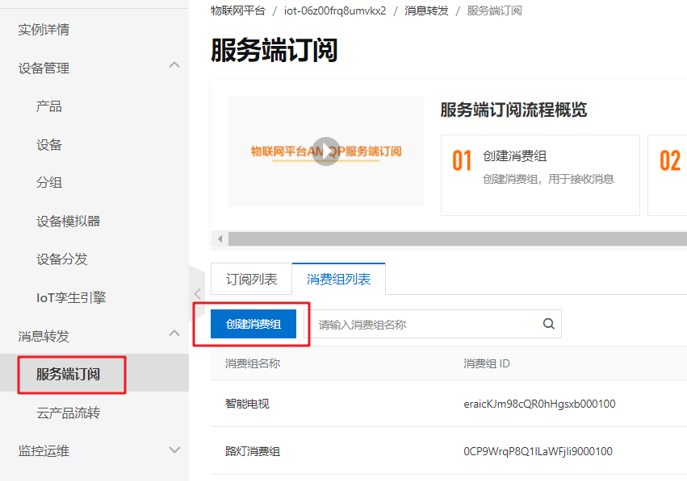

创建一个自己的消费者组

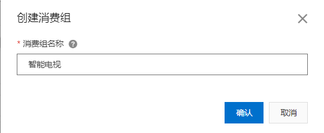

创建好之后可以查看到已经创建好的消费者组，并且自动生成了消费者组id

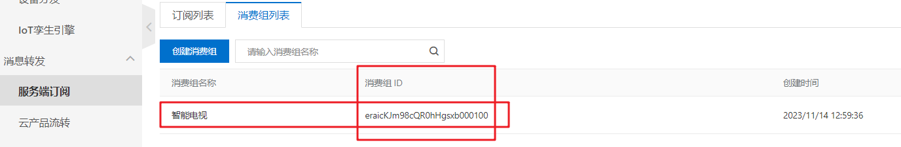

进入刚刚创建的消费者组，然后点击订阅产品，然后创建订阅

需要选择消费者组与推送消息类型（设备上报数据），如下图

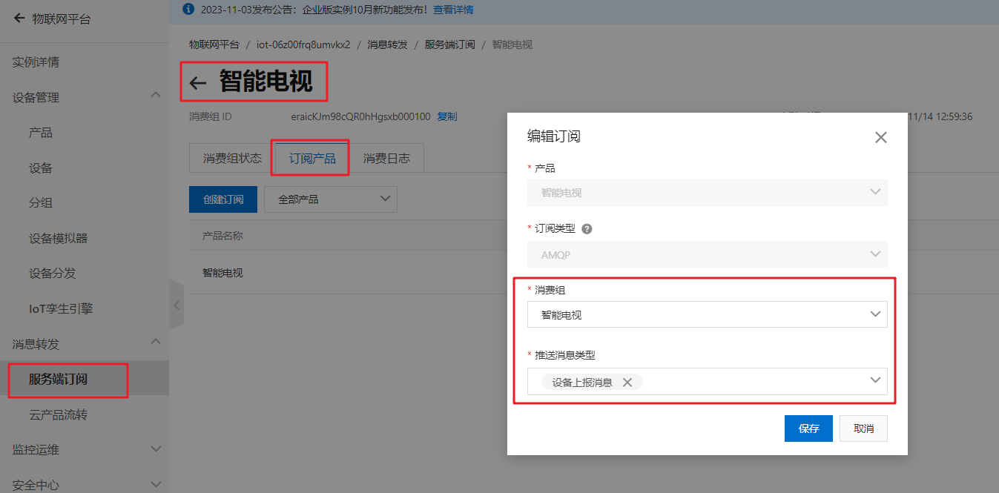

修改demo代码中的消费者组，改为自己创建的消费者组ID

```java
private static String consumerGroupId = "eraicKJm98cQR0hHgsxb000100";
```

#### 3.1.4 测试

- 找一个设备进行数据上报

- demo代码中绑定对应的消费者组

- 启动后台代码，可以在日志中查看消费者到的数据

  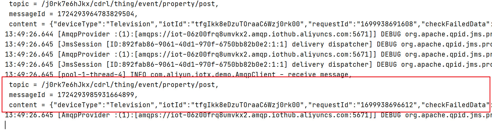

### 3.2 SDK改造

SDK提供好的这个工具类，我们需要改造这个类，改造内容如下：

- 让spring进行管理和监听，一旦有数据变化之后，就可以马上消费，可以让这个类实现ApplicationRunner接口，重新run方法
- 可以在项目中自己配置线程池的使用
- 所有的可变参数，如实例id、accessKey、accessSecret、consumerGroupId这些统一在配置文件中维护

#### 3.2.1 application.yml文件中添加IOT配置

```yaml
zzyl:
  aliyun:
    accessKeyId: LTAI5tDQKg9F61aJhbmhqVRK
    accessKeySecret: LYUKZH7HQGBoD025pmSq0fQsREaOYD
    consumerGroupId: DEFAULT_GROUP
    regionId: cn-shanghai
    iotInstanceId: iot-06z00frq8umvkx2
    host: iot-06z00frq8umvkx2.amqp.iothub.aliyuncs.com

```

在zzyl-framework中添加读取文件配置类

```java
package com.zzyl.properties;

import lombok.Getter;
import lombok.NoArgsConstructor;
import lombok.Setter;
import lombok.ToString;
import org.springframework.boot.context.properties.ConfigurationProperties;
import org.springframework.context.annotation.Configuration;

/**
 * @author sjqn
 * @date 2023/10/7
 */

@Setter
@Getter
@NoArgsConstructor
@ToString
@Configuration
@ConfigurationProperties(prefix = "zzyl.aliyun")
public class AliIoTConfigProperties {

    /**
     * 访问Key
     */
    private String accessKeyId;
    /**
     * 访问秘钥
     */
    private String accessKeySecret;
    /**
     * 区域id
     */
    private String regionId;
    /**
     * 实例id
     */
    private String iotInstanceId;
    /**
     * 域名
     */
    private String host;

    /**
     * 消费组
     */
    private String consumerGroupId;

}
```

#### 3.2.2 常见线程池配置类

在zzyl-service中添加配置类，如下

```java
package com.zzyl.config;

import org.springframework.context.annotation.Bean;
import org.springframework.context.annotation.Configuration;

import java.util.concurrent.ExecutorService;
import java.util.concurrent.LinkedBlockingQueue;
import java.util.concurrent.ThreadPoolExecutor;
import java.util.concurrent.TimeUnit;
import java.util.concurrent.atomic.AtomicInteger;

@Configuration
public class ThreadPoolConfig {

    /**
     * 核心线程池大小
     */
    private static final int CORE_POOL_SIZE = Runtime.getRuntime().availableProcessors();

    /**
     * 最大可创建的线程数
     */
    private static final int MAX_POOL_SIZE = Runtime.getRuntime().availableProcessors() * 2;

    /**
     * 队列最大长度
     */
    private static final int QUEUE_CAPACITY = 50000;

    /**
     * 线程池维护线程所允许的空闲时间
     */
    private static final int KEEP_ALIVE_SECONDS = 60;

    @Bean
    public ExecutorService executorService(){
        AtomicInteger c = new AtomicInteger(1);
        LinkedBlockingQueue<Runnable> queue = new LinkedBlockingQueue<Runnable>(QUEUE_CAPACITY);
        return new ThreadPoolExecutor(
                CORE_POOL_SIZE,
                MAX_POOL_SIZE,
                KEEP_ALIVE_SECONDS,
                TimeUnit.MILLISECONDS,
                queue,
                r -> new Thread(r, "zzyl-pool-" + c.getAndIncrement()),
                new ThreadPoolExecutor.DiscardPolicy()
        );
    }
}
```

#### 3.2.3 改造之后的AmqpClient

```java
package com.zzyl.job;

import com.zzyl.properties.AliIoTConfigProperties;
import org.apache.commons.codec.binary.Base64;
import org.apache.qpid.jms.JmsConnection;
import org.apache.qpid.jms.JmsConnectionListener;
import org.apache.qpid.jms.message.JmsInboundMessageDispatch;
import org.slf4j.Logger;
import org.slf4j.LoggerFactory;
import org.springframework.beans.factory.annotation.Autowired;
import org.springframework.boot.ApplicationArguments;
import org.springframework.boot.ApplicationRunner;
import org.springframework.stereotype.Component;

import javax.crypto.Mac;
import javax.crypto.spec.SecretKeySpec;
import javax.jms.*;
import javax.naming.Context;
import javax.naming.InitialContext;
import java.net.InetAddress;
import java.net.URI;
import java.net.UnknownHostException;
import java.util.ArrayList;
import java.util.Hashtable;
import java.util.List;
import java.util.concurrent.ExecutorService;

@Component
public class AmqpClient implements ApplicationRunner {
    private final static Logger logger = LoggerFactory.getLogger(AmqpClient.class);

    @Autowired
    private AliIoTConfigProperties aliIoTConfigProperties;

    //控制台服务端订阅中消费组状态页客户端ID一栏将显示clientId参数。
    //建议使用机器UUID、MAC地址、IP等唯一标识等作为clientId。便于您区分识别不同的客户端。
    private static String clientId;

    static {
        try {
            clientId = InetAddress.getLocalHost().getHostAddress();
        } catch (UnknownHostException e) {
            e.printStackTrace();
        }
    }

    // 指定单个进程启动的连接数
    // 单个连接消费速率有限，请参考使用限制，最大64个连接
    // 连接数和消费速率及rebalance相关，建议每500QPS增加一个连接
    private static int connectionCount = 64;

    //业务处理异步线程池，线程池参数可以根据您的业务特点调整，或者您也可以用其他异步方式处理接收到的消息。
    @Autowired
    private ExecutorService executorService;

    public void start() throws Exception {
        List<Connection> connections = new ArrayList<>();

        //参数说明，请参见AMQP客户端接入说明文档。
        for (int i = 0; i < connectionCount; i++) {
            long timeStamp = System.currentTimeMillis();
            //签名方法：支持hmacmd5、hmacsha1和hmacsha256。
            String signMethod = "hmacsha1";

            //userName组装方法，请参见AMQP客户端接入说明文档。
            String userName = clientId + "-" + i + "|authMode=aksign"
                    + ",signMethod=" + signMethod
                    + ",timestamp=" + timeStamp
                    + ",authId=" + aliIoTConfigProperties.getAccessKeyId()
                    + ",iotInstanceId=" + aliIoTConfigProperties.getIotInstanceId()
                    + ",consumerGroupId=" + aliIoTConfigProperties.getConsumerGroupId()
                    + "|";
            //计算签名，password组装方法，请参见AMQP客户端接入说明文档。
            String signContent = "authId=" + aliIoTConfigProperties.getAccessKeyId() + "&timestamp=" + timeStamp;
            String password = doSign(signContent, aliIoTConfigProperties.getAccessKeySecret(), signMethod);
            String connectionUrl = "failover:(amqps://" + aliIoTConfigProperties.getHost() + ":5671?amqp.idleTimeout=80000)"
                    + "?failover.reconnectDelay=30";

            Hashtable<String, String> hashtable = new Hashtable<>();
            hashtable.put("connectionfactory.SBCF", connectionUrl);
            hashtable.put("queue.QUEUE", "default");
            hashtable.put(Context.INITIAL_CONTEXT_FACTORY, "org.apache.qpid.jms.jndi.JmsInitialContextFactory");
            Context context = new InitialContext(hashtable);
            ConnectionFactory cf = (ConnectionFactory) context.lookup("SBCF");
            Destination queue = (Destination) context.lookup("QUEUE");
            // 创建连接。
            Connection connection = cf.createConnection(userName, password);
            connections.add(connection);

            ((JmsConnection) connection).addConnectionListener(myJmsConnectionListener);
            // 创建会话。
            // Session.CLIENT_ACKNOWLEDGE: 收到消息后，需要手动调用message.acknowledge()。
            // Session.AUTO_ACKNOWLEDGE: SDK自动ACK（推荐）。
            Session session = connection.createSession(false, Session.AUTO_ACKNOWLEDGE);

            connection.start();
            // 创建Receiver连接。
            MessageConsumer consumer = session.createConsumer(queue);
            consumer.setMessageListener(messageListener);
        }

        logger.info("amqp  is started successfully, and will exit after server shutdown ");
    }

    private MessageListener messageListener = message -> {
        try {
            //异步处理收到的消息，确保onMessage函数里没有耗时逻辑
            executorService.submit(() -> processMessage(message));
        } catch (Exception e) {
            logger.error("submit task occurs exception ", e);
        }
    };

    /**
     * 在这里处理您收到消息后的具体业务逻辑。
     */
    private void processMessage(Message message) {
        try {
            byte[] body = message.getBody(byte[].class);
            String contentStr = new String(body);
            String topic = message.getStringProperty("topic");
            String messageId = message.getStringProperty("messageId");
            logger.info("receive message"
                    + ",\n topic = " + topic
                    + ",\n messageId = " + messageId
                    + ",\n content = " + contentStr);

        } catch (Exception e) {
            logger.error("processMessage occurs error ", e);
        }
    }

    private JmsConnectionListener myJmsConnectionListener = new JmsConnectionListener() {
        /**
         * 连接成功建立。
         */
        @Override
        public void onConnectionEstablished(URI remoteURI) {
            logger.info("onConnectionEstablished, remoteUri:{}", remoteURI);
        }

        /**
         * 尝试过最大重试次数之后，最终连接失败。
         */
        @Override
        public void onConnectionFailure(Throwable error) {
            logger.error("onConnectionFailure, {}", error.getMessage());
        }

        /**
         * 连接中断。
         */
        @Override
        public void onConnectionInterrupted(URI remoteURI) {
            logger.info("onConnectionInterrupted, remoteUri:{}", remoteURI);
        }

        /**
         * 连接中断后又自动重连上。
         */
        @Override
        public void onConnectionRestored(URI remoteURI) {
            logger.info("onConnectionRestored, remoteUri:{}", remoteURI);
        }

        @Override
        public void onInboundMessage(JmsInboundMessageDispatch envelope) {
        }

        @Override
        public void onSessionClosed(Session session, Throwable cause) {
        }

        @Override
        public void onConsumerClosed(MessageConsumer consumer, Throwable cause) {
        }

        @Override
        public void onProducerClosed(MessageProducer producer, Throwable cause) {
        }
    };

    /**
     * 计算签名，password组装方法，请参见AMQP客户端接入说明文档。
     */
    private static String doSign(String toSignString, String secret, String signMethod) throws Exception {
        SecretKeySpec signingKey = new SecretKeySpec(secret.getBytes(), signMethod);
        Mac mac = Mac.getInstance(signMethod);
        mac.init(signingKey);
        byte[] rawHmac = mac.doFinal(toSignString.getBytes());
        return Base64.encodeBase64String(rawHmac);
    }

    @Override
    public void run(ApplicationArguments args) throws Exception {
        start();
    }
}
```

#### 3.2.4 设备消息订阅

在接收消息之前，我们需要让设备绑定消费组列表，这样才能通过消费组去接收消息

第一：找到  **消息转发**->**服务端订阅**->**消费者组列表**

目前有一个默认的消费组

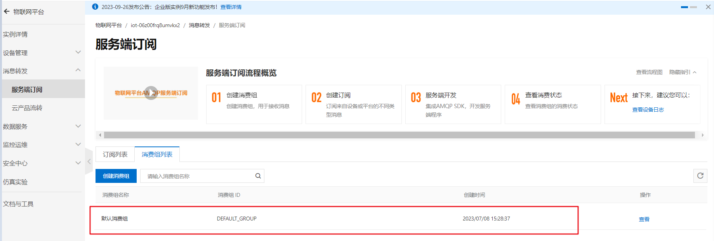

第二：创建订阅，让产品与消费组进行关联

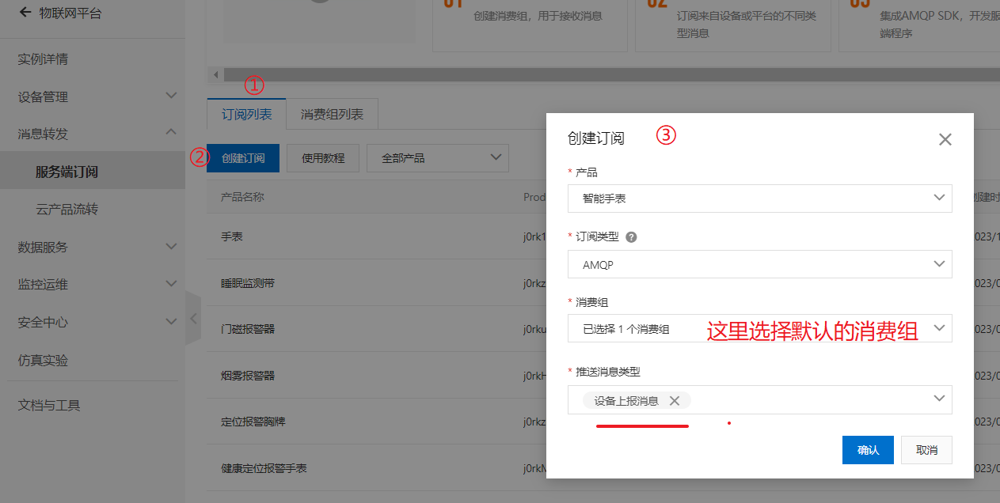

- 在**服务端订阅**页面的**订阅列表**页签下，单击**创建订阅**。

- 在**创建订阅**对话框，设置参数后单击**确认**。

  | 参数         | 说明                       |
    | ------------ | -------------------------- |
  | 产品         | 选择自己的产品（智能手表） |
  | 订阅类型     | 选择**AMQP**               |
  | 消费组       | 选择**默认消费组**         |
  | 推送消息类型 | 选择**设备上报消息**       |

### 3.3 接收设备端数据

#### 3.3.1 思路分析

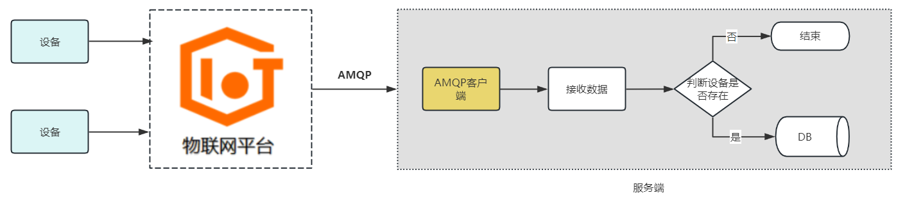

#### 3.3.2 功能实现

接收到的数据格式

```json
{
  "deviceType": "ActiveInfraredIntrusionDetectors",
  "iotId": "DoXPJsxUkV0Kcw9zrLRaj0rk00",
  "requestId": "1699948275310",
  "checkFailedData": {
  },
  "productKey": "j0rkHpZoAQ3",
  "gmtCreate": 1699948275451,
  "deviceName": "yangan_09",
  "items": {
    "CurrentHumidity": {
      "value": 75,
      "time": 1699948275447
    },
    "BatteryLevel": {
      "value": 75,
      "time": 1699948275447
    },
    "SmokeSensorState": {
      "value": 0,
      "time": 1699948275447
    },
    "IndoorTemperature": {
      "value": 27,
      "time": 1699948275447
    }
  }
}
```

在转换的时候可以使用对象去接收

```java
package com.zzyl.job;

import lombok.Data;

import java.util.Map;

@Data
public class Content {

    /**
     * 设备类型
     */
    private String deviceType;
    /**
     * 设备ID
     */
    private String iotId;
    /**
     * 请求ID
     */
    private long requestId;
    private Map<String, Object> checkFailedData;

    /**
     * 产品key
     */
    private String productKey;
    private long gmtCreate;
    private String deviceName;
    private Map<String, Item> items;

    public class Item {
        private int value;
        private long time;

        public int getValue() {
            return value;
        }

        public void setValue(int value) {
            this.value = value;
        }

        public long getTime() {
            return time;
        }

        public void setTime(long time) {
            this.time = time;
        }
    }
}
```

修改AmqpClient类中的processMessage，方法

```java
@Autowired
private DeviceMapper deviceMapper;

@Autowired
private DeviceDataMapper deviceDataMapper;


/**
     * 在这里处理您收到消息后的具体业务逻辑。
     */
private void processMessage(Message message) {
    try {
        byte[] body = message.getBody(byte[].class);
        String contentStr = new String(body);
        String topic = message.getStringProperty("topic");
        String messageId = message.getStringProperty("messageId");
        logger.info("receive message"
                    + ",\n topic = " + topic
                    + ",\n messageId = " + messageId
                    + ",\n content = " + contentStr);

        //解析数据
        Content content = JSONUtil.toBean(contentStr, Content.class);
        //查询设备
        List<DeviceVo> deviceVos = deviceMapper.selectByDeviceIds(Arrays.asList(content.getIotId()));
        if (CollectionUtil.isEmpty(deviceVos)) {
            logger.error("设备不存在" + content.getIotId());
            return;
        }
        DeviceVo deviceVo = deviceVos.get(0);

        //保存设备数据,设备中可能会存在多个物模型
        content.getItems().forEach((key, value) -> {
            DeviceData deviceData = DeviceData.builder()
                .alarmTime(LocalDateTimeUtil.of(value.getTime()))
                .deviceName(content.getDeviceName())
                .iotId(content.getIotId())
                .productId(content.getProductKey())
                .noteName(deviceVo.getNickname())
                .productName(deviceVo.getProductName())
                .accessLocation(deviceVo.getRemark())
                .functionName(key)
                .dataValue(value.getValue() + "")
                .status(0 + "")
                .build();
            //保存
            deviceDataMapper.insert(deviceData);
        });

    } catch (Exception e) {
        logger.error("processMessage occurs error ", e);

    }
}
```

#### 3.3.3 测试

（1）启动模拟设备进行上报

（2）启动后端项目，查看数据库是否保存数据成功

### 3.4 查看设备的物模型数据

#### 3.4.1 需求分析

我们先打开原型图，如下：

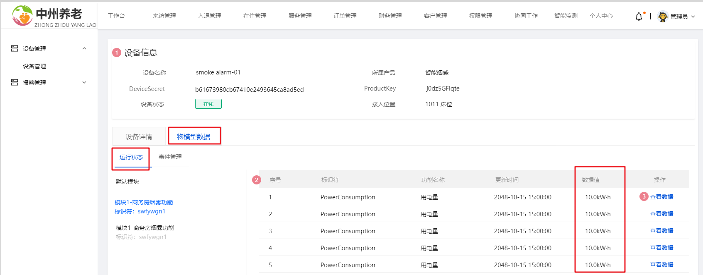

其中的数据值，是从IOT平台实时获取到的数据值

当点击了某个功能（物模型）的**查看数据**按钮，则会显示这个功能的历史数据，可以按照时间范围进行检索，如下图：

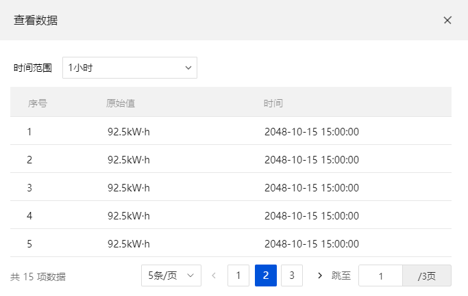

时间范围=1小时、24小时、7天、自定义；当选择自定义时，出时间选择器文本框；

#### 3.4.2 接口定义

目前需要两个接口，都是查询

- 查询物模型列表及其数据
- 查询单个物模型的历史数据

注意：其中的第一个接口，因为需要实时查询IOT平台，昨天已经实现，我们现在只需要实现第二个即可

**接口地址**:`/device-data/get-page`

**请求方式**:`GET`

**请求参数**:

| 参数名称       | 参数说明                   | 数据类型   |
|------------|------------------------|--------|
| pageNum    | 页码                     | int    |
| pageSize   | 每页大小                   | int    |
| deviceName | 设备名称                   | string |
| endTime    | 结束时间                   | long   |
| functionId | 功能ID                   | string |
| startTime  | 开始时间                   | long   |
| status     | 状态 0 正常 1 异常 2待处理 3已处理 | int    |

**响应示例**:

```javascript
{
    "code"
:
    0,
        "data"
:
    {
        "page"
    :
        0,
            "pageSize"
    :
        0,
            "pages"
    :
        0,
            "records"
    :
        [
            {
                "accessLocation": "",
                "adminCreator": "",
                "alarmTime": "",
                "createBy": 0,
                "createDay": "",
                "createTime": "",
                "createType": 0,
                "creator": "",
                "data": "",
                "dataState": "",
                "dataValue": "",
                "deviceName": "",
                "functionName": "",
                "id": 0,
                "noteName": "",
                "processingResult": "",
                "processingTime": "",
                "processor": "",
                "productId": "",
                "productName": "",
                "remark": "",
                "status": 0,
                "updateBy": 0,
                "updateTime": "",
                "updater": ""
            }
        ],
            "total"
    :
        0
    }
,
    "msg"
:
    "",
        "operationTime"
:
    ""
}
```

#### 3.4.3 功能实现

(1)定义接口

新增DeviceDataController类，并创建方法，如下：

```java
package com.zzyl.controller;

import com.zzyl.base.PageResponse;
import com.zzyl.base.ResponseResult;
import com.zzyl.service.DeviceDataService;
import com.zzyl.vo.DeviceDataVo;
import io.swagger.annotations.Api;
import io.swagger.annotations.ApiOperation;
import io.swagger.annotations.ApiParam;
import org.springframework.beans.factory.annotation.Autowired;
import org.springframework.web.bind.annotation.GetMapping;
import org.springframework.web.bind.annotation.RequestMapping;
import org.springframework.web.bind.annotation.RequestParam;
import org.springframework.web.bind.annotation.RestController;

/**
 * @author sjqn
 * @date 2023/11/14
 */
@RestController
@RequestMapping("/device-data")
@Api(tags = "设备数据管理接口")
public class DeviceDataController {

    @Autowired
    private DeviceDataService deviceDataService;

    @GetMapping("/get-page")
    @ApiOperation(value = "获取设备数据分页结果", notes = "接收包含分页信息的请求参数，返回一个包含分页数据的Page<DeviceDataDto>对象")
    public ResponseResult<PageResponse<DeviceDataVo>> getDeviceDataPage(
            @ApiParam(value = "页码", required = true) @RequestParam("pageNum") Integer pageNum,
            @ApiParam(value = "每页大小", required = true) @RequestParam("pageSize") Integer pageSize,
            @ApiParam(value = "设备名称") @RequestParam(value = "deviceName", required = false) String deviceName,
            @ApiParam(value = "功能ID") @RequestParam(value = "functionId", required = false) String functionId,
            @ApiParam(value = "开始时间")  @RequestParam(required = false) Long startTime,
            @ApiParam(value = "结束时间")  @RequestParam(required = false) Long endTime,
            @ApiParam(value = "状态 0 正常 1 异常 2待处理 3已处理")  @RequestParam(required = false) Integer status
    ){
        return deviceDataService.getDeviceDataPage(pageNum,pageSize,deviceName,accessLocation,locationType,functionId,startTime,endTime,status);
    }
}
```

(2)mapper和xml映射文件，已提供

(3)业务层

新增业务层接口DeviceDataService，定义方法如下：

```java
package com.zzyl.service;

import com.zzyl.base.PageResponse;
import com.zzyl.base.ResponseResult;
import com.zzyl.vo.DeviceDataVo;

/**
 * @author sjqn
 * @date 2023/11/14
 */
public interface DeviceDataService {
    /**
     * 分页查询
     * @param pageNum
     * @param pageSize
     * @param deviceName
     * @param accessLocation
     * @param locationType
     * @param functionId
     * @param startTime
     * @param endTime
     * @param status
     * @return
     */
    ResponseResult<PageResponse<DeviceDataVo>> getDeviceDataPage(Integer pageNum, Integer pageSize, String deviceName, String accessLocation, Integer locationType, String functionId, Long startTime, Long endTime, Integer status);

}
```

实现类：

```java
package com.zzyl.service.impl;

import cn.hutool.core.date.LocalDateTimeUtil;
import com.github.pagehelper.Page;
import com.github.pagehelper.PageHelper;
import com.zzyl.base.PageResponse;
import com.zzyl.base.ResponseResult;
import com.zzyl.mapper.DeviceDataMapper;
import com.zzyl.service.DeviceDataService;
import com.zzyl.utils.ObjectUtil;
import com.zzyl.vo.DeviceDataVo;
import org.springframework.beans.factory.annotation.Autowired;
import org.springframework.stereotype.Service;

/**
 * @author sjqn
 */
@Service
public class DeviceDataServiceImpl implements DeviceDataService {

    @Autowired
    private DeviceDataMapper deviceDataMapper;


    /**
     * 分页查询
     * @param pageNum
     * @param pageSize
     * @param deviceName
     * @param accessLocation
     * @param locationType
     * @param functionId
     * @param startTime
     * @param endTime
     * @param status
     * @return
     */
    @Override
    public ResponseResult<PageResponse<DeviceDataVo>> getDeviceDataPage(Integer pageNum, Integer pageSize, String deviceName, String accessLocation, Integer locationType, String functionId, Long startTime, Long endTime, Integer status) {
        PageHelper.startPage(pageNum, pageSize);
        Page<DeviceDataVo> page = deviceDataMapper.page(status, deviceName, accessLocation, locationType, functionId, ObjectUtil.isEmpty(startTime)?  null: LocalDateTimeUtil.of(startTime), ObjectUtil.isEmpty(endTime)?  null: LocalDateTimeUtil.of(endTime));
        return ResponseResult.success(PageResponse.of(page, DeviceDataVo.class));
    }

}
```

(4)测试

打开设备详情，找到物模型数据，点击**查看数据**按钮，查询数据，是否正常

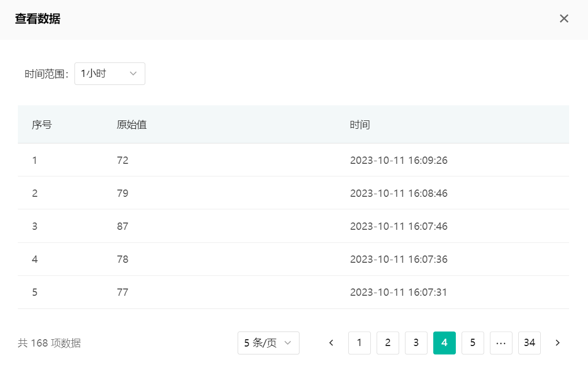

## 4 智能床位功能

### 4.1 需求分析

我们先来打开原型图

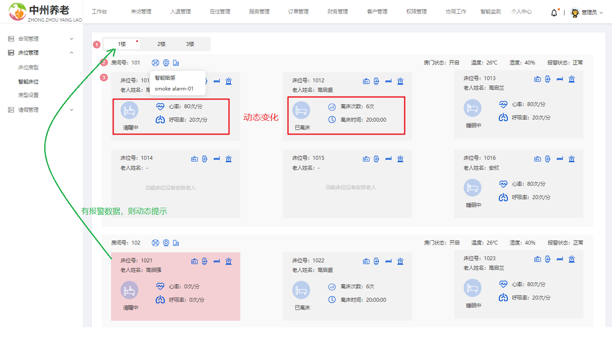

- 在床位管理里面有个智能床位，可以展示绑定智能设备的房间或床位以及设备对应的数据
- 其中数据有每分钟动态展示一次
- 如果某个设备的数据异常，则会在tab选项卡中进行提示

### 4.2 思路分析

表关系

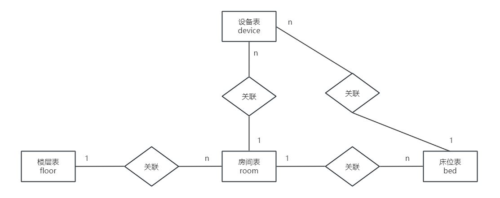

- 先查询包含了智能设备的楼层

  如果想要查询包含智能设备的楼层，需要关联以上四张表来查询

- 根据楼层查询房间或者是床位的设备数据（最新的一条数据）

  通过查询到的楼层，然后再去查询设备中的数据，不过，这边有一个性能问题。我们需要查询包含设备的最新数据，并且只需要一条，其中device_data表中的数据是包含了所有设备上报的数据，量是特别大的，如果做关联查询，性能肯定不高。所以由于只需要查询最新的一条数据，我们可以把最新的数据存入redis缓存中，这样查询数据的时候，则无需查询device_data表，性能自然能提升不少，具体思路如下：

  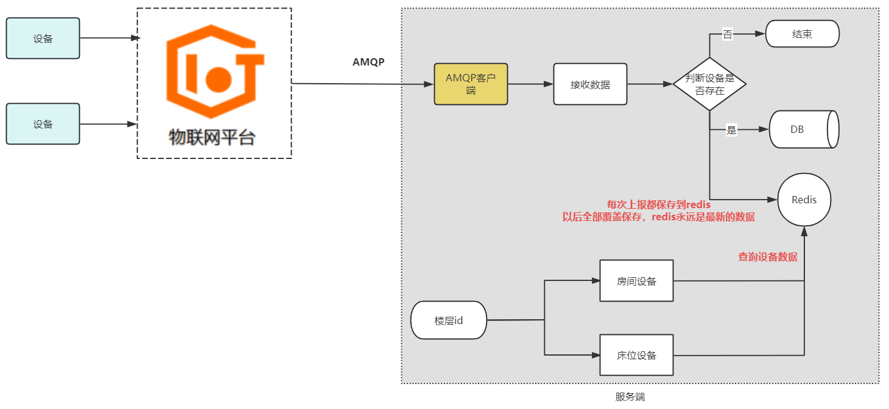

### 4.3 接口设计

#### 4.3.1 获取所有楼层 (智能床位)

**接口地址**:`/floor/getAllFloorsWithDevice`

**请求方式**:`GET`

**请求参数**:

无

**响应示例**:

```javascript
{
    "code"
:
    200,
        "msg"
:
    "操作成功",
        "data"
:
    [
        {
            "id": "1",
            "createTime": "2023-09-26 16:10:27",
            "updateTime": "2023-09-26 16:10:27",
            "createBy": "1671403256519078153",
            "name": "1楼",
            "code": 1
        },
        {
            "id": "2",
            "createTime": "2023-09-26 17:37:20",
            "updateTime": "2023-09-26 17:37:20",
            "createBy": "1671403256519078138",
            "name": "2楼",
            "code": 2
        }
    ]
}
```

#### 4.3.2 获取所有楼层 (智能床位)

**接口地址**:`/room/getRoomsWithDeviceByFloorId/{floorId}`

**请求方式**:`GET`

**请求参数**:

| 参数名称    | 参数说明 | 数据类型 |
|---------|------|------|
| floorId | 楼层ID | long |

**响应示例**:

```javascript
{
    "code"
:
    200,
        "msg"
:
    "操作成功",
        "data"
:
    [
        {//房间数据
            "id": "1",
            "createTime": "2023-09-26 17:38:25",
            "updateTime": "2023-09-26 17:38:25",
            "createBy": "1671403256519078138",
            "code": "101",
            "sort": 1,
            "floorId": "1",
            "bedVoList": [//床位列表
                {//床位
                    "id": "1",
                    "bedNumber": "101-1",
                    "bedStatus": 1,
                    "roomId": "1",
                    "name": "马克",
                    "elderId": "134",
                    "deviceVos": [//床位中的设备列表
                        {
                            "id": "136",
                            "deviceName": "sm_01",
                            "deviceId": "jTYVdXNE8GZZMWTlKN9Tj0rk00",
                            "productKey": "j0rkzrUrf05",
                            "productName": "睡眠监测带",
                            "deviceDataVos": [//设备中的数据
                                {
                                    "id": "338546",
                                    "createTime": "2023-10-11 19:13:59",
                                    "updateTime": "2023-10-11 19:13:59",
                                    "createBy": "1",
                                    "deviceName": "sm_01",
                                    "noteName": "睡眠监测带_01",
                                    "productId": "j0rkzrUrf05",
                                    "productName": "睡眠监测带",
                                    "functionName": "HeartRate",
                                    "accessLocation": "1楼,101,101-1",
                                    "dataValue": "88",
                                    "alarmTime": "2023-10-11 19:13:59",
                                    "status": 0
                                },
                                {
                                    "id": "338550",
                                    "createTime": "2023-10-11 19:13:59",
                                    "updateTime": "2023-10-11 19:13:59",
                                    "createBy": "1",
                                    "deviceName": "sm_01",
                                    "noteName": "睡眠监测带_01",
                                    "productId": "j0rkzrUrf05",
                                    "productName": "睡眠监测带",
                                    "functionName": "lichuangcishu",
                                    "accessLocation": "1楼,101,101-1",
                                    "dataValue": "15",
                                    "alarmTime": "2023-10-11 19:13:59",
                                    "status": 0
                                }
                            ]
                        }
                    ],
                    "status": 0
                }
            ],
            "deviceVos": [//房间中的设备
                {
                    "id": "135",
                    "deviceName": "Smoke_alarm_03",
                    "deviceId": "Z1Uaf123jnc1Cl8oAhGmj0rk00",
                    "productKey": "j0rkHpZoAQ3",
                    "productName": "烟雾报警器",
                    "deviceDataVos": [
                        {
                            "id": "338537",
                            "createTime": "2023-10-11 19:13:54",
                            "updateTime": "2023-10-11 19:13:54",
                            "createBy": "1",
                            "deviceName": "Smoke_alarm_03",
                            "noteName": "智能烟感03",
                            "productId": "j0rkHpZoAQ3",
                            "productName": "烟雾报警器",
                            "functionName": "CurrentHumidity",
                            "accessLocation": "1楼,101",
                            "dataValue": "68",
                            "alarmTime": "2023-10-11 19:13:54",
                            "status": 0
                        },
                        {
                            "id": "338539",
                            "createTime": "2023-10-11 19:13:54",
                            "updateTime": "2023-10-11 19:13:54",
                            "createBy": "1",
                            "deviceName": "Smoke_alarm_03",
                            "noteName": "智能烟感03",
                            "productId": "j0rkHpZoAQ3",
                            "productName": "烟雾报警器",
                            "functionName": "BatteryLevel",
                            "accessLocation": "1楼,101",
                            "dataValue": "-1990",
                            "alarmTime": "2023-10-11 19:13:54",
                            "status": 0
                        }
                    ]
                }
            ],
            "status": 0
        }
    ]
}
```

### 4.4 功能实现

#### 4.4.1 获取所有楼层 (智能床位)

(1)接口定义

在FloorController中新增方法查询楼层数据，如下

```java
@GetMapping("/getAllFloorsWithDevice")
@ApiOperation("获取所有楼层 （智能楼层）")
public ResponseResult<List<FloorVo>> getAllFloorsWithDevice(){
    return ResponseResult.success(floorService.getAllFloorsWithDevice());
}
```

(2)mapper

在FloorMapper中新增方法，如下：

```
List<FloorVo> getAllFloorsWithDevice();
```

映射文件：

```xml

<select id="getAllFloorsWithDevice" resultType="com.zzyl.vo.FloorVo">
    select f.*
    from floor f
    left join room r on f.id = r.floor_id
    left join bed b on r.id = b.room_id
    left join device d on d.binding_location = r.id and d.location_type = 1 and d.physical_location_type = 1
    left join device dd on dd.binding_location = b.id and dd.location_type = 1 and dd.physical_location_type = 2
    where (d.id is not null or dd.id is not null)
    group by f.id
    order by f.code, f.create_time desc
</select>
```

- device d关联的是房间的设备，在关联表后面限定了条件 `d.location_type = 1 and d.physical_location_type = 1`,代表的是：位置类型为
  **位置**，物理位置类为**房间**
- device dd 关联的是床位的设备，在关联表后面限定了条件 `d.location_type = 1 and d.physical_location_type = 2`,代表的是：位置类型为
  **位置**，物理位置类为**床位**

(3)业务层

在FloorService中新增方法，如下：

```java
/**
     * 查询包含智能设备的楼层
     * @return
     */
List<FloorVo> getAllFloorsWithDevice();
```

实现方法：

```java
 /**
     * 查询包含智能设备的楼层
     * @return
     */
@Override
public List<FloorVo> getAllFloorsWithDevice() {
    return floorMapper.getAllFloorsWithDevice();
}
```

(4)测试

- 前提

  新增设备，绑定楼层中的房间或床位

- 查询效果

  在智能床位模块：展示绑定过的设备的房间或床位所在的楼层列表

#### 4.4.2 获取所有楼层 (智能床位)

(1)接口定义

在RoomController中定义新的接口，接收的参数为楼层id，方法如下：

```java
@GetMapping("/getRoomsWithDeviceByFloorId/{floorId}")
@ApiOperation("获取所有房间（智能床位）")
public ResponseResult<List<RoomVo>> getRoomsWithDeviceByFloorId(@PathVariable Long floorId){
    return ResponseResult.success(roomService.getRoomsWithDeviceByFloorId(floorId));
}
```

(2)mapper

在RoomMapper中新增方法，如下：

```java
List<RoomVo> getRoomsWithDeviceByFloorId(Long floorId);
```

映射文件：

```xml

<resultMap id="getRoomsWithDeviceByFloorIdResultMap" type="com.zzyl.vo.RoomVo">
    <id property="id" column="id"/>
    <result property="code" column="code"/>
    <result property="sort" column="sort"/>
    <result property="sort" column="sort"/>
    <result property="floorId" column="floor_id"/>
    <result property="floorName" column="fname"/>
    <result column="create_by" property="createBy"/>
    <result column="update_by" property="updateBy"/>
    <result column="remark" property="remark"/>
    <result column="create_time" property="createTime"/>
    <result column="update_time" property="updateTime"/>
    <result column="price" property="price"/>
    <collection property="bedVoList" ofType="com.zzyl.vo.BedVo">
        <id column="bid" property="id"/>
        <result column="bed_number" property="bedNumber"/>
        <result column="bed_status" property="bedStatus"/>
        <result column="room_id" property="roomId"/>
        <result column="ename" property="name"/>
        <result column="eid" property="elderId"/>
        <collection property="deviceVos" ofType="com.zzyl.vo.DeviceVo">
            <id column="b_did" property="id"></id>
            <result column="b_device_id" property="deviceId"/>
            <result column="b_device_name" property="deviceName"/>
            <result column="b_product_key" property="productKey"/>
            <result column="b_produce_name" property="productName"/>
        </collection>
    </collection>
    <collection property="deviceVos" ofType="com.zzyl.vo.DeviceVo">
        <id column="r_did" jdbcType="BIGINT" property="id"/>
        <result column="device_id" jdbcType="VARCHAR" property="deviceId"/>
        <result column="device_name" jdbcType="VARCHAR" property="deviceName"/>
        <result column="product_key" jdbcType="VARCHAR" property="productKey"/>
        <result column="produce_name" jdbcType="BIT" property="productName"/>
    </collection>
</resultMap>

<select id="getRoomsWithDeviceByFloorId" resultMap="getRoomsWithDeviceByFloorIdResultMap">
select r.*,
b.id bid,
b.bed_number,
b.sort,
b.bed_status,
b.room_id,
b.create_by,
b.update_by,
b.remark,
b.create_time,
b.update_time,
e.name ename,
e.id eid,
d.id as r_did,
d.device_id,
d.product_id as product_key,
d.device_name,
d.produce_name,
dd.id as b_did,
dd.device_id b_device_id,
dd.product_id as b_product_key,
dd.device_name as b_device_name,
dd.produce_name as b_produce_name
from room r
left join bed b on r.id = b.room_id
left join elder e on b.id = e.bed_id
left join device d on d.binding_location = r.id and d.location_type = 1 and d.physical_location_type = 1
left join device dd on dd.binding_location = b.id and dd.location_type = 1 and dd.physical_location_type = 2
where r.floor_id = #{floorId}
and (d.id is not null or dd.id is not null)
order by r.sort ,r.create_time desc
</select>
```

(3)业务层

在RoomService中新增方法，如下

```java
/**
     * 查询楼层中的房间和床位设备及数据
     * @param floorId
     * @return
     */
List<RoomVo> getRoomsWithDeviceByFloorId(Long floorId);
```

实现方法：

```java
/**
     * 查询楼层中的房间和床位设备及数据
     * @param floorId
     * @return
     */
@Override
public List<RoomVo> getRoomsWithDeviceByFloorId(Long floorId) {

    //根据楼层id检索数据
    List<RoomVo> roomVos = roomMapper.getRoomsWithDeviceByFloorId(floorId);
    roomVos.forEach(roomVo -> {
        //获取房间中的设备数据
        roomVo.getDeviceVos().forEach(deviceVo -> {
            String deviceId = deviceVo.getDeviceId();
            String deviceLastDataJson = (String) redisTemplate.opsForHash().get(Constants.DEVICE_LASTDATA_CACHE_KEY, deviceId);
            if(StringUtils.isEmpty(deviceLastDataJson)){
                return;//跳过本次循环
            }
            //获取设备中的数据
            List<DeviceDataVo> deviceDataVos = JSONUtil.toList(deviceLastDataJson, DeviceDataVo.class);
            deviceVo.setDeviceDataVos(deviceDataVos);
            //修改状态，告诉前端，设备中有数据
            roomVo.setStatus(2);
        });

        //获取房间中的床位及设备数据
        List<BedVo> bedVoList = roomVo.getBedVoList();
        bedVoList.forEach(bedVo -> {
            List<DeviceVo> deviceVos = bedVo.getDeviceVos();
            deviceVos.forEach(deviceVo -> {
                String deviceId = deviceVo.getDeviceId();
                String deviceLastDataJson = (String) redisTemplate.opsForHash().get(Constants.DEVICE_LASTDATA_CACHE_KEY, deviceId);
                if(StringUtils.isEmpty(deviceLastDataJson)){
                    return;//跳过本次循环
                }
                //获取设备中的数据
                List<DeviceDataVo> deviceDataVos = JSONUtil.toList(deviceLastDataJson, DeviceDataVo.class);
                deviceVo.setDeviceDataVos(deviceDataVos);
                //修改状态，告诉前端，设备中有数据
                roomVo.setStatus(2);
                bedVo.setStatus(2);
            });
        });
    });

    return roomVos;
}
```

其中的常量定义在zzyl-common模块下创建，在Constants类中新增常量，如下：

```java
/**
 * 设备最新数据缓存KEY
 */
public static final String DEVICE_LASTDATA_CACHE_KEY = "deviceLastData";
```

(4)监听器中保存数据到缓存

在AmqpClient类中的processMessage方法，把设备的数据保存到缓存中

processMessage方法，完整代码：

```java
@Autowired
    private RedisTemplate<String, String> redisTemplate;


/**
     * 在这里处理您收到消息后的具体业务逻辑。
     */
private void processMessage(Message message) {
    try {
        byte[] body = message.getBody(byte[].class);
        String contentStr = new String(body);
        String topic = message.getStringProperty("topic");
        String messageId = message.getStringProperty("messageId");
        logger.info("receive message"
                    + ",\n topic = " + topic
                    + ",\n messageId = " + messageId
                    + ",\n content = " + contentStr);

        //解析数据
        Content content = JSONUtil.toBean(contentStr, Content.class);
        //查询设备
        List<DeviceVo> deviceVos = deviceMapper.selectByDeviceIds(Arrays.asList(content.getIotId()));
        if (CollectionUtil.isEmpty(deviceVos)) {
            logger.error("设备不存在" + content.getIotId());
            return;
        }
        DeviceVo deviceVo = deviceVos.get(0);

        List<DeviceDataVo> list = new ArrayList<>();

        //保存设备数据,设备中可能会存在多个物模型
        content.getItems().forEach((key, value) -> {
            DeviceData deviceData = DeviceData.builder()
                .alarmTime(LocalDateTimeUtil.of(value.getTime()))
                .deviceName(content.getDeviceName())
                .iotId(content.getIotId())
                .productId(content.getProductKey())
                .noteName(deviceVo.getNickname())
                .productName(deviceVo.getProductName())
                .accessLocation(deviceVo.getRemark())
                .functionName(key)
                .dataValue(value.getValue() + "")
                .status(0 + "")
                .build();
            //保存
            deviceDataMapper.insert(deviceData);
            DeviceDataVo deviceDataVo = BeanUtil.toBean(deviceData, DeviceDataVo.class);
            list.add(deviceDataVo);
        });
        //保存数据到缓存中
        redisTemplate.opsForHash().put(Constants.DEVICE_LASTDATA_CACHE_KEY, content.getIotId(), JSONUtil.toJsonStr(list));

    } catch (Exception e) {
        logger.error("processMessage occurs error ", e);

    }
}
```

(5)测试

- 前提条件

  在绑定设备的床位或房间中，启动设备模拟上报数据

- 在页面中查询上报之后的数据

  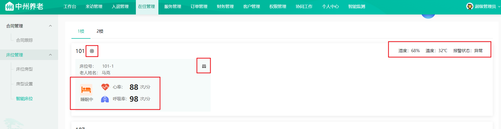

## 5 家属端家人数据报表展示

### 5.1 需求分析

我们先来看原型图

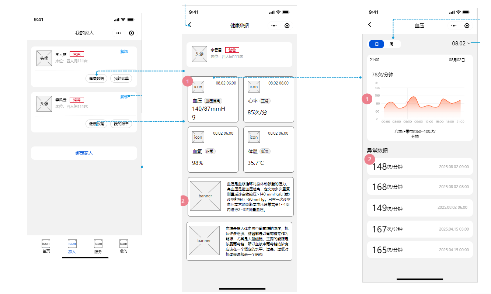

在小程序端，绑定了老人之后，就可以查看老人的健康数据。

- 在家人列表中，点击【健康数据】，跳转到【健康数据】，这里展示的是老人健康数据概览和当下最新指标数据
- 当点击了某一个指标之后，可以查看某一个指标的历史数据，可以按天或周进行报表展示
- 异常数据，后边讲完告警模块之后，再来完善异常数据展示

### 5.2 思路分析

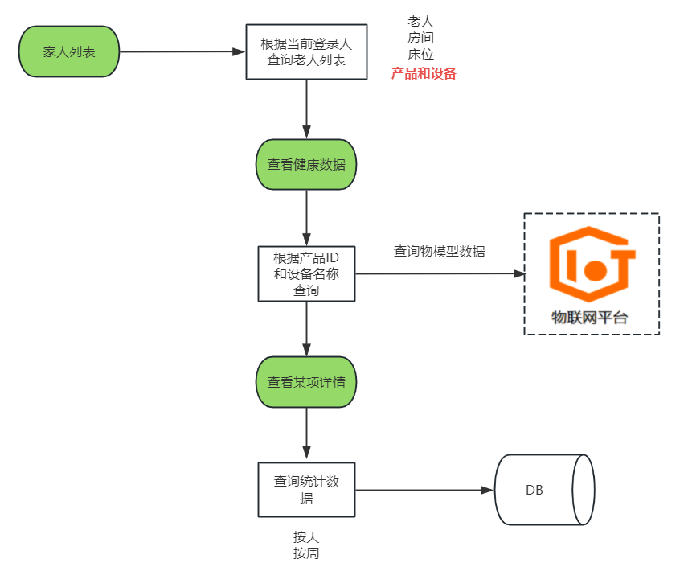

- 当查看**家人列表**的时候，需要查询当前登录人的老人列表，同时老人的其他信息也要查询出来（房间、床位、设备）
- 当点击**健康数据**的时候，需要根据当前老人绑定的产品和设备名称到IOT平台查询物模型数据
- 当点击**某项指标数据**，比如**心率**，可以查看这个指标数据的报表信息，报表包含了两种
    - 按照天查询，其中心率、血压、血氧、体温的传输频次：每3小时测量传输一次，所以一天展示8次
    - 按周查询，周数据值显示近七天，天数据为当天数据的平均值

### 5.3 接口设计

根据上面的思路分析，我们共需要开发4个接口，分别是：家人列表、查询健康数据、按天统计、按周统计

其中的家人列表，在代码中已经提供，我们重点实现剩下的3个

#### 5.3.1 查询健康数据

**接口地址**:`/customer/user/QueryDevicePropertyStatus`

**请求方式**:`POST`

**请求示例**:

```json
{
  "deviceName": "",
  "productKey": ""
}
```

**响应示例**:

```json
{
  "code": 200,
  "msg": "操作成功",
  "data": {
    "list": {
      "propertyStatusInfo": [
        {
          "dataType": "int",
          "identifier": "HeartRate",
          "name": "心率",
          "time": "1697096335545",
          "unit": "",
          "value": "87"
        },
        {
          "dataType": "float",
          "identifier": "BodyTemp",
          "name": "体温",
          "time": "1697096335545",
          "unit": "℃",
          "value": "39.0"
        },
        {
          "dataType": "int",
          "identifier": "xueyang",
          "name": "血氧",
          "time": "1697096335545",
          "value": "106"
        },
        {
          "dataType": "double",
          "identifier": "BatteryPercentage",
          "name": "电池电量百分比",
          "time": "1697096335545",
          "unit": "%",
          "value": "-22.0"
        },
        {
          "dataType": "int",
          "identifier": "xueya",
          "name": "血压"
        }
      ]
    }
  }
}
```

#### 5.3.2 按天统计查询指标数据

**接口地址**:`/customer/user/get-page`

**请求方式**:`GET`

**请求参数**:

| 参数名称       | 参数说明                   | 数据类型           |
|------------|------------------------|----------------|
| pageNum    | 页码                     | integer(int32) |
| pageSize   | 每页大小                   | integer(int32) |
| deviceName | 设备名称                   | string         |
| endTime    | 结束时间                   | integer(int64) |
| functionId | 功能ID                   | string         |
| startTime  | 开始时间                   | integer(int64) |
| status     | 状态 0 正常 1 异常 2待处理 3已处理 | integer(int32) |

**响应示例**:

```javascript
{
    "code"
:
    200,
        "msg"
:
    "操作成功",
        "data"
:
    {
        "total"
    :
        "456",
            "pageSize"
    :
        10,
            "pages"
    :
        "46",
            "page"
    :
        1,
            "records"
    :
        [
            {
                "id": "352069",
                "createTime": "2023-10-12 15:41:31",
                "updateTime": "2023-10-12 15:41:31",
                "createBy": "1",
                "deviceName": "watch_08",
                "noteName": "智能定位手表",
                "productId": "j0rkM5mCanO",
                "productName": "健康定位报警手表",
                "functionName": "HeartRate",
                "accessLocation": "马克",
                "dataValue": "86",
                "alarmTime": "2023-10-12 15:41:31",
                "status": 0
            }
        ]
    }
}
```

#### 5.3.3 按周统计查询指标数据

**接口地址**:`/customer/user/get-week-page`

**请求方式**:`GET`

**请求参数**:

| 参数名称       | 参数说明                   | 数据类型           |
|------------|------------------------|----------------|
| pageNum    | 页码                     | integer(int32) |
| pageSize   | 每页大小                   | integer(int32) |
| deviceName | 设备名称                   | string         |
| endTime    | 结束时间                   | integer(int64) |
| functionId | 功能ID                   | string         |
| startTime  | 开始时间                   | integer(int64) |
| status     | 状态 0 正常 1 异常 2待处理 3已处理 | integer(int32) |

**响应示例**:

```json
{
  "code": 200,
  "msg": "操作成功",
  "data": {
    "total": "2",
    "pageSize": 10,
    "pages": "1",
    "page": 1,
    "records": [
      {
        "dataValue": "79.5531453362256",
        "data": "10月12日"
      },
      {
        "dataValue": "78.51217712177122",
        "data": "10月11日"
      },
      {
        "dataValue": "78.51217712177122",
        "data": "10月10日"
      },
      {
        "dataValue": "78.51217712177122",
        "data": "10月09日"
      },
      {
        "dataValue": "78.51217712177122",
        "data": "10月08日"
      },
      {
        "dataValue": "78.51217712177122",
        "data": "10月07日"
      },
      {
        "dataValue": "78.51217712177122",
        "data": "10月06日"
      }
    ]
  }
}
```

### 5.4 功能实现

#### 5.4.1 查询健康数据

根据产品ID和设备名称查询物模型数据，我们在前一天已经实现过一次

小程序的查询需要定义在客户管理的控制层，CustomerUserController中实现，如下代码：

```java
package com.zzyl.controller.customer;

/**
 * <p>
 * 用户管理
 */
@Slf4j
@Api(tags = "客户管理")
@RestController
@RequestMapping("/customer/user")
public class CustomerUserController extends BaseController {

    @Autowired
    private MemberService memberService;

    @Resource
    private Client client;

    @Value("${zzyl.aliyun.iotInstanceId}")
    private String iotInstanceId;

    @PostMapping("/QueryDevicePropertyStatus")
    @ApiOperation(value = "查询指定设备的状态", notes = "查询指定设备的状态")
    public ResponseResult QueryDevicePropertyStatus(@RequestBody QueryDevicePropertyStatusRequest request) throws Exception {
        request.setIotInstanceId(iotInstanceId);
        QueryDevicePropertyStatusResponse deviceStatus = client.queryDevicePropertyStatus(request);
        return ResponseResult.success(deviceStatus.getBody().getData());
    }


}
```

测试

- 前提条件有两个

    - 家属端登录人需要绑定带有智能手表设备的老人
    - 启动模拟数据上报

- 当点击了健康数据按钮，之后，查询效果如下：

  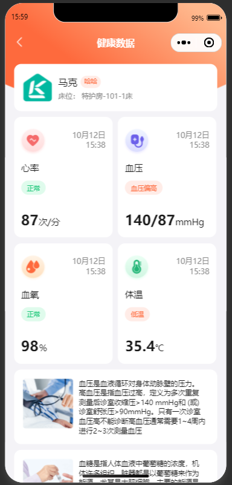

  > 注意：目前前端只开发了心率的动态展示和报表展示，大家看效果主要看心率这个物模型

#### 5.4.2 按天统计查询指标数据

(1) 接口定义

在CustomerUserController新增接口，如下：

```java
@GetMapping("/get-page")
@ApiOperation("获取设备数据分页结果")
public ResponseResult<PageResponse<DeviceDataVo>> getDeviceDataPage(
    @ApiParam(value = "页码", required = true) @RequestParam("pageNum") Integer pageNum,
    @ApiParam(value = "每页大小", required = true) @RequestParam("pageSize") Integer pageSize,
    @ApiParam(value = "设备名称") @RequestParam(value = "deviceName", required = false) String deviceName,
    @ApiParam(value = "功能ID") @RequestParam(value = "functionId", required = false) String functionId,
    @ApiParam(value = "开始时间")  @RequestParam(required = false) Long startTime,
    @ApiParam(value = "结束时间")  @RequestParam(required = false) Long endTime,
    @ApiParam(value = "状态 0 正常 1 异常 2待处理 3已处理")  @RequestParam(required = false) Integer status) {
    PageResponse<DeviceDataVo> page = deviceDataService.getDeviceDataPage(pageNum, pageSize, deviceName, functionId, startTime, endTime, status);
    return ResponseResult.success(page);
}
```

(2) mapper

已实现

(3) 业务层

已实现

(4)测试

在小程序端点击心率，可以查看报表数据，也可以选择时间来进行检索，如下图

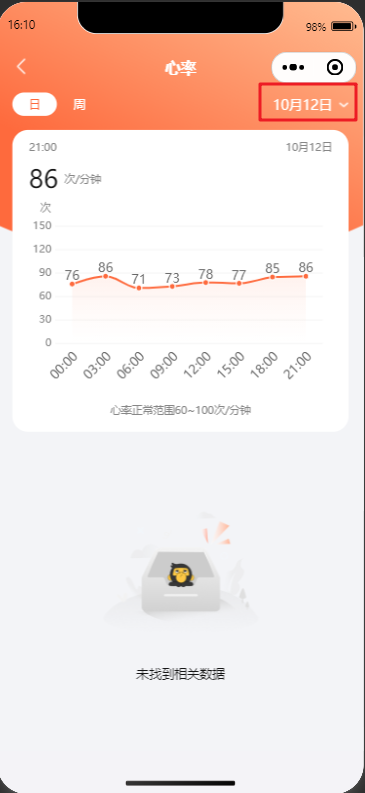

#### 5.4.3 按周统计查询指标数据

(1) 接口定义

在CustomerUserController新增方法，如下：

```java
@GetMapping("/get-week-page")
@ApiOperation("按周获取设备数据分页结果")
public ResponseResult<PageResponse<DeviceDataVo>> getDeviceWeekDataPage(
    @ApiParam(value = "页码", required = true) @RequestParam("pageNum") Integer pageNum,
    @ApiParam(value = "每页大小", required = true) @RequestParam("pageSize") Integer pageSize,
    @ApiParam(value = "设备名称") @RequestParam(value = "deviceName", required = false) String deviceName,
    @ApiParam(value = "功能ID") @RequestParam(value = "functionId", required = false) String functionId,
    @ApiParam(value = "开始时间")  @RequestParam(required = false) Long startTime,
    @ApiParam(value = "结束时间")  @RequestParam(required = false) Long endTime) {
    return deviceDataService.getDeviceWeekDataPage(pageNum,pageSize,deviceName,functionId,startTime,endTime);
}
```

(2) mapper

在DeviceDataMapper中新增方法，如下

```java
Page<DeviceDataVo> pageWeek(String deviceName,String functionId, LocalDateTime startTime, LocalDateTime endTime);
```

映射文件：

```xml

<select id="pageWeek" resultType="com.zzyl.vo.DeviceDataVo">
    select
    DATE_FORMAT(`alarm_time`, '%m月%d日') AS `data`, AVG(`data_value`) AS `data_value`
    from device_data
    <where>
        <if test="deviceName != null">
            and device_name = #{deviceName,jdbcType=VARCHAR}
        </if>
        <if test="functionId != null">
            and function_name = #{functionId,jdbcType=VARCHAR}
        </if>
        <if test="startTime != null and endTime != null">
            AND alarm_time BETWEEN #{startTime} AND #{endTime}
        </if>
    </where>
    group by data
    order by create_time desc

</select>
```

(3) 业务层

在DeviceDataService中新增方法，如下：

```java
/**
     * 根据周进行统计数据
     * @param pageNum
     * @param pageSize
     * @param deviceName
     * @param functionId
     * @param startTime
     * @param endTime
     * @return
     */
ResponseResult<PageResponse<DeviceDataVo>> getDeviceWeekDataPage(Integer pageNum, Integer pageSize, String deviceName, String functionId, Long startTime, Long endTime);
```

实现方法

```java
 /**
     * 根据周进行统计数据
     * @param pageNum
     * @param pageSize
     * @param deviceName
     * @param functionId
     * @param startTime
     * @param endTime
     * @return
     */
@Override
public ResponseResult<PageResponse<DeviceDataVo>> getDeviceWeekDataPage(Integer pageNum, Integer pageSize, String deviceName, String functionId, Long startTime, Long endTime) {
    PageHelper.startPage(pageNum, pageSize);
    Page<DeviceDataVo> deviceDataVos = deviceDataMapper.pageWeek(deviceName, functionId, ObjectUtil.isEmpty(startTime) ? null : LocalDateTimeUtil.of(startTime), ObjectUtil.isEmpty(endTime) ? null : LocalDateTimeUtil.of(endTime));
    return ResponseResult.success(PageResponse.of(deviceDataVos,DeviceDataVo.class));
}
```

(4)测试

测试效果如下：


