# 物联网智能监测-报警及优化

## 1 目标

前两天我们已经完成智能监测的大部分功能，其中有一项尤为关键，就是设备数据如果监测到有异常数据之后，我们该如何找出这些异常数据，以及找到的异常数据又该如何处理呢？今天的内容我们重点就围绕数据报警来讲解。

目标：

- 能够理解创建报警的规则

- 能够独立完成数据报警模块的功能开发
- 能够掌握使用websocket处理数据报警之后的提醒
- 能够完成设备数据定时清理的功能

## 2 数据报警规则管理

想要获取报警数据，我们首先必须先制定报警规则，会根据不同的设备，不同的物模型来定义报警规则

### 2.1 需求分析

#### 2.1.1 新增报警规则

我们先来分析需求，打开原型图

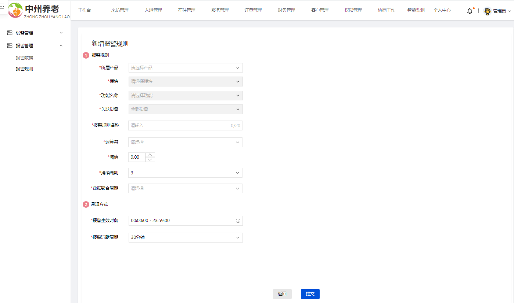

数据来源：

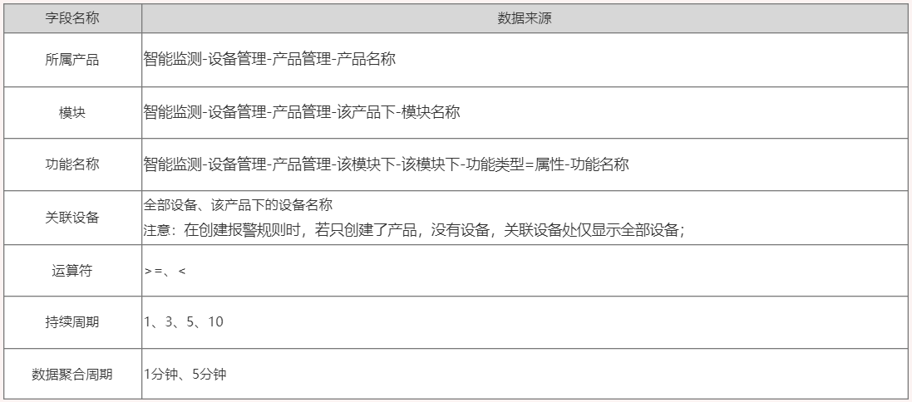

- 报警生效时间: 报警规则的生效时间，报警规则只在生效时间内才会检查监控数据是否需要报警

- 报警沉默周期: 指报警发生后如果未恢复正常，重复发送报警通知的时间间隔;
    - 数据范围：5分钟、10分钟、15分钟、30分钟、60分钟、3小时、6小时、12小时、24小时；

> **例如：**
>
> 1分钟（数据聚合周期）检查一次智能手表（所属产品）中的全部设备（关联设备）的血氧（功能名称），原值（统计字段）是否 <
> =90（运算符+阈值），当连续3个周期（持续周期）都满足这个规则时，触发报警；
>
> 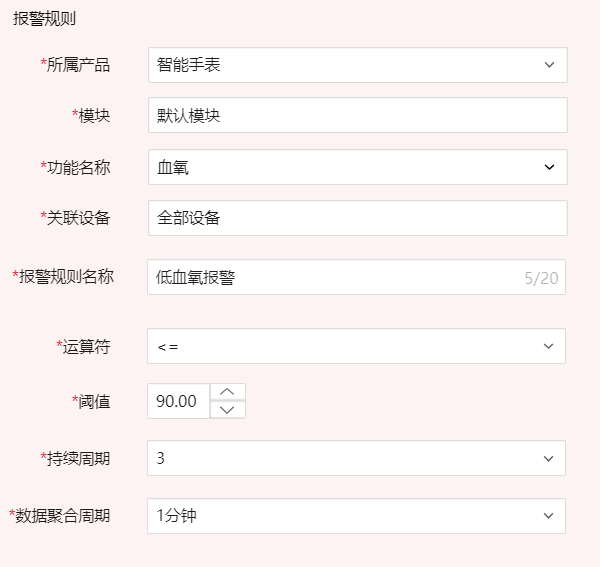

#### 2.1.2 查询报警规则数据

下面这个就是查询刚刚创建的报警规则列表

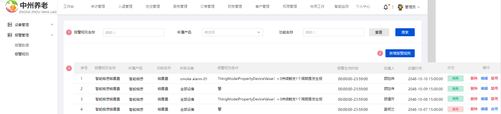

其中在操作中可以处理报警规则（删除，编辑，禁用）

#### 2.1.3 查询报警数据

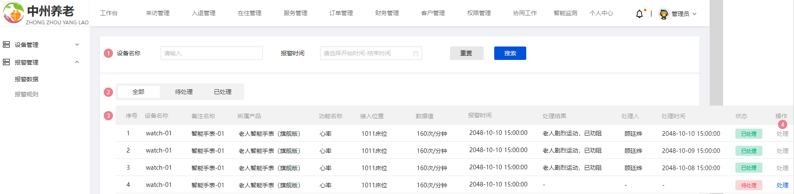

这里展示符合报警规则的报警数据，其中看到报警数据之后，需要处理数据

当点击处理按钮之后，弹窗，填写处理时间和结果

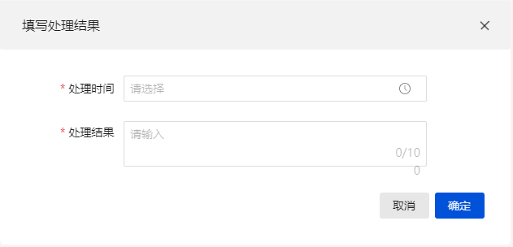

### 2.2 表结构设计

设备相关E-R图

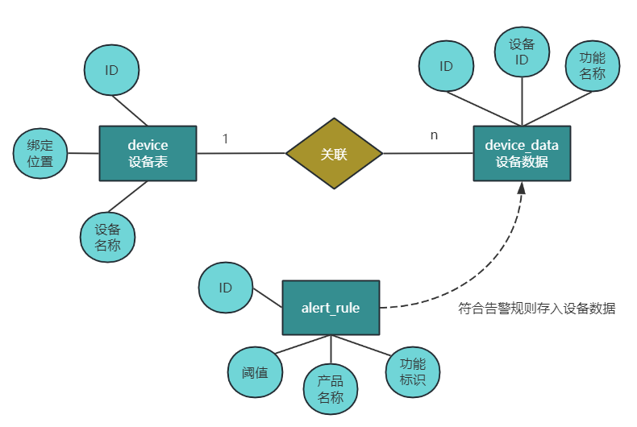

创建表语句

```sql
CREATE TABLE "alert_rule" (
  "id" bigint NOT NULL AUTO_INCREMENT,
  "product_id" varchar(50) CHARACTER SET utf8mb4 COLLATE utf8mb4_unicode_ci DEFAULT NULL COMMENT '所属产品的key',
  "product_name" varchar(500) CHARACTER SET utf8mb4 COLLATE utf8mb4_unicode_ci DEFAULT NULL COMMENT '产品名称',
  "module_id" varchar(50) CHARACTER SET utf8mb4 COLLATE utf8mb4_unicode_ci DEFAULT NULL COMMENT '模块的key',
  "module_name" varchar(500) CHARACTER SET utf8mb4 COLLATE utf8mb4_unicode_ci DEFAULT NULL COMMENT '模块名称',
  "function_name" varchar(255) CHARACTER SET utf8mb4 COLLATE utf8mb4_unicode_ci DEFAULT NULL COMMENT '功能名称',
  "function_id" varchar(255) CHARACTER SET utf8mb4 COLLATE utf8mb4_unicode_ci DEFAULT NULL COMMENT '功能标识',
  "related_device" varchar(255) CHARACTER SET utf8mb4 COLLATE utf8mb4_unicode_ci DEFAULT NULL COMMENT '接入设备',
  "device_name" varchar(255) CHARACTER SET utf8mb4 COLLATE utf8mb4_unicode_ci DEFAULT NULL COMMENT '设备名称',
  "alert_rule_name" varchar(255) CHARACTER SET utf8mb4 COLLATE utf8mb4_unicode_ci DEFAULT NULL COMMENT '告警规则名称',
  "statistic_field" varchar(255) CHARACTER SET utf8mb4 COLLATE utf8mb4_unicode_ci DEFAULT NULL COMMENT '统计字段',
  "operator" varchar(255) CHARACTER SET utf8mb4 COLLATE utf8mb4_unicode_ci DEFAULT NULL COMMENT '运算符',
  "value" float DEFAULT NULL COMMENT '阈值',
  "duration" int DEFAULT NULL COMMENT '持续周期',
  "data_aggregation_period" int DEFAULT NULL COMMENT '数据聚合周期',
  "alert_effective_period" varchar(255) CHARACTER SET utf8mb4 COLLATE utf8mb4_unicode_ci DEFAULT NULL COMMENT '报警生效时段',
  "alert_silent_period" int DEFAULT NULL COMMENT '报警沉默周期',
  "status" int DEFAULT NULL COMMENT '0 禁用 1启用',
  "create_time" datetime NOT NULL COMMENT '创建时间',
  "update_time" datetime DEFAULT NULL COMMENT '更新时间',
  "create_by" bigint DEFAULT NULL COMMENT '创建人id',
  "update_by" bigint DEFAULT NULL COMMENT '更新人id',
  "remark" varchar(255) CHARACTER SET utf8mb4 COLLATE utf8mb4_0900_ai_ci DEFAULT NULL COMMENT '备注',
  PRIMARY KEY ("id") USING BTREE
) ENGINE=InnoDB AUTO_INCREMENT=26 DEFAULT CHARSET=utf8mb4 COLLATE=utf8mb4_unicode_ci ROW_FORMAT=DYNAMIC;
```

对应实体类：

```java
package com.zzyl.entity;

import com.zzyl.base.BaseEntity;
import lombok.Data;

@Data
public class AlertRule extends BaseEntity {

    /**
     * 报警生效时段
     */
    private String alertEffectivePeriod;

    /**
     * 告警规则名称
     */
    private String alertRuleName;

    /**
     * 报警沉默周期
     */
    private Integer alertSilentPeriod;

    /**
     * 数据聚合周期
     */
    private Integer dataAggregationPeriod;

    /**
     * 设备名称
     */
    private String deviceName;

    /**
     * 持续周期
     */
    private Integer duration;

    /**
     * 功能标识
     */
    private String functionId;

    /**
     * 功能名称
     */
    private String functionName;

    /**
     * 模块的key
     */
    private String moduleId;

    /**
     * 模块名称
     */
    private String moduleName;

    /**
     * 运算符
     */
    private String operator;

    /**
     * 所属产品的key
     */
    private String productId;

    /**
     * 产品名称
     */
    private String productName;

    /**
     * 接入设备
     */
    private String relatedDevice;

    /**
     * 备注
     */
    private String remark;

    /**
     * 统计字段
     */
    private String statisticField;

    /**
     * 0 禁用 1启用
     */
    private Integer status;

    /**
     * 阈值
     */
    private Float value;

}
```

### 2.3 接口设计

在告警规则模块一共有6个接口，分别是：

创建告警规则、分页查询、根据ID查询、修改、删除、启用禁用

#### 2.3.1 创建告警规则

**接口地址**:`/alert-rule/create`

**请求方式**:`POST`

**请求示例**:

```javascript
{
    "alertEffectivePeriod"
:
    "00:00:00~23:59:59",//报警生效时段
        "alertRuleName"
:
    "舒张压高值监测",//告警规则名称
        "alertSilentPeriod"
:
    5,//报警沉默周期
        "dataAggregationPeriod"
:
    1,//数据聚合周期
        "deviceId"
:
    "-1",//接入设备  -1代表该产品下的所有设备
        "deviceName"
:
    "全部设备",//设备名称
        "duration"
:
    3,//持续周期
        "functionId"
:
    "xueya",//功能标识
        "functionName"
:
    "血压",//功能名称
        "moduleId"
:
    "-1",//模块的key
        "moduleName"
:
    "默认模块",//模块名称
        "operator"
:
    ">=",//运算符 有两个   >=  |  <
        "productKey"
:
    "j0rkM5mCanO",// 产品key
        "productName"
:
    "健康定位报警手表",// 产品名称
        "remark"
:
    5,// 也是沉默周期
        "status"
:
    1,//  状态
        "value"
:
    100  //  数据阈值
}
```

**响应示例**:

```javascript
{
    "code"
:
    0,
        "data"
:
    {
    }
,
    "msg"
:
    "",
        "operationTime"
:
    ""
}
```

#### 2.3.2 分页查询

**接口地址**:`/alert-rule/get-page`

**请求方式**:`GET`

**请求参数**:

| 参数名称          | 参数说明 | 数据类型   |
|---------------|------|--------|
| pageNum       | 页码   | int    |
| pageSize      | 每页大小 | int    |
| alertRuleName | 规则名称 | string |
| functionName  | 功能名称 | string |
| productKey    | 产品ID | string |

**响应示例**:

```javascript
{
    "code"
:
    200,
        "msg"
:
    "操作成功",
        "data"
:
    {
        "total"
    :
        "1",
            "pageSize"
    :
        10,
            "pages"
    :
        "1",
            "page"
    :
        1,
            "records"
    :
        [
            {
                "id": "30",
                "createTime": "2023-11-18 22:14:09",
                "updateTime": "2023-11-18 22:14:09",
                "createBy": "1671403256519078138",
                "remark": "5",
                "creator": "超级管理员",
                "productId": "j0rkzrUrf05",
                "relatedDevice": "-1",
                "productKey": "j0rkzrUrf05",
                "productName": "睡眠监测带",
                "moduleId": "-1",
                "moduleName": "默认模块",
                "functionName": "心率",
                "functionId": "HeartRate",
                "deviceId": "-1",
                "deviceName": "全部设备",
                "alertRuleName": "心率低值监测",
                "operator": "<",
                "value": 60.0,
                "duration": 3,
                "dataAggregationPeriod": 1,
                "alertEffectivePeriod": "00:00:00~23:59:59",
                "alertSilentPeriod": 5,
                "status": 1,
                "rules": "ThingModelPropertyDeviceValue <60.0持续触发3个周期时发生报警"
            }
        ]
    }
}
```

#### 2.3.3 根据ID查询规则

**接口地址**:`/alert-rule/read/{id}`

**请求方式**:`GET`

**请求参数**:

| 参数名称 | 参数说明 | 数据类型 |
|------|------|------|
| id   | 主键   | long |

**响应示例**:

```javascript
{
    "code"
:
    200,
        "msg"
:
    "操作成功",
        "data"
:
    {
        "id"
    :
        "31",
            "createTime"
    :
        "2023-11-19 01:54:13",
            "updateTime"
    :
        "2023-11-19 01:54:13",
            "createBy"
    :
        "1671403256519078138",
            "remark"
    :
        "5",
            "productId"
    :
        "j0rkM5mCanO",
            "relatedDevice"
    :
        "-1",
            "productKey"
    :
        "j0rkM5mCanO",
            "productName"
    :
        "健康定位报警手表",
            "moduleId"
    :
        "-1",
            "moduleName"
    :
        "默认模块",
            "functionName"
    :
        "血压",
            "functionId"
    :
        "xueya",
            "deviceId"
    :
        "-1",
            "alertRuleName"
    :
        "舒张压高值监测",
            "operator"
    :
        ">=",
            "value"
    :
        100.0,
            "duration"
    :
        3,
            "dataAggregationPeriod"
    :
        1,
            "alertEffectivePeriod"
    :
        "00:00:00~23:59:59",
            "alertSilentPeriod"
    :
        5,
            "status"
    :
        1
    }
}
```

#### 2.3.4 修改

**接口地址**:`/alert-rule/update/{id}`

**请求方式**:`PUT`

**请求示例**:

```javascript
{
    "id"
:
    "31",
        "alertEffectivePeriod"
:
    "00:00:00~23:59:59",//报警生效时段
        "alertRuleName"
:
    "舒张压高值监测",//告警规则名称
        "alertSilentPeriod"
:
    5,//报警沉默周期
        "dataAggregationPeriod"
:
    1,//数据聚合周期
        "deviceId"
:
    "-1",//接入设备  -1代表该产品下的所有设备
        "deviceName"
:
    "全部设备",//设备名称
        "duration"
:
    3,//持续周期
        "functionId"
:
    "xueya",//功能标识
        "functionName"
:
    "血压",//功能名称
        "moduleId"
:
    "-1",//模块的key
        "moduleName"
:
    "默认模块",//模块名称
        "operator"
:
    ">=",//运算符 有两个   >=  |  <
        "productKey"
:
    "j0rkM5mCanO",// 产品key
        "productName"
:
    "健康定位报警手表",// 产品名称
        "remark"
:
    5,// 也是沉默周期
        "status"
:
    1,//  状态
        "value"
:
    100  //  数据阈值
}
```

**响应示例**:

```javascript
{
    "code"
:
    0,
        "data"
:
    {
    }
,
    "msg"
:
    "",
        "operationTime"
:
    ""
}
```

#### 2.3.5 删除

**接口地址**:`/alert-rule/delete/{id}`

**请求方式**:`DELETE`

**请求参数**:

| 参数名称 | 参数说明 | 数据类型 |
|------|------|------|
| id   | 主键   | long |

**响应示例**:

```javascript
{
    "code"
:
    0,
        "data"
:
    {
    }
,
    "msg"
:
    "",
        "operationTime"
:
    ""
}
```

#### 2.3.6 启用禁用

**接口地址**:`/alert-rule/{id}/status/{status}`

**请求方式**:`PUT`

**请求参数**:

| 参数名称   | 参数说明         | 数据类型           |
|--------|--------------|----------------|
| id     | 主键           | integer(int64) |
| status | 状态（0 禁用 1启用） | integer(int32) |

**响应示例**:

```javascript
{
    "code"
:
    0,
        "data"
:
    {
    }
,
    "msg"
:
    "",
        "operationTime"
:
    ""
}
```

### 2.4 功能实现

由于这个模块也是单表的增删改查，为了后面能够过滤采集数据，我们在课堂上实现两个接口，剩下的需要同学们自己完成

基于接口文档，我们来实现创建告警规则和分页查询

#### 2.4.1 创建告警规则

(1) 接口定义

新建AlertRuleController，定义接口如下：

```java
package com.zzyl.controller;

@RestController
@RequestMapping("/alert-rule")
@Api(tags = "告警规则管理接口")
public class AlertRuleController {

    // 创建告警规则
    @PostMapping("/create")
    @ApiOperation("创建告警规则)
    public ResponseResult createAlertRule(@RequestBody AlertRuleDto alertRuleDto) {
        return null;
    }

}
```

(2) mapper

新增AlertRuleMapper

```java
package com.zzyl.mapper;

@Mapper
public interface AlertRuleMapper {

    int insert(AlertRule record);
}
```

映射文件：

```xml
<?xml version="1.0" encoding="UTF-8"?>
<!DOCTYPE mapper PUBLIC "-//mybatis.org//DTD Mapper 3.0//EN" "http://mybatis.org/dtd/mybatis-3-mapper.dtd">
<mapper namespace="com.zzyl.mapper.AlertRuleMapper">
    <resultMap id="BaseResultMap" type="com.zzyl.entity.AlertRule">
        <id column="id" jdbcType="BIGINT" property="id"/>
        <result column="product_id" jdbcType="VARCHAR" property="productId"/>
        <result column="product_name" jdbcType="VARCHAR" property="productName"/>
        <result column="module_id" jdbcType="VARCHAR" property="moduleId"/>
        <result column="module_name" jdbcType="VARCHAR" property="moduleName"/>
        <result column="function_name" jdbcType="VARCHAR" property="functionName"/>
        <result column="function_id" jdbcType="VARCHAR" property="functionId"/>
        <result column="related_device" jdbcType="VARCHAR" property="relatedDevice"/>
        <result column="device_name" jdbcType="VARCHAR" property="deviceName"/>
        <result column="alert_rule_name" jdbcType="VARCHAR" property="alertRuleName"/>
        <result column="statistic_field" jdbcType="VARCHAR" property="statisticField"/>
        <result column="operator" jdbcType="VARCHAR" property="operator"/>
        <result column="value" jdbcType="REAL" property="value"/>
        <result column="duration" jdbcType="INTEGER" property="duration"/>
        <result column="data_aggregation_period" jdbcType="INTEGER" property="dataAggregationPeriod"/>
        <result column="alert_effective_period" jdbcType="VARCHAR" property="alertEffectivePeriod"/>
        <result column="alert_silent_period" jdbcType="INTEGER" property="alertSilentPeriod"/>
        <result column="status" jdbcType="INTEGER" property="status"/>
        <result column="create_time" jdbcType="TIMESTAMP" property="createTime"/>
        <result column="update_time" jdbcType="TIMESTAMP" property="updateTime"/>
        <result column="create_by" jdbcType="BIGINT" property="createBy"/>
        <result column="update_by" jdbcType="BIGINT" property="updateBy"/>
        <result column="remark" jdbcType="VARCHAR" property="remark"/>
    </resultMap>

    <sql id="Base_Column_List">
        id, product_id, product_name, module_id, module_name, function_name, function_id,
        related_device, alert_rule_name, statistic_field, operator, value, duration, data_aggregation_period,
        alert_effective_period, alert_silent_period, status, create_time, update_time, create_by,
        update_by, remark
    </sql>

    <insert id="insert" parameterType="com.zzyl.entity.AlertRule">
        <selectKey keyProperty="id" order="AFTER" resultType="java.lang.Long">
            SELECT LAST_INSERT_ID()
        </selectKey>
        insert into alert_rule (product_id, product_name, module_id,
        module_name, function_name, function_id,
        related_device, device_name, alert_rule_name, statistic_field,
        operator, value, duration,
        data_aggregation_period, alert_effective_period,
        alert_silent_period, status, create_time,
        update_time, create_by, update_by,
        remark)
        values (#{productId,jdbcType=VARCHAR}, #{productName,jdbcType=VARCHAR}, #{moduleId,jdbcType=VARCHAR},
        #{moduleName,jdbcType=VARCHAR}, #{functionName,jdbcType=VARCHAR}, #{functionId,jdbcType=VARCHAR},
        #{relatedDevice,jdbcType=VARCHAR},#{deviceName,jdbcType=VARCHAR}, #{alertRuleName,jdbcType=VARCHAR},
        #{statisticField,jdbcType=VARCHAR},
        #{operator,jdbcType=VARCHAR}, #{value,jdbcType=REAL}, #{duration,jdbcType=INTEGER},
        #{dataAggregationPeriod,jdbcType=INTEGER}, #{alertEffectivePeriod,jdbcType=VARCHAR},
        #{alertSilentPeriod,jdbcType=INTEGER}, #{status,jdbcType=INTEGER}, #{createTime,jdbcType=TIMESTAMP},
        #{updateTime,jdbcType=TIMESTAMP}, #{createBy,jdbcType=BIGINT}, #{updateBy,jdbcType=BIGINT},
        #{remark,jdbcType=VARCHAR})
    </insert>
</mapper>
```

(3) 业务层

新增

```java
package com.zzyl.service;

public interface AlertRuleService {
   
    /**
     * 创建报警
     * @param alertRuleDto
     */
    void createAlertRule(AlertRuleDto alertRuleDto);

}
```

实现类：

```java
package com.zzyl.service.impl;

@Service
public class AlertRuleServiceImpl implements AlertRuleService {

    @Resource
    private AlertRuleMapper alertRuleMapper;

    @Override
    public void createAlertRule(AlertRuleDto alertRuleDto) {
        AlertRule alertRule = BeanUtil.toBean(alertRuleDto, AlertRule.class);
        alertRule.setProductId(alertRuleDto.getProductKey());
        alertRule.setRelatedDevice(alertRuleDto.getDeviceId());
        alertRuleMapper.insert(alertRule);
    }
}
```

(4) 控制层

补全控制层代码

```java
@Resource
private AlertRuleService alertRuleService;

@PostMapping("/create")
@ApiOperation(value = "创建告警规则")
public ResponseResult createAlertRule(@RequestBody AlertRuleDto alertRuleDto) {
    alertRuleService.createAlertRule(alertRuleDto);
    return ResponseResult.success();
}
```

(5) 测试

在页面中添加规则，查看在表中是否成功添加数据

#### 2.4.2 分页查询

(1) 接口定义

在AlertRuleController中新增方法，如下

```java
@GetMapping("/get-page")
@ApiOperation("分页获取告警规则列表")
public ResponseResult<PageResponse<AlertRuleVo>> getAlertRulePage(@ApiParam(value = "页码", required = true) @RequestParam("pageNum") Integer pageNum,
                                                                  @ApiParam(value = "每页大小", required = true) @RequestParam("pageSize") Integer pageSize,
                                                                  @ApiParam(value = "规则名称") @RequestParam(value = "alertRuleName" ,required = false) String alertRuleName,
                                                                  @ApiParam(value = "产品ID") @RequestParam(value = "productKey" , required = false) String productKey,
                                                                  @ApiParam(value = "功能名称") @RequestParam(value = "functionName", required = false) String functionName) {
    return null;
}
```

(2) mapper

在AlertRuleMapper中新增方法，如下：

```java
Page<AlertRuleVo> page(@Param("alertRuleName")String alertRuleName, @Param("productId")String productId, @Param("functionName")String functionName);
```

映射文件：

```xml

<select id="page" resultType="com.zzyl.vo.AlertRuleVo">
    select
    a.*
    , tu.real_name as creator
    from alert_rule a
    left join sys_user tu on tu.id = a.create_by
    where 1=1
    <if test="productId != null">
        and a.product_id = #{productId,jdbcType=VARCHAR}
    </if>

    <if test="functionName != null">
        and a.function_name = #{functionName,jdbcType=VARCHAR}
    </if>

    <if test="alertRuleName != null">
        and a.alert_rule_name = #{alertRuleName,jdbcType=VARCHAR}
    </if>
    order by create_time desc
</select>
```

(3) 业务层

在AlertRuleService中新增方法，如下：

```java
/**
 * 查询报警数据列表
 * @param pageNum
 * @param pageSize
 * @param alertRuleName
 * @param productId
 * @param functionName
 * @return
 */
PageResponse<AlertRuleVo> getAlertRulePage(Integer pageNum, Integer pageSize, String alertRuleName, String productId, String functionName);
```

实现方法：

```java
@Override
public PageResponse<AlertRuleVo> getAlertRulePage(Integer pageNum, Integer pageSize, String alertRuleName, String productId, String functionName) {
    PageHelper.startPage(pageNum, pageSize);
    Page<AlertRuleVo> page = alertRuleMapper.page(alertRuleName, productId, functionName);
    page.getResult().forEach(v -> {
        v.setProductKey(v.getProductId());
        v.setDeviceId(v.getRelatedDevice());
        v.setRules(new StringBuilder("ThingModelPropertyDeviceValue ").append(v.getOperator()).append(v.getValue()).append("持续触发").append(v.getDuration()).append("个周期时发生报警").toString());
    });
    return PageResponse.of(page, AlertRuleVo.class);
}
```

(4) 控制层

补全控制层代码，如下：

```java
@GetMapping("/get-page")
@ApiOperation("分页获取告警规则列表")
public ResponseResult<PageResponse<AlertRuleVo>> getAlertRulePage(@ApiParam(value = "页码", required = true) @RequestParam("pageNum") Integer pageNum,
                                                                  @ApiParam(value = "每页大小", required = true) @RequestParam("pageSize") Integer pageSize,
                                                                  @ApiParam(value = "规则名称") @RequestParam(value = "alertRuleName" ,required = false) String alertRuleName,
                                                                  @ApiParam(value = "产品ID") @RequestParam(value = "productKey" , required = false) String productKey,
                                                                  @ApiParam(value = "功能名称") @RequestParam(value = "functionName", required = false) String functionName) {
    return ResponseResult.success(alertRuleService.getAlertRulePage(pageNum, pageSize, alertRuleName, productKey, functionName));
}
```

(5) 测试

在页面中查询告警规则

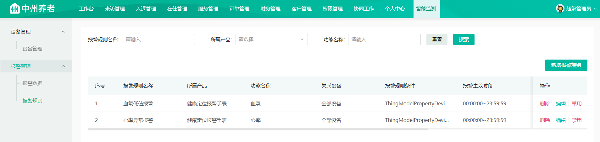

## 3 报警数据采集

### 3.1 思路分析

基于我们刚才创建的规则，当设备上报数据的时候，我们就需要进行过滤，详细流程如下：

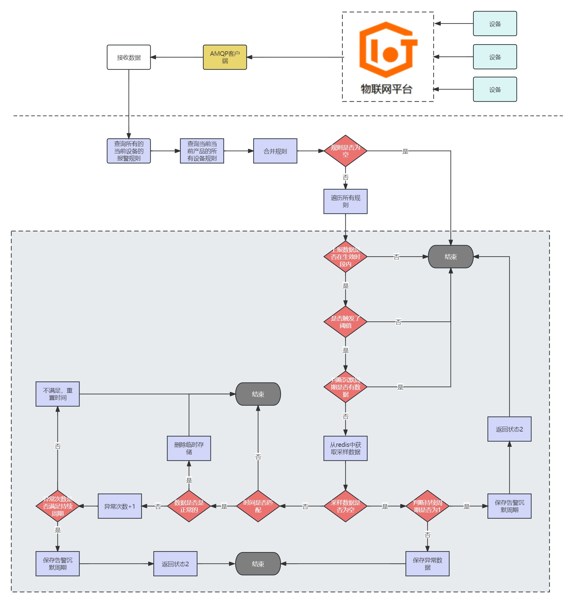

### 3.2 功能实现

当AmqpClient去接收上报数据的时候，我们就需要过滤当前时间是否符合存在的规则，所以首先在processMessage中添加如下代码，封装一个方法进行过滤

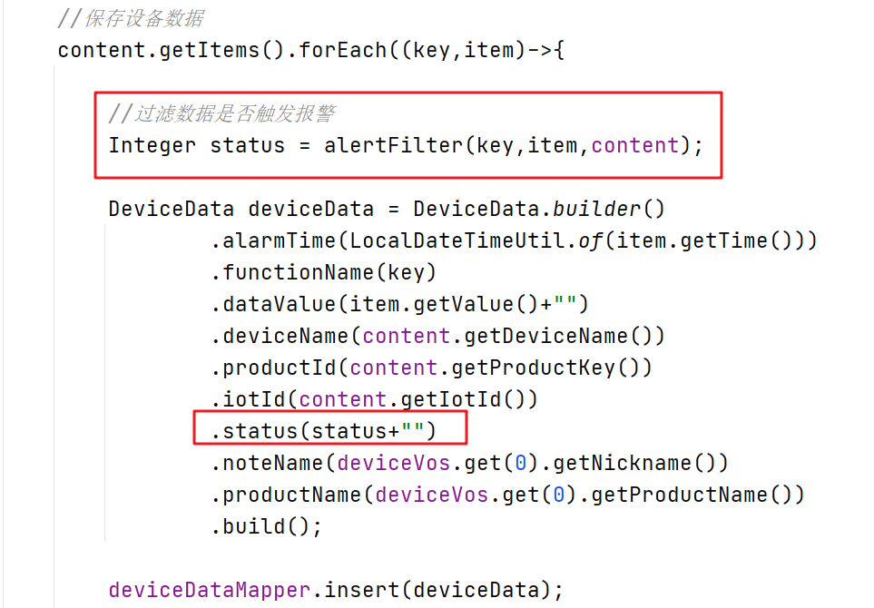

具体过滤方法的代码，如下：

```java
@Autowired
private AlertRuleMapper alertRuleMapper;

/**
 * 过滤上报数据，是否符合匹配报警规则
 *
 * @param key     物模型key
 * @param item    物模型的item(value,time)
 * @param content 上报的完整数据
 * @return
 */
private Integer alertFilter(String key, Content.Item item, Content content) {

    //定义一个原子类，线程可见，并且线程安全
    AtomicInteger finalStatus = new AtomicInteger(0);

    //查询遍历规则
    List<AlertRule> alertRules = alertRuleMapper.selectByFunctionId(key, "-1", content.getProductKey());
    if (CollectionUtil.isEmpty(alertRules)) {
        return finalStatus.get();
    }
    //遍历规则
    alertRules.forEach(alertRule -> {

        int status = 0;

        //判断上报时间是否在生效时段内
        String[] aepArr = alertRule.getAlertEffectivePeriod().split("~");
        LocalTime startTime = LocalTime.parse(aepArr[0]);
        LocalTime endTime = LocalTime.parse(aepArr[1]);
        LocalTime time = LocalDateTimeUtil.of(item.getTime()).toLocalTime();
        if (startTime.isAfter(time) || endTime.isBefore(time)) {
            return;
        }
        //是否触发阈值
        //val 小于0  左边与右边小
        //val 等于0  左边与右边相等
        //val 大于0  左边与右边大
        int val = alertRule.getValue().compareTo((float) item.getValue());
        if (alertRule.getOperator().equals(">=") && val <= 0) {
            status = 1;
            if (finalStatus.get() != 2) {
                finalStatus.set(1);
            }
        }

        if (alertRule.getOperator().equals("<") && val > 0) {
            status = 1;
            if (finalStatus.get() != 2) {
                finalStatus.set(1);
            }
        }

        //获取设备id
        String deviceId = content.getIotId();

        //从redis中获取数据
        String aggTimeKey = "aggregation_" + alertRule.getId() + "_" + deviceId + "_" + key;
        String aggCountKey = alertRule.getId() + "_" + deviceId + "_" + key + "_aggregation";


        // 假如数据是正常的，则删除临时存储的数据
        if (status == 0) {
            // 正常 则删除采样时间 采样次数
            redisTemplate.delete(aggTimeKey);
            redisTemplate.delete(aggCountKey);
            return;
        }

        //获取沉默周期数据
        String silentCacheKey = alertRule.getId()+"_"+deviceId+"_"+key+"_silent";
        String silentData = redisTemplate.opsForValue().get(silentCacheKey);
        if(StringUtils.isNotEmpty(silentData)){
            return;
        }

        String aggTimeData = redisTemplate.opsForValue().get(aggTimeKey);
        String aggCountData = redisTemplate.opsForValue().get(aggCountKey);
        if(StringUtils.isEmpty(aggTimeData) || StringUtils.isEmpty(aggCountData)){
            //如果持续周期为1，为特殊情况，把状态直接改为2
            if(alertRule.getDuration().equals(1)){
               //把数据存储到沉默周期
                    redisTemplate.opsForValue().set(silentCacheKey,item.getValue()+"",alertRule.getAlertSilentPeriod(), TimeUnit.MINUTES);
                finalStatus.set(2);
                return;
            }

            redisTemplate.opsForValue().set(aggCountKey,1+"");
            redisTemplate.opsForValue().set(aggTimeKey,item.getTime()+"");
            return;
        }
        //不是第一次添加异常数据了
        //判断时间是否超过聚合周期
        LocalDateTime preTime = LocalDateTimeUtil.of(Long.parseLong(aggTimeData)).plusMinutes(alertRule.getDataAggregationPeriod());
        if(preTime.isAfter(LocalDateTimeUtil.of(item.getTime()))){
            return;
        }

        //累加次数，存储到redis
        int count = Integer.parseInt(aggCountData)+1;
        redisTemplate.opsForValue().set(aggCountKey,count+"");
        //判断次数与持续算法相等
        if(count != alertRule.getDuration()){
            redisTemplate.opsForValue().set(aggTimeKey,item.getTime()+"");
            return;
        }
        //删除redis相关数据
        redisTemplate.delete(aggCountKey);
        redisTemplate.delete(aggTimeKey);

         //把数据存储到沉默周期
                    redisTemplate.opsForValue().set(silentCacheKey,item.getValue()+"",alertRule.getAlertSilentPeriod(), TimeUnit.MINUTES);

        finalStatus.set(2);
    });
    return finalStatus.get();

}
```

测试：

- 前提条件

    - 创建规则，比如监测**睡眠监测带**的心率低于60，则报警，如下设置

      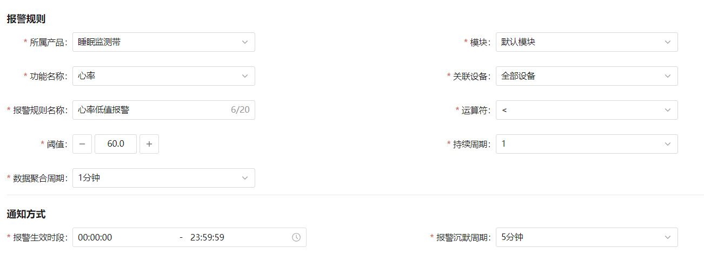

    - 模拟数据准备，在智能监测带上报数据的时候，手动调整上报的数据，以匹配规则

      ```js
      //心率   取值范围：1 ~ 1000
      var heartRate = Math.floor((Math.random() * 20) + 40);
      ```

- 测试效果

    - 可以正常展示报警数据

  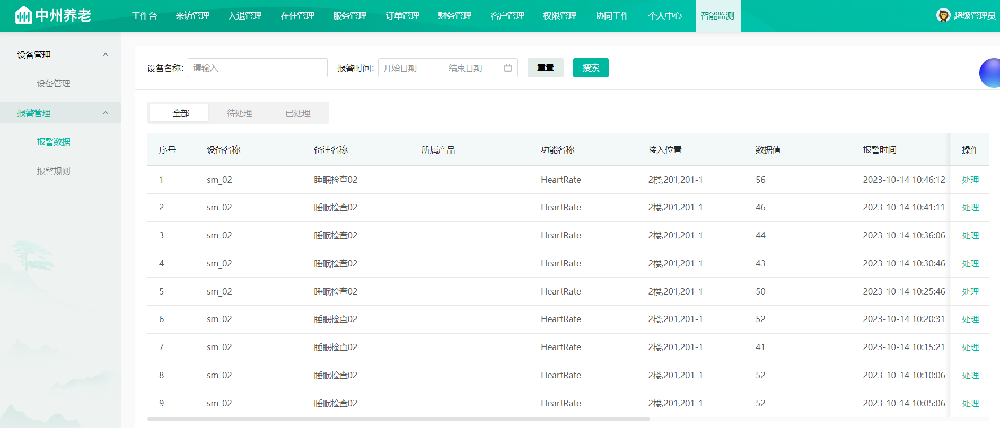

  报警间隔时间为5分钟左右

## 4 数据报警提醒

### 4.1 需求分析

#### 4.1 智能床位

我们打开智能床位的原型图，如下：

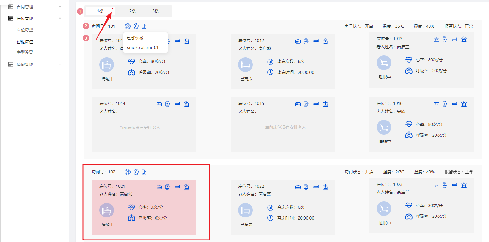

- 当床位的设备数据出现了报警数据之后，会有标红通知
- 有报警的楼层，在tab选项卡中会出现<font color='red'>红点</font>，来提醒工作人员查看并处理

#### 4.2 家属端异常数据展示

在家属端会展示，最新采集的异常数据，如下图展示

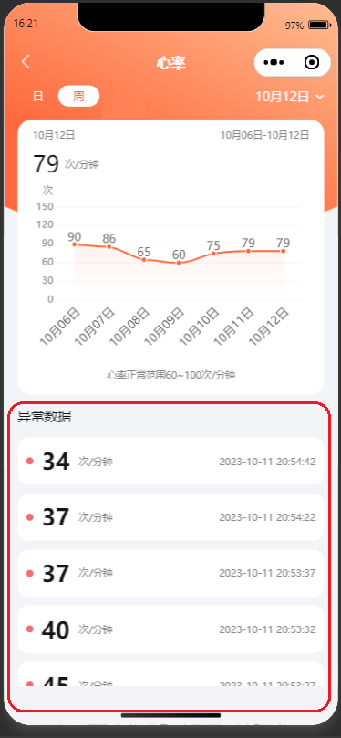

#### 4.3 站内信通知

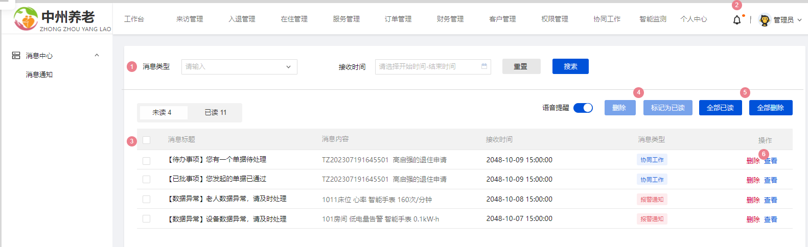

#### 4.4 其他通知

- 企业微信
- 钉钉
- 短信
- 邮件
- 语音播报
- 电话

### 4.2 websocket

如果想要完美的实现在智能床位实时提醒的话，我们需要引入一个新的技术，websocket

#### 4.2.1 概述

WebSocket 是基于 TCP 的一种新的**网络协议**。它实现了浏览器与服务器全双工通信——浏览器和服务器只需要完成一次握手，两者之间就可以创建
**持久性**的连接， 并进行**双向**数据传输。

**HTTP协议和WebSocket协议对比：**

- HTTP是**短连接**
- WebSocket是**长连接**
- HTTP通信是**单向**的，基于请求响应模式
- WebSocket支持**双向**通信
- HTTP和WebSocket底层都是TCP连接

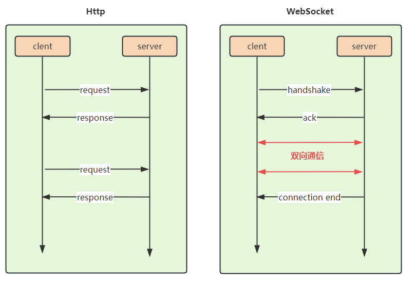

**思考：**既然WebSocket支持双向通信，功能看似比HTTP强大，那么我们是不是可以基于WebSocket开发所有的业务功能？

**WebSocket缺点：**

服务器长期维护长连接需要一定的成本
各个浏览器支持程度不一
WebSocket 是长连接，受网络限制比较大，需要处理好重连

**结论：**WebSocket并不能完全取代HTTP，它只适合在特定的场景下使用

使用场景：

1). 视频弹幕

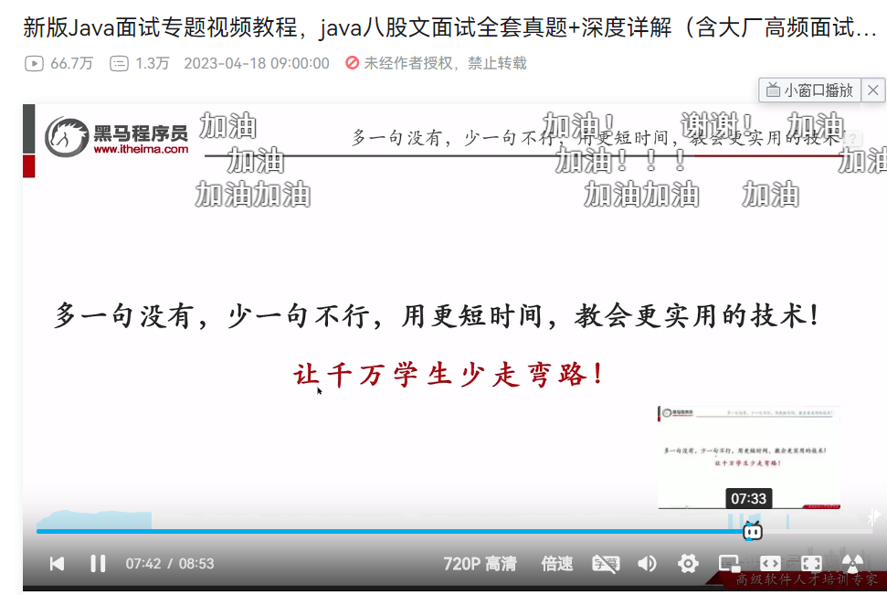

2). 网页聊天

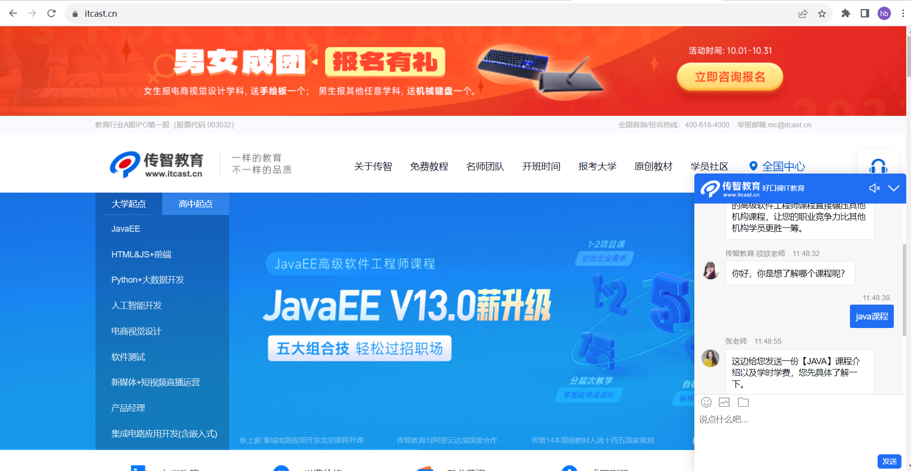

3). 体育实况更新

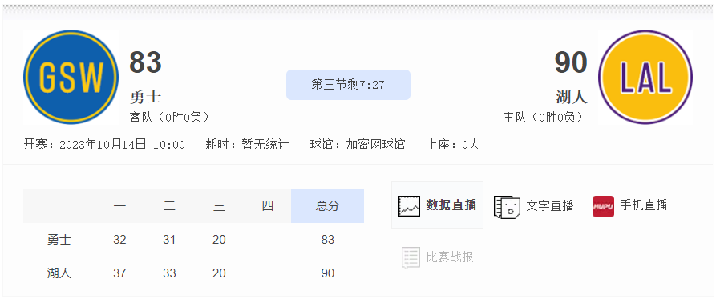

#### 4.2.2 入门案例

（1）需求说明

实现浏览器与服务器全双工通信。浏览器既可以向服务器发送消息，服务器也可主动向浏览器推送消息。

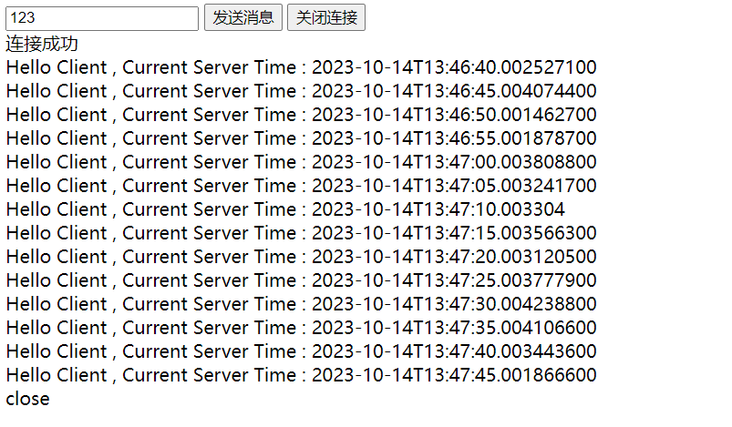

（2）流程如下

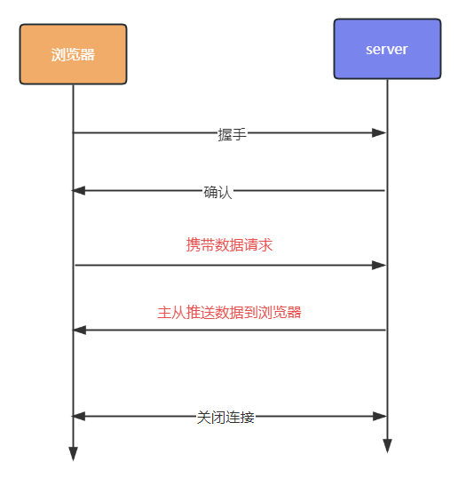

- 需要准备客户端，可以在浏览器上编写客户端
- 服务端，使用java代码实现，启动一个服务
- 客户端与服务端连接成功以后
    - 客户端可以发送数据到服务器端
    - 服务器端也可以发送数据到客户端（浏览器）

（3）功能实现

**客户端**

定义websocket.html页面充当客户端（资料中已提供）

```html
<!DOCTYPE HTML>
<html>
<head>
    <meta charset="UTF-8">
    <title>WebSocket Demo</title>
</head>
<body>
<input id="text" type="text"/>
<button onclick="send()">发送消息</button>
<button onclick="closeWebSocket()">关闭连接</button>
<div id="message">
</div>
</body>
<script type="text/javascript">
    var websocket = null;
    var clientId = Math.random().toString(36).substr(2);

    //判断当前浏览器是否支持WebSocket
    if ('WebSocket' in window) {
        //连接WebSocket节点
        websocket = new WebSocket("ws://localhost:8080/ws/" + clientId);
    } else {
        alert('Not support websocket')
    }

    //连接发生错误的回调方法
    websocket.onerror = function () {
        setMessageInnerHTML("error");
    };

    //连接成功建立的回调方法
    websocket.onopen = function () {
        setMessageInnerHTML("连接成功");
    }

    //接收到消息的回调方法
    websocket.onmessage = function (event) {
        setMessageInnerHTML(event.data);
    }

    //连接关闭的回调方法
    websocket.onclose = function () {
        setMessageInnerHTML("close");
    }

    //监听窗口关闭事件，当窗口关闭时，主动去关闭websocket连接，防止连接还没断开就关闭窗口，server端会抛异常。
    window.onbeforeunload = function () {
        websocket.close();
    }

    //将消息显示在网页上
    function setMessageInnerHTML(innerHTML) {
        document.getElementById('message').innerHTML += innerHTML + '<br/>';
    }

    //发送消息
    function send() {
        var message = document.getElementById('text').value;
        websocket.send(message);
    }

    //关闭连接
    function closeWebSocket() {
        websocket.close();
    }
</script>
</html>
```

**服务端**

找到资料中的工程springboot-websocket-demo，使用idea打开，然后导入依赖

```xml

<dependency>
    <groupId>org.springframework.boot</groupId>
    <artifactId>spring-boot-starter-websocket</artifactId>
</dependency>
```

定义WebSocket服务端组件(资料中已提供)

```java
package com.itheima.config;

import lombok.extern.slf4j.Slf4j;
import org.springframework.stereotype.Component;
import org.springframework.util.CollectionUtils;

import javax.websocket.*;
import javax.websocket.server.PathParam;
import javax.websocket.server.ServerEndpoint;
import java.io.IOException;
import java.util.Collection;
import java.util.HashMap;
import java.util.Map;

@Slf4j
@Component
@ServerEndpoint("/ws/{sid}")
public class WebSocketServer {

    private static Map<String,Session> sessionMap = new HashMap<>();

    /**
     * 连接建立时触发
     * @param session
     * @param sid
     */
    @OnOpen
    public void onOpen(Session session , @PathParam("sid") String sid){
        log.info("有客户端连接到了服务器 , {}", sid);
        sessionMap.put(sid, session);
    }

    /**
     * 服务端接收到消息时触发
     * @param session
     * @param message
     * @param sid
     */
    @OnMessage
    public void onMessage(Session session , String message, @PathParam("sid") String sid){
        log.info("接收到了客户端 {} 发来的消息 : {}", sid ,message);
    }

    /**
     * 连接关闭时触发
     * @param session
     * @param sid
     */
    @OnClose
    public void onClose(Session session , @PathParam("sid") String sid){
        System.out.println("连接断开:" + sid);
        sessionMap.remove(sid);
    }

    /**
     * 通信发生错误时触发
     * @param session
     * @param sid
     * @param throwable
     */
    @OnError
    public void onError(Session session , @PathParam("sid") String sid , Throwable throwable){
        System.out.println("出现错误:" + sid);
        throwable.printStackTrace();
    }

    /**
     * 广播消息
     * @param message
     * @throws IOException
     */
    public void sendMessageToAll(String message) throws IOException {
        Collection<Session> sessions = sessionMap.values();
        if(!CollectionUtils.isEmpty(sessions)){
            for (Session session : sessions) {
                //服务器向客户端发送消息
                session.getBasicRemote().sendText(message);
            }
        }
    }
}
```

定义配置类，注册WebSocket的服务端组件(从资料中直接导入即可)

```java
package com.itheima.config;

import org.springframework.context.annotation.Bean;
import org.springframework.context.annotation.Configuration;
import org.springframework.web.socket.server.standard.ServerEndpointExporter;

@Configuration
public class WebSocketConfig {

    /**
     * 注册基于@ServerEndpoint声明的Websocket Endpoint
     * @return
     */
    @Bean
    public ServerEndpointExporter serverEndpointExporter(){
        return new ServerEndpointExporter();
    }

}
```

定义定时任务类，定时向客户端推送数据

```java
package com.itheima.job;

import com.itheima.config.WebSocketServer;
import org.springframework.beans.factory.annotation.Autowired;
import org.springframework.scheduling.annotation.Scheduled;
import org.springframework.stereotype.Component;

import java.io.IOException;
import java.time.LocalDateTime;

/**
 * @author sjqn
 * @date 2023/10/14
 */
@Component
public class MessageTask {

    @Autowired
    private WebSocketServer webSocketServer;

    @Scheduled(cron = "0/5 * * * * ?")
    public void sendMessageToAllClient() throws IOException {
        webSocketServer.sendMessageToAll("Hello Client , Current Server Time : " + LocalDateTime.now());
    }
}
```

需要在引导类上添加`@EnableScheduling`开启任务调度

**测试**

启动后端服务，打开浏览器即可成功，在浏览器中可以看到服务器端推送的数据，浏览器也可以发送数据到服务器端

客户端的效果：

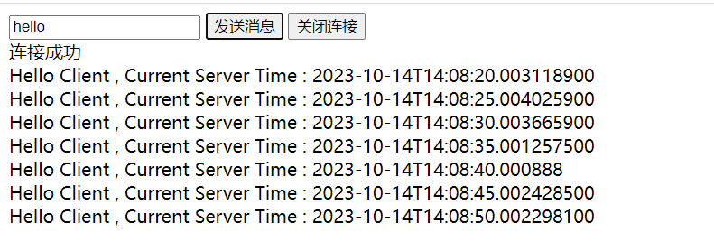

服务端接收到的数据，在控制台打印

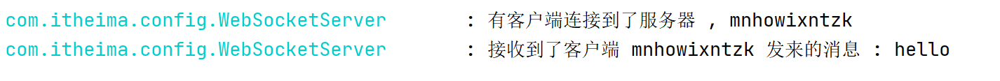

### 4.3 功能实现

现在我们就可以使用websocket实现智能床位的提醒功能。

#### 4.3.1 后端实现

依据我们刚才做过的websocket入门案例，把websocket集成到我们的项目中

(1)导入依赖

在zzyl-service中如导入以下依赖

```xml

<dependency>
    <groupId>org.springframework.boot</groupId>
    <artifactId>spring-boot-starter-websocket</artifactId>
</dependency>
```

(2) 定义WebSocket服务和注册WebSocket

参考刚才的入门案例

(3)安全框架放行WebSocket请求

由于项目中使用了Spring Security安全框架，需要对WebSocket中的请求和响应放行，不然客户端是连接不上的

在application.yml文件中添加以下配置：

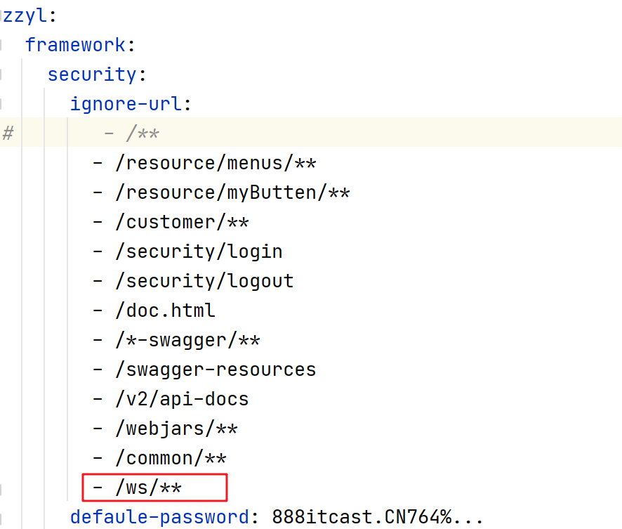

(5)报警数据推送到前端提醒

修改AmqpClient中的processMessage方法

当数据状态为2（待处理）的时候说明已经发生了报警，我们需要把数据推送到前端，不过这里只需要告诉前端是哪个楼层发生了报警即可，不需要传递太多

```java
//其他代码略
deviceDataMapper.insert(build);

//推送数据到前端，取出楼层id传递到客户端，方便提醒
if(status.equals(2) && deviceVos.get(0).getLocationType().equals(1)){
    String floorId = deviceVos.get(0).getDeviceDescription().split(",")[0];
    try {
        webSocketServer.sendMessageToAll(floorId);
    } catch (IOException e) {
        e.printStackTrace();
    }
}
```

#### 4.3.2 前端实现

目前前端工程师已经完成了关于WebSocket的集成开发，我们只需要修改服务器的地址即可连接成功。

在前端工程根目录下找到的`.env`文件，把地址修改为自己的服务器地址

```sh
VITE_SOME_KEY=123
# 打包路径 根据项目不同按需配置
VITE_BASE_URL = ./
# 修改为自己的IP地址
VITE_APP_SOCKET_URL = ws://127.0.0.1:9995   
```

#### 4.3.3 测试

需要准备一些数据，需要给**睡眠监测带**或**智能烟感**产品创建报警规则，例如：

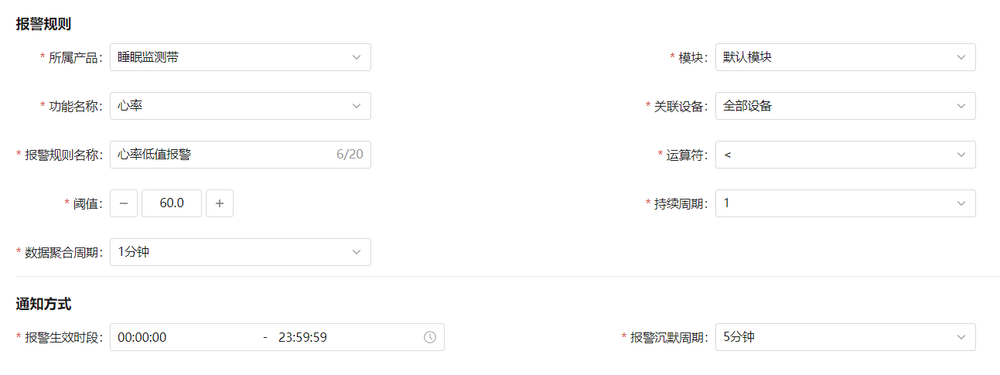

上报的数据心率收到调低一些，然后到**智能床位**模块查看提醒效果,如下：

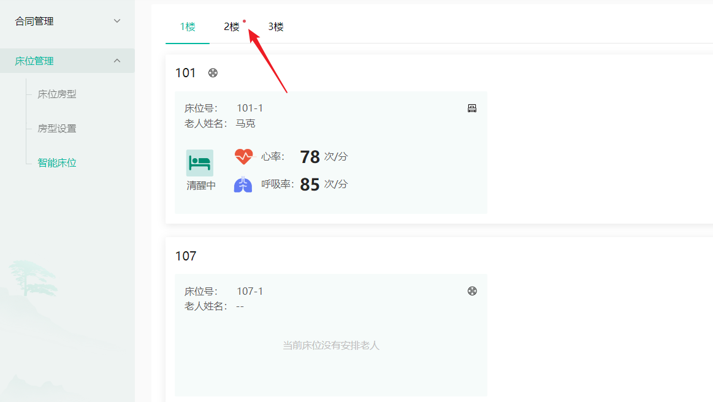

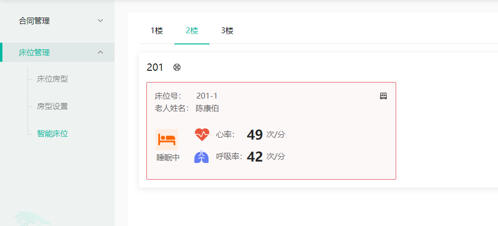

## 5 设备数据定时清理

### 5.1 需求分析

不同规模的养老院，设备的数量是不同的，并且每个设备都会按照自身的产品特性设置固定的频率去上报数据。

- 小规模，设备数量在300左右
- 中等规则，设备数量500左右
- 中大型规则，设备数量在1000以上，甚至更多

在那么多的设备中，会不断的上报数据，我们目前把所有数据都存储在了device_data表中，假如我们现在是一个中等规模的养老院，有500个设备，其中每个设备平均的物模型有4个，假如平均上报的频率为5分钟

每天上报数据的数量为：500 * 4 （1440 / 5） = 576000条数据，7天就是400万+的数量。

一个单表的数据量是有上限的，理论上如果数据超过500万，那么这个表访问性能会受到很大的影响。如果超过1000万性能会更慢。

由于我们的业务中设备上报的数据，绝大部分都是正常的数据，并且没有太多需求要查询历史记录，如果查历史记录也是查询异常报警的数据；并且已经处理的报警数据也没必须要存储太久的时间，所以，我们可以设置定时清理上报的数据，清理策略如下：

- 每天凌晨1点清理7天之前的数据（包含正常的数据，以及已经处理的异常数据）

**解决方案**

- 使用xxl-job写一个定时清理超过7天的数据

### 5.2 功能实现

#### 5.2.1 xxl-job中创建定时任务

在xxl-job中新增定时任务，如下：

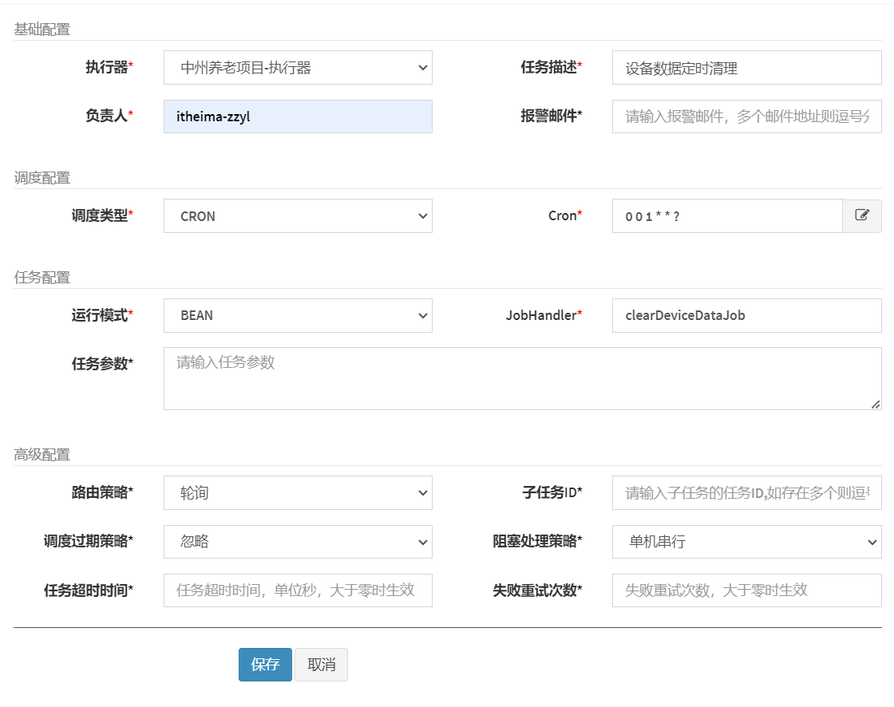

#### 5.2.2 创建mapper

在DeviceDataMapper中新增代码，删除状态不是2的数据，状态为2的数据为**待处理**异常数据

如下：

```java
@Delete("delete from device_data where status != 2  and alert_time < #{day}")
void clearDeviceDataJob();
```

#### 5.2.3 编写定时任务

```java
/**
 * @author sjqn
 * @date 2023/10/14
 */
@Component
@Log
public class DeviceDataClearJob {

    @Autowired
    private DeviceDataMapper deviceDataMapper;


    @XxlJob("clearDeviceDataJob")
    public void clearDeviceDataJob(){
        log.info("设备上报数据,定时清理开始....");
        //当前时间-7   11月19日  -  12日
        deviceDataMapper.clearDeviceDataJob();
        log.info("设备上报数据,定时清理结束....");
    }
}
```

#### 5.2.4 测试

大家测试的时候，可以点击xxl-job任务中的**执行一次**，来进行测试数据是否删除成功

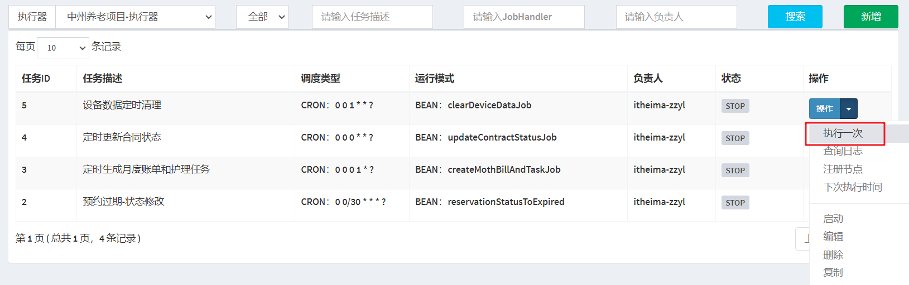


