# day01-MybatisPlus

通过项目一的开发大家应该能发现，单表的CRUD功能代码重复度很高，也没有什么难度。而这部分代码量往往比较大，开发起来比较费时。

因此，目前企业中都会使用一些组件来简化或省略单表的CRUD开发工作。目前在国内使用较多的一个组件就是MybatisPlus.

官方网站如下：

https://www.baomidou.com/pages/24112f/

当然，MybatisPlus不仅仅可以简化单表操作，而且还对Mybatis的功能有很多的增强。可以让我们的开发更加的简单，高效。

通过今天的学习，我们要达成下面的目标：

- 能利用MybatisPlus实现基本的CRUD
- 会使用条件构建造构建查询和更新语句
- 会使用MybatisPlus中的常用注解
- 会使用MybatisPlus处理枚举、JSON类型字段
- 会使用MybatisPlus实现分页

# 1.快速入门

为了方便测试，我们先创建一个新的项目，并准备一些基础数据。

## 1.1.环境准备

复制课前资料提供好的一个项目到你的工作空间（不要包含空格和特殊字符）：


然后用你的IDEA工具打开，项目结构如下：

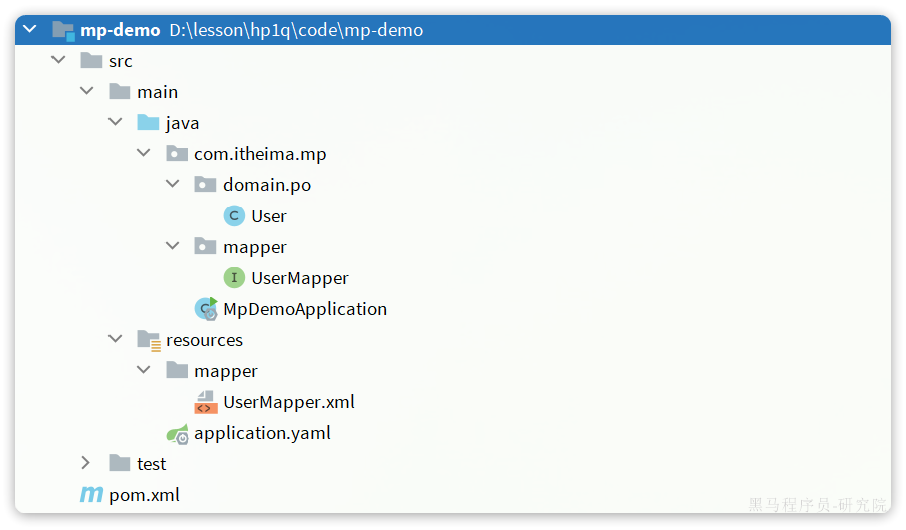

注意配置一下项目的JDK版本为JDK11。首先点击项目结构设置：

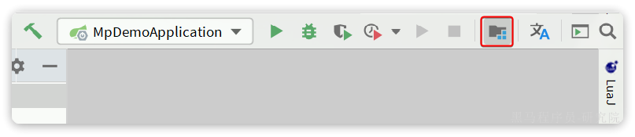

在弹窗中配置JDK：


接下来，要导入两张表，在课前资料中已经提供了SQL文件：

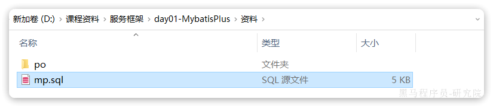

对应的数据库表结构如下：

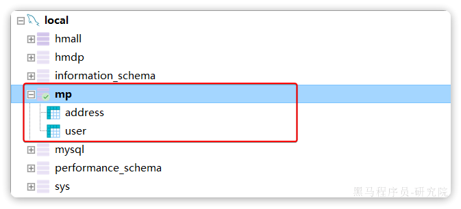

最后，在`application.yaml`中修改jdbc参数为你自己的数据库参数：

```yaml
spring:
  datasource:
    url: jdbc:mysql://127.0.0.1:3306/mp?useUnicode=true&characterEncoding=UTF-8&autoReconnect=true&serverTimezone=Asia/Shanghai
    driver-class-name: com.mysql.cj.jdbc.Driver
    username: root
    password: 1234
logging:
  level:
    com.itheima: debug
  pattern:
    dateformat: HH:mm:ss
```

## 1.2.快速开始

比如我们要实现User表的CRUD，只需要下面几步：

- 引入MybatisPlus依赖
- 定义Mapper

### 1.2.1引入依赖

MybatisPlus提供了starter，实现了自动Mybatis以及MybatisPlus的自动装配功能，坐标如下：

```xml

<dependency>
    <groupId>com.baomidou</groupId>
    <artifactId>mybatis-plus-boot-starter</artifactId>
    <version>3.5.3.2</version>
</dependency>
```

由于这个starter包含对mybatis的自动装配，因此完全可以替换掉Mybatis的starter。

最终，项目的依赖如下：

```xml

<dependencies>
    <dependency>
        <groupId>com.baomidou</groupId>
        <artifactId>mybatis-plus-boot-starter</artifactId>
        <version>3.5.3.2</version>
    </dependency>
    <dependency>
        <groupId>com.mysql</groupId>
        <artifactId>mysql-connector-j</artifactId>
        <scope>runtime</scope>
    </dependency>
    <dependency>
        <groupId>org.projectlombok</groupId>
        <artifactId>lombok</artifactId>
        <optional>true</optional>
    </dependency>
    <dependency>
        <groupId>org.springframework.boot</groupId>
        <artifactId>spring-boot-starter-test</artifactId>
        <scope>test</scope>
    </dependency>
</dependencies>
```

### 1.2.2.定义Mapper

为了简化单表CRUD，MybatisPlus提供了一个基础的`BaseMapper`接口，其中已经实现了单表的CRUD：


因此我们自定义的Mapper只要实现了这个`BaseMapper`，就无需自己实现单表CRUD了。

修改mp-demo中的`com.itheima.mp.mapper`包下的`UserMapper`接口，让其继承`BaseMapper`：


代码如下：

```java
package com.itheima.mp.mapper;

import com.baomidou.mybatisplus.core.mapper.BaseMapper;
import com.itheima.mp.domain.po.User;

public interface UserMapper extends BaseMapper<User> {
}
```

### 1.2.3.测试

新建一个测试类，编写几个单元测试，测试基本的CRUD功能：

```java
package com.itheima.mp.mapper;

import com.itheima.mp.domain.po.User;
import org.junit.jupiter.api.Test;
import org.springframework.beans.factory.annotation.Autowired;
import org.springframework.boot.test.context.SpringBootTest;

import java.time.LocalDateTime;
import java.util.List;

@SpringBootTest
class UserMapperTest {

    @Autowired
    private UserMapper userMapper;

    @Test
    void testInsert() {
        User user = new User();
        user.setId(5L);
        user.setUsername("Lucy");
        user.setPassword("123");
        user.setPhone("18688990011");
        user.setBalance(200);
        user.setInfo("{\"age\": 24, \"intro\": \"英文老师\", \"gender\": \"female\"}");
        user.setCreateTime(LocalDateTime.now());
        user.setUpdateTime(LocalDateTime.now());
        userMapper.insert(user);
    }

    @Test
    void testSelectById() {
        User user = userMapper.selectById(5L);
        System.out.println("user = " + user);
    }

    @Test
    void testSelectByIds() {
        List<User> users = userMapper.selectBatchIds(List.of(1L, 2L, 3L, 4L, 5L));
        users.forEach(System.out::println);
    }

    @Test
    void testUpdateById() {
        User user = new User();
        user.setId(5L);
        user.setBalance(20000);
        userMapper.updateById(user);
    }

    @Test
    void testDelete() {
        userMapper.deleteById(5L);
    }
}
```

可以看到，在运行过程中打印出的SQL日志，非常标准：

```java
11:05:01  INFO 15524 --- [           main] com.zaxxer.hikari.HikariDataSource       : HikariPool-1 - Starting...
11:05:02  INFO 15524 --- [           main] com.zaxxer.hikari.HikariDataSource       : HikariPool-1 - Start completed.
11:05:02 DEBUG 15524 --- [           main] c.i.mp.mapper.UserMapper.selectById      : ==>  Preparing: SELECT id,username,password,phone,info,status,balance,create_time,update_time FROM user WHERE id=?
11:05:02 DEBUG 15524 --- [           main] c.i.mp.mapper.UserMapper.selectById      : ==> Parameters: 5(Long)
11:05:02 DEBUG 15524 --- [           main] c.i.mp.mapper.UserMapper.selectById      : <==      Total: 1
user = User(id=5, username=Lucy, password=123, phone=18688990011, info={"age": 21}, status=1, balance=20000, createTime=Fri Jun 30 11:02:30 CST 2023, updateTime=Fri Jun 30 11:02:30 CST 2023)
```

只需要继承BaseMapper就能省去所有的单表CRUD，是不是非常简单！

## 1.3.常见注解

在刚刚的入门案例中，我们仅仅引入了依赖，继承了BaseMapper就能使用MybatisPlus，非常简单。但是问题来了：

MybatisPlus如何知道我们要查询的是哪张表？表中有哪些字段呢？

大家回忆一下，UserMapper在继承BaseMapper的时候指定了一个泛型：


泛型中的User就是与数据库对应的PO.

MybatisPlus就是根据PO实体的信息来推断出表的信息，从而生成SQL的。默认情况下：

- MybatisPlus会把PO实体的类名驼峰转下划线作为表名
- MybatisPlus会把PO实体的所有变量名驼峰转下划线作为表的字段名，并根据变量类型推断字段类型
- MybatisPlus会把名为id的字段作为主键

但很多情况下，默认的实现与实际场景不符，因此MybatisPlus提供了一些注解便于我们声明表信息。

### 1.3.1.@TableName

说明：

- 描述：表名注解，标识实体类对应的表
- 使用位置：实体类

示例：

```java
@TableName("user")
public class User {
    private Long id;
    private String name;
}
```

TableName注解除了指定表名以外，还可以指定很多其它属性：

| **属性**           | **类型**   | **必须指定** | **默认值** | **描述**                                                        |
|------------------|----------|----------|---------|---------------------------------------------------------------|
| value            | String   | 否        | ""      | 表名                                                            |
| schema           | String   | 否        | ""      | schema                                                        |
| keepGlobalPrefix | boolean  | 否        | false   | 是否保持使用全局的 tablePrefix 的值（当全局 tablePrefix 生效时）                 |
| resultMap        | String   | 否        | ""      | xml 中 resultMap 的 id（用于满足特定类型的实体类对象绑定）                        |
| autoResultMap    | boolean  | 否        | false   | 是否自动构建 resultMap 并使用（如果设置 resultMap 则不会进行 resultMap 的自动构建与注入） |
| excludeProperty  | String[] | 否        | {}      | 需要排除的属性名 @since 3.3.1                                         |

### 1.3.2.@TableId

说明：

- 描述：主键注解，标识实体类中的主键字段
- 使用位置：实体类的主键字段

示例：

```java
@TableName("user")
public class User {
    @TableId
    private Long id;
    private String name;
}
```

`TableId`注解支持两个属性：

| **属性** | **类型** | **必须指定** | **默认值**     | **描述** |
|--------|--------|----------|-------------|--------|
| value  | String | 否        | ""          | 表名     |
| type   | Enum   | 否        | IdType.NONE | 指定主键类型 |

`IdType`支持的类型有：

| **值**         | **描述**                                                                                                                          |
|---------------|---------------------------------------------------------------------------------------------------------------------------------|
| AUTO          | 数据库 ID 自增                                                                                                                       |
| NONE          | 无状态，该类型为未设置主键类型（注解里等于跟随全局，全局里约等于 INPUT）                                                                                         |
| INPUT         | insert 前自行 set 主键值                                                                                                              |
| ASSIGN_ID     | 分配 ID(主键类型为 Number(Long 和 Integer)或 String)(since 3.3.0),使用接口IdentifierGenerator的方法nextId(默认实现类为DefaultIdentifierGenerator雪花算法) |
| ASSIGN_UUID   | 分配 UUID,主键类型为 String(since 3.3.0),使用接口IdentifierGenerator的方法nextUUID(默认 default 方法)                                             |
| ID_WORKER     | 分布式全局唯一 ID 长整型类型(please use ASSIGN_ID)                                                                                          |
| UUID          | 32 位 UUID 字符串(please use ASSIGN_UUID)                                                                                           |
| ID_WORKER_STR | 分布式全局唯一 ID 字符串类型(please use ASSIGN_ID)                                                                                          |

这里比较常见的有三种：

- `AUTO`：利用数据库的id自增长
- `INPUT`：手动生成id
- `ASSIGN_ID`：雪花算法生成`Long`类型的全局唯一id，这是默认的ID策略

````properties
     * IdType.ASSIGN_ID :
     *     用户指定id 使用用户给的,如果不给则自动生成唯一id(雪花算法)
     * IdType.INPUT
     *    用户指定id 使用用户给的,如果不给则传递null(利用自增)
     * IdType.None :
     *    用户指定id 使用用户给的,如果不给则自动生成唯一id(雪花算法)
     *IdType.AUTO
     *   用户指定id 使用用户给的,如果不给则传递null(利用自增)
````

### 1.3.3.@TableField

说明：

描述：普通字段注解

示例：

```java
@TableName("user")
public class User {
    @TableId
    private Long id;
    private String name;
    private Integer age;
    @TableField("isMarried")
    private Boolean isMarried;
    @TableField("`concat`")
    private String concat;
}
```

一般情况下我们并不需要给字段添加`@TableField`注解，一些特殊情况除外：

- 成员变量名与数据库字段名不一致
- 成员变量是以`isXXX`命名，按照`JavaBean`的规范，`MybatisPlus`识别字段时会把`is`去除，这就导致与数据库不符。
- 成员变量名与数据库一致，但是与数据库的关键字冲突。使用`@TableField`注解给字段名添加````转义
- 成员变量 数据库不存在这一列

支持的其它属性如下：

| **属性**           | **类型**     | **必填** | **默认值**               | **描述**                                                                                                                                                                                                                  |
|------------------|------------|--------|-----------------------|-------------------------------------------------------------------------------------------------------------------------------------------------------------------------------------------------------------------------|
| value            | String     | 否      | ""                    | 数据库字段名                                                                                                                                                                                                                  |
| exist            | boolean    | 否      | true                  | 是否为数据库表字段                                                                                                                                                                                                               |
| condition        | String     | 否      | ""                    | 字段 where 实体查询比较条件，有值设置则按设置的值为准，没有则为默认全局的 %s=#{%s}，[参考(opens new window)](https://github.com/baomidou/mybatis-plus/blob/3.0/mybatis-plus-annotation/src/main/java/com/baomidou/mybatisplus/annotation/SqlCondition.java) |
| update           | String     | 否      | ""                    | 字段 update set 部分注入，例如：当在version字段上注解update="%s+1" 表示更新时会 set version=version+1 （该属性优先级高于 el 属性）                                                                                                                         |
| insertStrategy   | Enum       | 否      | FieldStrategy.DEFAULT | 举例：NOT_NULL insert into table_a(<if test="columnProperty != null">column</if>) values (<if test="columnProperty != null">#{columnProperty}</if>)                                                                        |
| updateStrategy   | Enum       | 否      | FieldStrategy.DEFAULT | 举例：IGNORED update table_a set column=#{columnProperty}                                                                                                                                                                  |
| whereStrategy    | Enum       | 否      | FieldStrategy.DEFAULT | 举例：NOT_EMPTY where <if test="columnProperty != null and columnProperty!=''">column=#{columnProperty}</if>                                                                                                               |
| fill             | Enum       | 否      | FieldFill.DEFAULT     | 字段自动填充策略                                                                                                                                                                                                                |
| select           | boolean    | 否      | true                  | 是否进行 select 查询                                                                                                                                                                                                          |
| keepGlobalFormat | boolean    | 否      | false                 | 是否保持使用全局的 format 进行处理                                                                                                                                                                                                   |
| jdbcType         | JdbcType   | 否      | JdbcType.UNDEFINED    | JDBC 类型 (该默认值不代表会按照该值生效)                                                                                                                                                                                                |
| typeHandler      | TypeHander | 否      |                       | 类型处理器 (该默认值不代表会按照该值生效)                                                                                                                                                                                                  |
| numericScale     | String     | 否      | ""                    | 指定小数点后保留的位数                                                                                                                                                                                                             |

## 1.4.常见配置

MybatisPlus也支持基于yaml文件的自定义配置，详见官方文档：

[https://www.baomidou.com/pages/56bac0/#%E5%9F%BA%E6%9C%AC%E9%85%8D%E7%BD%AE](https://www.baomidou.com/pages/56bac0/#基本配置)

大多数的配置都有默认值，因此我们都无需配置。但还有一些是没有默认值的，例如:

- 实体类的别名扫描包
- 全局id类型

```yaml
mybatis-plus:
  type-aliases-package: com.itheima.mp.domain.po
  global-config:
    db-config:
      id-type: auto # 全局id类型为自增长
```

需要注意的是，MyBatisPlus也支持手写SQL的，而mapper文件的读取地址可以自己配置：

```yaml
mybatis-plus:
  mapper-locations: "classpath*:/mapper/**/*.xml" # Mapper.xml文件地址，当前这个是默认值。
```

可以看到默认值是`classpath*:/mapper/**/*.xml`，也就是说我们只要把mapper.xml文件放置这个目录下就一定会被加载。

例如，我们新建一个`UserMapper.xml`文件：


然后在其中定义一个方法：

```xml
<?xml version="1.0" encoding="UTF-8"?>
<!DOCTYPE mapper PUBLIC "-//mybatis.org//DTD Mapper 3.0//EN" "http://mybatis.org/dtd/mybatis-3-mapper.dtd">
<mapper namespace="com.itheima.mp.mapper.UserMapper">

    <select id="queryById" resultType="User">
        SELECT * FROM user WHERE id = #{id}
    </select>
</mapper>
```

然后在测试类`UserMapperTest`中测试该方法：

```java
@Test
void testQuery() {
    User user = userMapper.queryById(1L);
    System.out.println("user = " + user);
}
```

常见配置

```yml
mybatis-plus:
  type-aliases-package: com.itheima.mp.domain.po # 别名扫描包
  mapper-locations: "classpath*:/mapper/**/*.xml" # Mapper.xml文件地址，默认值
  configuration:
    map-underscore-to-camel-case: true # 是否开启下划线和驼峰的映射
    cache-enabled: false # 是否开启二级缓存
  global-config:
    db-config:
      id-type: assign_id # id为雪花算法生成
      update-strategy: not_null # 更新策略：只更新非空字段
```

# 2.核心功能

刚才的案例中都是以id为条件的简单CRUD，一些复杂条件的SQL语句就要用到一些更高级的功能了。

## 2.1.条件构造器

除了新增以外，修改、删除、查询的SQL语句都需要指定where条件。因此BaseMapper中提供的相关方法除了以`id`作为`where`条件以外，还支持更加复杂的
`where`条件。

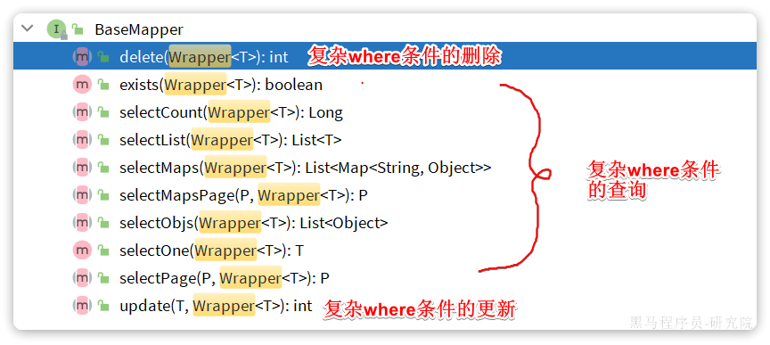

参数中的`Wrapper`就是条件构造的抽象类，其下有很多默认实现，继承关系如图：


`Wrapper`的子类`AbstractWrapper`提供了where中包含的所有条件构造方法：


而QueryWrapper在AbstractWrapper的基础上拓展了一个select方法，允许指定查询字段：

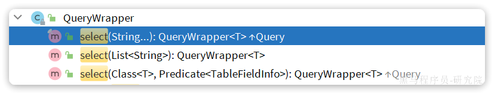

而UpdateWrapper在AbstractWrapper的基础上拓展了一个set方法，允许指定SQL中的SET部分：


接下来，我们就来看看如何利用`Wrapper`实现复杂查询。

### 2.1.1.QueryWrapper

无论是修改、删除、查询，都可以使用QueryWrapper来构建查询条件。接下来看一些例子：

**查询**：查询出名字中带`o`的，存款大于等于1000元的人。代码如下：

```java
@Test
void testQueryWrapper() {
    // 1.构建查询条件 where name like "%o%" AND balance >= 1000
    QueryWrapper<User> wrapper = new QueryWrapper<User>()
            .select("id", "username", "info", "balance")
            .like("username", "o")
            .ge("balance", 1000);
    // 2.查询数据
    List<User> users = userMapper.selectList(wrapper);
    users.forEach(System.out::println);
}
```

**更新**：更新用户名为jack的用户的余额为2000，代码如下：

```java
@Test
void testUpdateByQueryWrapper() {
    // 1.构建查询条件 where name = "Jack"
    QueryWrapper<User> wrapper = new QueryWrapper<User>().eq("username", "Jack");
    // 2.更新数据，user中非null字段都会作为set语句
    User user = new User();
    user.setBalance(2000);
    userMapper.update(user, wrapper);
}
```

### 2.1.2.UpdateWrapper

基于BaseMapper中的update方法更新时只能直接赋值，对于一些复杂的需求就难以实现。

例如：更新id为`1,2,4`的用户的余额，扣200，对于的SQL应该是：

```sql
UPDATE user SET balance = balance - 200 WHERE id in (1, 2, 4)
```

SET的赋值结果是基于字段现有值的，这个时候就要利用UpdateWrapper中的setSql功能了：

```java
@Test
void testUpdateWrapper() {
    List<Long> ids = List.of(1L, 2L, 4L);
    // 1.生成SQL
    UpdateWrapper<User> wrapper = new UpdateWrapper<User>()
            .setSql("balance = balance - 200") // SET balance = balance - 200
            .in("id", ids); // WHERE id in (1, 2, 4)
	// 2.更新，注意第一个参数可以给null，也就是不填更新字段和数据，
    // 而是基于UpdateWrapper中的setSQL来更新
    userMapper.update(null, wrapper);
}
```

### 2.1.3.LambdaQueryWrapper

无论是QueryWrapper还是UpdateWrapper在构造条件的时候都需要写死字段名称，会出现字符串`魔法值`。这在编程规范中显然是不推荐的。

那怎么样才能不写字段名，又能知道字段名呢？

其中一种办法是基于变量的`gettter`方法结合反射技术。因此我们只要将条件对应的字段的`getter`
方法传递给MybatisPlus，它就能计算出对应的变量名了。而传递方法可以使用JDK8中的`方法引用`和`Lambda`表达式。

因此MybatisPlus又提供了一套基于Lambda的Wrapper，包含两个：

- LambdaQueryWrapper
- LambdaUpdateWrapper

分别对应QueryWrapper和UpdateWrapper

其使用方式如下：

```java
@Test
void testLambdaQueryWrapper() {
    // 1.构建条件 WHERE username LIKE "%o%" AND balance >= 1000
    QueryWrapper<User> wrapper = new QueryWrapper<>();
    wrapper.lambda()
            .select(User::getId, User::getUsername, User::getInfo, User::getBalance)
            .like(User::getUsername, "o")
            .ge(User::getBalance, 1000);
    // 2.查询
    List<User> users = userMapper.selectList(wrapper);
    users.forEach(System.out::println);
}
```

## 2.2.自定义SQL

在演示UpdateWrapper的案例中，我们在代码中编写了更新的SQL语句：


这种写法在某些企业也是不允许的，因为SQL语句最好都维护在持久层，而不是业务层。就当前案例来说，由于条件是in语句，只能将SQL写在Mapper.xml文件，利用foreach来生成动态SQL。

这实在是太麻烦了。假如查询条件更复杂，动态SQL的编写也会更加复杂。

所以，MybatisPlus提供了自定义SQL功能，可以让我们利用Wrapper生成查询条件，再结合Mapper.xml编写SQL

### 2.2.1.基本用法

以当前案例来说，我们可以这样写：

```java
@Test
void testCustomWrapper() {
    // 1.准备自定义查询条件
    List<Long> ids = List.of(1L, 2L, 4L);
    QueryWrapper<User> wrapper = new QueryWrapper<User>().in("id", ids);

    // 2.调用mapper的自定义方法，直接传递Wrapper
    userMapper.deductBalanceByIds(200, wrapper);
}
```

然后在UserMapper中自定义SQL：

```java
public interface UserMapper extends BaseMapper<User> {
    @Select("UPDATE user SET balance = balance - #{money} ${ew.customSqlSegment}")
    void deductBalanceByIds(@Param("money") int money, @Param("ew") QueryWrapper<User> wrapper);
}
```

这样就省去了编写复杂查询条件的烦恼了。

```
注: 一般不用,了解即可
```

## 2.3.Service接口

MybatisPlus不仅提供了BaseMapper，还提供了通用的Service接口及默认实现，封装了一些常用的service模板方法。

通用接口为`IService`，默认实现为`ServiceImpl`，其中封装的方法可以分为以下几类：

- `save`：新增
- `remove`：删除
- `update`：更新
- `get`：查询单个结果
- `list`：查询集合结果
- `count`：计数
- `page`：分页查询

### 2.3.1.CRUD

我们先俩看下基本的CRUD接口。

**新增**：


- `save`是新增单个元素
- `saveBatch`是批量新增
- `saveOrUpdate`是根据id判断，如果数据存在就更新，不存在则新增
- `saveOrUpdateBatch`是批量的新增或修改

**删除：**


- `removeById`：根据id删除
- `removeByIds`：根据id批量删除
- `removeByMap`：根据Map中的键值对为条件删除
- `remove(Wrapper<T>)`：根据Wrapper条件删除
- `removeBatchByIds`：暂不支持

**修改：**

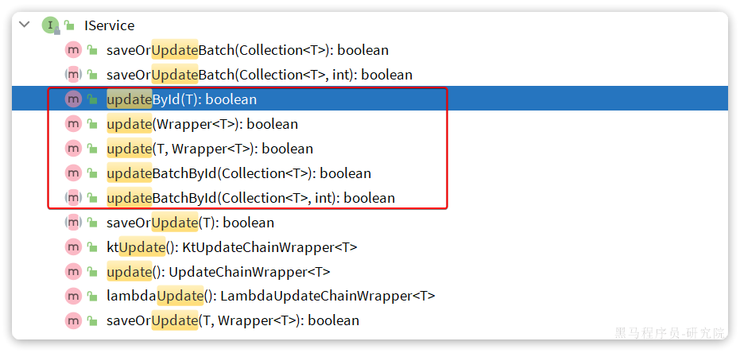

- `updateById`：根据id修改
- `update(Wrapper<T>)`：根据`UpdateWrapper`修改，`Wrapper`中包含`set`和`where`部分
- `update(T，Wrapper<T>)`：按照`T`内的数据修改与`Wrapper`匹配到的数据
- `updateBatchById`：根据id批量修改

**Get：**


- `getById`：根据id查询1条数据
- `getOne(Wrapper<T>)`：根据`Wrapper`查询1条数据
- `getBaseMapper`：获取`Service`内的`BaseMapper`实现，某些时候需要直接调用`Mapper`内的自定义`SQL`时可以用这个方法获取到
  `Mapper`

**List：**


- `listByIds`：根据id批量查询
- `list(Wrapper<T>)`：根据Wrapper条件查询多条数据
- `list()`：查询所有

**Count**：


- `count()`：统计所有数量
- `count(Wrapper<T>)`：统计符合`Wrapper`条件的数据数量

**getBaseMapper**：

当我们在service中要调用Mapper中自定义SQL时，就必须获取service对应的Mapper，就可以通过这个方法：


### 2.3.2.基本用法

由于`Service`中经常需要定义与业务有关的自定义方法，因此我们不能直接使用`IService`，而是自定义`Service`接口，然后继承
`IService`以拓展方法。同时，让自定义的`Service实现类`继承`ServiceImpl`，这样就不用自己实现`IService`中的接口了。

首先，定义`IUserService`，继承`IService`：

```java
package com.itheima.mp.service;

import com.baomidou.mybatisplus.extension.service.IService;
import com.itheima.mp.domain.po.User;

public interface IUserService extends IService<User> {
    // 拓展自定义方法
}
```

然后，编写`UserServiceImpl`类，继承`ServiceImpl`，实现`IUserService`：

```java
package com.itheima.mp.service.impl;

import com.baomidou.mybatisplus.extension.service.impl.ServiceImpl;
import com.itheima.mp.domain.po.User;
import com.itheima.mp.domain.po.service.UserService;
import com.itheima.mp.mapper.UserMapper;
import org.springframework.stereotype.Service;

@Service
public class UserServiceImpl extends ServiceImpl<UserMapper, User>
													implements IUserService {
}
```

项目结构如下：


接下来，我们快速实现下面几个接口：

- 新增用户
- 删除用户(自己实现)
- 根据id查询用户
- 根据id批量查询用户(自己实现)

```java
@SpringBootTest
class UserServiceTest {

    @Autowired
    private UserService userService;
    @Test
    public void testSave(){
          userService.save(buildUser(1));
    }

    @Test
    public void testGetById(){
        User user = userService.getById(1L);
    }

    private User buildUser(int i) {
        User user = new User();
        user.setUsername("user_" + i);
        user.setPassword("123");
        user.setPhone("" + (18688190000L + i));
        user.setBalance(2000);
        user.setInfo("{\"age\": 24, \"intro\": \"英文老师\", \"gender\": \"female\"}");
        user.setCreateTime(LocalDateTime.now());
        user.setUpdateTime(user.getCreateTime());
        return user;
    }
}
```

### 2.3.3.Lambda

实现一个根据复杂条件查询用户的接口，查询条件如下：

- name：用户名关键字，可以为空
- status：用户状态，可以为空
- minBalance：最小余额，可以为空
- maxBalance：最大余额，可以为空

代码如下

```java
@Test
    void testLambda() {
        // 1.组织条件
        String username = "jack";
        Integer status =0;
        Integer minBalance = 10;
        Integer maxBalance = 10000;
        LambdaQueryWrapper<User> wrapper = new LambdaQueryWrapper<>();
        if(username!=null){
          wrapper.like(User::getUsername,username);
        }
        if(status!=null){
            wrapper.eq(User::getStatus,status);
        }
        if(minBalance!=null){
            wrapper.gt(User::getBalance,minBalance);
        }
        if(maxBalance!=null){
            wrapper.lt(User::getBalance,maxBalance);
        }
        userService.list(wrapper);

    }
```

在组织查询条件的时候，我们加入了 `username != null` 这样的参数，意思就是当条件成立时才会添加这个查询条件，类似Mybatis的mapper.xml文件中的
`<if>`标签。这样就实现了动态查询条件效果了。

不过，上述条件构建的代码太麻烦了。

因此Service中对`LambdaQueryWrapper`和`LambdaUpdateWrapper`的用法进一步做了简化。我们无需自己通过`new`的方式来创建
`Wrapper`，而是直接调用`lambdaQuery`和`lambdaUpdate`方法：

基于Lambda查询：

```java
List<User> list = userService.lambdaQuery()
                .like(name != null, User::getUsername, name)
                .eq(status != null, User::getStatus, status)
                .ge(minBalance != null, User::getBalance, minBalance)
                .le(maxBalance != null, User::getBalance, maxBalance)
                .list();
```

可以发现lambdaQuery方法中除了可以构建条件，还需要在链式编程的最后添加一个`list()`，这是在告诉MP我们的调用结果需要是一个list集合。这里不仅可以用
`list()`，可选的方法有：

- `.one()`：最多1个结果
- `.list()`：返回集合结果
- `.count()`：返回计数结果

MybatisPlus会根据链式编程的最后一个方法来判断最终的返回结果

基于Lambda更新：

```java
@Test
void testLambdaUpdate() {
    userService.lambdaUpdate()
            .set(User::getBalance, 800) // set balance = 800
            .eq(User::getUsername, "Jack") // where username = "Jack"
            .update(); // 执行Update
}
```

`lambdaUpdate()`方法后基于链式编程，可以添加`set`条件和`where`条件。但最后一定要跟上`update()`，否则语句不会执行。

lambdaUpdate()同样支持动态条件，例如下面的需求：

基于IService中的lambdaUpdate()方法实现一个更新方法，满足下列需求：

- 参数为balance、id、username
- id或username至少一个不为空，根据id或username精确匹配用户
- 将匹配到的用户余额修改为balance
- 如果balance为0，则将用户status修改为冻结状态

实现如下：

```java
@Test
void testUpdateBalance() {
    updateBalance(0L, 1L, null);
}

public void updateBalance(Long balance, Long id, String username){
    userService.lambdaUpdate()
            .set(User::getBalance, balance)
            .set(balance == 0, User::getStatus, 2)
            .eq(id != null, User::getId, id)
            .eq(username != null, User::getId, username)
            .update();
}
```

### 2.3.4.批量新增

IService中的批量新增功能使用起来非常方便，但有一点注意事项，我们先来测试一下。

首先我们测试逐条插入数据：

```java
@Test
void testSaveOneByOne() {
    long b = System.currentTimeMillis();
    for (int i = 1; i <= 100000; i++) {
        userService.save(buildUser(i));
    }
    long e = System.currentTimeMillis();
    System.out.println("耗时：" + (e - b));
}

private User buildUser(int i) {
    User user = new User();
    user.setUsername("user_" + i);
    user.setPassword("123");
    user.setPhone("" + (18688190000L + i));
    user.setBalance(2000);
    user.setInfo("{\"age\": 24, \"intro\": \"英文老师\", \"gender\": \"female\"}");
    user.setCreateTime(LocalDateTime.now());
    user.setUpdateTime(user.getCreateTime());
    return user;
}
```

执行结果如下：


可以看到速度非常慢。

然后再试试MybatisPlus的批处理：

```java
@Test
void testSaveBatch() {
    // 准备10万条数据
    List<User> list = new ArrayList<>(1000);
    long b = System.currentTimeMillis();
    for (int i = 1; i <= 100000; i++) {
        list.add(buildUser(i));
        // 每1000条批量插入一次
        if (i % 1000 == 0) {
            userService.saveBatch(list);
            list.clear();
        }
    }
    long e = System.currentTimeMillis();
    System.out.println("耗时：" + (e - b));
}
```

执行最终耗时如下：


可以看到使用了批处理以后，比逐条新增效率提高了10倍左右，性能还是不错的。

不过，我们简单查看一下`MybatisPlus`源码：

```java
@Transactional(rollbackFor = Exception.class)
@Override
public boolean saveBatch(Collection<T> entityList, int batchSize) {
    String sqlStatement = getSqlStatement(SqlMethod.INSERT_ONE);
    return executeBatch(entityList, batchSize, (sqlSession, entity) -> sqlSession.insert(sqlStatement, entity));
}
// ...SqlHelper
public static <E> boolean executeBatch(Class<?> entityClass, Log log, Collection<E> list, int batchSize, BiConsumer<SqlSession, E> consumer) {
    Assert.isFalse(batchSize < 1, "batchSize must not be less than one");
    return !CollectionUtils.isEmpty(list) && executeBatch(entityClass, log, sqlSession -> {
        int size = list.size();
        int idxLimit = Math.min(batchSize, size);
        int i = 1;
        for (E element : list) {
            consumer.accept(sqlSession, element);
            if (i == idxLimit) {
                sqlSession.flushStatements();
                idxLimit = Math.min(idxLimit + batchSize, size);
            }
            i++;
        }
    });
}
```

可以发现其实`MybatisPlus`的批处理是基于`PrepareStatement`的预编译模式，然后批量提交，最终在数据库执行时还是会有多条insert语句，逐条插入数据。SQL类似这样：

```java
Preparing: INSERT INTO user ( username, password, phone, info, balance, create_time, update_time ) VALUES ( ?, ?, ?, ?, ?, ?, ? )
Parameters: user_1, 123, 18688190001, "", 2000, 2023-07-01, 2023-07-01
Parameters: user_2, 123, 18688190002, "", 2000, 2023-07-01, 2023-07-01
Parameters: user_3, 123, 18688190003, "", 2000, 2023-07-01, 2023-07-01
```

而如果想要得到最佳性能，最好是将多条SQL合并为一条，像这样：

```sql
INSERT INTO user ( username, password, phone, info, balance, create_time, update_time )
VALUES 
(user_1, 123, 18688190001, "", 2000, 2023-07-01, 2023-07-01),
(user_2, 123, 18688190002, "", 2000, 2023-07-01, 2023-07-01),
(user_3, 123, 18688190003, "", 2000, 2023-07-01, 2023-07-01),
(user_4, 123, 18688190004, "", 2000, 2023-07-01, 2023-07-01);
```

该怎么做呢？

MySQL的客户端连接参数中有这样的一个参数：`rewriteBatchedStatements`。顾名思义，就是重写批处理的`statement`语句。参考文档：

https://dev.mysql.com/doc/connector-j/8.0/en/connector-j-connp-props-performance-extensions.html#cj-conn-prop_rewriteBatchedStatements

这个参数的默认值是false，我们需要修改连接参数，将其配置为true

修改项目中的application.yml文件，在jdbc的url后面添加参数`&rewriteBatchedStatements=true`:

```yaml
spring:
  datasource:
    url: jdbc:mysql://127.0.0.1:3306/mp?useUnicode=true&characterEncoding=UTF-8&autoReconnect=true&serverTimezone=Asia/Shanghai&rewriteBatchedStatements=true
    driver-class-name: com.mysql.cj.jdbc.Driver
    username: root
    password: MySQL123
```

再次测试插入10万条数据，可以发现速度有非常明显的提升：

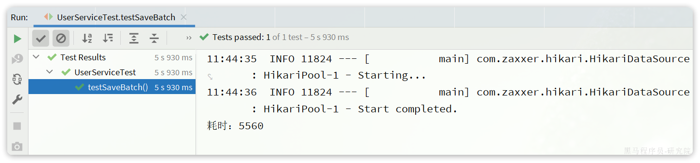

在`ClientPreparedStatement`的`executeBatchInternal`中，有判断`rewriteBatchedStatements`值是否为true并重写SQL的功能：


最终，SQL被重写了：

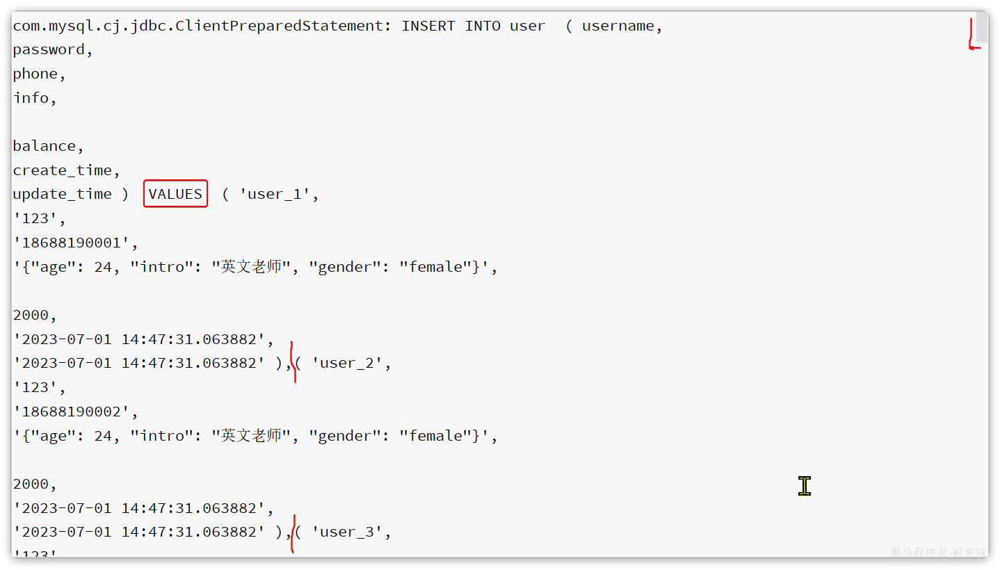

# 3.扩展功能

## 3.1.代码生成

在使用MybatisPlus以后，基础的`Mapper`、`Service`、`PO`代码相对固定，重复编写也比较麻烦。因此MybatisPlus官方提供了代码生成器根据数据库表结构生成
`PO`、`Mapper`、`Service`等相关代码。只不过代码生成器同样要编码使用，也很麻烦。

这里推荐大家使用一款`MybatisPlus`的插件，它可以基于图形化界面完成`MybatisPlus`的代码生成，非常简单。

### 3.1.1.安装插件

在`Idea`的plugins市场中搜索并安装`MyBatisPlus`插件：


然后重启你的Idea即可使用。

### 3.1.2.使用

刚好数据库中还有一张address表尚未生成对应的实体和mapper等基础代码。我们利用插件生成一下。

首先需要配置数据库地址，在Idea顶部菜单中，找到`other`，选择`Config Database`：


在弹出的窗口中填写数据库连接的基本信息：


点击OK保存。

然后再次点击Idea顶部菜单中的other，然后选择`Code Generator`:


在弹出的表单中填写信息：


最终，代码自动生成到指定的位置了：


## 3.2.静态工具

有的时候Service之间也会相互调用，为了避免出现循环依赖问题，MybatisPlus提供一个静态工具类：`Db`，其中的一些静态方法与
`IService`中方法签名基本一致，也可以帮助我们实现CRUD功能：


示例：

```java
@Test
void testDbGet() {
    User user = Db.getById(1L, User.class);
    System.out.println(user);
}

@Test
void testDbList() {
    // 利用Db实现复杂条件查询
    List<User> list = Db.lambdaQuery(User.class)
            .like(User::getUsername, "o")
            .ge(User::getBalance, 1000)
            .list();
    list.forEach(System.out::println);
}

@Test
void testDbUpdate() {
    Db.lambdaUpdate(User.class)
            .set(User::getBalance, 2000)
            .eq(User::getUsername, "Rose");
}
```

需求：改造根据id用户查询的接口，查询用户的同时返回用户收货地址列表

首先，我们要添加一个收货地址的VO对象：

```java
package com.itheima.mp.domain.vo;

import io.swagger.annotations.ApiModel;
import io.swagger.annotations.ApiModelProperty;
import lombok.Data;

@Data
@ApiModel(description = "收货地址VO")
public class AddressVO{

    @ApiModelProperty("id")
    private Long id;

    @ApiModelProperty("用户ID")
    private Long userId;

    @ApiModelProperty("省")
    private String province;

    @ApiModelProperty("市")
    private String city;

    @ApiModelProperty("县/区")
    private String town;

    @ApiModelProperty("手机")
    private String mobile;

    @ApiModelProperty("详细地址")
    private String street;

    @ApiModelProperty("联系人")
    private String contact;

    @ApiModelProperty("是否是默认 1默认 0否")
    private Boolean isDefault;

    @ApiModelProperty("备注")
    private String notes;
}
```

然后，改造原来的UserVO，添加一个地址属性：


接下来，修改UserController中根据id查询用户的业务接口：

```java
@GetMapping("/{id}")
@ApiOperation("根据id查询用户")
public UserVO queryUserById(@PathVariable("id") Long userId){
    // 基于自定义service方法查询
    return userService.queryUserAndAddressById(userId);
}
```

由于查询业务复杂，所以要在service层来实现。首先在IUserService中定义方法：

```java
package com.itheima.mp.service;

import com.baomidou.mybatisplus.extension.service.IService;
import com.itheima.mp.domain.po.User;
import com.itheima.mp.domain.vo.UserVO;

public interface IUserService extends IService<User> {
    void deduct(Long id, Integer money);

    UserVO queryUserAndAddressById(Long userId);
}
```

然后，在UserServiceImpl中实现该方法：

```java
@Override
public UserVO queryUserAndAddressById(Long userId) {
    // 1.查询用户
    User user = getById(userId);
    if (user == null) {
        return null;
    }
    // 2.查询收货地址
    List<Address> addresses = Db.lambdaQuery(Address.class)
            .eq(Address::getUserId, userId)
            .list();
    // 3.处理vo
    UserVO userVO = BeanUtil.copyProperties(user, UserVO.class);
    userVO.setAddresses(BeanUtil.copyToList(addresses, AddressVO.class));
    return userVO;
}
```

在查询地址时，我们采用了Db的静态方法，因此避免了注入AddressService，减少了循环依赖的风险。

## 3.3.逻辑删除

对于一些比较重要的数据，我们往往会采用逻辑删除的方案，即：

- 在表中添加一个字段标记数据是否被删除
- 当删除数据时把标记置为true
- 查询时过滤掉标记为true的数据

一旦采用了逻辑删除，所有的查询和删除逻辑都要跟着变化，非常麻烦。为了解决这个问题，MybatisPlus就添加了对逻辑删除的支持。

**注意**，只有MybatisPlus生成的SQL语句才支持自动的逻辑删除，自定义SQL需要自己手动处理逻辑删除。

例如，我们给`address`表添加一个逻辑删除字段：

```sql
alter table address
	add deleted bit default b'0' null comment '逻辑删除';
```

然后给`Address`实体添加`deleted`字段：


接下来，我们要在`application.yml`中配置逻辑删除字段：

```yaml
mybatis-plus:
  global-config:
    db-config:
      logic-delete-field: deleted # 全局逻辑删除的实体字段名(since 3.3.0,配置后可以忽略不配置步骤2)
      logic-delete-value: 1 # 逻辑已删除值(默认为 1)
      logic-not-delete-value: 0 # 逻辑未删除值(默认为 0)
```

测试：

首先，我们执行一个删除操作：

```java
@Test
void testDeleteByLogic() {
    // 删除方法与以前没有区别
    addressService.removeById(59L);
}
```

方法与普通删除一模一样，但是底层的SQL逻辑变了：


查询一下试试：

```java
@Test
void testQuery() {
    List<Address> list = addressService.list();
    list.forEach(System.out::println);
}
```

会发现id为59的确实没有查询出来，而且SQL中也对逻辑删除字段做了判断：


综上， 开启了逻辑删除功能以后，我们就可以像普通删除一样做CRUD，基本不用考虑代码逻辑问题。还是非常方便的。

**注意**：

逻辑删除本身也有自己的问题，比如：

- 会导致数据库表垃圾数据越来越多，从而影响查询效率
- SQL中全都需要对逻辑删除字段做判断，影响查询效率

因此，我不太推荐采用逻辑删除功能，如果数据不能删除，可以采用把数据迁移到其它表的办法。

## 3.3.通用枚举

User类中有一个用户状态字段：


像这种字段我们一般会定义一个枚举，做业务判断的时候就可以直接基于枚举做比较。但是我们数据库采用的是`int`类型，对应的PO也是
`Integer`。因此业务操作时必须手动把`枚举`与`Integer`转换，非常麻烦。

因此，MybatisPlus提供了一个处理枚举的类型转换器，可以帮我们**把枚举类型与数据库类型自动转换**。

### 3.3.1.定义枚举

我们定义一个用户状态的枚举：


代码如下：

```java
package com.itheima.mp.enums;

import com.baomidou.mybatisplus.annotation.EnumValue;
import lombok.Getter;

@Getter
public enum UserStatus {
    NORMAL(1, "正常"),
    FREEZE(2, "冻结")
    ;
    private final int value;
    private final String desc;

    UserStatus(int value, String desc) {
        this.value = value;
        this.desc = desc;
    }
}
```

然后把`User`类中的`status`字段改为`UserStatus` 类型：

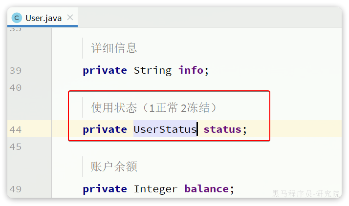

要让`MybatisPlus`处理枚举与数据库类型自动转换，我们必须告诉`MybatisPlus`，枚举中的哪个字段的值作为数据库值。

`MybatisPlus`提供了`@EnumValue`注解来标记枚举属性：


### 3.3.2.配置枚举处理器

在application.yaml文件中添加配置：

```yaml
mybatis-plus:
  configuration:
    default-enum-type-handler: com.baomidou.mybatisplus.core.handlers.MybatisEnumTypeHandler
```

### 3.3.3.测试

```java
@Test
void testService() {
    List<User> list = userService.list();
    list.forEach(System.out::println);
}
```

最终，查询出的`User`类的`status`字段会是枚举类型：


## 3.4.字段类型处理器

数据库的user表中有一个`info`字段，是JSON类型：


格式像这样：

```json
{
  "age": 20,
  "intro": "佛系青年",
  "gender": "male"
}
```

而目前`User`实体类中却是`String`类型：


这样以来，我们要读取info中的属性时就非常不方便。如果要方便获取，info的类型最好是一个`Map`或者实体类。

而一旦我们把`info`改为`对象`类型，就需要在写入数据库是手动转为`String`，再读取数据库时，手动转换为`对象`，这会非常麻烦。

因此MybatisPlus提供了很多特殊类型字段的类型处理器，解决特殊字段类型与数据库类型转换的问题。例如处理JSON就可以使用
`JacksonTypeHandler`处理器。

接下来，我们就来看看这个处理器该如何使用。

### 3.4.1.定义实体

首先，我们定义一个单独实体类来与info字段的属性匹配：

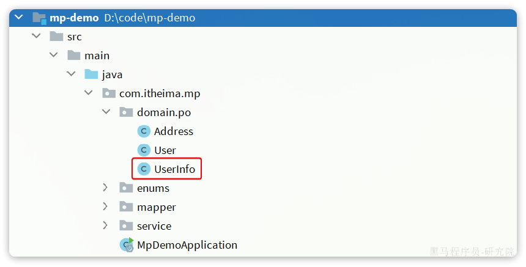

代码如下：

```java
package com.itheima.mp.domain.po;

import lombok.Data;

@Data
public class UserInfo {
    private Integer age;
    private String intro;
    private String gender;
}
```

### 3.4.2.使用类型处理器

接下来，将User类的info字段修改为UserInfo类型，并声明类型处理器：

```java
类上增加自动map 映射
@Data
@TableName(autoResultMap = true)
public class User {
    @TableField(typeHandler = JacksonTypeHandler.class)
    private UserInfo info;
}
```

同时导入jackson 坐标配置

```xml

<dependency>
    <groupId>org.springframework.boot</groupId>
    <artifactId>spring-boot-starter-json</artifactId>
</dependency>
```

```
注意: UserMapper.xml 中mapper 中的ParamterType 注释掉,
```

测试可以发现，所有数据都正确封装到UserInfo当中了：


## 3.5.配置加密（选学）

目前我们配置文件中的很多参数都是明文，如果开发人员发生流动，很容易导致敏感信息的泄露。所以MybatisPlus支持配置文件的加密和解密功能。

我们以数据库的用户名和密码为例。

### 3.5.1.生成秘钥

首先，我们利用AES工具生成一个随机秘钥，然后对用户名、密码加密：

```java
package com.itheima.mp;

import com.baomidou.mybatisplus.core.toolkit.AES;
import org.junit.jupiter.api.Test;

class MpDemoApplicationTests {
    @Test
    void contextLoads() {
        // 生成 16 位随机 AES 密钥
        String randomKey = AES.generateRandomKey();
        System.out.println("randomKey = " + randomKey);

        // 利用密钥对用户名加密
        String username = AES.encrypt("root", randomKey);
        System.out.println("username = " + username);

        // 利用密钥对用户名加密
        String password = AES.encrypt("MySQL123", randomKey);
        System.out.println("password = " + password);

    }
}
```

打印结果如下：

```java
randomKey = 6234633a66fb399f
username = px2bAbnUfiY8K/IgsKvscg==
password = FGvCSEaOuga3ulDAsxw68Q==
```

### 3.5.2.修改配置

修改application.yaml文件，把jdbc的用户名、密码修改为刚刚加密生成的密文：

```yaml
spring:
  datasource:
    url: jdbc:mysql://127.0.0.1:3306/mp?useUnicode=true&characterEncoding=UTF-8&autoReconnect=true&serverTimezone=Asia/Shanghai&rewriteBatchedStatements=true
    driver-class-name: com.mysql.cj.jdbc.Driver
    username: mpw:QWWVnk1Oal3258x5rVhaeQ== # 密文要以 mpw:开头
    password: mpw:EUFmeH3cNAzdRGdOQcabWg== # 密文要以 mpw:开头
```

### 3.5.3.测试

在启动项目的时候，需要把刚才生成的秘钥添加到启动参数中，像这样：

```yaml
--mpw.key=6234633a66fb399f
```

单元测试的时候不能添加启动参数，所以要在测试类的注解上配置：


然后随意运行一个单元测试，可以发现数据库查询正常。

# 4.插件功能

MybatisPlus提供了很多的插件功能，进一步拓展其功能。目前已有的插件有：

- `PaginationInnerInterceptor`：自动分页
- `TenantLineInnerInterceptor`：多租户
- `DynamicTableNameInnerInterceptor`：动态表名
- `OptimisticLockerInnerInterceptor`：乐观锁
- `IllegalSQLInnerInterceptor`：sql 性能规范
- `BlockAttackInnerInterceptor`：防止全表更新与删除

**注意：**

使用多个分页插件的时候需要注意插件定义顺序，建议使用顺序如下：

- 多租户,动态表名
- 分页,乐观锁
- sql 性能规范,防止全表更新与删除

这里我们以分页插件为里来学习插件的用法。

## 4.1.分页插件

在未引入分页插件的情况下，`MybatisPlus`是不支持分页功能的，`IService`和`BaseMapper`中的分页方法都无法正常起效。

所以，我们必须配置分页插件。

### 4.1.1.配置分页插件

在项目中新建一个配置类：


其代码如下：

```java
package com.itheima.mp.config;

import com.baomidou.mybatisplus.annotation.DbType;
import com.baomidou.mybatisplus.extension.plugins.MybatisPlusInterceptor;
import com.baomidou.mybatisplus.extension.plugins.inner.PaginationInnerInterceptor;
import org.springframework.context.annotation.Bean;
import org.springframework.context.annotation.Configuration;

@Configuration
public class MybatisConfig {

    @Bean
    public MybatisPlusInterceptor mybatisPlusInterceptor() {
        // 初始化核心插件
        MybatisPlusInterceptor interceptor = new MybatisPlusInterceptor();
        // 添加分页插件
        interceptor.addInnerInterceptor(new PaginationInnerInterceptor(DbType.MYSQL));
        return interceptor;
    }
}
```

### 4.1.2.分页API

编写一个分页查询的测试：

```java
@Test
void testPageQuery() {
    // 1.分页查询，new Page()的两个参数分别是：页码、每页大小
    Page<User> p = userService.page(new Page<>(2, 2));
    // 2.总条数
    System.out.println("total = " + p.getTotal());
    // 3.总页数
    System.out.println("pages = " + p.getPages());
    // 4.数据
    List<User> records = p.getRecords();
    records.forEach(System.out::println);
}
```

运行的SQL如下：


这里用到了分页参数，Page，即可以支持分页参数，也可以支持排序参数。常见的API如下：

```java
int pageNo = 1, pageSize = 5;
// 分页参数
Page<User> page = Page.of(pageNo, pageSize);
// 排序参数, 通过OrderItem来指定
page.addOrder(new OrderItem("balance", false));

userService.page(page);
```

## 4.2.通用分页实体

现在要实现一个用户分页查询的接口，接口规范如下：

| **参数** | **说明**                                                                                                                                                                                                                                                                                                                                                                                                                                                                                                                                                                                                                              |
|--------|-------------------------------------------------------------------------------------------------------------------------------------------------------------------------------------------------------------------------------------------------------------------------------------------------------------------------------------------------------------------------------------------------------------------------------------------------------------------------------------------------------------------------------------------------------------------------------------------------------------------------------------|
| 请求方式   | GET                                                                                                                                                                                                                                                                                                                                                                                                                                                                                                                                                                                                                                 |
| 请求路径   | /users/page                                                                                                                                                                                                                                                                                                                                                                                                                                                                                                                                                                                                                         |
| 请求参数   | `{    "pageNo": 1,    "pageSize": 5,    "sortBy": "balance",    "isAsc": false }`                                                                                                                                                                                                                                                                                                                                                                                                                                                                                                                                                   |
| 返回值    | `{    "total": 100006,    "pages": 50003,    "list": [        {            "id": 1685100878975279298,            "username": "user_9****",            "info": {                "age": 24,                "intro": "英文老师",                "gender": "female"            },            "status": "正常",            "balance": 2000        },        {            "id": 1685100878975279299,            "username": "user_9****",            "info": {                "age": 24,                "intro": "英文老师",                "gender": "female"            },            "status": "正常",            "balance": 2000        }    ] }` |
| 特殊说明   | •如果排序字段为空，默认按照更新时间排序•排序字段不为空，则按照排序字段排序                                                                                                                                                                                                                                                                                                                                                                                                                                                                                                                                                                                              |

这里需要定义3个实体：

- `PageQuery`：分页查询条件的实体，包含分页、排序参数
- `PageDTO`：分页结果实体，包含总条数、总页数、当前页数据
- `UserVO`：用户页面视图实体

接下来我们就按照WEB开发的过程来实现这个接口。

首先，我们在项目中引入`spring-boot-starter-web`依赖：

```xml
<!-- web依赖 -->
<dependency>
    <groupId>org.springframework.boot</groupId>
    <artifactId>spring-boot-starter-web</artifactId>
</dependency>
        <!-- hutool 工具包-->
<dependency>
<groupId>cn.hutool</groupId>
<artifactId>hutool-all</artifactId>
<version>5.8.11</version>
</dependency>
```

然后，按`alt+8`打开`service`控制台，然后添加一个`SpringBoot`启动项：


弹窗中选择`Spring Boot`：


弹窗中填写信息：


其中不要忘了配置我们之前添加的数据加密的秘钥。

### 4.2.1.实体

首先是请求参数的`PageQuery`实体：


`PageQuery`是前端提交的查询参数，一般包含四个属性：

- `pageNo`：页码
- `pageSize`：每页数据条数
- `sortBy`：排序字段
- `isAsc`：是否升序

```java
package com.itheima.mp.domain.query;

import lombok.Data;

@Data
public class PageQuery {
    private Integer pageNo;
    private Integer pageSize;
    private String sortBy;
    private Boolean isAsc;
}
```

然后返回值的用户实体沿用之前定一个`UserVO`实体：


最后，则是分页实体PageDTO:

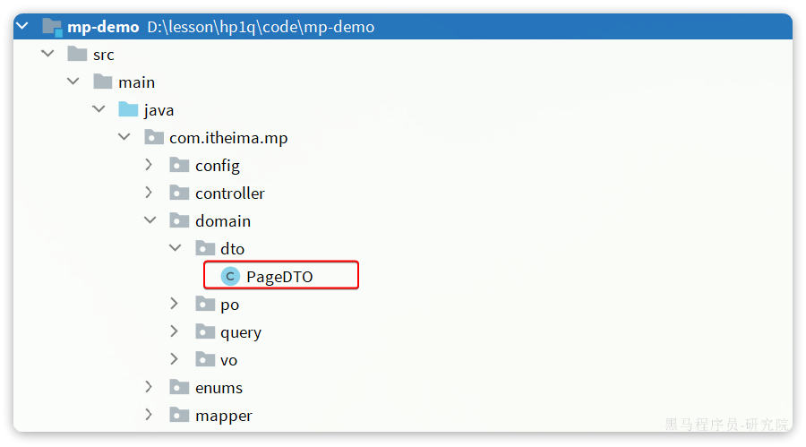

代码如下：

```java
package com.itheima.mp.domain.dto;

import lombok.AllArgsConstructor;
import lombok.Data;
import lombok.NoArgsConstructor;

import java.util.List;

@Data
@NoArgsConstructor
@AllArgsConstructor
public class PageDTO<T> {
    private Integer total;
    private Integer pages;
    private List<T> list;
}
```

### 4.2.2.开发接口

我们在`UserController`中定义分页查询用户的接口：

```java
package com.itheima.mp.controller;

import com.itheima.mp.domain.dto.PageDTO;
import com.itheima.mp.domain.query.PageQuery;
import com.itheima.mp.domain.vo.UserVO;
import com.itheima.mp.service.IUserService;
import lombok.RequiredArgsConstructor;
import org.springframework.web.bind.annotation.GetMapping;
import org.springframework.web.bind.annotation.RequestMapping;
import org.springframework.web.bind.annotation.RestController;

@RestController
@RequestMapping("users")
@RequiredArgsConstructor
public class UserController {

    private final IUserService userService;

    @GetMapping("/page")
    public PageDTO<UserVO> queryUserByPage(PageQuery query){
        return userService.queryUserByPage(query);
    }

    // 。。。 略
}
```

然后在`IUserService`中创建`queryUserByPage`方法：

```java
PageDTO<UserVO> queryUserByPage(PageQuery query);
```

接下来，在UserServiceImpl中实现该方法：

```java
@Override
public PageDTO<UserVO> queryUserByPage(PageQuery query) {
    // 1.构建条件
    // 1.1.分页条件
    Page<User> page = Page.of(query.getPageNo(), query.getPageSize());
    // 1.2.排序条件
    if (query.getSortBy() != null) {
        page.addOrder(new OrderItem(query.getSortBy(), query.getIsAsc()));
    }else{
        // 默认按照更新时间排序
        page.addOrder(new OrderItem("update_time", false));
    }
    // 2.查询
    page(page);
    // 3.数据非空校验
    List<User> records = page.getRecords();
    if (records == null || records.size() <= 0) {
        // 无数据，返回空结果
        return new PageDTO<>(page.getTotal(), page.getPages(), Collections.emptyList());
    }
    // 4.有数据，转换
    List<UserVO> list = BeanUtil.copyToList(records, UserVO.class);
    // 5.封装返回
    return new PageDTO<UserVO>(page.getTotal(), page.getPages(), list);
}
```

最后，为了让UserStatus枚举可以展示为文字描述，再给UserStatus中的desc字段添加`@JsonValue`注解：


启动项目，在页面查看：

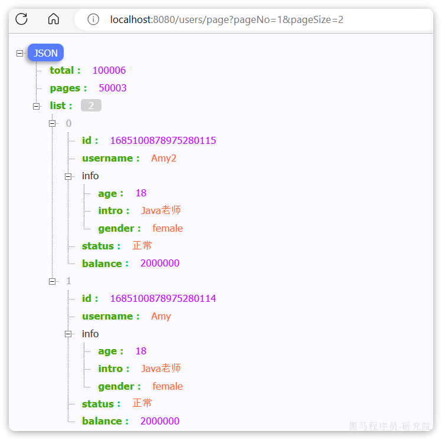

### 4.2.3.改造PageQuery实体

在刚才的代码中，从`PageQuery`到`MybatisPlus`的`Page`之间转换的过程还是比较麻烦的。

我们完全可以在`PageQuery`这个实体中定义一个工具方法，简化开发。

像这样：

```java
package com.itheima.mp.domain.query;

import com.baomidou.mybatisplus.core.metadata.OrderItem;
import com.baomidou.mybatisplus.extension.plugins.pagination.Page;
import lombok.Data;

@Data
public class PageQuery {
    private Integer pageNo;
    private Integer pageSize;
    private String sortBy;
    private Boolean isAsc;

    public <T>  Page<T> toMpPage(OrderItem ... orders){
        // 1.分页条件
        Page<T> p = Page.of(pageNo, pageSize);
        // 2.排序条件
        // 2.1.先看前端有没有传排序字段
        if (sortBy != null) {
            p.addOrder(new OrderItem(sortBy, isAsc));
            return p;
        }
        // 2.2.再看有没有手动指定排序字段
        if(orders != null){
            p.addOrder(orders);
        }
        return p;
    }

    public <T> Page<T> toMpPage(String defaultSortBy, boolean isAsc){
        return this.toMpPage(new OrderItem(defaultSortBy, isAsc));
    }

    public <T> Page<T> toMpPageDefaultSortByCreateTimeDesc() {
        return toMpPage("create_time", false);
    }

    public <T> Page<T> toMpPageDefaultSortByUpdateTimeDesc() {
        return toMpPage("update_time", false);
    }
}
```

这样我们在开发也时就可以省去对从`PageQuery`到`Page`的的转换：

```java
// 1.构建条件
Page<User> page = query.toMpPageDefaultSortByCreateTimeDesc();
```

### 4.2.4.改造PageDTO实体

在查询出分页结果后，数据的非空校验，数据的vo转换都是模板代码，编写起来很麻烦。

我们完全可以将其封装到PageDTO的工具方法中，简化整个过程：

```java
package com.itheima.mp.domain.dto;

import cn.hutool.core.bean.BeanUtil;
import com.baomidou.mybatisplus.extension.plugins.pagination.Page;
import lombok.AllArgsConstructor;
import lombok.Data;
import lombok.NoArgsConstructor;

import java.util.Collections;
import java.util.List;
import java.util.function.Function;
import java.util.stream.Collectors;

@Data
@NoArgsConstructor
@AllArgsConstructor
public class PageDTO<V> {
    private Long total;
    private Long pages;
    private List<V> list;

    /**
     * 返回空分页结果
     * @param p MybatisPlus的分页结果
     * @param <V> 目标VO类型
     * @param <P> 原始PO类型
     * @return VO的分页对象
     */
    public static <V, P> PageDTO<V> empty(Page<P> p){
        return new PageDTO<>(p.getTotal(), p.getPages(), Collections.emptyList());
    }

    /**
     * 将MybatisPlus分页结果转为 VO分页结果
     * @param p MybatisPlus的分页结果
     * @param voClass 目标VO类型的字节码
     * @param <V> 目标VO类型
     * @param <P> 原始PO类型
     * @return VO的分页对象
     */
    public static <V, P> PageDTO<V> of(Page<P> p, Class<V> voClass) {
        // 1.非空校验
        List<P> records = p.getRecords();
        if (records == null || records.size() <= 0) {
            // 无数据，返回空结果
            return empty(p);
        }
        // 2.数据转换
        List<V> vos = BeanUtil.copyToList(records, voClass);
        // 3.封装返回
        return new PageDTO<>(p.getTotal(), p.getPages(), vos);
    }

    /**
     * 将MybatisPlus分页结果转为 VO分页结果，允许用户自定义PO到VO的转换方式
     * @param p MybatisPlus的分页结果
     * @param convertor PO到VO的转换函数
     * @param <V> 目标VO类型
     * @param <P> 原始PO类型
     * @return VO的分页对象
     */
    public static <V, P> PageDTO<V> of(Page<P> p, Function<P, V> convertor) {
        // 1.非空校验
        List<P> records = p.getRecords();
        if (records == null || records.size() <= 0) {
            // 无数据，返回空结果
            return empty(p);
        }
        // 2.数据转换
        List<V> vos = records.stream().map(convertor).collect(Collectors.toList());
        // 3.封装返回
        return new PageDTO<>(p.getTotal(), p.getPages(), vos);
    }
}
```

最终，业务层的代码可以简化为：

```java
@Override
public PageDTO<UserVO> queryUserByPage(PageQuery query) {
    // 1.构建条件
    Page<User> page = query.toMpPageDefaultSortByCreateTimeDesc();
    // 2.查询
    page(page);
    // 3.封装返回
    return PageDTO.of(page, UserVO.class);
}
```

如果是希望自定义PO到VO的转换过程，可以这样做：

```java
@Override
public PageDTO<UserVO> queryUserByPage(PageQuery query) {
    // 1.构建条件
    Page<User> page = query.toMpPageDefaultSortByCreateTimeDesc();
    // 2.查询
    page(page);
    // 3.封装返回
    return PageDTO.of(page, user -> {
        // 拷贝属性到VO
        UserVO vo = BeanUtil.copyProperties(user, UserVO.class);
        // 用户名脱敏
        String username = vo.getUsername();
        vo.setUsername(username.substring(0, username.length() - 2) + "**");
        return vo;
    });
}
```

最终查询的结果如下：


# 5.作业

尝试改造项目一中的`Service`层和`Mapper`层实现，用`MybatisPlus`代替单表的CRUD
