# day11-微服务高级

微服务在面试时被问到的内容相对较少，常见的面试题如下：

- SpringCloud有哪些常用组件？分别是什么作用？
- 服务注册发现的基本流程是怎样的？
- Eureka和Nacos有哪些区别？
- Nacos的分级存储模型是什么意思？
- Ribbon和SpringCloudLoadBalancer有什么差异
- 什么是服务雪崩，常见的解决方案有哪些？
- Hystix和Sentinel有什么区别和联系？
- 限流的常见算法有哪些？
- 什么是CAP理论和BASE思想？
- 项目中碰到过分布式事务问题吗？怎么解决的？
- AT模式如何解决脏读和脏写问题的？
- TCC模式与AT模式对比，有哪些优缺点

可以发现，这些问题都是围绕着SpringCloud的相关组件的，其中有些问题我们在课堂上已经介绍过，这里不再赘述。我们重点讲解一些之前没有讲过的，与底层实现有关的部分。

讲解的思路还是基于SpringCloud的组件分类来讲的，主要包括：

- 分布式事务
- 注册中心
- 远程调用
- 服务保护

等几个方面

# 1.分布式事务

**分布式事务**，就是指不是在单个服务或单个数据库架构下，产生的事务，例如：

- 跨数据源的分布式事务
- 跨服务的分布式事务
- 综合情况

我们之前解决分布式事务问题是直接使用Seata框架的AT模式，但是解决分布式事务问题的方案远不止这一种。

## 1.1.CAP定理

解决分布式事务问题，需要一些分布式系统的基础知识作为理论指导，首先就是CAP定理。

1998年，加州大学的计算机科学家 Eric Brewer 提出，分布式系统有三个指标：

- **C**onsistency（一致性）
- **A**vailability（可用性）
- **P**artition tolerance （分区容错性）

它们的第一个字母分别是 `C`、`A`、`P`。Eric Brewer认为任何分布式系统架构方案都不可能同时满足这3个目标，这个结论就叫做 CAP 定理。

为什么呢？

### 1.1.1.一致性

`Consistency`（一致性）：用户访问分布式系统中的任意节点，得到的数据必须一致。

比如现在包含两个节点，其中的初始数据是一致的：


当我们修改其中一个节点的数据时，两者的数据产生了差异：


要想保住一致性，就必须实现node01 到 node02的数据 同步：


### 1.1.2.可用性

Availability （可用性）：用户访问分布式系统时，读或写操作总能成功。

只能读不能写，或者只能写不能读，或者两者都不能执行，就说明系统弱可用或不可用。

### 1.1.3.分区容错

`Partition`，就是分区，就是当分布式系统节点之间出现网络故障导致节点之间无法通信的情况：


如上图，node01和node02之间网关畅通，但是与node03之间网络断开。于是node03成为一个独立的网络分区；node01和node02在一个网络分区。

`Tolerance`，就是容错，即便是系统出现网络分区，整个系统也要持续对外提供服务。

### 1.1.4.矛盾

在分布式系统中，网络不能100%保证畅通，也就是说网络分区的情况一定会存在。而我们的系统必须要持续运行，对外提供服务。所以分区容错性（
`P`）是硬性指标，所有分布式系统都要满足。而在设计分布式系统时要取舍的就是一致性（`C`）和可用性（`A`）了。

假如现在出现了网络分区，如图：


由于网络故障，当我们把数据写入node01时，可以与node02完成数据同步，但是无法同步给node03。现在有两种选择：

- 允许用户任意读写，保证可用性。但由于node03无法完成同步，就会出现数据不一致的情况。满足AP
- 不允许用户写，可以读，直到网络恢复，分区消失。这样就确保了一致性，但牺牲了可用性。满足CP

可见，在分布式系统中，`A`和`C`之间只能满足一个。

## 1.2.BASE理论

既然分布式系统要遵循CAP定理，那么问题来了，我到底是该牺牲一致性还是可用性呢？如果牺牲了一致性，出现数据不一致该怎么处理？

人们在总结系统设计经验时，最终得到了一些心得：

- **B**asically **A**vailable **（**基本可用**）**：分布式系统在出现故障时，允许损失部分可用性，即保证核心可用。
- **S**oft State**（**软状态**）：**在一定时间内，允许出现中间状态，比如临时的不一致状态。
- **Ev**entually Consistent**（**最终一致性**）**：虽然无法保证强一致性，但是在软状态结束后，最终达到数据一致。

以上就是BASE理论。

简单来说，BASE理论就是一种取舍的方案，不再追求完美，而是最终达成目标。因此解决分布式事务的思想也是这样，有两个方向：

- AP思想：各个子事务分别执行和提交，无需锁定数据。允许出现结果不一致，然后采用弥补措施恢复，实现最终一致即可。例如`AT`模式就是如此
- CP思想：各个子事务执行后不要提交，而是等待彼此结果，然后同时提交或回滚。在这个过程中锁定资源，不允许其它人访问，数据处于不可用状态，但能保证一致性。例如
  `XA`模式

## 1.3.AT模式的脏写问题

我们先回顾一下AT模式的流程，AT模式也分为两个阶段：

第一阶段是记录数据快照，执行并提交事务：

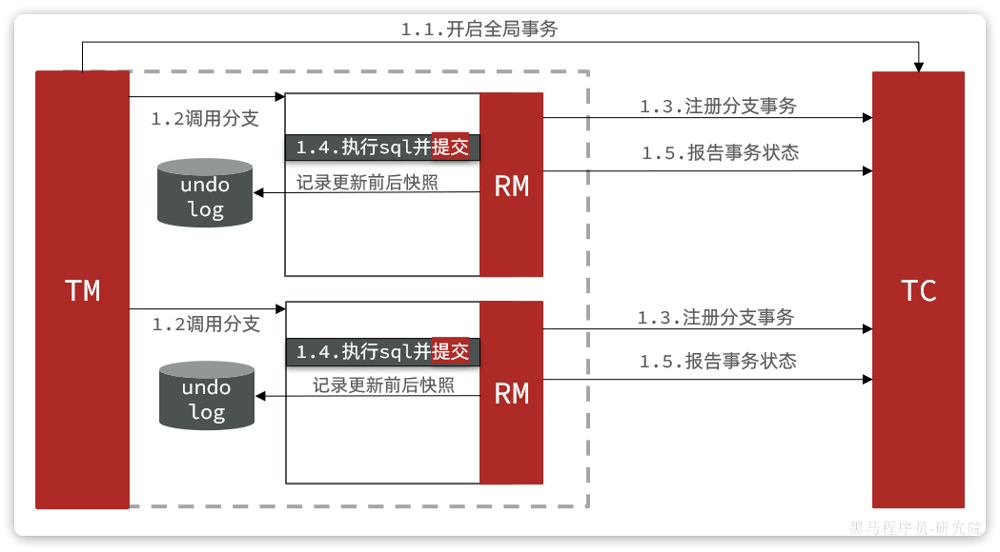

第二阶段根据阶段一的结果来判断：

- 如果每一个分支事务都成功，则事务已经结束（因为阶段一已经提交），因此删除阶段一的快照即可
- 如果有任意分支事务失败，则需要根据快照恢复到更新前数据。然后删除快照

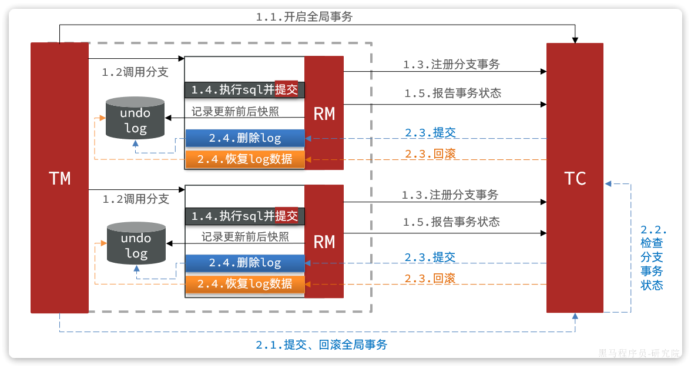

这种模式在大多数情况下（99%）并不会有什么问题，不过在极端情况下，特别是多线程并发访问AT模式的分布式事务时，有可能出现脏写问题，如图：


解决思路就是引入了全局锁的概念。在释放DB锁之前，先拿到全局锁。避免同一时刻有另外一个事务来操作当前数据。


具体可以参考官方文档：

https://seata.io/zh-cn/docs/dev/mode/at-mode.html

## 1.4.TCC模式

TCC模式与AT模式非常相似，每阶段都是独立事务，不同的是TCC通过人工编码来实现数据恢复。需要实现三个方法：

- `try`：资源的检测和预留；
- `confirm`：完成资源操作业务；要求 `try` 成功 `confirm` 一定要能成功。
- `cancel`：预留资源释放，可以理解为try的反向操作。

### 1.4.1.流程分析

举例，一个扣减用户余额的业务。假设账户A原来余额是100，需要余额扣减30元。

**阶段一（ Try ）**：检查余额是否充足，如果充足则冻结金额增加30元，可用余额扣除30

初始余额：


余额充足，可以冻结：


此时，总金额 = 冻结金额 + 可用金额，数量依然是100不变。事务直接提交无需等待其它事务。

**阶段二（Confirm)**：假如要提交（Confirm），之前可用金额已经扣减，并转移到冻结金额。因此可用金额不变，直接冻结金额扣减30即可：


此时，总金额 = 冻结金额 + 可用金额 = 0 + 70 = 70元

**阶段二(Canncel)**
：如果要回滚（Cancel），则释放之前冻结的金额，也就是冻结金额扣减30，可用余额增加30

### 1.4.2.事务悬挂和空回滚

假如一个分布式事务中包含两个分支事务，try阶段，一个分支成功执行，另一个分支事务**阻塞**：


如果阻塞时间太长，可能导致全局事务超时而触发二阶段的`cancel`操作。两个分支事务都会执行cancel操作：


要知道，其中一个分支是未执行`try`操作的，直接执行了`cancel`操作，反而会导致数据错误。因此，这种情况下，尽管`cancel`
方法要执行，但其中不能做任何回滚操作，这就是**空回滚**。

对于整个空回滚的分支事务，将来try方法阻塞结束依然会执行。但是整个全局事务其实已经结束了，因此永远不会再有confirm或cancel，也就是说这个事务执行了一半，处于
**悬挂状态**，这就是业务悬挂问题。

以上问题都需要我们在编写try、cancel方法时处理。

### 1.4.3.总结

TCC模式的每个阶段是做什么的？

- Try：资源检查和预留
- Confirm：业务执行和提交
- Cancel：预留资源的释放

TCC的优点是什么？

- 一阶段完成直接提交事务，释放数据库资源，性能好
- 相比AT模型，无需生成快照，无需使用全局锁，性能最强
- 不依赖数据库事务，而是依赖补偿操作，可以用于非事务型数据库

TCC的缺点是什么？

- 有代码侵入，需要人为编写try、Confirm和Cancel接口，太麻烦
- 软状态，事务是最终一致
- 需要考虑Confirm和Cancel的失败情况，做好幂等处理、事务悬挂和空回滚处理

# 2.注册中心

本章主要学习Nacos中的一些特性和原理，以及与Eureka的功能对比。

## 2.1.环境隔离

企业实际开发中，往往会搭建多个运行环境，例如：

- 开发环境
- 测试环境
- 预发布环境
- 生产环境

这些不同环境之间的服务和数据之间需要隔离。

还有的企业中，会开发多个项目，共享nacos集群。此时，这些项目之间也需要把服务和数据隔离。

因此，Nacos提供了基于`namespace`的环境隔离功能。具体的隔离层次如图所示：


说明：

- Nacos中可以配置多个`namespace`，相互之间完全隔离。默认的`namespace`名为`public`
- `namespace`下还可以继续分组，也就是group ，相互隔离。 默认的group是`DEFAULT_GROUP`
- `group`之下就是服务和配置了

### 2.1.1.创建namespace

nacos提供了一个默认的`namespace`，叫做`public`：


默认所有的服务和配置都属于这个`namespace`，当然我们也可以自己创建新的`namespace`：


然后填写表单：


添加完成后，可以在页面看到我们新建的`namespace`，并且Nacos为我们自动生成了一个命名空间id：


我们切换到配置列表页，你会发现`dev`这个命名空间下没有任何配置：


因为之前我们添加的所有配置都在`public`下：

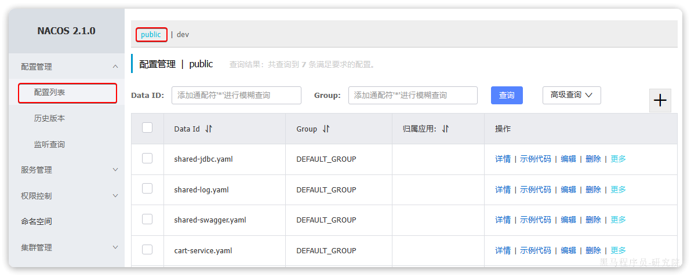

### 2.1.2.微服务配置namespace

默认情况下，所有的微服务注册发现、配置管理都是走`public`这个命名空间。如果要指定命名空间则需要修改`application.yml`文件。

比如，我们修改`item-service`服务的bootstrap.yml文件，添加服务发现配置，指定其`namespace`：

```yaml
spring:
  application:
    name: item-service # 服务名称
  profiles:
    active: dev
  cloud:
    nacos:
      server-addr: 192.168.150.101 # nacos地址
      discovery: # 服务发现配置
        namespace: 8c468c63-b650-48da-a632-311c75e6d235 # 设置namespace，必须用id
      # 。。。略
```

启动`item-service`，查看服务列表，会发现`item-service`出现在`dev`下：


而其它服务则出现在`public`下：


此时访问`http://localhost:8082/doc.html`，基于`swagger`做测试：


会发现查询结果中缺少商品的最新价格信息。

我们查看服务运行日志：


会发现`cart-service`服务在远程调用`item-service`时，并没有找到可用的实例。这证明不同namespace之间确实是相互隔离的，不可访问。

当我们把`namespace`切换回`public`，或者统一都是以`dev`时访问恢复正常。

## 2.2.分级模型

在一些大型应用中，同一个服务可以部署很多实例。而这些实例可能分布在全国各地的不同机房。由于存在地域差异，网络传输的速度会有很大不同，因此在做服务治理时需要区分不同机房的实例。

例如item-service，我们可以部署3个实例：

- 127.0.0.1:8081
- 127.0.0.1:8082
- 127.0.0.1:8083

假如这些实例分布在不同机房，例如：

- 127.0.0.1:8081，在上海机房
- 127.0.0.1:8082，在上海机房
- 127.0.0.1:8083，在杭州机房

Nacos中提供了集群（`cluster`）的概念，来对应不同机房。也就是说，一个服务（`service`）下可以有很多集群（`cluster`），而一个集群（
`cluster`）中下又可以包含很多实例（`instance`）。

如图：


因此，结合我们上一节学习的`namespace`命名空间的知识，任何一个微服务的实例在注册到Nacos时，都会生成以下几个信息，用来确认当前实例的身份，从外到内依次是：

- namespace：命名空间
- group：分组
- service：服务名
- cluster：集群
- instance：实例，包含ip和端口

这就是nacos中的服务分级模型。

在Nacos内部会有一个服务实例的注册表，是基于Map实现的，其结构与分级模型的对应关系如下：

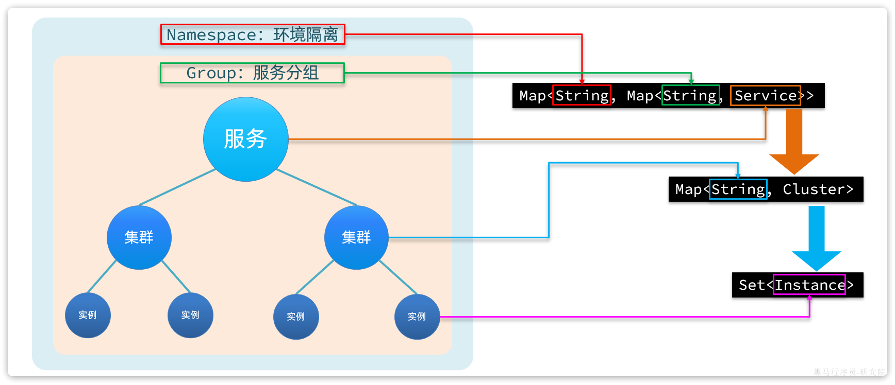

查看nacos控制台，会发现默认情况下所有服务的集群都是default：

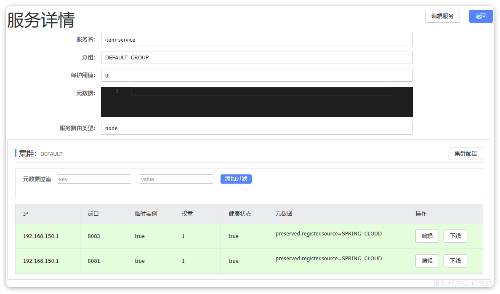

如果我们要修改服务所在集群，只需要修改`bootstrap.yml`即可：

```yaml
spring:
  cloud:
    nacos:
      discovery:
        cluster-name: BJ # 集群名称，自定义
```

我们修改`item-service`的`bootstrap.yml`，然后重新创建一个实例：


再次查看nacos：


发现8084这个新的实例确实属于`BJ`这个集群了。

## 2.3.Eureka

Eureka是Netflix公司开源的一个服务注册中心组件，早期版本的SpringCloud都是使用Eureka作为注册中心。由于Eureka和Nacos的starter中提供的功能都是基于SpringCloudCommon规范，因此两者使用起来差别不大。

课前资料中提供了一个Eureka的demo：


我们可以用idea打开查看一下：

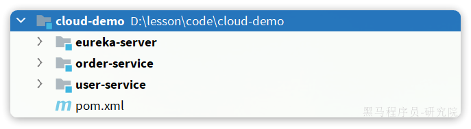

结构说明：

- `eureka-server`：Eureka的服务端，也就是注册中心。没错，Eureka服务端要自己创建项目
- `order-service`：订单服务，是一个服务调用者，查询订单的时候要查询用户
- `user-service`：用户服务，是一个服务提供者，对外暴露查询用户的接口

启动以后，访问`localhost:10086`即可查看到Eureka的控制台，相对于Nacos来说简陋了很多：


微服务引入Eureka的方式也极其简单，分两步：

- 引入`eureka-client`依赖
- 配置`eureka`地址

接下来就是编写OpenFeign的客户端了，怎么样？是不是跟Nacos用起来基本一致。

## 2.4.Eureka和Nacos对比

Eureka和Nacos都能起到注册中心的作用，用法基本类似。但还是有一些区别的，例如：

- Nacos支持配置管理，而Eureka则不支持。

而且服务注册发现上也有区别，我们来做一个实验：

我们停止`user-service`服务，然后观察Eureka控制台，你会发现很长一段时间过去后，Eureka服务依然没有察觉`user-service`的异常状态。

这与Eureka的健康检测机制有关。在Eureka中，健康检测的原理如下：

- 微服务启动时注册信息到Eureka，这点与Nacos一致。
- 微服务每隔30秒向Eureka发送心跳请求，报告自己的健康状态。Nacos中默认是5秒一次。
- Eureka如果90秒未收到心跳，则认为服务疑似故障，可能被剔除。Nacos中则是15秒超时，30秒剔除。
- Eureka如果发现超过85%比例的服务都心跳异常，会认为是自己的网络异常，暂停剔除服务的功能。
- Eureka每隔60秒执行一次服务检测和清理任务；Nacos是每隔5秒执行一次。

综上，你会发现Eureka是尽量不剔除服务，避免“误杀”，宁可放过一千，也不错杀一个。这就导致当服务真的出现故障时，迟迟不会被剔除，给服务的调用者带来困扰。

不仅如此，当Eureka发现服务宕机并从服务列表中剔除以后，并不会将服务列表的变更消息推送给所有微服务。而是等待微服务自己来拉取时发现服务列表的变化。而微服务每隔30秒才会去Eureka更新一次服务列表，进一步推迟了服务宕机时被发现的时间。

而Nacos中微服务除了自己定时去Nacos中拉取服务列表以外，Nacos还会在服务列表变更时主动推送最新的服务列表给所有的订阅者。

综上，Eureka和Nacos的相似点有：

- 都支持服务注册发现功能
- 都有基于心跳的健康监测功能
- 都支持集群，集群间数据同步默认是AP模式，即最全高可用性

Eureka和Nacos的区别有：

- Eureka的心跳是30秒一次，Nacos则是5秒一次
- Eureka如果90秒未收到心跳，则认为服务疑似故障，可能被剔除。Nacos中则是15秒超时，30秒剔除。
- Eureka每隔60秒执行一次服务检测和清理任务；Nacos是每隔5秒执行一次。
- Eureka只能等微服务自己每隔30秒更新一次服务列表；Nacos即有定时更新，也有在服务变更时的广播推送
- Eureka仅有注册中心功能，而Nacos同时支持注册中心、配置管理
- Eureka和Nacos都支持集群，而且默认都是AP模式

# 3.远程调用

我们知道微服务间远程调用都是有OpenFeign帮我们完成的，甚至帮我们实现了服务列表之间的负载均衡。但具体负载均衡的规则是什么呢？何时做的负载均衡呢？

接下来我们一起来分析一下。

## 3.1.负载均衡原理

在SpringCloud的早期版本中，负载均衡都是有Netflix公司开源的Ribbon组件来实现的，甚至Ribbon被直接集成到了Eureka-client和Nacos-Discovery中。

但是自SpringCloud2020版本开始，已经弃用Ribbon，改用Spring自己开源的Spring Cloud LoadBalancer了，我们使用的OpenFeign的也已经与其整合。

接下来我们就通过源码分析，来看看OpenFeign底层是如何实现负载均衡功能的。

### 3.1.1.源码跟踪

要弄清楚OpenFeign的负载均衡原理，最佳的办法肯定是从FeignClient的请求流程入手。

首先，我们在`com.hmall.cart.service.impl.CartServiceImpl`中的`queryMyCarts`方法中打一个断点。然后在swagger页面请求购物车列表接口。

进入断点后，观察`ItemClient`这个接口：


你会发现ItemClient是一个代理对象，而代理的处理器则是`SentinelInvocationHandler`。这是因为我们项目中引入了`Sentinel`导致。

我们进入`SentinelInvocationHandler`类中的`invoke`方法看看：


可以看到这里是先获取被代理的方法的处理器`MethodHandler`，接着，Sentinel就会开启对簇点资源的监控：

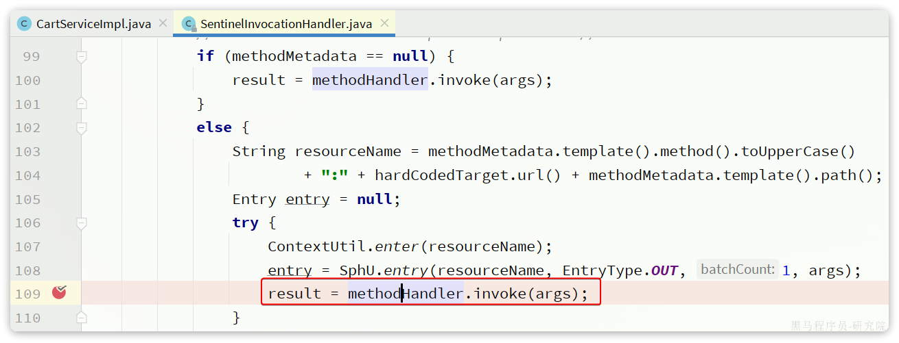

开启Sentinel的簇点资源监控后，就可以调用处理器了，我们尝试跟入，会发现有两种实现：

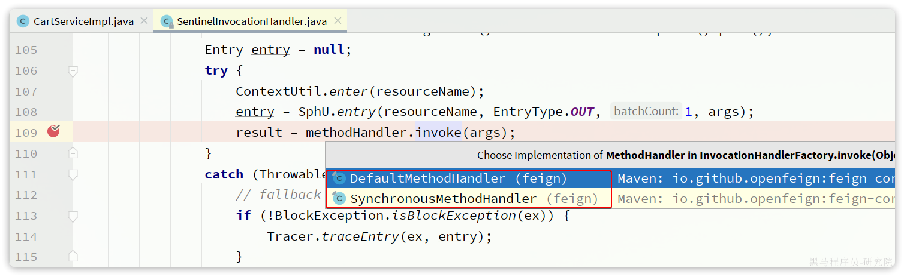

这其实就是OpenFeign远程调用的处理器了。继续跟入会进入`SynchronousMethodHandler`这个实现类：


在上述方法中，会循环尝试调用`executeAndDecode()`方法，直到成功或者是重试次数达到Retryer中配置的上限。

我们继续跟入`executeAndDecode()`方法：


`executeAndDecode()`方法最终会利用`client`去调用`execute()`方法，发起远程调用。

这里的client的类型是`feign.Client`接口，其下有很多实现类：


由于我们项目中整合了seata，所以这里client对象的类型是`SeataFeignBlockingLoadBalancerClient`，内部实现如下：


这里直接调用了其父类，也就是`FeignBlockingLoadBalancerClient`的`execute`方法，来看一下：


整段代码中核心的有4步：

- 从请求的`URI`中找出`serviceId`
- 利用`loadBalancerClient`，根据`serviceId`做负载均衡，选出一个实例`ServiceInstance`
- 用选中的`ServiceInstance`的`ip`和`port`替代`serviceId`，重构`URI`
- 向真正的URI发送请求

所以负载均衡的关键就是这里的loadBalancerClient，类型是`org.springframework.cloud.client.loadbalancer.LoadBalancerClient`
，这是`Spring-Cloud-Common`模块中定义的接口，只有一个实现类：


而这里的`org.springframework.cloud.client.loadbalancer.BlockingLoadBalancerClient`正是`Spring-Cloud-LoadBalancer`
模块下的一个类：


我们继续跟入其`BlockingLoadBalancerClient#choose()`方法：


图中代码的核心逻辑如下：

- 根据serviceId找到这个服务采用的负载均衡器（`ReactiveLoadBalancer`），也就是说我们可以给每个服务配不同的负载均衡算法。
- 利用负载均衡器（`ReactiveLoadBalancer`）中的负载均衡算法，选出一个服务实例

`ReactiveLoadBalancer`是`Spring-Cloud-Common`组件中定义的负载均衡器接口规范，而`Spring-Cloud-Loadbalancer`组件给出了两个实现：


默认的实现是`RoundRobinLoadBalancer`，即**轮询**负载均衡器。负载均衡器的核心逻辑如下：


核心流程就是两步：

- 利用`ServiceInstanceListSupplier#get()`方法拉取服务的实例列表，这一步是采用响应式编程
- 利用本类，也就是`RoundRobinLoadBalancer`的`getInstanceResponse()`方法挑选一个实例，这里采用了轮询算法来挑选。

这里的ServiceInstanceListSupplier有很多实现：


其中CachingServiceInstanceListSupplier采用了装饰模式，加了服务实例列表缓存，避免每次都要去注册中心拉取服务实例列表。而其内部是基于
`DiscoveryClientServiceInstanceListSupplier`来实现的。

在这个类的构造函数中，就会异步的基于DiscoveryClient去拉取服务的实例列表：


### 3.1.2.流程梳理

根据之前的分析，我们会发现Spring在整合OpenFeign的时候，实现了
`org.springframework.cloud.openfeign.loadbalancer.FeignBlockingLoadBalancerClient`类，其中定义了OpenFeign发起远程调用的核心流程。也就是四步：

- 获取请求中的`serviceId`
- 根据`serviceId`负载均衡，找出一个可用的服务实例
- 利用服务实例的`ip`和`port`信息重构url
- 向真正的url发起请求

而具体的负载均衡则是不是由`OpenFeign`组件负责。而是分成了**负载均衡的接口规范**，以及**负载均衡的具体实现**两部分。

负载均衡的接口规范是定义在`Spring-Cloud-Common`模块中，包含下面的接口：

- `LoadBalancerClient`：负载均衡客户端，职责是根据serviceId最终负载均衡，选出一个服务实例
- `ReactiveLoadBalancer`：负载均衡器，负责具体的负载均衡算法

OpenFeign的负载均衡是基于`Spring-Cloud-Common`模块中的负载均衡规则接口，并没有写死具体实现。这就意味着以后还可以拓展其它各种负载均衡的实现。

不过目前`SpringCloud`中只有`Spring-Cloud-Loadbalancer`这一种实现。

`Spring-Cloud-Loadbalancer`模块中，实现了`Spring-Cloud-Common`模块的相关接口，具体如下：

- `BlockingLoadBalancerClient`：实现了`LoadBalancerClient`，会根据serviceId选出负载均衡器并调用其算法实现负载均衡。
- `RoundRobinLoadBalancer`：基于轮询算法实现了`ReactiveLoadBalancer`
- `RandomLoadBalancer`：基于随机算法实现了`ReactiveLoadBalancer`，

这样以来，整体思路就非常清楚了，流程图如下：


## 3.2.NacosRule

之前分析源码的时候我们发现负载均衡的算法是有`ReactiveLoadBalancer`来定义的，我们发现它的实现类有三个：


其中`RoundRobinLoadBalancer`和`RandomLoadBalancer`是由`Spring-Cloud-Loadbalancer`模块提供的，而`NacosLoadBalancer`则是由
`Nacos-Discorvery`模块提供的。

默认采用的负载均衡策略是`RoundRobinLoadBalancer`，那如果我们要切换负载均衡策略该怎么办？

### 3.2.1.修改负载均衡策略

查看源码会发现，`Spring-Cloud-Loadbalancer`模块中有一个自动配置类：

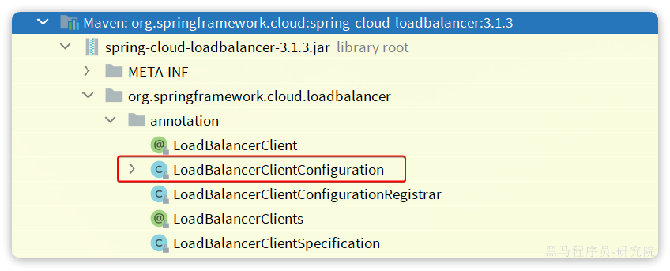

其中定义了默认的负载均衡器：


这个Bean上添加了`@ConditionalOnMissingBean`注解，也就是说如果我们自定义了这个类型的bean，则负载均衡的策略就会被改变。

我们在`hm-cart`模块中的添加一个配置类：


代码如下：

```java
package com.hmall.cart.config;

import com.alibaba.cloud.nacos.NacosDiscoveryProperties;
import com.alibaba.cloud.nacos.loadbalancer.NacosLoadBalancer;
import org.springframework.cloud.client.ServiceInstance;
import org.springframework.cloud.loadbalancer.core.ReactorLoadBalancer;
import org.springframework.cloud.loadbalancer.core.ServiceInstanceListSupplier;
import org.springframework.cloud.loadbalancer.support.LoadBalancerClientFactory;
import org.springframework.context.annotation.Bean;
import org.springframework.core.env.Environment;

public class OpenFeignConfig {

    @Bean
    public ReactorLoadBalancer<ServiceInstance> reactorServiceInstanceLoadBalancer(
            Environment environment, NacosDiscoveryProperties properties,
            LoadBalancerClientFactory loadBalancerClientFactory) {
        String name = environment.getProperty(LoadBalancerClientFactory.PROPERTY_NAME);
        return new NacosLoadBalancer(
                loadBalancerClientFactory.getLazyProvider(name, ServiceInstanceListSupplier.class), name, properties);
    }

}
```

**注意**：

这个配置类千万不要加`@Configuration`注解，也不要被SpringBootApplication扫描到。

由于这个OpenFeignConfig没有加`@Configuration`注解，也就没有被Spring加载，因此是不会生效的。接下来，我们要在启动类上通过注解来声明这个配置。

有两种做法：

- 全局配置：对所有服务生效

```java
@LoadBalancerClients(defaultConfiguration = OpenFeignConfig.class)
```

- 局部配置：只对某个服务生效

```java
@LoadBalancerClients({
        @LoadBalancerClient(value = "item-service", configuration = OpenFeignConfig.class)
})
```

我们选择全局配置：


DEBUG重启后测试，会发现负载均衡器的类型确实切换成功：


### 3.2.2.集群优先

`RoundRobinLoadBalancer`是轮询算法，`RandomLoadBalancer`是随机算法，那么`NacosLoadBalancer`是什么负载均衡算法呢？

我们通过源码来分析一下，先看第一部分：


这部分代码的大概流程如下：

- 通过`ServiceInstanceListSupplier`获取服务实例列表
- 获取`NacosDiscoveryProperties`中的`clusterName`，也就是yml文件中的配置，代表当前服务实例所在集群信息（参考`2.2`小节，分级模型）
- 然后利用stream的filter过滤找到被调用的服务实例中与当前服务实例`clusterName`一致的。简单来说就是**服务调用者与服务提供者要在一个集群
  **

为什么？

假如我现在有两个机房，都部署有`item-service`和`cart-service`服务：


假如这些服务实例全部都注册到了同一个Nacos。现在，杭州机房的`cart-service`要调用`item-service`
，会拉取到所有机房的item-service的实例。调用时会出现两种情况：

- 直接调用当前机房的`item-service`
- 调用其它机房的`item-service`

本机房调用几乎没有网络延迟，速度比较快。而跨机房调用，如果两个机房相距很远，会存在较大的网络延迟。因此，我们应该尽可能避免跨机房调用，优先本地集群调用：


现在的情况是这样的：

- `cart-service`所在集群是`default`
- `item-service`的8081、8083所在集群的`default`
- `item-service`的8084所在集群是`BJ`

`cart-service`访问`item-service`时，应该优先访问8081和8082，我们重启`cart-service`，测试一下：


可以看到原本是3个实例，经过筛选后还剩下2个实例。

查看Debug控制台：


同集群的实例还剩下两个，接下来就需要做负载均衡了，具体用的是什么算法呢？

### 3.2.3.权重配置

我们继续跟踪`NacosLoadBalancer`源码：


那么问题来了， 这个权重是怎么配的呢？

我们打开nacos控制台，进入`item-service`的服务详情页，可以看到每个实例后面都有一个**编辑**按钮：

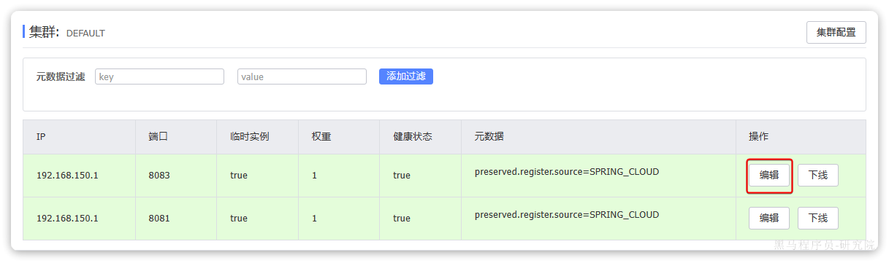

点击，可以看到一个编辑表单：


我们将这里的权重修改为5：


访问10次购物车接口，可以发现大多数请求都访问到了8083这个实例。

# 4.服务保护

在SpringCloud的早期版本中采用的服务保护技术叫做`Hystix`，不过后来被淘汰，替换为`Spring Cloud Circuit Breaker`，其底层实现可以是
`Spring Retry`和`Resilience4J`。

不过在国内使用较多还是`SpringCloudAlibaba`中的`Sentinel`组件。

接下来，我们就分析一下`Sentinel`组件的一些基本实现原理以及它与`Hystix`的差异。

## 4.1.线程隔离

首先我们来看下线程隔离功能，无论是Hystix还是Sentinel都支持线程隔离。不过其实现方式不同。

线程隔离有两种方式实现：

- **线程池隔离**：给每个服务调用业务分配一个线程池，利用线程池本身实现隔离效果
- **信号量隔离**：不创建线程池，而是计数器模式，记录业务使用的线程数量，达到信号量上限时，禁止新的请求

如图：

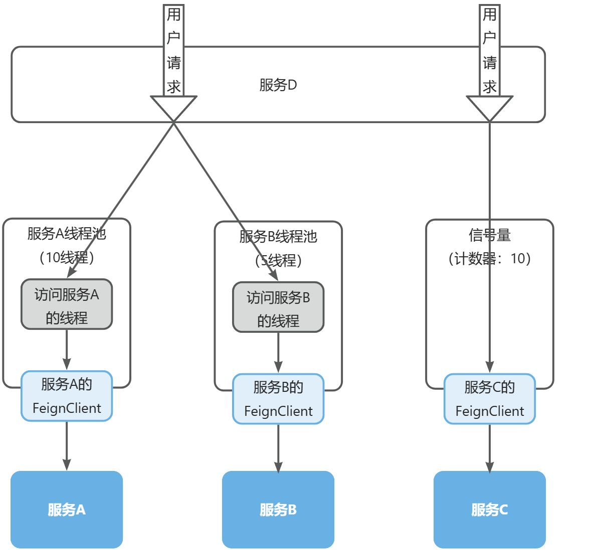

两者的优缺点如下：


Sentinel的线程隔离就是基于信号量隔离实现的，而Hystix两种都支持，但默认是基于线程池隔离。

## 4.2.滑动窗口算法

在熔断功能中，需要统计异常请求或慢请求比例，也就是计数。在限流的时候，要统计每秒钟的QPS，同样是计数。可见计数算法在熔断限流中的应用非常多。sentinel中采用的计数器算法就是滑动窗口计数算法。

### 4.2.1.固定窗口计数

要了解滑动窗口计数算法，我们必须先知道固定窗口计数算法，其基本原理如图：

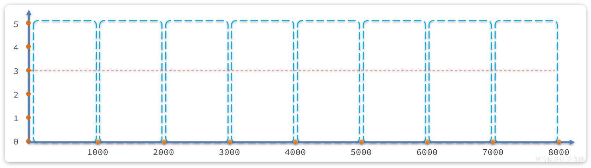

说明：

- 将时间划分为多个窗口，窗口时间跨度称为`Interval`，本例中为1000ms；
- 每个窗口维护1个计数器，每有1次请求就将计数器`+1`。限流就是设置计数器阈值，本例为3，图中红线标记
- 如果计数器超过了限流阈值，则超出阈值的请求都被丢弃。

示例：


说明：

- 第1、2秒，请求数量都小于3，没问题
- 第3秒，请求数量为5，超过阈值，超出的请求被拒绝

但是我们考虑一种特殊场景，如图：


说明：

- 假如在第5、6秒，请求数量都为3，没有超过阈值，全部放行
- 但是，如果第5秒的三次请求都是在4.5~5秒之间进来；第6秒的请求是在5~5.5之间进来。那么从第4.5~5.之间就有6次请求！也就是说每秒的QPS达到了6，远超阈值。

这就是固定窗口计数算法的问题，它只能统计当前某1个时间窗的请求数量是否到达阈值，无法结合前后的时间窗的数据做综合统计。

因此，我们就需要滑动时间窗口算法来解决。

### 4.2.2.滑动窗口计数

固定时间窗口算法中窗口有很多，其跨度和位置是与时间区间绑定，因此是很多固定不动的窗口。而滑动时间窗口算法中只包含1个固定跨度的窗口，但窗口是可移动动的，与时间区间无关。

具体规则如下：

- 窗口时间跨度`Interval`大小固定，例如1秒
- 时间区间跨度为`Interval / n` ，例如n=2，则时间区间跨度为500ms
- 窗口会随着当前请求所在时间`currentTime`移动，窗口范围从`currentTime-Interval`时刻之后的第一个时区开始，到`currentTime`
  所在时区结束。

如图所示：


限流阈值依然为3，绿色小块就是请求，上面的数字是其`currentTime`值。

- 在第1300ms时接收到一个请求，其所在时区就是1000~1500
- 按照规则，currentTime-Interval值为300ms，300ms之后的第一个时区是500~1000，因此窗口范围包含两个时区：500~1000、1000~
  1500，也就是粉红色方框部分
- 统计窗口内的请求总数，发现是3，未达到上限。

若第1400ms又来一个请求，会落在1000~1500时区，虽然该时区请求总数是3，但滑动窗口内总数已经达到4，因此该请求会被拒绝：


假如第1600ms又来的一个请求，处于1500~2000时区，根据算法，滑动窗口位置应该是1000~1500和1500~2000这两个时区，也就是向后移动：


这就是滑动窗口计数的原理，解决了我们之前所说的问题。而且滑动窗口内划分的时区越多，这种统计就越准确。

## 4.3.令牌桶算法

限流的另一种常见算法是令牌桶算法。Sentinel中的热点参数限流正是基于令牌桶算法实现的。其基本思路如图：


说明：

- 以固定的速率生成令牌，存入令牌桶中，如果令牌桶满了以后，多余令牌丢弃
- 请求进入后，必须先尝试从桶中获取令牌，获取到令牌后才可以被处理
- 如果令牌桶中没有令牌，则请求等待或丢弃

基于令牌桶算法，每秒产生的令牌数量基本就是QPS上限。

当然也有例外情况，例如：

- 某一秒令牌桶中产生了很多令牌，达到令牌桶上限N，缓存在令牌桶中，但是这一秒没有请求进入。
- 下一秒的前半秒涌入了超过2N个请求，之前缓存的令牌桶的令牌耗尽，同时这一秒又生成了N个令牌，于是总共放行了2N个请求。超出了我们设定的QPS阈值。

因此，在使用令牌桶算法时，尽量不要将令牌上限设定到服务能承受的QPS上限。而是预留一定的波动空间，这样我们才能应对突发流量。

## 4.4.漏桶算法

漏桶算法与令牌桶相似，但在设计上更适合应对并发波动较大的场景，以解决令牌桶中的问题。

简单来说就是请求到达后不是直接处理，而是先放入一个队列。而后以固定的速率从队列中取出并处理请求。之所以叫漏桶算法，就是把请求看做水，队列看做是一个漏了的桶。

如图：


说明：

- 将每个请求视作"水滴"放入"漏桶"进行存储；
- "漏桶"以固定速率向外"漏"出请求来执行，如果"漏桶"空了则停止"漏水”；
- 如果"漏桶"满了则多余的"水滴"会被直接丢弃。

漏桶的优势就是**流量整型**，桶就像是一个大坝，请求就是水。并发量不断波动，就如图水流时大时小，但都会被大坝拦住。而后大坝按照固定的速度放水，避免下游被洪水淹没。

因此，不管并发量如何波动，经过漏桶处理后的请求一定是相对平滑的曲线：


sentinel中的限流中的排队等待功能正是基于漏桶算法实现的。

# 5.作业

尝试用自己的语言回答下列面试题：

- SpringCloud有哪些常用组件？分别是什么作用？
- 服务注册发现的基本流程是怎样的？
- Eureka和Nacos有哪些区别？
- Nacos的分级存储模型是什么意思？
- OpenFeign是如何实现负载均衡的？
- 什么是服务雪崩，常见的解决方案有哪些？
- Hystix和Sentinel有什么区别和联系？
- 限流的常见算法有哪些？
- 什么是CAP理论和BASE思想？
- 项目中碰到过分布式事务问题吗？怎么解决的？
- AT模式如何解决脏读和脏写问题的？
- TCC模式与AT模式对比，有哪些优缺点
- RabbitMQ是如何确保消息的可靠性的？
- RabbitMQ是如何解决消息堆积问题的？
