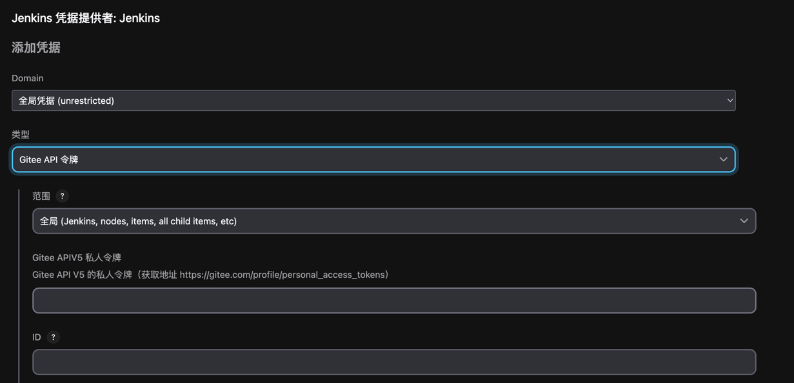

## docker部署jenkins

### 1. 下载jenkins镜像

```shell
docker pull jenkins/jenkins
```

### 2. 启动jenkins容器

```shell
docker run -d -p 9050:8080 \
-uroot \
-p 50000:50000 \
-v ~/jenkins_home:/var/jenkins_home \
-v /etc/localtime:/etc/localtime
--name jenkins \
jenkins/jenkins
```

| 参数                                  | 说明                                               |
|-------------------------------------|--------------------------------------------------|
| -d                                  | 后台运行                                             |
| -uroot                              | 使用root身份进入容器                                     |
| -p 9050:8080                        | 将容器内的8080端口映射到宿主机的9050端口，访问jenkins的端口            |
| -p 50000:50000                      | 将容器内的50000端口映射到宿主机的50000端口                       |
| -v ~/jenkins_home:/var/jenkins_home | 将容器内的/var/jenkins_home目录映射到宿主机的 ~/jenkins_home目录 |
| -v /etc/localtime:/etc/localtime    | 将容器内的时区设置为宿主机的时区                                 |
| --name jenkins                      | 容器名称                                             |
| jenkins/jenkins                     | 镜像名称                                             |

### 3. 查看容器日期，获取启动密码

```shell
docker logs jenkins
```

### 4. 使用浏览器访问jenkins http://serverip:port,输入启动密码

### 5. 安装推荐插件

因为网络原因，需要将插件源设置为国内的，这样才可以安装插件。进入宿主机目录 ~/jenkins_home/，编辑文件
hudson.model.UpdateCenter.xml

```shell
cd ~/jenkins_home/
cat hudson.model.UpdateCenter.xml
```

> [!note]
> 1. 将 url 内容修改为 https://mirrors.tuna.tsinghua.edu.cn/jenkins/updates/update-center.json（清华大学官方镜像）
> 2. 重新启动jenkins容器
> ```shell
> docker restart jenkins
>```

### 6. 创建管理员用户并配置实例

## jenkins部署spring boot项目

### 1. 安装插件

需要安装三个插件：

- Maven Integration: Maven集成工具
- Public Over SSH: 整合工具，通过该工具将jenkins打包好的jar包上传到服务器
- Gitee: 协助使用gitee进行代码拉取

### 2. 准备项目代码

将项目代码上传到gitee或者github

### 3. 准备远程服务器

可以使用云服务器或者本地服务器，需要安装java环境

### 4. 配置Java部署环境

#### 4.1 jenkins全局工具配置

- 配置JDK，jenkins容器中已经安装了JDK，只需要安装即可，配置路径为：/opt/java/openjdk
- 配置Maven，勾选自动安装，不需要手动下载
- 配置Git，jenkins容器中已经安装并配置好了git，默认即可

#### 4.2 远程凭证配置

配置远程服务器的相关信息，包括服务器地址、用户名、密码等（确保远程服务器22端口已经开放）


#### 4.3 配置Gitee信息及凭证

填写git仓库地址和域名<br/>

gitee令牌可以通过https://gitee.com/profile/personal_access_tokens获取<br/>


### 5. 构建maven项目

#### 5.1 创建项目

选择"构建一个maven项目"<br/>

补充git仓库，指定分支<br/>

配置凭证，类型选择Username with password并补充git仓库用户名和密码。<br/>

设置打印时间戳<br/>

设置构建命令，jenkins把源码从git拉下来以后，进行打包，Goals and options输入 <strong>clean package</strong> ;<br/>

SSH Publisher配置,并启动ssh操作容器<br/>


#### 5.2 远程部署脚本

```shell
#!/bin/bash
export JAVA_HOME=/opt/java
export PATH=$JAVA_HOME/bin:$PATH

JAR_PATH=/root/data

JARFILE=jenkins_demo-0.0.1-SNAPSHOT.jar

ps -ef | grep $JARFILE | grep -v grep | awk '{print $2}' | xargs kill -9

java -jar $JAR_PATH/$JARFILE > out.log 2>&1 &
if [ $? = 0 ];then
        sleep 30
        tail -n 50 out.log
fi
```

通过控制台输入可以查看部署日志  


#### 5.3 访问测试

在浏览器输入http://serverip:port/，查看是否部署成功

### 附：参考资料

原文链接：https://blog.csdn.net/qq_31745863/article/details/133632808


